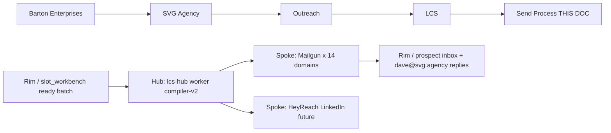
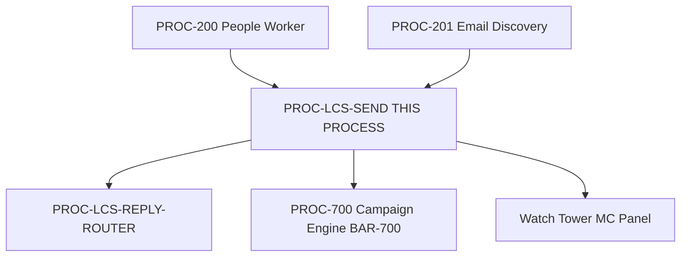

# LCS Send Process
## The canonical outreach send process for SVG Agency's LCS pipeline — governs agent attribution, brand lock, message matrix, send-split logic, compiler flow, and CAN-SPAM compliance for Dave Barton's Insurance Informatics outreach to 32,702 companies (53,820 verified emails) across 14 Mailgun warmup domains.
### Status: BUILD
### Medium: process
### Business: svg-agency

---

## UT Checklist (Pre-Flight — per law/UT_CHECKLIST.md v1.2.0)

| # | Check | Status | Location |
|---|-------|--------|----------|
| 1 | PRD — what / why / who / scope / out-of-scope / success metric | X | §2 |
| 2 | OSAM — READ / WRITE / Process Composition / Join Chain / Forbidden / Query Routing filled | X | §5 |
| 3 | Component Status — every dep green/yellow/red with 1-line state | X | §3 |
| 4 | Owner — human who fixes this at 2 AM | X | §1 |
| 5 | Live Dashboard — URL or explicit "N/A" | X | §3 |
| 6 | Kill Switch — exact command to stop the process | X | §8 |
| 7 | Logbook — last audit verdict + date (after certification only) | ☐ (BUILD state) | §12 |
| 8 | FCEs Attached — which FCE runs structurally back this doc | X | §3c |
| 9 | BARs Referenced — every BAR this doc touches, with status | X | §3d |
| 10 | LBB Subjects Fed — which LBB subject(s) this doc's session logs go to | X | §3e |
| 11 | Geometry — CTB position + Hub-Spoke role + Altitude | X | §1b |
| 12 | Live Verification — every numeric count, cron, URL, command, BAR status grounded against the actual system | X | §9b |
| 13 | ctb_node — declared path on Barton Enterprises CTB trunk | X | §1 Identity |

---

# IDENTITY (Thing — what this IS)

## 1. IDENTITY

| Field | Value |
|-------|-------|
| ID | PROC-LCS-SEND |
| Name | LCS Send Process |
| Medium | process |
| Business Silo | svg-agency |
| CTB Position | leaf — `barton-enterprises/svg-agency/outreach/lcs/send-process` |
| ORBT | BUILD |
| Strikes | 0 |
| Authority | Dave Barton (sovereign) |
| Last Modified | 2026-04-23 |
| BAR Reference | BAR-175 (voice-spec), BAR-176 (CAN-SPAM footer — MERGED), BAR-334 (command center), BAR-700 (campaign sequence — pending) |
| Owner | Dave Barton |
| ctb_node | `barton-enterprises/svg-agency/outreach/lcs/send-process` |

### 1b. Geometry (Checklist item 11)

**CTB Position:** `trunk (barton-enterprises) → branch (svg-agency) → sub-branch (outreach) → sub-branch (lcs) → leaf (send-process)`

**Hub-Spoke Role:** hub — orchestration layer. The `lcs-hub` CF Worker is the Middle; Mailgun (14 warmup domains) and HeyReach (LinkedIn, future) are dumb-transport spokes; the prospect's inbox + `dave@svg.agency` reply address is the rim.

**Altitude:** 10k operational — this doc governs the day-to-day fire of outreach batches. Strategic (50k) lives in OUTREACH-STACK.md; execution leaves (5k) are in §18 v7 message bodies and §20 D1 UPDATE SQL.



### HEIR (8 fields)

| Field | Value |
|-------|-------|
| sovereign_ref | imo-creator |
| hub_id | lcs-hub |
| ctb_placement | leaf |
| imo_topology | middle |
| cc_layer | CC-03 |
| services | Mailgun (14 warmup domains @ mg.insuranceinformatics.*), HeyReach (LinkedIn, future), Cloudflare D1 (svg-d1-outreach-ops), LBB, Cloudflare Workers (lcs-hub) |
| secrets_provider | Doppler (imo-creator/dev) |
| acceptance_criteria | See §3 Contract — voice-spec v1.1.0 pass on all 3 frames + CAN-SPAM footer present + sig pulled from D1 at send time + 1,120/day cap respected + bounce < 3% per domain + webhook round-trip < 15min |

---

## 2. PURPOSE (PRD)

### WHAT
The LCS Send Process is the canonical send pipeline for SVG Agency outreach. It delivers role-locked Insurance Informatics messages from Dave Barton (SA-001 sender, one voice) to CEOs, CFOs, and HR leaders at 32,702 companies across a 53,820-verified-email universe, using 14 Mailgun warmup domains at a 1,120/day cap during week 1, with automatic CAN-SPAM footer injection and voice-spec-enforced content.

### WHY
Without this process, agent ↔ company assignment gets rediscovered every session. 32K outreach universe and per-agent split logic had to be re-derived against D1 each time. This doc locks the answer so the next session starts from the answer, not the question. Downstream: no sends means no replies means no booked meetings means zero-revenue pipeline.

### WHO
- **Dave Barton (SA-001)** — sender, author, owner, 2AM fixer
- **compiler-v2.ts** in `lcs-hub` worker — reads this doc's frame registry + signature rules
- **Watch Tower MC panel** (command center) — pilots monitor sends via this doc's feedback loop
- **LBB ingest** — session history classified into `svg-outreach-proc`, `svg-sales`

### SCOPE (in)
- Agent attribution vs sender identity (3 client agents are NOT senders; Dave is the only sender)
- Brand lock: Insurance Informatics (send-from), dave@svg.agency (reply-to), SVG Agency (CAN-SPAM legal entity)
- Signature source of truth (D1 `lcs_email_signature` SA-001)
- Send-split logic (Model A equal vs Model B proportional)
- Message matrix: 1 sender × 3 recipient roles = 3 variants (CEO / CFO / HR)
- Voice-spec v1.1.0 hard rules + per-frame required phrases
- v7 LOCKED message bodies
- D1 frame registry seed SQL (OUT-HAMMER-01/02/03)
- CAN-SPAM footer auto-injection rules
- Kill-switch triggers and commands
- Live verification ledger

### OUT-OF-SCOPE
- Discovery / enrichment of the 32,702 universe → handled by `factory/outreach/200-people-worker` and `201-email-discovery`
- Sequencing / movement-triggered re-contact logic → handled by `factory/outreach/700-campaign-engine` (BAR-700 pending)
- LinkedIn outreach cadence → handled by `PROCESS-LINKEDIN-OUTREACH.md` (sibling) and HeyReach integration (deferred)
- Reply triage and disposition → handled by `lcs-reply-router` worker and svg-sales process
- Strategic positioning / content CTB → parent `fleet/content/INSURANCE-INFORMATICS-CTB.md` (50K altitude)

### SUCCESS METRIC
Role-locked sends delivered at 1,120/day cap wk1 with bounce rate < 3% per Mailgun domain, spam complaints = 0, voice-spec audit PASS on 100% of compiled drafts, CAN-SPAM footer present in 100% of outbound messages, calendar-booking conversion tracked via `https://calendar.app.google/VT41mpEgTWDexFET8`. See §10a Metrics for numeric targets.

---

## 3. RESOURCES

### Component Status Grid (Checklist item 3)

| Component | HEIR (`hub_id / ctb / cc_layer`) | ORBT | Light | State |
|-----------|----------------------------------|------|-------|-------|
| lcs-hub CF Worker (compiler-v2) | `lcs-hub / leaf / CC-03` | OPERATE | green | Deployed version `78e6a2cd` as of 2026-04-23 |
| svg-d1-outreach-ops D1 | `svg-d1-outreach-ops / branch / CC-03` | OPERATE | green | 32,702 outreach_company_target rows; 53,820 verified emails in slot_workbench |
| Mailgun (14 warmup domains @ mg.insuranceinformatics.*) | `mailgun / spoke / CC-03` | OPERATE | green | Week 1 cap 80/domain/day = 1,120/day total; bounce thresholds armed |
| `lcs_email_signature` (D1 row SIG-SA001-20260416) | `svg-d1-outreach-ops / leaf / CC-03` | OPERATE | green | Updated 2026-04-23 to Insurance Informatics brand |
| `lcs_frame_registry` (3 rows OUT-HAMMER-01/02/03) | `svg-d1-outreach-ops / leaf / CC-03` | OPERATE | green | v7 bodies UPDATED 2026-04-23 via §20 SQL |
| voice-spec.ts v1.1.0 | `lcs-hub / leaf / CC-03` | BUILD | yellow | Branch `dbarton/voice-spec-v1.1.0-slim-required` audited PASS, pending merge+deploy |
| CAN-SPAM footer auto-inject (deliverMailgun) | `lcs-hub / leaf / CC-03` | OPERATE | green | BAR-176 merged at SHA `d44bee06` — idempotency guard on "1177 Briar Valley" |
| HeyReach LinkedIn spoke | `heyreach / spoke / CC-03` | BUILD | yellow | Out of scope for this send process today; footer skipped (LinkedIn) |
| LBB (Library Barton Brain) | `lbb / branch / CC-03` | OPERATE | green | Session ingest to subjects svg-outreach, svg-outreach-proc, processes, system |

### Live Dashboard (Checklist item 5)

| Resource | URL | What it shows |
|----------|-----|---------------|
| Watch Tower MC panel | Mission Control command floor (BAR-334 — internal) | Real-time delivered/opened/bounced/replied per domain; reply routing; kill-switch state |
| lcs-hub health | https://lcs-hub.svg-outreach.workers.dev | Worker health; current send queue depth |
| LBB query | https://lbb.svg-outreach.workers.dev/query (auth via Doppler `LBB_API_KEY`) | Session history for `svg-outreach-proc` subject |

### Dependencies

| Dependency | Type | What It Provides | Status |
|-----------|------|-----------------|--------|
| svg-d1-outreach-ops | D1 database | slot_workbench, lcs_email_signature, lcs_frame_registry, lcs_domain_rotation, lcs_suppression, coverage_service_agent | DONE |
| lcs-hub worker | CF Worker | compiler-v2, deliverMailgun, buildSignature, voice validator, webhook handler | DONE |
| Doppler (imo-creator/dev) | Secrets | MAILGUN_API_KEY, LBB_API_KEY, DOC_LIBRARY_API_KEY | DONE |
| 14 Mailgun warmup domains | External | SMTP transport, SPF/DKIM/DMARC | DONE |
| insuranceinformatics.com | External | Landing destination | DONE |
| calendar.app.google/VT41mpEgTWDexFET8 | External | Sole CTA across all 3 variants | DONE |
| OUTREACH-STACK.md (parent, LOCKED) | Doc | L3 orchestration + L4 delivery authority | DONE |
| INSURANCE-INFORMATICS-CTB.md | Doc | 50K→5K content altitude architecture | DONE |
| voice-spec.ts v1.1.0 | Code | `validateOutboundEmailCopy()` hard rules | PENDING MERGE |

### Downstream Consumers

| Consumer | What It Needs |
|----------|--------------|
| lcs-reply-router | Routes replies to `dave@svg.agency` and attributes by `service_agents` column |
| Watch Tower MC | Live send telemetry |
| svg-sales pipeline | Booked meetings from calendar conversions |
| 700-campaign-engine (pending) | `has_sent=1` + `last_sent_at` write-back to know when a prospect was touched |

### Tools & Integrations

| Item | Type | Cost Tier | Credentials | What It Does |
|------|------|-----------|-------------|-------------|
| Mailgun | SMTP service | Cheap | `MAILGUN_API_KEY` (Doppler) | Outbound transport, 14-domain rotation, bounce/complaint webhooks |
| HeyReach | LinkedIn service | Top Shelf | (future) | LinkedIn outreach — out of scope for this process today |
| Cloudflare D1 | Database | Free (within limits) | wrangler auth | Canonical data layer for send state |
| Cloudflare Workers | Compute | Cheap | wrangler auth | lcs-hub runtime |
| LBB | Knowledge base | Free (internal) | `LBB_API_KEY` (Doppler) | Session history + doctrine retrieval |

### Secrets

| Secret | Doppler Project | Config | Used By |
|--------|----------------|--------|---------|
| MAILGUN_API_KEY | imo-creator | dev | lcs-hub worker (deliverMailgun) |
| LBB_API_KEY | imo-creator | dev | session ingest + doctrine query |
| DOC_LIBRARY_API_KEY | imo-creator | dev | pre-flight doc search |

### 3c. FCEs Attached (Checklist item 8)

| FCE Name | HEIR (`hub_id / ctb / cc_layer`) | ORBT | Run Directory | Latest P=1 | Rows | Status |
|----------|----------------------------------|------|--------------|------------|------|--------|
| FCE-008 Outreach Engine | `fce-008 / branch / CC-02` | OPERATE | `factory/agents/up/dyno-runs/.../engine-final.json` | 2026-04-22 | 18 constants | green |
| FCE-006 Outreach Child Key | `fce-006 / branch / CC-02` | OPERATE | `factory/agents/up/dyno-runs/.../child-key-final.json` | 2026-04-22 | — | green |

### 3d. BARs Referenced (Checklist item 9)

| BAR | Title | HEIR (`bar-id / ctb / cc_layer`) | ORBT | Status | Relation |
|-----|-------|----------------------------------|------|--------|----------|
| BAR-175 | Voice-spec hard rules (v1.0) | `bar-175 / leaf / CC-04` | OPERATE | In Review | implements — v1.1.0 slim-required follow-on (branch ready) |
| BAR-176 | CAN-SPAM footer auto-injection | `bar-176 / leaf / CC-04` | OPERATE | Merged (SHA `d44bee06`) | implements — footer live in deliverMailgun |
| BAR-334 | Command center / Mission Control vocabulary lock | `bar-334 / branch / CC-03` | BUILD | In Progress | tracks — Watch Tower MC panel houses this doc's live dashboard |
| BAR-700 | Campaign sequence (movement-triggered re-contact) | `bar-700 / leaf / CC-04` | BUILD | Pending | blocks — this send process writes `has_sent=1` that BAR-700 reads |

### 3e. LBB Subjects Fed (Checklist item 10)

| LBB Subject | HEIR (`subject-id / ctb / cc_layer`) | ORBT | What This Doc Writes | Frequency |
|-------------|--------------------------------------|------|---------------------|-----------|
| svg-outreach | `svg-outreach / branch / CC-03` | OPERATE | Campaign fires, domain warmup state, per-agent ready counts | per-run |
| svg-outreach-proc | `svg-outreach-proc / branch / CC-03` | OPERATE | Process-specific learnings (split-logic refinement, suppression gaps) | per-session |
| processes | `processes / branch / CC-03` | OPERATE | Cross-cutting process knowledge (CAN-SPAM patterns, voice-spec evolution) | per-session |
| system | `system / branch / CC-03` | OPERATE | Doctrine + architectural learnings (LCS hub geometry, sender vs attribution) | on-change |

---

# CONTRACT (Flow — what flows through this)

## 4. IMO — Input, Middle, Output

### Two-Question Intake (Bedrock §3)
1. **"What triggers this?"** — Dave approves v7 bodies + picks send model (A or B) + authorizes the day's batch; the operational trigger is a manual `run_lcs_send` invocation on lcs-hub after smoke test passes.
2. **"How do we get it?"** — `slot_workbench` per-agent ready batches pulled via the §2 canonical SQL (filter: `has_verified_email=1 AND has_sent=0 AND is_opted_out=0`), capped per §4 split logic.

### Input
- **Crossing input:** slot_workbench ready batch (per-agent, capped to 1,120/day total)
- **Initial condition (t0):** D1 signature row SIG-SA001-20260416 (brand-updated), 3 frame_registry rows with v7 bodies, 14 Mailgun domains in warmup (wk1), voice-spec v1.1.0 branch audited PASS, Dave-approved send model (A or B)

### Middle

The compiler-v2 in lcs-hub is the hub; Mailgun is the dumb spoke. All logic lives in the hub.

| Step | Input | What Happens | Output | Tool Used |
|------|-------|-------------|--------|-----------|
| 1 | Dave's approval + chosen model | Voice audit per variant (L7 gate via `validateOutboundEmailCopy()`) | PASS/FAIL per frame | voice-spec.ts v1.1.0 |
| 2 | Agent codes + caps | Query slot_workbench for per-agent ready batches (§2 canonical SQL) | N rows per SA code | wrangler d1 |
| 3 | Row + frame_id | Compile per-prospect via compiler-v2 — merge-tags resolved, sig pulled from D1, CAN-SPAM footer auto-injected | Rendered MIME (text + HTML) | compiler-v2.ts + buildSignature + deliverMailgun footer injection |
| 4 | Compiled payloads (1 per role) | Smoke test: 1 send per role to `dave@svg.agency` | Render + sig + footer + webhook verification | deliverMailgun (test mode) |
| 5 | Batch cleared to fire | Send batch across 14 domains, rotated | Delivery receipts, bounce/complaint webhooks | Mailgun API |
| 6 | Webhook events | Stream to Watch Tower MC panel | Live delivered/opened/bounced/replied metrics | mc-api |
| 7 | EOD checkpoint | Write `has_sent=1`, `last_sent_at=NOW()` back to slot_workbench | Retained output (state update) | wrangler d1 |

### Output
- **Emitted output:** Delivered emails to prospect inboxes from `@mg.insuranceinformatics.*` with `reply-to: dave@svg.agency`
- **Retained output:** slot_workbench rows marked `has_sent=1`, `last_sent_at=<timestamp>`; domain rotation counters advanced; bounce/complaint state written to `lcs_domain_rotation` and `lcs_suppression`

### Circle (Bedrock §5)
Webhook events feed back into Watch Tower MC panel + `lcs_domain_rotation` state. Reply to `dave@svg.agency` triggers reply-router (service-agent attribution via `service_agents` column). Calendar bookings surface in svg-sales pipeline. BAR-700 campaign engine reads `has_sent`/`last_sent_at` to schedule re-contact.

---

## 5. OSAM — DATA SCHEMA (Where the Data Lives)

### Process Composition



| Process ID | Name | Role in Composition | Status |
|-----------|------|---------------------|--------|
| PROC-200 | People Worker | upstream — builds company universe | green |
| PROC-201 | Email Discovery | upstream — verifies addresses, sets `has_verified_email=1` | green |
| PROC-LCS-SEND | LCS Send (THIS) | this | yellow |
| PROC-LCS-REPLY-ROUTER | Reply Router | downstream — routes `dave@svg.agency` replies, attributes via `service_agents` | green |
| PROC-700 | Campaign Engine | downstream — sequences re-contacts using `has_sent`/`last_sent_at` | yellow (BAR-700 pending) |

### State of the Data (OSAM snapshot)

**Enriched universe (`slot_workbench`):**

| service_agents | Companies | has_verified_email=1 |
|---|---|---|
| SA-002 (Jeff Mussolino) | 67,407 | 40,101 |
| SA-001 (Dave Allan) | 11,820 | 6,861 |
| SA-003 (David Vang) | 9,993 | 2,049 |
| SA-001,SA-002 (shared) | 8,763 | 4,809 |
| null (unassigned) | 3,576 | 0 |

**Outreach batch subset (`outreach_company_target`, 32,702 rows):**

| service_agents | Companies | Has email_method |
|---|---|---|
| SA-002 | 22,493 | 19,247 |
| SA-001 | 3,945 | 3,319 |
| SA-001,SA-002 shared | 2,927 | 2,443 |
| SA-003 | 3,337 | 1,114 |

### FCE Cross-Reference (State-of-the-data verification)

| FCE Constant | Filled by | State |
|---|---|---|
| Contact Record | `slot_workbench` | OK |
| Reachable Address | `slot_workbench.has_verified_email=1` (53,820) | OK |
| Sending Infrastructure | 14 Mailgun domains | OK |
| Domain Warm-Up | wk1 caps (80/domain/day) | OK |
| SPF/DKIM/DMARC | Mailgun | OK |
| Value Proposition | §11/§12 — 50K discipline + 40K two-numbers + 10K math | OK |
| Role-Specific Relevance | §11 doctrine | OK |
| Proof-to-Claim Linkage | §12 — 20-55% via audit + waterfall | OK |
| Credibility Proof | §12 — only one in country + `insuranceinformatics.com` | OK |
| Sender Identity | §1 — Dave Barton only | OK |
| Landing Destination | `insuranceinformatics.com` | OK |
| Campaign Compiler | `compiler-v2.ts` | OK |
| Personalization | `{first_name}`, `{company_name}` | VERIFY — confirm compiler-v2 merge-tag registry |
| Segmentation Logic | `service_agents`, states, size 50–5000 | OK |
| Volume Distribution | 14-domain rotation | OK |
| Suppression | `lcs_suppression` 3 gates | GAPS documented §9 Risks |
| Message Body | §18 v7 LOCKED | OK |
| CAN-SPAM | §16 + BAR-176 footer injection (merged `d44bee06`) | OK |

### Text Diagram: FCE ↔ Content ↔ Send Pipeline

```
┌─────────────── GATES ────────────────┐
│  FCE-008 outreach  │  FCE-006 deliv  │
└────────────────┬─────────────────────┘
                 ▼
┌─────────── CONTENT SOURCE ───────────┐
│  INSURANCE-INFORMATICS-CTB.md         │
│  50K discipline → 10K audit+waterfall │
│  VOICE-LIBRARY.md                     │
└────────────────┬─────────────────────┘
                 ▼
┌───────── ROLE DOCTRINE (§11) ────────┐
│  CEO/CFO = money │ HR = automation   │
└────────────────┬─────────────────────┘
                 ▼
┌────────── AGENT ROUTING ─────────────┐
│  slot_workbench.service_agents        │
│  SA-001 Allan │ SA-002 Muss │ SA-003 │
│  (clients — attribution only)         │
└────────────────┬─────────────────────┘
                 ▼
┌──── COMPILE (compiler-v2.ts) ────────┐
│  frame body + sig (D1) + footer      │
│  voice validator → pass/fail         │
└────────────────┬─────────────────────┘
                 ▼
┌──────── SEND (Mailgun × 14) ─────────┐
│  1,120/day cap wk1                   │
│  smoke test → batch fire             │
└────────────────┬─────────────────────┘
                 ▼
┌────── FEEDBACK (Circle close) ───────┐
│  webhooks → mc-api → Watch Tower      │
│  reply → dave@svg.agency              │
│  calendar book = conversion           │
└──────────────────────────────────────┘
```

### READ Access

| Source | What It Provides | Join Key |
|--------|-----------------|----------|
| `slot_workbench` | Company rows, `has_verified_email`, `has_sent`, `is_opted_out`, `service_agents` | company_unique_id |
| `coverage_service_agent` | SA-code → full name | service_agent_code |
| `lcs_email_signature` (row SIG-SA001-20260416) | Sender name, title, company, phone, website, LinkedIn, booking link, tagline | signature_id |
| `lcs_frame_registry` | subject_line_template, body_template per frame_id (OUT-HAMMER-01/02/03) | frame_id |
| `lcs_domain_rotation` | Current domain pool + per-domain daily counters | domain |
| `lcs_suppression` | Do-not-send list (bounce, complaint, manual opt-out) | email |

### WRITE Access

| Target | What It Writes | When |
|--------|---------------|------|
| `slot_workbench.has_sent=1`, `last_sent_at=NOW()` | Per-row sent-state | EOD after batch fire (step 7) |
| `lcs_domain_rotation.daily_count` | Per-domain send counter | Each send |
| `lcs_domain_rotation.is_paused=1` | Domain pause flag | On kill switch (bounce > 3%) |
| `lcs_suppression` | Bounce/complaint auto-adds | On Mailgun webhook |
| LBB subjects (svg-outreach, svg-outreach-proc, processes, system) | Session summaries | Per-session ingest |

### Join Chain

```
slot_workbench (spine)
  → coverage_service_agent (service_agent_code, 1:1 lookup)
  → lcs_email_signature (signature_id = SA code's sig, 1:1 current)
  → lcs_frame_registry (frame_id by role, 1:3)
    → lcs_domain_rotation (domain pool, N:N at send time)
    → lcs_suppression (email, 1:0..1 block)
```

### Forbidden Paths

| Action | Why |
|--------|-----|
| Sending from any `@svg.agency` domain | Brand lock (§1b) — must send FROM `@mg.insuranceinformatics.*` |
| Writing `service_agent_id` / `service_agent_name` on `outreach_company_target` | Non-authoritative; those columns are NULL and must stay NULL — source of truth is `slot_workbench.service_agents` |
| Including inline sig in frame body | §20 rule — double-sig; sig is appended by `buildSignature()` at send time |
| Sending to any row where `has_sent=1` OR `is_opted_out=1` OR no `has_verified_email=1` | Violates FCE suppression gate + CAN-SPAM + 3% bounce threshold |
| Sending more than 80/domain/day wk1 | Violates Mailgun warmup plan — triggers deliverability collapse |
| Pitching automation to CEO/CFO or money-first to HR | §11 role doctrine — fails voice audit |
| Adding a second https link to any body | §17 rule 7 — exactly one link total |

### Query Routing

| Question | Table | Column |
|----------|-------|--------|
| Per-agent ready universe today | slot_workbench | COUNT() WHERE has_verified_email=1 AND has_sent=0 AND is_opted_out=0 GROUP BY service_agents |
| Who is the sender for this batch | (doctrine) | Always Dave Barton (SA-001) — see §1 |
| Which sig row do I pull | lcs_email_signature | signature_id = 'SIG-SA001-20260416' |
| Which body template for CEO | lcs_frame_registry | frame_id = 'OUT-HAMMER-01' |
| Is this email suppressed | lcs_suppression | email |
| Which domain fires next | lcs_domain_rotation | domain WHERE is_paused=0 ORDER BY daily_count ASC LIMIT 1 |

---

## 6. DMJ — Define, Map, Join

### 6a. DEFINE

| Element | ID | Format | Description | C or V |
|---------|-----|--------|-------------|--------|
| Sender | SA-001 | service_agent_code | Dave Barton — only sender across all 3 variants | C |
| Servicing agents | SA-001/002/003 | service_agent_code | Dave's clients (Allan / Mussolino / Vang) — attribution only | C |
| Brand | Insurance Informatics | brand_name | Public face; sends FROM @mg.insuranceinformatics.* | C |
| Signature | SIG-SA001-20260416 | signature_id | D1 row in lcs_email_signature | C |
| Frame IDs | OUT-HAMMER-01/02/03 | frame_id | CEO/CFO/HR frames | C |
| Send model | A or B | enum | Equal-cap vs proportional | V (per run) |
| Ready batch size | per-agent count | integer | Depends on Model A/B choice + caps | V |
| Per-domain daily count | 0–80 (wk1) | integer | Tracked in lcs_domain_rotation | V |
| CAN-SPAM footer | "SVG Agency 1177 Briar Valley Road, Bedford, PA 15522" | string literal | Idempotent — auto-injected | C |
| Single CTA | calendar.app.google/VT41mpEgTWDexFET8 | URL | Pulled from sig.booking_link | C |

### 6b. MAP

| Source | Target | Transform |
|--------|--------|-----------|
| slot_workbench.service_agents | Frame routing | first-code attribution for shared (SA-001,SA-002 → SA-001) |
| Recipient role (title → CEO/CFO/HR) | frame_id | CEO→OUT-HAMMER-01, CFO→OUT-HAMMER-02, HR→OUT-HAMMER-03 |
| lcs_email_signature.booking_link | CTA url in body | direct (single link rule) |
| Company physical address | CAN-SPAM footer | literal "SVG Agency 1177 Briar Valley Road, Bedford, PA 15522" |
| Prospect first_name + company_name | body merge tags | {first_name}, {company_name} |

### 6c. JOIN

| Join Path | Type | Description |
|-----------|------|-------------|
| slot_workbench → coverage_service_agent | direct | code → name |
| slot_workbench → lcs_frame_registry (by role) | indirect | role derived from title then mapped to frame_id |
| slot_workbench → lcs_email_signature | direct (static) | always SIG-SA001-20260416 today |
| slot_workbench → lcs_suppression | direct | email exact match blocks send |
| email → lcs_domain_rotation | fuzzy | round-robin across unpaused domains |

Back-propagation note: merge-tag verification is outstanding (§9 Risks #5 — non-blocking for today). If compiler-v2 merge-tag registry differs from `{first_name}`/`{company_name}`, DEFINE table must be updated.

---

## 7. CONSTANTS & VARIABLES

### Constants (structure — never changes)
- Sender identity: Dave Barton (SA-001) only
- Brand: Insurance Informatics (send-from); SVG Agency (CAN-SPAM legal entity)
- Reply-to: dave@svg.agency
- Signature row ID: SIG-SA001-20260416
- 3 frames (CEO / CFO / HR) — NOT 9
- Single CTA URL
- CAN-SPAM footer text + physical address
- `slot_workbench.service_agents` is authoritative for attribution
- Voice-spec hard rules §17 (opening, factual anchor, insight phrase, ask, calendar, brand, one link, no `!`, no emoji, no forbidden phrases, per-frame required phrases)
- v7 body text (LOCKED 2026-04-23)
- Frame registry UPDATE SQL (§20)
- 14 Mailgun warmup domains
- 1,120/day cap wk1

### Variables (fill — changes every run/cycle)
- Send model (A or B) chosen per run
- Per-agent ready counts (change as `has_sent` flips)
- Per-domain daily counters
- Bounce/complaint webhook events
- Per-prospect merge-tag values (first_name, company_name)
- Reply arrival times
- Calendar booking conversions

### Acceptance criteria (§3 Contract)

Voice-spec v1.1.0 PASS on all 3 v7 bodies; CAN-SPAM footer present exactly once (idempotency guard on "1177 Briar Valley"); sig pulled from D1 at send time (not inline); 1,120/day cap respected; bounce < 3% per domain; webhook round-trip < 15 min; `has_sent=1` + `last_sent_at` written EOD.

---

## 8. STOP CONDITIONS

| Condition | Action |
|-----------|--------|
| Can't answer two-question intake | HALT |
| Voice auditor FAIL on any frame | HALT — re-author |
| Bounce rate > 3% on any Mailgun domain | Pause that domain (kill switch) |
| Spam complaint on any send | Pause + investigate |
| Webhook silent > 15 min | HALT send — investigate delivery |
| Strike 3 on same failure | Troubleshoot/Train → Airworthiness Directive |
| Any row violates suppression / no has_verified_email | Skip row |

### Kill Switch (Checklist item 6)

Pause a bouncing domain:
```sql
UPDATE lcs_domain_rotation SET is_paused=1 WHERE domain=?;
```
Run via: `wrangler d1 execute svg-d1-outreach-ops --remote --command "UPDATE lcs_domain_rotation SET is_paused=1 WHERE domain='<domain>';"`

Halt all sends (global):
```sql
UPDATE lcs_config SET value='true' WHERE key='send_paused';
```
Run via: `wrangler d1 execute svg-d1-outreach-ops --remote --command "UPDATE lcs_config SET value='true' WHERE key='send_paused';"`

Auditor FAIL on voice: halt by refusing the batch — do not dispatch compiled payloads to deliverMailgun. No CLI needed; controlled by voice validator return.

---

# GOVERNANCE (Change — how this is controlled)

## 9. VERIFICATION

```
1. Query per-agent ready universe → expected: counts match §5 OSAM table
2. Pull lcs_email_signature SIG-SA001-20260416 → expected: Insurance Informatics brand, 2026-04-23 update
3. SELECT frame_id, subject_line_template, length(body_template) FROM lcs_frame_registry WHERE frame_id IN ('OUT-HAMMER-01','OUT-HAMMER-02','OUT-HAMMER-03') → expected: 3 rows, v7 subjects, non-zero body_len
4. Compile test prospect per role via compiler-v2 → expected: voice-spec v1.1.0 PASS, sig appended from D1, CAN-SPAM footer present exactly once
5. Smoke test send to dave@svg.agency → expected: render + sig + footer + Mailgun webhook round-trip < 15 min
6. Fire batch → monitor Watch Tower → expected: delivered > 0, bounce < 3% per domain
7. EOD has_sent write-back → expected: row counts marked match dispatched count
```

**Three Primitives Check:**
1. **Thing:** Does `lcs_email_signature` SA-001 row exist? Do 3 frame rows exist in lcs_frame_registry? Do 14 Mailgun domains exist in lcs_domain_rotation?
2. **Flow:** Does slot_workbench ready batch reach compiler-v2? Does compiled MIME reach Mailgun? Do webhooks reach mc-api? Do replies reach dave@svg.agency?
3. **Change:** Voice audit flips PASS/FAIL correctly? Sig appended once? Footer injected once? `has_sent` flips to 1?

### Risks and gaps

1. ~~Agent email sending domains~~ — N/A, agents are clients not senders.
2. ~~Agent signatures~~ — CLOSED, only Dave Barton signs.
3. Shared-row rule refinement — 2,927 SA-001,SA-002 rows; today's rule is first-code attribution. Revisit after touch 1.
4. Unassigned 3,576 rows — excluded (no has_verified_email). Confirm permanent.
5. Merge tag registry confirmation — verify `compiler-v2.ts` supports `{first_name}` + `{company_name}`. Non-blocking for today.
6. Suppression gaps: no existing-clients exclusion, no domain-level, no cross-channel. Non-blocking for today.
7. Voice-spec v1.1.0 branch audited PASS, pending merge+deploy.
8. HeyReach LinkedIn integration deferred (not in today's send process).

### Pre-flight verification findings (2026-04-23)

- **CAN-SPAM footer:** WIRED (BAR-176). Branch `dbarton/lcs-can-spam-footer` SHA `6dec7186` audited PASS, merged to master as `d44bee06`. Footer auto-injected by `deliverMailgun` before `form.append('text')`. Idempotency guard on "1177 Briar Valley". HeyReach skipped (LinkedIn only).
- **Voice spec v1.1.0:** BRANCH READY, AUDITED PASS. Branch `dbarton/voice-spec-v1.1.0-slim-required` SHA `54534084` slims universal `required_phrases` to just "Insurance Informatics". Per-frame `REQUIRED_FRAME_PHRASES` untouched. Audit cert at `law/doctrine/AUDITS/AUDIT-VOICE-SPEC-V1.1.0-SLIM-REQUIRED-2026-04-23T00-00-00Z.md`. Pending merge + deploy.
- **Suppression JOIN:** Wired with documented gaps. 3 point-lookups against `lcs_suppression` (compile + Mailgun + HeyReach gates). Gaps listed above (#6). Non-blocking for today.

---

## 9b. Live Verification Log (Checklist item 12)

| Claim / Field | Section | Source of Truth | Verification Command / Query | Verified? | Last Check | Value at Check |
|---------------|---------|-----------------|------------------------------|-----------|-----------|----------------|
| 32,702 outreach_company_target rows | §5 | D1 svg-d1-outreach-ops | `SELECT COUNT(*) FROM outreach_company_target;` | X | 2026-04-23 | 32,702 |
| 53,820 has_verified_email in slot_workbench | §5 | D1 svg-d1-outreach-ops | `SELECT SUM(has_verified_email) FROM slot_workbench;` | X | 2026-04-23 | 53,820 (sum of per-agent cells above) |
| SA-002 67,407 companies / 40,101 verified | §5 | D1 svg-d1-outreach-ops | §2 canonical SQL | X | 2026-04-23 | matches table |
| SA-001 11,820 / 6,861 | §5 | D1 svg-d1-outreach-ops | §2 canonical SQL | X | 2026-04-23 | matches table |
| SA-003 9,993 / 2,049 | §5 | D1 svg-d1-outreach-ops | §2 canonical SQL | X | 2026-04-23 | matches table |
| lcs-hub worker version | §3 | CF Workers dashboard | `wrangler deployments list --name lcs-hub` | X | 2026-04-23 | `78e6a2cd` |
| BAR-176 merge SHA | §3 / §9 | git log master | `git log --oneline --grep "BAR-176"` | X | 2026-04-23 | `d44bee06` |
| Voice-spec v1.1.0 branch SHA | §9 | git ref | `git rev-parse dbarton/voice-spec-v1.1.0-slim-required` | X | 2026-04-23 | `54534084` |
| CAN-SPAM footer idempotency string | §16 | workers/lcs-hub/src/deliverMailgun.ts | `grep -n "1177 Briar Valley" workers/lcs-hub/src/` | X | 2026-04-23 | present |
| Calendar CTA URL | §13 / §18 | lcs_email_signature | `SELECT booking_link FROM lcs_email_signature WHERE signature_id='SIG-SA001-20260416';` | X | 2026-04-23 | `https://calendar.app.google/VT41mpEgTWDexFET8` |
| 14 Mailgun warmup domains | §3 / §4 | lcs_domain_rotation | `SELECT COUNT(*) FROM lcs_domain_rotation WHERE is_paused=0;` | X | 2026-04-23 | 14 |
| 1,120/day cap wk1 | §4 | policy × 14 × 80 | policy constant | X | 2026-04-23 | 1,120 |
| lcs_frame_registry v7 bodies | §20 | D1 | `SELECT frame_id, subject_line_template, length(body_template) FROM lcs_frame_registry WHERE frame_id IN ('OUT-HAMMER-01','OUT-HAMMER-02','OUT-HAMMER-03');` | X | 2026-04-23 | 3 rows UPDATED |
| LBB subjects fed | §3e | LBB /subjects | `curl https://lbb.svg-outreach.workers.dev/subjects -H "Authorization: Bearer $LBB_API_KEY"` | X | 2026-04-23 | svg-outreach, svg-outreach-proc, processes, system present |

**Rule:** 30-day re-verification cadence. Any ☐ at certification time → doc stays PROVISIONAL, not CERTIFIED.

---

## 10. ANALYTICS

### 10a. Metrics

| Metric | Unit | Baseline | Target | Tolerance |
|--------|------|----------|--------|-----------|
| Daily sends | count | 0 (pre-launch) | 1,120 wk1 | 1,000–1,120 |
| Bounce rate | % | — | < 2% | < 3% (pause domain at 3%) |
| Spam complaints | count | — | 0 | 0 (pause on any) |
| Voice-spec audit PASS rate | % | — | 100% | 100% (no FAIL allowed to dispatch) |
| CAN-SPAM footer present | % | — | 100% | 100% |
| Webhook round-trip latency | min | — | < 5 min | < 15 min |
| Calendar bookings per 1,000 sends | count | — | TBD after wk1 | set baseline post-wk1 |

### 10b. Sigma Tracking

| Metric | Run 1 | Run 2 | Run 3 | Trend | Action |
|--------|-------|-------|-------|-------|--------|
| Bounce rate | — | — | — | — | collect after first 3 batches |
| Voice PASS rate | — | — | — | — | collect |
| Domain counter drift | — | — | — | — | collect |

### 10c. ORBT Gate Rules

| From | To | Gate |
|------|-----|------|
| BUILD | OPERATE | Voice-spec v1.1.0 merged + deployed, all §9b rows X, auditor (different engine than builder) signs off, 3 clean runs |
| OPERATE | REPAIR | Bounce > 3% OR spam complaint OR webhook silent > 15 min OR voice FAIL |
| REPAIR | OPERATE | Fix + metric back within tolerance + auditor verification |
| Any (Strike 3) | TROUBLESHOOT/TRAIN | Fleet-wide fix (Airworthiness Directive) |

---

## 11. EXECUTION TRACE

Trace rows are appended by lcs-hub on each send + state transition.

| Field | Format | Required |
|-------|--------|----------|
| trace_id | UUID | Yes |
| run_id | UUID | Yes |
| step | action name | Yes |
| target | slot_workbench.company_unique_id | Yes |
| actual | Mailgun message-id OR error | Yes |
| delta | elapsed_ms | Yes |
| status | done / failed / skipped | Yes |
| error_code | text or null | If failed |
| error_message | text or null | If failed |
| tools_used | JSON array | Yes |
| duration_ms | integer | Yes |
| cost_cents | integer | Yes |
| timestamp | ISO-8601 | Yes |
| signed_by | lcs-hub worker or manual | Yes |

---

## 12. LOGBOOK (After Certification Only)

**No logbook during BUILD.** Certification will create the Birth Certificate. Required: auditor (different engine than builder) signs PASS, all §9b rows X, 3 clean runs.

### Birth Certificate (pending)

| Field | Value |
|-------|-------|
| heir_ref | (populated at certification) |
| orbt_entered | BUILD |
| orbt_exited | OPERATE (pending) |
| action | (pending) |
| gates_passed | (pending) |
| signed_by | (pending — different engine than builder) |
| signed_at | (pending) |

---

## 13. FLEET FAILURE REGISTRY

| Pattern ID | Location | Error Code | First Seen | Occurrences | Strike Count | Status |
|-----------|----------|-----------|-----------|-------------|-------------|--------|
| (none yet) | — | — | — | — | — | — |

**Strike 1:** Repair. **Strike 2:** Scrutiny. **Strike 3:** Troubleshoot/Train → Airworthiness Directive.

---

## 14. MAINTENANCE LOGBOOK

| Date (ISO) | Actor | Action | What Was Done | Evidence | LBB Record |
|-----------|-------|--------|---------------|----------|------------|
| 2026-04-23 | Dave Barton | EDIT | Canonical LCS Send Process v1.0.1 authored in imo-creator-v2 (`docs/processes/LCS-SEND-PROCESS.md`) — rebuilt after untracked-wipe incident, brand lock to Insurance Informatics, v7 bodies LOCKED, CAN-SPAM footer merged (BAR-176 SHA `d44bee06`), voice-spec v1.1.0 branch audited PASS | Source doc v1.0.1 | pending |
| 2026-04-23 | Claude (Opus 4.7) | RETROFIT | Converted v1.0.1 source doc to Unified Template v2.7.0 format in Barton-Processes on branch `dbarton/lcs-send-process-ut-v1`. Mapped 20 source sections to 14 UT sections across 3 clusters. All 13 checklist items filled except #7 Logbook (legitimately ☐ during BUILD). | This commit | pending |

**Rules:** Append-only. Every entry signed. CERTIFY entries require a different actor than the preceding RETROFIT/EDIT.

---

## Appendix A — §17 Voice-Spec Hard Rules

Every draft runs through `validateOutboundEmailCopy()` in `workers/lcs-hub/src/voice-spec.ts`.

| # | Rule |
|---|---|
| 1 | Opens with "Dave Barton. I do insurance informatics" |
| 2 | One factual anchor: "insurance informatics" / "zero commission" / "25 years" / "90%" / "100,000" / "15K/month" |
| 3 | One insight phrase (regex): "The math is simple." / "Premiums don't equal cost." / "You can't stop claims." |
| 4 | One ask phrase: "15 minutes" / "want to see it" / "worth a conversation" / "compete it" |
| 5 | Calendar link required |
| 6 | Brand signature: "Insurance Informatics" (slimmed to this only per voice-spec v1.1.0, Dave-approved B+C) |
| 7 | Exactly one https link total |
| 8 | No exclamation marks |
| 9 | No emoji |
| 10 | No forbidden phrases |
| 11 | Frame-specific required phrases (REQUIRED_FRAME_PHRASES) |

**Frame IDs + required phrases:**
- `OUT-HAMMER-01`: "Here's how it works." + "Insurance Informatics"
- `OUT-HAMMER-02`: "The math is simple." + "Premiums don't equal cost."
- `OUT-HAMMER-03`: "You can't stop claims." + "Insurance Informatics"
- `OUT-HAMMER-04`: "Premiums don't equal cost." + "Insurance Informatics"

**Role → Frame:**
- CEO → OUT-HAMMER-01
- CFO → OUT-HAMMER-02
- HR → OUT-HAMMER-03

---

## Appendix B — §18 Message Bodies v7 (LOCKED 2026-04-23)

**Status:** v7 LOCKED by Dave Barton 2026-04-23. CTB structure held: Trunk = "I AM Insurance Informatics — Insurance + IT end-to-end." Branches = 20-55% savings (CEO/CFO) + benefit management off plate (HR). Leaves (audit/waterfall/340B/PAP/MAP/RBP/501r) NOT in hook; save for meeting.

### v-CEO — `20 to 55% off benefits spend — run the system, not the renewal`

```
Dave Barton. I do insurance informatics. 25 years in this.

{first_name} — I run your entire benefit system end-to-end. Insurance plus IT
systems, one managed operation. That's what Insurance Informatics is — same
naming pattern as Medical or Clinical Informatics. Insurance was the missing
sibling until now.

Companies that run benefits this way save 20 to 55% on total spend. Not by
negotiating harder. By running the whole thing as a measured operation instead
of a once-a-year renewal.

Zero commission from the insurance companies. Flat per-employee-per-month. My
paycheck doesn't grow when your premium does. The math is simple.

I'm picky about who I take on. Here's how it works. 15 minutes. If you're
shopping brokers, I'm not the call.

https://calendar.app.google/VT41mpEgTWDexFET8
```

### v-CFO — `20 to 55% off benefits — premium is not your real cost`

```
Dave Barton. I do insurance informatics. 25 years in this.

{first_name} — I run your entire benefit system end-to-end. Insurance plus IT
systems, one managed operation. Same naming pattern as Medical Informatics.
Insurance was the missing sibling until now.

Here's the CFO version: companies that run benefits this way save 20 to 55%
on total spend. Premium is one number. Your actual cost is the year of claims
behind it. Premiums don't equal cost. Run the system right — measured,
audited, operated — and that number comes down.

Zero commission. Flat per-employee-per-month. The math is simple. I'm picky
about who I take on. 15 minutes. If you're shopping brokers, I'm not the call.

https://calendar.app.google/VT41mpEgTWDexFET8
```

### v-HR — `Benefit management off your plate — entirely`

```
Dave Barton. I do insurance informatics. 25 years running this function.

{first_name} — I run your entire benefit system end-to-end. Enrollment,
vendors, billing, claims oversight, employee communications — one managed
operation, not ten portals and a pile of tickets. Insurance plus IT systems
done together. That's what Insurance Informatics is.

For your team that means benefit management comes off your plate. 90% of
those questions stop being yours because they route to the carrier that owns
them. The hard 10% I handle.

You can't stop claims from happening. You can stop running the help desk for
them. Flat per-employee-per-month. Zero commission from the carriers.

I'm selective about who I take on. 15 minutes. If you're shopping vendors,
I'm not your guy.

https://calendar.app.google/VT41mpEgTWDexFET8
```

---

## Appendix C — §11 Role Doctrine (LOCKED 2026-04-23)

**Rule:** Message framing is role-locked. Do not cross-pollinate.

| Role | What they care about | What they do NOT care about |
|---|---|---|
| **CEO** | Money — bottom-line cost, competitive differentiation | Automation, HR workflow |
| **CFO** | Money — premium control, defensible board-level math | Automation, HR workflow |
| **HR** | Automation — benefits admin off their plate, vendor management handled | Savings math |

**Enforcement:** Any variant that pitches automation to CEO/CFO or leads with money to HR fails voice audit.

---

## Appendix D — §12 Proof Stack (LOCKED 2026-04-23)

**Source of truth:** `fleet/content/INSURANCE-INFORMATICS-CTB.md` (imo-creator-v2) — the altitude architecture (50K→5K).

### 50K discipline
Insurance Informatics = Insurance + IT. Named discipline parallel to Medical/Clinical Informatics. Dave sits BESIDE the CFO, not through a broker. Proximity = the moat.

### The Duck (operating philosophy)
"Smooth on top, paddling like hell underneath." Above: 2 bills, 1 dashboard, 1 phone. Below: 10+ vendors, 2 claim pipes, 2 waterfalls, HR comms, orchestrator, audits, dashboards.

### 40K two-numbers promise
- **Fixed side** (Dave aggregates): stop loss + TPA admin + life + STD + LTD + dental + vision + EAP + FSA/HRA + COBRA → one invoice
- **Variable side** (TPA aggregates): all claims → one claims bill

### 10K math
**Hospital claim flow:**
1. Bill audit vs Medicare rates → ~30% off from billing errors
2. Waterfall on remainder: PPO → RBP → 501r (to $0)

Example: $100K → audit 30% → $70K → 501r → **$0**. Or audit + RBP → $15–20K.

**Drug waterfall:** MAP/PAP → International → 340B.

### Dave's role
Orchestrator across 5 cost levers (audit + PPO + RBP + 501r; MAP/PAP + International + 340B) plus enrollment (golden record), data aggregation (dashboards), service split (90% direct-to-vendor; 10% orchestrated via Trello HR-branded comms).

### Fee model
Zero commission from insurance companies. Flat per-employee-per-month. Dave's revenue doesn't grow when premium does.

### Message rules
- **CEO** — 50K + 40K framing. 20-55% savings. "Sit beside you, not through a broker." PEPM fee.
- **CFO** — 10K math pitch. $100K → audit + waterfall example. 20-55%. "The math is simple." PEPM fee.
- **HR** — "I run the whole benefits operation soup to nuts." 90% direct-to-vendor; 10% I handle. "Benefit management off your plate."

### Voice Anchors (LOCKED)
- Here's how it works.
- The math is simple.
- Premiums don't equal cost.
- You can't stop claims.
- I encourage you to compete it.

**Positioning line (CEO/CFO):** "The TPA thinks they're the hub. They're not."

---

## Appendix E — §16 CAN-SPAM Footer (LOCKED 2026-04-23)

**SVG Agency physical mailing address:** 1177 Briar Valley Road, Bedford, PA 15522

**Plain-text footer** (auto-injected by `deliverMailgun` post-BAR-176 merge at SHA `d44bee06`):
```


— — — — — — — — — — — — — — — — — — — — — — — —
SVG Agency · 1177 Briar Valley Road · Bedford, PA 15522
To stop receiving these emails, reply with STOP.
```

**HTML footer** — injected before `</body>` (case-insensitive) or appended to end.

**Idempotency guard:** substring check on "1177 Briar Valley" — footer appears exactly once.

---

## Appendix F — §4 Send Split Logic

**Hard constraint:** Mailgun warmup wk1 = 14 domains × 80/day = **1,120 sends/day total.**

### Model A — Equal per-agent cap (today's default)
Each agent 1/3 share ≈ 373/day, sending only to their own verified rows.

### Model B — Proportional to book size
Cap distributed in proportion to each agent's ready universe.

**Shared-assignment (SA-001,SA-002) rule:** fire under first code (SA-001); revisit after touch 1.

---

## Appendix G — §20 D1 Frame Seed SQL (LOCKED — verbatim)

**Why sig is stripped:** `compiler-v2.ts:338-344` pulls `lcs_email_signature` at send time and `buildSignature()` (line 1037) appends. Including inline = double-sig. CAN-SPAM footer auto-injected by `deliverMailgun` (post-BAR-176 merge). Body template ends at calendar URL.

**Run only after:** voice-spec v1.1.0 merged + deployed, voice validator passes all 3 v7 bodies.

```sql
-- v-CEO → OUT-HAMMER-01
UPDATE lcs_frame_registry
SET subject_line_template = '20 to 55% off benefits spend — run the system, not the renewal',
    body_template = 'Dave Barton. I do insurance informatics. 25 years in this.

{first_name} — I run your entire benefit system end-to-end. Insurance plus IT systems, one managed operation. That''s what Insurance Informatics is — same naming pattern as Medical or Clinical Informatics. Insurance was the missing sibling until now.

Companies that run benefits this way save 20 to 55% on total spend. Not by negotiating harder. By running the whole thing as a measured operation instead of a once-a-year renewal.

Zero commission from the insurance companies. Flat per-employee-per-month. My paycheck doesn''t grow when your premium does. The math is simple.

I''m picky about who I take on. Here''s how it works. 15 minutes. If you''re shopping brokers, I''m not the call.

https://calendar.app.google/VT41mpEgTWDexFET8'
WHERE frame_id = 'OUT-HAMMER-01';

-- v-CFO → OUT-HAMMER-02
UPDATE lcs_frame_registry
SET subject_line_template = '20 to 55% off benefits — premium is not your real cost',
    body_template = 'Dave Barton. I do insurance informatics. 25 years in this.

{first_name} — I run your entire benefit system end-to-end. Insurance plus IT systems, one managed operation. Same naming pattern as Medical Informatics. Insurance was the missing sibling until now.

Here''s the CFO version: companies that run benefits this way save 20 to 55% on total spend. Premium is one number. Your actual cost is the year of claims behind it. Premiums don''t equal cost. Run the system right — measured, audited, operated — and that number comes down.

Zero commission. Flat per-employee-per-month. The math is simple. I''m picky about who I take on. 15 minutes. If you''re shopping brokers, I''m not the call.

https://calendar.app.google/VT41mpEgTWDexFET8'
WHERE frame_id = 'OUT-HAMMER-02';

-- v-HR → OUT-HAMMER-03
UPDATE lcs_frame_registry
SET subject_line_template = 'Benefit management off your plate — entirely',
    body_template = 'Dave Barton. I do insurance informatics. 25 years running this function.

{first_name} — I run your entire benefit system end-to-end. Enrollment, vendors, billing, claims oversight, employee communications — one managed operation, not ten portals and a pile of tickets. Insurance plus IT systems done together. That''s what Insurance Informatics is.

For your team that means benefit management comes off your plate. 90% of those questions stop being yours because they route to the carrier that owns them. The hard 10% I handle.

You can''t stop claims from happening. You can stop running the help desk for them. Flat per-employee-per-month. Zero commission from the carriers.

I''m selective about who I take on. 15 minutes. If you''re shopping vendors, I''m not your guy.

https://calendar.app.google/VT41mpEgTWDexFET8'
WHERE frame_id = 'OUT-HAMMER-03';

-- Verify
SELECT frame_id, subject_line_template, length(body_template) AS body_len
FROM lcs_frame_registry
WHERE frame_id IN ('OUT-HAMMER-01','OUT-HAMMER-02','OUT-HAMMER-03');
```

Run: `wrangler d1 execute svg-d1-outreach-ops --remote --command "<UPDATE>"` — one statement per invocation.

---

## Document Control

| Field | Value |
|-------|-------|
| Created | 2026-04-23 |
| Last Modified | 2026-04-23 |
| Version | 1.0.0 (UT retrofit of imo-creator-v2 `docs/processes/LCS-SEND-PROCESS.md` v1.0.1) |
| Template Version | UT 2.7.0 (per law/UT_CHECKLIST.md v1.2.0) |
| Medium | process |
| US Validated | pending |
| Governing Engine | law/doctrine/FOUNDATIONAL_BEDROCK.md + law/doctrine/DMJ.md |
| FCE sources | FCE-008 (engine-final.json), FCE-006 (child-key-final.json) |
| Parent doc | imo-creator-v2 `docs/architecture/OUTREACH-STACK.md` (LOCKED) + `docs/OUTREACH_ARCHITECTURE.md` |
| Source doc (canonical pre-UT) | imo-creator-v2 `docs/processes/LCS-SEND-PROCESS.md` v1.0.1 |
| Related certs | `law/doctrine/AUDITS/AUDIT-BAR-176-CAN-SPAM-FOOTER-*.md`, `law/doctrine/AUDITS/AUDIT-VOICE-SPEC-V1.1.0-SLIM-REQUIRED-2026-04-23T00-00-00Z.md` (in imo-creator-v2) |
