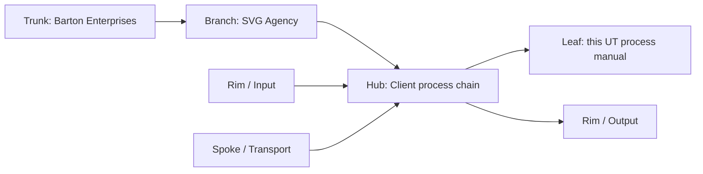
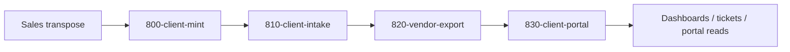
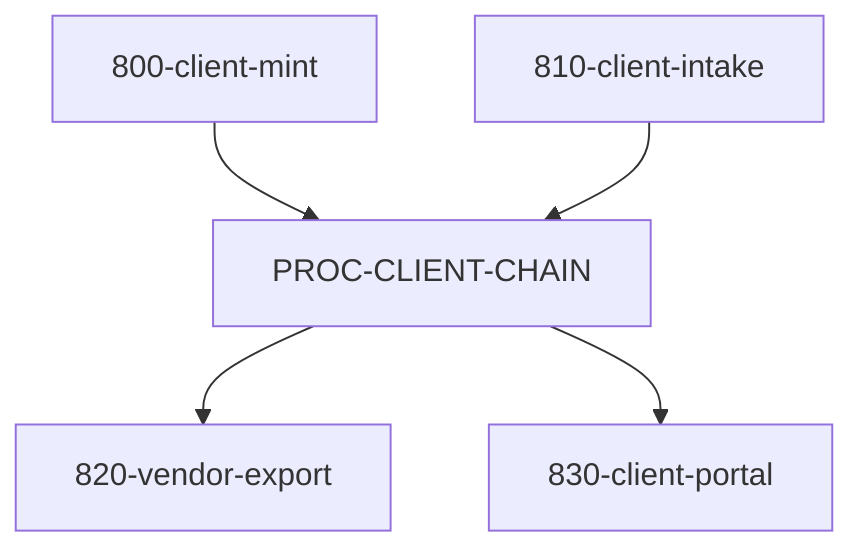

# UT Processes - Client System Chain
## Coordinator manual for mint -> intake -> export -> portal across the client subhive.
### Status: BUILD
### Medium: process
### Business: svg-agency

---

## UT Checklist (Pre-Flight)

| # | Check | Status | Location |
|---|-------|--------|----------|
| 1 | PRD - what / why / who / scope / out-of-scope / success metric | ☐ | §2 |
| 2 | OSAM - READ / WRITE / Join Chain / Forbidden Paths / Query Routing filled | ☐ | §5 |
| 3 | Component Status - every dependency has green / yellow / red with 1-line state | ☐ | §3 |
| 4 | Owner - human who fixes this at 2 AM | ☐ | §1 |
| 5 | Live Dashboard - URL or explicit "N/A" | ☐ | §3 |
| 6 | Kill Switch - exact command to stop the process | ☐ | §8 |
| 7 | Logbook - last audit verdict + date (after certification only) | ☐ | §12 |
| 8 | FCEs Attached - which FCE runs structurally back this doc | ☐ | §3c |
| 9 | BARs Referenced - every BAR this doc touches, with status | ☐ | §3d |
| 10 | LBB Subjects Fed - which LBB subject(s) this doc's session logs go to | ☐ | §3e |
| 11 | Geometry - CTB position + Hub-Spoke role + Altitude | ☐ | §1b |
| 12 | Live Verification - every route, count, and URL grounded against the repo | ☐ | §9b |
| 13 | ctb_node - declared path on Barton Enterprises CTB trunk | ☐ | §1 |

---

# IDENTITY (Thing - what this IS)

## 1. IDENTITY

| Field | Value |
|-------|-------|
| ID | PROC-CLIENT-CHAIN |
| Name | Client System Process Chain |
| Medium | process |
| Business Silo | svg-agency / client-subhive |
| CTB Position | branch -> Barton-Processes -> factory -> client -> UT_PROCESSES.md |
| ORBT | BUILD |
| Strikes | 0 |
| Authority | inherited - `law/UNIFIED_TEMPLATE.md` + `law/doctrine/PROCESS_FILL_INSTRUCTIONS.md` + client system locked architecture |
| Last Modified | 2026-04-22 |
| BAR Reference | none |
| Owner | Dave Barton |
| ctb_node | `barton-enterprises/svg-agency/client-subhive/client-chain` |

### 1b. Geometry

**CTB Position:** `branch -> Barton-Processes -> factory -> client -> UT_PROCESSES.md`

**Hub-Spoke Role:** hub (the middle - the coordinated muscle that routes mint, intake, export, and portal)

**Altitude:** 30k tactical



### HEIR (8 fields - Aviation Model, Bedrock S8)

| Field | Value |
|-------|-------|
| sovereign_ref | imo-creator-v2 |
| hub_id | barton-processes/client-chain |
| ctb_placement | branch |
| imo_topology | middle |
| cc_layer | CC-02 |
| services | Cloudflare Workers, Cloudflare D1 (client-hub, census), Neon PostgreSQL (schema: clnt), Hyperdrive, Mission Control API, Client Hub worker |
| secrets_provider | doppler |
| acceptance_criteria | Mint, intake, export, and portal coordination are documented end-to-end, open decisions are flagged, all four sibling PROCESS.md files are referenced by resolvable path, and every referenced file resolves |

**Inheritance:** this process manual inherits from the `imo-creator-v2` sovereign and coordinates the four client sub-processes named in the dispatch packet.

**Fill Rule:** PROCESS_FILL_INSTRUCTIONS §1 — identity block: name, ID, CTB position, ORBT, owner, and 8-field HEIR block all populated. All 8 HEIR fields must be non-empty and cc_layer must be CC-02.
**Cross-ref:** `law/doctrine/PROCESS_FILL_INSTRUCTIONS.md` §1; `law/UNIFIED_TEMPLATE.md` §1; `imo-creator-v2/factory/dispatch/DISPATCH_UT_CLIENT_2026-04-22.md` HEIR spec; `client/CLAUDE.md`
**0 → 1 when:** All 8 HEIR fields are populated, cc_layer = CC-02, sovereign_ref = imo-creator-v2, and acceptance_criteria references all four process stages.

---

# CONTRACT (Flow - what flows through this)

## 2. PURPOSE

This coordinator manual defines the muscle of the client system: how a client is minted, how intake is staged, how vendor exports are built, and how the portal reads the result. Without it, the client blueprint stays theoretical, the four process stages drift apart, and the subhive has no single operating contract for turning a sales handoff into a live client experience.

This doc is for operators and builders. It tells them what triggers the chain, how the steps line up, and where the unresolved decisions still live.

**Fill Rule:** PROCESS_FILL_INSTRUCTIONS §2 — purpose: business problem, trigger, consumer, and what P=1 looks like. Plain language. No jargon.
**Cross-ref:** `law/doctrine/PROCESS_FILL_INSTRUCTIONS.md` §2; `imo-creator-v2/factory/dispatch/DISPATCH_UT_CLIENT_2026-04-22.md` §LOCKED ARCHITECTURE
**0 → 1 when:** Business problem stated, trigger declared, consumer named, P=1 definition present.

## 3. RESOURCES

_Everything this depends on. A mechanic reads this and knows exactly what to set up before it can run._

### Governing Documentation

This UT coordinates the following four process manuals. Each must be referenced by resolvable path and is subordinate to this coordinator document.

| Process ID | Name | Path | ORBT | Status |
|-----------|------|------|------|--------|
| 800-client-mint | Client minting | `Barton-Processes/factory/cl/800-client-mint/PROCESS.md` | BUILD | PENDING |
| 810-client-intake | Client intake | `Barton-Processes/factory/client/810-client-intake/PROCESS.md` | BUILD | PENDING |
| 820-vendor-export | Vendor export | `Barton-Processes/factory/client/820-vendor-export/PROCESS.md` | BUILD | PENDING |
| 830-client-portal | Client portal | `Barton-Processes/factory/client/830-client-portal/PROCESS.md` | BUILD | PENDING |

**Coordinator role declaration:** This UT is the coordinator above the four process manuals listed above. It does not replace them. It provides the shared contract — constants, join paths, open decisions, and sequencing — that each sub-process manual must conform to.

Additional governing documentation:

| Document | Path | Role |
|----------|------|------|
| Client CLAUDE | `client/CLAUDE.md` | Client repo governance and identity |
| Client OSAM | `client/doctrine/OSAM.md` | Routing and join policy for client concepts |
| Client Blueprint UT | `client/docs/UT_BLUEPRINT.md` | Schema, view, and join authority for the process chain |
| Dispatch packet | `imo-creator-v2/factory/dispatch/DISPATCH_UT_CLIENT_2026-04-22.md` | Source-of-truth requirements and LOCKED ARCHITECTURE §1-15 |
| Unified Template | `imo-creator-v2/law/UNIFIED_TEMPLATE.md` | 14-section format authority |
| Process Fill Instructions | `imo-creator-v2/law/doctrine/PROCESS_FILL_INSTRUCTIONS.md` | Fill rules for this document type |

### Component Status Grid

| Component | HEIR (`hub_id · ctb · cc_layer`) | ORBT | Light | State |
|-----------|----------------------------------|------|-------|-------|
| `imo-creator-v2/workers/client-hub/MANUAL.md` | `client-hub · leaf · CC-03` | BUILD | yellow | Live D1 edge API manual for the client worker. |
| `imo-creator-v2/workers/client-hub/src/index.ts` | `client-hub · leaf · CC-03` | BUILD | yellow | Route surface used by the process chain for client operations. |
| `imo-creator-v2/workers/client-hub/migrations/0001_create_tables.sql` | `client-hub · leaf · CC-03` | BUILD | yellow | Current D1 schema for the client worker. |
| `imo-creator-v2/workers/mission-control-api/docs/DB-CLIENT.md` | `DB-CLIENT · leaf · CC-03` | BUILD | yellow | Existing client database manual and route contract. |
| `client/doctrine/OSAM.md` | `client-subhive · branch · CC-02` | BUILD | yellow | Routing and join policy for client concepts. |
| `Barton-Processes/factory/cl/800-client-mint/PROCESS.md` | `client-mint · leaf · CC-03` | BUILD | yellow | Client minting process — upstream feeder for this chain. |
| `Barton-Processes/factory/client/810-client-intake/PROCESS.md` | `client-intake · leaf · CC-03` | BUILD | yellow | Client intake process — upstream feeder for this chain. |
| `Barton-Processes/factory/client/820-vendor-export/PROCESS.md` | `vendor-export · leaf · CC-03` | BUILD | yellow | Vendor export process — downstream consumer of this chain. |
| `Barton-Processes/factory/client/830-client-portal/PROCESS.md` | `client-portal · leaf · CC-03` | BUILD | yellow | Client portal process — downstream consumer of this chain. |

### Live Dashboard

| Resource | URL | What it shows |
|----------|-----|---------------|
| Client Hub health | `https://client-hub.svg-outreach.workers.dev/health` | Worker reachability and table count. |
| Process chain dashboard | N/A | No live URL is declared in this snapshot. |

### Dependencies

| Dependency | Type | What It Provides | Status |
|-----------|------|-----------------|--------|
| 800-client-mint | process | client_id minting from sovereign_id and sales transpose | PENDING |
| 810-client-intake | process | checkbox intake, plan intake, employee intake, and event logging | PENDING |
| 820-vendor-export | process | vendor_library export files and member/capture payloads | PENDING |
| 830-client-portal | process | dashboards, ticketing, and portal read surfaces | PENDING |
| Client blueprint UT | document | schema, view, and join authority for the process chain | DONE |
| Client worker manual | document | current D1 edge CRUD surface | DONE |

### Downstream Consumers

| Consumer | What It Needs |
|----------|--------------|
| Mission Control UI | Minted client IDs, benefit checkboxes, plan rows, and portal-ready views |
| Vendor export jobs | Vendor library specs, member IDs, export formats, and invoice inputs |
| HR and benefits operators | Intake states, employee events, and service requests |
| Auditors | Explicit process boundaries, open decisions, and cross-file references |

### Tools & Integrations

| Item | Type | Cost Tier | Credentials | What It Does |
|------|------|-----------|-------------|-------------|
| Cloudflare Workers | runtime | Cheap | Cloudflare account | Runs the process endpoints and portal surfaces |
| Cloudflare D1 (client-hub) | database | Cheap | wrangler binding | Stores the working client tables (company DB) |
| Cloudflare D1 (census) | database | Cheap | wrangler binding | Stores the people and elections tables (census DB) |
| Neon PostgreSQL | vault database | Cheap | `CLIENT_DATABASE_URL` (Doppler: imo-creator → dev) | Holds the client archive under schema `clnt` |
| Hyperdrive | connection pool | Free | Cloudflare config | Connects Workers to Neon |
| wrangler | deploy / migration tool | Free | Cloudflare token in Doppler | Deploys and migrates the worker surfaces |

### Secrets

| Secret | Doppler Project | Config | Used By |
|--------|----------------|--------|---------|
| `CLIENT_DATABASE_URL` | imo-creator | dev | Neon PostgreSQL connection (schema: clnt) |
| Cloudflare API Token | imo-creator | dev | wrangler deploys and D1 migrations |

### 3c. FCEs Attached

| FCE Name | HEIR (`hub_id · ctb · cc_layer`) | ORBT | Run Directory | Latest P=1 | Rows | Status |
|----------|----------------------------------|------|--------------|------------|------|--------|
| n/a | n/a | n/a | n/a | pending | pending | yellow |

### 3d. BARs Referenced

| BAR | Title | HEIR (`bar-id · ctb · cc_layer`) | ORBT | Status | Relation |
|-----|-------|----------------------------------|------|--------|----------|
| none | none | none | BUILD | pending | tracks |

### 3e. LBB Subjects Fed

| LBB Subject | HEIR (`subject-id · ctb · cc_layer`) | ORBT | What This Doc Writes | Frequency |
|-------------|--------------------------------------|------|---------------------|-----------|
| `processes` | `processes · trunk · CC-02` | BUILD | session summary and process-chain notes | per-run |

**Fill Rule:** PROCESS_FILL_INSTRUCTIONS §3 — resources: component grid with HEIR + ORBT + light + state per component; explicit path references to all upstream and downstream process manuals; tools, secrets, FCEs, BARs, LBB subjects all present.
**Cross-ref:** `law/doctrine/PROCESS_FILL_INSTRUCTIONS.md` §3; `client/doctrine/OSAM.md`; `imo-creator-v2/factory/dispatch/DISPATCH_UT_CLIENT_2026-04-22.md` §LOCKED ARCHITECTURE §10 (vendor library); §15 (process chain 800/810/820/830)
**0 → 1 when:** All four sibling PROCESS.md files appear in the component grid with resolvable paths, governing documentation table is present, coordinator role is declared, secrets table has at least one real entry.

## 4. IMO - Input, Middle, Output

### Two-Question Intake (Bedrock S3)
1. **What triggers this?** - A sales handoff button, or the operator opens the portal and starts client entry.
2. **How do we get it?** - The CL pipeline provides `sovereign_id`, or the operator provides hand-entered client data, and the chain routes it to the right stage.

### Architecture Diagram



### Input
- `sovereign_id` from the CL pipeline
- Sales data from the convert-to-client handoff
- Manual entry from the operator
- Benefit class choices, plan rows, employee rows, and vendor details

### Middle

| Step | Input | What Happens | Output | Tool Used |
|------|-------|-------------|--------|-----------|
| 1 | Sales handoff | Sales data is transposed into client-system terms | Client seed payload | convert-to-client flow |
| 2 | `sovereign_id` | `client_id` is minted from the CL pipeline rule | Company identity key | 800-client-mint |
| 3 | Benefit class choices | Client benefit classes are recorded and validated | Offered-class rows | client-hub / intake |
| 4 | Plan rates and coverage | 4-tier plan rows and coverage templates are stored | Plan and tier records | company DB |
| 5 | Employee and dependent data | Person and election rows are stored in census | Census records | census DB |
| 6 | Event logging | Employee events and company events are appended | Audit/event history | client system |
| 7 | Vendor export preparation | Vendor identity and export specs are prepared | Export-ready vendor artifacts | 820-vendor-export |
| 8 | Portal read surfaces | Views serve dashboards, tickets, and member info | UI-readable datasets | 830-client-portal |

### Output
- Company DB tables for client identity, plans, vendors, invoices, and service requests
- Census DB tables for people, elections, and employee events
- A stable view layer for dashboards and exports
- Explicit placeholders for unresolved architecture decisions

### Circle (Bedrock S5)
Errors in the company DB or census DB feed back through the error tables and validation rules. Unresolved decisions stay open rather than being guessed, and view-layer failures feed back into the schema and routing rules.

**Fill Rule:** PROCESS_FILL_INSTRUCTIONS §4 — IMO: two-question intake answered, input list declared, middle as step table with tool used, output declared, circle described.
**Cross-ref:** `law/doctrine/PROCESS_FILL_INSTRUCTIONS.md` §4; `law/doctrine/FOUNDATIONAL_BEDROCK.md` §3 (IMO); `imo-creator-v2/factory/dispatch/DISPATCH_UT_CLIENT_2026-04-22.md` §LOCKED ARCHITECTURE §1 (lifecycle), §15 (process chain)
**0 → 1 when:** Both intake questions answered, middle table has at least one row per process stage (800/810/820/830), output list present, circle description present.

## 5. DATA SCHEMA

_Where the data lives. What's read, written, joined. The plumbing._

### READ Access

| Source | What It Provides | Join Key |
|--------|-----------------|----------|
| Client blueprint UT (`client/docs/UT_BLUEPRINT.md`) | Company DB / census DB table lists and view inventory | section number |
| `imo-creator-v2/workers/client-hub/MANUAL.md` | Worker route and migration reality | route / table name |
| `imo-creator-v2/workers/client-hub/src/index.ts` | Actual Hono route mount points | path |
| `imo-creator-v2/workers/client-hub/migrations/0001_create_tables.sql` | D1 table creation details | table name |
| `imo-creator-v2/workers/mission-control-api/docs/DB-CLIENT.md` | Existing client database manual | table name |
| `client/doctrine/OSAM.md` | Query routing and allowed joins | concept / table |
| `client/src/data/ERD.md` | Entity-relationship diagram for client schema | entity name |

### WRITE Access

| Target | What It Writes | When |
|--------|---------------|------|
| `client` / `client_id` | Minted client identity and transposed sales fields | 800-client-mint |
| `client_benefit_class` | Selected benefit classes | 810-client-intake |
| `plan`, `benefit_tier_cost`, `plan_coverage` | Plan rows, 4-tier costs, coverage templates | 810-client-intake |
| `person`, `person_pii`, `person_vendor_identity`, `election`, `employee_event` | Census rows and event history | 810-client-intake |
| `company_events` | Company-level event log | 810-client-intake |
| vendor export artifacts | Export files and mapping manifests | 820-vendor-export |
| `service_request` | Portal-triggered service work | 830-client-portal |
| `*_error` tables | Validation / routing failures | any stage that fails |
| Neon schema `clnt` | Archived client data for long-term retention | post-intake archival |

### Process Composition



| Process ID | Name | Path | Role in Composition | Status |
|-----------|------|------|---------------------|--------|
| 800-client-mint | Client minting | `Barton-Processes/factory/cl/800-client-mint/PROCESS.md` | upstream feeder | PENDING |
| 810-client-intake | Client intake | `Barton-Processes/factory/client/810-client-intake/PROCESS.md` | upstream feeder | PENDING |
| 820-vendor-export | Vendor export | `Barton-Processes/factory/client/820-vendor-export/PROCESS.md` | downstream consumer | PENDING |
| 830-client-portal | Client portal | `Barton-Processes/factory/client/830-client-portal/PROCESS.md` | downstream consumer | PENDING |

### Join Chain

```text
sovereign_id
  -> client_id
    -> company DB tables (client, client_benefit_class, plan, vendor, invoice, service_request, company_events)
    -> census DB tables (person, person_pii, person_vendor_identity, election, employee_event)
    -> Neon schema clnt (archived client data)
```

### Forbidden Paths

| Action | Why |
|--------|-----|
| Guessing the client_id formation rule | Open decision Q1 remains unresolved |
| Consolidating or splitting error tables without a foreman answer | Open decision Q2 remains unresolved |
| Inventing a vendor library location | Open decision Q4 remains unresolved |
| Inventing a service request scope | Open decision Q5 remains unresolved |
| Inventing the v1 visible benefit-class list | Open decision Q6 remains unresolved |
| Writing to the view layer | Views are read surfaces only |
| Crossing company DB and census DB without `client_id` | Isolation boundary violation |

**Fill Rule:** PROCESS_FILL_INSTRUCTIONS §5 — data schema: READ table includes all source files with join keys, WRITE table lists every target with timing, process composition table references all four PROCESS.md siblings by resolvable path, join chain declared, forbidden paths declared.
**Cross-ref:** `law/doctrine/PROCESS_FILL_INSTRUCTIONS.md` §5; `client/doctrine/OSAM.md`; `client/docs/UT_BLUEPRINT.md` §5; `imo-creator-v2/factory/dispatch/DISPATCH_UT_CLIENT_2026-04-22.md` §LOCKED ARCHITECTURE §2 (two-DB split), §13 (writes to tables / reads from views)
**0 → 1 when:** READ table references `client/doctrine/OSAM.md` (not `law/semantic/OSAM.md`), WRITE table covers all four process stages, process composition table has all four PROCESS.md paths, join chain ends at Neon schema `clnt`.

## 6. DMJ - Define, Map, Join

### 6a. DEFINE (Build the Key)

| Element | ID | Format | Description | C or V |
|---------|-----|--------|-------------|--------|
| Process stages | STAGE-01 | ordered pipeline | mint -> intake -> export -> portal | C |
| Operation universe | OP-01 | enum | new_hire / fire / change | C |
| 4-tier rule | RULE-01 | invariant | every plan produces EE / ES / EC / FAM | C |
| `client_id` mint rule | KEY-01 | derivation | client_id derives from sovereign_id | C |
| Benefit class universe | CLASS-01 | enum | full benefit class list from the architecture packet | C |
| Sub-process docs | DOC-01..04 | process docs | 800 / 810 / 820 / 830 by resolvable path | C |
| Client payloads | payload | rows / JSON | sales, intake, vendor, portal inputs | V |
| File outputs | export files | generated artifacts | vendor export payloads | V |

### 6b. MAP (Connect Key to Structure)

| Source | Target | Transform |
|--------|--------|-----------|
| Sales handoff | 800-client-mint (`Barton-Processes/factory/cl/800-client-mint/PROCESS.md`) | transpose |
| `sovereign_id` | `client_id` | mint |
| Checkbox intake | `client_benefit_class` | classify |
| Plan setup | `plan` + `benefit_tier_cost` | normalize |
| Employee intake | `person`, `person_pii`, `election` | split by vault / operational need |
| Event logging | `company_events` + `employee_event` | append |
| Vendor export prep | export files and vendor mapping | build |
| Portal request | views + service request | read / route |

### 6c. JOIN (Path to Spine)

| Join Path | Type | Description |
|-----------|------|-------------|
| `sovereign_id -> client_id` | direct | minting step establishes the root client key |
| `client_id -> company DB tables` | direct | company state hangs from the minted client key |
| `client_id -> census.person.client_id` | direct | census rows remain attached to the same client |
| `person_id -> person_pii.person_id` | direct | vault row stays paired to operational person row |
| `vendor_id -> person_vendor_identity.vendor_id` | direct | member identity is vendor-scoped |
| `plan_id -> election.plan_id` | direct | elections attach to plans |

**Q3 resolved:** company/vendor identity belongs in company DB; person/vendor identity belongs in census DB.

**Fill Rule:** PROCESS_FILL_INSTRUCTIONS §6 — DMJ: DEFINE table maps every structural element to an ID, format, and C/V classification; MAP table shows source-to-target transforms with explicit paths; JOIN table shows path to spine with join type.
**Cross-ref:** `law/doctrine/PROCESS_FILL_INSTRUCTIONS.md` §6; `law/doctrine/DMJ.md`; `imo-creator-v2/factory/dispatch/DISPATCH_UT_CLIENT_2026-04-22.md` §LOCKED ARCHITECTURE §4 (identity hierarchy), §15 (process chain)
**0 → 1 when:** DEFINE table covers all 4 process stages as constants with resolvable paths in description, MAP table references all four stage names, JOIN table traces from sovereign_id to client_id.

## 7. CONSTANTS & VARIABLES (Bedrock S2)

### Constants (structure - never changes)
- The four-stage chain: mint -> intake -> export -> portal
- The 4-tier rule: EE / ES / EC / FAM
- `client_id` derives from `sovereign_id`
- The two-DB split and its isolation boundary (company DB: `client-hub`, census DB: `census`)
- `new_hire`, `fire`, and `change` are the only three employee operations
- View layer is read-only; tables receive writes
- `Q3` is resolved; `Q1`, `Q2`, `Q4`, `Q5`, and `Q6` are still open
- Sub-process manuals live at declared paths: 800 in `factory/cl/`, 810/820/830 in `factory/client/`

### Variables (fill - changes every run/cycle)
- Sales payload values
- Intakes from the operator
- Client-specific benefit classes and plan choices
- Employee and dependent rows
- Vendor export formats and file destinations
- Portal ticket content and dashboard filters

**Fill Rule:** PROCESS_FILL_INSTRUCTIONS §7 — constants and variables: every structural invariant listed as a constant, every fill-specific value listed as a variable. Constants must survive the four-element test (C&V + IMO + CTB + Circle).
**Cross-ref:** `law/doctrine/PROCESS_FILL_INSTRUCTIONS.md` §7; `law/doctrine/FOUNDATIONAL_BEDROCK.md` §2 (C&V); `imo-creator-v2/factory/dispatch/DISPATCH_UT_CLIENT_2026-04-22.md` §LOCKED ARCHITECTURE §5 (4-tier), §9 (operations universe)
**0 → 1 when:** Constants list includes all structural invariants from LOCKED ARCHITECTURE §1-15, variables list includes at least one per process stage.

## 8. STOP CONDITIONS (Bedrock S6)

| Condition | Action |
|-----------|--------|
| `client_id` formation rule is unresolved | HALT - `PENDING FOREMAN - Q1` |
| Error table strategy is unresolved | HALT - `PENDING FOREMAN - Q2` |
| Vendor library location is unresolved | HALT - `PENDING FOREMAN - Q4` |
| Service request scope is unresolved | HALT - `PENDING FOREMAN - Q5` |
| Benefit class v1 visible list is unresolved | HALT - `PENDING FOREMAN - Q6` |
| A plan does not produce exactly four tier rows | HALT - the rule is broken |
| PII vault constraint is violated | HALT - person_pii rule violated |
| A cross-DB write bypasses the intended stage | HALT - isolation violation |
| Human says stop | STOP |

### Open Decisions (do not invent)

| Q# | Status | Placeholder |
|----|--------|-------------|
| Q1 | OPEN | `PENDING FOREMAN - Q1: client_id formation rule` |
| Q2 | OPEN | `PENDING FOREMAN - Q2: error tables consolidated vs per-spoke` |
| Q3 | RESOLVED | company/vendor identity split is fixed |
| Q4 | OPEN | `PENDING FOREMAN - Q4: vendor library location` |
| Q5 | OPEN | `PENDING FOREMAN - Q5: service request scope (company / employee / both)` |
| Q6 | OPEN | `PENDING FOREMAN - Q6: benefit class v1 visible list (8 vs 19)` |

**Fill Rule:** PROCESS_FILL_INSTRUCTIONS §8 — stop conditions: every open decision appears as a HALT row, kill switch is declared or explicitly marked N/A, no invented resolutions for Q1/Q2/Q4/Q5/Q6.
**Cross-ref:** `law/doctrine/PROCESS_FILL_INSTRUCTIONS.md` §8; `imo-creator-v2/factory/dispatch/DISPATCH_UT_CLIENT_2026-04-22.md` §B (Open Decisions Integrity)
**0 → 1 when:** All 5 open decisions appear as HALT rows, Q3 stays RESOLVED and is not re-opened, no invented values for any open decision.

## 9. VERIFICATION

_Executable proof that it works. Run these._

```text
1. Sales handoff -> mint -> client_id.
   expected: client_id is produced from sovereign_id and the client record is written.
2. Checkbox intake -> plan intake.
   expected: benefit classes and 4-tier plan rows are written.
3. Employee intake -> event logging.
   expected: person, election, and event rows are written with no PII leak into the operational table.
4. Vendor export.
   expected: vendor export artifacts are produced from the declared vendor specs.
5. Portal read.
   expected: dashboards read from the views, not from the raw tables.
6. Open decisions.
   expected: Q1, Q2, Q4, Q5, Q6 remain flagged and Q3 remains resolved.
7. Cross-file resolution.
   expected: all four PROCESS.md paths resolve in the repo (800 in factory/cl/, 810/820/830 in factory/client/).
```

**Three Primitives Check (Bedrock S1):**
1. **Thing:** Do the four process stages and their dependencies exist?
2. **Flow:** Does a client move through mint -> intake -> export -> portal without a dead end?
3. **Change:** Do plan, employee, event, and vendor states update correctly at each stage?

**Fill Rule:** PROCESS_FILL_INSTRUCTIONS §9 — verification: executable test steps that can be run without ambiguity, Three Primitives check present, cross-file resolution verification step included.
**Cross-ref:** `law/doctrine/PROCESS_FILL_INSTRUCTIONS.md` §9; `imo-creator-v2/factory/dispatch/DISPATCH_UT_CLIENT_2026-04-22.md` §A (Locked Architecture Fidelity)
**0 → 1 when:** At least one verification step per process stage (800/810/820/830), open decisions verification step present, cross-file resolution step present, Three Primitives check present.

## 10. ANALYTICS

### 10a. Metrics

| Metric | Unit | Baseline | Target | Tolerance |
|--------|------|----------|--------|-----------|
| Process stage completeness | count/4 | 0 | 4 | = 4 |
| Open decisions flagged | count | 0 | 5 | = 5 |
| 4-tier plan completeness | count/plan | 0 | 4 | = 4 |
| Join-path orphans | count | 0 | 0 | = 0 |
| Portal read coverage | count/views | 0 | 13 | = 13 |

### 10b. Sigma Tracking

| Metric | Run 1 | Run 2 | Run 3 | Trend | Action |
|--------|-------|-------|-------|-------|--------|
| process stage completeness | provisional | compare | compare | TIGHTENING | keep or repair |
| open decisions | 5 | 5 | 5 | FLAT until foreman answers | do not invent |
| join coverage | provisional | compare | compare | TIGHTENING | keep or repair |

### 10c. ORBT Gate Rules

| From | To | Gate |
|------|-----|------|
| BUILD | OPERATE | four stages present, joins explicit, open decisions flagged, auditor sign-off |
| OPERATE | REPAIR | stage regression, missing payload, or portal view drift |
| REPAIR | OPERATE | fix applied and verified |
| Any (Strike 3) | TROUBLESHOOT/TRAIN | same process failure repeats |

**Fill Rule:** PROCESS_FILL_INSTRUCTIONS §10 — analytics: metrics table with baseline/target/tolerance, sigma tracking table with at least 3 run columns, ORBT gate rules declared.
**Cross-ref:** `law/doctrine/PROCESS_FILL_INSTRUCTIONS.md` §10; `law/doctrine/FOUNDATIONAL_BEDROCK.md` §6 (sigma tracking)
**0 → 1 when:** Metrics table has at least one row per process stage output, sigma tracking references open decisions as FLAT, ORBT gate from BUILD to OPERATE requires auditor sign-off.

## 11. EXECUTION TRACE

_Append-only. Every action logged. The auditor reads this._

_Intentionally empty during BUILD. No execution trace exists until the process chain is operating. The trace structure is declared below for auditor reference._

| Field | Format | Required |
|-------|--------|----------|
| trace_id | uuid | Yes |
| run_id | uuid | Yes |
| step | integer | Yes |
| target | string | Yes |
| actual | string | Yes |
| delta | string | Yes |
| status | BUILD \| OPERATE \| REPAIR | Yes |
| error_code | string \| null | If failed |
| error_message | string \| null | If failed |
| tools_used | JSON array | Yes |
| duration_ms | integer | Yes |
| cost_cents | integer | Yes |
| timestamp | ISO 8601 | Yes |
| signed_by | string | Yes |

**Fill Rule:** PROCESS_FILL_INSTRUCTIONS §11 — execution trace: schema declared even if empty during BUILD; append-only notation present; note that this section populates when the process runs, not during BUILD.
**Cross-ref:** `law/doctrine/PROCESS_FILL_INSTRUCTIONS.md` §11
**0 → 1 when:** Schema table is present with all required fields, intentionally-empty-during-BUILD note is explicit, append-only instruction is stated.

## 12. LOGBOOK (After Certification Only)

_No logbook during BUILD._

### Birth Certificate

| Field | Value |
|-------|-------|
| heir_ref | pending certification |
| orbt_entered | BUILD |
| orbt_exited | pending |
| action | pending auditor certification |
| gates_passed | pending |
| signed_by | pending |
| signed_at | pending |

**Fill Rule:** PROCESS_FILL_INSTRUCTIONS §12 — logbook: no entries during BUILD; birth certificate skeleton present; logbook populates only after auditor certification.
**Cross-ref:** `law/doctrine/PROCESS_FILL_INSTRUCTIONS.md` §12; `law/doctrine/HOW_TO_BUILD_ANYTHING.md` Aviation Model (logbook read first, written last)
**0 → 1 when:** Birth certificate skeleton is present, explicit note that logbook is empty during BUILD is declared, no fabricated audit entries.

## 13. FLEET FAILURE REGISTRY

_Intentionally empty during BUILD. No fleet failures have been recorded for this process chain. Registry structure is declared below for auditor reference._

| Pattern ID | Location | Error Code | First Seen | Occurrences | Strike Count | Status |
|-----------|----------|-----------|-----------|-------------|-------------|--------|
| none | none | none | none | none | 0 | empty during BUILD |

**Fill Rule:** PROCESS_FILL_INSTRUCTIONS §13 — fleet failure registry: empty during BUILD is acceptable; registry structure declared; Strike 3 rule referenced.
**Cross-ref:** `law/doctrine/PROCESS_FILL_INSTRUCTIONS.md` §13; `law/doctrine/HOW_TO_BUILD_ANYTHING.md` Strike 3 → Troubleshoot/Train
**0 → 1 when:** Registry table structure is present, intentionally-empty-during-BUILD note is explicit, Strike 3 reference is declared.

## 14. SESSION LOG

| Date | What Was Done | LBB Record |
|------|---------------|-----------|
| 2026-04-22 | Built the client-system process coordinator manual from the dispatch packet and the checked-in client worker / schema / OSAM references. | pending |
| 2026-04-22 | Repair pass: fixed 4 audit findings (GAP-001 missing Status field, GAP-002 no fill rule citations, GAP-003 wrong OSAM path, GAP-004 no PROCESS.md cross-refs). Added Status to Document Control, added Fill Rule + Cross-ref + 0→1 citations to all 14 sections, fixed OSAM from `law/semantic/OSAM.md` to `client/doctrine/OSAM.md`, replaced outreach example with explicit client PROCESS.md paths for 800/810/820/830, declared coordinator role. Version bumped to 1.1.0. | pending |

**Fill Rule:** PROCESS_FILL_INSTRUCTIONS §14 — session log: append-only; every session that touches this doc gets a row with date, what was done, and LBB record reference.
**Cross-ref:** `law/doctrine/PROCESS_FILL_INSTRUCTIONS.md` §14
**0 → 1 when:** At least one session log entry exists, entries are in descending date order, LBB record field is present (pending is acceptable during BUILD).

## Document Control

| Field | Value |
|-------|-------|
| Created | 2026-04-22 |
| Last Modified | 2026-04-22 |
| Version | 1.2.0 |
| Status | BUILD |
| Template Version | 1.0.0 |
| Medium | process |
| US Validated | pending |
| Governing Engine | `law/doctrine/FOUNDATIONAL_BEDROCK.md` + `law/doctrine/DMJ.md` |
