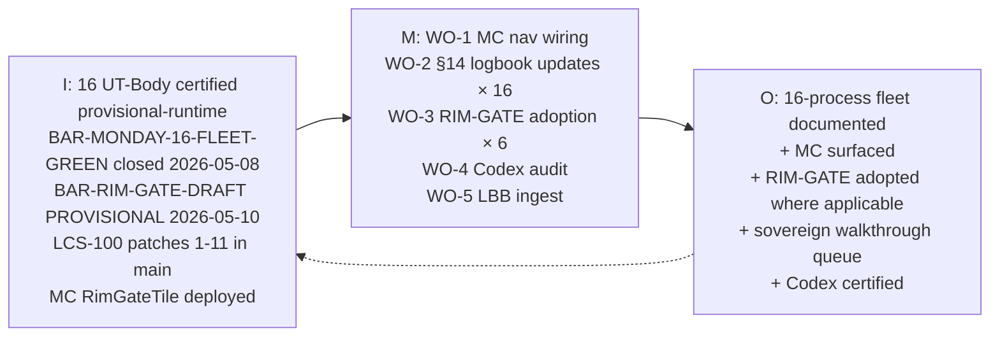

# PLAN BOOK — BAR-FLEET-OVERNIGHT

## §0 UT Pre-Flight Checklist (UT_CHECKLIST v1.3.1, 13 items)

| # | Item | Status | Source |
|---|------|--------|--------|
| 1 | Species declared (Plan-Body) | ✓ | frontmatter `species` |
| 2 | bar_id declared (BAR-FLEET-OVERNIGHT) | ✓ | frontmatter `bar_id` |
| 3 | sovereign_ref declared | ✓ | frontmatter `sovereign_ref` |
| 4 | Version + Last Modified in 3 locations (frontmatter, §1, §13) | ✓ | this Book |
| 5 | HEIR 8 fields populated (outside.heir + inside.heir) | ✓ | Y-junction frontmatter |
| 6 | ORBT 4-state stamped (outside.orbt + inside.orbt, library_state + runtime_state) | ✓ | Y-junction frontmatter |
| 7 | ctb_node declared on BE trunk | ✓ | `barton-enterprises/svg-agency/outreach/fleet-overnight-prep` |
| 8 | BS Law v1.3.0 Y-junction (outside / inside as syntactically distinct top-level maps) | ✓ | frontmatter |
| 9 | Companion YAML declared (plan-book.yaml) | ✓ | frontmatter `companion_yaml` |
| 10 | Aviation Model role-locks declared (Planner/Foreman/Mechanic/Auditor) | ✓ | inside.heir.aviation_model |
| 11 | Determinism gate declared | ✓ | inside.heir.determinism_gate |
| 12 | Acceptance criteria stated | ✓ | outside.heir + inside.heir |
| 13 | §14 Logbook present + append-only | ✓ | §14 below |

## §1 Identity

| Field | Value |
|---|---|
| BAR ID | BAR-FLEET-OVERNIGHT |
| Species | Plan-Body |
| Version | 1.0.0 |
| Last Modified | 2026-05-10 |
| Sovereign | Dave Barton |
| Authority | Sovereign-authorized 2026-05-10 — "start working on any other processes... If you don't know something, go ahead and stop and put it down on a list" |
| Planner | Opus 4.7 |
| Foreman | Opus 4.7 (orchestrating, never fixes) |
| Mechanic | Sonnet |
| Auditor | Codex |
| ctb_node | barton-enterprises/svg-agency/outreach/fleet-overnight-prep |
| Created | 2026-05-10 |

**Scope:** Overnight session — fleet of 16 production processes audited, documented, and prepped for sovereign morning walkthrough.

**Target (O):** Each of the 16 processes has paired UT Book + workflow YAML, MC nav entry where buildable, RIM-GATE adoption declaration where applicable, §14 logbook row capturing 2026-05-10 audit findings.

### §1b Geometry

## §2 Purpose / PRD

### What
A Plan-Body authored overnight 2026-05-10 by Opus 4.7 Planner under sovereign directive. Captures the audit verdict on the 16-process fleet, enumerates 5 sequential Work Orders to bring the fleet into next-state conformance (MC nav wiring + §14 logbook updates + RIM-GATE adoption + Codex audit + LBB ingest), and surfaces 12 unknowns requiring sovereign morning walkthrough decisions.

### Why
Three prior closures landed on 2026-05-08/2026-05-10:
1. BAR-MONDAY-16-FLEET-GREEN — 16/16 UT-Body certified provisional-runtime
2. BAR-RIM-GATE-DRAFT — RIM-GATE meta + THROUGHPUT-CONTROL specialization, Codex PROVISIONAL on commit 91570756
3. LCS-100 patches 1-11 merged to main; MC RimGateTile + nav entry deployed (imo-creator-v2 commit 1a1066b2); MAILGUN_DOMAINS populated in Doppler (15 insurance-aligned domains)

The fleet is structurally certified at the UT-Body layer but carries documented drift in three layers below: deploy bindings, implementation gaps, and Mission Control surfacing. RIM-GATE specialization adoption has 6 candidate processes that should declare conformance. The sovereign needs a single Plan Book to read on the morning walkthrough — this Book.

### Who
- **Sovereign:** Dave Barton (morning walkthrough audience, classification decisions)
- **Planner:** Opus 4.7 (this Book)
- **Foreman:** Opus 4.7 (dispatch orchestration for WO-1 through WO-5)
- **Mechanic:** Sonnet (executes WO-1, WO-2, WO-3, WO-5)
- **Auditor:** Codex (executes WO-4)
- **Downstream consumers:** anyone reading the 16-process fleet state via MC after WO-1 lands

### Scope
- 16 production processes documented in BAR-MONDAY-16-FLEET-GREEN
- 6 RIM-GATE adoption candidates (bp.100, bp.201, bp.202, bp.300, bp.700, bp.820)
- Mission Control navigation entries (14 of 16 currently missing)
- §14 logbook updates on all 16 PROCESS-UT.md files (audit finding capture)
- This Plan Book + paired YAML

### Out of Scope
- D1 binding canonical decision for lcs-hub (sovereign-only — surfaced as unknown #12)
- New bp.NNN namespace collision resolution (surfaced as audit finding, deferred to next BAR)
- bp.700 implementation scaffolding (UT exists, no src/ — out of overnight scope)
- bp.830 wrangler.toml uncomment + redeploy (surfaced; sovereign call required)
- Trunk restructure (sovereign deferred multiple sessions running)

### Success Metric
Codex audit P=1 on the assembled bundle after WO-1/WO-2/WO-3 land. Sovereign reads this Plan Book + the 12-unknowns queue and issues morning classification decisions in one batch.

## §3 Component Status — Audit Findings (verbatim from audit Sonnet a57f0f541e0d0b5cd, 2026-05-10)

### Headline verdict

**16/16 UT-Body conformance** — every UT carries `species: UT-Body` + Y-junction `outside/inside` + companion `workflow.yaml`. Strongest dimension.

**Drift lives in three layers below UT-Body:**

1. **Deploy bindings (4 D1 ID gaps):**
   - bp.800 `database_id = ""`
   - bp.810-primary `database_id = ""`
   - bp.900 `database_id = ""`
   - bp.830 wrangler.toml entirely commented out
2. **Implementation gaps:**
   - bp.010 wrangler ambiguous (`010` dir or `lcs-hub` merged — namespace collision)
   - bp.700 has no `src/`, no `wrangler.toml` — UT exists, code doesn't
3. **Mission Control surfacing:**
   - 14 of 16 processes not in MC nav
   - bp.NNN namespace collision: `ProcessShelf.tsx` uses bp.010=Bedrock Pre-Flight + bp.100=Outreach—10; `cron_registry.yaml` uses canonical Barton-Processes scheme — doctrine-level identifier collision

### 6 RIM-GATE adoption candidates

| Process | Vendors Routed | Specialization to Declare |
|---|---|---|
| bp.100 | Mailgun + HeyReach + Composio | `rim-gate/throughput-control` (already adopted in commit 91570756) |
| bp.201 | MillionVerifier + Hunter | `rim-gate/throughput-control` |
| bp.202 | Hunter + scrapers | `rim-gate/throughput-control` |
| bp.300 | Composio firecrawl + scraperapi | `rim-gate/throughput-control` |
| bp.700 | HeyReach + Composio (when activated) | `rim-gate/throughput-control` |
| bp.820 | TPAs + PBMs + carriers | likely warrants **NEW specialization PARTNER-RELAY** distinct from THROUGHPUT-CONTROL |

### Per-process state matrix

#### Table 1 — UT Conformance (16/16)

| # | Process | UT v2.8.0 | Y-junction | Companion YAML | Verdict |
|---|---|---|---|---|---|
| 1 | bp.010 seed-d1 | ✓ | ✓ | ✓ | UT GREEN |
| 2 | bp.100 lcs-pipeline | ✓ | ✓ | ✓ | UT GREEN |
| 3 | bp.200 people-worker | ✓ | ✓ | ✓ | UT GREEN |
| 4 | bp.201 email-discovery | ✓ | ✓ | ✓ | UT GREEN |
| 5 | bp.202 linkedin-discovery | ✓ | ✓ | ✓ | UT GREEN |
| 6 | bp.300 blog-worker | ✓ | ✓ | ✓ | UT GREEN |
| 7 | bp.301 page-parser | ✓ | ✓ | ✓ | UT GREEN |
| 8 | bp.400 dol-views | ✓ | ✓ | ✓ | UT GREEN |
| 9 | bp.500 talent-flow | ✓ | ✓ | ✓ | UT GREEN |
| 10 | bp.600 bit-scoring | ✓ | ✓ | ✓ | UT GREEN (RETIRED stamp) |
| 11 | bp.700 campaign-engine | ✓ | ✓ | ✓ | UT GREEN |
| 12 | bp.800 client-mint | ✓ | ✓ | ✓ | UT GREEN |
| 13 | bp.810 client-intake | ✓ | ✓ | ✓ | UT GREEN |
| 14 | bp.820 vendor-export | ✓ | ✓ | ✓ | UT GREEN |
| 15 | bp.830 client-portal | ✓ | ✓ | ✓ | UT GREEN |
| 16 | bp.900 sales-portal | ✓ | ✓ | ✓ | UT GREEN |

#### Table 2 — Code/Deploy state

| # | Process | src/ | wrangler.toml | D1 binding state | Deploy status |
|---|---|---|---|---|---|
| 1 | bp.010 seed-d1 | ambiguous (010 vs lcs-hub) | ambiguous | n/a | namespace collision |
| 2 | bp.100 lcs-pipeline | ✓ | ✓ | bound | live (LCS-100 patches 1-11) |
| 3 | bp.200 people-worker | ✓ | ✓ | bound | deployed |
| 4 | bp.201 email-discovery | ✓ | ✓ | bound | deployed |
| 5 | bp.202 linkedin-discovery | ✓ | ✓ | bound | deployed |
| 6 | bp.300 blog-worker | ✓ | ✓ | bound | deployed |
| 7 | bp.301 page-parser | ✓ | ✓ | bound | deployed |
| 8 | bp.400 dol-views | ✓ | ✓ | bound | deployed |
| 9 | bp.500 talent-flow | ✓ | ✓ | bound | deployed |
| 10 | bp.600 bit-scoring | n/a (RETIRED) | n/a | n/a | retired |
| 11 | bp.700 campaign-engine | **MISSING** | **MISSING** | n/a | UT-only, no code |
| 12 | bp.800 client-mint | ✓ | ✓ | **`database_id = ""`** | binding gap |
| 13 | bp.810 client-intake | ✓ | ✓ | **`database_id = ""`** (primary) | binding gap |
| 14 | bp.820 vendor-export | ✓ | ✓ | bound | deployed |
| 15 | bp.830 client-portal | ✓ | **entirely commented out** | n/a | not deployable |
| 16 | bp.900 sales-portal | ✓ | ✓ | **`database_id = ""`** | binding gap |

#### Table 3 — RIM-GATE adoption candidates

| # | Process | Vendors routed | Candidate specialization | Status |
|---|---|---|---|---|
| 2 | bp.100 lcs-pipeline | Mailgun + HeyReach + Composio | THROUGHPUT-CONTROL | ADOPTED (commit 91570756) |
| 4 | bp.201 email-discovery | MillionVerifier + Hunter | THROUGHPUT-CONTROL | candidate (WO-3) |
| 5 | bp.202 linkedin-discovery | Hunter + scrapers | THROUGHPUT-CONTROL | candidate (WO-3) |
| 6 | bp.300 blog-worker | Composio firecrawl + scraperapi | THROUGHPUT-CONTROL | candidate (WO-3) |
| 11 | bp.700 campaign-engine | HeyReach + Composio (future) | THROUGHPUT-CONTROL | candidate (WO-3, conditional on activation) |
| 14 | bp.820 vendor-export | TPAs + PBMs + carriers | **PARTNER-RELAY (NEW)** | candidate; declares PARTNER-RELAY placeholder under throughput-control parent |

#### Table 4 — Mission Control wiring gap

| # | Process | In MC nav? | ProcessShelf entry? | Notes |
|---|---|---|---|---|
| 1 | bp.010 seed-d1 | ✗ | bp.010 collision (Bedrock Pre-Flight) | namespace collision |
| 2 | bp.100 lcs-pipeline | ✗ | bp.100 collision (Outreach—10) | namespace collision |
| 3-16 | (others) | ✗ | ✗ | not wired |
| — | rim-gate (meta) | ✓ | ✓ (commit 1a1066b2 imo-creator-v2) | DEPLOYED |
| — | process-shelf | ✓ | ✓ (commit 1a1066b2 imo-creator-v2) | DEPLOYED |

**Conclusion:** UT-Body layer is GREEN across all 16. Drift below the UT layer is documented but does not invalidate certification. RIM-GATE adoption + MC nav wiring + §14 logbook capture are the productive overnight moves. D1 binding canonicalization is a sovereign call (unknown #12).

## §4 Work Orders

### WO-1: Mission Control nav wiring + generic process drill-down tile

- **Target repo:** `imo-creator-v2`
- **Target file:** `workers/mission-control/src/data/navigation.ts`
- **Action:** Add 14 nav entries (one per non-bp.100, non-bp.600 process) under appropriate trunk/branch nodes. Each entry: `{ id, label, ctb_node, route, parent_id }`. Routes default to a generic process drill-down tile (`/process/:bp_id`) until per-process tiles exist.
- **Build + deploy:** `npm run build && wrangler pages deploy dist/` from `workers/mission-control/`
- **Dependencies:** independent of D1 binding gaps — config-only
- **Mechanic:** Sonnet (run_in_background=true)
- **Status:** SCHEDULED post-Plan-Book
- **Verification:** MC shows 14 new nav entries; clicking each routes to generic drill-down tile

### WO-2: UT-Body §14 logbook updates on all 16 process UTs

- **Target repo:** `Barton-Processes`
- **Target files:** 16 × `factory/<branch>/<NNN>-*/PROCESS-UT.md`
- **Action:** For each of the 16 PROCESS-UT.md files, append a §14 logbook row stamped `2026-05-10`, `BAR-FLEET-OVERNIGHT`, capturing the audit finding for that specific process (UT GREEN + any per-process drift from Tables 2/3/4 above).
- **Version bumps:** patch bump (e.g. 1.0.0 → 1.0.1) in all 3 locations per file: frontmatter `version`, §1 Identity table, §13 Document Control. Last Modified → 2026-05-10 in all 3.
- **Mechanic:** Sonnet (run_in_background=true)
- **Status:** SCHEDULED post-Plan-Book
- **Verification:** `git diff` shows 16 files modified; each file shows §14 row appended + 3-location version bump

### WO-3: RIM-GATE adoption declarations on 6 candidate UTs

- **Target repo:** `Barton-Processes`
- **Target files:** 6 × `factory/<branch>/<NNN>-*/PROCESS-UT.md` (bp.100, bp.201, bp.202, bp.300, bp.700, bp.820)
- **Action:**
  - For bp.100, bp.201, bp.202, bp.300, bp.700: add `implements: rim-gate/throughput-control` to `inside.heir` in PROCESS-UT.md frontmatter
  - For bp.820: add `implements: rim-gate/partner-relay` to `inside.heir`; declare PARTNER-RELAY as NEW specialization placeholder in throughput-control parent's `specializations_registered` list (flag in §11 Adoption Procedure that PARTNER-RELAY needs sovereign approval as a new specialization)
- **Pair update:** Update `imo-creator-v2/atlas/manifests/paired-artifacts.yaml` if any new pair rows are generated by the adoption declaration
- **Dependencies:** WO-2 should land first (3-location version bumps already in place)
- **Mechanic:** Sonnet (run_in_background=true)
- **Status:** SCHEDULED post-WO-2
- **Verification:** 6 UTs carry `implements:` field; paired-artifacts.yaml updated if applicable

### WO-4: Codex audit on the assembled bundle

- **Target:** the changed files from WO-1, WO-2, WO-3
- **Action:** Fire Codex via `codex exec` against the diff
- **Verify:**
  - BS Law v1.3.0 Y-junction holds on all modified Books
  - Book Law 11-block holds on companion YAMLs
  - Version bumps consistent in 3 locations on each modified UT
  - 17 locked constants untouched (verify `git diff HEAD` is empty on all 17)
  - RIM-GATE adoption properly declared (correct `implements:` syntax, parent registry updated)
  - §14 logbook rows append-only (no rewrites of prior history)
- **Auditor:** Codex
- **Status:** SCHEDULED post-build (after WO-1 + WO-2 + WO-3 land)
- **Verification:** Codex returns P=1 verdict written to `docs/plans/BAR-FLEET-OVERNIGHT/audits/codex-audit-YYYYMMDD-HHMM.md`

### WO-5: LBB ingest of session learnings

- **Target:** LBB worker (`https://lbb.svg-outreach.workers.dev`)
- **Action:** After audit verdict (WO-4), write LBB row capturing BAR-FLEET-OVERNIGHT state for future session pickup
- **Subject classification:** `system` (primary) + `processes` (secondary tag)
- **Record content:** audit verdict summary, 5 WO completion log, 12-unknown walkthrough queue, sovereign decision queue
- **Mechanic:** Sonnet (run_in_background=true)
- **Status:** SCHEDULED last (only fires if WO-4 returns P=1)
- **Verification:** `curl https://lbb.svg-outreach.workers.dev/records?subject_id=system&limit=5` shows BAR-FLEET-OVERNIGHT row at top

## §5 OSAM (Outside / Surface / Architecture / Movement)

### READ
- `atlas/ATLAS.md` v2.3.0+ — every conformance gate sources here
- `atlas/constants/UNIFIED_TEMPLATE.md` v2.8.0
- `atlas/constants/UT_CHECKLIST.md` v1.3.1
- `atlas/constants/BS_LAW.md` v1.4.0
- `atlas/constants/BOOK_LAW.md` v1.5.0
- `atlas/constants/BARTON_ENTERPRISES_CTB.md`
- 16 × `factory/<branch>/<NNN>-*/PROCESS-UT.md`
- 16 × `factory/<branch>/<NNN>-*/workflow.yaml`
- `imo-creator-v2/workers/mission-control/src/data/navigation.ts`
- `imo-creator-v2/atlas/manifests/paired-artifacts.yaml`
- `imo-creator-v2/fleet/specializations/throughput-control/SPECIALIZATION.md` (RIM-GATE specialization)

### WRITE
- 14 × MC navigation.ts entries (WO-1)
- 16 × PROCESS-UT.md §14 logbook + 3-location version bump (WO-2)
- 6 × PROCESS-UT.md `inside.heir.implements:` adoption declaration (WO-3)
- 1 × paired-artifacts.yaml append (if WO-3 generates new pair rows)
- 1 × throughput-control SPECIALIZATION.md update (PARTNER-RELAY placeholder, WO-3 for bp.820)
- 1 × audit verdict file under `audits/` (WO-4)
- 1 × LBB row (WO-5)

### Join Chain
`bar-fleet-overnight` → JOIN on `process_id` → 16 individual processes → JOIN on `ctb_node` → BE trunk
RIM-GATE candidates JOIN on `implements:` → `rim-gate/throughput-control` (or `rim-gate/partner-relay` for bp.820) → RIM-GATE meta

### Forbidden Paths
- ❌ Sonnet flips Codex verdict (memory: Auditor decides PASS/FAIL)
- ❌ Foreman fixes code (memory: Foreman never fixes; Sonnet repairs)
- ❌ Direct edit of any of the 17 locked Atlas constants (sovereign-only)
- ❌ AI on schedule spine
- ❌ Foreground mechanic dispatch (memory: Run Sonnet in Background — `run_in_background=true`)
- ❌ Touching D1 bindings without sovereign call (unknown #12)
- ❌ Implementing bp.700 src/ overnight (out of scope)

### Query Routing
- Audit verdict → Codex (read-only, JSON output to `audits/`)
- Code fix → Sonnet (literal old_string/new_string triples)
- Atlas amendment → queue in `pending-atlas-updates/` for sovereign drain
- LBB ingest → `scripts/lbb-log.sh`

### Process Composition
US (discover drift via audit Sonnet) → K=C (verify each finding names a real check) → DMJ (map finding to fix-target) → UP (WO-1..WO-5 execute; Codex certifies; LBB logs)

## §6 Owner

**Owner:** Dave Barton (sovereign)
**Day-to-day Operator:** Opus 4.7 Foreman (orchestrates WO-1 through WO-5)
**Audit Authority:** Codex (P=1 / P=0 verdict on assembled bundle)
**Repair Authority:** Sonnet (executes work; never self-certifies)

## §7 Live Dashboard

**Status:** TBV (To Be Visualized)
**Surface:** Mission Control — once WO-1 lands, a BAR-FLEET-OVERNIGHT status tile can be added at `imo-creator-v2/workers/mission-control/src/components/BarFleetOvernightTile.tsx`. Tile shows: WO-1 status, WO-2 status, WO-3 status, WO-4 verdict, WO-5 ingest confirmation.
**Out-of-scope:** building the tile itself (next BAR)
**Interim:** progress tracked in this Plan Book §12 logbook + audit verdict file under `audits/`

## §8 Kill Switch

**Trigger conditions for halt:**
- Any WO touches a locked constant (17-file list) — abort, revert, notify sovereign
- Any Sonnet dispatch attempts to rewrite §14 logbook history (must be append-only)
- Any Codex audit returns Strike 2 or Strike 3 — escalate per Four-Brain doctrine; do not retry
- Sovereign issues halt directive at any time

**Halt mechanism:**
- Foreman stops dispatching new WOs
- Any in-flight `run_in_background=true` jobs are NOT killed (let them finish); their output is reviewed before next move
- Sovereign is notified via the morning walkthrough queue (§11)

## §9 Verification

### §9a Static Verification

| Gauge | Query | Expected (P=1) |
|---|---|---|
| WO-1 nav count | `grep -c "id: 'bp\." workers/mission-control/src/data/navigation.ts` | +14 over baseline |
| WO-2 §14 rows added | `git diff --stat factory/*/PROCESS-UT.md` | 16 files modified |
| WO-3 implements: count | `grep -rl "implements: rim-gate" factory/` | 6 files |
| WO-4 Codex verdict | `cat docs/plans/BAR-FLEET-OVERNIGHT/audits/codex-audit-*.md` | P=1 |
| WO-5 LBB ingest | `curl https://lbb.svg-outreach.workers.dev/records?subject_id=system&limit=5 | grep BAR-FLEET-OVERNIGHT` | row present |
| Locked constants untouched | `git diff HEAD -- $(grep -l 'sovereign-locked' atlas/constants/*.md)` | empty |

### §9b Mandatory Gauge (Atlas §1.6)

**Gauge:** Plan Book completion count
**Query:** `ls -1 docs/plans/BAR-FLEET-OVERNIGHT/*.md docs/plans/BAR-FLEET-OVERNIGHT/*.yaml | wc -l`
**Expected:** ≥ 2 (PLAN-BOOK.md + plan-book.yaml)
**Gauge typology:** completeness gauge (Atlas §1.6 — files present + paired)
**On RED:** sovereign notified, BAR halts pending Plan Book regeneration

## §10 Mission Control Wiring

**Slot identity for BAR-FLEET-OVERNIGHT:** TBV — a future tile in MC under `system.bars` shelf
**Current MC entries (post-imo-creator-v2 commit 1a1066b2):**
- `rim-gate` (deployed)
- `process-shelf` (deployed)
**Post-WO-1 MC entries (this BAR adds):**
- 14 process drill-down nav entries (generic `/process/:bp_id` route)

## §11 Sovereign Morning Walkthrough Queue (12 unknowns)

This is the single batch of decisions the sovereign needs to make on the morning walkthrough. Each row: question | what was checked | what's needed to proceed.

| # | Question | What I Checked | What I'd Need to Proceed |
|---|----------|----------------|--------------------------|
| 1 | bp.010 namespace collision — is `bp.010` the seed-d1 directory or merged into lcs-hub? | factory/outreach/010-seed-d1/ exists; workers/lcs-hub/ also references 010 | Sovereign call: keep separate, merge, or rename one |
| 2 | bp.700 has UT but no src/ — build now or defer? | factory/outreach/700-campaign-engine/PROCESS-UT.md exists; no src/, no wrangler.toml | Sovereign call: schedule build BAR or defer indefinitely |
| 3 | bp.800 D1 binding empty (`database_id = ""`) — which D1 to bind? | wrangler.toml has empty binding; no D1 named client-mint in account | Sovereign call: name D1, run migrations, populate binding |
| 4 | bp.810 D1 primary binding empty — which D1? | wrangler.toml [[d1_databases]] entry 1 has `database_id = ""` | Sovereign call: name D1 + migrations |
| 5 | bp.830 wrangler.toml entirely commented out — activate or retire? | factory/client/830-client-portal/wrangler.toml all lines `#` prefixed | Sovereign call: activate (uncomment + bind) or stamp RETIRED |
| 6 | bp.900 D1 binding empty — which D1? | wrangler.toml has empty binding | Sovereign call: name D1 + migrations |
| 7 | bp.NNN namespace collision (MC vs cron registry) — which scheme is canonical? | ProcessShelf.tsx uses bp.010=Bedrock Pre-Flight, bp.100=Outreach—10; cron_registry.yaml uses canonical Barton-Processes scheme | Sovereign call: pick one scheme; rename the other |
| 8 | PARTNER-RELAY new specialization — sovereign-approve as legal sibling to THROUGHPUT-CONTROL under RIM-GATE? | bp.820 routes TPAs + PBMs + carriers; semantically distinct from rate-limit fan-out | Sovereign approval to create `fleet/specializations/partner-relay/SPECIALIZATION.md` |
| 9 | RIM-GATE adoption — bp.700 is candidate but has no code yet. Declare adoption now (UT-only) or defer? | bp.700 UT exists; no implementation | Sovereign call: declare now or defer until bp.700 build BAR |
| 10 | bp.600 RETIRED stamp — confirmed retirement or revive? | UT shows ORBT=RETIRED stamp from BAR-MONDAY-16-FLEET-GREEN | Sovereign confirm: stays retired |
| 11 | Sonnet rate limit risk — overnight dispatch parallel batches of 4 or sequential? | BAR-MONDAY-16-FLEET-GREEN survived parallel batching during prior sweep | Sovereign call: parallel (faster) or sequential (safer) |
| 12 | **lcs-hub D1 binding canonical decision.** wrangler.toml says `database_id = "1802dec8-..."` (DB doesn't exist on account). Live worker bound to `svg-d1-spine` (no LCS schema). `svg-d1-outreach-ops` (id `73a285b8-...`) exists at ~1GB and is more likely candidate. | `wrangler d1 list`, `pragma_table_list` on svg-d1-spine | Sovereign call: (α) point at svg-d1-outreach-ops + run migrations 001 + 002 against it, (β) create new dedicated lcs-hub D1, (γ) something else |

## §12 Logbook (BUILD phase — initial row, future rows on WO completion)

| Date | Version | Author | Action | Scope |
|---|---|---|---|---|
| 2026-05-10 | v1.0.0 | Opus 4.7 Planner | `CREATE` — initial Plan Book authored under sovereign overnight directive 2026-05-10. 16-process audit captured (UT 16/16 GREEN, drift in 3 sub-layers documented). 5 WOs enumerated (MC nav + UT logbooks + RIM-GATE adoption + Codex audit + LBB ingest). 12-unknown sovereign walkthrough queue surfaced. Aviation Model role-locks declared. BS Law Y-junction conformant. | Full Plan Book initial draft |

## §13 Document Control

| Field | Value |
|-------|-------|
| Created | 2026-05-10 |
| Last Modified | 2026-05-10 |
| Version | 1.0.0 |
| Status | BUILD |
| Authority | Sovereign (Dave Barton) |
| ctb_node | barton-enterprises/svg-agency/outreach/fleet-overnight-prep |
| Certification Label | provisional-runtime |
| Auditor | Codex (pending WO-4) |
| BS Law | v1.3.0 Y-junction |
| Book Law | v1.5.0 Plan-Body |
| UT | v2.8.0 14-section |
| Companion YAML | plan-book.yaml |

## §14 Maintenance Logbook

| Date | Version | Author | Action | Scope |
|---|---|---|---|---|
| 2026-05-10 | v1.0.0 | Opus 4.7 Planner | `CREATE` — initial Plan Book authored under sovereign overnight directive. 16-process audit, 5 WOs, 12-unknown walkthrough queue. | Initial draft |
