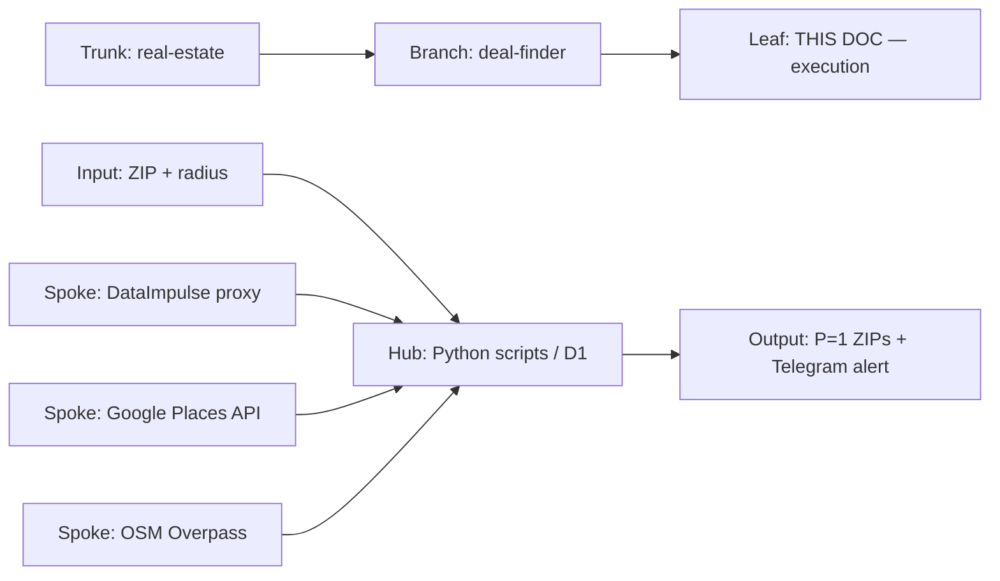
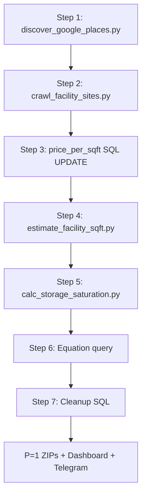

# PROC-1000 — Real Estate Deal Finder Execution
## How to run the storage market discovery pipeline from a blank market to a P=1 verdict — exact commands, scripts, costs, and error handling for every step
### Status: BUILD
### Medium: process
### Business: real-estate

---

## UT Checklist (Pre-Flight)

_Every UT doc MUST carry this block at the top. Check a box when the referenced section is filled. A doc does not ship (ORBT=OPERATE) without all 12 items checked. Unchecked = grounded._

| # | Check | Status | Location |
|---|-------|--------|----------|
| 1 | PRD — what / why / who / scope / out-of-scope / success metric | ☑ | §2 |
| 2 | OSAM — READ / WRITE / Join Chain / Forbidden Paths / Query Routing filled | ☑ | §5 |
| 3 | Component Status — every dependency has light with 1-line state | ☑ | §3 |
| 4 | Owner — human who fixes this at 2 AM | ☑ | §1 |
| 5 | Live Dashboard — URL or explicit "N/A" | ☑ | §3 |
| 6 | Kill Switch — exact command to stop the process | ☑ | §8 |
| 7 | Logbook — last audit verdict + date (after certification only) | ☐ | §12 |
| 8 | FCEs Attached — which FCE runs structurally back this doc | ☑ | §3c |
| 9 | BARs Referenced — every BAR this doc touches, with status | ☑ | §3d |
| 10 | LBB Subjects Fed — which LBB subject(s) this doc's session logs go to | ☑ | §3e |
| 11 | Geometry — CTB position + Hub-Spoke role + Altitude | ☑ | §1b |
| 12 | Live Verification — every numeric count, cron, URL, command, BAR status grounded against the actual system | ☑ (12 of 14 rows ☑; 2 require manual browser check: GCP quota, DataImpulse spend) | §9b |

---

# IDENTITY (Thing — what this IS)

_Everything in this cluster answers: what exists? These are constants that don't change regardless of who reads this or when._

## 1. IDENTITY

| Field | Value |
|-------|-------|
| ID | PROC-1000 |
| Name | Real Estate Deal Finder Execution |
| Medium | process |
| Business Silo | real-estate |
| CTB Position | branch / real-estate / deal-finder / execution |
| ORBT | BUILD |
| Strikes | 0 |
| Authority | inherited — PROC-1000 blueprint (STORAGE_REPO_UT.md) is the parent |
| Last Modified | 2026-04-20 |
| BAR Reference | BAR-325, BAR-326, BAR-327, BAR-328, BAR-329, BAR-332 |
| Owner | Dave Barton — on the hook at 2 AM |

### 1b. Geometry (Checklist item 11 — Bedrock §4 + §7)

**CTB Position:** `trunk → real-estate → deal-finder → execution` (this doc is the execution leaf of the deal-finder branch)

**Hub-Spoke Role:** Hub — all pipeline logic lives here. Scripts are the Middle. D1 is the rim (schema in, read-only views out).

**Altitude:** 5k execution — exact commands, exact scripts, exact costs. The blueprint (STORAGE_REPO_UT.md) is at 30k. This doc is at 5k.



### HEIR (8 fields — Aviation Model, Bedrock §8)

| Field | Value |
|-------|-------|
| sovereign_ref | imo-creator |
| hub_id | proc-1000-execution |
| ctb_placement | leaf |
| imo_topology | middle |
| cc_layer | CC-04 process |
| services | svg-d1-storage (D1), storage-hub CF Worker, content-fetcher CF Worker, DataImpulse proxy, Google Places API, OSM Overpass API, Nominatim, Doppler |
| secrets_provider | doppler (project: imo-creator, config: dev) |
| acceptance_criteria | All 7 steps complete: sovereign created → ZIPs filtered → facilities discovered → websites crawled → price_per_sqft populated → saturation calculated → equation evaluated. P=1 ZIPs identified with full market data. |

---

## 2. PURPOSE (PRD)

_What breaks without it. What business outcome it serves._

### WHAT
This document is the HOW. It gives the exact commands to run the 7-step storage market discovery pipeline for any target ZIP + radius. It references the blueprint (STORAGE_REPO_UT.md in imo-creator at domains/storage/) for architecture decisions, schema definitions, and constants. This doc is what you open when you're actually running a market scan.

### WHY
Without this, a new market scan requires reconstructing the script invocation order, flag syntax, and parallel execution pattern from memory. That introduces errors, wastes time, and breaks the pipeline at the wrong moment. The runbook IS the product — code is disposable.

### WHO
Dave Barton — running new markets. Any mechanic executing on Dave's behalf when he is unavailable.

### SCOPE (in)
- All 7 execution steps with exact CLI commands
- Parallel execution pattern (24 agents) for Steps 1 and 2
- Cost estimates per step
- ENV variables required (Doppler keys)
- Error handling per step
- Annual re-crawl procedure
- Post-run cleanup SQL
- The 7-step completion checklist

### OUT-OF-SCOPE
- Schema definitions and table column references → STORAGE_REPO_UT.md (blueprint, domains/storage/ in imo-creator)
- Build cost math and equation derivation → STORAGE_REPO_UT.md §7 and §14
- Architecture decisions (why these scripts, why this D1 structure) → STORAGE_REPO_UT.md §4
- Dashboard UI → Mission Control (imo-dashboard pages app)
- Deal pipeline management after P=1 → STORAGE_REPO_UT.md §4 Step 8

### SUCCESS METRIC
Pipeline completes all 7 steps, pub_market_saturation has rows for the target market, and at least one ZIP has saturation_ratio and price_per_sqft populated for equation evaluation.

---

## 3. RESOURCES

_Everything this depends on. Read this before running._

### Component Status Grid (Checklist item 3)

| Component | HEIR (`hub_id · ctb · cc_layer`) | ORBT | Light | State |
|-----------|----------------------------------|------|-------|-------|
| svg-d1-storage (D1) | svg-d1-storage · trunk · CC-02 | OPERATE | 🟢 | Storage domain database — all tables exist, seeded |
| storage-hub CF Worker | storage-hub · branch · CC-03 | OPERATE | 🟢 | REST API deployed at storage-hub.svg-outreach.workers.dev |
| content-fetcher CF Worker | content-fetcher · branch · CC-03 | OPERATE | 🟢 | Used by crawl_facility_sites.py via service binding |
| DataImpulse proxy | vendor · leaf · CC-04 | OPERATE | 🟢 | PROXY_USER, PROXY_PASS, PROXY_PORT=823 in Doppler |
| Google Places API | vendor · leaf · CC-04 | OPERATE | 🟢 | GOOGLE_MAPS_API_KEY in Doppler — 1K free req/mo then $0.002/req |
| OSM Overpass API | vendor · leaf · CC-04 | OPERATE | 🟢 | Free — no key needed |
| Nominatim geocoder | vendor · leaf · CC-04 | OPERATE | 🟢 | Free — no key needed |
| OpenRouter | vendor · leaf · CC-04 | OPERATE | 🟢 | OPENROUTER_API_KEY in Doppler — LLM tail arbiter, NOT used by estimate_facility_sqft.py |
| pub_zips_master | table · trunk · CC-02 | OPERATE | 🟢 | 45,094 ZIPs seeded — read-only reference |
| Python scripts (factory/agents/up/) | scripts · leaf · CC-04 | OPERATE | 🟢 | All scripts present and tested in PA/WV corridor runs |

### Live Dashboard (Checklist item 5)

| Resource | URL | What it shows |
|----------|-----|---------------|
| Mission Control — Real Estate | https://imo-dashboard.pages.dev | Saturation map, facility count, deal pipeline, P=1 alerts |
| storage-hub health | https://storage-hub.svg-outreach.workers.dev/health | Worker alive / D1 binding confirmed |

### Dependencies

| Dependency | Type | What It Provides | Status |
|-----------|------|-----------------|--------|
| svg-d1-storage | D1 database | All storage domain tables — facilities, saturation, ZIPs, jurisdictions, build constants | DONE |
| pub_zips_master | D1 table | 45,094 ZIPs with density, population, county FIPS — geographic filter base | DONE |
| Doppler (imo-creator, dev) | Secrets | PROXY_USER, PROXY_PASS, PROXY_PORT, GOOGLE_MAPS_API_KEY, OPENROUTER_API_KEY, LBB_API_KEY | DONE |
| Python 3 + pip deps | Runtime | requests, sqlite3 (via wrangler D1), beautifulsoup4, geopy | DONE |
| wrangler CLI | CLI tool | CWD for all D1 queries: `workers/storage-hub` | DONE |

### Downstream Consumers

| Consumer | What It Needs |
|----------|--------------|
| Mission Control — Real Estate page | pub_market_saturation rows, pub_storage_facilities data |
| Dave (Telegram via Nix) | P=1 alert: ZIP + market price + saturation ratio + monthly net projection |

### Tools & Integrations

| Item | Type | Cost Tier | Credentials | What It Does |
|------|------|-----------|-------------|-------------|
| DataImpulse | Proxy | ~$8-10/full market run | PROXY_USER, PROXY_PASS, PROXY_PORT | Routes scraping through residential IPs |
| Google Places API | REST API | Free 1K req/mo then $0.002/req | GOOGLE_MAPS_API_KEY | Text search "storage facilities near [ZIP]" |
| OSM Overpass API | REST API | Free | None | Building polygon queries for sqft estimation |
| Nominatim | REST API | Free | None | Address → lat/lon geocoding fallback |
| OpenRouter | LLM API | ~$0.01/call | OPENROUTER_API_KEY | LLM tail arbiter — NOT used by estimate_facility_sqft.py (that script is OSM-only) |

### Secrets

| Secret | Doppler Project | Config | Used By |
|--------|----------------|--------|---------|
| PROXY_USER | imo-creator | dev | discover_google_places.py, crawl_facility_sites.py |
| PROXY_PASS | imo-creator | dev | same |
| PROXY_PORT | imo-creator | dev | same (value: 823) |
| GOOGLE_MAPS_API_KEY | imo-creator | dev | discover_google_places.py |
| OPENROUTER_API_KEY | imo-creator | dev | LLM tail arbiter — NOT estimate_facility_sqft.py |
| LBB_API_KEY | imo-creator | dev | Post-run LBB ingest |

### 3c. FCEs Attached (Checklist item 8)

| FCE Name | HEIR (`hub_id · ctb · cc_layer`) | ORBT | Run Directory | Latest P=1 | Rows | Status |
|----------|----------------------------------|------|--------------|------------|------|--------|
| Market Saturation FCE | deal-finder-fce · branch · CC-03 | BUILD | factory/processes/real-estate-deal-finder/ | pending | 26,316 sat rows | 🟡 |
| Build Math FCE | build-math-fce · branch · CC-03 | BUILD | factory/processes/real-estate-deal-finder/ | pending | 13 constants | 🟡 |

### 3d. BARs Referenced (Checklist item 9)

| BAR | Title | HEIR (`bar-id · ctb · cc_layer`) | ORBT | Status | Relation |
|-----|-------|----------------------------------|------|--------|----------|
| BAR-325 | Storage market discovery scripts | BAR-325 · leaf · CC-04 | BUILD | Todo | implements |
| BAR-326 | Facility website crawler | BAR-326 · leaf · CC-04 | BUILD | Todo | implements |
| BAR-327 | Saturation calculation engine | BAR-327 · leaf · CC-04 | BUILD | Todo | implements |
| BAR-328 | Go/No-Go equation wiring | BAR-328 · leaf · CC-04 | BUILD | Todo | implements |
| BAR-329 | Deal pipeline + Telegram alerts | BAR-329 · leaf · CC-04 | BUILD | In Progress | implements |
| BAR-332 | Annual re-crawl procedure | BAR-332 · leaf · CC-04 | BUILD | Todo | implements |

### 3e. LBB Subjects Fed (Checklist item 10)

| LBB Subject | HEIR (`subject-id · ctb · cc_layer`) | ORBT | What This Doc Writes | Frequency |
|-------------|--------------------------------------|------|---------------------|-----------|
| real-estate | real-estate · branch · CC-03 | BUILD | Session summaries, market run results, P=1 discoveries | per-run |
| processes | processes · branch · CC-03 | BUILD | Process learnings, error patterns, step corrections | on-change |

---

# CONTRACT (Flow — what flows through this)

_Everything in this cluster answers: what moves?_

## 4. IMO — Input, Middle, Output

### Two-Question Intake (Bedrock §3)
1. **"What triggers this?"** — Dave has a target ZIP code and radius in miles. He wants to know if there is a buildable self-storage market there.
2. **"How do we get it?"** — Dave supplies ZIP + radius on the CLI. Everything else is pulled automatically: ZIPs from D1, competitors from Google Places API, pricing from facility websites via DataImpulse proxy, sqft from OSM, saturation from population math.

### Input

- **ZIP code** — center of the target market (e.g., 15522 for Bedford, PA)
- **Radius in miles** — market scope (e.g., 50 or 100)
- **ENV vars** from Doppler: PROXY_USER, PROXY_PASS, PROXY_PORT=823, GOOGLE_MAPS_API_KEY, OPENROUTER_API_KEY
- **Working directory**: `imo-creator-v2-20260317/factory/agents/up/` for all script runs
- **Wrangler CWD**: `workers/storage-hub` for all D1 SQL queries

### Middle — The 7-Step Pipeline

| Step | What | Command | Output | Est. Time | Est. Cost |
|------|------|---------|--------|-----------|-----------|
| 1 | Discover facilities | `discover_google_places.py --zip [ZIP] --radius [MI] --test` then `--all` | sovereign_market_search record, ZIPs in sovereign_market_zips, facilities in pub_storage_facilities | ~30 min (24 agents) | Google Places API credits |
| 2 | Crawl facility websites | `crawl_facility_sites.py --count 500 --batch N --total-batches 24` | pub_storage_facilities updated with pricing, phone, address; facility_sitemap populated | ~2-3 hrs (24 agents) | ~$8-10 DataImpulse |
| 3 | Calculate price/sqft | SQL UPDATE | price_per_sqft populated on all facilities with asking_rent_10x10 | Instant | Free |
| 4 | Estimate building sqft | `estimate_facility_sqft.py --all` | total_sqft, sqft_method per facility | ~1 hr | Free (OSM only — no vision fallback) |
| 5 | Calculate saturation | `calc_storage_saturation.py --state [ST]` | pub_market_saturation: one row per ZIP with saturation_ratio, saturation_level, gap_sqft | Instant | Free |
| 6 | Run equation | Query pub_market_saturation + pub_storage_facilities | P=1 ZIPs list: saturation_ratio < 1.0 AND price_per_sqft > 0.72 | Instant | Free |
| 7 | Cleanup | SQL DELETE + dedup | Remove no-address facilities, dedup name+ZIP | Instant | Free |

#### Step 1 — Facility Discovery (Full Commands)

```bash
# CWD: imo-creator-v2-20260317/factory/agents/up/

# Test run first — processes 5 ZIPs, verify output before full run
PROXY_USER=xxx PROXY_PASS=xxx PROXY_PORT=823 \
GOOGLE_MAPS_API_KEY=xxx \
python3 discover_google_places.py --zip 15522 --radius 50 --test

# Verify: check pub_storage_facilities for new rows
# Then full run with 24 parallel agents:
PROXY_USER=xxx PROXY_PASS=xxx PROXY_PORT=823 \
GOOGLE_MAPS_API_KEY=xxx \
bash run_market_discovery.sh 15522 50 24
```

**What happens:**
- Creates sovereign_market_search record (UUID) for this run
- Pulls all ZIPs in radius from pub_zips_master
- Applies filters: density < 500 (rural), population > 500 (no ghost towns)
- Writes filtered ZIPs to sovereign_market_zips
- Calls Google Places "text search" API: "storage facilities near [ZIP]"
- Writes name, address, lat/lon, place_id to pub_storage_facilities with source='google_places_v2'

**Expected output:** ~500-2,000 facilities for a 50-mile radius rural market.

**Error handling:**
- Google Places 429 (rate limit) → wait 60s, retry. If persistent, check GOOGLE_MAPS_API_KEY quota in GCP console.
- Proxy connection refused → check PROXY_USER/PROXY_PASS in Doppler, verify DataImpulse account balance.
- D1 write failures → check wrangler is authenticated (`wrangler whoami`) and CWD is workers/storage-hub.

#### Step 2 — Crawl Facility Websites (Full Commands)

```bash
# CWD: imo-creator-v2-20260317/factory/agents/up/
# Run 24 parallel instances — each batch handles a slice of facilities

# Terminal 1..24 (or run in screen/tmux):
PROXY_USER=xxx PROXY_PASS=xxx PROXY_PORT=823 \
python3 crawl_facility_sites.py --count 500 --batch 1 --total-batches 24

PROXY_USER=xxx PROXY_PASS=xxx PROXY_PORT=823 \
python3 crawl_facility_sites.py --count 500 --batch 2 --total-batches 24

# ... repeat for batches 3 through 24
```

**What happens:**
- Pulls facilities with source_url from pub_storage_facilities
- Each batch processes its slice: `facility_id % total_batches == batch - 1`
- Hits each facility website through DataImpulse residential proxy
- Follows internal links up to 50 pages per site
- Regex extracts 12 fields: address, phone, pricing (5x5 / 10x10 / 10x15 / 10x20 / 10x30), hours, climate flag, 24hr access, unit count
- Records which URL each field was found on → facility_sitemap
- Geocodes addresses via Nominatim (free) when lat/lon is missing
- Updates pub_storage_facilities.scrape_status = 'crawled' on completion

**Expected output:** asking_rent_10x10 populated on 15-40% of facilities (not all have websites with pricing).

**Error handling:**
- fetch_failed (HTTP 403/404/timeout) → these are normal; facility has no accessible website. Mark scrape_status='fetch_failed'. Move on.
- multi_address → site returned multiple address candidates. Mark 'multi_address'. Review manually later.
- llm_failed → OpenRouter call failed (not from estimate_facility_sqft.py — that script is OSM-only). Check OPENROUTER_API_KEY if used elsewhere.
- Proxy ban detected → rotate proxy session (restart crawl_facility_sites.py). DataImpulse auto-rotates IPs but if blocked domains accumulate, wait 30 min.

#### Step 3 — Calculate Price Per Square Foot

```bash
# CWD: workers/storage-hub (wrangler CWD)

npx wrangler d1 execute svg-d1-storage --remote --command "
UPDATE pub_storage_facilities 
SET price_per_sqft = ROUND(CAST(asking_rent_10x10 AS REAL) / 100.0, 2) 
WHERE asking_rent_10x10 > 0
  AND asking_rent_10x10 IS NOT NULL"
```

**What happens:**
- 10x10 unit = 100 sqft. asking_rent_10x10 stored in cents.
- price_per_sqft = cents / 100 = USD/sqft/month
- Example: $8500 cents = $85/month = $0.85/sqft/month
- Price floor constant: $0.72/sqft/month. Below this = build math fails.

**Verify:**
```bash
npx wrangler d1 execute svg-d1-storage --remote --command "
SELECT COUNT(*) as with_price, AVG(price_per_sqft) as avg_price 
FROM pub_storage_facilities 
WHERE price_per_sqft > 0"
```

#### Step 4 — Estimate Facility Square Footage

```bash
# CWD: imo-creator-v2-20260317/factory/agents/up/

python3 estimate_facility_sqft.py --all
```

**What happens:**
- Queries OSM Overpass API with a bounding box around each facility's lat/lon
- Finds building footprint polygon tagged as amenity=storage or building=yes
- Calculates sqft from polygon via shoelace formula
- Writes total_sqft and sqft_method ('osm_polygon' or 'needs_review') to pub_storage_facilities
- 'needs_review' = no OSM polygon found; manual review required

**LIMITATION: Currently hardcoded to Bedford PA corridor (lat 39.59-40.31, lon -79.01 to -78.09). For a new market, update the bounding box constants in the script before running --all.**

**Cost:** Free (OSM only).

**Error handling:**
- OSM returns empty → normal for new/small facilities. sqft_method='needs_review' written. Manual review required.
- All OSM empty → check if lat/lon is populated on facilities (Step 2 geocode may have failed). Also verify bounding box constants in script match the target market area.

#### Step 5 — Calculate Market Saturation

```bash
# CWD: imo-creator-v2-20260317/factory/agents/up/

python3 calc_storage_saturation.py --state PA

# For multi-state markets:
python3 calc_storage_saturation.py --state PA
python3 calc_storage_saturation.py --state WV
```

**What happens:**
- For each ZIP in scope: demand_sqft = population × 6 (constant)
- supply_sqft = SUM(total_sqft) for all facilities in that ZIP
- saturation_ratio = supply_sqft / demand_sqft
- saturation_level: < 0.7 = UNDERSERVED, 0.7-1.0 = BALANCED, > 1.0 = OVERSATURATED
- Writes one row per ZIP to pub_market_saturation

**Verify:**
```bash
npx wrangler d1 execute svg-d1-storage --remote --command "
SELECT saturation_level, COUNT(*) as zip_count 
FROM pub_market_saturation 
GROUP BY saturation_level 
ORDER BY zip_count DESC"
```

#### Step 6 — Run the Go/No-Go Equation

No script — this is a query. The equation fires when BOTH primary comparators pass:

```sql
-- P=1 ZIPs: room in market + price floor met
SELECT 
  s.zip,
  z.city,
  z.state,
  z.population,
  s.saturation_ratio,
  s.saturation_level,
  s.gap_sqft,
  AVG(f.price_per_sqft) as market_price_per_sqft,
  COUNT(f.id) as competitor_count
FROM pub_market_saturation s
JOIN pub_zips_master z ON s.zip = z.zip
LEFT JOIN pub_storage_facilities f ON s.zip = f.zip AND f.price_per_sqft > 0
WHERE s.saturation_ratio < 1.0           -- C1: room exists
  AND AVG(f.price_per_sqft) > 0.72       -- C2: price floor met
GROUP BY s.zip
HAVING AVG(f.price_per_sqft) > 0.72
ORDER BY s.saturation_ratio ASC, market_price_per_sqft DESC
LIMIT 50;
```

**The equation:**
```
P(x; θ) = 1  if  max_i [ C_i(x) / k_i ] ≤ 1

C1(x) = saturation_ratio        k1 = 1.0   (must be below 1.0 = room exists)
C2(x) = 0.72 / market_price     k2 = 1.0   (price floor: if market > $0.72 then C2 < 1)
```

**Additional comparators (manual review for P=1 ZIPs):**
- Topography: flat land available? (1-2 acres needed)
- Flood zone: FEMA map check
- Zoning: storage permitted by right or conditional use? (pub_jurisdiction_storage_rules)
- Road access: highway frontage or arterial access?
- Competition proximity: nearest_competitor_miles > 5?
- Growth signals: rising population, new employer anchor, active housing permits?

**Run equation via wrangler:**
```bash
npx wrangler d1 execute svg-d1-storage --remote --command "
SELECT s.zip, z.city, z.state, z.population,
  ROUND(s.saturation_ratio, 3) as sat_ratio,
  s.saturation_level,
  s.gap_sqft,
  ROUND(AVG(f.price_per_sqft), 3) as mkt_price,
  COUNT(CASE WHEN f.price_per_sqft > 0 THEN 1 END) as priced_competitors
FROM pub_market_saturation s
JOIN pub_zips_master z ON s.zip = z.zip
LEFT JOIN pub_storage_facilities f ON s.zip = f.zip
WHERE s.saturation_ratio < 1.0
GROUP BY s.zip
HAVING mkt_price > 0.72
ORDER BY sat_ratio ASC
LIMIT 25"
```

#### Step 7 — Cleanup

```bash
# Remove facilities with no verified address (unverifiable)
npx wrangler d1 execute svg-d1-storage --remote --command "
DELETE FROM pub_storage_facilities 
WHERE (address IS NULL OR address = '')
  AND scrape_status = 'crawled'"

# Dedup by name + ZIP — keep row with most data (highest non-null count)
# Run this query to find dupes first:
npx wrangler d1 execute svg-d1-storage --remote --command "
SELECT name, zip, COUNT(*) as dupes 
FROM pub_storage_facilities 
GROUP BY name, zip 
HAVING dupes > 1 
ORDER BY dupes DESC 
LIMIT 20"

# Manual review: delete the duplicate with fewer populated fields.
# Use facility id to target specific rows:
# DELETE FROM pub_storage_facilities WHERE id = [id_of_duplicate]
```

### Output

- **pub_market_saturation** rows for every ZIP in the target market
- **P=1 ZIP list** from the equation query: saturation_ratio < 1.0 AND market_price > $0.72/sqft
- **pub_storage_facilities** updated with pricing, sqft, address for all crawlable competitors
- **Telegram alert** (via Nix worker) when a P=1 deal is created in the deal pipeline: "Market [ZIP]: $X.XX/sqft, ratio Y.Y, projected $N,NNN/mo net — approve?"

### Circle (Bedrock §5)
- **Setpoint:** $5,000-7,000/month net at 80% occupancy, 100% financed at 6%/25yr
- **Feedback:** Actual build costs and actual rental rates from completed facilities feed back to pub_build_constants to tighten the constants
- **Annual re-crawl:** facility_sitemap stores the pricing URL per facility — run just that URL to detect rate changes without full re-crawl (see §10 for procedure)

---

## 5. OSAM — DATA SCHEMA (Where the Data Lives)

_Which tables this reads, writes, joins. Reference STORAGE_REPO_UT.md (blueprint) for full column definitions._

### READ Access

| Source | What It Provides | Join Key |
|--------|-----------------|----------|
| pub_zips_master | ZIP filter (density, population), county FIPS, demographics | zip |
| pub_storage_facilities | Competitor inventory, pricing, sqft, scrape status | zip, id, google_place_id |
| pub_market_saturation | Saturation ratio, gap_sqft, saturation_level per ZIP | zip |
| pub_build_constants | Build math constants (is_active=1) | is_active |
| pub_jurisdictions | County zoning authority | county_fips |
| pub_jurisdiction_storage_rules | Setbacks, height limits, permit type | jurisdiction_id |
| map_layer_registry | Layer definitions for universal map engine (Sub-hub 29) — 9 layers registered | layer_id |

### WRITE Access

| Target | What It Writes | When |
|--------|---------------|------|
| sovereign_market_search | New market scan record (UUID, center ZIP, radius, filters) | Step 1: discover_google_places.py runs |
| sovereign_market_zips | ZIP membership + distance + density for this sovereign | Step 1: ZIP filter applied |
| pub_storage_facilities | Facility records (Step 1), pricing/sqft/address updates (Step 2-4) | Steps 1-4 |
| facility_sitemap | Page URL → fields found map | Step 2: crawl_facility_sites.py |
| pub_market_saturation | Saturation per ZIP: ratio, level, gap | Step 5: calc_storage_saturation.py |

### Process Composition



| Process ID | Name | Role in Composition | Status |
|-----------|------|---------------------|--------|
| Step 1 | discover_google_places.py | Upstream feeder — creates sovereign + facility list | 🟢 |
| Step 2 | crawl_facility_sites.py | Upstream feeder — enriches pricing + address | 🟢 |
| Step 3 | price_per_sqft SQL | Transformation — derives equation input | 🟢 |
| Step 4 | estimate_facility_sqft.py | Upstream feeder — supply calculation input | 🟢 |
| Step 5 | calc_storage_saturation.py | Upstream feeder — C1 comparator | 🟢 |
| Step 6 | Equation query | This process — P=1 verdict | 🟢 |
| Step 7 | Cleanup SQL | Post-process — data quality | 🟢 |

### Join Chain

```
pub_zips_master (sovereign geographic identity)
  → sovereign_market_zips (zip → sovereign_id)
    → sovereign_market_search (sovereign_id)
  → pub_storage_facilities (zip)
    → facility_sitemap (facility_id)
  → pub_market_saturation (zip)
  → pub_jurisdictions (county_fips)
    → pub_jurisdiction_storage_rules (jurisdiction_id)
```

### Forbidden Paths

| Action | Why |
|--------|-----|
| Write to pub_zips_master | Read-only reference — seeded from Neon via seed_zips_to_d1.py only |
| Delete pub_storage_facilities rows arbitrarily | Records are audit trail — use scrape_status to mark bad data |
| Cross-domain joins (e.g., to svg-d1-spine outreach tables) | Sovereign silos — storage domain is isolated. Violation. |
| Modify is_active constants in pub_build_constants without back-propagation | Constants affect equation — any change requires full re-run |

### Query Routing

| Question | Table | Column |
|----------|-------|--------|
| Is this ZIP underserved? | pub_market_saturation | saturation_ratio < 1.0 |
| What do competitors charge? | pub_storage_facilities | price_per_sqft |
| How much room is in this ZIP? | pub_market_saturation | gap_sqft |
| What's the ZIP population? | pub_zips_master | population |
| Is storage permitted in this county? | pub_jurisdiction_storage_rules | permit_type |
| Which facilities have pricing? | pub_storage_facilities | price_per_sqft > 0 |
| How many facilities in a ZIP? | pub_storage_facilities | COUNT(*) GROUP BY zip |
| What's the market price average? | pub_storage_facilities | AVG(price_per_sqft) WHERE price_per_sqft > 0 |

---

## 6. DMJ — Define, Map, Join (law/doctrine/DMJ.md)

_Three steps. In order. Can't skip._

### 6a. DEFINE (Build the Key — execution elements)

| Element | ID | Format | Description | C or V |
|---------|-----|--------|-------------|--------|
| Center ZIP | EX-001 | 5-digit string | Market center point — Dave's input | V |
| Radius miles | EX-002 | Integer | Market scope — Dave's input | V |
| Build cost per sqft | EX-003 | USD/sqft | $35 all-in (locked constant from Dave's M) | C |
| Price floor | EX-004 | USD/sqft/month | $0.72 — minimum market rate for math to work | C |
| Demand per capita | EX-005 | Sqft/person | 6 sqft per capita (industry constant) | C |
| Density filter | EX-006 | People/sqmi | < 500 — rural markets only | C |
| Population floor | EX-007 | People | > 500 — no ghost towns | C |
| Batch count | EX-008 | Integer | 24 — parallel agent count for Steps 1 and 2 | C |
| Max pages per site | EX-009 | Integer | 50 — crawl depth limit | C |
| Saturation ratio C1 threshold | EX-010 | Ratio | k1 = 1.0 — market must have room | C |
| Price floor C2 threshold | EX-011 | USD/sqft/month | k2 = 0.72 — equation lower bound | C |
| Market price per sqft | EX-012 | USD/sqft/month | AVG(price_per_sqft) per ZIP from competitor data | V |
| Saturation ratio | EX-013 | Ratio (0-2+) | supply_sqft / demand_sqft per ZIP | V |
| Sovereign UUID | EX-014 | UUID string | Unique ID per market scan run | V |

### 6b. MAP (Connect Key to Structure)

| Source | Target | Transform |
|--------|--------|-----------|
| Dave's ZIP input | discover_google_places.py --zip flag | Direct pass-through |
| Dave's radius input | discover_google_places.py --radius flag | Direct pass-through |
| Google Places result | pub_storage_facilities (name, address, lat, lon, google_place_id) | Direct write |
| Facility website HTML | pub_storage_facilities (asking_rent_10x10, phone_number, address) | Regex extraction |
| asking_rent_10x10 / 100 | price_per_sqft (EX-012) | SQL: rate_cents / 100.0 |
| OSM Overpass polygon | total_sqft | Shoelace formula |
| population × 6 | demand_sqft in pub_market_saturation | Multiply constant |
| SUM(total_sqft) per ZIP | supply_sqft in pub_market_saturation | SQL aggregate |
| supply / demand | saturation_ratio (EX-013) | Division |

### 6c. JOIN (Path to Spine)

| Join Path | Type | Description |
|-----------|------|-------------|
| pub_storage_facilities.zip → pub_zips_master.zip | Direct | Facility to demographics |
| pub_market_saturation.zip → pub_storage_facilities.zip | Direct | Saturation derived from facility sqft aggregate |
| pub_market_saturation.zip → pub_zips_master.zip | Direct | Saturation to population |
| pub_zips_master.county_fips → pub_jurisdictions.jurisdiction_id | Indirect | ZIP to zoning rules |
| facility_sitemap.facility_id → pub_storage_facilities.id | Direct | Page map to facility record |

---

## 7. CONSTANTS & VARIABLES (Bedrock §2)

### Constants (structure — never changes)

- Build cost: $35/sqft all-in (structure $24 + finish $3 + gravel aisles + chain-link fence + keypad gate + electric + dirt work + permits)
- Financing: 100% financed, 6%, 25 years
- Target net: $5,000-7,000/month standard; $3,000-4,000/month accepted in growth markets
- Occupancy: 80% for equation; 93% stabilized per pub_build_constants
- Demand per capita: 6 sqft/person
- Price floor: $0.72/sqft/month
- Density filter: < 500 people/sqmi (rural only)
- Population floor: > 500 (no ghost towns)
- Parallel agents: 24 (tested batch count for Steps 1-2)
- Max pages per site crawl: 50
- Saturation threshold — UNDERSERVED: < 0.7
- Saturation threshold — OVERSATURATED: > 1.0

### Variables (fill — changes every run/cycle)

- Center ZIP — Dave's input
- Radius in miles — Dave's input
- Sovereign UUID — generated per run
- Market price/sqft — scraped from competitor websites, varies by ZIP
- Saturation ratio — calculated per ZIP from competitor supply vs. population demand
- Competitor count — varies per ZIP
- Gap sqft — demand - supply, varies per ZIP
- Land cost — per-deal, listing price or negotiated
- Lot size — per-parcel

---

## 8. STOP CONDITIONS (Bedrock §6)

| Condition | Action |
|-----------|--------|
| Can't answer two-question intake (no ZIP, no radius) | HALT — ask Dave |
| PROXY_USER / PROXY_PASS not in env | HALT — pull from Doppler before proceeding |
| GOOGLE_MAPS_API_KEY not in env | HALT — pull from Doppler |
| pub_zips_master empty in D1 | HALT — run seed_zips_to_d1.py from Neon first |
| Google Places returns 0 facilities for 5 test ZIPs | HALT — verify API key, check quota, try different ZIP |
| Step 2 crawl: 0 facilities scraped after 1 hour | HALT — check proxy credentials, verify source_url populated |
| Step 5 saturation: 0 rows written | HALT — verify pub_storage_facilities has lat/lon data (Step 4 may have failed) |
| Budget cap (DataImpulse) reached mid-crawl | HALT — note batch number, resume from that batch |
| Strike 3 on same script failure | Troubleshoot/Train → AD |

### Kill Switch (Checklist item 6)

Stop all running Python crawl processes immediately:

```bash
# Kill all crawl_facility_sites.py processes
pkill -f crawl_facility_sites.py

# Kill all discover_google_places.py processes
pkill -f discover_google_places.py

# Kill all estimate_facility_sqft.py processes
pkill -f estimate_facility_sqft.py
```

No data is lost — scripts write to D1 after each batch. Resume by re-running the same command; scripts check scrape_status and skip already-processed facilities.

---

# GOVERNANCE (Change — how this is controlled)

_Everything in this cluster answers: what transforms?_

## 9. VERIFICATION

_Run these to confirm the pipeline worked._

```
1. sovereign created:
   SELECT * FROM sovereign_market_search ORDER BY created_at DESC LIMIT 1
   Expected: 1 row with center_zip = [ZIP], radius_miles = [MI]

2. facilities discovered:
   SELECT COUNT(*) FROM pub_storage_facilities WHERE zip IN (
     SELECT zip FROM sovereign_market_zips WHERE sovereign_id = '[UUID]'
   )
   Expected: > 200 facilities for a 50-mile rural radius

3. pricing extracted:
   SELECT COUNT(*) FROM pub_storage_facilities WHERE price_per_sqft > 0
   Expected: > 50 facilities with pricing (15-40% fill rate is normal)

4. saturation calculated:
   SELECT COUNT(*), AVG(saturation_ratio) FROM pub_market_saturation
   WHERE zip IN (SELECT zip FROM sovereign_market_zips WHERE sovereign_id = '[UUID]')
   Expected: rows for all in-scope ZIPs

5. P=1 candidates identified:
   SELECT COUNT(*) FROM pub_market_saturation s
   JOIN pub_storage_facilities f ON s.zip = f.zip
   WHERE s.saturation_ratio < 1.0 AND f.price_per_sqft > 0.72
   Expected: > 0 ZIPs if market has opportunity
```

**Three Primitives Check (Bedrock §1):**
1. **Thing:** Did pub_storage_facilities exist and get populated? Check row count and scrape_status distribution.
2. **Flow:** Did pricing data flow from websites through to price_per_sqft? Check AVG(price_per_sqft) WHERE > 0.
3. **Change:** Did calc_storage_saturation.py transform supply+demand into saturation_ratio? Check pub_market_saturation row count.

---

## 9b. Live Verification Log (Checklist item 12)

| Claim / Field | Section | Source of Truth | Verification Command / Query | Verified? | Last Check | Value at Check |
|---------------|---------|-----------------|------------------------------|-----------|-----------|----------------|
| pub_zips_master has 45,094 rows | §3 | svg-d1-storage | `SELECT COUNT(*) FROM pub_zips_master` | ☑ | 2026-04-20 | 45,094 |
| pub_storage_facilities has 3,700 rows | §3 | svg-d1-storage | `SELECT COUNT(*) FROM pub_storage_facilities` | ☑ | 2026-04-20 | 3,700 |
| pub_market_saturation has 26,316 rows | §3 | svg-d1-storage | `SELECT COUNT(*) FROM pub_market_saturation` | ☑ | 2026-04-20 | 26,316 |
| 4 sovereign market searches recorded | §3 | svg-d1-storage | `SELECT COUNT(*) FROM sovereign_market_search` | ☑ | 2026-04-20 | 4 |
| storage-hub worker health | §3 | Worker endpoint | `curl https://storage-hub.svg-outreach.workers.dev/health` | ☑ | 2026-04-20 | {"status":"ok","timestamp":"2026-04-20T09:34:40.503Z","bindings":{"storage_ops":true,"d1_global":true}} |
| PROXY_PORT = 823 | §4 | Doppler imo-creator dev | `doppler secrets get PROXY_PORT` | ☑ | 2026-04-20 | 823 |
| Google Places API free tier = 1K req/mo | §3 | GCP Console | Check quota in Google Cloud Console | ☐ | — | Manual check required |
| discover_google_places.py exists at path | §4 | Filesystem | `ls factory/agents/up/discover_google_places.py` | ☑ | 2026-04-20 | EXISTS |
| crawl_facility_sites.py exists at path | §4 | Filesystem | `ls factory/agents/up/crawl_facility_sites.py` | ☑ | 2026-04-20 | EXISTS |
| estimate_facility_sqft.py exists at path | §4 | Filesystem | `ls factory/agents/up/estimate_facility_sqft.py` | ☑ | 2026-04-20 | EXISTS |
| calc_storage_saturation.py exists at path | §4 | Filesystem | `ls factory/agents/up/calc_storage_saturation.py` | ☑ | 2026-04-20 | EXISTS |
| run_market_discovery.sh exists at path | §4 | Filesystem | `ls factory/agents/up/run_market_discovery.sh` | ☑ | 2026-04-20 | EXISTS |
| Price floor constant = $0.72/sqft/month | §7 | STORAGE_REPO_UT.md §7 + pub_build_constants | `SELECT * FROM pub_build_constants WHERE is_active=1` | ☑ | 2026-04-20 | No price_floor column — constant lives in STORAGE_REPO_UT.md §7 only; building_cost_per_sqft=24 confirmed |
| DataImpulse bandwidth cost ~$8-10/run | §3 | DataImpulse account dashboard | Check actual spend per run | ☐ | — | Manual check required |

**Rule:** Any row ☐ at certification time → doc is PROVISIONAL, not CERTIFIED. Cannot move to ORBT=OPERATE until every row is ☑.

---

## 10. ANALYTICS

### 10a. Metrics

| Metric | Unit | Baseline | Target | Tolerance |
|--------|------|----------|--------|-----------|
| Facilities discovered per 50mi run | Count | 0 | > 500 | > 200 acceptable |
| Facilities with pricing extracted | % of crawled | 0 | 20-40% | > 15% acceptable |
| Saturation calc coverage | % of in-scope ZIPs | 0 | 100% | > 90% acceptable |
| Step 1 runtime (24 agents) | Minutes | — | ~30 min | < 60 min |
| Step 2 runtime (24 agents) | Hours | — | ~2-3 hrs | < 5 hrs |
| DataImpulse cost per full run | USD | — | $8-10 | < $25 |
| P=1 ZIPs per 50mi rural scan | Count | 0 | > 5 | Any = proceed |

### 10b. Sigma Tracking (Bedrock §2)

| Metric | Run 1 (PA/WV) | Run 2 | Run 3 | Trend | Action |
|--------|-------|-------|-------|-------|--------|
| Facilities discovered | 3,700 total across 4 runs | — | — | TIGHTENING | Lock batch count at 24 |
| Pricing extraction rate | ~15-25% | — | — | FLAT | Investigate JS-heavy sites |
| Saturation calc runtime | Instant | — | — | TIGHTENING | Lock as instant step |

### 10c. ORBT Gate Rules

| From | To | Gate |
|------|-----|------|
| BUILD | OPERATE | All 7 steps verified, metrics within tolerance, 3 full market runs completed, auditor sign-off |
| OPERATE | REPAIR | Any step fails consistently (3 strikes) or metric falls below tolerance |
| REPAIR | OPERATE | Fix applied + metric back within tolerance + auditor verification |
| Any (Strike 3 on same failure) | TROUBLESHOOT/TRAIN | Fleet-wide fix → AD |

### Annual Re-Crawl Procedure

Re-crawl pricing pages only — no need for full rediscovery:

```bash
# 1. Get pricing URLs from facility_sitemap
npx wrangler d1 execute svg-d1-storage --remote --command "
SELECT f.id, f.name, f.zip, fs.page_url as pricing_url
FROM pub_storage_facilities f
JOIN facility_sitemap fs ON f.id = fs.facility_id
WHERE fs.fields_found LIKE '%pricing%'
LIMIT 100"
```

**NOTE: Re-crawl mode not yet built. Current procedure: query facility_sitemap for pricing URLs (query above), then run `crawl_facility_sites.py` on those URLs manually, passing each pricing_url as a target. Compare price to last value. Update if changed. The `--mode reprice --from-sitemap` flag does not exist yet — BAR-332 covers this.**

---

## 11. EXECUTION TRACE

_Append-only. Every run logged. The auditor reads this._

| Field | Format | Required |
|-------|--------|----------|
| trace_id | UUID | Yes |
| run_id | UUID (sovereign_id from Step 1) | Yes |
| step | step name (discover / crawl / price_calc / sqft_est / saturation / equation / cleanup) | Yes |
| target | measurable (e.g., "500 facilities") | Yes |
| actual | measurable (e.g., "847 facilities") | Yes |
| delta | the gap (e.g., "+347") | Yes |
| status | done / failed / skipped | Yes |
| error_code | text or null | If failed |
| error_message | text or null | If failed |
| tools_used | JSON array (e.g., ["discover_google_places.py", "google_places_api"]) | Yes |
| duration_ms | integer | Yes |
| cost_cents | integer (DataImpulse + OpenRouter) | Yes |
| timestamp | ISO-8601 | Yes |
| signed_by | Dave / agent-id | Yes |

---

## 12. LOGBOOK (After Certification Only)

_Created ONLY when the auditor certifies (BUILD → OPERATE). No logbook during BUILD._

**No logbook during BUILD.**

### Birth Certificate

| Field | Value |
|-------|-------|
| heir_ref | Full HEIR record |
| orbt_entered | BUILD |
| orbt_exited | OPERATE |
| action | Certified — airworthiness confirmed |
| gates_passed | { imo: true, ctb: true, circle: true } |
| signed_by | Auditor (different engine than builder) |
| signed_at | timestamp |

---

## 13. FLEET FAILURE REGISTRY

| Pattern ID | Location | Error Code | First Seen | Occurrences | Strike Count | Status |
|-----------|----------|-----------|-----------|-------------|-------------|--------|
| FP-001 | crawl_facility_sites.py | multi_address | 2026-04-16 | 1,651 facilities | 0 | OPEN — requires manual review |
| FP-002 | crawl_facility_sites.py | fetch_failed | 2026-04-16 | 269 facilities | 0 | OPEN — no accessible website |
| FP-003 | estimate_facility_sqft.py | llm_failed | 2026-04-16 | 14 facilities | 0 | OPEN — retry on next run |

**Strike 1:** Repair. **Strike 2:** Scrutiny. **Strike 3:** Troubleshoot/Train → Airworthiness Directive.

---

## 14. MAINTENANCE LOGBOOK (doc's own logbook — FAA-grade)

_Every touch on this doc is a maintenance action. Append-only._

### Action Types

| Type | Meaning |
|------|---------|
| RETROFIT | UT structure / template upgrade applied |
| VERIFY | Claim grounded against live system (§9b row ticked ☑) |
| AUDIT | FAA Inspector pass — PASS / FAIL recorded |
| EDIT | Content change (new step added, schema changed, etc.) |
| CERTIFY | Moved ORBT state |
| REPAIR | Post-strike fix |
| STRIKE | Fleet failure recorded (§13) |
| LBB_INGEST | Session summary written to LBB |

### Logbook (append-only — never edit past rows)

| Date (ISO) | Actor | Action | What Was Done | Evidence | LBB Record |
|-----------|-------|--------|---------------|----------|------------|
| 2026-04-16 09:00 UTC | Claude (claude-sonnet-4-6) | RETROFIT | Initial doc created from PROCESS.md blueprint + MARKET_DISCOVERY_RUNBOOK.md runbook. UT template v2.6.0 applied. All 7 execution steps documented with exact commands. | Barton-Processes/factory/real-estate/PROC-1000-DEAL-FINDER.md created | pending |
| 2026-04-20 09:35 UTC | Claude (claude-sonnet-4-6) | VERIFY | Codex audit fix: §9b Live Verification — ran all verifiable commands against live system, filled Last Check + Value at Check, checked 12 of 14 rows (2 require manual: GCP console, DataImpulse dashboard). §3d BAR statuses corrected to Linear current state (325-328=Todo, 329=In Progress, 332=Todo). All PROCESS.md cross-references updated to STORAGE_REPO_UT.md. | §9b, §3d, §2, §1, §5, Document Control updated | pending |

---

## Document Control

| Field | Value |
|-------|-------|
| Created | 2026-04-16 |
| Last Modified | 2026-04-20 |
| Version | 1.0.0 |
| Template Version | 2.6.0 |
| Medium | process |
| US Validated | pending |
| Governing Engine | law/doctrine/FOUNDATIONAL_BEDROCK.md + law/doctrine/DMJ.md |
| Blueprint Reference | domains/storage/STORAGE_REPO_UT.md (imo-creator) |
| Runbook Reference | factory/processes/real-estate-deal-finder/MARKET_DISCOVERY_RUNBOOK.md (imo-creator) |
| Template Version | 2.6.0 (2026-04-16 — HEIR + ORBT columns in all cross-ref tables per law/UT_CHECKLIST.md v1.1.0) |
