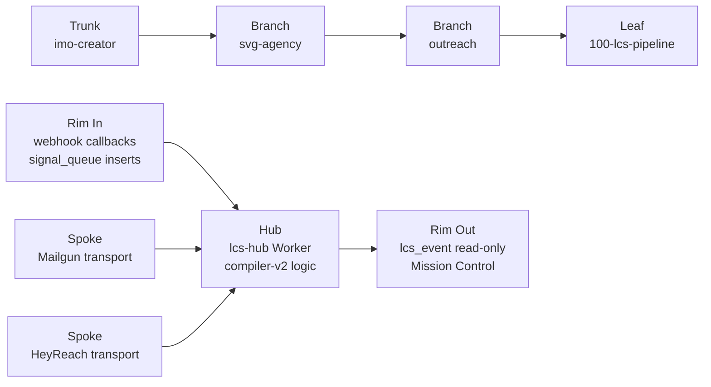
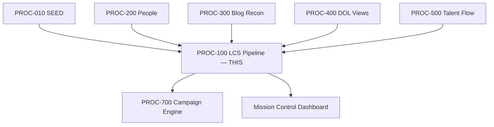

# LCS Pipeline
## Three-stage compiler — CID → SID → MID — converts raw signals from upstream worker spokes into delivered outreach messages with full webhook feedback loop.
### Status: REPAIR
### Medium: process
### Business: svg-agency

## UT Checklist (Pre-Flight — per law/UT_CHECKLIST.md v1.2.0)

| # | Check | Status | Location |
|---|-------|--------|----------|
| 1 | PRD — what / why / who / scope / out-of-scope / success metric | [x] | §2 |
| 2 | OSAM — READ / WRITE / Process Composition / Join Chain / Forbidden Paths / Query Routing filled | [x] | §5 |
| 3 | Component Status — every dep has green / yellow / red with 1-line state | [x] | §3 |
| 4 | Owner — human who fixes this at 2 AM | [x] | §1 |
| 5 | Live Dashboard — URL or explicit "N/A" | [x] | §3 |
| 6 | Kill Switch — exact command to stop the process | [x] | §8 |
| 7 | Logbook — last audit verdict + date (after certification only) | [ ] | §12 — REPAIR phase; no logbook until re-certification |
| 8 | FCEs Attached — which FCE runs structurally back this doc | [x] | §3c |
| 9 | BARs Referenced — every BAR this doc touches, with status | [x] | §3d |
| 10 | LBB Subjects Fed — which LBB subject(s) this doc's session logs go to | [x] | §3e |
| 11 | Geometry — CTB position + Hub-Spoke role + Altitude | [x] | §1b |
| 12 | Live Verification — every numeric count, cron, URL, command, BAR status grounded against the live system | [x] | §9b |
| 13 | ctb_node — declared path on the Barton Enterprises CTB trunk | [x] | §1 Identity |

## §1 IDENTITY {#sec-1-identity}

| Field | Value |
|-------|-------|
| ID | PROC-100 |
| Name | LCS Pipeline |
| Medium | process |
| Business Silo | svg-agency |
| CTB Position | trunk (imo-creator) → branch (svg-agency) → branch (outreach) → leaf (100-lcs-pipeline) |
| ORBT | REPAIR |
| Strikes | 2 |
| Authority | inherited — sovereign imo-creator-v2; Barton-Processes parent; company-lifecycle-cl blueprint |
| Version | v1.0.5 |
| Last Modified | 2026-05-10 |
| BAR Reference | BAR-131, BAR-132, BAR-37, BAR-48, BAR-152 |
| Owner | Dave Barton |
| ctb_node | barton-enterprises/svg-agency/outreach/lcs-pipeline |
| DOCTRINE | `DOCTRINE.md` (sibling file — see D-100-01 through D-100-12) |
| last_transition_at | 2026-04-29 — REPAIR (quarantine-356 bounce-rate fix in flight) |

### 1b. Geometry {#sec-1b-geometry}

**CTB Position:** trunk (imo-creator) → branch (svg-agency) → branch (outreach) → leaf (100-lcs-pipeline)

**Hub-Spoke Role:** **Hub** — all compiler logic (CID → SID → MID) runs inside the lcs-hub Worker. Spokes are dumb carriers: Mailgun (email transport), HeyReach (LinkedIn transport). Rim is the webhook boundary (delivery events in, schema-validated) and the `/health`+`/status` read-only endpoints out.

**Altitude:** 10k operational — the runbook level. Strategic reasoning at 50k; tactical pipeline architecture at 30k; per-file execution at 5k.



### HEIR (8 fields — Aviation Model, Bedrock §8)

| Field | Value |
|-------|-------|
| sovereign_ref | imo-creator-v2 |
| hub_id | lcs-hub |
| ctb_placement | leaf |
| imo_topology | middle |
| cc_layer | CC-04 |
| services | CF Worker (cron + HTTP + queue consumer); D1 spine (lcs-hub); D1 outreach (svg-d1-outreach-ops read-only); Mailgun (email delivery); HeyReach (LinkedIn delivery); LBB (content library queries) |
| secrets_provider | doppler |
| acceptance_criteria | Signal in → CID compiled → SID constructed → MID delivered → webhook received → CID enriched; bidirectional trace MID→SID→CID→signal; errors write to lcs_err0; ORBT 3-strike protocol operational; all processing on D1 — Neon vault only; SID compiler gates on has_verified_email = 1 only |

## §2 PRD {#sec-2-purpose}

### WHAT
The LCS Pipeline is the outreach machine. It is a three-stage config-driven compiler: CID (Compiled Intelligence Dossier) gathers all available company intelligence from upstream D1 tables; SID (Signal Document) constructs a personalized message using a frame template selected from the registry; MID (Message Delivery Record) delivers the message via Mailgun or HeyReach and tracks webhook feedback. Every cycle is smarter than the last — bounces and opens accumulate, the footprint never shrinks.

### WHY
Without this process, every upstream enrichment (32,704 company records, DOL filings, people slots, BIT scores) sits idle. This is the only process that converts intelligence into delivered conversations. If it halts, outreach volume drops to zero. If it sends on unverified emails (REPAIR trigger), bounce rate poisons domain reputation and can blacklist the sending domains.

### WHO
- Dave Barton (owner, pilot, reviews escalations)
- Mission Control dashboard (reads lcs_event + lcs_err0)
- Process 700 Campaign Engine (sequences MIDs)
- BAR-132 AI synthesis (reads CID for narrative generation)

### SCOPE (in)
- Signal ingestion from upstream worker spokes (DOL, People, Blog, Talent Flow)
- CID compilation from outreach D1 (9-gate qualification, intelligence tier assignment)
- SID construction (recipient selection, frame template, LBB content enrichment)
- MID delivery via Mailgun (email) or HeyReach (LinkedIn)
- Webhook processing (delivery status updates, ORBT strike accumulation)
- Bidirectional trace by any pipeline ID

### OUT-OF-SCOPE
- AI narrative synthesis (BAR-132 — separate worker, adds Claude API as tail arbitration)
- Monte Carlo probability simulation (BAR-133 — separate layer)
- Content library taxonomy management (BAR-48 — LBB owns this)
- Data refresh / outreach D1 updates (Process 010 SEED owns seeding; 200/300/400/500 own enrichment)
- Dashboard rendering (separate — reads lcs_event / lcs_err0 as read-only consumer)
- Reply-loop processing (REPLY-LOOP-RUNBOOK.md owns inbound reply handling)

### SUCCESS METRIC
Zero bounced messages attributed to unverified email addresses; delivery_failure_rate ≤ 5%; bounce_rate ≤ 2% per domain per 24h window.

## §3 RESOURCES {#sec-3-resources}

Required doctrine references for every process UT:

- `law/UNIFIED_TEMPLATE.md`
- `law/UT_CHECKLIST.md`
- `law/doctrine/PROCESS_FILL_INSTRUCTIONS.md`
- `law/doctrine/HOW_TO_BUILD_ANYTHING.md` (repair manual)
- `law/doctrine/BARTON_ENTERPRISES_WORLD_ATLAS.md` (Atlas System bundle)
- `law/doctrine/KEY.md`

### Component Status Grid

| Component | HEIR (`hub_id · ctb · cc_layer`) | ORBT | Light | State |
|-----------|----------------------------------|------|-------|-------|
| lcs-hub CF Worker | lcs-hub · leaf · CC-04 | REPAIR | yellow | Deployed; SID gate fix in flight (D-100-01) |
| D1 spine (svg-d1-spine) | lcs-hub · leaf · CC-04 | OPERATE | green | 356 quarantine rows nulled 2026-04-28; 4 in-flight MIDs canceled |
| D1 outreach (svg-d1-outreach-ops) | outreach-ops · leaf · CC-04 | OPERATE | green | Read-only; slot_workbench has_verified_email col in use |
| Mailgun sending domains | lcs-hub · leaf · CC-04 | OPERATE | green | 14 domains healthy; daily_cap 80 each = 1,120/day |
| HeyReach API | lcs-hub · leaf · CC-04 | TBV | yellow | Webhook URL not yet configured in HeyReach dashboard |
| LBB content library | lbb · branch · CC-03 | OPERATE | green | svg-sales + svg-outreach subjects feed SID enrichment |
| CF Queue (lcs-pipeline) | lcs-hub · leaf · CC-04 | OPERATE | green | Consumer active; DLQ (lcs-dlq) monitoring required |
| Mailgun webhooks | lcs-hub · leaf · CC-04 | TBV | yellow | Webhook URL configured — verify in Mailgun dashboard |
| Process 200 People | people-worker · leaf · CC-04 | REPAIR | yellow | 72% slot fill; email discovery (201) red |
| Process 010 SEED | seed-d1 · leaf · CC-04 | OPERATE | green | 32,704 companies seeded |
| Process 400 DOL Views | dol-views · leaf · CC-04 | OPERATE | green | 27,464 DOL records available |

### Live Dashboard

| Resource | URL | What it shows |
|----------|-----|---------------|
| Worker health | https://lcs-hub.svg-outreach.workers.dev/health | Signal/CID/company counts, domain health |
| Pipeline status | https://lcs-hub.svg-outreach.workers.dev/status | Pending/compiled/constructed/delivered counts by stage |
| Mission Control | TBV | Reads lcs_event + lcs_err0 for pipeline telemetry |

### Dependencies

| Dependency | Type | What It Provides | Status |
|-----------|------|-----------------|--------|
| D1 spine (lcs-hub binding: `D1`) | database | Signal queue, CID, SID, MID, events, errors, registries, domain rotation | DONE |
| D1 outreach (binding: `D1_OUTREACH`) | database | Company target, DOL, people slots, BIT scores — READ ONLY | DONE |
| Mailgun API | API | Email delivery for MID stage | DONE |
| HeyReach API | API | LinkedIn delivery for MID stage | DONE (webhook pending) |
| LBB Worker | service | SID enrichment — svg-sales + svg-outreach knowledge records | DONE |
| CF Queue (lcs-pipeline + lcs-dlq) | queue | Async signal processing + dead letter | DONE |
| Doppler secrets | secrets | MAILGUN_API_KEY, HEYREACH_API_KEY, LBB_API_KEY | DONE |
| Process 010 SEED | process | Populates outreach D1 from Neon vault | DONE |
| Process 200 People | process | CEO/CFO/HR slots + verified email flags | REPAIR |
| Processes 300/400/500 | processes | Signal generation (Blog, DOL, Talent Flow) | BUILD/OPERATE |

### Downstream Consumers

| Consumer | What It Needs |
|----------|--------------|
| Process 700 Campaign Engine | lcs_mid_sequence_state records for sequencing follow-ups |
| Mission Control dashboard | lcs_event (CANONICAL) + lcs_err0 for telemetry |
| BAR-132 AI synthesis | lcs_cid records for narrative generation |
| REPLY-LOOP-RUNBOOK.md (peer process) | Inbound reply handling — reads outbound MID chain for context |
| Vault PUSH (batch) | D1 spine → Neon weekly promote |

### Tools & Integrations

| Item | Type | Cost Tier | Credentials | What It Does |
|------|------|-----------|-------------|-------------|
| Cloudflare Workers | compute | Top Shelf | CF account | Host lcs-hub — cron + queue + HTTP |
| Mailgun | email API | Top Shelf | MAILGUN_API_KEY (Doppler) | Delivers email MIDs; 14 domain rotation |
| HeyReach | LinkedIn API | Top Shelf | HEYREACH_API_KEY (Doppler) | Delivers LinkedIn MIDs |
| LBB Worker | content API | Free (internal) | LBB_API_KEY (Doppler) | SID enrichment — Barton voice + company intel |
| D1 (Cloudflare) | database | Cheap | CF binding | Edge workspace — all processing |
| Neon PostgreSQL | database | Top Shelf | NEON_URL (Doppler) | Vault only — SEED source, never queried during ops |

### Secrets

| Secret | Doppler Project | Config | Used By |
|--------|----------------|--------|---------|
| MAILGUN_API_KEY | imo-creator | dev | MID email delivery |
| HEYREACH_API_KEY | imo-creator | dev | MID LinkedIn delivery |
| LBB_API_KEY | imo-creator | dev | SID LBB content enrichment |
| NEON_URL | imo-creator | dev | SEED only — Neon vault source |

### 3c. FCEs Attached

| FCE Name | HEIR (`hub_id · ctb · cc_layer`) | ORBT | Run Directory | Latest P=1 | Rows | Status |
|----------|----------------------------------|------|--------------|------------|------|--------|
| LCS Gate Stack FCE | lcs-hub · leaf · CC-04 | TBV | factory/cl/100-lcs-pipeline/ | TBV | TBV | TBV — no dedicated FCE run yet; gate stack is embedded in compiler-v2.ts |

### 3d. BARs Referenced

| BAR | Title | HEIR (`bar-id · ctb · cc_layer`) | ORBT | Status | Relation |
|-----|-------|----------------------------------|------|--------|----------|
| BAR-37 | LCS smoke test end-to-end | TBV | OPERATE | Done | implements — first full CID→SID→MID run |
| BAR-48 | Content library taxonomy for SID | TBV | BUILD | In Progress | tracks — LBB enrichment path |
| BAR-131 | LCS pipeline architecture | TBV | OPERATE | Done | implements — pipeline architecture |
| BAR-132 | AI narrative synthesis | TBV | BUILD | In Progress | blocks — reads CID; tail arbitration |
| BAR-152 | LCS v2 deployment | TBV | OPERATE | Done | implements — compiler-v2 deployment |

### 3e. LBB Subjects Fed

| LBB Subject | HEIR (`subject-id · ctb · cc_layer`) | ORBT | What This Doc Writes | Frequency |
|-------------|--------------------------------------|------|---------------------|-----------|
| svg-outreach-proc | svg-outreach-proc · branch · CC-03 | OPERATE | Session summaries; quarantine events; REPAIR state transitions | per-run / on-change |
| svg-sales | svg-sales · branch · CC-03 | OPERATE | SID message enrichment reads (read-only consumer) | per-SID |

## §4 IMO — Input, Middle, Output {#sec-4-imo}

### Two-Question Intake (Bedrock §3)
1. **What triggers this?** — Signals arrive in `lcs_signal_queue` from upstream dumb worker spokes (DOL, People, Blog, Talent Flow). Daily cron at 07:00 UTC scans for pending signals. Queue consumer processes in real-time on ingest.
2. **How do we get it?** — D1 spine binding `D1` (signal queue, registries); D1 outreach binding `D1_OUTREACH` (company data, people slots — read only). Neon is vault only — never queried during ops.

### Input
Signals from upstream processes: `sovereign_company_id`, `signal_set_hash` (links to `lcs_signal_registry`), and `priority`. Company intelligence pre-loaded into D1 outreach by SEED + enrichment processes.

### Middle

| Step | Input | What Happens | Output | Tool Used |
|------|-------|-------------|--------|-----------|
| 1 — CID Compilation | Signal from lcs_signal_queue | Read company data from D1 outreach (CT, DOL, people slots, BIT). Run 9-gate qualification. Determine intelligence tier (2-5) by section_count from outreach footprint. Select frame from lcs_frame_registry. | lcs_cid record (compilation_status: COMPILED or FAILED) | D1 queries (compiler-v2.ts) |
| 2 — SID Construction | lcs_cid record | Read CID + frame template from lcs_frame_registry. Get recipient from people_company_slot (CFO → CEO → HR priority). Gate: has_verified_email = 1 ONLY (D-100-01). Query LBB for enrichment. Build personalized subject + body. | lcs_sid_output record (recipient_email, construction_status: CONSTRUCTED or FAILED) | D1 queries + LBB API |
| 3 — MID Delivery | lcs_sid_output record | Select sending domain from lcs_domain_rotation (LRU, filtered by is_paused = 0 AND sent_today < daily_cap). Reply-To = dave@svg.agency (D-100-02). Deliver via Mailgun or HeyReach. | lcs_mid_sequence_state (delivery_status: SENT or FAILED) + message in inbox | Mailgun API / HeyReach API |
| 4 — Webhook Feedback | Delivery event from Mailgun/HeyReach | Extract message_run_id from custom variables. Update MID delivery_status (DELIVERED, OPENED, CLICKED, BOUNCED). Bounces increment ORBT strike. Strike 3 = HUMAN_ESCALATION + suppress. | Updated lcs_mid_sequence_state + lcs_event record | Webhook receiver |

### Output
Delivered email or LinkedIn message to verified target recipient. Full append-only audit trail: signal → CID → SID → MID → event (traceable via `/trace/{communication_id}`). Delivery status: SENT, DELIVERED, OPENED, CLICKED, BOUNCED, FAILED.

### Circle (Bedrock §5)
Webhook delivery events feed back → update MID state → bounced addresses accumulate in lcs_err0 → ORBT strikes gate future sends → strike 3 triggers human escalation + suppression. Each cycle makes the next smarter: intelligence tier adjusts by footprint section_count, frame selection improves by signal type.

## §5 DATA SCHEMA {#sec-5-data-schema}

### READ Access

| Source | What It Provides | Join Key |
|--------|-----------------|----------|
| lcs_signal_queue (spine D1) | Incoming signals; status; priority | signal_queue_id, sovereign_company_id |
| lcs_signal_registry (spine D1) | 9 signal type definitions | signal_set_hash |
| lcs_frame_registry (spine D1) | 11 message frame templates | frame_id |
| lcs_adapter_registry (spine D1) | 3 delivery adapters (MG/HR/SH) | adapter_type |
| lcs_domain_rotation (spine D1) | 14 Mailgun sending domains; daily_cap; sent_today | domain_id |
| outreach_company_target (outreach D1) | Company identity; state; employees | company_unique_id = sovereign_company_id |
| outreach_dol (outreach D1) | DOL filings; renewal month; EIN | outreach_id |
| people_company_slot (outreach D1) | CEO/CFO/HR slots; is_filled; has_verified_email flag | outreach_id |
| people_people_master (outreach D1) | Contact details; email; linkedin_url | person_unique_id |
| outreach_bit_scores (outreach D1) | BIT score; score_tier | outreach_id |
| slot_workbench (outreach D1) | has_verified_email = 1 gate column | outreach_id |

### WRITE Access

| Target | What It Writes | When |
|--------|---------------|------|
| lcs_cid (spine D1) | Compiled Intelligence Dossier | Step 1 — CID Compilation |
| lcs_sid_output (spine D1) | Constructed message; recipient_email | Step 2 — SID Construction |
| lcs_mid_sequence_state (spine D1) | Delivery state; gate_verdict | Step 3 — MID Delivery |
| lcs_event (spine D1) — CANONICAL | Append-only audit trail | Every step |
| lcs_err0 (spine D1) — ERROR | Error drain with ORBT strikes | On failure |

### Process Composition



| Process ID | Name | Role in Composition | Status |
|-----------|------|---------------------|--------|
| PROC-010 | SEED D1 | Upstream feeder — seeds outreach D1 from Neon vault | green |
| PROC-200 | People Worker | Upstream feeder — populates people slots + verified email flags | yellow |
| PROC-300 | Blog Recon | Upstream signal generator | yellow |
| PROC-400 | DOL Views | Upstream feeder — DOL filing data | green |
| PROC-500 | Talent Flow | Upstream signal generator — movement signals | red (BUILD) |
| PROC-100 | LCS Pipeline | This process — compiler hub | yellow (REPAIR) |
| PROC-700 | Campaign Engine | Downstream consumer — sequences MIDs | yellow |

### Join Chain

```text
lcs_signal_queue.signal_set_hash → lcs_signal_registry.signal_set_hash
lcs_signal_queue.sovereign_company_id → outreach_company_target.company_unique_id
  → outreach_dol.outreach_id (DOL data)
  → people_company_slot.outreach_id → people_people_master.person_unique_id (contact)
    → [gate: has_verified_email = 1 on slot_workbench]
  → outreach_bit_scores.outreach_id (BIT score / intelligence tier)
lcs_cid.frame_id → lcs_frame_registry.frame_id (message template)
lcs_mid_sequence_state.adapter_type → lcs_adapter_registry.adapter_type
lcs_domain_rotation (LRU selection: is_paused = 0 AND sent_today < daily_cap)
```

### Forbidden Paths

| Action | Why |
|--------|-----|
| Gate SID construction on person_email_verified = 1 | WRONG column — legacy flag. Use has_verified_email = 1 only (D-100-01). Strike 2 cause. |
| Query Neon during pipeline operations | D1 is the workspace. SEED already pulled the data. Neon is vault only. |
| Hardcode signal types, frames, or adapters | Config-driven. Registry INSERT only. No code changes for new signal/frame/adapter. |
| Skip the 9-gate qualification stack | Every company must pass gates before SID construction. |
| Send without checking daily domain cap | Domain rotation enforces warmup limits. |
| Write to outreach D1 from LCS pipeline | LCS writes to spine D1 only. Outreach D1 is read-only. |
| Query lcs_cid by cid_id | Use communication_id as primary trace key in v2. |
| Reply-To any address other than dave@svg.agency | D-100-02 — Reply-To is locked. See REPLY-LOOP-RUNBOOK.md. |

### Query Routing

| Question | Table | Column |
|----------|-------|--------|
| What signals are pending? | lcs_signal_queue | status = 'pending' |
| What happened with communication X? | lcs_cid, lcs_sid_output, lcs_mid_sequence_state, lcs_event | communication_id |
| Which domains are under daily cap? | lcs_domain_rotation | sent_today < daily_cap AND is_paused = 0 |
| What's the pipeline stats? | lcs_signal_queue, lcs_cid, lcs_sid_output, lcs_mid_sequence_state | status / compilation_status / construction_status / delivery_status |
| What contacts have verified email? | people_company_slot / slot_workbench | has_verified_email = 1 (NOT person_email_verified) |
| What are the adapter health states? | lcs_adapter_registry | daily_cap, sent_today, health_status |

## §6 DMJ — Define, Map, Join {#sec-6-dmj}

### 6a. DEFINE (Build the Key)

| Element | ID | Format | Description | C or V |
|---------|-----|--------|-------------|--------|
| communication_id | ID-COMM | LCS-{PHASE}-{DATE}-{ULID} | Primary trace key minted at CID compile | C |
| message_run_id | ID-RUN | RUN-{COMM_ID}-{CHANNEL}-{ATTEMPT} | Per-delivery-attempt trace key | C |
| sid_id | ID-SID | SID-{COMM_ID} | SID-level trace key | C |
| error_id | ID-ERR | ERR-{ULID} | Error drain entry key | C |
| signal_set_hash | KEY-SIG | TEXT hash | Links signal to registry definition | C |
| frame_id | KEY-FRAME | TEXT | Links CID to message template | C |
| sovereign_company_id | KEY-CO | TEXT = company_unique_id | Universal company identity join | C |
| outreach_id | KEY-OUT | TEXT | Outreach-level join key for all enrichment tables | C |
| intelligence_tier | VAR-TIER | INTEGER 2-5 | Determined per CID from section_count | V |
| delivery_status | VAR-STATUS | ENUM | SENT/DELIVERED/OPENED/CLICKED/BOUNCED/FAILED | V |
| sent_today | VAR-SENT | INTEGER | Per-domain daily count; resets at 07:00 UTC | V |
| recipient_email | VAR-EMAIL | TEXT | Selected from people_company_slot where has_verified_email = 1 | V |

### 6b. MAP (Connect Key to Structure)

| Source | Target | Transform |
|--------|--------|-----------|
| signal.sovereign_company_id | outreach_company_target.company_unique_id | direct |
| outreach_company_target.outreach_id | all outreach enrichment tables | direct join |
| lcs_signal_queue.signal_set_hash | lcs_signal_registry.signal_set_hash | direct lookup |
| lcs_cid.frame_id | lcs_frame_registry.frame_id | direct lookup |
| people_company_slot.has_verified_email | SID gate | boolean filter (= 1) |
| slot_workbench.section_count | lcs_cid.intelligence_tier | classify (2-5) |
| lcs_mid_sequence_state.adapter_type | lcs_adapter_registry.adapter_type | direct lookup |

### 6c. JOIN (Path to Spine)

| Join Path | Type | Description |
|-----------|------|-------------|
| lcs_signal_queue → lcs_cid → lcs_sid_output → lcs_mid_sequence_state | direct | communication_id is the spine; every stage writes it |
| lcs_event → communication_id | direct | Append-only CANONICAL — joins every pipeline step |
| outreach_company_target → people_company_slot → people_people_master | direct | outreach_id → person_unique_id |
| lcs_domain_rotation (LRU selection) | indirect | last_sent_at ASC, filtered by cap + pause state |

## §7 CONSTANTS & VARIABLES {#sec-7-constants-variables}

### Constants (structure — never changes)
- Three-stage compiler: CID → SID → MID (D-100-03 — stage_skip_count = 0)
- 9 signal types in lcs_signal_registry (D-100-04)
- 11 message frames in lcs_frame_registry (D-100-04)
- 3 delivery adapters: MG, HR, SH (D-100-04)
- 14 Mailgun domains in lcs_domain_rotation (D-100-05)
- Slot priority: CFO → CEO → HR (D-100-06)
- Intelligence tiers: 2-5 (D-100-07)
- ORBT 3-strike protocol: AUTO_RETRY → ALT_CHANNEL → HUMAN_ESCALATION (D-100-08)
- ID format: communication_id = LCS-{PHASE}-{DATE}-{ULID} (D-100-09)
- SID email gate: has_verified_email = 1 ONLY — never person_email_verified (D-100-01)
- Reply-To header: dave@svg.agency on every send (D-100-02)
- Bounce threshold: > 2% per domain per 24h = auto-pause (D-100-10)
- 14-domain daily cap controlled by lcs_domain_rotation.daily_cap (D-100-11)
- D1-only operations: no Neon queries during pipeline run (D-100-12)
- Append-only event log: lcs_event is never updated or deleted (D-100-03)

### Variables (fill — changes every run/cycle)
- Which signals are pending in lcs_signal_queue
- Which companies qualify through 9-gate stack
- Which intelligence tier each company lands on (section_count → tier 2-5)
- Which domain gets selected for send (LRU rotation, daily_cap filtered)
- Delivery status per message (SENT → DELIVERED → OPENED → CLICKED / BOUNCED)
- Daily sent counts per domain (resets at 07:00 UTC)
- recipient_email per SID (slot_type priority determines selection)

## §8 STOP CONDITIONS {#sec-8-stop-conditions}

| Condition | Action |
|-----------|--------|
| Signal has no sovereign_company_id | REJECT — write to lcs_err0 (D-100-03) |
| Company not found in D1 outreach | REJECT — COMPANY_NOT_FOUND → lcs_err0 |
| No slot with has_verified_email = 1 | REJECT — NO_RECIPIENT → lcs_err0 (D-100-01) |
| SID compiler gates on person_email_verified instead of has_verified_email | HALT — doctrine violation D-100-01, stop deployment |
| Reply-To missing or wrong address | HALT — doctrine violation D-100-02 |
| All 14 domains at daily_cap | HALT — wait for 07:00 UTC daily reset |
| Mailgun API 5xx on 3 consecutive sends | HALT — check API key + domain health |
| Bounce rate > 2% per domain in 24h | AUTO_PAUSE domain — D-100-10 |
| ORBT Strike 3 on same delivery | HUMAN_ESCALATION — suppress; D-100-08 |
| Queue DLQ (lcs-dlq) accumulating | INVESTIGATE — signals failing repeatedly; Strike 3 → Troubleshoot/Train |

### Kill Switch

```bash
# Disable the cron trigger (prevents daily scan from firing new pipeline runs):
npx wrangler triggers delete lcs-hub --cron "0 7 * * *"

# Emergency: disable the worker entirely (stops all HTTP + queue + cron):
npx wrangler deployments rollback lcs-hub

# Pause all domains (blocks MID delivery without stopping the pipeline):
npx wrangler d1 execute lcs-hub --remote --command "UPDATE lcs_domain_rotation SET is_paused = 1"
```

## §9 VERIFICATION {#sec-9-verification}

```text
1. GET https://lcs-hub.svg-outreach.workers.dev/health → expected: status ok, companies > 0, all adapters healthy
2. GET /status → check pending signals count; check CID/SID/MID counts by stage
3. POST /signal with valid sovereign_company_id → expected: signal_queue_id returned, status 'pending'
4. POST /run with signal_queue_id → expected: communication_id returned, compilation_status COMPILED
5. GET /trace/{communication_id} → expected: full chain (CID + SID + MID + events)
6. Check lcs_event: every step should have an event row
7. Check lcs_err0: should be 0 on a clean run
8. Confirm SID recipient_email came from slot where has_verified_email = 1 (not person_email_verified)
9. Confirm all sends have Reply-To: dave@svg.agency in Mailgun logs
```

### Three Primitives Check (Bedrock §1)
1. **Thing** — Does the signal exist in lcs_signal_queue? Does the company exist in outreach D1? Does the verified email slot exist?
2. **Flow** — Does the signal reach CID compilation? Does CID reach SID? Does SID pass has_verified_email gate? Does SID reach MID delivery?
3. **Change** — Is the CID compiled correctly (intelligence tier assigned)? Is the message personalized? Is the delivery status updated on webhook?

## §9b Live Verification Log {#sec-9b-live-verification}

| Claim | Section | Source of Truth | Verification Command | [ ] | Last Check | Value |
|-------|---------|-----------------|----------------------|-----|-----------|-------|
| Worker health endpoint responds | §3 | lcs-hub CF Worker | `curl https://lcs-hub.svg-outreach.workers.dev/health` | [ ] | TBV | TBV |
| Cron registered 0 7 * * * | §1 | wrangler.toml + CF dashboard | `npx wrangler deployments list lcs-hub` | [ ] | TBV | TBV |
| 14 Mailgun domains in rotation | §7 | lcs_domain_rotation D1 | `npx wrangler d1 execute lcs-hub --remote --command "SELECT COUNT(*) FROM lcs_domain_rotation WHERE is_paused = 0"` | [ ] | TBV | TBV |
| daily_cap per domain | §7 | lcs_domain_rotation D1 | `npx wrangler d1 execute lcs-hub --remote --command "SELECT domain, daily_cap FROM lcs_domain_rotation LIMIT 14"` | [ ] | TBV | TBV |
| 9 signal types in registry | §7 | lcs_signal_registry D1 | `npx wrangler d1 execute lcs-hub --remote --command "SELECT COUNT(*) FROM lcs_signal_registry WHERE is_active = 1"` | [ ] | TBV | TBV |
| 11 frames in registry | §7 | lcs_frame_registry D1 | `npx wrangler d1 execute lcs-hub --remote --command "SELECT COUNT(*) FROM lcs_frame_registry WHERE is_active = 1"` | [ ] | TBV | TBV |
| 3 adapters healthy | §7 | lcs_adapter_registry D1 | `npx wrangler d1 execute lcs-hub --remote --command "SELECT adapter_type, health_status FROM lcs_adapter_registry"` | [ ] | TBV | TBV |
| SID gate uses has_verified_email (not person_email_verified) | §5 | src/compiler-v2.ts line grep | `grep -n "has_verified_email\|person_email_verified" src/compiler-v2.ts` | [ ] | TBV | OPEN — fix in flight (D-100-01) |
| 356 quarantine rows nulled | §11 | slot_workbench outreach D1 | `npx wrangler d1 execute svg-d1-outreach-ops --remote --command "SELECT COUNT(*) FROM slot_workbench WHERE has_verified_email IS NULL AND person_email_verified = 1"` | [ ] | 2026-04-28 | 356 nulled |
| 4 in-flight MIDs canceled | §11 | lcs_mid_sequence_state spine D1 | `npx wrangler d1 execute lcs-hub --remote --command "SELECT COUNT(*) FROM lcs_mid_sequence_state WHERE gate_verdict = 'THROTTLED'"` | [ ] | 2026-04-28 | 4 |
| 190 lcs_sid_output recipient_emails nulled | §11 | lcs_sid_output spine D1 | `npx wrangler d1 execute lcs-hub --remote --command "SELECT COUNT(*) FROM lcs_sid_output WHERE recipient_email IS NULL"` | [ ] | 2026-04-28 | 190 |
| Bounce rate threshold 2% per domain | §7 | D-100-10 / lcs_domain_rotation | `npx wrangler d1 execute lcs-hub --remote --command "SELECT domain, bounce_count_24h, sent_today FROM lcs_domain_rotation"` | [ ] | TBV | TBV |
| Reply-To header = dave@svg.agency | §7 | Mailgun send log / src/compiler-v2.ts | `grep -n "Reply-To\|replyTo" src/compiler-v2.ts` | [ ] | TBV | TBV |
| LBB API responds | §3 | LBB Worker | `curl -s https://lbb.svg-outreach.workers.dev/health` | [ ] | TBV | TBV |
| HeyReach webhook URL configured | §3 | HeyReach dashboard | Manual check — HeyReach dashboard → webhook settings | [ ] | TBV | TBV — not confirmed |

## §10 Operations / Schedule {#sec-10-operations}

**Cron classification:** RECURRING-daily
**Decision date:** 2026-05-08
**Decision authority:** Sovereign (Dave Barton, BAR-MONDAY-16-FLEET-GREEN)

**Schedule:** `0 7 * * *` (daily 7am UTC / 3am ET)
**Implementation:** CF Worker cron
**Trigger source (if event-driven):** N/A

---

## §10 ANALYTICS {#sec-10-analytics}

### 10a. Metrics

| Metric | Unit | Baseline | Target | Tolerance |
|--------|------|----------|--------|-----------|
| Signals processed per day | count | BASELINE | TBV | NONE — track trend |
| CIDs compiled | count | BASELINE | TBV | gate_failure_rate ≤ 30% (k_1 = 0.30) |
| SIDs constructed | count | BASELINE | TBV | no_recipient_rate ≤ 15% (k_3 = 0.15) |
| MIDs delivered | count | BASELINE | TBV | delivery_failure_rate ≤ 5% (k_5 = 0.05) |
| Bounce rate per domain per 24h | % | BASELINE | < 2% | > 2% = auto-pause domain (D-100-10) |
| Webhook response rate | % | BASELINE | > 95% | webhook_miss_rate ≤ 5% (k_8 = 0.05) |
| Domain cap utilization | sent/cap ratio | BASELINE | < 90% | domain_cap_rate ≤ 10% capped (k_7 = 0.10) |

### 10b. Sigma Tracking

| Metric | Run 1 | Run 2 | Run 3 | Trend | Action |
|--------|-------|-------|-------|-------|--------|
| CIDs compiled | — | — | — | no runs post-quarantine | await REPAIR resolution |
| bounce_rate | — | — | — | REPAIR cause — see §13 | gate fix required first |

### 10c. ORBT Gate Rules

| From | To | Gate |
|------|-----|------|
| BUILD | OPERATE | All metrics within tolerance for 3 runs + auditor sign-off |
| OPERATE | REPAIR | Any metric outside tolerance (bounce-rate event 2026-04-28) |
| REPAIR | OPERATE | Gate fix deployed (has_verified_email) + metrics clean + auditor verification |
| Any (Strike 3) | TROUBLESHOOT_TRAIN | Fleet-wide fix → Airworthiness Directive |

## §11 EXECUTION TRACE {#sec-11-execution-trace}

| Field | Format | Required |
|-------|--------|----------|
| trace_id | UUID | Yes |
| run_id | UUID | Yes |
| step | action name | Yes |
| target | measurable | Yes |
| actual | measurable | Yes |
| delta | the gap | Yes |
| status | done / failed / skipped | Yes |
| error_code | text or null | If failed |
| error_message | text or null | If failed |
| tools_used | JSON array | Yes |
| duration_ms | integer | Yes |
| cost_cents | integer | Yes |
| timestamp | ISO-8601 | Yes |
| signed_by | agent or manual | Yes |

### Build Inputs Used

| Source | File | What Was Used |
|--------|------|--------------|
| heir.yaml | factory/cl/100-lcs-pipeline/heir.yaml | HEIR identity, services, acceptance_criteria |
| PROCESS.md | factory/cl/100-lcs-pipeline/PROCESS.md | IMO, dependencies, logbook, metrics |
| PRD.md | factory/cl/100-lcs-pipeline/PRD.md | Requirements R1-R10, acceptance criteria |
| OSAM.md | factory/cl/100-lcs-pipeline/OSAM.md | Query patterns, join keys, anti-patterns |
| MANIFEST.md | factory/cl/100-lcs-pipeline/MANIFEST.md | Current state, schema, ID formats, ORBT strikes |
| OUTREACH_FOOTPRINT.md | factory/cl/100-lcs-pipeline/OUTREACH_FOOTPRINT.md | Footprint architecture, CID connection, section_count → tier |
| CLAUDE.md | factory/cl/100-lcs-pipeline/CLAUDE.md | Governance pre-flight, domain rotation, verified email gate |
| LCS-OUTREACH-RUNBOOK.md | imo-creator-v2/docs/processes/ | Gold-standard UT reference — geometry, live verification rows |
| wrangler.toml | factory/cl/100-lcs-pipeline/wrangler.toml | Cron, D1 bindings, queue config |
| Special context | assignment prompt | Quarantine-356 details, REPAIR state, LBB record 3cfc7d65 |

### Back-Propagation Check

| Parent Constant | Conflict Check | Result |
|-----------------|----------------|--------|
| D-100-01 (has_verified_email gate) | Replaces legacy person_email_verified column reference | CONFLICT FOUND — fix in flight |
| D-100-02 (Reply-To = dave@svg.agency) | Must be present on every Mailgun send | clean — check greps pending |
| D-100-10 (bounce rate 2% auto-pause) | New threshold rule — no prior constant conflicts | clean |

### Key Events (append)

| Date | Actor | Action | What Was Done | Evidence | LBB Record |
|------|-------|--------|---------------|----------|------------|
| 2026-03-24 | Dave Barton | BUILD→OPERATE | v2 compiler deployed; smoke test passed; 2 CIDs compiled | compiler-v2.ts deployed | TBV |
| 2026-04-28 | Claude Code | QUARANTINE | 356 slot_workbench rows nulled (contradicted flags); 4 MIDs canceled (gate_verdict=THROTTLED); 190 SID recipient_emails nulled; ORBT→REPAIR | quarantine-356-2026-04-28.json | 3cfc7d65-0624-44d9-89cf-cb1946d2de87 (svg-outreach-proc) |
| 2026-04-29 | Claude Code | UT CONSOLIDATION | PROCESS-UT.md + DOCTRINE.md + orbt.yaml written; fragments archived | this file | pending |

## §12 LOGBOOK (After Certification Only) {#sec-12-logbook}

No logbook during REPAIR. Logbook entry required after auditor certifies REPAIR → OPERATE transition.

### Logbook (append-only — after certification)

| Date | Actor | Action | What Was Done | Evidence | LBB Record |
|------|-------|--------|---------------|----------|------------|
| — | — | — | No entries — REPAIR phase | — | — |

## §13 FLEET FAILURE REGISTRY {#sec-13-fleet-failure-registry}

| Pattern ID | Location | Error Code | First Seen | Occurrences | Strike Count | Status |
|-----------|----------|-----------|-----------|-------------|-------------|--------|
| FP-100-01 | lcs_sid_output / slot_workbench | WRONG_EMAIL_GATE | 2026-04-28 | 356 rows affected | 2 | OPEN — AD pending; fix = gate on has_verified_email = 1 in compiler-v2.ts |
| FP-100-02 | lcs_mid_sequence_state | THROTTLED_CANCELED | 2026-04-28 | 4 MIDs | 0 (quarantine action) | RESOLVED — 4 MIDs canceled proactively |
| FP-100-03 | src/index.ts | fetchCompanyData querying Neon | 2026-03-23 | 1 | 1 | RESOLVED — rewired to D1 |
| FP-100-04 | wrangler.toml | max_batch_timeout > CF limit (300 > 60) | 2026-03-23 | 1 | 1 | RESOLVED — set to 60 |
| FP-100-05 | src/ | Compiler v1 duplicate D1 tables | 2026-03-24 | 1 | 1 | RESOLVED — v2 reads existing spine/outreach |

**Note on FP-100-01:** SID compiler gates on legacy `person_email_verified = 1` instead of canonical `has_verified_email = 1`. Pattern guesses were being treated as verified addresses and delivered. Strike 2 reached. Strike 3 → AD issued. Fix: update deployed lcs-hub gate query from `person_email_verified = 1` → `has_verified_email = 1`. This is captured here; execution is NOT in scope for this UT consolidation.

## §14 SESSION LOG {#sec-14-session-log}

| Date | Version | Author | Action | Scope |
|------|---------|--------|--------|-------|
| 2026-03-23 | v0.0.1 | legacy-session | `CREATE` | v1 smoke test; compiler architecture defined; fetchCompanyData fixed to D1 |
| 2026-03-24 | v0.0.2 | legacy-session | `CREATE` | v2 build + deploy; process extracted to Barton-Processes; MANIFEST/OSAM/ERD/PRD written |
| 2026-03-30 | v0.0.3 | legacy-session | `CREATE` | PROCESS.md written from template |
| 2026-04-28 | v1.0.0 | Claude Code | `REPAIR` | Bounce-rate root cause diagnosed; 356 quarantine rows nulled; 4 MIDs canceled; ORBT → REPAIR (LBB: 3cfc7d65) |
| 2026-04-29 | v1.0.1 | Claude Code | `CREATE` | UT consolidation — PROCESS-UT.md + DOCTRINE.md + orbt.yaml written; fragments archived |
| 2026-05-08 | v1.0.2 | Sonnet Mechanic (BAR-MONDAY-16-FLEET-GREEN) | `MIGRATE` | §14 column format migrated to canonical 5-column shape per Atlas v2.3.0 / UT v2.8.0 / UT_CHECKLIST v1.3.1. Original 3-column rows preserved as table rows where possible; original verbatim text preserved as footnotes when reshaping lost content. |
| 2026-05-08 | v1.0.3 | Sonnet Mechanic (BAR-MONDAY-16-FLEET-GREEN) | `STAMP` | §10 Operations/Schedule stamped: RECURRING-daily `0 7 * * *` CF Worker cron. Version bumped in 3 locations. |
| 2026-05-08 | v1.0.4 | Sonnet Mechanic (BAR-MONDAY-16-FLEET-GREEN) | `REPAIR` | G10: companion workflow.yaml restructured — `description/inputs/schedule/data/nodes/gates/lbb` promoted from `inside.workflow:` nesting to syntactically distinct top-level keys per BS Law v1.3.0 Y-junction + Book Law v1.5.0 Workflow-Body 11-block spec. `name:` and `inherits:` blocks added at file top. workflow.yaml version bumped to v1.0.2. |
| 2026-05-10 | `v1.0.5` | BAR-FLEET-OVERNIGHT WO-2 + WO-3 | Sonnet Mechanic | `AUDIT_LOGBOOK` — overnight 16-process readiness sweep audit (a57f0f541e0d0b5cd, READ-ONLY). Finding: Wrangler crons emptied for BAR-MONDAY-FIRSTFIRE (manual first-fire). RIM-GATE → THROUGHPUT-CONTROL adoption declared this dispatch (WO-3). lcs-hub D1 canonical binding flagged as UNKNOWN #12 (svg-d1-spine has no LCS schema; svg-d1-outreach-ops likely candidate). Version bump (3 locations) per memory feedback_pair_version_with_last_modified. | §14 + Document Control + inside.heir.rim_gate_adoption |

^[ROW-2026-03-23]: v1 smoke test; compiler architecture defined; fetchCompanyData fixed to D1 | LBB: TBV
^[ROW-2026-03-24]: v2 build + deploy; process extracted to Barton-Processes; MANIFEST/OSAM/ERD/PRD written | LBB: TBV
^[ROW-2026-03-30]: PROCESS.md written from template | LBB: TBV
^[ROW-2026-04-28]: Bounce-rate root cause diagnosed; 356 quarantine rows nulled; 4 MIDs canceled; ORBT → REPAIR | LBB Record: 3cfc7d65-0624-44d9-89cf-cb1946d2de87
^[ROW-2026-04-29]: UT consolidation — PROCESS-UT.md + DOCTRINE.md + orbt.yaml written; fragments archived | LBB: pending

## Document Control

| Field | Value |
|-------|-------|
| Created | 2026-04-29 |
| Last Modified | 2026-05-10 |
| Version | v1.0.5 |
| Template Version | 2.7.0 |
| Medium | process |
| US Validated | pending |
| Governing Engine | law/doctrine/FOUNDATIONAL_BEDROCK.md + law/doctrine/DMJ.md |
