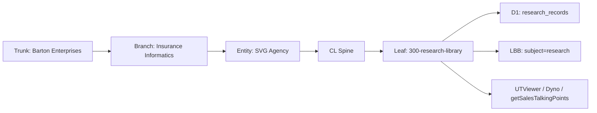

# Research Library — Inbound Research Pipeline
## Inbound research pipeline: scrape, validate, ingest to D1, serve to downstream BE tools.
### Status: REPAIR
### Medium: process
### Business: svg-agency

## UT Checklist (Pre-Flight - per law/UT_CHECKLIST.md v1.2.0)

| # | Check | Status | Location |
|---|-------|--------|----------|
| 1 | PRD — what / why / who / scope / out-of-scope / success metric | [x] | §2 |
| 2 | OSAM — READ / WRITE / Join Chain / Forbidden Paths / Query Routing filled | [x] | §5, §6, §9 |
| 3 | Component Status — every dependency has light with 1-line state | [x] | §3 |
| 4 | Owner — human who fixes this at 2 AM | [x] | §1 |
| 5 | Live Dashboard — URL or explicit "N/A" | [x] | §3 |
| 6 | Kill Switch — exact command to stop the process | [x] | §8 |
| 7 | Logbook — last audit verdict + date (after certification only) | [ ] | §12 — N/A during REPAIR |
| 8 | FCEs Attached — which FCE runs structurally back this doc | [x] | §3c |
| 9 | BARs Referenced — every BAR this doc touches, with status | [x] | §3d |
| 10 | LBB Subjects Fed — which LBB subject(s) this doc's session logs go to | [x] | §3e |
| 11 | Geometry — CTB position + Hub-Spoke role + Altitude | [x] | §1b |
| 12 | Live Verification — every numeric count, cron, URL, command, BAR status grounded | [ ] | §9 — pending live DB verification |
| 13 | ctb_node — declared path on Barton Enterprises CTB trunk | [x] | §1 |

---

# IDENTITY

## 1. IDENTITY

| Field | Value |
|-------|-------|
| ID | PROC-300-RESEARCH-LIB |
| Name | Research Library — Inbound Research Pipeline |
| Medium | process |
| Business Silo | svg-agency (cl-spine — research feed for all BE tools) |
| CTB Position | barton-enterprises/insurance-informatics/svg-agency/cl-spine/research-library |
| ORBT | REPAIR |
| Strikes | 0 |
| Authority | Sovereign (CC-01) — auth pattern locked per K=C |
| Version | 1.0.0 |
| Last Modified | 2026-04-30 |
| BAR Reference | BAR-370 (auth realignment — K=C lock) |
| Owner | Dave Barton |
| ctb_node | barton-enterprises/insurance-informatics/svg-agency/cl-spine/research-library |

### 1b. Geometry

**CTB Position:** Barton Enterprises → Insurance Informatics → SVG Agency → CL Spine → Research Library (leaf)

**Hub-Spoke Role:** hub (this process IS the Middle — all research parse/classify/ingest logic lives here. Spokes are dumb transport: web scraper, PDF pull, transcript pull, Composio provider connectors)

**Altitude:** 30k tactical (one branch — research content pipeline, cross-tool)



### HEIR (8 fields)

| Field | Value |
|-------|-------|
| sovereign_ref | imo-creator-v2 |
| hub_id | PROC-RESEARCH-LIBRARY |
| ctb_placement | leaf |
| imo_topology | middle |
| cc_layer | CC-03 |
| services | CF Worker (research-library), D1 (research-library — 01723ff1-e207-4706-9652-51a10512aab2), LBB integration (best-effort), Composio (Firecrawl/Supadata/Perplexity — pending) |
| secrets_provider | doppler |
| acceptance_criteria | Auth uses canonical MC_API_KEY only. POST /research routes to sources. GET /research/records returns D1 canonical rows. SHA-256 dedup active. GET /health open. Errors write to research_records_error. |

---

# CONTRACT

## 2. PURPOSE

### WHAT
The Research Library is the inbound research pipeline for Barton Enterprises. It accepts queries + source lists, routes to configured providers (Firecrawl web scrape, Supadata transcript/YouTube, Perplexity search), deduplicates by SHA-256 content hash, and stores canonical results in D1 (`research_records`). It makes structured research available for query by all downstream BE tools.

### WHY
BE constantly goes out and finds information — articles, papers, podcasts, transcripts — then needs to bring it back and make it accessible. Without a single canonical pipeline, every tool that needs research data builds its own ad-hoc fetch. This process locks the inbound flow: one place to ingest, one CQRS canonical table, one subject taxonomy, one auth constant. Every downstream tool queries the same store.

### WHO
- Dave / operators (POST /research to kick off a research job)
- UTViewer (BAR-339) — reads research records for display
- Dyno research runs (BAR-279/293-297) — queries records as domain fuel
- getSalesTalkingPoints (BAR-48) — pulls subject-tagged records for sales context
- LBB (Library Barton Brain) — receives ingest summaries as leaf records

### SCOPE (in)
- Inbound research pipeline: query → route → parse → classify → extract constants → write to D1
- CQRS canonical table (`research_records`) + error table (`research_records_error`)
- CTB subject taxonomy (`research_subjects`) — classifies every record on ingest
- SHA-256 content dedup — no duplicate records by content hash
- LBB sync (best-effort) — every ingest event mirrored to LBB subject=research
- Auth doctrine enforcement: MC_API_KEY only, no per-worker key

### OUT-OF-SCOPE
- Rendering / displaying research records (see UTViewer BAR-339)
- Sales talking point assembly (see getSalesTalkingPoints BAR-48)
- Dyno orchestration (see BAR-279/293-297) — Dyno uses this store; it doesn't own it
- Full Composio provider wiring (pending API keys in Doppler)

### SUCCESS METRIC
Every inbound research artifact (web page, PDF, transcript, podcast) that enters via POST /research or POST /research/ingest lands in `research_records` exactly once (dedup enforced), classified by subject, and is immediately queryable by downstream tools via GET /research/records.

---

## 3. RESOURCES

### Component Status Grid

| Component | HEIR | ORBT | Light | State |
|-----------|------|------|-------|-------|
| CF Worker (research-library) | PROC-RESEARCH-LIBRARY · leaf · CC-03 | REPAIR | yellow | Deployed on canonical auth (MC_API_KEY). Composio wiring pending. |
| D1 (research-library) | 01723ff1-e207-4706-9652-51a10512aab2 · leaf · CC-03 | REPAIR | yellow | research_records + research_records_error tables exist. research_subjects seeded. |
| LBB Integration | lbb.svg-outreach.workers.dev · branch · CC-02 | OPERATE | green | Best-effort ingest on POST /research. Subject=research. |
| Composio (Firecrawl) | composio-sovereign · branch · CC-02 | BUILD | red | Pending FIRECRAWL_API_KEY in Doppler. POST /research returns pending_composio. |
| Composio (Supadata) | composio-sovereign · branch · CC-02 | BUILD | red | Pending SUPADATA_API_KEY in Doppler. |
| Composio (Perplexity) | composio-sovereign · branch · CC-02 | BUILD | red | Pending PERPLEXITYAI_API_KEY in Doppler. |

### Live Dashboard

| Resource | URL | What it shows |
|----------|-----|---------------|
| Health check | https://research-library.svg-outreach.workers.dev/health | Worker alive + D1 table check (no auth) |
| Records | https://research-library.svg-outreach.workers.dev/research/records | All canonical research_records (MC_API_KEY required) |
| Subjects | https://research-library.svg-outreach.workers.dev/research/subjects | CTB subject hierarchy (MC_API_KEY required) |
| Errors | https://research-library.svg-outreach.workers.dev/research/errors | CQRS error table (MC_API_KEY required) |

### 3c. FCEs Attached

| FCE Name | HEIR | ORBT | Status |
|----------|------|------|--------|
| K=C (Key = Constant lock) | law/doctrine/KEY.md · trunk · CC-01 | OPERATE | green — auth pattern locked BE-wide |
| US (Universal Structure) | factory/agents/up/us.py · branch · CC-02 | OPERATE | green |

### 3d. BARs Referenced

| BAR | Title | ORBT | Status | Relation |
|-----|-------|------|--------|----------|
| BAR-370 | Research Library auth realignment (K=C) | REPAIR | In Progress | This doc governs the process BAR-370 is repairing |
| BAR-339 | UTViewer | BUILD | In Progress | Downstream consumer of research_records |
| BAR-48 | getSalesTalkingPoints | BUILD | In Progress | Downstream consumer — sales context |
| BAR-279 | Dyno research runs | BUILD | In Progress | Downstream consumer — Dyno domain fuel |

### 3e. LBB Subjects Fed

| LBB Subject | ORBT | What This Doc Writes | Frequency |
|-------------|------|---------------------|-----------|
| research | OPERATE | Every ingest event — title, source_url, content_hash, subject_id | on-ingest |
| system | BUILD | Doctrine changes, auth realignment decisions | on-change |

---

## 4. IMO

### Two-Question Intake
1. **"What triggers this?"** — An authenticated caller POSTs /research with a query + source list, OR POSTs /research/ingest with a raw content URL/document
2. **"How do we get it?"** — MC_API_KEY validated in Authorization/X-API-Key header; content fetched via configured Composio providers (Firecrawl, Supadata, Perplexity)

### Input
An external content source — one of:
- URL (web page, article, blog post) → Firecrawl scrape spoke
- YouTube URL or podcast → Supadata transcript spoke
- Search query → Perplexity search spoke
- Raw document (PDF, markdown) → direct parse

### Middle
Parse → classify → extract constants → dedup → ingest:
1. Route to appropriate spoke (Firecrawl / Supadata / Perplexity) based on source type
2. Extract content (title, body, metadata)
3. Classify against `research_subjects` CTB taxonomy — assign subject_id
4. Compute SHA-256 content hash
5. Check `research_records` for existing hash (dedup gate)
6. Write canonical row to `research_records` (or error to `research_records_error`)
7. Best-effort LBB sync

### Output
- **Emitted:** research_records row (canonical D1), LBB ingest event (best-effort)
- **Retained:** content_hash in `research_records` for future dedup checks

### Circle
Downstream tools (UTViewer, Dyno, getSalesTalkingPoints) query `research_records`. When a query returns no relevant records, the operator triggers a new POST /research. The output feeds back as queryable fuel for the next research job. Loop closes when the research store covers the domain being studied.

---

## 5. CONTRACT — Schema

_Canonical schema for `research_records` and `research_subjects` in D1 (svg-research D1: 01723ff1-e207-4706-9652-51a10512aab2)._

### 5a. research_records (canonical table)

| Field | Type | Required | Notes |
|-------|------|----------|-------|
| record_id | TEXT (UUID PK) | YES | Unique record identifier |
| sovereign_ref | TEXT | YES | HEIR constant — 'imo-creator-v2' |
| hub_id | TEXT | YES | HEIR constant — 'PROC-RESEARCH-LIBRARY' |
| cc_layer | TEXT | YES | HEIR constant — 'CC-03' |
| ctb_placement | TEXT | YES | HEIR constant — 'leaf' |
| subject_id | TEXT (FK) | YES | CTB subject taxonomy join key → research_subjects |
| ctb_node | TEXT | YES | Full CTB path for this record |
| title | TEXT | YES | Document/article/video title |
| content | TEXT | YES | Extracted body content |
| content_hash | TEXT (UNIQUE) | YES | SHA-256 of content — dedup key |
| content_format | TEXT | YES | Enum: text / markdown / transcript / pdf / html |
| source_url | TEXT | CONDITIONAL | Required unless source_type=manual |
| source_type | TEXT | YES | Enum: web / youtube / podcast / pdf / search / manual |
| source_name | TEXT | NO | Human-readable source label |
| fetched_by | TEXT | YES | Which spoke fetched: firecrawl / supadata / perplexity / manual |
| orbt_mode | TEXT | YES | BUILD / OPERATE / REPAIR / TROUBLESHOOT_TRAIN |
| strike_count | INTEGER | YES | Strike counter for ORBT escalation |
| tags | TEXT (JSON) | NO | JSON array of string tags |
| found_at | TEXT | NO | ISO-8601 — when the source content was published |
| created_at | TEXT | YES | ISO-8601 — when this row was ingested |
| updated_at | TEXT | YES | ISO-8601 — last update timestamp |

### 5b. research_records_error (CQRS error table)

| Field | Type | Required | Notes |
|-------|------|----------|-------|
| error_id | TEXT (UUID PK) | YES | Unique error identifier |
| source_url | TEXT | NO | The URL that failed |
| source_type | TEXT | NO | Source type that was attempted |
| error_code | TEXT | YES | Machine-readable error code |
| error_message | TEXT | YES | Human-readable error description |
| raw_input | TEXT | NO | Original input that caused the error |
| created_at | TEXT | YES | ISO-8601 timestamp |

### 5c. research_subjects (CTB taxonomy table)

| Field | Type | Required | Notes |
|-------|------|----------|-------|
| subject_id | TEXT (PK) | YES | Unique slug (e.g., 'benefits-insurance', 'tpa-operations') |
| name | TEXT | YES | Human display name |
| ctb_level | TEXT | YES | trunk / branch / leaf |
| parent_id | TEXT | NO | FK to research_subjects (parent subject) |
| sort_order | INTEGER | NO | Display ordering |

### 5d. content_format enum

| Value | Meaning |
|-------|---------|
| text | Plain text |
| markdown | Markdown-formatted content |
| transcript | Audio/video transcript |
| pdf | PDF document content |
| html | Raw HTML (stripped to text on ingest) |

---

## 6. JOIN CONTRACT

### Primary Join Key

**subject_id** is the join key linking `research_records` to the CTB subject taxonomy and to LBB subjects.

| System | Field | Type | Role |
|--------|-------|------|------|
| research_records | subject_id | TEXT (FK) | Points at research_subjects.subject_id |
| research_subjects | subject_id | TEXT (PK) | The CTB subject taxonomy node |
| LBB records | subject_id | TEXT | Same subject_id namespace — LBB and research share the taxonomy |

**Note:** sovereign_id NOT applicable here. Research is content-keyed, not company-keyed. There is no client/company identity join in this pipeline. Subject_id is the only cross-system join key.

### Join Chain

```
research_subjects (subject_id)
  → research_records (subject_id = research_subjects.subject_id)
    → LBB records (subject_id matches same taxonomy node)
      → UTViewer / Dyno / getSalesTalkingPoints (query by subject_id)
```

### Cross-System Query Pattern

To get all research records for a subject:
```sql
SELECT rr.*
FROM research_records rr
JOIN research_subjects rs ON rs.subject_id = rr.subject_id
WHERE rs.subject_id = 'benefits-insurance'
ORDER BY rr.created_at DESC;
```

To get all subjects with record counts:
```sql
SELECT rs.subject_id, rs.name, COUNT(rr.record_id) as record_count
FROM research_subjects rs
LEFT JOIN research_records rr ON rr.subject_id = rs.subject_id
GROUP BY rs.subject_id, rs.name
ORDER BY record_count DESC;
```

### Forbidden Paths

| Action | Why |
|--------|-----|
| JOIN research_records to client records via sovereign_id | Research is content-keyed. No sovereign_id field exists on research_records. |
| Write to research_records from any spoke directly | Spokes are dumb transport. All writes go through the hub Middle only. |
| Create a research_record without a subject_id | Orphan records break every downstream query and CTB taxonomy join. |
| Skip SHA-256 dedup check | Duplicate content pollutes the research store and inflates downstream query results. |

### Query Routing

| Business Question | Table | Column |
|------------------|-------|--------|
| What research do we have on topic X? | research_records | subject_id |
| Has this URL been ingested before? | research_records | source_url |
| Has this exact content been ingested before? | research_records | content_hash |
| What subjects exist in the taxonomy? | research_subjects | subject_id, name |
| What errors have occurred in ingestion? | research_records_error | error_code, created_at |

---

## 7. INTEGRATION — Downstream Feed Map

| Consumer | BAR | What It Reads | Field Used | Notes |
|---------|-----|---------------|-----------|-------|
| UTViewer | BAR-339 | research_records | subject_id, title, content | Display layer — read-only |
| Dyno research runs | BAR-279/293-297 | research_records | subject_id, content | Domain fuel for US/UP runs |
| getSalesTalkingPoints | BAR-48 | research_records | subject_id, content, tags | Pulls subject-tagged records for sales context |
| LBB | — | Receives ingest events | subject_id=research | Best-effort sync on every ingest |

---

## 8. INGEST CHECKLIST

_Loading a new research artifact. Complete these steps in order._

### Step 1 — Verify source accessibility
- Confirm the source URL is reachable (HTTP 200 or equivalent)
- Identify source_type: web / youtube / podcast / pdf / search / manual
- If source is inaccessible → write to research_records_error, stop

### Step 2 — Route to appropriate spoke
| source_type | Spoke | Composio Provider |
|-------------|-------|------------------|
| web | Firecrawl scrape | FIRECRAWL_SCRAPE |
| youtube | Supadata transcript | SUPADATA_GET_TRANSCRIPT |
| podcast | Supadata transcript | SUPADATA_GET_TRANSCRIPT |
| pdf | Direct parse | internal |
| search | Perplexity search | PERPLEXITYAI_SEARCH |
| manual | Direct ingest | internal |

If spoke is unavailable (pending Composio keys) → return `pending_composio` status, write intent to research_records_error for retry

### Step 3 — Classify content + extract constants
- Assign subject_id from research_subjects taxonomy
- Determine content_format (text / markdown / transcript / pdf / html)
- Extract: title, content body, source_name, found_at (if available)
- Compute SHA-256 content hash

### Step 4 — Dedup check
```sql
SELECT record_id FROM research_records WHERE content_hash = ?
```
- Hash exists → SKIP ingest, return `already_exists` with existing record_id
- Hash not found → proceed to Step 5

### Step 5 — Write to research_records
```sql
INSERT INTO research_records (
  record_id, sovereign_ref, hub_id, cc_layer, ctb_placement,
  subject_id, ctb_node, title, content, content_hash, content_format,
  source_url, source_type, source_name, fetched_by,
  orbt_mode, strike_count, tags, found_at, created_at, updated_at
) VALUES (
  lower(hex(randomblob(16))),
  'imo-creator-v2', 'PROC-RESEARCH-LIBRARY', 'CC-03', 'leaf',
  'SUBJECT_ID', 'barton-enterprises/insurance-informatics/svg-agency/cl-spine/research-library',
  'TITLE', 'CONTENT', 'SHA256_HASH', 'CONTENT_FORMAT',
  'SOURCE_URL', 'SOURCE_TYPE', 'SOURCE_NAME', 'SPOKE_NAME',
  'OPERATE', 0, '[]',
  'FOUND_AT', datetime('now'), datetime('now')
)
```

### Kill Switch
To disable the research library worker (stop all ingest):
```bash
# Via wrangler — disable the worker
npx wrangler workers disable research-library --env production

# Or suspend via CF dashboard: Workers & Pages → research-library → Disable
```
To stop a specific ingest in progress: POST /research has no long-running jobs in current implementation (synchronous). Kill switch = disable worker.

### Stop Conditions

| Condition | Action |
|-----------|--------|
| Source URL inaccessible | Write to research_records_error, stop |
| Composio provider not wired | Return pending_composio, write intent to error table |
| content_hash already in research_records | Return already_exists, skip write |
| subject_id not in research_subjects taxonomy | Write to research_records_error — unclassified content cannot be ingested |
| MC_API_KEY missing or invalid | Return 401, do not process |

---

# GOVERNANCE

## 9. PERMISSIONS

| Route | Read | Write | Auth |
|-------|------|-------|------|
| GET /health | Any | — | None (open) |
| POST /research | — | research_records (via Middle) | MC_API_KEY |
| GET /research/records | Internal tools, operators | — | MC_API_KEY |
| GET /research/records/:id | Internal tools, operators | — | MC_API_KEY |
| GET /research/subjects | Internal tools, operators | — | MC_API_KEY |
| POST /research/subjects | Operators | research_subjects | MC_API_KEY |
| POST /research/ingest | — | research_records (manual leaf) | MC_API_KEY |
| GET /research/errors | Operators | — | MC_API_KEY |

### Write Rules
1. All writes to `research_records` go through the hub Middle only. Spokes are dumb transport — they have no direct D1 write access.
2. `research_records_error` is append-only. Errors are never deleted — ORBT to REPAIR instead.
3. `research_subjects` may be extended (new leaf subjects) by operators. Trunk/branch subjects require Dave approval.
4. Auth pattern is BE-wide constant: MC_API_KEY only. No per-worker keys. This is locked per K=C doctrine (BAR-370).

### Live Verification Log

| Claim | Section | Source of Truth | Verification Command | Verified? | Last Check | Value at Check |
|-------|---------|-----------------|----------------------|-----------|-----------|----------------|
| Worker deployed on MC_API_KEY auth | §3 | CF Worker | `curl https://research-library.svg-outreach.workers.dev/health` | [ ] | — | — |
| research_records table exists in D1 | §5 | D1 01723ff1 | `npx wrangler d1 execute research-library --remote --command "SELECT name FROM sqlite_master WHERE name='research_records'"` | [ ] | — | — |
| research_records_error table exists | §5 | D1 01723ff1 | `npx wrangler d1 execute research-library --remote --command "SELECT name FROM sqlite_master WHERE name='research_records_error'"` | [ ] | — | — |
| research_subjects table seeded | §5 | D1 01723ff1 | `npx wrangler d1 execute research-library --remote --command "SELECT COUNT(*) FROM research_subjects"` | [ ] | — | — |
| RESEARCH_API_KEY removed from Doppler | §9 | Doppler | Check imo-creator → dev secrets list | [ ] | — | — |

### Verification Queries

```
1. GET /health → expected: 200, {status: "ok", tables: {research_records: true, research_records_error: true}}

2. POST /research/ingest with MC_API_KEY + valid body
   → expected: 201, {record_id: "...", status: "ingested"}

3. POST /research/ingest with same content (dedup test)
   → expected: 200, {status: "already_exists", record_id: "..."}

4. GET /research/records with MC_API_KEY
   → expected: 200, [{record_id, title, subject_id, ...}]

5. GET /research/records without auth
   → expected: 401 Unauthorized

6. POST /research without auth
   → expected: 401 Unauthorized
```

**Three Primitives Check:**
1. **Thing:** Does the research-library CF Worker exist and respond? Does D1 exist with the correct tables?
2. **Flow:** Does content flow from external source → spoke → Middle → D1 → downstream tools?
3. **Change:** Does the SHA-256 dedup gate correctly prevent duplicate records? Does subject_id classification correctly tag every record?

---

## 10. ANALYTICS

### 10a. Metrics

| Metric | Unit | Baseline | Target | Tolerance |
|--------|------|----------|--------|-----------|
| Total research_records | count | BASELINE | growing | 0 orphaned (no subject_id) |
| Records by subject | count per subject | BASELINE | measured | balanced across subjects |
| Recent ingest count (7d) | count | BASELINE | active | > 0 if in active research phase |
| Error rate | errors / total attempts | BASELINE | < 5% | > 10% triggers REPAIR |
| Dedup hit rate | duplicates / total attempts | BASELINE | measured | > 50% may indicate redundant sources |

### 10b. Sigma Tracking

| Metric | v1.0.0 | Trend | Action |
|--------|--------|-------|--------|
| Auth constants locked | MC_API_KEY only | STABLE | Lock when live verified |
| Tables defined | 3 (records, error, subjects) | STABLE | Add only if new domain requires new classification |
| Composio providers wired | 0 / 3 | BUILDING | Wire as API keys arrive in Doppler |

### 10c. ORBT Gate Rules

| From | To | Gate |
|------|-----|------|
| REPAIR | OPERATE | MC_API_KEY auth live-verified, all 3 D1 tables confirmed, GET /health green, at least one successful POST /research/ingest, auditor sign-off |
| OPERATE | REPAIR | Any auth drift (per-worker key re-introduced), D1 write failure, dedup gate broken |

---

## 11. EXECUTION TRACE

_Append-only. Mechanic logs actions here._

| trace_id | step | target | actual | status | timestamp | signed_by |
|----------|------|--------|--------|--------|-----------|-----------|
| TRACE-300-001 | BAR-370 auth realignment | Replace RESEARCH_API_KEY with MC_API_KEY; redeploy worker on canonical auth | DOCTRINE.md + heir.yaml + orbt.yaml + PROCESS-UT.md created in factory/cl/300-research-library/ | done | 2026-04-30 | claude-sonnet-4-6 |

---

## 12. LOGBOOK (After Certification Only)

_No logbook during REPAIR. Created when auditor certifies._

---

## 13. FLEET FAILURE REGISTRY

| Pattern ID | Location | Error Code | First Seen | Occurrences | Strike Count | Status |
|-----------|----------|-----------|-----------|-------------|-------------|--------|
| FFR-300-001 | POST /research, POST /research/ingest | AUTH_DRIFT — RESEARCH_API_KEY used instead of MC_API_KEY | 2026-04-30 | 1 | 0 | REPAIR in progress (BAR-370) |

**Strike 1:** Repair. **Strike 2:** Scrutiny. **Strike 3:** Troubleshoot/Train → Airworthiness Directive.

---

## 14. MAINTENANCE LOGBOOK (doc's own logbook — FAA-grade)

_Every touch on this doc is a maintenance action. Every action leaves a signed, timestamped row with evidence. Append-only._

### Action Types

| Type | Meaning |
|------|---------|
| RETROFIT | UT structure / template upgrade applied |
| VERIFY | Claim grounded against live system (§9 Live Verification Log row ticked) |
| AUDIT | FAA Inspector (auditor) pass — PASS / FAIL recorded |
| EDIT | Content change (new step added, schema changed, etc.) |
| CERTIFY | Moved ORBT state (e.g., REPAIR → OPERATE) |
| REPAIR | Post-strike fix |
| STRIKE | Fleet failure recorded (§13) |
| LBB_INGEST | Session summary written to LBB |
| MIGRATE | Content migrated from prior doc to new structure |

### Logbook (append-only — never edit past rows)

| Date (ISO) | Actor | Action | What Was Done | Evidence | LBB Record |
|-----------|-------|--------|---------------|----------|------------|
| 2026-04-30 | claude-sonnet-4-6 | EDIT | Initial PROCESS-UT.md creation (v1.0.0) — 14 sections, 3 clusters, BAR-370 auth realignment context. Domain: inbound research pipeline. | TRACE-300-001 | pending |

**Rules:**
- Append-only. Do NOT edit or delete prior rows. Corrections go in as a new row referencing the prior row.
- Every entry signed — Actor column is mandatory.
- Every entry with Evidence — "no evidence" rows are rejected by auditor.
- Every CERTIFY entry requires a DIFFERENT actor than the one who did the preceding RETROFIT/EDIT (Aviation Model — mechanic ≠ inspector).
- Missing entries = doc drift. Cold reader can't trust the doc's state.

---

## Document Control

| Field | Value |
|-------|-------|
| Created | 2026-04-30 |
| Last Modified | 2026-04-30 |
| Version | 1.0.0 |
| Template Version | 2.7.0 |
| Medium | process |
| US Validated | pending |
| Governing Engine | law/doctrine/FOUNDATIONAL_BEDROCK.md + law/doctrine/DMJ.md |
| Supersedes | None — new doc |
