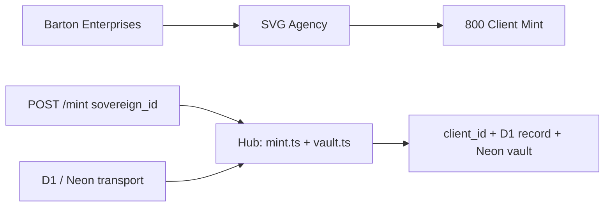
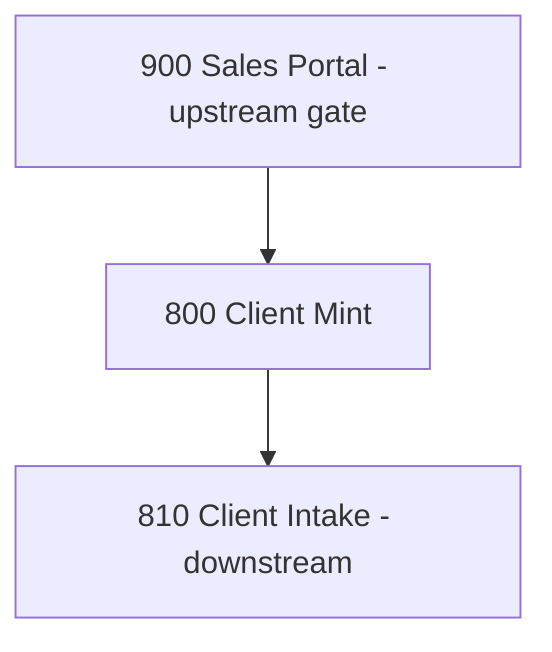

# Client Mint
## Converts a CL sovereign company into a formal client record — the birth certificate for every client relationship in SVG Agency.
### Status: BUILD
### Medium: process
### Business: svg-agency

## UT Checklist (Pre-Flight - per law/UT_CHECKLIST.md v1.2.0)

| # | Check | Status | Location |
|---|-------|--------|----------|
| 1 | PRD - what / why / who / scope / out-of-scope / success metric | [x] | §2 |
| 2 | OSAM - READ / WRITE / Process Composition / Join Chain / Forbidden Paths / Query Routing filled | [x] | §5 |
| 3 | Component Status - every dep has green / yellow / red with 1-line state | [x] | §3 |
| 4 | Owner - human who fixes this at 2 AM | [x] | §1 |
| 5 | Live Dashboard - URL or explicit "N/A" | [x] | §3 |
| 6 | Kill Switch - exact command to stop the process | [x] | §8 |
| 7 | Logbook - last audit verdict + date (after certification only) | [ ] | §12 |
| 8 | FCEs Attached - which FCE runs structurally back this doc | [ ] | §3c |
| 9 | BARs Referenced - every BAR this doc touches, with status | [x] | §3d |
| 10 | LBB Subjects Fed - which LBB subject(s) this doc's session logs go to | [x] | §3e |
| 11 | Geometry - CTB position + Hub-Spoke role + Altitude | [x] | §1b |
| 12 | Live Verification - every numeric count, cron, URL, command, BAR status grounded against the live system | [ ] | §9b |
| 13 | ctb_node - declared path on the Barton Enterprises CTB trunk | [x] | §1 Identity |

## 1. IDENTITY {#sec-1-identity}

| Field | Value |
|-------|-------|
| ID | PROC-800 |
| Name | Client Mint |
| Medium | process |
| Business Silo | svg-agency |
| CTB Position | barton-enterprises/svg-agency/factory/cl/800-client-mint |
| ORBT | BUILD |
| Strikes | 0 |
| Authority | inherited - imo-creator-v2 sovereign + Barton-Processes parent |
| Last Modified | 2026-04-29 |
| BAR Reference | BAR-38, BAR-87, BAR-178 |
| Owner | Dave Barton |
| ctb_node | barton-enterprises/svg-agency/factory/cl/800-client-mint |

### 1b. Geometry {#sec-1b-geometry}

**CTB Position:** barton-enterprises → svg-agency → factory/cl → 800-client-mint (leaf)

**Hub-Spoke Role:** Hub — this process owns all mint logic; D1 and Neon are spokes (dumb transport); POST /mint and POST /vault are rim entry points.

**Altitude:** 5k execution — single mint transaction per invocation; no strategy layer.



### HEIR (8 fields - Aviation Model, Bedrock §8)

| Field | Value |
|-------|-------|
| sovereign_ref | imo-creator-v2 |
| hub_id | client-mint-800 |
| ctb_placement | leaf |
| imo_topology | middle |
| cc_layer | CC-04 |
| services | CF Worker (manual trigger), Neon via Hyperdrive, D1 (working tables) |
| secrets_provider | doppler |
| acceptance_criteria | Receives CL sovereign ID → mints client_id in D1; populates clnt.client from CL sovereign data; links client_id back to CL sovereign ID; promotes certified client to Neon vault; errors write to D1 client_error; duplicate sovereign ID detection halts with error |

## 2. PURPOSE {#sec-2-purpose}

### WHAT
Client Mint receives a CL sovereign_id (company lifecycle identifier) via HTTP POST, reads the company's identity from the Neon CL vault, generates a unique client_id, writes the client record to D1 working tables, and optionally promotes certified clients to the Neon clnt.* canonical vault. It is the single gate that converts an outreach prospect into a billable client entity.

### WHY
Without Client Mint there is no client_id. Every downstream process — 810 Client Intake, the client portal (830), vendor exports (820), billing — requires a minted client_id. The process is the first domino: no mint, no client, no revenue.

### WHO
Operated by Dave Barton or a delegated SVG Agency operator. Documentation consumed by process owners, auditors, and anyone debugging client-creation failures.

### SCOPE (in)
- Receiving a CL sovereign_id and validating it is well-formed
- Duplicate detection against D1 client table
- Reading company identity from Neon cl.company_identity
- Generating and persisting client_id to D1 client table
- Vault promotion of certified clients to Neon clnt.client via POST /vault
- Error logging to D1 client_error and Neon clnt.client_error

### OUT-OF-SCOPE
- Client intake workflow — owned by 810 Client Intake
- Client portal rendering — owned by 830 Client Portal
- Vendor export formatting — owned by 820 Vendor Export
- Authentication layer — not yet implemented; tracked in PROCESS.md Known Issues
- Automatic/cron-based minting — manual trigger only per D-800-07

### SUCCESS METRIC
100% of minted client_ids are linked to a valid CL sovereign_id with zero orphaned records in D1 client table.

## 3. RESOURCES {#sec-3-resources}

Required doctrine references for every process UT:

- `law/UNIFIED_TEMPLATE.md`
- `law/UT_CHECKLIST.md`
- `law/doctrine/PROCESS_FILL_INSTRUCTIONS.md`
- `law/doctrine/HOW_TO_BUILD_ANYTHING.md` (repair manual)
- `law/doctrine/BARTON_ENTERPRISES_WORLD_ATLAS.md` (Atlas System bundle)
- `law/doctrine/KEY.md`

### Component Status Grid

| Component | HEIR (`hub_id · ctb · cc_layer`) | ORBT | Light | State |
|-----------|----------------------------------|------|-------|-------|
| CF Worker: client-mint-800 | client-mint-800 · leaf · CC-04 | BUILD | red | Not deployed; database_id empty in wrangler.toml |
| D1: client-mint-800 | client-mint-800 · leaf · CC-04 | BUILD | red | Database not yet created; migrations not run |
| Neon cl.company_identity (read) | vault · leaf · CC-04 | OPERATE | green | CL sovereign data confirmed available |
| Neon clnt.client (write/vault) | vault · leaf · CC-04 | BUILD | yellow | Schema migration (002_neon_clnt_client.sql) not yet run |
| Doppler: NEON_URL | TBV | OPERATE | green | Secret confirmed available per PROCESS.md |

### Live Dashboard

| Resource | URL | What it shows |
|----------|-----|---------------|
| Worker health | https://client-mint-800.svg-outreach.workers.dev/health | Worker alive + process identity |
| Worker status | https://client-mint-800.svg-outreach.workers.dev/status | Client counts: total, vaulted, unvaulted, open errors |

### Dependencies

| Dependency | Type | What It Provides | Status |
|-----------|------|-----------------|--------|
| CL company lifecycle (Neon vault) | database | cl.company_identity with sovereign_id records | DONE |
| Neon vault access (NEON_URL) | secret | Connection string for Neon read/write | DONE |
| D1 database: client-mint-800 | database | Working tables for client + client_error | PENDING — database_id not set |
| Auth on endpoints | middleware | Authentication for POST /mint, POST /vault | PENDING — not implemented |

### Downstream Consumers

| Consumer | What It Needs |
|----------|--------------|
| 810 Client Intake | client_id must exist in D1 client table before intake can begin |
| 830 Client Portal | client_id for routing and display |
| 820 Vendor Export | client_id as spine key for export artifacts |

### Tools & Integrations

| Item | Type | Cost Tier | Credentials | What It Does |
|------|------|-----------|-------------|-------------|
| Cloudflare D1 (client-mint-800) | database | Free | D1 binding | Working data — client table + client_error table |
| Cloudflare Workers | compute | Free | wrangler deploy | REST endpoint runtime |
| Neon PostgreSQL | database | Cheap | NEON_URL (Doppler) | Vault reads (cl.company_identity) and vault writes (clnt.*) |

### Secrets

| Secret | Doppler Project | Config | Used By |
|--------|----------------|--------|---------|
| NEON_URL | svg-outreach | production | mint.ts (read cl.company_identity), vault.ts (write clnt.*) |

### 3c. FCEs Attached

| FCE Name | HEIR (`hub_id · ctb · cc_layer`) | ORBT | Run Directory | Latest P=1 | Rows | Status |
|----------|----------------------------------|------|--------------|------------|------|--------|
| TBV | TBV | TBV | TBV | TBV | TBV | TBV — no FCE attached yet |

### 3d. BARs Referenced

| BAR | Title | HEIR (`bar-id · ctb · cc_layer`) | ORBT | Status | Relation |
|-----|-------|----------------------------------|------|--------|----------|
| BAR-38 | TBV | TBV | TBV | TBV | implements |
| BAR-87 | TBV | TBV | TBV | TBV | implements |
| BAR-178 | TBV | TBV | TBV | TBV | implements |

### 3e. LBB Subjects Fed

| LBB Subject | HEIR (`subject-id · ctb · cc_layer`) | ORBT | What This Doc Writes | Frequency |
|-------------|--------------------------------------|------|---------------------|-----------|
| svg-client-proc | svg-client-proc · leaf · CC-04 | BUILD | session summaries, mint events, error logs | per-run |

## 4. IMO - Input, Middle, Output {#sec-4-imo}

### Two-Question Intake (Bedrock §3)
1. What triggers this? — Human provides a CL sovereign_id via HTTP POST /mint
2. How do we get it? — Company identity read from Neon vault cl.company_identity using sovereign_id as join key

### Input
Manual HTTP POST to `/mint` with `{ "sovereign_id": "<uuid>" }`. Sovereign_id is provided by the operator and must exist in Neon cl.company_identity. No cron. No automated trigger. D-800-07.

### Middle

| Step | Input | What Happens | Output | Tool Used |
|------|-------|-------------|--------|-----------|
| 1 | POST /mint body | Validate sovereign_id is present and well-formed | Validated sovereign_id or 400 error | CF Worker (index.ts) |
| 2 | sovereign_id | Check D1 client table for duplicate sovereign_id | Pass or DUPLICATE_SOVEREIGN error (D-800-02) | D1 query (mint.ts) |
| 3 | sovereign_id | Read company identity from Neon cl.company_identity | SovereignRecord or SOVEREIGN_NOT_FOUND error (D-800-10) | Neon via NEON_URL (mint.ts) |
| 4 | SovereignRecord | Mint new client_id (crypto.randomUUID()), INSERT into D1 client table | client_id + client row in D1 (D-800-03) | D1 insert (mint.ts) |
| 5 | D1 client rows where vaulted_at IS NULL | POST /vault: push unvaulted clients to Neon clnt.client, mark vaulted_at | Vaulted count + errors (D-800-05) | Neon write + D1 update (vault.ts) |

### Output
- Minted client record in D1 client table (client_id linked to sovereign_id) — D-800-01
- On vault: certified client written to Neon clnt.client (canonical) — D-800-08
- Errors written to D1 client_error (and Neon clnt.client_error on promotion) — D-800-06
- Downstream: 810 Client Intake reads client_id to begin intake workflow — D-800-09

### Circle (Bedrock §5)
Minted client_id feeds 810 Client Intake. Errors surface via GET /status. Vault promotion closes the loop by persisting D1 working records into Neon canonical layer. GET /client/:id provides read-back verification. Errors in client_error table feed back into operations dashboard for resolution.

## 5. DATA SCHEMA {#sec-5-data-schema}

### READ Access

| Source | What It Provides | Join Key |
|--------|-----------------|----------|
| cl.company_identity (Neon) | canonical_name, EIN, state, domain, source — company identity from CL outreach pipeline | company_unique_id = sovereign_id |
| D1: client | Previously minted client records for duplicate check | sovereign_id |

### WRITE Access

| Target | What It Writes | When |
|--------|---------------|------|
| D1: client | New minted client record (client_id, sovereign_id, legal_name, fein, domicile_state, status, version, domain, etc.) | Step 4 — mint |
| D1: client_error | Error records (code, message, client_id, timestamp) | On any failure (D-800-06) |
| clnt.client (Neon) | Certified client identity record | POST /vault promotion (D-800-05) |
| clnt.client_error (Neon) | Promoted error records | POST /vault promotion |

### Process Composition



| Process ID | Name | Role in Composition | Status |
|-----------|------|---------------------|--------|
| PROC-900 | Sales Portal | upstream feeder — sales close triggers manual mint | TBV |
| PROC-800 | Client Mint | this — mints client_id from sovereign_id | BUILD |
| PROC-810 | Client Intake | downstream consumer — reads client_id to begin intake | BUILD |

### Join Chain

```text
cl.company_identity.company_unique_id (sovereign_id)
  -> D1: client (sovereign_id, 1:1 after mint)
    -> clnt.client (sovereign_id, 1:1 after vault promotion)
      -> 810 Client Intake (client_id, downstream spine)
```

### Forbidden Paths

| Action | Why |
|--------|-----|
| Write to cl.* Neon tables | CL schema is READ ONLY — this process is downstream; writing upstream violates the pipeline boundary (D-800-04) |
| Mint without duplicate check | Creates orphaned client_ids — violates data integrity (D-800-02) |
| Auto-promotion without explicit POST /vault | Vault writes must be deliberate — CQRS write path (D-800-05) |
| Skip error table on failure | No log means the fix cannot be traced — Aviation Model (D-800-06) |
| Mint without reading cl.company_identity | Cannot mint from thin air — source record must be confirmed (D-800-10) |

### Query Routing

| Question | Table | Column |
|----------|-------|--------|
| Does this company already have a client_id? | D1: client | sovereign_id |
| What company data feeds the mint? | cl.company_identity (Neon) | company_unique_id |
| What errors occurred during minting? | D1: client_error | error_code |
| Is this client promoted to vault? | D1: client | vaulted_at |
| How many clients are unvaulted? | D1: client | vaulted_at IS NULL |

## 6. DMJ - Define, Map, Join {#sec-6-dmj}

### 6a. DEFINE (Build the Key)

| Element | ID | Format | Description | C or V |
|---------|-----|--------|-------------|--------|
| sovereign_id | sovereign_id | TEXT / UUID | CL company lifecycle identifier — the universal link; never changes per company | C |
| client_id | client_id | TEXT / UUID (crypto.randomUUID()) | Minted client identity — one per sovereign_id, never reused | C |
| legal_name | legal_name | TEXT | Canonical company name from cl.company_identity | V |
| fein | fein | TEXT | Federal employer identification number (nullable) | V |
| domicile_state | domicile_state | TEXT | State of domicile (nullable) | V |
| status | status | TEXT (enum: active) | Client lifecycle status — defaults to 'active' at mint | C |
| vaulted_at | vaulted_at | TEXT (datetime) | Timestamp of Neon vault promotion; NULL until promoted | V |
| error_code | error_code | TEXT (enum) | DUPLICATE_SOVEREIGN, SOVEREIGN_NOT_FOUND, VAULT_FAILED | C |

### 6b. MAP (Connect Key to Structure)

| Source | Target | Transform |
|--------|--------|-----------|
| POST body: sovereign_id | cl.company_identity.company_unique_id | direct lookup |
| cl.company_identity.canonical_name | D1 client.legal_name | direct |
| cl.company_identity.ein | D1 client.fein | direct |
| cl.company_identity.state | D1 client.domicile_state | direct |
| cl.company_identity.domain | D1 client.domain | direct |
| cl.company_identity.source | D1 client.source | direct |
| crypto.randomUUID() | D1 client.client_id | generate |
| D1 client (all fields) | clnt.client | promote (vault) |

### 6c. JOIN (Path to Spine)

| Join Path | Type | Description |
|-----------|------|-------------|
| sovereign_id -> cl.company_identity | direct | Spine entry — confirms company exists in CL vault |
| sovereign_id -> D1 client | direct | Duplicate check — ensures 1:1 sovereign:client |
| D1 client.client_id -> clnt.client.client_id | direct | Vault promotion — D1 working to Neon canonical |
| D1 client.client_id -> 810 intake spine | direct | Downstream — client_id is the join key for all intake operations |

## 7. CONSTANTS & VARIABLES {#sec-7-constants-variables}

### Constants (structure - never changes)
- sovereign_id is the universal link between CL pipeline and minted client — D-800-01
- client_id is generated at mint time (crypto.randomUUID()), one per sovereign_id, never reused — D-800-03
- D1 is the working layer; Neon clnt.* is the canonical vault — D-800-08
- CQRS: D1 client (canonical working) + D1 client_error (error drain) — one canonical + one error per workspace
- Vault promotion is explicit-only via POST /vault — D-800-05
- Error codes are a fixed enum: DUPLICATE_SOVEREIGN, SOVEREIGN_NOT_FOUND, VAULT_FAILED
- Endpoints are fixed: GET /health, GET /status, POST /mint, POST /vault, GET /client/:id
- Manual trigger only — no cron — D-800-07
- cl.* Neon tables are READ ONLY for this process — D-800-04
- Downstream trigger: mint creates the client_id that enables 810 Client Intake — D-800-09

### Variables (fill - changes every run/cycle)
- Which sovereign_id is being minted (provided by operator)
- What company data comes back from cl.company_identity (legal_name, fein, domicile_state, domain, source)
- Whether the sovereign_id already exists (duplicate check result)
- The generated client_id value (new UUID per run)
- Error messages and timestamps
- Number of unvaulted clients at promotion time

## 8. STOP CONDITIONS {#sec-8-stop-conditions}

| Condition | Action |
|-----------|--------|
| sovereign_id missing or malformed in POST body | HALT — return 400, do not query anything (D-800-07) |
| DUPLICATE_SOVEREIGN — sovereign_id already minted | HALT — return error with existing client_id (D-800-02) |
| SOVEREIGN_NOT_FOUND — cl.company_identity has no record | HALT — return error, cannot mint without source data (D-800-10) |
| VAULT_FAILED — Neon write fails during promotion | HALT — client stays in D1, log error, do not retry automatically (D-800-06) |
| Neon connection failure on read | HALT — cannot verify source, do not mint blind (D-800-10) |
| D1 write failure | HALT — log to error table if possible, return 500 (D-800-06) |
| cl.* write attempted | HALT — forbidden path violation (D-800-04) |
| Same failure repeats 3x (Strike 3) | Troubleshoot/Train → Airworthiness Directive |

### Kill Switch

```text
wrangler delete --name client-mint-800
# or to disable route only:
npx wrangler worker route delete <route_id>
```

## 9. VERIFICATION {#sec-9-verification}

```text
1. GET /health → expected: { "status": "ok", "process": "PROC-CLIENT-MINT", "number": 800 }
2. POST /mint { "sovereign_id": "<valid-cl-uuid>" } → expected: 201 with minted client_id
3. POST /mint { "sovereign_id": "<same-uuid>" } (repeat) → expected: 409 DUPLICATE_SOVEREIGN error
4. POST /mint { "sovereign_id": "nonexistent-id" } → expected: error SOVEREIGN_NOT_FOUND
5. GET /client/:id (using client_id from step 2) → expected: full client record JSON
6. GET /status → expected: { clients: { total: N, vaulted: N, unvaulted: N }, open_errors: N }
7. POST /vault → expected: { vaulted: N, errors: 0, durationMs: N }
8. Query D1: SELECT COUNT(*) FROM client WHERE vaulted_at IS NOT NULL → expected: matches vaulted count from step 7
```

### Three Primitives Check (Bedrock §1)
1. Thing — D1 database exists and migrations have run? CF Worker deployed? Neon cl.company_identity accessible?
2. Flow — sovereign_id reaches Neon query? Company data reaches D1 insert? vault.ts reads unvaulted rows?
3. Change — Company identity correctly transformed into client record? client_id generated and linked to sovereign_id?

## 9b. Live Verification Log {#sec-9b-live-verification}

| Claim | Section | Source of Truth | Verification Command | [ ] | Last Check | Value |
|-------|---------|-----------------|----------------------|-----|-----------|-------|
| Worker health endpoint responds | §3 | GET /health | `curl https://client-mint-800.svg-outreach.workers.dev/health` | [ ] | TBV | TBV — worker not deployed |
| Total minted client count | §3 | GET /status | `curl https://client-mint-800.svg-outreach.workers.dev/status` | [ ] | TBV | TBV — D1 not created |
| D1 client row count | §5 | D1 query | `wrangler d1 execute client-mint-800 --command "SELECT COUNT(*) FROM client"` | [ ] | TBV | TBV — D1 not created |
| Neon vault sync count | §5 | Neon clnt.client | `psql $NEON_URL -c "SELECT COUNT(*) FROM clnt.client"` | [ ] | TBV | TBV — migration not run |
| Migration 001 applied | §5 | D1 schema | `wrangler d1 execute client-mint-800 --command "SELECT name FROM sqlite_master WHERE type='table'"` | [ ] | TBV | TBV |
| Migration 002 applied | §5 | Neon schema | `psql $NEON_URL -c "SELECT COUNT(*) FROM information_schema.tables WHERE table_schema='clnt'"` | [ ] | TBV | TBV |
| Open error count | §3 | GET /status | `curl https://client-mint-800.svg-outreach.workers.dev/status \| jq .open_errors` | [ ] | TBV | TBV |

## 10. ANALYTICS {#sec-10-analytics}

### 10a. Metrics

| Metric | Unit | Baseline | Target | Tolerance |
|--------|------|----------|--------|-----------|
| Clients minted | count | BASELINE | TBV | TBV |
| Duplicate rejections | count | BASELINE | 0 | < 5% of mint attempts |
| Vault promotions | count | BASELINE | = minted count | 100% within 24h |
| Open errors | count | BASELINE | 0 | < 3 before halt |
| Mint latency | ms | BASELINE | < 500ms | < 1000ms |

### 10b. Sigma Tracking

| Metric | Run 1 | Run 2 | Run 3 | Trend | Action |
|--------|-------|-------|-------|-------|--------|
| Clients minted | — | — | — | TBV | No runs yet — BUILD |
| Error rate | — | — | — | TBV | No runs yet — BUILD |

### 10c. ORBT Gate Rules

| From | To | Gate |
|------|-----|------|
| BUILD | OPERATE | all metrics within tolerance for 3 runs + auditor sign-off |
| OPERATE | REPAIR | any metric outside tolerance |
| REPAIR | OPERATE | fix + metric back + auditor verification |
| Any (Strike 3) | TROUBLESHOOT_TRAIN | fleet-wide fix -> AD |

## 11. EXECUTION TRACE {#sec-11-execution-trace}

| Field | Format | Required |
|-------|--------|----------|
| trace_id | UUID | Yes |
| run_id | UUID | Yes |
| step | action name | Yes |
| target | measurable | Yes |
| actual | measurable | Yes |
| delta | the gap | Yes |
| status | done / failed / skipped | Yes |
| error_code | text or null | If failed |
| error_message | text or null | If failed |
| tools_used | JSON array | Yes |
| duration_ms | integer | Yes |
| cost_cents | integer | Yes |
| timestamp | ISO-8601 | Yes |
| signed_by | agent or manual | Yes |

### Build Inputs Used

| Source | File | What Was Used |
|--------|------|--------------|
| CLAUDE.md | _archived-fragments/CLAUDE.md | Process identity, API endpoints, databases, dependencies, known issues |
| PROCESS.md | _archived-fragments/PROCESS.md | IMO flow, OSAM, constants/variables, stop conditions, smoke tests, analytics |
| heir.yaml | heir.yaml | HEIR 8-field identity, acceptance criteria, feeds/depends_on |
| wrangler.toml | wrangler.toml | Worker name, D1 binding, secrets config |
| src/mint.ts | src/mint.ts | Mint logic, error codes, Neon schema join keys |
| src/vault.ts | src/vault.ts | Vault promotion logic, CQRS write path |
| src/migrations/001_d1_client_tables.sql | src/migrations/001_d1_client_tables.sql | D1 schema columns, indexes |
| src/migrations/002_neon_clnt_client.sql | src/migrations/002_neon_clnt_client.sql | Neon clnt schema, vault table columns, trigger |

### Back-Propagation Check

| Parent Constant | Conflict Check | Result |
|-----------------|----------------|--------|
| sovereign_id as universal spine key | Confirmed in cl.company_identity JOIN and downstream 810 | clean |
| D1 = working, Neon = vault | Confirmed in vault.ts write path and migration 002 | clean |
| Manual trigger only | Confirmed in wrangler.toml (no crons), index.ts (no scheduled handler) | clean |

## 12. LOGBOOK (After Certification Only) {#sec-12-logbook}

No logbook during BUILD.

### Birth Certificate

| Field | Value |
|-------|-------|
| heir_ref | TBV — pending certification |
| orbt_entered | BUILD |
| orbt_exited | TBV |
| action | TBV — pending auditor sign-off |
| gates_passed | TBV |
| signed_by | TBV |
| signed_at | TBV |

### Logbook (append-only)

| Date | Actor | Action | What Was Done | Evidence | LBB Record |
|------|-------|--------|---------------|----------|------------|
| 2026-03-29 | Dave Barton | BUILD | PROCESS.md created from template v2.0.0; D1 not created; no auth; worker not deployed | PROCESS.md §13 | none |
| 2026-04-29 | Claude Sonnet | BUILD | UT consolidation — PROCESS-UT.md, DOCTRINE.md, orbt.yaml written; fragments archived | This file | pending |

## 13. FLEET FAILURE REGISTRY {#sec-13-fleet-failure-registry}

| Pattern ID | Location | Error Code | First Seen | Occurrences | Strike Count | Status |
|-----------|----------|-----------|-----------|-------------|-------------|--------|
| FP-800-01 | wrangler.toml | database_id empty | 2026-03-29 | 1 | 0 | OPEN — run wrangler d1 create client-mint-800 |
| FP-800-02 | src/index.ts | No auth on endpoints | 2026-03-29 | 1 | 0 | OPEN — implement auth middleware before OPERATE |

## 14. SESSION LOG {#sec-14-session-log}

| Date | What Was Done | LBB Record |
|------|---------------|-----------|
| 2026-03-29 | PROCESS.md created from PROCESS_TEMPLATE v2.0.0; initial BUILD state documented | none |
| 2026-04-29 | UT v2.7.0 consolidation — PROCESS-UT.md, DOCTRINE.md, orbt.yaml written; CLAUDE.md + PROCESS.md archived | pending |

## Document Control

| Field | Value |
|-------|-------|
| Created | 2026-03-29 |
| Last Modified | 2026-04-29 |
| Version | 2.0.0 |
| Template Version | 2.7.0 |
| Medium | process |
| US Validated | pending |
| Governing Engine | law/doctrine/FOUNDATIONAL_BEDROCK.md + law/doctrine/DMJ.md |
