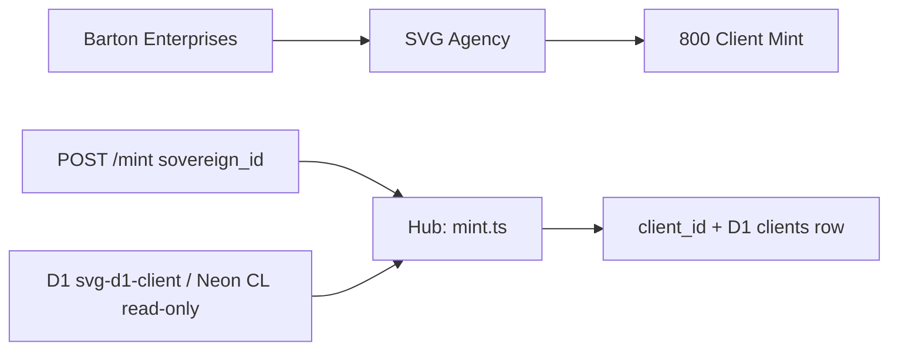
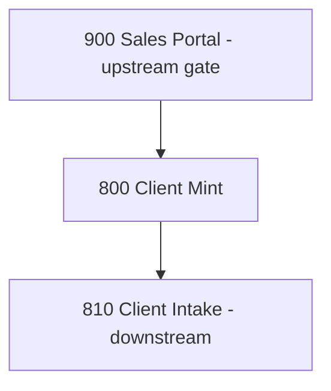

---
outside:
  heir:
    sovereign_ref: imo-creator-v2
    hub_id: client-mint-800
    ctb_placement: Leaf
    ctb_node: barton-enterprises/svg-agency/factory/cl/800-client-mint
    imo_topology: middle
    cc_layer: CC-04
    services:
      - cloudflare-worker
      - neon-via-hyperdrive
      - d1-client-mint-800
      - doppler
    secrets_provider: doppler
    acceptance_criteria: "Receives CL sovereign_id via POST /mint → mints client_id in D1 svg-d1-client.clients table linked to sovereign_id; duplicate sovereign_id detection halts with DUPLICATE_SOVEREIGN error; SOVEREIGN_NOT_FOUND halts when cl.company_identity has no matching record; errors written to D1 clients_error; GET /status returns accurate counts (total, onboarding, active, errors_total); cl.* Neon tables are READ ONLY — never written. Single-tier model: no Neon vault promotion."
  orbt:
    library_state: BUILD
    indexed_by: codex
inside:
  heir:
    process_id: bp.800
    species: UT-Body
    version: "2.2.0"
    last_modified: "2026-05-12"
    companion_manifest: factory/cl/800-client-mint/PROCESS-UT.md
  orbt:
    library_state: BUILD
certification_label: provisional-runtime
species: UT-Body
companion_yaml: factory/cl/800-client-mint/workflow.yaml
---

# Client Mint
## Converts a CL sovereign company into a formal client record — the birth certificate for every client relationship in SVG Agency.
### Status: BUILD
### Medium: process
### Business: svg-agency

## UT Checklist (Pre-Flight - per law/UT_CHECKLIST.md v1.2.0)

| # | Check | Status | Location |
|---|-------|--------|----------|
| 1 | PRD - what / why / who / scope / out-of-scope / success metric | [x] | §2 |
| 2 | OSAM - READ / WRITE / Process Composition / Join Chain / Forbidden Paths / Query Routing filled | [x] | §5 |
| 3 | Component Status - every dep has green / yellow / red with 1-line state | [x] | §3 |
| 4 | Owner - human who fixes this at 2 AM | [x] | §1 |
| 5 | Live Dashboard - URL or explicit "N/A" | [x] | §3 |
| 6 | Kill Switch - exact command to stop the process | [x] | §8 |
| 7 | Logbook - last audit verdict + date (after certification only) | [ ] | §12 |
| 8 | FCEs Attached - which FCE runs structurally back this doc | [ ] | §3c |
| 9 | BARs Referenced - every BAR this doc touches, with status | [x] | §3d |
| 10 | LBB Subjects Fed - which LBB subject(s) this doc's session logs go to | [x] | §3e |
| 11 | Geometry - CTB position + Hub-Spoke role + Altitude | [x] | §1b |
| 12 | Live Verification - every numeric count, cron, URL, command, BAR status grounded against the live system | [ ] | §9b |
| 13 | ctb_node - declared path on the Barton Enterprises CTB trunk | [x] | §1 Identity |

## §1. IDENTITY {#sec-1-identity}

| Field | Value |
|-------|-------|
| ID | PROC-800 |
| Name | Client Mint |
| Medium | process |
| Business Silo | svg-agency |
| CTB Position | barton-enterprises/svg-agency/factory/cl/800-client-mint |
| ORBT | BUILD |
| Strikes | 0 |
| Authority | inherited - imo-creator-v2 sovereign + Barton-Processes parent |
| Version | v2.2.0 |
| Last Modified | 2026-05-12 |
| BAR Reference | BAR-38, BAR-87, BAR-178 |
| Owner | Dave Barton |
| ctb_node | barton-enterprises/svg-agency/factory/cl/800-client-mint |

### 1b. Geometry {#sec-1b-geometry}

**CTB Position:** barton-enterprises → svg-agency → factory/cl → 800-client-mint (leaf)

**Hub-Spoke Role:** Hub — this process owns all mint logic; D1 (clients, clients_error) and Neon CL (read-only) are spokes (dumb transport); POST /mint is the rim entry point.

**Altitude:** 5k execution — single mint transaction per invocation; no strategy layer.



### HEIR (8 fields - Aviation Model, Bedrock §8)

| Field | Value |
|-------|-------|
| sovereign_ref | imo-creator-v2 |
| hub_id | client-mint-800 |
| ctb_placement | leaf |
| imo_topology | middle |
| cc_layer | CC-04 |
| services | CF Worker (manual trigger), Neon via Hyperdrive, D1 (working tables) |
| secrets_provider | doppler |
| acceptance_criteria | Receives CL sovereign_id via POST /mint → mints client_id in D1 svg-d1-client.clients table linked to sovereign_id; duplicate sovereign_id detection halts with DUPLICATE_SOVEREIGN error; SOVEREIGN_NOT_FOUND halts when cl.company_identity has no matching record; errors written to D1 clients_error; GET /status returns accurate counts (total, onboarding, active, errors_total); cl.* Neon tables are READ ONLY — never written. Single-tier model: no Neon vault promotion. |

## §2. PURPOSE {#sec-2-purpose}

### WHAT
Client Mint receives a CL sovereign_id (company lifecycle identifier) via HTTP POST, reads the company's identity from the Neon CL vault (READ ONLY), generates a unique client_id, and writes the client record to the D1 svg-d1-client.clients table. Single-tier model (2026-05-12): svg-d1-client.clients is canonical — no Neon vault promotion tier. It is the single gate that converts an outreach prospect into a billable client entity.

### WHY
Without Client Mint there is no client_id. Every downstream process — 810 Client Intake, the client portal (830), vendor exports (820), billing — requires a minted client_id. The process is the first domino: no mint, no client, no revenue.

### WHO
Operated by Dave Barton or a delegated SVG Agency operator. Documentation consumed by process owners, auditors, and anyone debugging client-creation failures.

### SCOPE (in)
- Receiving a CL sovereign_id and validating it is well-formed (UUID regex)
- Duplicate detection against D1 svg-d1-client.clients table
- Reading company identity from Neon cl.company_identity (READ ONLY — never written)
- Generating and persisting client_id to D1 svg-d1-client.clients table
- Error logging to D1 clients_error table

### OUT-OF-SCOPE
- Client intake workflow — owned by 810 Client Intake
- Client portal rendering — owned by 830 Client Portal
- Vendor export formatting — owned by 820 Vendor Export
- Authentication layer — not yet implemented; tracked in PROCESS.md Known Issues
- Automatic/cron-based minting — manual trigger only per D-800-07

### SUCCESS METRIC
100% of minted client_ids are linked to a valid CL sovereign_id with zero orphaned records in D1 svg-d1-client.clients table.

## §3. RESOURCES {#sec-3-resources}

Required doctrine references for every process UT:

- `law/UNIFIED_TEMPLATE.md`
- `law/UT_CHECKLIST.md`
- `law/doctrine/PROCESS_FILL_INSTRUCTIONS.md`
- `law/doctrine/HOW_TO_BUILD_ANYTHING.md` (repair manual)
- `law/doctrine/BARTON_ENTERPRISES_WORLD_ATLAS.md` (Atlas System bundle)
- `law/doctrine/KEY.md`

### Component Status Grid

| Component | HEIR (`hub_id · ctb · cc_layer`) | ORBT | Light | State |
|-----------|----------------------------------|------|-------|-------|
| CF Worker: client-mint-800 | client-mint-800 · leaf · CC-04 | OPERATE | green | Deployed 2026-05-12; version 3e6237ce. URL: https://client-mint-800.svg-outreach.workers.dev |
| D1: svg-d1-client (clients + clients_error) | client-mint-800 · leaf · CC-04 | OPERATE | green | Live; managed by bp.840 (BAR-178). database_id: 5443887b-ba8a-4da5-9f54-6a9c2cfb1244 |
| Neon cl.company_identity (read-only) | vault · leaf · CC-04 | OPERATE | green | CL sovereign data confirmed available — READ ONLY, never written |
| Doppler: CL_DATABASE_URL | TBV | OPERATE | green | Secret set on worker 2026-05-12 (wrangler secret put) |

### Live Dashboard

| Resource | URL | What it shows |
|----------|-----|---------------|
| Worker health | https://client-mint-800.svg-outreach.workers.dev/health | Worker alive + model: single-tier + canonical_store |
| Worker status | https://client-mint-800.svg-outreach.workers.dev/status | Client counts: total, onboarding, active, errors_total |

### Dependencies

| Dependency | Type | What It Provides | Status |
|-----------|------|-----------------|--------|
| CL company lifecycle (Neon — READ ONLY) | database | cl.company_identity with sovereign_id records | DONE |
| Neon CL access (CL_DATABASE_URL) | secret | Connection string for CL Neon read (never write) | DONE — set on worker 2026-05-12 |
| D1 database: svg-d1-client | database | clients + clients_error canonical tables (managed by bp.840) | DONE — database_id 5443887b set in wrangler.toml |
| Auth on endpoints | middleware | Authentication for POST /mint | PENDING — not implemented (tracked Known Issue) |

### Downstream Consumers

| Consumer | What It Needs |
|----------|--------------|
| 810 Client Intake | client_id must exist in D1 client table before intake can begin |
| 830 Client Portal | client_id for routing and display |
| 820 Vendor Export | client_id as spine key for export artifacts |

### Tools & Integrations

| Item | Type | Cost Tier | Credentials | What It Does |
|------|------|-----------|-------------|-------------|
| Cloudflare D1 (svg-d1-client) | database | Free | D1 binding (name: D1) | Canonical data — clients table + clients_error table; managed by bp.840 |
| Cloudflare Workers | compute | Free | wrangler deploy | REST endpoint runtime |
| Neon PostgreSQL (CL — read-only) | database | Cheap | CL_DATABASE_URL (Doppler) | Reads cl.company_identity — NEVER written by this process |

### Secrets

| Secret | Doppler Project | Config | Used By |
|--------|----------------|--------|---------|
| CL_DATABASE_URL | imo-creator | dev | mint.ts (read cl.company_identity — READ ONLY, never writes CL) |

### 3c. FCEs Attached

| FCE Name | HEIR (`hub_id · ctb · cc_layer`) | ORBT | Run Directory | Latest P=1 | Rows | Status |
|----------|----------------------------------|------|--------------|------------|------|--------|
| N/A | N/A | N/A | N/A | N/A | N/A | N/A — predates FCE adoption; deterministic mint path, no scoring engine required |

### 3d. BARs Referenced

| BAR | Title | HEIR (`bar-id · ctb · cc_layer`) | ORBT | Status | Relation |
|-----|-------|----------------------------------|------|--------|----------|
| BAR-38 | TBV | TBV | TBV | TBV | implements |
| BAR-87 | TBV | TBV | TBV | TBV | implements |
| BAR-178 | TBV | TBV | TBV | TBV | implements |

### 3e. LBB Subjects Fed

| LBB Subject | HEIR (`subject-id · ctb · cc_layer`) | ORBT | What This Doc Writes | Frequency |
|-------------|--------------------------------------|------|---------------------|-----------|
| svg-client-proc | svg-client-proc · leaf · CC-04 | BUILD | session summaries, mint events, error logs | per-run |

## §4. IMO - Input, Middle, Output {#sec-4-imo}

### Two-Question Intake (Bedrock §3)
1. What triggers this? — Human provides a CL sovereign_id via HTTP POST /mint
2. How do we get it? — Company identity read from Neon vault cl.company_identity using sovereign_id as join key

### Input
Manual HTTP POST to `/mint` with `{ "sovereign_id": "<uuid>" }`. Sovereign_id is provided by the operator and must exist in Neon cl.company_identity. No cron. No automated trigger. D-800-07.

### Middle

| Step | Input | What Happens | Output | Tool Used |
|------|-------|-------------|--------|-----------|
| 1 | POST /mint body | Validate sovereign_id is present and passes UUID regex | Validated sovereign_id or 400 error | CF Worker (index.ts) |
| 2 | sovereign_id | Check D1 clients table for duplicate sovereign_id | Pass or DUPLICATE_SOVEREIGN error (D-800-02) | D1 query (mint.ts) |
| 3 | sovereign_id | Read company identity from Neon cl.company_identity (READ ONLY) — columns: company_unique_id, company_name, company_domain, employee_count_band | CLIdentityRecord or SOVEREIGN_NOT_FOUND error (D-800-10) | Neon via CL_DATABASE_URL (mint.ts) |
| 4 | CLIdentityRecord | Mint new client_id (crypto.randomUUID()), INSERT into D1 clients table with lifecycle_stage='onboarding' | client_id + clients row in D1 (D-800-03) | D1 insert (mint.ts) |

### Output
- Minted client record in D1 svg-d1-client.clients table (client_id linked to sovereign_id, lifecycle_stage='onboarding') — D-800-01
- Single-tier canonical: svg-d1-client.clients is the source of truth — no Neon vault promotion — D-800-08
- Errors written to D1 clients_error table — D-800-06
- Downstream: 810 Client Intake reads client_id to begin intake workflow — D-800-09

### Circle (Bedrock §5)
Minted client_id feeds 810 Client Intake. Errors surface via GET /status (counts: total, onboarding, active, errors_total). GET /client/:id provides read-back verification. Errors in clients_error table feed back into operations dashboard for resolution. Single-tier: the circle closes at D1 — no Neon write hop.

## §5. DATA SCHEMA {#sec-5-data-schema}

### READ Access

| Source | What It Provides | Join Key |
|--------|-----------------|----------|
| cl.company_identity (Neon — READ ONLY) | company_name, company_domain, employee_count_band — company identity from CL outreach pipeline | company_unique_id = sovereign_id |
| D1: svg-d1-client.clients | Previously minted client records for duplicate check | sovereign_id |

### WRITE Access

| Target | What It Writes | When |
|--------|---------------|------|
| D1: svg-d1-client.clients | New minted client record (client_id, sovereign_id, company_name, company_domain, notes[employee_count_band], lifecycle_stage='onboarding', sovereign_ref, hub_id, cc_layer, ctb_placement, orbt_mode, strike_count, created_at, updated_at; ein/industry/employee_count left NULL) | Step 4 — mint |
| D1: svg-d1-client.clients_error | Error records (error_id, client_id, error_code, error_message, created_at) | On any failure (D-800-06) |

### Process Composition



| Process ID | Name | Role in Composition | Status |
|-----------|------|---------------------|--------|
| PROC-900 | Sales Portal | upstream feeder — sales close triggers manual mint | TBV |
| PROC-800 | Client Mint | this — mints client_id from sovereign_id | BUILD |
| PROC-810 | Client Intake | downstream consumer — reads client_id to begin intake | BUILD |

### Join Chain

```text
cl.company_identity.company_unique_id (sovereign_id) [READ ONLY]
  -> D1: svg-d1-client.clients (sovereign_id, 1:1 after mint — canonical)
    -> 810 Client Intake (client_id, downstream spine)
```

### Forbidden Paths

| Action | Why |
|--------|-----|
| Write to cl.* Neon tables | CL schema is READ ONLY — this process is downstream; writing upstream violates the pipeline boundary (D-800-04) |
| Mint without duplicate check | Creates orphaned client_ids — violates data integrity (D-800-02) |
| Skip error table on failure | No log means the fix cannot be traced — Aviation Model (D-800-06) |
| Mint without reading cl.company_identity | Cannot mint from thin air — source record must be confirmed (D-800-10) |
| Call /vault endpoint | Endpoint removed (410 Gone) — single-tier model, no vault promotion (D-800-05 deprecated) |

### Query Routing

| Question | Table | Column |
|----------|-------|--------|
| Does this company already have a client_id? | D1: svg-d1-client.clients | sovereign_id |
| What company data feeds the mint? | cl.company_identity (Neon — READ ONLY) | company_unique_id |
| What errors occurred during minting? | D1: svg-d1-client.clients_error | error_code |
| What lifecycle stage is this client in? | D1: svg-d1-client.clients | lifecycle_stage |
| How many clients are in onboarding? | D1: svg-d1-client.clients | lifecycle_stage = 'onboarding' |

## §6. DMJ - Define, Map, Join {#sec-6-dmj}

### 6a. DEFINE (Build the Key)

| Element | ID | Format | Description | C or V |
|---------|-----|--------|-------------|--------|
| sovereign_id | sovereign_id | TEXT / UUID | CL company lifecycle identifier — the universal link; never changes per company | C |
| client_id | client_id | TEXT / UUID (crypto.randomUUID()) | Minted client identity — one per sovereign_id, never reused | C |
| company_name | company_name | TEXT | Company name from cl.company_identity.company_name | V |
| company_domain | company_domain | TEXT (nullable) | Domain from cl.company_identity.company_domain | V |
| employee_count_band | notes (stored as text band) | TEXT (nullable) | Band string from cl.company_identity.employee_count_band; stored in clients.notes as "employee_count_band:X" | V |
| lifecycle_stage | lifecycle_stage | TEXT (enum: onboarding, active, ...) | Client lifecycle stage — 'onboarding' at mint time | C |
| vaulted_at | vaulted_at | TEXT (datetime, reserved) | Reserved column; NULL forever in single-tier model | V |
| error_code | error_code | TEXT (enum) | DUPLICATE_SOVEREIGN, SOVEREIGN_NOT_FOUND | C |

### 6b. MAP (Connect Key to Structure)

| Source | Target | Transform |
|--------|--------|-----------|
| POST body: sovereign_id | cl.company_identity.company_unique_id | direct lookup (READ ONLY) |
| cl.company_identity.company_name | D1 clients.company_name | direct |
| cl.company_identity.company_domain | D1 clients.company_domain | direct (nullable) |
| cl.company_identity.employee_count_band | D1 clients.notes | format as "employee_count_band:{value}" (nullable) |
| crypto.randomUUID() | D1 clients.client_id | generate |
| 'onboarding' (constant) | D1 clients.lifecycle_stage | hardcoded at mint |
| 'svg-outreach' (constant) | D1 clients.sovereign_ref | hardcoded |
| NULL | D1 clients.ein, industry, employee_count, vaulted_at, onboarded_at | not in CL schema / reserved |

### 6c. JOIN (Path to Spine)

| Join Path | Type | Description |
|-----------|------|-------------|
| sovereign_id -> cl.company_identity | direct | Spine entry — confirms company exists in CL vault (READ ONLY) |
| sovereign_id -> D1 clients | direct | Duplicate check — ensures 1:1 sovereign:client |
| D1 clients.client_id -> 810 intake spine | direct | Downstream — client_id is the join key for all intake operations |

## §7. CONSTANTS & VARIABLES {#sec-7-constants-variables}

### Constants (structure - never changes)
- sovereign_id is the universal link between CL pipeline and minted client — D-800-01
- client_id is generated at mint time (crypto.randomUUID()), one per sovereign_id, never reused — D-800-03
- Single-tier: svg-d1-client.clients is canonical — no Neon vault promotion — D-800-08 (revised 2026-05-12)
- CQRS: D1 clients (canonical) + D1 clients_error (error drain) — one canonical + one error table
- Error codes are a fixed enum: DUPLICATE_SOVEREIGN, SOVEREIGN_NOT_FOUND
- Endpoints are fixed: GET /health, GET /status, POST /mint, GET /client/:id (/vault returns 410)
- Manual trigger only — no cron — D-800-07
- cl.* Neon tables are READ ONLY for this process — D-800-04
- lifecycle_stage='onboarding' at mint time — hardcoded, never a caller-supplied value
- Downstream trigger: mint creates the client_id that enables 810 Client Intake — D-800-09

### Variables (fill - changes every run/cycle)
- Which sovereign_id is being minted (provided by operator)
- What company data comes back from cl.company_identity (company_name, company_domain, employee_count_band)
- Whether the sovereign_id already exists (duplicate check result)
- The generated client_id value (new UUID per run)
- Error messages and timestamps

## §8. STOP CONDITIONS {#sec-8-stop-conditions}

| Condition | Action |
|-----------|--------|
| sovereign_id missing or malformed (fails UUID regex) in POST body | HALT — return 400, do not query anything (D-800-07) |
| DUPLICATE_SOVEREIGN — sovereign_id already minted | HALT — return 409 with existing client_id (D-800-02) |
| SOVEREIGN_NOT_FOUND — cl.company_identity has no record | HALT — return error, cannot mint without source data (D-800-10) |
| Neon CL connection failure on read | HALT — cannot verify source, do not mint blind (D-800-10) |
| D1 write failure | HALT — log to clients_error if possible, return 500 (D-800-06) |
| cl.* write attempted | HALT — forbidden path violation (D-800-04) |
| POST /vault called | 410 Gone — endpoint removed in single-tier model (D-800-05 deprecated) |
| Same failure repeats 3x (Strike 3) | Troubleshoot/Train → Airworthiness Directive |

### Kill Switch

```text
wrangler delete --name client-mint-800
# or to disable route only:
npx wrangler worker route delete <route_id>
```

## §9. VERIFICATION {#sec-9-verification}

```text
1. GET /health → expected: { "process": "bp.800-client-mint", "model": "single-tier", "canonical_store": "svg-d1-client.clients", "status": "ok" }
2. POST /mint { "sovereign_id": "<valid-cl-uuid>" } → expected: 201 with minted client_id, company_name, sovereign_id, status:"minted"
3. POST /mint { "sovereign_id": "<same-uuid>" } (repeat) → expected: 409 DUPLICATE_SOVEREIGN error
4. POST /mint { "sovereign_id": "not-a-valid-uuid" } → expected: 400 "Invalid sovereign_id format — must be a valid UUID"
5. POST /mint { "sovereign_id": "<valid-uuid-not-in-cl>" } → expected: error SOVEREIGN_NOT_FOUND
6. GET /client/:id (using client_id from step 2) → expected: full client record JSON
7. GET /status → expected: { process: "bp.800-client-mint", model: "single-tier", clients: { total: N, onboarding: N, active: N }, errors_total: N }
8. GET /vault → expected: 410 Gone (endpoint removed — single-tier model)
```

### Three Primitives Check (Bedrock §1)
1. Thing — D1 `svg-d1-client` database exists with `clients` + `clients_error` tables? CF Worker deployed and responding? Neon `cl.company_identity` accessible via `CL_DATABASE_URL`?
2. Flow — `sovereign_id` reaches Neon read query? Company identity data reaches D1 INSERT? Error events reach `clients_error`?
3. Change — Company identity correctly transformed into client record? `client_id` generated and linked to `sovereign_id`? `lifecycle_stage='onboarding'` set at mint?

## 9b. Live Verification Log {#sec-9b-live-verification}

> **DEPLOYED 2026-05-12** — worker live, smoke test passed. Version ID: `3e6237ce-efa9-432f-8ad6-16e656a5bc5f`.

| Claim | Section | Source of Truth | Verification Command | [ ] | Last Check | Value |
|-------|---------|-----------------|----------------------|-----|-----------|-------|
| Worker health endpoint responds | §3 | GET /health | `curl https://client-mint-800.svg-outreach.workers.dev/health` | [x] | 2026-05-12 | `{ "process": "bp.800-client-mint", "model": "single-tier", "canonical_store": "svg-d1-client.clients", "status": "ok" }` |
| Total minted client count | §3 | GET /status | `curl https://client-mint-800.svg-outreach.workers.dev/status` | [x] | 2026-05-12 | 0 total, 0 onboarding, 0 active (clean slate) |
| D1 clients table exists | §5 | D1 query | `npx wrangler d1 execute svg-d1-client --remote --command "SELECT name FROM sqlite_master WHERE type='table'"` | [x] | 2026-05-12 | `clients`, `clients_error` tables confirmed |
| Open error count | §3 | GET /status | `curl https://client-mint-800.svg-outreach.workers.dev/status \| jq .errors_total` | [x] | 2026-05-12 | 0 |
| /vault returns 410 Gone | §8 | GET /vault | `curl -i https://client-mint-800.svg-outreach.workers.dev/vault` | [x] | 2026-05-12 | 410 with `{"error":"Gone","reason":"Single-tier model..."}` |
| CL_DATABASE_URL wired as secret | §3 | Doppler / wrangler secrets | `npx wrangler secret list --name client-mint-800` | [x] | 2026-05-12 | `CL_DATABASE_URL` listed |

## §10 Operations / Schedule {#sec-10-operations}

**Cron classification:** EVENT-DRIVEN
**Decision date:** 2026-05-08
**Decision authority:** Sovereign (Dave Barton, BAR-MONDAY-16-FLEET-GREEN)

**Schedule:** N/A — event-driven
**Implementation:** HTTP-triggered
**Trigger source (if event-driven):** CL company promoted to client status (manual or pipeline trigger)

---

## §10. ANALYTICS {#sec-10-analytics}

### 10a. Metrics

| Metric | Unit | Baseline | Target | Tolerance |
|--------|------|----------|--------|-----------|
| Clients minted | count | BASELINE | TBV | TBV |
| Duplicate rejections | count | BASELINE | 0 | < 5% of mint attempts |
| Open errors | count | BASELINE | 0 | < 3 before halt |
| Mint latency | ms | BASELINE | < 500ms | < 1000ms |

### 10b. Sigma Tracking

| Metric | Run 1 | Run 2 | Run 3 | Trend | Action |
|--------|-------|-------|-------|-------|--------|
| Clients minted | — | — | — | TBV | No runs yet — BUILD |
| Error rate | — | — | — | TBV | No runs yet — BUILD |

### 10c. ORBT Gate Rules

| From | To | Gate |
|------|-----|------|
| BUILD | OPERATE | all metrics within tolerance for 3 runs + auditor sign-off |
| OPERATE | REPAIR | any metric outside tolerance |
| REPAIR | OPERATE | fix + metric back + auditor verification |
| Any (Strike 3) | TROUBLESHOOT_TRAIN | fleet-wide fix -> AD |

## §11. EXECUTION TRACE {#sec-11-execution-trace}

| Field | Format | Required |
|-------|--------|----------|
| trace_id | UUID | Yes |
| run_id | UUID | Yes |
| step | action name | Yes |
| target | measurable | Yes |
| actual | measurable | Yes |
| delta | the gap | Yes |
| status | done / failed / skipped | Yes |
| error_code | text or null | If failed |
| error_message | text or null | If failed |
| tools_used | JSON array | Yes |
| duration_ms | integer | Yes |
| cost_cents | integer | Yes |
| timestamp | ISO-8601 | Yes |
| signed_by | agent or manual | Yes |

### Build Inputs Used

| Source | File | What Was Used |
|--------|------|--------------|
| CLAUDE.md | _archived-fragments/CLAUDE.md | Process identity, API endpoints, databases, dependencies, known issues |
| PROCESS.md | _archived-fragments/PROCESS.md | IMO flow, OSAM, constants/variables, stop conditions, smoke tests, analytics |
| heir.yaml | heir.yaml | HEIR 8-field identity, acceptance criteria, feeds/depends_on |
| wrangler.toml | wrangler.toml | Worker name, D1 binding, secrets config |
| src/mint.ts | src/mint.ts | Mint logic, UUID validation, CL schema join keys, D1 INSERT to clients/clients_error |
| src/vault.ts | src/vault.ts | No-op stub — single-tier model; vault promotion removed |
| src/migrations/001_d1_client_tables.sql | src/migrations/001_d1_client_tables.sql | DEPRECATED — stale schema; DO NOT RUN; superseded by bp.840 (svg-d1-client) |
| src/migrations/002_neon_clnt_client.sql | src/migrations/002_neon_clnt_client.sql | DEPRECATED — Neon clnt schema; DO NOT RUN; single-tier model adopted |

### Back-Propagation Check

| Parent Constant | Conflict Check | Result |
|-----------------|----------------|--------|
| sovereign_id as universal spine key | Confirmed in cl.company_identity JOIN and downstream 810 | clean |
| svg-d1-client.clients = canonical (single-tier) | D1 is canonical; Neon clnt.* never written; vaulted_at NULL forever | clean |
| Manual trigger only | Confirmed in wrangler.toml (no crons), index.ts (no scheduled handler) | clean |

## §12. LOGBOOK (After Certification Only) {#sec-12-logbook}

No logbook during BUILD.

### Birth Certificate

| Field | Value |
|-------|-------|
| heir_ref | TBV — pending certification |
| orbt_entered | BUILD |
| orbt_exited | TBV |
| action | TBV — pending auditor sign-off |
| gates_passed | TBV |
| signed_by | TBV |
| signed_at | TBV |

### Logbook (append-only)

| Date | Actor | Action | What Was Done | Evidence | LBB Record |
|------|-------|--------|---------------|----------|------------|
| 2026-03-29 | Dave Barton | BUILD | PROCESS.md created from template v2.0.0; D1 not created; no auth; worker not deployed | PROCESS.md §13 | none |
| 2026-04-29 | Claude Sonnet | BUILD | UT consolidation — PROCESS-UT.md, DOCTRINE.md, orbt.yaml written; fragments archived | This file | pending |

## §13. FLEET FAILURE REGISTRY {#sec-13-fleet-failure-registry}

| Pattern ID | Location | Error Code | First Seen | Occurrences | Strike Count | Status |
|-----------|----------|-----------|-----------|-------------|-------------|--------|
| FP-800-01 | wrangler.toml | database_id empty | 2026-03-29 | 1 | 0 | CLOSED 2026-05-12 — svg-d1-client (5443887b-ba8a-4da5-9f54-6a9c2cfb1244) bound; worker deployed |
| FP-800-02 | src/index.ts | No auth on endpoints | 2026-03-29 | 1 | 0 | OPEN — internal-only worker; auth deferred; acceptable for current scope |

## §14. SESSION LOG {#sec-14-session-log}

| Date | Version | Author | Action | Scope |
|------|---------|--------|--------|-------|
| 2026-03-29 | v1.0.0 | Sonnet Runner | `CREATE` | PROCESS.md created from PROCESS_TEMPLATE v2.0.0; initial BUILD state documented |
| 2026-04-29 | v2.0.0 | Sonnet Runner (Wave 1 UT Consolidation) | `CREATE` | UT v2.7.0 consolidation — PROCESS-UT.md, DOCTRINE.md, orbt.yaml written; CLAUDE.md + PROCESS.md archived. LBB: pending |
| 2026-05-08 | v2.0.1 | Sonnet Mechanic (BAR-MONDAY-16-FLEET-GREEN) | `MIGRATE` | §14 column format migrated to 5-column canonical shape (UT v2.8.0 / Atlas v2.3.0). Version bumped across frontmatter + §1 + Document Control. |
| 2026-05-08 | v2.0.2 | Sonnet Mechanic (BAR-MONDAY-16-FLEET-GREEN) | `STAMP` | §10 Operations/Schedule stamped: EVENT-DRIVEN — HTTP-triggered on CL company promotion. Frontmatter version corrected from 1.0.1 to match §1/DocCtrl, then bumped to 2.0.2. Version bumped in 2 locations (frontmatter + DocCtrl). |
| 2026-05-08 | v2.0.3 | Sonnet Mechanic (BAR-MONDAY-16-FLEET-GREEN) | `MIGRATE` | G03 HEIR repair: frontmatter outside.heir populated — sovereign_ref corrected to imo-creator-v2; hub_id corrected to client-mint-800; ctb_placement set to Leaf enum; ctb_node added (barton-enterprises/svg-agency/factory/cl/800-client-mint); imo_topology corrected from hub to middle; services, secrets_provider, acceptance_criteria added from canonical §1/§2 context; inside.heir.species added. Version bumped 2.0.2 → 2.0.3. |
| 2026-05-08 | v2.0.4 | Sonnet Mechanic (BAR-MONDAY-16-FLEET-GREEN) | `REPAIR` | G06 closed: NOT YET DEPLOYED stamp added to §9b — all-TBV gauge rows now carry explicit deployment status declaration. Version bumped 2.0.3 → 2.0.4. |
| 2026-05-10 | `v2.0.5` | BAR-FLEET-OVERNIGHT WO-2 | Sonnet Mechanic | `AUDIT_LOGBOOK` — overnight 16-process readiness sweep audit (a57f0f541e0d0b5cd, READ-ONLY). Finding: Empty `database_id = ""` in wrangler — cannot deploy. UNKNOWN #4 (sovereign D1 provisioning approval needed). Version bump (3 locations) per memory feedback_pair_version_with_last_modified. | §14 + Document Control |
| 2026-05-10 | `v2.0.6` | BAR-FLEET-OVERNIGHT Strike-1 repair | Sonnet Mechanic | `AMEND` — added §1 Identity Version row to satisfy Codex G-VERSION-3-LOCATIONS gate. Version bumped patch-level (3 locations now consistent). | §1 Identity + §14 + Document Control |
| 2026-05-12 | `v2.2.0` | Sonnet Mechanic (bp.800 single-tier dispatch) | `AMEND` | Single-tier model adoption — rewrote mint.ts (CL read-only, D1 canonical), removed vault promotion path, /vault 410 Gone, updated §1–§11 throughout to reflect deployed single-tier reality. Worker live at client-mint-800.svg-outreach.workers.dev (version 3e6237ce). Smoke test passed. Version bumped v2.0.6 → v2.2.0 (3 locations). | All body sections + Document Control |

^[ROW-2026-03-29]: 2026-03-29 | PROCESS.md created from PROCESS_TEMPLATE v2.0.0; initial BUILD state documented | none
^[ROW-2026-04-29]: 2026-04-29 | UT v2.7.0 consolidation — PROCESS-UT.md, DOCTRINE.md, orbt.yaml written; CLAUDE.md + PROCESS.md archived | pending

## Document Control

| Field | Value |
|-------|-------|
| Created | 2026-03-29 |
| Last Modified | 2026-05-12 |
| Version | v2.2.0 |
| Template Version | 2.7.0 |
| Medium | process |
| US Validated | pending |
| Governing Engine | law/doctrine/FOUNDATIONAL_BEDROCK.md + law/doctrine/DMJ.md |
