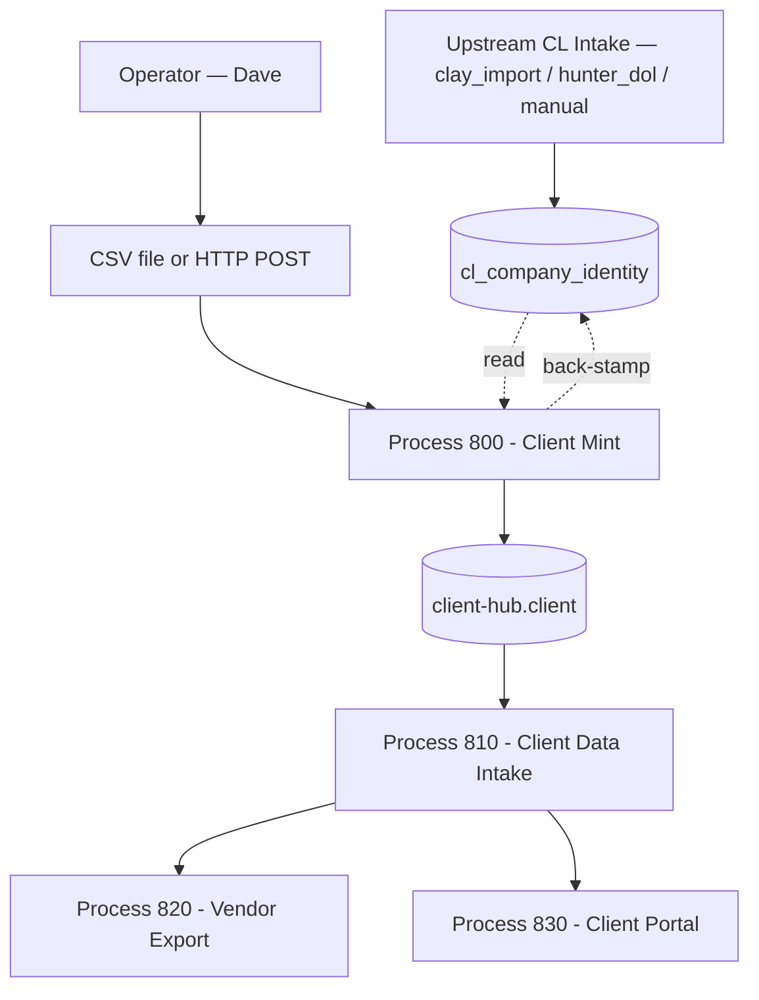

> **RETIRED — DUPLICATE PATH**
> This file (`factory/client/800-client-mint/PROCESS-UT.md`) is a retired duplicate. The canonical UT Book for bp.800 Client Mint is at:
> **`factory/cl/800-client-mint/PROCESS-UT.md`** (artifact_id: proc-800-client-mint)
> Retired: 2026-05-08 by Sonnet Mechanic (BAR-MONDAY-16-FLEET-GREEN). Do not update this file. Do not audit this file. All future work targets the canonical path.

# Client Mint
## Promotes a CL-resident company (sovereign_id) into an svg-agency client by minting a client_id, writing the operational record to D1 client-hub, and back-stamping the write-once client_id pointer onto cl_company_identity. Address-aware dedup pre-check prevents duplicate mints.
### Status: RETIRED
### Medium: process
### Business: svg-agency

## UT Checklist (Pre-Flight - per law/UT_CHECKLIST.md v1.2.0)

| # | Check | Status | Location |
|---|-------|--------|----------|
| 1 | PRD - what / why / who / scope / out-of-scope / success metric | [x] | §2 |
| 2 | OSAM - READ / WRITE / Process Composition / Join Chain / Forbidden Paths / Query Routing filled | [x] | §5 |
| 3 | Component Status - every dep has green / yellow / red with 1-line state | [x] | §3 |
| 4 | Owner - human who fixes this at 2 AM | [x] | §1 — Dave Barton |
| 5 | Live Dashboard - URL or explicit "N/A" | [ ] | §3 — TBV (not deployed) |
| 6 | Kill Switch - exact command to stop the process | [x] | §8 |
| 7 | Logbook - last audit verdict + date (after certification only) | [x] | §12 — N/A during BUILD |
| 8 | FCEs Attached - which FCE runs structurally back this doc | [ ] | §3c — TBV |
| 9 | BARs Referenced - every BAR this doc touches, with status | [x] | §3d |
| 10 | LBB Subjects Fed - which LBB subject(s) this doc's session logs go to | [x] | §3e |
| 11 | Geometry - CTB position + Hub-Spoke role + Altitude | [x] | §1b |
| 12 | Live Verification - every numeric count, cron, URL, command, BAR status grounded against the live system | [ ] | §9b — TBV (pre-deployment) |
| 13 | ctb_node - declared path on the Barton Enterprises CTB trunk | [x] | §1 |

## 1. IDENTITY {#sec-1-identity}

| Field | Value |
|-------|-------|
| ID | PROC-800 |
| Name | Client Mint |
| Medium | process |
| Business Silo | svg-agency |
| CTB Position | factory/client/800-client-mint |
| ORBT | BUILD |
| Strikes | 0 |
| Authority | inherited — Barton-Processes/factory + imo-creator-v2 sovereign |
| Last Modified | 2026-04-30 |
| BAR Reference | BAR-369 (this process), BAR-CL-ADDR (upstream dependency — address dedup foundation, CERTIFIED) |
| Owner | Dave Barton |
| ctb_node | barton-enterprises/insurance-informatics/svg-agency/client/800-client-mint |

### 1b. Geometry {#sec-1b-geometry}

**CTB Position:** Barton Enterprises → Insurance Informatics → SVG Agency → Client Operations → 800-client-mint (leaf)

**Hub-Spoke Role:** Middle (hub) — this process is the promotion engine. Operator drops a CSV at the rim; the hub looks up CL records by company identifier + address, mints client_id, writes operational record to client-hub D1, and back-stamps the write-once pointer to CL. Spokes = downstream consumers (Process 810 intake).

**Altitude:** 10k operational — single-purpose pipeline, batch-driven, idempotent.

```mermaid
flowchart LR
  TRUNK[Barton Enterprises] --> II[Insurance Informatics]
  II --> SVG[SVG Agency]
  SVG --> BRANCH[Client Operations]
  BRANCH --> LEAF[800 Client Mint]
  RIM_IN[CSV upload — operator-facing surface] --> HUB[Lookup CL → Mint → Write D1 → Back-stamp CL]
  HUB --> RIM_OUT[client_id minted + operational record]
  HUB --> P810[Process 810 - Client Data Intake]
  CL[(svg-d1-spine.cl_company_identity)] -.read.-> HUB
  CL <-.back-stamp.- HUB
  CHUB[(client-hub.client)] <-.write.- HUB
```

### HEIR (8 fields - Aviation Model, Bedrock §8)

| Field | Value |
|-------|-------|
| sovereign_ref | imo-creator-v2 |
| hub_id | client-mint-800 |
| ctb_placement | leaf |
| imo_topology | middle |
| cc_layer | CC-04 |
| services | CF Worker (HTTP endpoint), D1 svg-d1-spine (read CL + back-stamp), D1 client-hub (write client record) |
| secrets_provider | doppler |
| acceptance_criteria | (1) CSV row resolves to exactly one cl_company_identity row via deterministic match; (2) Multiple matches → REJECT to ambiguous queue; (3) No match → REJECT to needs-CL-intake queue; (4) Address-normalized dedup index prevents same address+state from minting twice; (5) Idempotent on company_unique_id — re-minting returns existing client_id; (6) Write-once trigger on cl_company_identity.client_id prevents back-stamp drift; (7) Operational record in client-hub.client carries sovereign_id + client_id; (8) Three-sink terminal routing: FAILED → client_mint_error; NO_MATCH_QUEUED → client_mint_no_match_queue; AMBIGUOUS_QUEUED → client_mint_ambiguous_queue. All three append-only with source_row_hash traceability. |

## 2. PURPOSE {#sec-2-purpose}

### WHAT

Process 800 is the single gate that promotes a CL-resident company into an svg-agency operational client. It accepts a list of company identifiers (CSV or HTTP POST), looks each up in `svg-d1-spine.cl_company_identity` by deterministic match (company_unique_id direct, or company_name + state_code with address+zip dedup), and for each clean match: generates a UUID client_id, INSERTs the operational record into `client-hub.client`, back-stamps the write-once `cl_company_identity.client_id` pointer, and stamps `client_promoted_at`. Process 810 (Client Data Intake) cannot accept any benefits data until this process has minted a client_id.

### WHY

Without Process 800, there is no path from CL identity to operational client record. Process 810's own SCOPE explicitly says "client must pre-exist in D1 client table — owned by Process 800." The 5 dashboards, employee self-serve page, vendor billing aggregation, and service ticketing all key off `client_id` — no client_id, no operational hub. Manual minting via direct D1 INSERT is fragile (no dedup, no idempotency, no audit trail, no back-stamp). This process formalizes the promotion as a single auditable transition.

### WHO

- **Operators (Dave)**: Drop a CSV at the known intake path (operator-facing surface). The worker reads the CSV and processes rows via internal call to /mint/batch (HTTP POST is the internal contract; CSV is the operator-facing surface).
- **Process 810 (Client Data Intake)**: Downstream consumer — reads `client.client_id` to verify intake authorization
- **All client-hub-backed dashboards**: Read `client.client_id` for per-client filtering
- **CL repository governance**: cl_company_identity.client_id pointer becomes non-NULL when this process runs successfully

### SCOPE (in)

- CSV file intake via known file path (operator-facing surface). HTTP POST `/mint/batch` is the internal endpoint the worker calls per-row or per-batch; it is NOT the operator interface.
- Per-row CL lookup with three deterministic match strategies (in priority order):
  1. Direct match on `company_unique_id` (if CSV carries it)
  2. `company_name` + `state_code` exact match
  3. `address_normalized` + `state_code` lookup against the BAR-CL-ADDR dedup index (when addresses are populated)
- Three-branch match outcome (Axis 1, Step 2 result): MATCHED → proceed to idempotency check, NO_MATCH → halt with "needs CL intake" output, AMBIGUOUS → halt with "needs human review" output. PARTIAL_RECOVERY is a Terminal outcome (Step 3a recovery), not a Match outcome — see ROW OUTCOME MODEL in §2 SUCCESS METRIC.
- UUID client_id generation per matched row
- Per-row sequenced write (non-atomic across D1 databases — see Step 3a recovery path): INSERT `client-hub.client` FIRST, then UPDATE `cl_company_identity.client_id` + UPDATE `cl_company_identity.client_promoted_at`. Write order is mandatory. If the second write fails after the first succeeds, the row enters PARTIAL_RECOVERY state; Step 3a re-fires the back-stamp on next batch run without minting a new client_id.
- Idempotency on `company_unique_id` — re-running with same identifier returns existing client_id, no second mint
- CQRS error table writes for every failure mode with source row traceability
- Per-batch summary report (six Axis 2 Terminal outcomes): minted / skipped (idempotent) / partial_recovery / no_match_queued / ambiguous_queued / failed

### OUT-OF-SCOPE

- Creating new CL records (owned by upstream CL intake processes — clay_import, hunter_dol_enrichment, manual_outreach)
- Address backfill on existing 32,702 cl_company_identity rows (separate future BAR — BAR-CL-ADDR-BACKFILL)
- Neon vault mirror of the new BAR-CL-ADDR address columns (separate future BAR — BAR-CL-ADDR-NEON)
- Benefits data intake (owned by Process 810)
- Client portal display (owned by Process 830)
- Vendor export (owned by Process 820)
- Authentication implementation (BUILD BLOCKER — see §8 Stop Conditions)
- Rolling back a mint (write-once trigger forbids — manual DBA intervention required for genuine errors)

### SUCCESS METRIC

100% of CSV rows produce exactly one Terminal row outcome (Axis 2) within a single batch run. Zero rows silently lost. Zero duplicate mints (verified by post-run query: `SELECT sovereign_id, COUNT(*) FROM client GROUP BY sovereign_id HAVING COUNT(*) > 1` returns empty). Note: `client` here refers to the `client` table accessed via the `client-hub` D1 binding — `client-hub` is the CF binding name, not a SQL schema.

---

**ROW OUTCOME MODEL — two axes:**

**Axis 1: Match outcome** (Step 2 result of CL lookup)
- `MATCHED` — exactly one cl_company_identity row found
- `NO_MATCH` — zero rows found
- `AMBIGUOUS` — multiple rows found

**Axis 2: Terminal row outcome** (final state at end of batch)
- `MINTED` — new client_id created (Steps 4-6 succeeded)
- `SKIPPED` — already a client (idempotent return of existing client_id)
- `PARTIAL_RECOVERY` — Step 5 OK but Step 6 failed previously; back-stamp reconciled this run (no new mint)
- `NO_MATCH_QUEUED` — Step 2 returned NO_MATCH; row goes to needs-CL-intake queue
- `AMBIGUOUS_QUEUED` — Step 2 returned AMBIGUOUS; row goes to needs-human-review queue
- `FAILED` — any other failure (validation error, INCONSISTENT_STATE, hard write error)

Every row produces exactly one Match outcome (Axis 1) AND exactly one Terminal outcome (Axis 2).

---

**Naming convention:** `PARTIAL_RECOVERY` = enum value used in status fields and outcome classification. `partial_recovery` (lowercase snake_case) = field/column/JSON-key form (e.g., `client_mint_batch.partial_recovery` count column, `partial_recovery: <int>` in batch summary JSON). Match outcomes (Axis 1) and Terminal outcomes (Axis 2) are distinct enums — never combined into a single field.

## 3. RESOURCES {#sec-3-resources}

Required doctrine references for every process UT:

- `law/UNIFIED_TEMPLATE.md`
- `law/UT_CHECKLIST.md`
- `law/doctrine/PROCESS_FILL_INSTRUCTIONS.md`
- `law/doctrine/HOW_TO_BUILD_ANYTHING.md` (repair manual)
- `law/doctrine/BARTON_ENTERPRISES_WORLD_ATLAS.md` (Atlas System bundle)
- `law/doctrine/KEY.md`

### Component Status Grid

| Component | HEIR (`hub_id · ctb · cc_layer`) | ORBT | Light | State |
|-----------|----------------------------------|------|-------|-------|
| CF Worker (client-mint-800) | client-mint-800 · leaf · CC-04 | BUILD | red | Not scaffolded — no worker dir yet |
| D1 svg-d1-spine (READ + back-stamp) | svg-d1-spine · branch · CC-03 | OPERATE | green | Live, 32,702 rows, BAR-CL-ADDR shipped 2026-04-30 (9 address columns + 2 dedup indexes) |
| D1 client-hub (WRITE client record) | client-hub · branch · CC-02 | BUILD | yellow | Live D1 (3ba426ee), worker deployed; FP-002 outstanding (verify `client` table DDL exists) |
| Process 810 (downstream) | client-intake-810 · leaf · CC-04 | BUILD | yellow | Documented, not deployed; depends on this process |
| Operator CSV intake path | TBV | TBV | red | Not defined — see §4 Input |
| client_mint_error table | client-mint-800 · leaf · CC-04 | BUILD | red | Not created — migration required (in scope); FAILED rows only |
| client_mint_no_match_queue table | client-mint-800 · leaf · CC-04 | BUILD | red | Not created — migration required (in scope); FP-800-05 |
| client_mint_ambiguous_queue table | client-mint-800 · leaf · CC-04 | BUILD | red | Not created — migration required (in scope); FP-800-06 |
| BAR-CL-ADDR dedup foundation | cl-spine · branch · CC-03 | OPERATE | green | CERTIFIED 2026-04-30 (Codex P=1 post-fix) — `idx_cl_address_state_unique` live |

### Live Dashboard

| Resource | URL | What it shows |
|----------|-----|---------------|
| Worker endpoint | https://client-mint-800.svg-outreach.workers.dev | TBV — not deployed |
| Mission Control "Client Mint" page | TBV — pending Mission Control wire-up | CSV upload operator surface (TBD), per-batch outcomes, error queue (FAILED), no_match queue (NO_MATCH_QUEUED), ambiguous queue (AMBIGUOUS_QUEUED). Note: operator surface is CSV upload mechanism, NOT the /mint/batch HTTP endpoint directly. |

### Dependencies

| Dependency | Type | What It Provides | Status |
|-----------|------|-----------------|--------|
| BAR-CL-ADDR (D1 schema) | upstream BAR | Address columns + partial unique dedup index on cl_company_identity | DONE (CERTIFIED 2026-04-30) |
| svg-d1-spine.cl_company_identity | database | CL identity records — read source + back-stamp target | DONE (32,702 rows live) |
| client-hub.client | database | Operational client record write target | YELLOW (D1 live; FP-002 — verify DDL) |
| Doppler | secrets | Worker auth, CF API credentials | DONE |
| FP-002 verification | precondition | Confirm `client-hub.client` table actually exists with expected columns | PENDING — single read-only query |
| client_mint_error table migration | precondition | CQRS error table for this process | PENDING — in scope |
| client_mint_no_match_queue table migration | precondition | CQRS queue table for NO_MATCH_QUEUED rows | PENDING — in scope (FP-800-05) |
| client_mint_ambiguous_queue table migration | precondition | CQRS queue table for AMBIGUOUS_QUEUED rows | PENDING — in scope (FP-800-06) |
| Auth mechanism | security | Bearer token or CF Access | PENDING — BUILD BLOCKER |

### Downstream Consumers

| Consumer | What It Needs |
|----------|--------------|
| Process 810 (Client Data Intake) | `client.client_id` exists in client-hub D1 before accepting benefits intake |
| Process 820 (Vendor Export) | client_id reference for per-client vendor reports |
| Process 830 (Client Portal) | client_id for portal session scoping |
| All five per-client dashboards (BAR-82) | client_id for filtered queries |
| cl repository governance | cl_company_identity.client_id pointer + client_promoted_at stamp |

### Tools & Integrations

| Item | Type | Cost Tier | Credentials | What It Does |
|------|------|-----------|-------------|-------------|
| Cloudflare D1 (svg-d1-spine) | database | Free | wrangler binding | READ cl_company_identity, UPDATE client_id back-stamp |
| Cloudflare D1 (client-hub) | database | Free | wrangler binding | INSERT client record |
| Cloudflare Workers | compute | Cheap | CF account a1dd98c6 | Hosts the mint worker |
| Hono | API framework | Free | none | REST endpoint routing |
| Zod | validation library | Free | none | CSV row + payload validation |
| crypto.randomUUID() | runtime | Free | Built into CF Workers | client_id generation |

### Secrets

| Secret | Doppler Project | Config | Used By |
|--------|----------------|--------|---------|
| MINT_AUTH_TOKEN | imo-creator | dev | Bearer auth on /mint/batch endpoint |
| LBB_API_KEY | imo-creator | dev | Per-batch session ingest |

### 3c. FCEs Attached

| FCE Name | HEIR (`hub_id · ctb · cc_layer`) | ORBT | Run Directory | Latest P=1 | Rows | Status |
|----------|----------------------------------|------|--------------|------------|------|--------|
| BAR-CL-ADDR Atlas conformance | cl-spine · branch · CC-03 | OPERATE | LBB record 6d357e2d | 2026-04-30 | 32,702 | green |
| TBV — per-batch run FCE | TBV | TBV | TBV | pending | TBV | TBV |

### 3d. BARs Referenced

| BAR | Title | HEIR (`bar-id · ctb · cc_layer`) | ORBT | Status | Relation |
|-----|-------|----------------------------------|------|--------|----------|
| BAR-369 | Client Mint process build | TBV | BUILD | this BAR | implements |
| BAR-CL-ADDR | CL spine address columns + dedup index | cl-spine · branch · CC-03 | OPERATE | CERTIFIED | dependency (foundation) |
| BAR-CL-ADDR-BACKFILL | Backfill addresses on existing 32,702 rows | TBV | TBV | future | strengthens dedup |
| BAR-CL-ADDR-NEON | Neon mirror of address columns via Hyperdrive | TBV | TBV | future | parallel vault path |

### 3e. LBB Subjects Fed

| LBB Subject | HEIR (`subject-id · ctb · cc_layer`) | ORBT | What This Doc Writes | Frequency |
|-------------|--------------------------------------|------|---------------------|-----------|
| svg-client-proc | svg-client-proc · leaf · CC-04 | BUILD | Per-batch run summary, error patterns, dedup hit rate | per-batch |
| svg-client | svg-client · branch · CC-03 | BUILD | Newly minted client_ids, no_match queue events, ambiguous queue events | on-mint |
| processes | processes · branch · CC-03 | BUILD | Doctrine learnings, audit verdicts | per-session |

## 4. IMO - Input, Middle, Output {#sec-4-imo}

### Two-Question Intake (Bedrock §3)

1. **What triggers this?** — Operator drops a CSV at the known intake path. Triggered manually per Dave's promotion decision (no auto-promotion).
2. **How do we get it?** — CSV file (UTF-8, header row) at agreed path. The worker reads the CSV and calls `/mint/batch` (HTTP POST, internal contract) per-row or per-batch. Bearer auth on the internal HTTP endpoint.

### Input

**Operator interface (per Dave's locked decision: A = CSV file). HTTP POST `/mint/batch` is the internal API the worker uses to process rows — it is NOT directly called by the operator.**

CSV schema (header row required, columns in any order):

| Column | Required | Format | Description |
|--------|----------|--------|-------------|
| company_unique_id | optional | UUID string | If carried, used as direct match key (highest priority) |
| company_name | required if no company_unique_id | text | Used in fallback match strategy 2 |
| state_code | required if no company_unique_id | CHAR(2) | US state code, used in fallback match strategies 2 and 3 |
| address_line_1 | optional | text | Used in fallback match strategy 3 (when addresses populated) |
| city | optional | text | Match strategy 3 |
| zip_code | optional | text | Match strategy 3 (5-digit or ZIP+4) |
| operator_note | optional | text | Free-form note for audit trail |

CSV row identifies a CL company; the worker pulls the rest of the record from `cl_company_identity` itself. The CSV does NOT carry full company data — it carries pointers.

Auth: Bearer token (`MINT_AUTH_TOKEN` from Doppler) on the HTTP endpoint. CSV upload via authenticated dashboard (or wrangler-CLI tool by operator).

### Middle

| Step | Input | What Happens | Output | Tool Used |
|------|-------|-------------|--------|-----------|
| 1 | CSV row OR JSON identifier object | Validate row shape (Zod) — at minimum one of: company_unique_id OR (company_name + state_code) | Validated row or row_validation_error | Zod |
| 2 | Validated row | Run match strategies in priority order: (a) direct on company_unique_id; (b) company_name + state_code; (c) address_normalized + state_code (BAR-CL-ADDR index) | One of: MATCHED (single row), NO_MATCH (zero rows), AMBIGUOUS (>1 row) | D1 SELECT against svg-d1-spine.cl_company_identity |
| 3 | MATCHED + cl_company_identity row | **Dual idempotency check** — query BOTH sources in parallel: (a) `SELECT client_id FROM cl_company_identity WHERE company_unique_id = ?` (cl back-stamp); (b) `SELECT client_id FROM client WHERE sovereign_id = ?` (client-hub row). Evaluate combined result: **Both non-NULL and matching** → SKIPPED (fully idempotent, return existing client_id); **client-hub has row but cl is NULL** → PARTIAL_RECOVERY path (Step 3a below, skip mint); **cl has non-NULL but client-hub missing** → INCONSISTENT_STATE hard error (alert Dave, halt row); **Both NULL** → proceed to Step 4 (new mint) | "minted", "skipped (idempotent)", "partial_recovery", or "inconsistent_state_error" | D1 SELECT (both bindings) |
| 3a | PARTIAL_RECOVERY state detected | Re-fire the back-stamp only: `UPDATE cl_company_identity SET client_id = ?, client_promoted_at = now WHERE company_unique_id = ? AND client_id IS NULL`. Return existing client_id. Log as PARTIAL_RECOVERY (not error) so it can be tracked in §10 metrics. | cl back-stamp repaired, no new mint | D1 UPDATE (svg-d1-spine) |
| 4 | New mint required (both NULL confirmed in Step 3) | Generate `client_id = crypto.randomUUID()` | UUID | Workers crypto |
| 5 | client_id + cl record | Begin sequenced write. INSERT into the `client` table via client-hub binding (client_id, sovereign_id=company_unique_id, legal_name=company_name, state_code, status='active', minted_at=now, created_at=now, updated_at=now) | client row created in client-hub D1 | D1 INSERT |
| 6 | client_id + company_unique_id | UPDATE `cl_company_identity` in svg-d1-spine: SET client_id = ?, client_promoted_at = now WHERE company_unique_id = ? AND client_id IS NULL (write-once guard) | cl_company_identity row back-stamped | D1 UPDATE |
| 7 | Outcome of any step | Route by Terminal outcome (Axis 2): **FAILED** → INSERT into `client_mint_error` (error_id, batch_id, source_row_hash, error_code, reason, attempted_at); **NO_MATCH_QUEUED** → INSERT into `client_mint_no_match_queue` (queue_id, batch_id, source_row_hash, csv_row_data JSON, reason, queued_at); **AMBIGUOUS_QUEUED** → INSERT into `client_mint_ambiguous_queue` (queue_id, batch_id, source_row_hash, csv_row_data JSON, reason, queued_at). NO_MATCH_QUEUED and AMBIGUOUS_QUEUED are valid Terminal outcomes — they are NOT failures and do NOT go to client_mint_error. | client_mint_error row (FAILED only) OR client_mint_no_match_queue row OR client_mint_ambiguous_queue row | D1 INSERT |
| 8 | Per-batch tally | Aggregate Terminal outcome counts (Axis 2): minted, skipped, partial_recovery, no_match_queued, ambiguous_queued, failed. Write to `client_mint_batch` (batch_id, csv_filename or POST body hash, started_at, completed_at, counts JSON) | Batch summary row | D1 INSERT |

The sequenced two-write flow (step 5 → step 6) is **not atomic across D1 databases (CF D1 has no cross-DB transactions)**. Mitigation: order is INSERT `client` in client-hub D1 FIRST (idempotent on sovereign_id via index), then UPDATE `cl_company_identity` in svg-d1-spine (write-once trigger guarantees no double-stamp). If step 6 fails after step 5 succeeded, the client-hub row exists but cl pointer is NULL — this is the PARTIAL_RECOVERY state. On re-run, Step 3's dual-check detects "client-hub has the row but cl is NULL" and re-fires the back-stamp (Step 3a) without minting a new client_id. This prevents duplicate mints that would have occurred if Step 3 only checked cl. Logged as PARTIAL_RECOVERY warning, not error.

### Output

- HTTP 200 with batch summary: `{ batch_id, csv_rows: N, minted: X, skipped: Y, partial_recovery: P, no_match_queued: Z, ambiguous_queued: W, failed: E, mint_results: [...], errors_url: "/mint/errors/<batch_id>", no_match_queue_url: "/mint/no-match-queue/<batch_id>", ambiguous_queue_url: "/mint/ambiguous-queue/<batch_id>" }` (six Terminal outcome counts — Axis 2 only; Match outcome is internal to Step 2; errors_url references FAILED rows only; no_match_queue_url and ambiguous_queue_url reference queued rows awaiting upstream action)
- HTTP 401 if auth fails
- HTTP 422 if CSV is malformed (no rows, no header, missing required columns at file level)
- For each row, individual outcome present in `mint_results` array using Terminal outcome (Axis 2) values
- `client_mint_error` table contains every row that produced a failure, with traceability
- `client_mint_batch` table contains the run summary (one row per batch invocation)
- Six Terminal outcome queues (Axis 2): minted (client_id returned), skipped (idempotent, existing client_id returned), partial_recovery (back-stamp re-fired; no operator action required unless investigation warranted), no_match_queued (operator action: file CL intake BAR), ambiguous_queued (operator action: human disambiguation), failed (alert Dave on hard errors)

### Circle (Bedrock §5)

**The closing loop:** every batch produces a summary report → operator reviews three sinks: error queue (real failures), no_match queue (rows needing upstream CL intake), ambiguous queue (rows needing human disambiguation) → no_match rows trigger upstream CL intake (separate process) → ambiguous rows get human review → both flow back into a future CSV batch. Process 810 (downstream) cannot accept benefits intake until clients minted here exist. Strike 3 on same dedup miss pattern → Troubleshoot/Train (probably an Airworthiness Directive on CL intake quality, not on Process 800 itself).

## 5. DATA SCHEMA {#sec-5-data-schema}

> **D1 Binding Notation:** Throughout this document, references to `client`, `client_mint_error`, `client_mint_batch` in SQL contexts mean those tables accessed via the **`client-hub`** Cloudflare D1 binding. `client-hub` is the CF binding name — it is not a SQL schema prefix. Do not write `client-hub.client` in SQL statements; write `client` (the table) and configure the wrangler binding `client-hub` to route the query to the correct D1 database. Same convention applies to `client_mint_no_match_queue` and `client_mint_ambiguous_queue` — both tables in client-hub D1, queried via the `client-hub` binding, never `client-hub.client_mint_no_match_queue` syntax.

### READ Access

| Source | What It Provides | Join Key |
|--------|-----------------|----------|
| `cl_company_identity` (svg-d1-spine D1) | CL identity record — match candidate pool | `company_unique_id`, `company_name + state_code`, `address_normalized + state_code` |
| `client` (client-hub D1) | Existing client records — idempotency check | `sovereign_id` |
| `client_mint_batch` (client-hub D1) | Prior batch history — for diagnostics | `batch_id` |

### WRITE Access

| Target | What It Writes | When |
|--------|---------------|------|
| `client` (client-hub D1) | New client record (client_id, sovereign_id, legal_name, state_code, status='active', minted_at, created_at, updated_at) | Step 5 of every successful mint |
| `cl_company_identity.client_id` (svg-d1-spine D1) | Back-stamp pointer — write-once enforced by trigger | Step 6 of every successful mint |
| `cl_company_identity.client_promoted_at` (svg-d1-spine D1) | Promotion timestamp | Step 6 of every successful mint |
| `client_mint_error` (client-hub D1) | Failure rows (error_id, batch_id, source_row_hash, error_code, reason, attempted_at) | Step 7, on any failure |
| `client_mint_no_match_queue` (client-hub D1) | Queue row for NO_MATCH_QUEUED rows (queue_id, batch_id, source_row_hash, csv_row_data JSON, reason, queued_at) — append-only; operator action: file CL intake BAR | Step 7, on NO_MATCH_QUEUED outcome |
| `client_mint_ambiguous_queue` (client-hub D1) | Queue row for AMBIGUOUS_QUEUED rows (queue_id, batch_id, source_row_hash, csv_row_data JSON, reason, queued_at) — append-only; operator action: human disambiguation | Step 7, on AMBIGUOUS_QUEUED outcome |
| `client_mint_batch` (client-hub D1) | Per-batch summary row (batch_id, csv_filename or POST body hash, started_at, completed_at, counts JSON: minted, skipped, partial_recovery, no_match_queued, ambiguous_queued, failed) — six Terminal outcome counts (Axis 2) | Step 8, end of every batch |

### Process Composition



| Process ID | Name | Role in Composition | Status |
|-----------|------|---------------------|--------|
| Upstream CL intake | clay_import / hunter_dol_enrichment / manual_outreach | populates cl_company_identity | OPERATE (existing) |
| PROC-800 | Client Mint | this process | BUILD |
| PROC-810 | Client Data Intake | downstream — requires client_id minted | BUILD |
| PROC-820 | Vendor Export | downstream of 810 | BUILD |
| PROC-830 | Client Portal | downstream of 810 | BUILD |

### Join Chain

```text
Operator CSV row
  → (match strategy) cl_company_identity.company_unique_id  [SOVEREIGN SPINE]
    → cl_company_identity.client_id  (write-once pointer, this process sets it)
    → client-hub.client.sovereign_id  (== cl_company_identity.company_unique_id)
      → client-hub.client.client_id  (universal join key for all 16 client-hub tables)
        → all downstream processes (810, 820, 830) join on client_id
  → cl_company_identity.client_promoted_at  (timestamp lineage)
```

### Forbidden Paths

| Action | Why |
|--------|-----|
| INSERT directly into client-hub.client without going through this process | Bypasses dedup, idempotency, and back-stamp — D-800-01 |
| UPDATE cl_company_identity.client_id when it is already non-NULL | Write-once trigger (cl repo doctrine: `trg_write_once_pointers`) — D-800-02 |
| Mint a client_id without verifying CL match first | NO_MATCH companies must go through CL intake first — D-800-03 |
| Suppress AMBIGUOUS results (silently pick one match) | Human disambiguation required — D-800-04 |
| DELETE rows from any of the three CQRS sinks (client_mint_error, client_mint_no_match_queue, client_mint_ambiguous_queue) — all three are append-only by doctrine | CQRS — all three sink tables are append-only — D-800-05 |
| Skip the address dedup check when addresses are populated | BAR-CL-ADDR foundation must be honored — D-800-06 |
| Re-mint a company that already has a client_id | Idempotency violation — must return existing — D-800-07 |
| Cross-batch reads without batch_id filter | Sovereign silo — every batch is its own audit boundary — D-800-08 |

### Query Routing

| Question | Table | Column |
|----------|-------|--------|
| What client_id was minted for company X? | `cl_company_identity` | `WHERE company_unique_id = X → client_id` |
| What is the sovereign_id behind client_id Y? | `client` | `WHERE client_id = Y → sovereign_id` |
| Which CL companies are not yet clients? | `cl_company_identity` | `WHERE client_id IS NULL` |
| What batches ran today? | `client_mint_batch` | `WHERE DATE(started_at) = CURRENT_DATE` |
| What rows failed in batch B? | `client_mint_error` | `WHERE batch_id = B` |
| Was there a duplicate mint? | `client` | `SELECT sovereign_id, COUNT(*) FROM client GROUP BY sovereign_id HAVING COUNT(*) > 1` |
| What's the dedup hit rate this run? | `client_mint_batch` | `counts.skipped / counts.csv_rows` |

## 6. DMJ - Define, Map, Join {#sec-6-dmj}

### 6a. DEFINE (Build the Key)

| Element | ID | Format | Description | C or V |
|---------|-----|--------|-------------|--------|
| 8-step pipeline | DMJ-800-01 | constant | Validate → Match → Idempotency check → Generate UUID → INSERT client-hub → UPDATE cl back-stamp → Error/log → Batch summary | C |
| company_unique_id | DMJ-800-02 | UUID string | CL spine PK, also written as client.sovereign_id | C |
| client_id | DMJ-800-03 | UUID string | Minted by this process; universal join key in client-hub | C |
| Match strategy priority | DMJ-800-04 | ordered enum: 1=direct, 2=name+state, 3=address+state | Deterministic order; first hit wins | C |
| Match outcome (Axis 1) | DMJ-800-05a | enum: MATCHED, NO_MATCH, AMBIGUOUS | Step 2 result of CL lookup — not terminal | C |
| Terminal row outcome (Axis 2) | DMJ-800-05b | enum: MINTED, SKIPPED, PARTIAL_RECOVERY, NO_MATCH_QUEUED, AMBIGUOUS_QUEUED, FAILED | Final state of row at end of batch — exactly one per row | C |
| Write-once pointer | DMJ-800-06 | constant | cl_company_identity.client_id is write-once via trigger; this process is the only legitimate writer | C |
| Idempotency key | DMJ-800-07 | constant | company_unique_id; re-mint returns existing client_id | C |
| CQRS error path | DMJ-800-08 | constant | `client_mint_error` is FAILED-only: every row with Terminal outcome FAILED writes here with source_row_hash. NO_MATCH_QUEUED rows → `client_mint_no_match_queue` (not failures — awaiting CL intake). AMBIGUOUS_QUEUED rows → `client_mint_ambiguous_queue` (not failures — awaiting human review). Three distinct sinks, no co-mingling. | C |
| batch_id | DMJ-800-09 | UUID | Per-invocation grouping key | V |
| csv_filename / POST body hash | DMJ-800-10 | text/SHA-256 | Source identifier for audit | V |
| Per-batch counts | DMJ-800-11 | integer per category (Axis 2 Terminal outcomes) | minted, skipped, partial_recovery, no_match_queued, ambiguous_queued, failed | V |
| Operator note | DMJ-800-12 | text | Free-form per-row note from CSV | V |
| Address-normalized dedup | DMJ-800-13 | constant | Honored when address columns populated; relies on BAR-CL-ADDR partial unique index | C |

### 6b. MAP (Connect Key to Structure)

| Source | Target | Transform |
|--------|--------|-----------|
| CSV row.company_unique_id | cl_company_identity.company_unique_id | direct UUID match |
| CSV row.company_name + state_code | cl_company_identity (same columns) | exact case-insensitive match (UPPER both sides) |
| CSV row.address fields | address_normalized derivation | uppercase, strip punctuation, trim whitespace, then index lookup with state_code |
| Match success → company_unique_id | client.sovereign_id | direct copy |
| crypto.randomUUID() | client.client_id | new mint |
| Match success | cl_company_identity.client_id | back-stamp via write-once trigger |
| now() | cl_company_identity.client_promoted_at + client.minted_at + client.created_at | direct timestamp |
| Failure of any step | client_mint_error | error_code + source_row_hash for traceability |

### 6c. JOIN (Path to Spine)

| Join Path | Type | Description |
|-----------|------|-------------|
| CSV row → cl_company_identity | match | Three deterministic strategies; exactly one row required |
| cl_company_identity.company_unique_id → client.sovereign_id | direct | One-to-one after mint |
| cl_company_identity.client_id ← client.client_id | back-stamp | Same UUID written in both directions; cl has the trigger guard |
| client.client_id → all client-hub tables | direct | Universal join key for plan, person, election, vendor, invoice, service_request |
| client_mint_error.batch_id → client_mint_batch.batch_id | direct | Audit trail join |

## 7. CONSTANTS & VARIABLES {#sec-7-constants-variables}

### Constants (structure — never changes)

- Three deterministic match strategies in priority order: company_unique_id → name+state → address+state (D-800-04) — these are the three Match outcomes (Axis 1): MATCHED, NO_MATCH, AMBIGUOUS
- Six Terminal row outcomes (Axis 2): MINTED, SKIPPED, PARTIAL_RECOVERY, NO_MATCH_QUEUED, AMBIGUOUS_QUEUED, FAILED (DMJ-800-05b) — these are the final states written to client_mint_batch; distinct from Match outcomes
- Idempotency on company_unique_id (re-mint returns existing client_id) (D-800-07)
- Write-once back-stamp on cl_company_identity.client_id (D-800-02, D-800-06)
- BAR-CL-ADDR partial unique index `(address_normalized, state_code)` is the dedup mechanism (D-800-06)
- CQRS error path: every failure writes to client_mint_error with source_row_hash (D-800-08)
- Step 5 (client-hub INSERT) precedes Step 6 (cl back-stamp) — order matters for partial-failure recovery
- No cross-D1 transaction — partial-failure recovery is by re-run idempotency
- Operator-driven, batch-mode only — no auto-promotion
- Append-only batch log (client_mint_batch), append-only error log (client_mint_error), append-only no_match queue (client_mint_no_match_queue), append-only ambiguous queue (client_mint_ambiguous_queue)

### Variables (fill — changes every run)

- Which CSV file or POST body is the source
- Number of rows in the batch
- Per-row identifier values
- Per-row outcome distribution
- Generated client_id UUIDs (one per successful mint)
- Per-batch dedup hit rate (skipped / csv_rows)
- Specific NO_MATCH and AMBIGUOUS row identifiers (which feed back to operator)

## 8. STOP CONDITIONS {#sec-8-stop-conditions}

| Condition | Action |
|-----------|--------|
| CSV file malformed (no header, no rows, missing required columns) | REJECT 422 — entire batch fails before any row processed |
| Row missing both company_unique_id AND (company_name + state_code) | row → row_validation_error, batch continues |
| Match strategy returns AMBIGUOUS | row → ambiguous queue, batch continues, requires human review |
| Match strategy returns NO_MATCH | row → no_match queue, batch continues, operator must run upstream CL intake |
| Step 5 (INSERT client-hub.client) fails | row → client_mint_error, batch continues |
| Step 6 (UPDATE cl back-stamp) fails after Step 5 succeeded | row logged as PARTIAL_RECOVERY, will reconcile on next batch |
| Write-once trigger rejects (cl_company_identity.client_id already non-NULL but mismatches our minted UUID) | HARD ERROR — possible data corruption, halt batch, alert Dave |
| Auth fails | HTTP 401, no batch processing |
| Doppler MINT_AUTH_TOKEN missing | HALT before any batch can run |
| BAR-CL-ADDR address columns suddenly missing | HALT — schema regression, run BAR-CL-ADDR re-verification |
| 50%+ of batch rows fail | LOG WARNING, continue — investigate data quality post-batch |
| Strike 3 on same NO_MATCH pattern (same company keeps failing) | Troubleshoot/Train → probably an upstream CL intake gap; Airworthiness Directive on intake source |

### Kill Switch

```text
# Disable the worker route
wrangler deployments list --name client-mint-800
# Then in CF Dashboard → Workers → client-mint-800 → Disable

# Or revoke the auth token (immediate cutoff)
doppler secrets delete MINT_AUTH_TOKEN --project imo-creator --config dev

# Or pause via secret flag
wrangler secret put MAINTENANCE_MODE --text "1" --name client-mint-800
```

## 9. VERIFICATION {#sec-9-verification}

```text
1. GET /health → expected: { process: 'PROC-CLIENT-MINT', number: 800, status: 'ok' }

2. POST /mint/batch with one row containing a known company_unique_id → expected: 200, minted=1, skipped=0
   Verify: SELECT client_id FROM cl_company_identity WHERE company_unique_id=? → returns the new UUID
   Verify: SELECT * FROM client WHERE sovereign_id=? → returns the new row [via client-hub D1 binding]

3. POST /mint/batch with the SAME row again → expected: 200, minted=0, skipped=1 (idempotent)
   Verify: only one client row exists for that sovereign_id

4. POST /mint/batch with a fake company_unique_id → expected: 200, no_match_queued=1
   Verify: client_mint_no_match_queue has the row (queue_id, batch_id, source_row_hash, csv_row_data, reason, queued_at present); client_mint_error does NOT have the row (NO_MATCH_QUEUED is not a failure); the `client` table in client-hub D1 has nothing new

5. POST /mint/batch with company_name='Generic Inc' + state_code='OH' (likely ambiguous in real data) → expected: 200, ambiguous_queued=1 if multiple matches exist
   Verify: client_mint_ambiguous_queue has the row (queue_id, batch_id, source_row_hash, csv_row_data, reason, queued_at present); client_mint_error does NOT have the row (AMBIGUOUS_QUEUED is not a failure)

6. POST /mint/batch with bad auth → expected: 401

7. SELECT COUNT(*) FROM client_mint_batch WHERE started_at >= today → expected: matches number of batches run

8. SELECT sovereign_id, COUNT(*) FROM client GROUP BY sovereign_id HAVING COUNT(*) > 1 → expected: empty (zero duplicate mints) [run via client-hub D1 binding]

9. Cleanup test data: DELETE the test client + reset cl_company_identity.client_id to NULL via DBA-only path (write-once trigger requires manual override)
```

### Three Primitives Check (Bedrock §1)

1. **Thing** — Does the worker exist? Does cl_company_identity have the address columns + dedup index (BAR-CL-ADDR)? Does client-hub.client table exist with sovereign_id column? Do the three CQRS sink tables exist (client_mint_error, client_mint_no_match_queue, client_mint_ambiguous_queue)?
2. **Flow** — Does a CSV row reach the worker, hit the match logic, generate a client_id, INSERT to client-hub, UPDATE cl back-stamp, and return a summary?
3. **Change** — Did a NEW client_id appear? Did the cl row's client_id change from NULL to that UUID? Did client_promoted_at stamp? Did the idempotent re-run NOT create a duplicate?

If any fails → Troubleshooting Loop. Don't patch.

## 9b. Live Verification Log {#sec-9b-live-verification}

| Claim | Section | Source of Truth | Verification Command | [ ] | Last Check | Value |
|-------|---------|-----------------|----------------------|-----|-----------|-------|
| Worker deployed at client-mint-800.svg-outreach.workers.dev | §3 | CF Workers dashboard | `curl -s https://client-mint-800.svg-outreach.workers.dev/health` | [ ] | TBV (not deployed) | TBV |
| client_mint_batch table exists in client-hub D1 | §5 WRITE | client-hub D1 schema | `npx wrangler d1 execute client-hub --remote --command "SELECT name FROM sqlite_master WHERE name='client_mint_batch'"` | [ ] | TBV | TBV |
| client_mint_error table exists in client-hub D1 | §5 WRITE | client-hub D1 schema | `npx wrangler d1 execute client-hub --remote --command "SELECT name FROM sqlite_master WHERE name='client_mint_error'"` | [ ] | TBV | TBV |
| client_mint_no_match_queue table exists in client-hub D1 | §5 WRITE | client-hub D1 schema | `npx wrangler d1 execute client-hub --remote --command "SELECT name FROM sqlite_master WHERE name='client_mint_no_match_queue'"` | [ ] | TBV | TBV |
| client_mint_ambiguous_queue table exists in client-hub D1 | §5 WRITE | client-hub D1 schema | `npx wrangler d1 execute client-hub --remote --command "SELECT name FROM sqlite_master WHERE name='client_mint_ambiguous_queue'"` | [ ] | TBV | TBV |
| client-hub.client table has sovereign_id column | §6c | client-hub D1 schema | `npx wrangler d1 execute client-hub --remote --command "PRAGMA table_info(client)"` (closes FP-002) | [ ] | TBV | TBV |
| cl_company_identity has BAR-CL-ADDR address columns + index | §3 dependencies | svg-d1-spine D1 | inherited verification — see SPINE_MANUAL §9b post-2026-04-30 | [x] | 2026-04-30 | 9 cols + 2 indexes verified (BAR-CL-ADDR P=1) |
| Idempotency: re-mint returns existing client_id | §7 Constants | live test | smoke test step 3 | [ ] | TBV | TBV |
| Write-once trigger on cl_company_identity.client_id active | §7 Constants | svg-d1-spine D1 trigger DDL | `SELECT sql FROM sqlite_master WHERE type='trigger' AND name LIKE '%write_once%'` (Note: trigger may live in Neon CL — verify D1 mirror) | [ ] | TBV | TBV |
| Zero duplicate mints in client-hub.client | §9 step 8 | client-hub D1 | smoke test step 8 | [ ] | TBV | TBV |
| Auth required (401 on missing token) | §8 | live test | smoke test step 6 | [ ] | TBV | TBV |
| Per-batch summary written to client_mint_batch | §4 step 8 | client-hub D1 | `SELECT COUNT(*) FROM client_mint_batch` after a test batch | [ ] | TBV | TBV |

Rule: at least one live gauge row must be checked before BUILD can move to OPERATE.

## 10. ANALYTICS {#sec-10-analytics}

### 10a. Metrics

| Metric | Unit | Baseline | Target | Tolerance |
|--------|------|----------|--------|-----------|
| Batches processed | count | BASELINE | TBV | TBV |
| Rows per batch | count | BASELINE | TBV | TBV |
| Mint success rate | % | BASELINE | ≥ 90% steady state (post-CL coverage) | < 80% triggers review |
| Idempotent skip rate | % | BASELINE | varies by batch (re-runs are normal) | informational only |
| NO_MATCH rate | % | BASELINE | < 10% steady state | > 20% triggers CL intake review |
| AMBIGUOUS rate | % | BASELINE | < 2% steady state | > 5% triggers CL data quality review |
| Hard error rate | % | BASELINE | 0% | > 0% triggers REPAIR |
| Average row processing time | ms | BASELINE | < 200ms | < 500ms |
| Partial-recovery events (Step 5 OK, Step 6 failed) | count | BASELINE | 0 in steady state — Step 3a now handles this path automatically (re-fires back-stamp only, no re-mint) | > 0 triggers investigation (indicates logic gap or trigger failure) |

### 10b. Sigma Tracking

| Metric | Run 1 | Run 2 | Run 3 | Trend | Action |
|--------|-------|-------|-------|-------|--------|
| Mint success rate | TBV | TBV | TBV | TBV — no runs yet | establish baseline on first batch |
| NO_MATCH rate | TBV | TBV | TBV | TBV | establish baseline; expected high until CL coverage improves |
| Partial-recovery events | TBV | TBV | TBV | TBV | should be zero — non-zero = bug |

### 10c. ORBT Gate Rules

| From | To | Gate |
|------|-----|------|
| BUILD | OPERATE | (1) all 9b gauges checked at least once with [x]; (2) auth implemented; (3) FP-002 closed (client-hub.client DDL verified); (4) zero duplicate mints across 3 test batches; (5) auditor sign-off (Codex P=1 on diff + Atlas conformance) |
| OPERATE | REPAIR | hard error rate > 0%, OR partial-recovery events > 0, OR write-once trigger violation, OR mint success rate < 80% |
| REPAIR | OPERATE | fix + metrics back within tolerance + auditor verification |
| Any (Strike 3) | TROUBLESHOOT_TRAIN | Probably an upstream CL data quality issue; Airworthiness Directive on intake source |

## 11. EXECUTION TRACE {#sec-11-execution-trace}

| Field | Format | Required |
|-------|--------|----------|
| trace_id | UUID | Yes |
| run_id | UUID (== batch_id) | Yes |
| step | action name (validate, match, idempotency_check, mint, insert_client_hub, update_cl_backstamp, error_write, batch_summary) | Yes |
| target | source_row_hash + table touched | Yes |
| actual | rows affected, generated UUIDs | Yes |
| delta | expected vs actual | Yes |
| status | Terminal outcome (Axis 2): MINTED / SKIPPED / PARTIAL_RECOVERY / NO_MATCH_QUEUED / AMBIGUOUS_QUEUED / FAILED | Yes |
| error_code | text or null | If failed |
| error_message | text or null | If failed |
| tools_used | JSON array (e.g., ["zod","d1-spine","d1-client-hub"]) | Yes |
| duration_ms | integer | Yes |
| cost_cents | integer (CF D1 typically 0) | Yes |
| timestamp | ISO-8601 | Yes |
| signed_by | agent or operator (e.g., "client-mint-800-worker", "dave-csv-upload") | Yes |

### Build Inputs Used

| Source | File | What Was Used |
|--------|------|--------------|
| Sibling UT | `Barton-Processes/factory/client/810-client-intake/PROCESS-UT.md` | Format mirror — 14 sections, 13-item pre-flight, IMO/OSAM/DMJ structure |
| Doctrine | `imo-creator-v2/CLAUDE.md` (project) | 13 locked constants, doctrine path D1 → Neon, ctb_node format |
| Doctrine | `imo-creator-v2/law/doctrine/BARTON_ENTERPRISES_WORLD_ATLAS.md` | §3 trunk view, §4 Map-Building SOP, §4.5 Repair SOP, §5 JOIN conventions |
| Schema (CL master) | `Company Lifecycle CL/.../docs/CL_SCHEMA_ERD.md` | cl.company_identity column list, write-once trigger, sovereign chain (outreach_id, sales_process_id, client_id pointers) |
| Schema (D1 spine) | `imo-creator-v2/docs/databases/SPINE_MANUAL.md` | cl_company_identity D1 schema + BAR-CL-ADDR additions (§9b verified 2026-04-30) |
| Schema (client-hub) | `client/MANUAL.md` + `client/docs/CLIENT-SUB-HUB.md` | client-hub D1 16-table inventory, 5-route worker structure |
| Doctrine (CL contracts) | `Company Lifecycle CL/.../docs/CL_PASS_CONTRACTS.md` | Mental Model Lock — CL is identity forge, not outreach/discovery |
| Audit trail | LBB record `6d357e2d-09e6-48c6-8715-83f98de9f761` | BAR-CL-ADDR certification context (foundation for this process) |

### Back-Propagation Check

| Parent Constant | Conflict Check | Result |
|-----------------|----------------|--------|
| Write-once pointer on cl_company_identity.client_id | Does this process attempt to UPDATE a non-NULL client_id? | clean — Step 6 has WHERE client_id IS NULL guard |
| Idempotency on company_unique_id | Does this process bypass idempotency check? | clean — Step 3 always runs before Step 4 |
| BAR-CL-ADDR partial unique index | Does this process attempt to write address fields? | clean — Process 800 only READS address fields for dedup; address writes are upstream CL intake responsibility |
| Three-sink CQRS routing pattern | Does each Terminal outcome class route to its own append-only table? | clean — FAILED → client_mint_error; NO_MATCH_QUEUED → client_mint_no_match_queue; AMBIGUOUS_QUEUED → client_mint_ambiguous_queue; no co-mingling |
| Sovereign_id continuity | Does cl_company_identity.company_unique_id == client-hub.client.sovereign_id always? | clean — Step 5 INSERT uses company_unique_id directly as sovereign_id; no transform |
| 13 locked constants | Did this doc require modifying any of them? | clean — this is a NEW manual under Barton-Processes, no locked-constant edits |

## 12. LOGBOOK (After Certification Only) {#sec-12-logbook}

No logbook during BUILD.

### Birth Certificate

| Field | Value |
|-------|-------|
| heir_ref | imo-creator-v2/client-mint-800 |
| orbt_entered | BUILD |
| orbt_exited | still BUILD (doc certified, but ORBT moves to OPERATE only after worker is built and deployed in next BAR) |
| action | doc certification (CERTIFIED-WITH-RESIDUAL) |
| gates_passed | 13/13 UT pre-flight (with item 5 + 12 still TBV pre-deployment, item 8 TBV — these are expected at BUILD state per UT_CHECKLIST) |
| signed_by | claude-opus-foreman + codex-auditor (P=1 with documented residual FP-800-07) |
| signed_at | 2026-04-30 (UTC) |

### Logbook (append-only)

| Date | Actor | Action | What Was Done | Evidence | LBB Record |
|------|-------|--------|---------------|----------|------------|
| — | — | — | No entries — BUILD state | — | — |

## 13. FLEET FAILURE REGISTRY {#sec-13-fleet-failure-registry}

| Pattern ID | Location | Error Code | First Seen | Occurrences | Strike Count | Status |
|-----------|----------|-----------|-----------|-------------|-------------|--------|
| FP-800-01 | wrangler.toml | DEPLOY_BLOCKED | 2026-04-30 | 1 | 0 | OPEN — worker not scaffolded; no wrangler.toml exists |
| FP-800-02 | client-hub.client schema | FP-002_CARRYOVER | 2026-04-30 | 1 | 0 | OPEN — verify `client` table DDL exists in client-hub D1 (carried from client-hub MANUAL FP-002) |
| FP-800-03 | all routes | AUTH_MISSING | 2026-04-30 | 1 | 0 | OPEN — no auth implemented; BUILD BLOCKER before OPERATE |
| FP-800-04 | cross-D1 transaction | NON_ATOMIC | 2026-04-30 | 1 | 0 | RESOLVED — Step 3a handles recovery via client-hub `client` table lookup: if client-hub has a row but cl pointer is NULL, re-fires the back-stamp only (no re-mint). Duplicate mint on partial failure eliminated. |
| FP-800-05 | client-hub D1 schema | QUEUE_TABLE_MISSING | 2026-04-30 | 1 | 0 | OPEN — `client_mint_no_match_queue` table not created; required migration before NO_MATCH_QUEUED rows can be persisted |
| FP-800-06 | client-hub D1 schema | QUEUE_TABLE_MISSING | 2026-04-30 | 1 | 0 | OPEN — `client_mint_ambiguous_queue` table not created; required migration before AMBIGUOUS_QUEUED rows can be persisted |
| FP-800-07 | §3e LBB Subjects Fed | METADATA_FREQUENCY_MISMATCH | 2026-04-30 | 1 | 0 | DOCUMENTED RESIDUAL — svg-client frequency listed as 'on-mint' but payload also includes non-mint events (no_match, ambiguous queues). Cosmetic metadata mismatch only. Codex round-10 audit closed with this single LOW finding; deferred to future patch widening frequency to 'per-row outcome'. |

## 14. SESSION LOG {#sec-14-session-log}

| Date | Version | Author | Action | Scope |
|------|---------|--------|--------|-------|
| 2026-04-30 | v1.0.0 | Sonnet Runner | `CREATE` | PROCESS-UT.md drafted from sibling 810 format + locked architecture decisions (D1=operational, Neon=vault, CL spine canonical, BAR-CL-ADDR foundation in place). |
| 2026-04-30 | v1.2.0 | Sonnet Runner | `REPAIR` | Repair pass 2 (Codex round 2): HIGH-1 client-hub.client SQL notation fix; HIGH-2 PARTIAL_RECOVERY path confirmed in §4; MEDIUM sovereign_id usage confirmed. Version bumped to 1.2.0. |
| 2026-04-30 | v1.3.0 | Sonnet Runner | `REPAIR` | Repair pass 3 (Codex round 3): MEDIUM-1 non-atomic write semantics; MEDIUM-2 PARTIAL_RECOVERY promoted as full fourth branch across §2/§4/§5/§6a/§7; LOW PARTIAL_RECOVERABLE → PARTIAL_RECOVERY rename. |
| 2026-04-30 | v1.3.1 | Sonnet Runner | `REPAIR` | Repair pass 4 (Codex round 4): MEDIUM-1 §4 Step 5 transaction language fix; MEDIUM-2 §6a DMJ-800-11 partial_recovery count added. |
| 2026-04-30 | v1.4.0 | Sonnet Runner | `REPAIR` | Repair pass 5 (Codex round 5): Two-Axis ROW OUTCOME MODEL introduced (Axis 1=Match, Axis 2=Terminal). Updated §2/§4/§5/§6a/§7/§11 throughout. |
| 2026-04-30 | v1.5.0 | Sonnet Runner | `REPAIR` | Repair pass 6 (round 6): Three-sink routing codified (FAILED→error; NO_MATCH→no_match_queue; AMBIGUOUS→ambiguous_queue). §3/§4/§5/§6a/§9/§13 updated; FP-800-05/06 added. |
| 2026-04-30 | v1.5.1 | Sonnet Runner | `REPAIR` | Repair pass 7 (round 7): §1b acceptance_criteria three-sink update; §9b two new existence-check rows; §9 Three Primitives + §11 back-prop updated to three-sink model. |
| 2026-04-30 | v1.5.2 | Sonnet Runner | `REPAIR` | Repair pass 8 (round 8): §3 Dependencies two new rows (FP-800-05/06); §5 D1 Binding Notation extended; §3 Live Dashboard + §4 Circle three-sink language; §7 Constants extended to four entries. |
| 2026-04-30 | v1.5.3 | Sonnet Runner | `REPAIR` | Repair pass 9 (round 9): §5 Forbidden Paths DELETE ban extended to all three CQRS sinks; §3e LBB no_match queue events added. |
| 2026-04-30 | v1.5.3 | Sonnet Runner | `CERTIFY` | Round-10 close — Codex audit single LOW residual (LBB Subjects Fed frequency). CERTIFIED-WITH-RESIDUAL; FP-800-07 logged. |
| 2026-05-08 | v1.5.4 | Sonnet Mechanic (BAR-MONDAY-16-FLEET-GREEN) | `AMEND` | G03: YAML frontmatter added (outside.heir: sovereign_ref, hub_id, ctb_placement=Leaf, ctb_node, imo_topology, cc_layer, services, secrets_provider, acceptance_criteria; inside.heir: process_id=bp.800, species, version, last_modified; orbt blocks). §14 migrated from 3-column to 5-column canonical format. Version bumped in 2 locations (frontmatter + DocCtrl; no §1 Version row). |
| 2026-05-08 | v1.5.5 | Sonnet Mechanic (BAR-MONDAY-16-FLEET-GREEN) | `RETIRE` | Stamped RETIRED — duplicate path. Canonical is factory/cl/800-client-mint/PROCESS-UT.md (proc-800-client-mint). Both orbt.library_state fields set to RETIRED. Redirect notice block inserted at top of §1. Version bumped 1.5.4 → 1.5.5 in frontmatter + DocCtrl. |

## Document Control

| Field | Value |
|-------|-------|
| Created | 2026-04-30 |
| Last Modified | 2026-05-08 |
| Version | 1.5.5 |
| Template Version | 2.7.0 |
| Medium | process |
| US Validated | N/A — internal pipeline doc, no new structure discovery (per sovereign decision 2026-04-30) |
| Governing Engine | law/doctrine/FOUNDATIONAL_BEDROCK.md + law/doctrine/DMJ.md + law/doctrine/BARTON_ENTERPRISES_WORLD_ATLAS.md |
