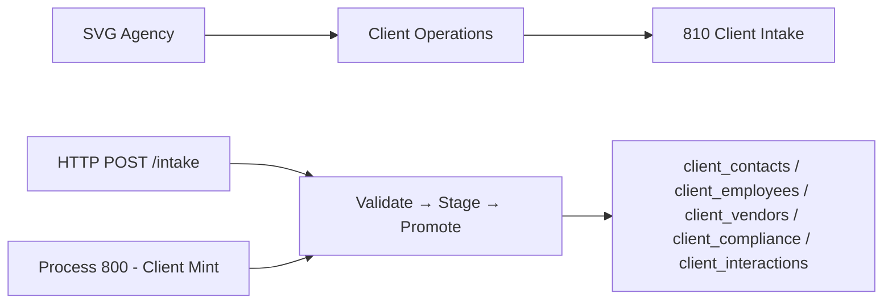
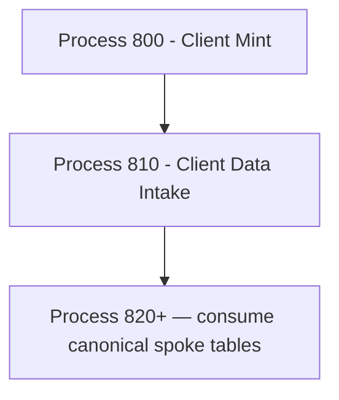

# Client Data Intake
## Receives client benefits data via HTTP, validates with Zod, stages to immutable D1 audit trail, promotes to canonical spoke tables. Single-tier D1 model; no Neon vault.
### Status: OPERATE
### Medium: process
### Business: svg-agency

## 📋 UT Checklist (Pre-Flight — per atlas/constants/UT_CHECKLIST.md v1.3.1)

| # | Check | Status | Location |
|---|-------|--------|----------|
| 1 | PRD — what / why / who / scope / out-of-scope / success metric | ☑ | §2 |
| 2 | OSAM — READ / WRITE / Process Composition / Join Chain / Forbidden / Query Routing filled | ☑ | §5 |
| 3 | Component Status — every dep 🟢 / 🟡 / 🔴 with 1-line state | ☑ | §3 |
| 4 | Owner — human who fixes this at 2 AM | ☑ | §1 |
| 5 | Live Dashboard — URL or explicit "N/A" | ☑ | §3 |
| 6 | Kill Switch — exact command to stop the process | ☑ | §8 |
| 7 | Logbook — last audit verdict + date (after certification only) | ☑ | §12 |
| 8 | FCEs Attached — which FCE runs structurally back this doc | ☑ | §3c — N/A predates FCE adoption |
| 9 | BARs Referenced — every BAR this doc touches, with status | ☑ | §3d |
| 10 | LBB Subjects Fed — which LBB subject(s) this doc's session logs go to | ☑ | §3e |
| 11 | Geometry — CTB position + Hub-Spoke role + Altitude | ☑ | §1b |
| 12 | Live Verification — every numeric count, cron, URL, command, BAR status grounded against the actual system | ☑ | §9b |
| 13 | ctb_node — declared path to this doc's position on the Barton Enterprises CTB trunk (e.g., `barton-enterprises/svg-agency/outreach/lcs-runbook`) | ☑ | §1 Identity |

## §1 IDENTITY {#sec-1-identity}

| Field | Value |
|-------|-------|
| ID | PROC-810 |
| Name | Client Data Intake |
| Medium | process |
| Business Silo | svg-agency |
| CTB Position | factory/client/810-client-intake |
| ORBT | OPERATE |
| Strikes | 0 |
| Authority | inherited — Barton-Processes/factory + imo-creator-v2 sovereign |
| Version | v3.0.1 |
| Last Modified | 2026-05-12 |
| BAR Reference | BAR-38, BAR-178, BAR-810-FLAT-SPOKE (2026-05-12) |
| Owner | Dave Barton |
| ctb_node | barton-enterprises/svg-agency/client/810-client-intake |

### 1b. Geometry {#sec-1b-geometry}

**CTB Position:** Barton Enterprises → SVG Agency → Client Operations → 810-client-intake (leaf)

**Hub-Spoke Role:** Middle (hub) — this process is the transformation engine. All client benefits data enters through this hub. Five canonical spoke tables receive promoted data. Rim = HTTP boundary (Zod validation in; response JSON out).

**Altitude:** 10k operational — single worker, 2-step transform pipeline (stage → promote), measurable at every boundary.



### HEIR (8 fields — Aviation Model, Bedrock §8)

| Field | Value |
|-------|-------|
| sovereign_ref | svg-outreach |
| hub_id | client-intake-810 |
| ctb_placement | leaf |
| imo_topology | middle |
| cc_layer | CC-04 |
| services | CF Worker (HTTP endpoint), svg-d1-client D1, svg-d1-census D1 (READ ONLY) |
| secrets_provider | doppler |
| acceptance_criteria | (1) Zod validates at boundary before any write; (2) Rejected data never enters staging; (3) client_staging_intake is INSERT-only immutable; (4) Promotion writes to correct spoke table; (5) Promotion failures write to spoke-specific error table with intake_id trace; (6) /vault returns 410 Gone — no Neon path; (7) Client must exist in clients table (Process 800 gate) |

## §2 PURPOSE {#sec-2-purpose}

### WHAT
Client Data Intake is the single entry gate for client benefits data (contacts, employees, vendors, compliance, interactions). Every payload enters via HTTP POST, passes Zod validation, is staged immutably in `client_staging_intake`, then promoted to the appropriate canonical spoke table. Single-tier D1 — no Neon vault.

### WHY
Without this process, no downstream process has canonical data to operate on. The flat spoke model eliminates the old normalized multi-table chain (intake_record → enrollment_intake → canonical). Two steps: stage then promote. Every record either lands in a canonical table or writes an error row with full audit traceability back to the staging row.

### WHO
- **Operators**: Submit JSON payloads with client benefits data via HTTP POST
- **Process 800 (Client Mint)**: Upstream gate — mints client record in clients table before any intake is accepted
- **Downstream consumers**: Read canonical spoke tables (contacts, employees, vendors, compliance, interactions)

### SCOPE (in)
- HTTP endpoint accepting JSON payloads — discriminated on `spoke` field (5 valid values)
- Zod boundary validation before any write
- Immutable staging in `client_staging_intake`
- Promotion to 5 canonical spoke tables
- CQRS error table writes for promotion failures
- GET /errors/:client_id — open errors across all spoke error tables

### OUT-OF-SCOPE
- Client creation (owned by Process 800 — client must pre-exist in clients table)
- Neon vault (removed; /vault returns 410 Gone)
- Authentication (no auth implemented; open by sovereign decision, scope deferred)
- Census master data ingestion (separate read-only census D1 binding, no writes)

### SUCCESS METRIC
100% of submitted payloads either promoted to a canonical spoke table or written to a spoke-specific error table — no records silently lost. `client_staging_intake` always holds the raw audit trail.

## §3 RESOURCES {#sec-3-resources}

Required doctrine references:
- `law/UNIFIED_TEMPLATE.md`
- `law/UT_CHECKLIST.md`
- `law/doctrine/PROCESS_FILL_INSTRUCTIONS.md`
- `law/doctrine/HOW_TO_BUILD_ANYTHING.md`
- `law/doctrine/BARTON_ENTERPRISES_WORLD_ATLAS.md`
- `law/doctrine/KEY.md`

### Component Status Grid

| Component | HEIR (`hub_id · ctb · cc_layer`) | ORBT | Light | State |
|-----------|----------------------------------|------|-------|-------|
| CF Worker (client-intake-810) | client-intake-810 · leaf · CC-04 | OPERATE | green | Deployed — https://client-intake-810.svg-outreach.workers.dev |
| D1 (svg-d1-client) | svg-d1-client · leaf · CC-04 | OPERATE | green | Live — id 5443887b-ba8a-4da5-9f54-6a9c2cfb1244; all spoke tables present |
| D1 (svg-d1-census — CENSUS_DB) | census · leaf · CC-04 | OPERATE | green | Bound and active — id c7b63950-ad08-426f-a07b-f30f1b9fc0bf; READ ONLY |
| Process 800 (Client Mint) | 800-client-mint · leaf · CC-04 | OPERATE | green | Upstream gate — clients table active |
| Neon PostgreSQL | N/A | N/A | N/A | REMOVED — single-tier D1 model; /vault → 410 Gone |

### Live Dashboard

| Resource | URL | What it shows |
|----------|-----|---------------|
| Worker endpoint | https://client-intake-810.svg-outreach.workers.dev | Live — verified 2026-05-12T23:07:04Z |
| Cloudflare dashboard | https://dash.cloudflare.com | Worker status, D1 row counts |

### Dependencies

| Dependency | Type | What It Provides | Status |
|-----------|------|-----------------|--------|
| Process 800 (Client Mint) | upstream process | client records in clients table | OPERATE |
| D1 svg-d1-client | database | staging + canonical spoke tables + error tables | OPERATE |
| D1 svg-d1-census (CENSUS_DB) | database (read-only) | census reference data | OPERATE |
| Auth mechanism | security | Bearer token or CF Access | NOT IMPLEMENTED — deferred by sovereign decision |

### Downstream Consumers

| Consumer | What It Needs |
|----------|--------------|
| Process 820+ | Canonical spoke table data (contacts, vendors, compliance) |

### Tools & Integrations

| Item | Type | Credentials | What It Does |
|------|------|-------------|-------------|
| Cloudflare D1 (svg-d1-client) | database | D1 binding in wrangler.toml | staging + 5 canonical spoke tables + 5 error tables |
| Zod | validation library | none | Discriminated union schema validation at boundary — 5 spoke schemas |
| Cloudflare Workers | compute | CF_FULL_API_TOKEN (Doppler) | REST endpoint runtime |

### Secrets

| Secret | Doppler Project | Config | Used By |
|--------|----------------|--------|---------|
| CF_FULL_API_TOKEN | imo-creator | dev | wrangler deploy |
| GLOBAL_CLOUDFLARE_ACCOUNT_ID | imo-creator | dev | wrangler deploy |

No runtime secrets currently in worker (no auth implemented, no Neon URL).

### 3c. FCEs Attached

| FCE Name | HEIR | ORBT | Status |
|----------|------|------|--------|
| TBV | TBV | TBV | TBV |

### 3d. BARs Referenced

| BAR | Title | ORBT | Status | Relation |
|-----|-------|------|--------|----------|
| BAR-38 | Client intake pipeline scaffold | BUILD | historical | initial build |
| BAR-178 | PROCESS.md written | BUILD | historical | doc creation |
| BAR-810-FLAT-SPOKE | Rewrite bp.810 to flat spoke model — OPERATE | OPERATE | CLOSED | this rewrite (2026-05-12) |

### 3e. LBB Subjects Fed

| LBB Subject | What This Doc Writes | Frequency |
|-------------|---------------------|-----------|
| svg-client-proc | Session summaries, promotion run outcomes, error patterns | per-run |
| svg-client | Canonical intake events, batch statistics | on-change |

## §4 IMO — Input, Middle, Output {#sec-4-imo}

### Two-Question Intake (Bedrock §3)
1. **What triggers this?** — HTTP POST to /intake from operator or external system
2. **How do we get it?** — JSON payload: `{ client_id, spoke, [spoke-specific fields] }`

### Input
JSON payload via `POST /intake`. Required fields: `client_id` (must exist in `clients` table, minted by Process 800) and `spoke` (discriminant — one of: `contact`, `employee`, `vendor`, `compliance`, `interaction`). The `client_id` is verified against D1 before any processing begins; invalid client_id → 404. Unknown `spoke` value → Zod 422.

### Middle

| Step | Input | What Happens | Output | Tool Used |
|------|-------|-------------|--------|-----------|
| 1 | HTTP POST body | Parse JSON, Zod discriminatedUnion validation on `spoke` field | Valid typed payload or 422 | Zod (validate.ts) |
| 2 | Validated payload | Verify client_id exists in `clients` table | Confirmed client or 404 | D1 SELECT (index.ts) |
| 3 | Confirmed payload | INSERT raw JSON into `client_staging_intake` (immutable) | intake_id (autoincrement) | D1 INSERT (stage.ts) |
| 4 | intake_id + spoke + client_id | Read raw_data from staging row; INSERT into canonical spoke table; mark processed=1 | Promoted row in spoke table; or write error + mark processed=1 | D1 INSERT + UPDATE (promote.ts) |

Both steps 3 and 4 execute in a single HTTP request. On promotion failure: error row written to spoke-specific `*_error` table; staging row marked processed=1 regardless.

### Output
- HTTP 201: `{ intake_id, spoke, client_id, status: 'promoted' }` — success
- HTTP 422: `{ intake_id, spoke, client_id, status: 'staged_with_error', error }` — staged but promotion failed
- HTTP 422: `{ error: 'Validation failed', issues: [...] }` — Zod rejected, nothing staged
- HTTP 404: `{ error: 'client_id not found' }` — pre-exist gate failed, nothing staged
- `client_staging_intake` always holds the immutable raw audit trail (even on promotion failure)

### Circle (Bedrock §5)
Error table review via `GET /errors/:client_id` closes the feedback loop — open errors indicate promotion failures requiring investigation. Corrected records re-submitted via POST /intake. The Circle: intake → client_staging_intake (immutable) → spoke table (canonical) → error table (if failed) → error reviewed → corrected re-intake.

## §5 DATA SCHEMA {#sec-5-data-schema}

### READ Access

| Source | What It Provides | Join Key |
|--------|-----------------|----------|
| `clients` | Client identity — must exist before any intake | `client_id` |
| `client_staging_intake` | Immutable audit trail — raw_data, processed flag | `intake_id`, `client_id` (in raw_data) |
| `client_contacts_error` | Open contact spoke errors | `client_id`, `status = 'open'` |
| `client_employees_error` | Open employee spoke errors | `client_id`, `status = 'open'` |
| `client_vendors_error` | Open vendor spoke errors | `client_id`, `status = 'open'` |
| `client_compliance_error` | Open compliance spoke errors | `client_id`, `status = 'open'` |
| `client_interactions_error` | Open interaction spoke errors | `client_id`, `status = 'open'` |

### WRITE Access

| Target | What It Writes | When |
|--------|---------------|------|
| `client_staging_intake` | Raw JSON payload — immutable INSERT; processed=1 stamped after promote | Step 3 (INSERT), Step 4 (UPDATE processed=1) |
| `client_contacts` | Canonical contact record — contact_id, client_id, full_name, email, role, etc. | Step 4 (contact spoke) |
| `client_employees` | Canonical employee record — employee_id, client_id, first_name, last_name, hire_date, etc. | Step 4 (employee spoke) |
| `client_vendors` | Canonical vendor record — vendor_id, client_id, vendor_name, vendor_type, group_number, etc. | Step 4 (vendor spoke) |
| `client_compliance` | Canonical compliance record — compliance_id, client_id, self_insured, erisa_applicable, fmla_state_rules (JSON), etc. | Step 4 (compliance spoke) |
| `client_interactions` | Canonical interaction record — interaction_id, client_id, contact_id, interaction_type, direction, occurred_at, etc. | Step 4 (interaction spoke) |
| `client_contacts_error` | Contact promotion failure — contact_error_id, client_id, source_entity, source_id (intake_id), error_code | Step 4 on contact failure |
| `client_employees_error` | Employee promotion failure — employee_error_id, client_id, source_entity, source_id, error_code | Step 4 on employee failure |
| `client_vendors_error` | Vendor promotion failure | Step 4 on vendor failure |
| `client_compliance_error` | Compliance promotion failure | Step 4 on compliance failure |
| `client_interactions_error` | Interaction promotion failure | Step 4 on interaction failure |

### Spoke Routing Table

| `spoke` value | Canonical Table | Error Table | PK Column | Required Fields |
|---------------|----------------|-------------|-----------|-----------------|
| `contact` | `client_contacts` | `client_contacts_error` | `contact_error_id` | `full_name`, `email` |
| `employee` | `client_employees` | `client_employees_error` | `employee_error_id` | `first_name`, `last_name` |
| `vendor` | `client_vendors` | `client_vendors_error` | `vendor_error_id` | `vendor_name` |
| `compliance` | `client_compliance` | `client_compliance_error` | `compliance_error_id` | none (all optional) |
| `interaction` | `client_interactions` | `client_interactions_error` | `interaction_error_id` | `interaction_type`, `direction`, `occurred_at` |

### Process Composition



| Process ID | Name | Role | ORBT |
|-----------|------|------|------|
| PROC-800 | Client Mint | upstream feeder — mints client record | OPERATE |
| PROC-810 | Client Data Intake | this process | OPERATE |

### Join Chain

```text
clients.client_id (universal spine — minted by Process 800)
  → client_staging_intake (raw_data JSON contains client_id — immutable audit trail)
  → client_contacts.client_id
  → client_employees.client_id
  → client_vendors.client_id
  → client_compliance.client_id
  → client_interactions.client_id → client_contacts.contact_id (optional FK)
  → *_error tables.client_id (all spoke error tables)
```

### Forbidden Paths

| Action | Why |
|--------|-----|
| Accept intake without client_id in clients table | Pre-exist gate — client must exist via Process 800 first |
| UPDATE or DELETE client_staging_intake rows | INSERT-only — immutable audit trail |
| Write to Neon | Removed. /vault → 410 Gone. No Neon path. |
| Skip Zod validation | Rejected data never enters staging |
| Direct INSERT to canonical tables bypassing client_staging_intake | Every canonical record must have a staging audit trail |
| Write to clients table | READ ONLY from bp.810 perspective — Process 800 owns it |
| Write to census D1 | READ ONLY — census is reference data only |

### Query Routing

| Question | Table | Column |
|----------|-------|--------|
| What records are pending promotion? | `client_staging_intake` | `processed = 0` |
| What are the open errors for a client? | `*_error` tables | `client_id + status = 'open'` |
| What contacts does a client have? | `client_contacts` | `client_id` |
| What employees does a client have? | `client_employees` | `client_id` |
| What vendors does a client have? | `client_vendors` | `client_id` |
| What is the compliance profile? | `client_compliance` | `client_id` |
| What interactions has a client had? | `client_interactions` | `client_id` |

## §6 DMJ — Define, Map, Join {#sec-6-dmj}

### 6a. DEFINE (Build the Key)

| Element | ID | Format | Description | C or V |
|---------|-----|--------|-------------|--------|
| 2-step pipeline | DMJ-810-01 | constant | Stage to client_staging_intake → Promote to canonical spoke table | C |
| client_id | DMJ-810-02 | UUID string | Universal join key; must exist in clients before intake | C |
| client_staging_intake | DMJ-810-03 | INSERT-only table | Immutable audit trail of every raw payload received | C |
| spoke discriminant | DMJ-810-04 | enum: 5 values | `spoke` field in payload routes to correct canonical + error table pair | C |
| Zod boundary gate | DMJ-810-05 | boolean per request | Payload passes Zod → staged; fails → 422, never staged | C |
| intake_id | DMJ-810-06 | autoincrement integer | PK of client_staging_intake; traces to error rows via source_id | V |
| processed flag | DMJ-810-07 | 0 or 1 | 0 = staged, not yet promoted; 1 = promoted (success or failure) | V |
| CQRS error table | DMJ-810-08 | per-spoke table | Each spoke has exactly one error table; errors always written, never suppressed | C |
| Neon path | DMJ-810-09 | REMOVED | /vault → 410 Gone; single-tier D1 model | C |

### 6b. MAP (Connect Key to Structure)

| Source | Target | Transform |
|--------|--------|-----------|
| HTTP POST body.client_id | `clients` table lookup | verify existence — 404 if not found |
| HTTP POST body.spoke | Zod discriminatedUnion + SPOKE_ERROR_TABLE map | classify → correct schema + canonical + error table |
| HTTP POST body (full) | `client_staging_intake.raw_data` | direct — immutable INSERT as JSON string |
| `client_staging_intake.raw_data` (via intake_id) | canonical spoke table | parse JSON → typed INSERT per spoke |
| Promotion failure | spoke `*_error` table | source_id = intake_id for full traceability |

### 6c. JOIN (Path to Spine)

| Join Path | Type | Description |
|-----------|------|-------------|
| clients → all tables | direct | client_id is present in every canonical spoke table |
| client_interactions → client_contacts | optional | contact_id FK when interaction references a known contact |
| *_error.source_id → client_staging_intake.intake_id | direct | full audit trail from error back to raw payload |

## §7 CONSTANTS & VARIABLES {#sec-7-constants-variables}

### Constants (structure — never changes)
- 2-step pipeline: Stage then Promote in one HTTP request
- `client_staging_intake` is INSERT-only, immutable audit trail — never UPDATE or DELETE (only processed flag stamped)
- Zod validates at boundary — rejected data never enters staging
- 5 spokes: contact, employee, vendor, compliance, interaction
- Each spoke has exactly one CANONICAL table + one ERROR table (CQRS)
- client_id is the universal join key across all spoke tables
- No Neon vault — single-tier D1 model — /vault → 410 Gone
- Error rows trace back to staging via `source_id` → `intake_id`
- Client must exist in `clients` table (Process 800 gate) before any intake is accepted

### Variables (fill — changes every run)
- Which client_id is submitting data
- Which spoke the payload targets
- Promotion success or failure per request
- Number of open errors per spoke per client

## §8 STOP CONDITIONS {#sec-8-stop-conditions}

| Condition | Action |
|-----------|--------|
| client_id not found in clients table | REJECT 404 — nothing staged, nothing promoted |
| `spoke` not in discriminated union | REJECT 422 — Zod validation failed, nothing staged |
| Zod validation failure | REJECT 422 — nothing staged |
| Promotion INSERT fails | Write to spoke error table; staging row still marked processed=1; return 422 with staged_with_error |
| Strike 3 on same failure pattern | Troubleshoot/Train → Airworthiness Directive |

### Kill Switch

```bash
# Disable via Cloudflare dashboard
# Workers & Pages → client-intake-810 → Settings → Disable

# Or via wrangler (removes all routes):
wrangler delete --name client-intake-810
```

## §9 VERIFICATION {#sec-9-verification}

```bash
# 1. Health check
curl https://client-intake-810.svg-outreach.workers.dev/health
# Expected: {"status":"ok","worker":"client-intake-810","ts":"<ISO-8601>"}

# 2. Vault endpoint returns 410 (not 404, not 200)
curl -X POST https://client-intake-810.svg-outreach.workers.dev/vault
# Expected: HTTP 410 — {"error":"Vault endpoint removed. Single-tier D1 model in use."}

# 3. Valid contact intake (requires a known client_id in clients table)
curl -X POST https://client-intake-810.svg-outreach.workers.dev/intake \
  -H "Content-Type: application/json" \
  -d '{"client_id":"<valid-client-id>","spoke":"contact","full_name":"Test Contact","email":"test@example.com"}'
# Expected: HTTP 201 — {"intake_id":N,"spoke":"contact","client_id":"...","status":"promoted"}

# 4. Unknown client_id → 404 (nothing staged)
curl -X POST https://client-intake-810.svg-outreach.workers.dev/intake \
  -H "Content-Type: application/json" \
  -d '{"client_id":"00000000-0000-0000-0000-000000000000","spoke":"contact","full_name":"X","email":"x@x.com"}'
# Expected: HTTP 404

# 5. Zod validation failure → 422 (nothing staged)
curl -X POST https://client-intake-810.svg-outreach.workers.dev/intake \
  -H "Content-Type: application/json" \
  -d '{"client_id":"<valid>","spoke":"contact","full_name":"missing email"}'
# Expected: HTTP 422 — validation failed, issues array

# 6. Error query (open errors for a client)
curl https://client-intake-810.svg-outreach.workers.dev/errors/<client_id>
# Expected: HTTP 200 — {"client_id":"...","errors":{...}} (empty or with open errors)

# 7. Staging audit trail (remote D1 — confirm immutable)
export CF_API_TOKEN=$(doppler secrets get CF_FULL_API_TOKEN --plain --project imo-creator --config dev)
npx wrangler d1 execute svg-d1-client --remote --command "SELECT COUNT(*) FROM client_staging_intake"
```

### Three Primitives Check (Bedrock §1)
1. **Thing** — Do all 5 canonical spoke tables and 5 error tables exist in svg-d1-client? Does the clients table have the client record?
2. **Flow** — Does data flow from HTTP POST → Zod → client_staging_intake → spoke table?
3. **Change** — Did Zod reject invalid `spoke` values? Did promotion write correct spoke columns? Did processed=1 stamp after promotion?

If any fails → Troubleshooting Loop (Bedrock §6). Do not patch. Do not guess.

## §9b Live Verification Log {#sec-9b-live-verification}

| Claim | Section | Source of Truth | Verification Command | [ ] | Last Check | Value |
|-------|---------|-----------------|----------------------|-----|-----------|-------|
| Worker health endpoint responds 200 | §3 Live Dashboard | CF Workers runtime | `curl .../health` | [x] | 2026-05-12T23:07:04Z | `{"status":"ok","worker":"client-intake-810","ts":"2026-05-12T23:07:04.766Z"}` |
| /vault returns 410 | §4 Output | CF Worker runtime | `curl -X POST .../vault` | [x] | 2026-05-12 | HTTP 410 confirmed |
| D1 binding svg-d1-client resolves | §3 Resources | wrangler.toml | wrangler deploy output | [x] | 2026-05-12 | database_id 5443887b-ba8a-4da5-9f54-6a9c2cfb1244 |
| D1 CENSUS_DB binding resolves | §3 Resources | wrangler.toml | wrangler deploy output | [x] | 2026-05-12 | database_id c7b63950-ad08-426f-a07b-f30f1b9fc0bf |
| Deployment version active | §3 | CF Workers dashboard | wrangler deploy output | [x] | 2026-05-12 | Version ID: af52f605-3261-4b4e-a95e-ccf564926876 |
| client_staging_intake table exists | §5 WRITE | D1 svg-d1-client | `SELECT COUNT(*) FROM client_staging_intake` | [ ] | TBV — pending first intake run | TBV |
| 5 canonical spoke tables exist | §5 WRITE | D1 svg-d1-client | `SELECT name FROM sqlite_master WHERE type='table' AND name LIKE 'client_%'` | [ ] | TBV | TBV |

## §10 Operations / Schedule {#sec-10-operations}

**Cron classification:** EVENT-DRIVEN
**Decision date:** 2026-05-12
**Schedule:** N/A — event-driven
**Implementation:** HTTP-triggered
**Trigger source:** Client onboarding — benefits data submission via HTTP POST /intake

---

## §10 ANALYTICS {#sec-10-analytics}

### 10a. Metrics

| Metric | Unit | Baseline | Target | Tolerance |
|--------|------|----------|--------|-----------|
| Intake requests processed | count | BASELINE | TBV | TBV |
| Staged rows in client_staging_intake | count | BASELINE | = intake requests | 0 missing |
| Promotion success rate | % | BASELINE | >95% steady state | TBV |
| Per-spoke: contact records | count | BASELINE | TBV | TBV |
| Per-spoke: employee records | count | BASELINE | TBV | TBV |
| Per-spoke: vendor records | count | BASELINE | TBV | TBV |
| Per-spoke: compliance records | count | BASELINE | TBV | TBV |
| Per-spoke: interaction records | count | BASELINE | TBV | TBV |
| Open error rows across 5 error tables | count | BASELINE | 0 target | alert if > 0 |

### 10b. Sigma Tracking

| Metric | Run 1 | Run 2 | Run 3 | Trend | Action |
|--------|-------|-------|-------|-------|--------|
| Promotion success rate | TBV | TBV | TBV | TBV — no runs yet | establish baseline |
| Staged vs promoted delta | TBV | TBV | TBV | TBV — no runs yet | establish baseline |

### 10c. ORBT Gate Rules

| From | To | Gate |
|------|-----|------|
| BUILD | OPERATE | flat spoke model deployed, /health 200, /vault 410, auditor sign-off |
| OPERATE | REPAIR | any metric outside tolerance or systematic promotion failures |
| REPAIR | OPERATE | fix + metric back within tolerance + auditor verification |
| Any (Strike 3) | TROUBLESHOOT_TRAIN | fleet-wide fix → Airworthiness Directive |

## §11 EXECUTION TRACE {#sec-11-execution-trace}

| Field | Format | Required |
|-------|--------|----------|
| trace_id | UUID | Yes |
| run_id | UUID | Yes |
| step | action name | Yes |
| target | measurable | Yes |
| actual | measurable | Yes |
| delta | the gap | Yes |
| status | done / failed / skipped | Yes |
| error_code | text or null | If failed |
| error_message | text or null | If failed |
| tools_used | JSON array | Yes |
| duration_ms | integer | Yes |
| timestamp | ISO-8601 | Yes |
| signed_by | agent or manual | Yes |

### Build Inputs Used

| Source | File | What Was Used |
|--------|------|--------------|
| Work order | BAR-810-FLAT-SPOKE (2026-05-12) | 12-task work order — rewrite to flat spoke model, OPERATE promotion |
| Code | src/index.ts | 4 routes: /health, /intake, /vault→410, /errors/:client_id |
| Code | src/validate.ts | Zod discriminatedUnion — 5 spoke schemas |
| Code | src/stage.ts | stageIntakeRaw() → client_staging_intake |
| Code | src/promote.ts | promoteFromStaging() → 5 canonical tables, 5 error tables |
| Code | src/vault.ts | No-op stub; VAULT_GONE = 410 |
| Config | wrangler.toml | D1: svg-d1-client (5443887b) + CENSUS_DB (c7b63950) |
| Deploy | wrangler deploy output 2026-05-12 | Version af52f605 active |

### Back-Propagation Check

| Parent Constant | Conflict Check | Result |
|-----------------|----------------|--------|
| client_staging_intake INSERT-only | Does any step UPDATE or DELETE staging rows? | clean — only processed=1 flag stamped; raw_data never touched |
| Zod boundary gate | Does any step write before Zod validates? | clean — Step 1 (Zod) precedes Step 3 (stage) |
| client_id universal key | Does any spoke table lack client_id? | clean — all 5 canonical tables have client_id NOT NULL |
| No Neon writes | Does any code path write to Neon? | clean — vault.ts is no-op stub; NEON_URL removed from env |

## §12 LOGBOOK {#sec-12-logbook}

### Birth Certificate

| Field | Value |
|-------|-------|
| heir_ref | client-intake-810 · leaf · CC-04 |
| orbt_entered | BUILD (2026-03-19) |
| orbt_exited | OPERATE (2026-05-12) |
| action | flat spoke model rewrite — deployed clean, /health 200, /vault 410 |
| gates_passed | wrangler deploy clean; /health verified; /vault 410 verified |
| signed_by | Sonnet Mechanic (BAR-810-FLAT-SPOKE 2026-05-12) |
| signed_at | 2026-05-12T23:07:04Z |

### Logbook (append-only)

| Date | Actor | Action | What Was Done | Evidence | LBB Record |
|------|-------|--------|---------------|----------|------------|
| 2026-05-12 | Sonnet Mechanic | `OPERATE` | Flat spoke model deployed. wrangler.toml: svg-d1-client (5443887b) + CENSUS_DB (c7b63950). src/ rewritten: validate.ts (5-spoke Zod discriminatedUnion), stage.ts (client_staging_intake), promote.ts (5 canonical + 5 error tables), vault.ts (no-op 410 stub), index.ts (4 routes). NEON_URL removed. /health 200. /vault 410. Version af52f605 deployed. | wrangler deploy 2026-05-12; curl /health → 23:07:04Z | pending |

## §13 FLEET FAILURE REGISTRY {#sec-13-fleet-failure-registry}

| Pattern ID | Location | Error Code | First Seen | Occurrences | Strike Count | Status |
|-----------|----------|-----------|-----------|-------------|-------------|--------|
| FP-810-01 | wrangler.toml | DEPLOY_BLOCKED | 2026-03-29 | 1 | 0 | CLOSED — svg-d1-client bound, id set 2026-05-12 |
| FP-810-02 | src/index.ts | AUTH_MISSING | 2026-03-29 | 1 | 0 | OPEN — no auth on any endpoint; deferred by sovereign decision |

## §14 SESSION LOG {#sec-14-session-log}

| Date | Version | Author | Action | Scope |
|------|---------|--------|--------|-------|
| 2026-03-19 | v0.1 | Sonnet Runner | `CREATE` | Initial scaffold — index.ts, validate.ts, stage.ts, promote.ts, vault.ts, D1 migration 001 created |
| 2026-03-29 | v1.0.0 | Sonnet Runner | `CREATE` | PROCESS.md written from template v2.0.0; known issues documented |
| 2026-04-29 | v2.0.0 | Sonnet Runner (Wave 1 UT Consolidation) | `CREATE` | UT v2.7.0 consolidation — PROCESS-UT.md written from CLAUDE.md + PROCESS.md + heir.yaml; DOCTRINE.md extracted; orbt.yaml created; fragments archived |
| 2026-05-06 | v2.1.0 | Sonnet Mechanic (BAR-810-CONFORM-WIRE) | `REPAIR` | BS Law Y-junction conformance; YAML frontmatter added; section headers converted to §N format; workflow.yaml restructured |
| 2026-05-08 | v2.1.1 | Sonnet Mechanic (BAR-MONDAY-16-FLEET-GREEN) | `MIGRATE` | §14 column format migrated to 5-column canonical shape |
| 2026-05-08 | v2.1.2 | Sonnet Mechanic (BAR-MONDAY-16-FLEET-GREEN) | `STAMP` | §10 Operations/Schedule stamped: EVENT-DRIVEN |
| 2026-05-08 | v2.1.3 | Sonnet Mechanic (BAR-MONDAY-16-FLEET-GREEN) | `AMEND` | services field added to outside.heir; §9b NOT YET DEPLOYED stamp added |
| 2026-05-10 | v2.1.4 | BAR-FLEET-OVERNIGHT WO-2 Sonnet Mechanic | `AUDIT_LOGBOOK` | Overnight 16-process readiness sweep; D1 binding empty flagged |
| 2026-05-10 | v2.1.5 | BAR-FLEET-OVERNIGHT Strike-1 repair Sonnet Mechanic | `AMEND` | §1 Identity Version row added for Codex G-VERSION-3-LOCATIONS gate |
| 2026-05-12 | v3.0.0 | Sonnet Mechanic (BAR-810-FLAT-SPOKE) | `REWRITE` | Full rewrite to flat spoke model. Discarded: normalized schema (intake_record, enrollment_intake, plan, plan_quote, person, election, vendor, external_identity_map, invoice, service_request), Neon vault, /vault write path. New: client_staging_intake + 5 canonical spoke tables + 5 error tables. wrangler.toml: svg-d1-client (5443887b). Zod discriminatedUnion on spoke field. Deployed Version af52f605. OPERATE state. |
| 2026-05-12 | v3.0.1 | Sonnet Mechanic (BAR-CLIENT-HUB conformance pass) | `CONFORM` | UT checklist block synced to atlas/constants/UT_CHECKLIST.md v1.3.1 — header path corrected, [x]/[ ] → ☑/☐, hyphens → em-dashes, item text canonical, item 8 FCEs → N/A predates FCE adoption. |

## Document Control

| Field | Value |
|-------|-------|
| Created | 2026-03-29 |
| Last Modified | 2026-05-12 |
| Version | v3.0.1 |
| Template Version | 2.8.0 |
| Medium | process |
| US Validated | pending |
| Governing Engine | law/doctrine/FOUNDATIONAL_BEDROCK.md + law/doctrine/DMJ.md |
