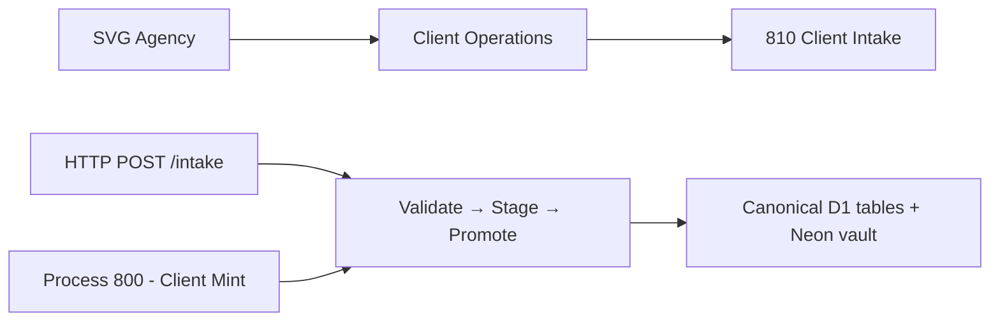
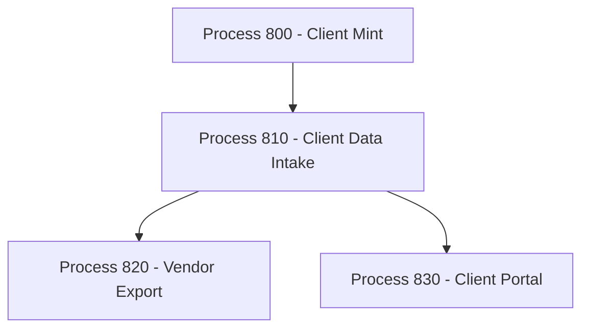

# Client Data Intake
## Receives client benefits data via HTTP, validates with Zod, stages to immutable D1 audit trail, promotes to canonical tables, and vaults to Neon
### Status: BUILD
### Medium: process
### Business: svg-agency

## UT Checklist (Pre-Flight - per law/UT_CHECKLIST.md v1.2.0)

| # | Check | Status | Location |
|---|-------|--------|----------|
| 1 | PRD - what / why / who / scope / out-of-scope / success metric | [x] | §2 |
| 2 | OSAM - READ / WRITE / Process Composition / Join Chain / Forbidden Paths / Query Routing filled | [x] | §5 |
| 3 | Component Status - every dep has green / yellow / red with 1-line state | [x] | §3 |
| 4 | Owner - human who fixes this at 2 AM | [ ] | §1 — TBV |
| 5 | Live Dashboard - URL or explicit "N/A" | [ ] | §3 — TBV (not deployed) |
| 6 | Kill Switch - exact command to stop the process | [x] | §8 |
| 7 | Logbook - last audit verdict + date (after certification only) | [x] | §12 — N/A during BUILD |
| 8 | FCEs Attached - which FCE runs structurally back this doc | [ ] | §3c — TBV |
| 9 | BARs Referenced - every BAR this doc touches, with status | [x] | §3d |
| 10 | LBB Subjects Fed - which LBB subject(s) this doc's session logs go to | [x] | §3e |
| 11 | Geometry - CTB position + Hub-Spoke role + Altitude | [x] | §1b |
| 12 | Live Verification - every numeric count, cron, URL, command, BAR status grounded against the live system | [ ] | §9b — TBV (pre-deployment) |
| 13 | ctb_node - declared path on the Barton Enterprises CTB trunk | [ ] | §1 — TBV |

## §1 IDENTITY {#sec-1-identity}

| Field | Value |
|-------|-------|
| ID | PROC-810 |
| Name | Client Data Intake |
| Medium | process |
| Business Silo | svg-agency |
| CTB Position | factory/client/810-client-intake |
| ORBT | BUILD |
| Strikes | 0 |
| Authority | inherited — Barton-Processes/factory + imo-creator-v2 sovereign |
| Last Modified | 2026-04-29 |
| BAR Reference | BAR-38, BAR-178 |
| Owner | TBV |
| ctb_node | TBV — barton-enterprises/svg-agency/client/810-client-intake |

### 1b. Geometry {#sec-1b-geometry}

**CTB Position:** Barton Enterprises → SVG Agency → Client Operations → 810-client-intake (leaf)

**Hub-Spoke Role:** Middle (hub) — this process is the transformation engine. All client benefits data enters through this hub; spokes are the 5 canonical table groups (S1 Hub, S2 Plan, S3 Employee, S4 Vendor, S5 Service). Rim = HTTP boundary (Zod validation in; response JSON out).

**Altitude:** 10k operational — single workflow, 5-step transform pipeline, measurable at every boundary.



### HEIR (8 fields - Aviation Model, Bedrock §8)

| Field | Value |
|-------|-------|
| sovereign_ref | imo-creator-v2 |
| hub_id | client-intake-810 |
| ctb_placement | leaf |
| imo_topology | middle |
| cc_layer | CC-04 |
| services | CF Worker (HTTP endpoint), Neon via Hyperdrive, D1 (staging + working tables) |
| secrets_provider | doppler |
| acceptance_criteria | (1) Zod validates all incoming data at boundary; (2) Rejected data never enters staging; (3) intake_record is INSERT-only immutable; (4) Promotion validates business rules before writing canonical; (5) Errors write to spoke-specific error tables in D1; (6) Same worker handles initial load and incremental updates; (7) Vault promotion pushes certified records to Neon clnt.* schema |

## §2 PURPOSE {#sec-2-purpose}

### WHAT
Client Data Intake is the single entry gate for all client benefits data into the SVG Agency system. Every plan, employee, election, vendor, invoice, and service request enters via HTTP POST, passes Zod validation, is staged immutably in D1, promoted to canonical working tables, and eventually vaulted to Neon for permanent storage.

### WHY
Without this process, no downstream process has canonical data to operate on. Process 820 (Vendor Export) cannot produce vendor reports without canonical vendor and invoice records. Process 830 (Client Portal) cannot display benefits data without canonical plan, person, and election records. This is the intake gate — if it fails, everything downstream starves.

### WHO
- **Operators**: Upload CSV files or trigger HTTP POSTs with client benefits data
- **Process 820 / 830**: Downstream consumers of canonical D1 data
- **Developers**: Read this doc to understand data flow, schema, and validation rules

### SCOPE (in)
- HTTP endpoint accepting structured JSON payloads per 8 known table types
- Zod boundary validation before any write
- Immutable intake_record audit staging
- Spoke-specific canonical promotion (5 spokes, 16 tables)
- CQRS error table writes for promotion failures
- Neon vault promotion via POST /vault

### OUT-OF-SCOPE
- Client creation (owned by Process 800 — client must pre-exist in D1 client table before intake)
- Vendor export logic (owned by Process 820)
- Client portal display (owned by Process 830)
- Census master data ingestion (separate migration path via 002_d1_census_master.sql)
- Authentication (BUILD BLOCKER — not yet implemented; see §8 Stop Conditions)

### SUCCESS METRIC
100% of submitted records either promoted to canonical D1 tables or written to a spoke-specific error table with source traceability back to intake_record — no records silently lost.

## §3 RESOURCES {#sec-3-resources}

Required doctrine references for every process UT:

- `law/UNIFIED_TEMPLATE.md`
- `law/UT_CHECKLIST.md`
- `law/doctrine/PROCESS_FILL_INSTRUCTIONS.md`
- `law/doctrine/HOW_TO_BUILD_ANYTHING.md` (repair manual)
- `law/doctrine/BARTON_ENTERPRISES_WORLD_ATLAS.md` (Atlas System bundle)
- `law/doctrine/KEY.md`

### Component Status Grid

| Component | HEIR (`hub_id · ctb · cc_layer`) | ORBT | Light | State |
|-----------|----------------------------------|------|-------|-------|
| CF Worker (client-intake-810) | client-intake-810 · leaf · CC-04 | BUILD | yellow | Scaffolded, not deployed — D1 database_id empty |
| D1 (client-intake-810) | TBV | BUILD | red | Not created — `wrangler d1 create` required |
| D1 (census — CENSUS_DB) | TBV | OPERATE | green | Bound and active (c7b63950-ad08-426f-a07b-f30f1b9fc0bf) |
| Neon PostgreSQL (clnt.*) | TBV | BUILD | yellow | NEON_URL not set in Doppler for this worker |
| Process 800 (Client Mint) | TBV | BUILD | red | Upstream gate — must be OPERATE before 810 accepts intake |

### Live Dashboard

| Resource | URL | What it shows |
|----------|-----|---------------|
| Worker endpoint | https://client-intake-810.svg-outreach.workers.dev | TBV — not deployed |
| D1 dashboard | Cloudflare dashboard (TBV) | All 16 table row counts once deployed |

### Dependencies

| Dependency | Type | What It Provides | Status |
|-----------|------|-----------------|--------|
| Process 800 (Client Mint) | upstream process | client records in D1 client table | PENDING |
| D1 database (client-intake-810) | database | staging + canonical working tables | PENDING — not created |
| NEON_URL | secret | vault promotion connection string | PENDING — not set |
| Auth mechanism | security | Bearer token or CF Access | PENDING — BUILD BLOCKER |

### Downstream Consumers

| Consumer | What It Needs |
|----------|--------------|
| Process 820 (Vendor Export) | Canonical vendor, invoice, external_identity_map records in D1 |
| Process 830 (Client Portal) | Canonical plan, person, election records in D1 |

### Tools & Integrations

| Item | Type | Cost Tier | Credentials | What It Does |
|------|------|-----------|-------------|-------------|
| Cloudflare D1 | database | Free | D1 binding in wrangler.toml | All 16 working tables — staging, canonical, error |
| Hono (CF Worker) | API framework | Free | none | REST endpoint routing — 5 routes |
| Zod | validation library | Free | none | Schema validation at boundary — 8 schemas for 8 table types |
| @neondatabase/serverless | vault driver | Free | NEON_URL via Doppler | Vault promotion — canonical D1 rows to Neon clnt.* |

### Secrets

| Secret | Doppler Project | Config | Used By |
|--------|----------------|--------|---------|
| NEON_URL | imo-creator | dev | vault.ts — Neon serverless driver for vault promotion |

### 3c. FCEs Attached

| FCE Name | HEIR (`hub_id · ctb · cc_layer`) | ORBT | Run Directory | Latest P=1 | Rows | Status |
|----------|----------------------------------|------|--------------|------------|------|--------|
| TBV | TBV | TBV | TBV | pending | TBV | TBV |

### 3d. BARs Referenced

| BAR | Title | HEIR (`bar-id · ctb · cc_layer`) | ORBT | Status | Relation |
|-----|-------|----------------------------------|------|--------|----------|
| BAR-38 | Client intake pipeline scaffold | TBV | BUILD | TBV | implements |
| BAR-178 | PROCESS.md written | TBV | BUILD | TBV | tracks |

### 3e. LBB Subjects Fed

| LBB Subject | HEIR (`subject-id · ctb · cc_layer`) | ORBT | What This Doc Writes | Frequency |
|-------------|--------------------------------------|------|---------------------|-----------|
| svg-client-proc | TBV | BUILD | Session summaries, promotion run outcomes, error patterns | per-run |
| svg-client | TBV | BUILD | Canonical intake events, batch statistics | on-change |

## §4 IMO - Input, Middle, Output {#sec-4-imo}

### Two-Question Intake (Bedrock §3)
1. **What triggers this?** — HTTP POST to /intake from operator upload or external system
2. **How do we get it?** — JSON payload: `{ client_id, table, data[] }`

### Input
JSON payload via `POST /intake`. Required fields: `client_id` (must exist in D1 client table, minted by Process 800), `table` (spoke routing key — one of 8 valid table names), `data[]` (array of records). The client_id is verified against D1 before any processing begins; invalid client_id returns 404.

### Middle

| Step | Input | What Happens | Output | Tool Used |
|------|-------|-------------|--------|-----------|
| 1 | HTTP POST body | Parse JSON, verify client_id exists in D1 `client` table | Verified payload or 404 | D1 SELECT |
| 2 | `{ table, data[] }` | Zod schema validation per table type — rejects malformed data at boundary | `{ valid[], errors[] }` | Zod (validate.ts) |
| 3 | valid records | INSERT into `intake_record` (immutable) + create `enrollment_intake` batch header | batch_id, staged count | D1 INSERT (stage.ts) |
| 4 | intake_record rows for batch | Parse raw_payload, INSERT into canonical table per spoke, mark intake_record.promoted_at | promoted count, errors | D1 INSERT + UPDATE (promote.ts) |
| 5 | Promotion errors (if any) | Write to spoke-specific error table with error_code + source_id → intake_record_id | Error record with full traceability | D1 INSERT |

All five steps execute in a single HTTP request — Validate, Stage, Promote in one pass.

### Output
- HTTP 201: `{ validated, validation_errors, batch_id, promoted, promote_errors }`
- HTTP 422: All records failed validation (zero promoted, nothing staged)
- HTTP 404: client_id not found in D1 client table
- Canonical D1 tables populated with `vaulted_at = NULL` (pending vault promotion)
- intake_record contains immutable audit trail of every record received

### Circle (Bedrock §5)
Vault promotion (`POST /vault`) pushes certified D1 canonical records to Neon `clnt.*` schema and stamps `vaulted_at` on D1 rows. Error table review via `GET /errors/:client_id` closes the feedback loop — unresolved errors block downstream processes from seeing clean data. The Circle: intake → canonical D1 → vault (Neon) → errors reviewed → corrected records re-submitted via intake.

## §5 DATA SCHEMA {#sec-5-data-schema}

### READ Access

| Source | What It Provides | Join Key |
|--------|-----------------|----------|
| `client` | Client identity — must exist before any intake is accepted | `client_id` |
| `intake_record` | Immutable audit trail — raw_payload, promoted_at | `enrollment_intake_id`, `client_id` |
| `enrollment_intake` | Batch header — status tracking (pending → staged → completed) | `enrollment_intake_id` |
| All canonical tables (plan, person, election, vendor, etc.) | Unvaulted records pending vault promotion | `vaulted_at IS NULL` |
| All error tables (*_error) | Open errors per client per spoke for error review | `client_id`, `status = 'open'` |

### WRITE Access

| Target | What It Writes | When |
|--------|---------------|------|
| `enrollment_intake` | Batch header (pending → staged → completed status) | Step 3, Step 4 |
| `intake_record` | Immutable raw payload + promoted_at timestamp | Step 3 (INSERT), Step 4 (UPDATE promoted_at) |
| `plan`, `plan_quote` | Canonical plan records | Step 4 (S2 promote) |
| `person`, `election` | Canonical employee records | Step 4 (S3 promote) |
| `vendor`, `external_identity_map`, `invoice` | Canonical vendor records | Step 4 (S4 promote) |
| `service_request` | Canonical service records | Step 4 (S5 promote) |
| `plan_error`, `employee_error`, `vendor_error`, `service_error`, `client_error` | Promotion failures with error_code + source traceability | Step 5 |
| Neon `clnt.*` tables | Vault copies of canonical records — ON CONFLICT DO NOTHING | POST /vault |

### Process Composition



| Process ID | Name | Role in Composition | Status |
|-----------|------|---------------------|--------|
| PROC-800 | Client Mint | upstream feeder — mints client record in D1 | BUILD |
| PROC-810 | Client Data Intake | this process | BUILD |
| PROC-820 | Vendor Export | downstream consumer — canonical vendor/invoice data | BUILD |
| PROC-830 | Client Portal | downstream consumer — canonical plan/person/election data | BUILD |

### Join Chain

```text
client.client_id (S1 Hub — universal spine)
  → enrollment_intake.client_id  (batch headers, N per client)
    → intake_record.enrollment_intake_id  (immutable audit trail, M per batch)
  → plan.client_id  (S2 canonical)
    → plan_quote.client_id  (S2 quotes, belongs to client not plan)
  → person.client_id  (S3 canonical)
    → election.person_id → person.person_id  (S3 person↔election)
    → election.plan_id → plan.plan_id  (S3 election↔plan)
  → vendor.client_id  (S4 canonical)
    → external_identity_map.vendor_id → vendor.vendor_id  (S4 identity mapping)
    → invoice.vendor_id → vendor.vendor_id  (S4 billing)
  → service_request.client_id  (S5 canonical)
```

### Forbidden Paths

| Action | Why |
|--------|-----|
| Accept intake without client_id in D1 client table | Client must exist via Process 800 first — D-810-08 |
| UPDATE or DELETE intake_record | INSERT-only — immutable audit trail — D-810-03 |
| Write to Neon outside /vault endpoint | Vault promotion is the only Neon write path — D-810-07 |
| Skip Zod validation | Rejected data never enters staging — D-810-01, D-810-02 |
| Direct INSERT to canonical tables bypassing intake_record | Every canonical record must have an audit trail — D-810-03 |

### Query Routing

| Question | Table | Column |
|----------|-------|--------|
| What records are pending promotion? | `intake_record` | `promoted_at IS NULL` |
| What batches are in progress? | `enrollment_intake` | `status` |
| How many open errors for a client? | `*_error` tables | `client_id + status = 'open'` |
| What records haven't been vaulted? | canonical tables | `vaulted_at IS NULL` |
| What plans does a client have? | `plan` | `client_id` |
| Who is enrolled in a plan? | `election` | `plan_id` + JOIN `person` |
| What is a person's election + plan? | `election` | `person_id` JOIN `plan` via `plan_id` |
| What invoices does a vendor have? | `invoice` | `vendor_id` |

## §6 DMJ - Define, Map, Join {#sec-6-dmj}

### 6a. DEFINE (Build the Key)

| Element | ID | Format | Description | C or V |
|---------|-----|--------|-------------|--------|
| 4-stage pipeline | DMJ-810-01 | constant | Validate → Stage (D1) → Promote (canonical) → Vault (Neon) | C |
| client_id | DMJ-810-02 | UUID string | Universal join key across all 16 tables; presence in client table required | C |
| intake_record | DMJ-810-03 | INSERT-only table | Immutable audit trail of every record received; never updated or deleted | C |
| spoke routing key | DMJ-810-04 | enum: 8 values | table field in payload; determines which canonical + error table pair receives data | C |
| Zod boundary gate | DMJ-810-05 | boolean per record | Records pass Zod → staged; records fail Zod → validation_errors, never staged | C |
| batch_id | DMJ-810-06 | UUID | enrollment_intake_id; groups all records in one HTTP request | V |
| promoted count | DMJ-810-07 | integer | Number of records successfully written to canonical tables in a batch | V |
| vaulted_at | DMJ-810-08 | timestamp or NULL | NULL = pending vault; set on canonical rows after POST /vault succeeds | V |
| Neon vault path | DMJ-810-09 | constant | Neon clnt.* schema; ON CONFLICT DO NOTHING; only path from D1 to Neon | C |
| CQRS error table | DMJ-810-10 | per-spoke table | Each spoke has exactly one error table; errors never suppress — always written | C |

### 6b. MAP (Connect Key to Structure)

| Source | Target | Transform |
|--------|--------|-----------|
| HTTP POST body.client_id | D1 client table lookup | direct — verify existence before any write |
| HTTP POST body.table | SPOKE_SCHEMAS map | classify — routes to correct Zod schema + canonical + error table |
| HTTP POST body.data[] | Zod schema per table | parse — each record validated independently |
| Valid records | intake_record.raw_payload | direct — immutable INSERT |
| intake_record batch | canonical table per spoke | parse raw_payload → typed INSERT |
| Promotion failure | spoke_error table.source_id | direct — source_id = intake_record_id for traceability |
| Canonical D1 rows (vaulted_at IS NULL) | Neon clnt.* | direct — ON CONFLICT DO NOTHING |

### 6c. JOIN (Path to Spine)

| Join Path | Type | Description |
|-----------|------|-------------|
| client → all tables | direct | client_id is present in every table; client is the universal spine |
| election → person | direct | election.person_id = person.person_id; person must exist first |
| election → plan | direct | election.plan_id = plan.plan_id; plan must exist first |
| external_identity_map → vendor | direct | external_identity_map.vendor_id = vendor.vendor_id |
| invoice → vendor | direct | invoice.vendor_id = vendor.vendor_id |
| intake_record → enrollment_intake | direct | intake_record.enrollment_intake_id = enrollment_intake.enrollment_intake_id |
| canonical tables → Neon clnt.* | direct | vault promotion copies row; join key = same PK (plan_id, person_id, etc.) |

## §7 CONSTANTS & VARIABLES {#sec-7-constants-variables}

### Constants (structure — never changes)
- Single-pass pipeline: Validate → Stage → Promote in one HTTP request (D-810-04)
- intake_record is INSERT-only, immutable audit trail — never UPDATE or DELETE except stamping promoted_at (D-810-03)
- Zod validates at boundary — rejected data never enters staging (D-810-01, D-810-02)
- 5 spokes: S1 Hub (client), S2 Plan, S3 Employee, S4 Vendor, S5 Service
- 8 table types route through `table` field in payload — any unknown value → 422 reject all
- Each spoke has exactly one CANONICAL table group + one ERROR table (CQRS) (D-810-05)
- All canonical tables have `vaulted_at` column — NULL = pending, timestamp = vaulted
- client_id is the universal join key across all 16 tables
- Vault writes to Neon `clnt.*` schema with ON CONFLICT DO NOTHING — idempotent (D-810-07)
- Error tables trace back to source via `source_id` → `intake_record_id`
- Client must exist in D1 client table (minted by Process 800) before any intake is accepted (D-810-08)
- Census master (136 columns, 3 sharded tables) is read-only from intake perspective — separate ingestion path

### Variables (fill — changes every run)
- Which client_id is submitting data
- Which table type the payload targets
- Number of records in the data[] array
- Validation pass/fail ratio per batch
- Promotion error count per batch
- Number of unvaulted records awaiting vault promotion at any given time

## §8 STOP CONDITIONS {#sec-8-stop-conditions}

| Condition | Action |
|-----------|--------|
| client_id not found in D1 client table | REJECT 404 — client must exist via Process 800 (D-810-08) |
| table field not in SPOKE_SCHEMAS map | REJECT 422 — unknown table type, all records fail validation |
| 100% validation failure on a batch | RETURN 422 — nothing staged, nothing promoted |
| D1 database_id empty in wrangler.toml | HALT — cannot deploy; run `wrangler d1 create client-intake-810` first (D-810-09) |
| NEON_URL secret not set in Doppler | HALT — vault promotion will fail at first attempt |
| No auth on any endpoint | BUILD BLOCKER — must implement Bearer token or CF Access before OPERATE state (D-810-10) |
| Promotion errors exceed 50% of batch | LOG WARNING — investigate data quality; do not halt |
| Strike 3 on same failure pattern | Troubleshoot/Train → produce Airworthiness Directive for fleet |

### Kill Switch

```text
wrangler deployments list --name client-intake-810
# Then disable via Cloudflare dashboard -> Workers -> client-intake-810 -> Disable
# Or: remove the worker route binding to stop receiving traffic
```

## §9 VERIFICATION {#sec-9-verification}

```text
1. GET /health → expected: { process: 'PROC-CLIENT-DATA-INTAKE', number: 810, status: 'ok' }
2. POST /intake { client_id: '<valid>', table: 'plan', data: [{ benefit_type: 'medical' }] } → expected: 201, validated=1, promoted=1
3. POST /intake { client_id: '<invalid-uuid>', table: 'plan', data: [{}] } → expected: 404
4. POST /intake { client_id: '<valid>', table: 'plan', data: [{}] } → expected: 422 (benefit_type required — Zod rejects)
5. GET /status → expected: intake_records.staged=0 (all promoted), intake_records.promoted>0
6. GET /errors/<client_id> → expected: { open_errors: { client_error: 0, plan_error: 0, employee_error: 0, vendor_error: 0, service_error: 0 } }
7. POST /vault → expected: { tables: { plan: N, person: N, ... }, errors: 0 }
8. SELECT COUNT(*) FROM intake_record → expected: >0 (immutable, never deleted)
9. SELECT COUNT(*) FROM plan WHERE vaulted_at IS NOT NULL → expected: matches vault response count
```

### Three Primitives Check (Bedrock §1)
1. **Thing** — Do all 16 D1 tables exist? Does the client record exist in D1 client table (minted by Process 800)?
2. **Flow** — Does data flow from HTTP POST → Zod validate → intake_record → canonical table → Neon vault?
3. **Change** — Did Zod reject invalid data (validation_errors > 0 for bad input)? Did promotion write correct columns? Did vault stamp vaulted_at on D1 rows?

If any fails → that's the break. Run the Troubleshooting Loop (Bedrock §6). Do not patch. Do not guess.

## §9b Live Verification Log {#sec-9b-live-verification}

| Claim | Section | Source of Truth | Verification Command | [ ] | Last Check | Value |
|-------|---------|-----------------|----------------------|-----|-----------|-------|
| intake_record row count > 0 after first batch | §5 WRITE | D1 intake_record table | `SELECT COUNT(*) FROM intake_record` | [ ] | TBV (pre-deployment) | TBV |
| Validation pass rate ≥ 1 for valid payload | §4 Middle Step 2 | /intake response body | `POST /intake valid_payload → check validated field` | [ ] | TBV | TBV |
| Staging row count matches intake input | §4 Middle Step 3 | D1 enrollment_intake | `SELECT COUNT(*) FROM enrollment_intake` | [ ] | TBV | TBV |
| Promotion count ≤ staged count | §4 Middle Step 4 | /intake response body | `POST /intake → check promoted field` | [ ] | TBV | TBV |
| Vault sync status: vaulted_at stamped | §5 WRITE | D1 canonical table | `SELECT COUNT(*) FROM plan WHERE vaulted_at IS NOT NULL` | [ ] | TBV | TBV |
| D1 CENSUS_DB binding resolves | §3 Resources | wrangler.toml | `wrangler d1 info census` (database_id c7b63950) | [ ] | TBV | TBV |
| Worker health endpoint responds | §8 Kill Switch | CF Workers dashboard | `curl https://client-intake-810.svg-outreach.workers.dev/health` | [ ] | TBV (not deployed) | TBV |

Rule: at least one live gauge row must be checked before BUILD can move to OPERATE.

## §10 ANALYTICS {#sec-10-analytics}

### 10a. Metrics

| Metric | Unit | Baseline | Target | Tolerance |
|--------|------|----------|--------|-----------|
| Intake batches processed | count | BASELINE | TBV | TBV |
| Records validated (pass) | count | BASELINE | TBV | TBV |
| Validation rejection rate | % | BASELINE | <5% steady state | TBV |
| Records promoted | count | BASELINE | = validated | TBV |
| Records vaulted | count | BASELINE | = promoted | TBV |
| Per-spoke: plan records | count | BASELINE | TBV | TBV |
| Per-spoke: person records | count | BASELINE | TBV | TBV |
| Per-spoke: election records | count | BASELINE | TBV | TBV |
| Per-spoke: vendor records | count | BASELINE | TBV | TBV |
| Per-spoke: service_request records | count | BASELINE | TBV | TBV |

### 10b. Sigma Tracking

| Metric | Run 1 | Run 2 | Run 3 | Trend | Action |
|--------|-------|-------|-------|-------|--------|
| Validation rejection rate | TBV | TBV | TBV | TBV — no runs yet | establish baseline |
| Promotion success rate | TBV | TBV | TBV | TBV — no runs yet | establish baseline |
| Vault latency | TBV | TBV | TBV | TBV — no runs yet | establish baseline |

### 10c. ORBT Gate Rules

| From | To | Gate |
|------|-----|------|
| BUILD | OPERATE | all metrics within tolerance for 3 runs + auth implemented + D1 database_id set + auditor sign-off |
| OPERATE | REPAIR | any metric outside tolerance |
| REPAIR | OPERATE | fix + metric back within tolerance + auditor verification |
| Any (Strike 3) | TROUBLESHOOT_TRAIN | fleet-wide fix → Airworthiness Directive |

## §11 EXECUTION TRACE {#sec-11-execution-trace}

| Field | Format | Required |
|-------|--------|----------|
| trace_id | UUID | Yes |
| run_id | UUID | Yes |
| step | action name | Yes |
| target | measurable | Yes |
| actual | measurable | Yes |
| delta | the gap | Yes |
| status | done / failed / skipped | Yes |
| error_code | text or null | If failed |
| error_message | text or null | If failed |
| tools_used | JSON array | Yes |
| duration_ms | integer | Yes |
| cost_cents | integer | Yes |
| timestamp | ISO-8601 | Yes |
| signed_by | agent or manual | Yes |

### Build Inputs Used

| Source | File | What Was Used |
|--------|------|--------------|
| Fragment | CLAUDE.md | API endpoints, spoke routing table, 16-table inventory, known issues |
| Fragment | PROCESS.md | §1 Identity, §3 IMO, §5 OSAM (READ/WRITE/Join Chain/Forbidden/Query Routing), §6 C&V, §7 Stop Conditions, §8 Dependencies, §9 Smoke Test, §10 Analytics, §12-13 Known Issues + Session Log |
| Fragment | heir.yaml | All 8 HEIR fields (sovereign_ref, ctb_placement, cc_layer, imo_topology, services, secrets_provider, acceptance_criteria) + hub_id derived from wrangler.toml name |
| Fragment | wrangler.toml | D1 bindings (client-intake-810 + census), name, main, compatibility_date |
| Fragment | src/migrations/001_d1_intake_tables.sql | 16-table schema verification |
| Fragment | src/migrations/002_d1_census_master.sql | Census master structure (136 columns, 3 tables, 4 views) |
| Fragment | migrations/ctb_gap_tables.sql | CTB gap tables (9 HIGH + 6 MEDIUM + 6 CQRS gaps + column additions) |
| Dispatch | STAGE-1-CODEX-MECHANIC-OUTPUT.md §5 | Packet 13 required gauges, UT roll-up column |

### Back-Propagation Check

| Parent Constant | Conflict Check | Result |
|-----------------|----------------|--------|
| intake_record INSERT-only (D-810-03) | Does any other constant require UPDATE or DELETE on intake_record? | clean — only promoted_at timestamp is stamped, which is additive |
| Zod boundary gate (D-810-01) | Does any step write before Zod validates? | clean — Step 2 always precedes Step 3 |
| client_id universal key | Does any table lack client_id? | clean — all 16 tables have client_id; intake_record traces to enrollment_intake which has client_id |
| Single-pass pipeline (D-810-04) | Does vault (POST /vault) violate single-pass? | clean — vault is a separate endpoint by design; single-pass refers to intake path only |

## §12 LOGBOOK (After Certification Only) {#sec-12-logbook}

No logbook during BUILD.

### Birth Certificate

| Field | Value |
|-------|-------|
| heir_ref | TBV — pending certification |
| orbt_entered | BUILD |
| orbt_exited | TBV — pending OPERATE gate |
| action | TBV — pending auditor sign-off |
| gates_passed | TBV |
| signed_by | TBV |
| signed_at | TBV |

### Logbook (append-only)

| Date | Actor | Action | What Was Done | Evidence | LBB Record |
|------|-------|--------|---------------|----------|------------|
| — | — | — | No entries — BUILD state | — | — |

## §13 FLEET FAILURE REGISTRY {#sec-13-fleet-failure-registry}

| Pattern ID | Location | Error Code | First Seen | Occurrences | Strike Count | Status |
|-----------|----------|-----------|-----------|-------------|-------------|--------|
| FP-810-01 | wrangler.toml | DEPLOY_BLOCKED | 2026-03-29 | 1 | 0 | OPEN — D1 database_id empty; `wrangler d1 create client-intake-810` not run |
| FP-810-02 | src/index.ts (all routes) | AUTH_MISSING | 2026-03-29 | 1 | 0 | OPEN — No auth on any endpoint; BUILD BLOCKER before OPERATE |

## §14 SESSION LOG {#sec-14-session-log}

| Date | What Was Done | LBB Record |
|------|---------------|-----------|
| 2026-03-19 | Initial scaffold — index.ts, validate.ts, stage.ts, promote.ts, vault.ts, D1 migration 001 created | none |
| 2026-03-29 | PROCESS.md written from template v2.0.0; known issues documented | none |
| 2026-04-29 | UT v2.7.0 consolidation — PROCESS-UT.md written from CLAUDE.md + PROCESS.md + heir.yaml; DOCTRINE.md extracted; orbt.yaml created; fragments archived | pending |
| 2026-05-06 | BAR-810-CONFORM-WIRE — BS Law Y-junction conformance; YAML frontmatter added; section headers converted to §N format; workflow.yaml restructured to outside/inside top-level arms | pending |

## Document Control

| Field | Value |
|-------|-------|
| Created | 2026-03-29 |
| Last Modified | 2026-05-06 |
| Version | 2.1.0 |
| Template Version | 2.8.0 |
| Medium | process |
| US Validated | pending |
| Governing Engine | law/doctrine/FOUNDATIONAL_BEDROCK.md + law/doctrine/DMJ.md |
