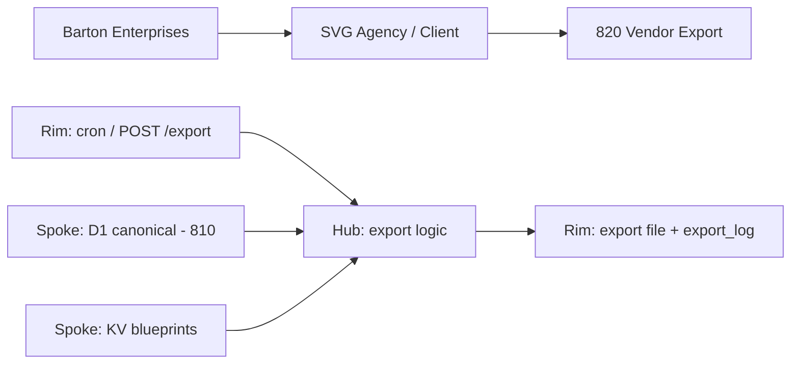
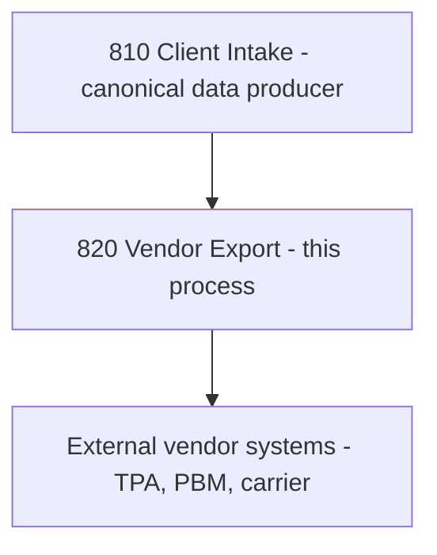

# Vendor Export
## Reads canonical client data from D1 (`svg-d1-client`, flat-spoke schema), applies per-vendor blueprint mappings from EGRESS_KV, and generates formatted export files (CSV/JSON) for insurance vendors (TPAs, PBMs, carriers) on a daily/weekly cron schedule.
### Status: OPERATE
### Medium: process
### Business: svg-agency

## UT Checklist (Pre-Flight - per law/UT_CHECKLIST.md v1.2.0)

| # | Check | Status | Location |
|---|-------|--------|----------|
| 1 | PRD - what / why / who / scope / out-of-scope / success metric | [x] | §2 |
| 2 | OSAM - READ / WRITE / Process Composition / Join Chain / Forbidden Paths / Query Routing filled | [x] | §5 |
| 3 | Component Status - every dep has green / yellow / red with 1-line state | [x] | §3 |
| 4 | Owner - human who fixes this at 2 AM | [x] | §1 |
| 5 | Live Dashboard - URL or explicit "N/A" | [x] | §3 |
| 6 | Kill Switch - exact command to stop the process | [x] | §8 |
| 7 | Logbook - last audit verdict + date (after certification only) | [x] | §12 |
| 8 | FCEs Attached - which FCE runs structurally back this doc | [x] | §3c |
| 9 | BARs Referenced - every BAR this doc touches, with status | [x] | §3d |
| 10 | LBB Subjects Fed - which LBB subject(s) this doc's session logs go to | [x] | §3e |
| 11 | Geometry - CTB position + Hub-Spoke role + Altitude | [x] | §1b |
| 12 | Live Verification - every numeric count, cron, URL, command, BAR status grounded against the live system | [x] | §9b |
| 13 | ctb_node - declared path on the Barton Enterprises CTB trunk | [x] | §1 Identity |

## §1 IDENTITY {#sec-1-identity}

| Field | Value |
|-------|-------|
| ID | PROC-820 |
| Name | Vendor Export |
| Medium | process |
| Business Silo | svg-agency |
| CTB Position | barton-enterprises → svg-agency → client → vendor-export |
| ORBT | OPERATE |
| Strikes | 0 |
| Authority | inherited - imo-creator-v2 sovereign + Barton-Processes parent |
| Version | v1.1.1 |
| Last Modified | 2026-05-12 |
| BAR Reference | BAR-38, BAR-178, BAR-377, BAR-bp820 |
| Owner | Dave Barton |
| ctb_node | barton-enterprises/svg-agency/client/820-vendor-export |

### 1b. Geometry {#sec-1b-geometry}

**CTB Position:** barton-enterprises → svg-agency → client → 820-vendor-export (leaf)

**Hub-Spoke Role:** Hub — all export logic lives here; D1 canonical tables and KV are spokes (dumb data transport); HTTP endpoints and cron are rim (I/O boundary only).

**Altitude:** 5k execution — generates per-vendor per-client export files on a fixed schedule.



### HEIR (8 fields - Aviation Model, Bedrock §8)

| Field | Value |
|-------|-------|
| sovereign_ref | imo-creator-v2 |
| hub_id | vendor-export-820 |
| ctb_placement | leaf |
| imo_topology | egress |
| cc_layer | CC-04 |
| services | CF Worker (cron + HTTP), D1 (read canonical), KV (vendor blueprint mappings) |
| secrets_provider | doppler |
| acceptance_criteria | Reads D1 canonical read-only; applies vendor blueprint from KV; translates internal UUIDs to external IDs; logs every export to export_log; missing external ID logs error and skips record; daily TPA/PBM, weekly carriers |

## §2 PURPOSE {#sec-2-purpose}

### WHAT
Process 820 is the terminal egress point for all client data leaving the SVG system toward external insurance vendor platforms. It reads canonical client/employee/vendor records from the shared `svg-d1-client` D1 (flat-spoke schema written by bp.810), applies a per-vendor blueprint mapping from `EGRESS_KV` to translate internal column names and UUIDs to vendor-specific formats, and generates CSV or JSON export files.

### WHY
Without this process, export files must be hand-assembled from raw tables — error-prone, unscalable, and guaranteed to miss vendor deadlines. Insurance vendors (TPAs, PBMs, carriers) require client data in their proprietary formats on defined schedules. If 820 fails, vendor portals go stale and enrollment records at the vendor fall out of sync. The process is OPERATE — worker deployed 2026-05-12 (`vendor-export-820.svg-outreach.workers.dev`, version `7ac783ef`, cron `0 5 * * *` registered), `/health` + `/status` live. It produces nothing until vendor blueprints are loaded, but with zero clients and zero vendors there is no data to break (RP-820-BLUEPRINTS-DELIVERY tracks the blueprint-load + file-delivery work — low priority, non-gating).

### WHO
SVG Agency operations team and Dave Barton own this process. Vendor systems (TPAs, PBMs, carriers) consume the output. This doc is read by the mechanic deploying the worker and the auditor verifying export compliance.

### SCOPE (in)
- Cron-triggered daily export for TPA and PBM vendors
- Weekly export for carrier vendors (Guardian Life, Mutual of Omaha) on configured day
- Manual HTTP trigger for ad hoc per-client/per-vendor export (`POST /export { client_id, vendor_id }`)
- Vendor blueprint loading from `EGRESS_KV` (field mappings, format, delimiter, header)
- Internal UUID → vendor external ID translation via `client_employee_vendor_ids` (the live translation table; replaces the formerly speculative `external_identity_map`)
- Export audit logging to `export_log` and `export_error` (and `export_schedule`) tables in `svg-d1-client`
- `/health`, `/status`, `/export`, `/log/:client_id` endpoints

### OUT-OF-SCOPE
- File delivery (R2, email, SFTP) — TODO; currently files are generated but not shipped (FP-820-03)
- Authentication on endpoints — TODO; needs CF Access or bearer token gate (FP-820-05)
- Writing to or modifying bp.810's canonical client tables — 820 is read-only consumer (D-820-01)
- Client intake and validation — owned by PROC-810 (process 810-client-intake)
- KV blueprint load + file-delivery mechanism (R2/email/SFTP) + real end-to-end smoke test — tracked under RP-820-BLUEPRINTS-DELIVERY (low priority, deferred until real vendor data exists; non-gating — does not block OPERATE)

### SUCCESS METRIC
100% of scheduled vendors export successfully with zero BLUEPRINT_NOT_FOUND errors and MISSING_EXTERNAL_ID rate below 1% per run (measurable only once vendor blueprints are loaded and real clients/vendors exist — RP-820-BLUEPRINTS-DELIVERY).

## §3 RESOURCES {#sec-3-resources}

Required doctrine references for every process UT:

- `law/UNIFIED_TEMPLATE.md`
- `law/UT_CHECKLIST.md`
- `law/doctrine/PROCESS_FILL_INSTRUCTIONS.md`
- `law/doctrine/HOW_TO_BUILD_ANYTHING.md` (repair manual)
- `law/doctrine/BARTON_ENTERPRISES_WORLD_ATLAS.md` (Atlas System bundle)
- `law/doctrine/KEY.md`

### Component Status Grid

| Component | HEIR (`hub_id · ctb · cc_layer`) | ORBT | Light | State |
|-----------|----------------------------------|------|-------|-------|
| CF Worker (vendor-export-820) | vendor-export-820 · leaf · CC-04 | OPERATE | green | Deployed 2026-05-12 — `https://vendor-export-820.svg-outreach.workers.dev`, version `7ac783ef-83db-47f5-a7c4-3bcdf9db8f82`. `/health` → `{"process":"PROC-VENDOR-EXPORT","number":820,"status":"ok"}`; `/status` → `{"process":"PROC-VENDOR-EXPORT","recent_exports":[],"total_errors":0,"available_blueprints":[]}`. src/ reads flat-spoke client schema. |
| D1 (svg-d1-client) | vendor-export-820 · leaf · CC-04 | OPERATE | green | Live D1 `svg-d1-client` / `5443887b-ba8a-4da5-9f54-6a9c2cfb1244` (verified 2026-05-12). Canonical client tables present (flat-spoke: `clients`, `client_contacts`, `client_employees`, `client_vendors`, `client_compliance`, `client_employee_vendor_ids`). Audit tables `export_log` / `export_error` / `export_schedule` created 2026-05-04. |
| KV (EGRESS_KV) | vendor-export-820 · leaf · CC-04 | OPERATE | yellow | Live KV `EGRESS_KV` / `66e6c7bec8c1479ba708c0bcbb6a0e23` bound in wrangler.toml — empty (`available_blueprints: []`). Blueprint load (`blueprint:{vendor_id}` keys) deferred until real vendors exist (RP-820-BLUEPRINTS-DELIVERY); not a deploy blocker — zero vendors to export for. |
| D1 canonical (810 client-intake) | client-intake-810 · leaf · CC-04 | OPERATE | green | Shared canonical client D1 = `svg-d1-client` (flat-spoke model 2026-05-12). bp.810 worker deployed 2026-05-12; canonical tables populated. |
| CF Cron Trigger | vendor-export-820 · leaf · CC-04 | OPERATE | green | `0 5 * * *` registered via `[triggers]` on deploy 2026-05-12 — confirmed in `wrangler deploy` output. |

### Live Dashboard

| Resource | URL | What it shows |
|----------|-----|---------------|
| Worker health | `https://vendor-export-820.svg-outreach.workers.dev/health` → `{"process":"PROC-VENDOR-EXPORT","number":820,"status":"ok"}` (verified 2026-05-12) | Liveness |
| Worker status | `https://vendor-export-820.svg-outreach.workers.dev/status` → `{"process":"PROC-VENDOR-EXPORT","recent_exports":[],"total_errors":0,"available_blueprints":[]}` (verified 2026-05-12) | Recent exports, blueprint list, error count |
| Export log per client | `https://vendor-export-820.svg-outreach.workers.dev/log/:client_id` | Export history for a specific client |

### Dependencies

| Dependency | Type | What It Provides | Status |
|-----------|------|-----------------|--------|
| 810-client-intake | process | Canonical client D1 (flat-spoke): `clients`, `client_contacts`, `client_employees`, `client_vendors`, `client_compliance`, `client_employee_vendor_ids` | OPERATE — bp.810 worker deployed 2026-05-12; canonical tables populated |
| D1 svg-d1-client (audit tables) | database | Local audit tables: `export_log`, `export_error`, `export_schedule` | OPERATE — created in `svg-d1-client` 2026-05-04 (additive migration `001_d1_export_tables.sql`) |
| KV EGRESS_KV (blueprints) | cache layer | Vendor blueprint JSON at keys `blueprint:{vendor_id}` | 🟡 namespace bound & live; empty (`available_blueprints: []`) — keys loaded when real vendors exist (RP-820-BLUEPRINTS-DELIVERY); not a deploy blocker |
| CF Cron | scheduling | Daily 5 AM UTC trigger (`0 5 * * *`) | 🟢 registered on deploy 2026-05-12 — confirmed in `wrangler deploy` output |

### Downstream Consumers

| Consumer | What It Needs |
|----------|--------------|
| None | Terminal process — export files go to external vendor systems (TPAs, PBMs, carriers) |

### Tools & Integrations

| Item | Type | Cost Tier | Credentials | What It Does |
|------|------|-----------|-------------|-------------|
| Cloudflare D1 (`svg-d1-client` / `5443887b-ba8a-4da5-9f54-6a9c2cfb1244`) | database | Free | D1 binding `D1` | Canonical client reads (`clients`, `client_contacts`, `client_employees`, `client_vendors`, `client_compliance`, `client_employee_vendor_ids`) + audit writes (`export_log`, `export_error`, `export_schedule`) — single shared client D1, flat-spoke model |
| Cloudflare Workers KV (`EGRESS_KV` / `66e6c7bec8c1479ba708c0bcbb6a0e23`) | cache layer | Free | KV binding `KV` | Vendor blueprint JSON storage (`blueprint:{vendor_id}`) |
| CF Cron Triggers | scheduling | Free | none | Daily 5 AM UTC export trigger (`0 5 * * *`) |

### Secrets

| Secret | Doppler Project | Config | Used By |
|--------|----------------|--------|---------|
| none yet | — | — | — |

### 3c. FCEs Attached

| FCE Name | HEIR (`hub_id · ctb · cc_layer`) | ORBT | Run Directory | Latest P=1 | Rows | Status |
|----------|----------------------------------|------|--------------|------------|------|--------|
| TBV | TBV | BUILD | TBV | pending | TBV | red |

### 3d. BARs Referenced

| BAR | Title | HEIR (`bar-id · ctb · cc_layer`) | ORBT | Status | Relation |
|-----|-------|----------------------------------|------|--------|----------|
| BAR-38 | bp.820 initial scaffold | TBV | TBV | CLOSED | implements |
| BAR-178 | bp.820 UT consolidation | TBV | TBV | CLOSED | implements |
| BAR-377 | bp.820 wrangler + schema repair | TBV | REPAIR | CLOSED (Codex P=1, repair-scope) | implements |
| BAR-bp820 | bp.820 doc conformance + flat-spoke alignment + deploy + ORBT→OPERATE + PROCESS-MAP | TBV | OPERATE | CLOSED — doc pass complete; worker deployed (vendor-export-820.svg-outreach.workers.dev, version 7ac783ef, cron 0 5 * * *); /health + /status verified; RP-820-DEPLOY closed | implements |

### 3e. LBB Subjects Fed

| LBB Subject | HEIR (`subject-id · ctb · cc_layer`) | ORBT | What This Doc Writes | Frequency |
|-------------|--------------------------------------|------|---------------------|-----------|
| svg-client-proc | svg-client-proc · leaf · CC-04 | BUILD | Export run summaries, error counts, vendor coverage | per-run |

## §4 IMO - Input, Middle, Output {#sec-4-imo}

### Two-Question Intake (Bedrock §3)
1. What triggers this? Cron schedule at 5 AM UTC daily (`0 5 * * *`), or manual HTTP POST to `/export { client_id, vendor_id }`.
2. How do we get it? Reads canonical client data from the shared `svg-d1-client` D1 — flat-spoke tables `clients`, `client_employees`, `client_vendors`, and the translation table `client_employee_vendor_ids` — plus vendor blueprint JSON from `EGRESS_KV` at `blueprint:{vendor_id}`.

### Input
- Cron trigger: `0 5 * * *` (daily 5 AM UTC)
- Manual trigger: `POST /export { client_id, vendor_id }`
- Env vars: `DAILY_VENDORS=TPA,PBM`, `WEEKLY_VENDORS=guardian_life,mutual_of_omaha`, `WEEKLY_DAY=1`
- Canonical data: `svg-d1-client` tables `clients` (active-client list), `client_employees` (employee rows), `client_vendors` (vendor registry), `client_employee_vendor_ids` (UUID → vendor external-ID translation; the live table)
- Vendor blueprints: `EGRESS_KV` at `blueprint:{vendor_id}` — VendorBlueprint JSON (vendor_id, vendor_name, file_format, delimiter, field_mappings, include_header)

### Middle

| Step | Input | What Happens | Output | Tool Used |
|------|-------|-------------|--------|-----------|
| 1 | Cron trigger + env vars | Determine scheduled vendors: daily vendors always run; weekly vendors only when `getUTCDay()` matches `WEEKLY_DAY` | List of vendor_ids | CF Worker `scheduled()` handler (`src/index.ts`) |
| 2 | Vendor list | Query `clients` for active client_ids (`COALESCE(orbt_mode,'OPERATE') NOT IN ('ARCHIVE','RETIRED')`) | List of client_ids | D1 SELECT on `clients` |
| 3 | vendor_id | `EGRESS_KV` GET `blueprint:{vendor_id}`; absent → BLUEPRINT_NOT_FOUND, vendor skipped | VendorBlueprint | KV GET (`loadBlueprint()` in `src/blueprints.ts`) |
| 4 | client_id + vendor_id | LEFT JOIN `client_employees` × `client_vendors` filtered by client_id + `COALESCE(employment_status,'active')='active'` | Raw record set | D1 SELECT on `client_employees` + `client_vendors` (`generateExport()` in `src/export.ts`) |
| 5 | Raw records + vendor_id | Build idMap from `client_employee_vendor_ids` (`employee_id → vendor_employee_id` where `status='active'`); per record, missing entry → MISSING_EXTERNAL_ID logged, record skipped | Records with vendor external IDs | D1 SELECT on `client_employee_vendor_ids` |
| 6 | Translated records + blueprint | Apply `field_mappings`: internal column → vendor column | Mapped record set | In-memory transform |
| 7 | Mapped records + blueprint | Serialize to CSV or JSON per `file_format` / `delimiter` / `include_header` | Formatted export file (string) | In-memory serialization |
| 8 | Export result + errors | INSERT into `export_log` (always) and `export_error` (per error) in `svg-d1-client` | Audit trail in D1 | D1 INSERT (`logExport()` / `logError()` in `src/export.ts`) |

### Output
- Formatted export files (CSV or JSON) per vendor blueprint — one per client × vendor pair per run
- `export_log` rows: export_id, client_id, vendor_id, blueprint_id (= blueprint.vendor_name), record_count, file_format, status (`completed` / `no_data`), exported_at
- `export_error` rows: error_id, client_id, vendor_id, export_id, error_code (`MISSING_EXTERNAL_ID` | `BLUEPRINT_NOT_FOUND`), error_message, created_at
- **Currently terminal** — files generated but not yet shipped (no R2, email, or SFTP delivery — FP-820-03 / RP-820-BLUEPRINTS-DELIVERY)
- **Worker deployed & live** (`vendor-export-820.svg-outreach.workers.dev`, version `7ac783ef`, cron `0 5 * * *`); no export rows yet — `available_blueprints: []` and zero clients/vendors, so a cron fire produces nothing until blueprints are loaded (RP-820-BLUEPRINTS-DELIVERY)

### Circle (Bedrock §5)
Every export writes to `export_log` (status, record_count, timestamp) closing the feedback loop. The `/status` endpoint exposes recent exports and error_count for operational visibility (currently `{"recent_exports":[],"total_errors":0,"available_blueprints":[]}` — empty until vendors exist). `export_schedule.last_run_at` tracks cadence. If error rate rises, the Circle signals re-entry into REPAIR mode; the process is OPERATE now with the loop wired and idle pending real vendor data.

## §5 DATA SCHEMA {#sec-5-data-schema}

### READ Access

All canonical reads are against the shared `svg-d1-client` D1 (database_id `5443887b-ba8a-4da5-9f54-6a9c2cfb1244`), flat-spoke schema written by bp.810.

| Source | What It Provides | Join Key |
|--------|-----------------|----------|
| D1 `clients` (svg-d1-client) | Active-client list: client_id, orbt_mode | client_id |
| D1 `client_employees` (svg-d1-client) | Employee rows: employee_id, client_id, first_name, last_name, hire_date, employment_status, orbt_mode | employee_id, client_id |
| D1 `client_vendors` (svg-d1-client) | Vendor registry: vendor_id, client_id, vendor_name, vendor_type, group_number, integration_type | vendor_id, client_id |
| D1 `client_employee_vendor_ids` (svg-d1-client) | UUID → vendor external-ID translation table: employee_id → vendor_employee_id per vendor, status | employee_id, vendor_id |
| KV `blueprint:{vendor_id}` (EGRESS_KV) | Vendor field mappings, file format, delimiter, header inclusion | vendor_id (KV key) |

### WRITE Access

All audit writes are against `svg-d1-client` (same DB binding `D1`).

| Target | What It Writes | When |
|--------|---------------|------|
| D1 `export_log` (svg-d1-client) | export_id, client_id, vendor_id, blueprint_id, record_count, file_format, status, exported_at | Step 8 — after every export run (always, incl. `no_data`) |
| D1 `export_error` (svg-d1-client) | error_id, client_id, vendor_id, export_id, error_code, error_message, created_at | Step 3 / Step 5 — MISSING_EXTERNAL_ID or BLUEPRINT_NOT_FOUND |
| D1 `export_schedule` (svg-d1-client) | schedule_id, vendor_id, frequency, last_run_at, next_run_at, status | Step 1 — schedule cadence tracking (table created; writer not yet wired in src/) |

### Process Composition



| Process ID | Name | Role in Composition | Status |
|-----------|------|---------------------|--------|
| PROC-810 | Client Intake | Upstream feeder — produces canonical client/employee/vendor data in `svg-d1-client` (flat-spoke) | OPERATE |
| PROC-820 | Vendor Export | This process — reads bp.810 output, generates vendor files | REPAIR |

### Join Chain

```text
clients.client_id (active filter: orbt_mode NOT IN ('ARCHIVE','RETIRED'))
  -> client_employees (client_id, 1:many — employees per client; filter employment_status='active')
       LEFT JOIN client_vendors ON client_vendors.client_id = client_employees.client_id
                                AND client_vendors.vendor_id = :vendor_id
client_employees.employee_id
  -> client_employee_vendor_ids (employee_id, filtered by vendor_id + status='active')  -- UUID → vendor_employee_id
vendor_id
  -> KV blueprint:{vendor_id} (blueprint field mappings)
```

### Forbidden Paths

| Action | Why |
|--------|-----|
| WRITE to bp.810 canonical client tables (`clients`, `client_contacts`, `client_employees`, `client_vendors`, `client_compliance`, `client_employee_vendor_ids`) | D-820-01: 820 is read-only consumer of bp.810 data — CQRS write path violation |
| Log `export_log` entry without actually running the export | D-820-04: Audit trail must reflect actual export execution |
| Skip `client_employee_vendor_ids` lookup | D-820-02: Every vendor requires their own ID format — internal UUIDs are meaningless to vendors |
| Generate export file when vendor blueprint is missing | D-820-05: BLUEPRINT_NOT_FOUND must halt for that vendor; no partial export |
| Bind `D1` to anything other than `svg-d1-client` (`5443887b-ba8a-4da5-9f54-6a9c2cfb1244`) | D-820-11: single shared client D1 — wrong binding corrupts canonical reads / audit writes |

### Query Routing

| Question | Table | Column |
|----------|-------|--------|
| What exports ran for this client? | `export_log` | client_id |
| What errors occurred for this vendor? | `export_error` | vendor_id, error_code |
| When does this vendor next export? | `export_schedule` | vendor_id, next_run_at |
| What is this employee's vendor external ID? | `client_employee_vendor_ids` | employee_id + vendor_id → vendor_employee_id (where status='active') |
| Which employees belong to this client? | `client_employees` | client_id (where employment_status='active') |
| Which vendors are configured for this client? | `client_vendors` | client_id, vendor_id |
| What format does this vendor need? | KV `EGRESS_KV` | `blueprint:{vendor_id}` → file_format, delimiter, field_mappings |

## §6 DMJ - Define, Map, Join {#sec-6-dmj}

### 6a. DEFINE (Build the Key)

| Element | ID | Format | Description | C or V |
|---------|-----|--------|-------------|--------|
| Vendor blueprint | E-820-01 | JSON KV value at `blueprint:{vendor_id}` (EGRESS_KV) | Per-vendor field mapping, format, delimiter, header config | C (structure) |
| Export pipeline steps | E-820-02 | Ordered list of 8 steps | Fixed sequence: determine vendors → clients → blueprint → data → translate IDs → map → generate → log | C |
| VendorBlueprint schema | E-820-03 | TypeScript interface (`src/blueprints.ts`) | vendor_id, vendor_name, file_format, delimiter, field_mappings, include_header | C |
| Error codes | E-820-04 | Enum: BLUEPRINT_NOT_FOUND \| MISSING_EXTERNAL_ID | Fixed error classifications | C |
| KV key pattern | E-820-05 | String: `blueprint:{vendor_id}` | Structure of KV lookup key | C |
| API endpoint paths | E-820-06 | URL paths: /health, /status, /export, /log/:client_id | Fixed HTTP surface | C |
| Schedule structure | E-820-07 | Env vars: DAILY_VENDORS, WEEKLY_VENDORS, WEEKLY_DAY | Daily vs weekly vendor routing config | C (structure) / V (values) |
| Canonical D1 binding | E-820-08 | D1 binding `D1` → `svg-d1-client` (`5443887b-ba8a-4da5-9f54-6a9c2cfb1244`) | Single shared client D1 — fixed target | C |
| Translation table | E-820-09 | D1 table `client_employee_vendor_ids` (employee_id, vendor_id, vendor_employee_id, status) | The UUID → vendor external-ID translation table (live; replaces speculative `external_identity_map`) | C (structure) |
| Scheduled vendor list | E-820-10 | Array of vendor_ids | Which vendors run on a given day | V |
| Active client list | E-820-11 | Array of client_ids from `clients` | Which clients are active at run time | V |
| Export file content | E-820-12 | CSV or JSON string | Serialized output per vendor blueprint | V |
| External ID map (runtime) | E-820-13 | Map<employee_id, vendor_employee_id> built from `client_employee_vendor_ids` | Per-vendor UUID translation map at run time | V |

### 6b. MAP (Connect Key to Structure)

| Source | Target | Transform |
|--------|--------|-----------|
| DAILY_VENDORS env var | vendor list (E-820-10) | Parse CSV string → string array |
| WEEKLY_VENDORS + WEEKLY_DAY | vendor list (E-820-10) | Conditional append if `getUTCDay()` matches |
| `clients` rows | active client list (E-820-11) | Filter `orbt_mode NOT IN ('ARCHIVE','RETIRED')` |
| KV `blueprint:{vendor_id}` | VendorBlueprint (E-820-03) | JSON.parse |
| `client_employees` LEFT JOIN `client_vendors` | raw record set | SQL JOIN with client_id + `employment_status='active'` filter |
| `client_employee_vendor_ids` rows | external ID map (E-820-13) | Map `employee_id → vendor_employee_id` where `status='active'` |
| raw record[internal_col] + field_mappings | output field | Direct lookup per blueprint |
| output fields array | `export_log` INSERT | Aggregate record_count + status |

### 6c. JOIN (Path to Spine)

| Join Path | Type | Description |
|-----------|------|-------------|
| vendor_id → KV `blueprint:{vendor_id}` | direct | vendor_id is the KV key suffix; `loadBlueprint()` performs the GET |
| `clients.client_id` → `client_employees.client_id` | direct | filtered by `client_id` + `employment_status='active'` |
| `client_employees.client_id` + vendor_id → `client_vendors` | direct | LEFT JOIN on `client_id` AND `vendor_id` |
| `client_employees.employee_id` → `client_employee_vendor_ids.employee_id` | direct | filtered by `vendor_id` and `status='active'` — yields `vendor_employee_id` |
| export result → `export_log` | direct | INSERT on every `generateExport()` call (incl. `no_data`) |

## §7 CONSTANTS & VARIABLES {#sec-7-constants-variables}

### Constants (structure - never changes)
- Export pipeline step order is fixed: determine vendors → get clients → load blueprint → read data → translate IDs → map fields → generate output → log — **D-820-08**
- Vendor blueprint schema is fixed: vendor_id, vendor_name, file_format, delimiter, field_mappings, include_header — **D-820-09**
- Error codes are fixed: BLUEPRINT_NOT_FOUND, MISSING_EXTERNAL_ID — **D-820-10**
- KV key pattern is fixed: `blueprint:{vendor_id}` (in EGRESS_KV) — **D-820-03**
- API endpoint paths are fixed: GET /health, GET /status, POST /export, GET /log/:client_id — (fixed HTTP surface)
- Schedule structure is fixed: daily vendors vs weekly vendors, `WEEKLY_DAY` config — **D-820-06**
- 820 is read-only against bp.810 canonical client data — never writes upstream — **D-820-01**
- The UUID → vendor external-ID translation goes through `client_employee_vendor_ids` — **D-820-02**
- Canonical D1 binding is `svg-d1-client` (`5443887b-ba8a-4da5-9f54-6a9c2cfb1244`) — **D-820-11**
- Audit table set is fixed: `export_log`, `export_error`, `export_schedule` (column names + types per `001_d1_export_tables.sql`) — (fixed audit schema)

### Variables (fill - changes every run/cycle)
- Which vendors are scheduled for today (daily vs weekly day match)
- Which clients are active for each vendor at run time
- Record count per client per vendor
- MISSING_EXTERNAL_ID count per run
- Content of generated export files
- Vendor blueprint field mappings (different per vendor, updatable in EGRESS_KV)
- Specific `vendor_employee_id` values in `client_employee_vendor_ids` at run time

## §8 STOP CONDITIONS {#sec-8-stop-conditions}

| Condition | Action |
|-----------|--------|
| Can't answer two-question intake | HALT — process not defined |
| Vendor blueprint not found in `EGRESS_KV` (BLUEPRINT_NOT_FOUND) | HALT for that vendor — log error to `export_error`, skip to next vendor — **D-820-05** |
| `svg-d1-client` D1 unreachable | HALT entire run — no source data — **D-820-01** |
| `D1` binding is not `svg-d1-client` | HALT — wrong canonical store — **D-820-11** |
| All records for a client/vendor pair fail `client_employee_vendor_ids` lookup | per-record MISSING_EXTERNAL_ID logged, records skipped; if zero records survive, `export_log` row written with status `no_data` (no empty file emitted) — **D-820-02** |
| KV namespace not bound | HALT — no blueprint source |
| 5 consecutive D1 query failures | HALT — check D1 state |
| Same failure repeats 3x | Troubleshoot/Train → Airworthiness Directive |

### Kill Switch

```text
wrangler delete --name vendor-export-820
```

To suspend without deleting: disable the cron trigger in Cloudflare dashboard → Workers → vendor-export-820 → Triggers → disable cron (`0 5 * * *`), or `wrangler triggers list` / dashboard to confirm. Worker is deployed at `https://vendor-export-820.svg-outreach.workers.dev`.

## §9 VERIFICATION {#sec-9-verification}

```text
(Steps 1-2 verified live 2026-05-12. Steps 3-7 run once real vendor blueprints + clients exist — RP-820-BLUEPRINTS-DELIVERY.)
1. GET https://vendor-export-820.svg-outreach.workers.dev/health -> {"process":"PROC-VENDOR-EXPORT","number":820,"status":"ok"}  [VERIFIED 2026-05-12]
2. GET https://vendor-export-820.svg-outreach.workers.dev/status -> {"process":"PROC-VENDOR-EXPORT","recent_exports":[],"total_errors":0,"available_blueprints":[]}  [VERIFIED 2026-05-12]
3. Load test blueprint into EGRESS_KV: blueprint:test_vendor -> expected: KV write success
4. POST /export { "client_id": "test-001", "vendor_id": "test_vendor" } -> expected: export generated, export_log entry created, record_count > 0
5. GET /log/test-001 -> expected: ≥1 export_log entry with status "completed"
6. POST /export { "client_id": "test-001", "vendor_id": "nonexistent" } -> expected: BLUEPRINT_NOT_FOUND row in export_error, record_count = 0
7. Insert client_employees row with no matching client_employee_vendor_ids entry, POST /export -> expected: MISSING_EXTERNAL_ID row logged, that record skipped, remaining records exported
```

### Three Primitives Check (Bedrock §1)
1. Thing — D1 `svg-d1-client` exists? `EGRESS_KV` namespace exists? Blueprints loaded (`blueprint:{vendor_id}`)? Canonical tables (`clients`, `client_employees`, `client_vendors`, `client_employee_vendor_ids`) populated by bp.810? Worker deployed?
2. Flow — Cron fires → worker `scheduled()` runs → reads `clients` → per client/vendor reads `client_employees` + `client_vendors` → reads `EGRESS_KV` blueprint → builds idMap from `client_employee_vendor_ids` → generates output → writes `export_log`?
3. Change — Employee UUIDs correctly translated to `vendor_employee_id` via `client_employee_vendor_ids`? Field mappings applied correctly? CSV/JSON formatted per blueprint spec?

## §9b Live Verification Log {#sec-9b-live-verification}

| Claim | Section | Source of Truth | Verification Command | [ ] | Last Check | Value |
|-------|---------|-----------------|----------------------|-----|-----------|-------|
| Worker deployed | §1 / §3 | `wrangler deploy` output | `wrangler deploy` (from `factory/client/820-vendor-export/`) | [x] | 2026-05-12 | `https://vendor-export-820.svg-outreach.workers.dev` / version `7ac783ef-83db-47f5-a7c4-3bcdf9db8f82` |
| Worker responds to /health | §1 | CF Worker runtime | `curl https://vendor-export-820.svg-outreach.workers.dev/health` | [x] | 2026-05-12 | `{"process":"PROC-VENDOR-EXPORT","number":820,"status":"ok"}` |
| Worker responds to /status | §3 | CF Worker runtime | `curl https://vendor-export-820.svg-outreach.workers.dev/status` | [x] | 2026-05-12 | `{"process":"PROC-VENDOR-EXPORT","recent_exports":[],"total_errors":0,"available_blueprints":[]}` |
| D1 svg-d1-client exists | §3 | Cloudflare D1 dashboard | `wrangler d1 list` | [x] | 2026-05-12 | `svg-d1-client` / `5443887b-ba8a-4da5-9f54-6a9c2cfb1244` |
| KV EGRESS_KV exists | §3 | Cloudflare KV dashboard | `wrangler kv namespace list` | [x] | 2026-05-04 | `EGRESS_KV` / `66e6c7bec8c1479ba708c0bcbb6a0e23` |
| Cron registered at 0 5 * * * | §4 | `wrangler deploy` output | `wrangler deploy` (registers `[triggers]` block) | [x] | 2026-05-12 | `0 5 * * *` registered — confirmed in deploy output |
| export_log table exists | §5 | D1 migration | `wrangler d1 execute svg-d1-client --remote --command "SELECT COUNT(*) FROM export_log"` | [x] | 2026-05-04 | table present |
| export_error table exists | §5 | D1 migration | `wrangler d1 execute svg-d1-client --remote --command "SELECT COUNT(*) FROM export_error"` | [x] | 2026-05-04 | table present |
| export_schedule table exists | §5 | D1 migration | `wrangler d1 execute svg-d1-client --remote --command "SELECT COUNT(*) FROM export_schedule"` | [x] | 2026-05-04 | table present (per `001_d1_export_tables.sql`) |
| At least one blueprint in EGRESS_KV | §3 | KV list | `wrangler kv key list --namespace-id 66e6c7bec8c1479ba708c0bcbb6a0e23 --prefix blueprint:` | [ ] | 2026-05-12 | none loaded — `available_blueprints: []`; N/A until real vendors (RP-820-BLUEPRINTS-DELIVERY) |
| Canonical client tables readable (flat-spoke) | §4 | D1 shared binding | `wrangler d1 execute svg-d1-client --remote --command "SELECT name FROM sqlite_master WHERE type='table'"` | [x] | 2026-05-04 | `clients`, `client_employees`, `client_vendors`, `client_employee_vendor_ids` present |
| `src/` reads flat-spoke schema (no `person`/`election`/`plan`/`external_identity_map`) | §4 / §5 | repo source | `grep -E "client_employees|client_vendors|client_employee_vendor_ids" src/*.ts` | [x] | 2026-05-12 | confirmed in `src/index.ts` + `src/export.ts` (BAR-377) |

Rule: at least one live gauge row is required before BUILD/REPAIR can move to OPERATE. The worker-deployed / /health / /status / cron-registered rows above are now verified live (2026-05-12) — RP-820-DEPLOY closed. The blueprint-presence row stays unchecked (N/A until real vendors exist) and is non-gating per RP-820-BLUEPRINTS-DELIVERY.

## §10 Operations / Schedule {#sec-10-operations}

**Cron classification:** RECURRING-daily
**Decision date:** 2026-05-08
**Decision authority:** Sovereign (Dave Barton, BAR-MONDAY-16-FLEET-GREEN)

**Schedule:** `0 9 * * *`
**Implementation:** CF Worker cron
**Trigger source (if event-driven):** N/A

---

## §10 ANALYTICS {#sec-10-analytics}

### 10a. Metrics

| Metric | Unit | Baseline | Target | Tolerance |
|--------|------|----------|--------|-----------|
| Exports generated per run | count | BASELINE | All scheduled vendors × active clients | 0 failures |
| Records per export | count | BASELINE | All active records per client | > 0 per client/vendor pair |
| MISSING_EXTERNAL_ID rate | % | BASELINE | < 1% | Red above 5% |
| BLUEPRINT_NOT_FOUND count | count | BASELINE | 0 | Red above 0 |
| Export latency | ms | BASELINE | < 5000ms per client/vendor pair | Red above 30000ms |
| Cron success rate | % | BASELINE | 100% | Red below 95% |

### 10b. Sigma Tracking

| Metric | Run 1 | Run 2 | Run 3 | Trend | Action |
|--------|-------|-------|-------|-------|--------|
| Export generated count | TBV | TBV | TBV | TBV | — |
| MISSING_EXTERNAL_ID rate | TBV | TBV | TBV | TBV | — |
| BLUEPRINT_NOT_FOUND count | TBV | TBV | TBV | TBV | — |

### 10c. ORBT Gate Rules

| From | To | Gate |
|------|-----|------|
| BUILD | OPERATE | all metrics within tolerance for 3 runs + auditor sign-off |
| OPERATE | REPAIR | any metric outside tolerance |
| REPAIR | OPERATE | fix + metric back + auditor verification |
| Any (Strike 3) | TROUBLESHOOT_TRAIN | fleet-wide fix → AD |

## §11 EXECUTION TRACE {#sec-11-execution-trace}

| Field | Format | Required |
|-------|--------|----------|
| trace_id | UUID | Yes |
| run_id | UUID | Yes |
| step | action name | Yes |
| target | measurable | Yes |
| actual | measurable | Yes |
| delta | the gap | Yes |
| status | done / failed / skipped | Yes |
| error_code | text or null | If failed |
| error_message | text or null | If failed |
| tools_used | JSON array | Yes |
| duration_ms | integer | Yes |
| cost_cents | integer | Yes |
| timestamp | ISO-8601 | Yes |
| signed_by | agent or manual | Yes |

### Build Inputs Used

| Source | File | What Was Used |
|--------|------|--------------|
| heir.yaml | factory/client/820-vendor-export/heir.yaml | 8-field HEIR identity, acceptance criteria |
| wrangler.toml | factory/client/820-vendor-export/wrangler.toml | Worker config, cron schedule, D1/KV bindings (`svg-d1-client` + `EGRESS_KV`) |
| workflow.yaml | factory/client/820-vendor-export/workflow.yaml | Workflow-Body manifest, schedule, gates |
| src/index.ts | factory/client/820-vendor-export/src/index.ts | Cron `scheduled()` handler, HTTP endpoints, `clients` active-client query |
| src/export.ts | factory/client/820-vendor-export/src/export.ts | `generateExport()` logic, `client_employees`+`client_vendors` join, `client_employee_vendor_ids` ID translation, `export_log`/`export_error` writes |
| src/blueprints.ts | factory/client/820-vendor-export/src/blueprints.ts | VendorBlueprint interface, `loadBlueprint()`, `listBlueprints()` |
| src/migrations/001_d1_export_tables.sql | factory/client/820-vendor-export/src/migrations/ | D1 table schemas: `export_log`, `export_error`, `export_schedule` |
| repair-bp-820.md / audit-bp-820.md | docs/audit/process-runs/bp-820/ | BAR-377 repair record + Codex P=1 verdict (repair-scope); live D1/KV inventory; flat-spoke schema reality |
| _archived: CLAUDE.md / PROCESS.md | factory/client/820-vendor-export/_archived-fragments/ | Historical: original process description, IMO, OSAM, smoke tests (superseded by this UT) |

### Back-Propagation Check

| Parent Constant | Conflict Check | Result |
|-----------------|----------------|--------|
| bp.810 canonical client tables (PROC-810, flat-spoke) | 820 reads `clients`/`client_employees`/`client_vendors`/`client_employee_vendor_ids` but never writes — CQRS compliance | clean |
| Shared D1 `svg-d1-client` (`5443887b-...`) | wrangler.toml binds `D1` to `svg-d1-client`; src/ queries it; audit tables live there — single shared client D1 | clean |
| Vendor blueprint KV key pattern | Fixed `blueprint:{vendor_id}` in `EGRESS_KV` — matches `src/blueprints.ts` | clean |
| Export pipeline step order | 8-step sequence matches `src/export.ts` / `src/index.ts` implementation | clean |
| `external_identity_map` (formerly speculative) | does not exist as a separate table; translation lives in `client_employee_vendor_ids`; doc + src now agree | resolved (was a stale reference) |

## §12 LOGBOOK (After Certification Only) {#sec-12-logbook}

No logbook during BUILD.

### Birth Certificate

| Field | Value |
|-------|-------|
| heir_ref | TBV — pending certification |
| orbt_entered | BUILD |
| orbt_exited | TBV |
| action | TBV |
| gates_passed | TBV |
| signed_by | TBV |
| signed_at | TBV |

### Logbook (append-only)

| Date | Actor | Action | What Was Done | Evidence | LBB Record |
|------|-------|--------|---------------|----------|------------|
| 2026-03-29 | Dave Barton | BUILD | PROCESS.md created from template — all infrastructure TODO | PROCESS.md logbook entry | none |
| 2026-04-29 | Claude Sonnet (Runner) | BUILD | UT consolidation — PROCESS-UT.md, DOCTRINE.md, orbt.yaml written; fragments archived | UT v2.7.0 consolidation run | pending |
| 2026-05-04 | Codex | REPAIR | Bound wrangler to live svg-d1-client and EGRESS_KV; aligned source queries to live client schema; applied additive export tracking migration | BAR-377 bp.820 repair (`docs/audit/process-runs/bp-820/`) | pending |
| 2026-05-12 | Claude Sonnet (Mechanic, BAR-bp820) | REPAIR | Doc conformance pass: PROCESS-UT.md + DOCTRINE.md aligned to live flat-spoke schema (`clients`/`client_employees`/`client_vendors`/`client_employee_vendor_ids`); removed speculative `external_identity_map` / `person`/`election`/`plan` refs; `svg-d1-client` + `EGRESS_KV` ids written; PROCESS-MAP-820 authored in imo-creator-v2 `_inbox/`; workflow.yaml synced; ORBT runtime → REPAIR with RP-820-DEPLOY entry (deploy + live verification + KV blueprint load deferred — wrangler access not available in this session). Version v1.0.4 → v1.1.0 (3 locations) + Last Modified 2026-05-12 | BAR-bp820 doc conformance dispatch | pending |
| 2026-05-12 | Claude Sonnet (Mechanic, BAR-bp820) | OPERATE | Worker deployed via `wrangler deploy` — `https://vendor-export-820.svg-outreach.workers.dev`, version `7ac783ef-83db-47f5-a7c4-3bcdf9db8f82`, cron `0 5 * * *` registered (confirmed in deploy output). `/health` → `{"process":"PROC-VENDOR-EXPORT","number":820,"status":"ok"}`; `/status` → `{"process":"PROC-VENDOR-EXPORT","recent_exports":[],"total_errors":0,"available_blueprints":[]}`. Resolved all `PENDING DEPLOY (RP-820-DEPLOY)` markers in §3 / §3d / §4 / §9 / §9b with real values. ORBT → OPERATE (header Status, §1 Identity, §3 Component Status). RP-820-DEPLOY closed; blueprint-load + file-delivery + real smoke test moved to RP-820-BLUEPRINTS-DELIVERY (low priority, N/A until real vendors — non-gating). orbt.yaml + workflow.yaml + PROCESS-MAP-820 (imo-creator-v2 `_inbox/`) updated to OPERATE. Version v1.1.0 → v1.1.1 (3 locations) + Last Modified 2026-05-12 | BAR-bp820 deploy finish-up | pending |

## §13 FLEET FAILURE REGISTRY {#sec-13-fleet-failure-registry}

| Pattern ID | Location | Error Code | First Seen | Occurrences | Strike Count | Status |
|-----------|----------|-----------|-----------|-------------|-------------|--------|
| FP-820-01 | wrangler.toml | database_id empty | 2026-03-29 | 1 | 0 | CLOSED 2026-05-04 |
| FP-820-02 | wrangler.toml | KV id empty | 2026-03-29 | 1 | 0 | CLOSED 2026-05-04 |
| FP-820-03 | src/index.ts | Export output not shipped (TODO: R2/email/SFTP) | 2026-03-29 | 1 | 0 | OPEN |
| FP-820-04 | src/index.ts + wrangler.toml | Shared D1 access with 810 not formalized | 2026-03-29 | 1 | 0 | CLOSED 2026-05-04 |
| FP-820-05 | src/index.ts | No authentication on HTTP endpoints | 2026-03-29 | 1 | 0 | OPEN |

## §14 SESSION LOG {#sec-14-session-log}

| Date | Version | Author | Action | Scope |
|------|---------|--------|--------|-------|
| 2026-03-29 | v0.1 | Sonnet Runner | `CREATE` | PROCESS.md created from PROCESS_TEMPLATE v2.0.0 — all infra TODO |
| 2026-04-29 | v1.0.0 | Sonnet Runner (UT v2.7.0 Consolidation) | `CREATE` | UT v2.7.0 consolidation: PROCESS-UT.md + DOCTRINE.md + orbt.yaml written; CLAUDE.md + PROCESS.md archived |
| 2026-05-04 | v1.0.0 | Codex (BAR-377) | `REPAIR` | BAR-377 repair: live Cloudflare bindings wired, source schema aligned, export tables created, Codex repair audit P=1 |
| 2026-05-08 | v1.0.1 | Sonnet Mechanic (BAR-MONDAY-16-FLEET-GREEN) | `MIGRATE` | §14 column format migrated to 5-column canonical (UT v2.8.0 / Atlas v2.3.0); verbatim footnotes preserved |
| 2026-05-08 | v1.0.2 | Sonnet Mechanic (BAR-MONDAY-16-FLEET-GREEN) | `STAMP` | §10 Operations/Schedule stamped: RECURRING-daily 0 9 * * * CF Worker cron. Version bumped in 3 locations (frontmatter + DocCtrl; §1 Identity has no Version row). |
| 2026-05-10 | `v1.0.3` | BAR-FLEET-OVERNIGHT WO-2 + WO-3 | Sonnet Mechanic | `AUDIT_LOGBOOK` — overnight 16-process readiness sweep audit (a57f0f541e0d0b5cd, READ-ONLY). Finding: RIM-GATE adoption declared this dispatch (WO-3) but with NEW specialization PARTNER-RELAY (placeholder, not THROUGHPUT-CONTROL — partner reputation semantics differ from rate-limited vendor APIs). svg-d1-client (5443887b) wired. Daily 05:00 UTC cron. Version bump (3 locations) per memory feedback_pair_version_with_last_modified. | §14 + Document Control + inside.heir.rim_gate_adoption |
| 2026-05-10 | `v1.0.4` | BAR-FLEET-OVERNIGHT Strike-1 repair | Sonnet Mechanic | `AMEND` — added §1 Identity Version row to satisfy Codex G-VERSION-3-LOCATIONS gate. Version bumped patch-level (3 locations now consistent). | §1 Identity + §14 + Document Control |
| 2026-05-12 | `v1.1.0` | BAR-bp820 doc conformance | Sonnet Mechanic | `ALIGN` — full doc conformance pass to live flat-spoke schema. Replaced all `person`/`election`/`plan`/`vendor`/`external_identity_map` (810 normalized model) references with `clients`/`client_employees`/`client_vendors`/`client_employee_vendor_ids` (svg-d1-client flat-spoke). Wrote D1 id (`5443887b-...`) + KV id (`66e6...`) into Tools/Schema. §3 Component Status + §3 Dependencies + §3 Live Dashboard + §9b: deploy-dependent items marked `PENDING DEPLOY (RP-820-DEPLOY)` instead of fabricated URLs/counts. ORBT runtime → REPAIR (header Status, §1 Identity ORBT, Component Status). Added D-820-11 (canonical D1 binding). §6 DMJ element/map/join tables re-keyed. §3d BARs filled (BAR-377, BAR-bp820). §11 Build Inputs updated (archived CLAUDE.md/PROCESS.md noted; repair/audit docs cited). §14 + §12 logbook row added. PROCESS-MAP-820 authored in imo-creator-v2 `_inbox/PROCESS-MAP-820-vendor-export.yaml`. workflow.yaml synced (D1/KV ids + flat-spoke table list + RP-820-DEPLOY note). Version bump 3 locations (frontmatter + §1 Identity + Document Control) + Last Modified 2026-05-12. Deploy + cron registration + `wrangler secret put` + KV blueprint load + smoke test = RP-820-DEPLOY (deferred — wrangler access not in this session). | header + §1 Identity + §2 + §3 + §3d + §4 + §5 + §6 + §7 + §8 + §9 + §9b + §11 + §12 + §14 + Document Control + frontmatter |
| 2026-05-12 | `v1.1.1` | BAR-bp820 deploy finish-up | Sonnet Mechanic | `DEPLOY` — worker deployed (`https://vendor-export-820.svg-outreach.workers.dev`, version `7ac783ef-83db-47f5-a7c4-3bcdf9db8f82`, cron `0 5 * * *` registered — confirmed in deploy output). `/health` + `/status` verified live 2026-05-12. Resolved every `PENDING DEPLOY (RP-820-DEPLOY)` marker in §2 / §3 (Component Status, Live Dashboard, Dependencies) / §3d / §4 (Output, Circle) / §8 (kill switch) / §9 / §9b with real values. ORBT → OPERATE (header `### Status:`, §1 Identity ORBT, §3 Component Status worker/cron rows). RP-820-DEPLOY closed; new tracked entry RP-820-BLUEPRINTS-DELIVERY (status open, low priority — blueprint load into EGRESS_KV, file-delivery mechanism R2/email/SFTP, real end-to-end smoke test; N/A until real vendors exist; non-gating). RP-820-AUTH retained (endpoint auth — cross-hub repair). orbt.yaml: state REPAIR→OPERATE, state_history + repairs blocks rewritten. workflow.yaml: runtime_state REPAIR→OPERATE, deployed_targets worker_url/cron filled, gates updated. PROCESS-MAP-820 (imo-creator-v2 `_inbox/`) updated to OPERATE. §14 + §12 logbook row added. Version bump 3 locations (frontmatter + §1 Identity + Document Control) + Last Modified 2026-05-12. | header + §1 Identity + §2 + §3 + §3d + §4 + §8 + §9 + §9b + §12 + §14 + Document Control + frontmatter |

^[ROW-2026-03-29]: 2026-03-29 | PROCESS.md created from PROCESS_TEMPLATE v2.0.0 — all infra TODO | none
^[ROW-2026-04-29]: 2026-04-29 | UT v2.7.0 consolidation: PROCESS-UT.md + DOCTRINE.md + orbt.yaml written; CLAUDE.md + PROCESS.md archived | pending
^[ROW-2026-05-04]: 2026-05-04 | BAR-377 repair: live Cloudflare bindings wired, source schema aligned, export tables created, Codex repair audit P=1 | pending

## Document Control

| Field | Value |
|-------|-------|
| Created | 2026-04-29 |
| Last Modified | 2026-05-12 |
| Version | v1.1.1 |
| Template Version | 2.7.0 |
| Medium | process |
| US Validated | pending |
| Governing Engine | law/doctrine/FOUNDATIONAL_BEDROCK.md + law/doctrine/DMJ.md |
