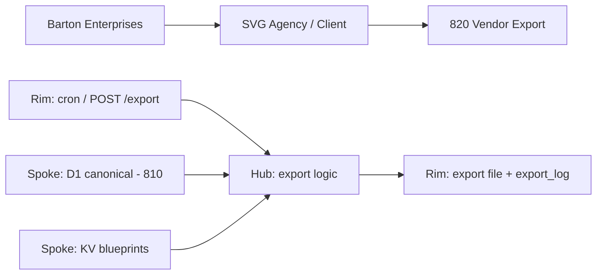
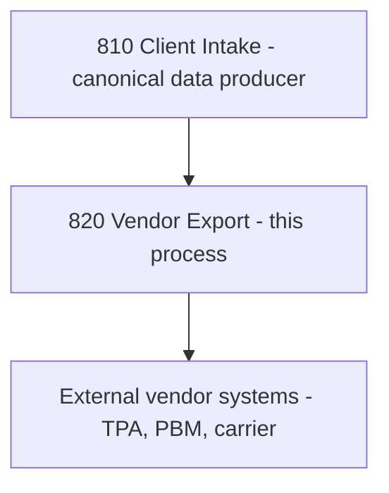

# Vendor Export
## Reads canonical client data from D1, applies per-vendor blueprint mappings from KV, and generates formatted export files for insurance vendors (TPAs, PBMs, carriers) on a daily/weekly cron schedule.
### Status: BUILD
### Medium: process
### Business: svg-agency

## UT Checklist (Pre-Flight - per law/UT_CHECKLIST.md v1.2.0)

| # | Check | Status | Location |
|---|-------|--------|----------|
| 1 | PRD - what / why / who / scope / out-of-scope / success metric | [x] | §2 |
| 2 | OSAM - READ / WRITE / Process Composition / Join Chain / Forbidden Paths / Query Routing filled | [x] | §5 |
| 3 | Component Status - every dep has green / yellow / red with 1-line state | [x] | §3 |
| 4 | Owner - human who fixes this at 2 AM | [x] | §1 |
| 5 | Live Dashboard - URL or explicit "N/A" | [x] | §3 |
| 6 | Kill Switch - exact command to stop the process | [x] | §8 |
| 7 | Logbook - last audit verdict + date (after certification only) | [x] | §12 |
| 8 | FCEs Attached - which FCE runs structurally back this doc | [x] | §3c |
| 9 | BARs Referenced - every BAR this doc touches, with status | [x] | §3d |
| 10 | LBB Subjects Fed - which LBB subject(s) this doc's session logs go to | [x] | §3e |
| 11 | Geometry - CTB position + Hub-Spoke role + Altitude | [x] | §1b |
| 12 | Live Verification - every numeric count, cron, URL, command, BAR status grounded against the live system | [x] | §9b |
| 13 | ctb_node - declared path on the Barton Enterprises CTB trunk | [x] | §1 Identity |

## §1 IDENTITY {#sec-1-identity}

| Field | Value |
|-------|-------|
| ID | PROC-820 |
| Name | Vendor Export |
| Medium | process |
| Business Silo | svg-agency |
| CTB Position | barton-enterprises → svg-agency → client → vendor-export |
| ORBT | BUILD |
| Strikes | 0 |
| Authority | inherited - imo-creator-v2 sovereign + Barton-Processes parent |
| Last Modified | 2026-05-04 |
| BAR Reference | BAR-38, BAR-178 |
| Owner | Dave Barton |
| ctb_node | barton-enterprises/svg-agency/client/820-vendor-export |

### 1b. Geometry {#sec-1b-geometry}

**CTB Position:** barton-enterprises → svg-agency → client → 820-vendor-export (leaf)

**Hub-Spoke Role:** Hub — all export logic lives here; D1 canonical tables and KV are spokes (dumb data transport); HTTP endpoints and cron are rim (I/O boundary only).

**Altitude:** 5k execution — generates per-vendor per-client export files on a fixed schedule.



### HEIR (8 fields - Aviation Model, Bedrock §8)

| Field | Value |
|-------|-------|
| sovereign_ref | imo-creator-v2 |
| hub_id | vendor-export-820 |
| ctb_placement | leaf |
| imo_topology | egress |
| cc_layer | CC-04 |
| services | CF Worker (cron + HTTP), D1 (read canonical), KV (vendor blueprint mappings) |
| secrets_provider | doppler |
| acceptance_criteria | Reads D1 canonical read-only; applies vendor blueprint from KV; translates internal UUIDs to external IDs; logs every export to export_log; missing external ID logs error and skips record; daily TPA/PBM, weekly carriers |

## §2 PURPOSE {#sec-2-purpose}

### WHAT
Process 820 is the terminal egress point for all client data leaving the SVG system toward external insurance vendor platforms. It reads canonical person/election/plan records from 810's D1, applies a per-vendor blueprint mapping from KV to translate internal column names and UUIDs to vendor-specific formats, and generates CSV or JSON export files.

### WHY
Without this process, export files must be hand-assembled from raw tables — error-prone, unscalable, and guaranteed to miss vendor deadlines. Insurance vendors (TPAs, PBMs, carriers) require client data in their proprietary formats on defined schedules. If 820 fails, vendor portals go stale and enrollment records at the vendor fall out of sync.

### WHO
SVG Agency operations team and Dave Barton own this process. Vendor systems (TPAs, PBMs, carriers) consume the output. This doc is read by the mechanic deploying the worker and the auditor verifying export compliance.

### SCOPE (in)
- Cron-triggered daily export for TPA and PBM vendors
- Weekly export for carrier vendors (Guardian Life, Mutual of Omaha) on configured day
- Manual HTTP trigger for ad hoc per-client/per-vendor export
- Vendor blueprint loading from KV (field mappings, format, delimiter)
- Internal UUID to external ID translation via `external_identity_map`
- Export audit logging to `export_log` and `export_error` tables
- `/health`, `/status`, `/export`, `/log/:client_id` endpoints

### OUT-OF-SCOPE
- File delivery (R2, email, SFTP) — TODO; currently files are generated but not shipped
- Authentication on endpoints — TODO; needs CF Access or bearer token gate
- Writing to or modifying 810's canonical tables — 820 is read-only consumer
- Client intake and validation — owned by PROC-810 (process 810-client-intake)

### SUCCESS METRIC
100% of scheduled vendors export successfully with zero BLUEPRINT_NOT_FOUND errors and MISSING_EXTERNAL_ID rate below 1% per run.

## §3 RESOURCES {#sec-3-resources}

Required doctrine references for every process UT:

- `law/UNIFIED_TEMPLATE.md`
- `law/UT_CHECKLIST.md`
- `law/doctrine/PROCESS_FILL_INSTRUCTIONS.md`
- `law/doctrine/HOW_TO_BUILD_ANYTHING.md` (repair manual)
- `law/doctrine/BARTON_ENTERPRISES_WORLD_ATLAS.md` (Atlas System bundle)
- `law/doctrine/KEY.md`

### Component Status Grid

| Component | HEIR (`hub_id · ctb · cc_layer`) | ORBT | Light | State |
|-----------|----------------------------------|------|-------|-------|
| CF Worker (vendor-export-820) | vendor-export-820 · leaf · CC-04 | BUILD | yellow | Worker code exists; dry-run passes with live D1/KV bindings |
| D1 (svg-d1-client) | vendor-export-820 · leaf · CC-04 | BUILD | yellow | Bound to live `svg-d1-client`; export tracking tables created 2026-05-04 |
| KV (EGRESS_KV) | vendor-export-820 · leaf · CC-04 | BUILD | yellow | Bound to live `EGRESS_KV`; blueprint population still required |
| D1 canonical (810 client-intake) | client-intake-810 · leaf · CC-04 | BUILD | yellow | Shared client D1 formalized through `svg-d1-client` |
| CF Cron Trigger | vendor-export-820 · leaf · CC-04 | BUILD | yellow | Configured in wrangler.toml (`0 5 * * *`) but not deployed |

### Live Dashboard

| Resource | URL | What it shows |
|----------|-----|---------------|
| Worker health | https://vendor-export-820.svg-outreach.workers.dev/health | `{ status: "ok", process: "820" }` |
| Worker status | https://vendor-export-820.svg-outreach.workers.dev/status | Recent exports, blueprint list, error count |
| Export log per client | https://vendor-export-820.svg-outreach.workers.dev/log/:client_id | Export history for a specific client |

### Dependencies

| Dependency | Type | What It Provides | Status |
|-----------|------|-----------------|--------|
| 810-client-intake | process | Canonical D1 tables: person, election, plan, vendor, external_identity_map | PENDING — 810 must be OPERATE with populated data |
| D1 vendor-export-820 | database | Local audit tables: export_log, export_error, export_schedule | PENDING — not yet created |
| KV vendor-export-820 | cache layer | Vendor blueprint JSON at keys `blueprint:{vendor_id}` | PENDING — not yet created |
| CF Cron | scheduling | Daily 5 AM UTC trigger | PENDING — not deployed |

### Downstream Consumers

| Consumer | What It Needs |
|----------|--------------|
| None | Terminal process — export files go to external vendor systems (TPAs, PBMs, carriers) |

### Tools & Integrations

| Item | Type | Cost Tier | Credentials | What It Does |
|------|------|-----------|-------------|-------------|
| Cloudflare D1 (svg-d1-client) | database | Free | D1 binding | Canonical client reads plus audit writes: export_log, export_error, export_schedule |
| Cloudflare D1 (810 canonical) | database | Free | D1 binding (shared client DB) | Canonical reads: clients, client_employees, client_vendors, client_employee_vendor_ids |
| Cloudflare Workers KV | cache layer | Free | KV binding | Vendor blueprint JSON storage (`blueprint:{vendor_id}`) |
| CF Cron Triggers | scheduling | Free | none | Daily 5 AM UTC export trigger |

### Secrets

| Secret | Doppler Project | Config | Used By |
|--------|----------------|--------|---------|
| none yet | — | — | — |

### 3c. FCEs Attached

| FCE Name | HEIR (`hub_id · ctb · cc_layer`) | ORBT | Run Directory | Latest P=1 | Rows | Status |
|----------|----------------------------------|------|--------------|------------|------|--------|
| TBV | TBV | BUILD | TBV | pending | TBV | red |

### 3d. BARs Referenced

| BAR | Title | HEIR (`bar-id · ctb · cc_layer`) | ORBT | Status | Relation |
|-----|-------|----------------------------------|------|--------|----------|
| BAR-38 | TBV | TBV | TBV | TBV | implements |
| BAR-178 | TBV | TBV | TBV | TBV | implements |

### 3e. LBB Subjects Fed

| LBB Subject | HEIR (`subject-id · ctb · cc_layer`) | ORBT | What This Doc Writes | Frequency |
|-------------|--------------------------------------|------|---------------------|-----------|
| svg-client-proc | svg-client-proc · leaf · CC-04 | BUILD | Export run summaries, error counts, vendor coverage | per-run |

## §4 IMO - Input, Middle, Output {#sec-4-imo}

### Two-Question Intake (Bedrock §3)
1. What triggers this? Cron schedule at 5 AM UTC daily, or manual HTTP POST to `/export { client_id, vendor_id }`.
2. How do we get it? Reads D1 canonical tables from 810 (person, election, plan, vendor, external_identity_map) and KV blueprint JSON at `blueprint:{vendor_id}`.

### Input
- Cron trigger: `0 5 * * *` (daily 5 AM UTC)
- Manual trigger: `POST /export { client_id, vendor_id }`
- Env vars: `DAILY_VENDORS=TPA,PBM`, `WEEKLY_VENDORS=guardian_life,mutual_of_omaha`, `WEEKLY_DAY=1`
- Canonical data: D1 tables `person`, `election`, `plan`, `vendor`, `external_identity_map` (from 810)
- Vendor blueprints: KV at `blueprint:{vendor_id}`

### Middle

| Step | Input | What Happens | Output | Tool Used |
|------|-------|-------------|--------|-----------|
| 1 | Cron trigger + env vars | Determine scheduled vendors: daily vendors always run; weekly vendors only when day matches WEEKLY_DAY | List of vendor_ids | CF Worker cron handler |
| 2 | Vendor list | Query D1 `client` table for active client_ids | List of client_ids | D1 SELECT |
| 3 | vendor_id | KV GET `blueprint:{vendor_id}` | VendorBlueprint (field_mappings, file_format, delimiter) | KV GET |
| 4 | client_id + vendor_id | JOIN person + election + plan filtered by client_id + active status | Raw record set | D1 SELECT (810 canonical) |
| 5 | Raw records + vendor_id | Lookup external_identity_map for each person; missing = MISSING_EXTERNAL_ID, record skipped | Records with vendor external IDs | D1 SELECT (810 canonical) |
| 6 | Translated records + blueprint | Apply field_mappings: internal column → vendor column | Mapped record set | In-memory transform |
| 7 | Mapped records + blueprint | Serialize to CSV or JSON per file_format/delimiter/include_header | Formatted export file | In-memory serialization |
| 8 | Export result + errors | INSERT into export_log (success) and export_error (per error) | Audit trail in D1 | D1 INSERT (vendor-export-820) |

### Output
- Formatted export files (CSV or JSON) per vendor blueprint
- `export_log` rows: export_id, client_id, vendor_id, blueprint_id, record_count, status, exported_at
- `export_error` rows: for each MISSING_EXTERNAL_ID or BLUEPRINT_NOT_FOUND
- **Currently terminal** — files generated but not yet shipped (no R2, email, or SFTP delivery)

### Circle (Bedrock §5)
Every export writes to `export_log` (status, record_count, timestamp) closing the feedback loop. The `/status` endpoint exposes recent exports and error_count for operational visibility. `export_schedule.last_run_at` tracks cadence. If error rate rises, the Circle signals re-entry into REPAIR mode.

## §5 DATA SCHEMA {#sec-5-data-schema}

### READ Access

| Source | What It Provides | Join Key |
|--------|-----------------|----------|
| D1 person (810) | Employee/dependent records: name, DOB, SSN, status | person_id, client_id |
| D1 election (810) | Benefit elections: plan selection, effective dates, coverage tier | person_id, plan_id, client_id |
| D1 plan (810) | Plan definitions: carrier, benefit_type, rates | plan_id, client_id |
| D1 vendor (810) | Vendor registry: vendor_id, vendor_name, vendor_type | vendor_id, client_id |
| D1 external_identity_map (810) | UUID-to-vendor-ID translation: internal_id → external_id_value per vendor | internal_id, vendor_id, client_id |
| KV blueprint:{vendor_id} | Vendor field mappings, file format, delimiter, header inclusion | vendor_id (KV key) |

### WRITE Access

| Target | What It Writes | When |
|--------|---------------|------|
| D1 export_log (820) | export_id, client_id, vendor_id, blueprint_id, record_count, file_format, status, exported_at | Step 8 — after every export run |
| D1 export_error (820) | error_id, client_id, vendor_id, export_id, error_code, error_message, created_at | Step 5/8 — MISSING_EXTERNAL_ID or BLUEPRINT_NOT_FOUND |
| D1 export_schedule (820) | schedule_id, vendor_id, frequency, last_run_at, next_run_at, status | Step 1 — updated after schedule determination |

### Process Composition



| Process ID | Name | Role in Composition | Status |
|-----------|------|---------------------|--------|
| PROC-810 | Client Intake | Upstream feeder — produces canonical person/election/plan data | BUILD |
| PROC-820 | Vendor Export | This process — reads 810 output, generates vendor files | BUILD |

### Join Chain

```text
person.person_id (client_id filter)
  -> election (person_id, 1:many — elections per person)
    -> plan (plan_id, many:1 — plan definition)
person.person_id
  -> external_identity_map (internal_id = person_id, filtered by vendor_id + active)
vendor.vendor_id
  -> KV blueprint:{vendor_id} (blueprint field mappings)
```

### Forbidden Paths

| Action | Why |
|--------|-----|
| WRITE to 810 canonical tables (person, election, plan, vendor, external_identity_map) | D-820-01: 820 is read-only consumer of 810 data — CQRS write path violation |
| Log export_log entry without actually running the export | D-820-03: Audit trail must reflect actual export execution |
| Skip external_identity_map lookup | D-820-02: Every vendor requires their own ID format — internal UUIDs are meaningless to vendors |
| Generate export file when vendor blueprint is missing | D-820-05: BLUEPRINT_NOT_FOUND must halt for that vendor; no partial export |

### Query Routing

| Question | Table | Column |
|----------|-------|--------|
| What exports ran for this client? | export_log | client_id |
| What errors occurred for this vendor? | export_error | vendor_id, error_code |
| When does this vendor next export? | export_schedule | vendor_id, next_run_at |
| What is this person's vendor ID? | external_identity_map | internal_id + vendor_id → external_id_value |
| What format does this vendor need? | KV | blueprint:{vendor_id} → file_format, delimiter |

## §6 DMJ - Define, Map, Join {#sec-6-dmj}

### 6a. DEFINE (Build the Key)

| Element | ID | Format | Description | C or V |
|---------|-----|--------|-------------|--------|
| Vendor blueprint | E-820-01 | JSON KV value at `blueprint:{vendor_id}` | Per-vendor field mapping, format, delimiter, header config | C (structure) |
| Export pipeline steps | E-820-02 | Ordered list of 8 steps | Fixed sequence: determine vendors → clients → blueprint → data → translate IDs → map → generate → log | C |
| VendorBlueprint schema | E-820-03 | TypeScript interface | vendor_id, vendor_name, file_format, delimiter, field_mappings, include_header | C |
| Error codes | E-820-04 | Enum: BLUEPRINT_NOT_FOUND \| MISSING_EXTERNAL_ID | Fixed error classifications | C |
| KV key pattern | E-820-05 | String: `blueprint:{vendor_id}` | Structure of KV lookup key | C |
| API endpoint paths | E-820-06 | URL paths: /health, /status, /export, /log/:client_id | Fixed HTTP surface | C |
| Schedule structure | E-820-07 | Env vars: DAILY_VENDORS, WEEKLY_VENDORS, WEEKLY_DAY | Daily vs weekly vendor routing config | C (structure) / V (values) |
| Scheduled vendor list | E-820-08 | Array of vendor_ids | Which vendors run on a given day | V |
| Active client list | E-820-09 | Array of client_ids from D1 | Which clients are active at run time | V |
| Export file content | E-820-10 | CSV or JSON string | Serialized output per vendor blueprint | V |
| External ID map | E-820-11 | Map<internal_id, external_id_value> | Per-vendor UUID translation at run time | V |

### 6b. MAP (Connect Key to Structure)

| Source | Target | Transform |
|--------|--------|-----------|
| DAILY_VENDORS env var | vendor list (E-820-08) | Parse CSV string → string array |
| WEEKLY_VENDORS + WEEKLY_DAY | vendor list (E-820-08) | Conditional append if day matches |
| KV `blueprint:{vendor_id}` | VendorBlueprint (E-820-03) | JSON.parse |
| D1 person + election + plan JOIN | raw record set | SQL JOIN with client_id + active filter |
| external_identity_map rows | external ID map (E-820-11) | Map internal_id → external_id_value |
| raw record[internal_col] + field_mappings | output field | Direct lookup per blueprint |
| output fields array | export_log INSERT | Aggregate record_count + status |

### 6c. JOIN (Path to Spine)

| Join Path | Type | Description |
|-----------|------|-------------|
| vendor_id → KV blueprint:{vendor_id} | direct | vendor_id is the KV key suffix; loadBlueprint() performs the GET |
| person.person_id → election.person_id | direct | FK join in D1 SELECT |
| election.plan_id → plan.plan_id | direct | FK join in D1 SELECT |
| person.person_id → external_identity_map.internal_id | direct | Filtered by vendor_id and active status |
| export result → export_log | direct | INSERT on every generateExport() call |

## §7 CONSTANTS & VARIABLES {#sec-7-constants-variables}

### Constants (structure - never changes)
- Export pipeline steps are fixed: determine vendors → get clients → load blueprint → read data → translate IDs → map fields → generate output → log — **D-820-04**
- Vendor blueprint schema is fixed: field_mappings, file_format, delimiter, include_header, vendor_id, vendor_name — **D-820-05**
- Error codes are fixed: BLUEPRINT_NOT_FOUND, MISSING_EXTERNAL_ID — **D-820-06**
- D1 table schemas are fixed: export_log, export_error, export_schedule (column names and types) — **D-820-07**
- KV key pattern is fixed: `blueprint:{vendor_id}` — **D-820-08**
- API endpoint paths are fixed: GET /health, GET /status, POST /export, GET /log/:client_id — **D-820-09**
- Schedule structure is fixed: daily vendors vs weekly vendors, WEEKLY_DAY config — **D-820-10**
- 820 is read-only against 810 canonical data — never writes upstream — **D-820-01**

### Variables (fill - changes every run/cycle)
- Which vendors are scheduled for today (daily vs weekly day match)
- Which clients are active for each vendor at run time
- Record count per client per vendor
- MISSING_EXTERNAL_ID count per run
- Content of generated export files
- Vendor blueprint field mappings (different per vendor, updatable in KV)
- Specific external IDs in external_identity_map at run time

## §8 STOP CONDITIONS {#sec-8-stop-conditions}

| Condition | Action |
|-----------|--------|
| Can't answer two-question intake | HALT — process not defined |
| Vendor blueprint not found in KV (BLUEPRINT_NOT_FOUND) | HALT for that vendor — log error, skip to next vendor — **D-820-05** |
| 810 canonical D1 unreachable | HALT entire run — no source data — **D-820-01** |
| All records for a client/vendor pair fail external ID lookup | HALT for that client/vendor pair — log bulk error, no empty file generated — **D-820-02** |
| KV namespace not bound | HALT — no blueprint source |
| 5 consecutive D1 query failures | HALT — check D1 state |
| Same failure repeats 3x | Troubleshoot/Train → Airworthiness Directive |

### Kill Switch

```text
wrangler delete --name vendor-export-820
```

To suspend without deleting: disable the cron trigger in Cloudflare dashboard → Workers → vendor-export-820 → Triggers → disable cron.

## §9 VERIFICATION {#sec-9-verification}

```text
1. GET /health -> expected: { "process": "PROC-VENDOR-EXPORT", "number": 820, "status": "ok" }
2. GET /status -> expected: { "recent_exports": [], "available_blueprints": [...], "total_errors": 0 }
3. Load test blueprint into KV: blueprint:test_vendor -> expected: KV write success
4. POST /export { "client_id": "test-001", "vendor_id": "test_vendor" } -> expected: export generated, export_log entry created, record_count > 0
5. GET /log/test-001 -> expected: 1 export log entry with status "completed"
6. POST /export { "client_id": "test-001", "vendor_id": "nonexistent" } -> expected: BLUEPRINT_NOT_FOUND error in export_error, record_count = 0
7. Insert person with no external_identity_map entry, POST /export -> expected: MISSING_EXTERNAL_ID error logged, record skipped, remaining records exported
```

### Three Primitives Check (Bedrock §1)
1. Thing — D1 svg-d1-client exists? EGRESS_KV namespace exists? Blueprints loaded? 810 canonical tables populated?
2. Flow — Cron fires → worker runs → reads 810 D1 → reads KV blueprint → generates output → writes export_log?
3. Change — Internal UUIDs correctly translated to vendor external IDs? Field mappings applied correctly? CSV/JSON formatted per blueprint spec?

## §9b Live Verification Log {#sec-9b-live-verification}

| Claim | Section | Source of Truth | Verification Command | [ ] | Last Check | Value |
|-------|---------|-----------------|----------------------|-----|-----------|-------|
| Worker responds to /health | §1 | CF Worker runtime | `curl https://vendor-export-820.svg-outreach.workers.dev/health` | [ ] | TBV | TBV |
| D1 svg-d1-client exists | §3 | Cloudflare D1 dashboard | `wrangler d1 list` | [x] | 2026-05-04 | `svg-d1-client` / `5443887b-ba8a-4da5-9f54-6a9c2cfb1244` |
| KV EGRESS_KV exists | §3 | Cloudflare KV dashboard | `wrangler kv namespace list` | [x] | 2026-05-04 | `EGRESS_KV` / `66e6c7bec8c1479ba708c0bcbb6a0e23` |
| Cron registered at 0 5 * * * | §4 | wrangler.toml + CF dashboard | `wrangler triggers list` (post-deploy) | [ ] | TBV | TBV |
| export_log table exists | §5 | D1 migration | `wrangler d1 execute svg-d1-client --remote --command "SELECT COUNT(*) FROM export_log"` | [x] | 2026-05-04 | table present |
| export_error table exists | §5 | D1 migration | `wrangler d1 execute svg-d1-client --remote --command "SELECT COUNT(*) FROM export_error"` | [x] | 2026-05-04 | table present |
| At least one blueprint in KV | §3 | KV list | `wrangler kv key list --namespace-id <KV_ID> --prefix blueprint:` | [ ] | TBV | TBV |
| 810 canonical tables readable | §4 | D1 shared binding | `wrangler d1 execute svg-d1-client --remote --command "SELECT name FROM sqlite_master"` | [x] | 2026-05-04 | clients, client_employees, client_vendors, client_employee_vendor_ids present |

Rule: at least one live gauge row is required before BUILD can move to OPERATE.

## §10 ANALYTICS {#sec-10-analytics}

### 10a. Metrics

| Metric | Unit | Baseline | Target | Tolerance |
|--------|------|----------|--------|-----------|
| Exports generated per run | count | BASELINE | All scheduled vendors × active clients | 0 failures |
| Records per export | count | BASELINE | All active records per client | > 0 per client/vendor pair |
| MISSING_EXTERNAL_ID rate | % | BASELINE | < 1% | Red above 5% |
| BLUEPRINT_NOT_FOUND count | count | BASELINE | 0 | Red above 0 |
| Export latency | ms | BASELINE | < 5000ms per client/vendor pair | Red above 30000ms |
| Cron success rate | % | BASELINE | 100% | Red below 95% |

### 10b. Sigma Tracking

| Metric | Run 1 | Run 2 | Run 3 | Trend | Action |
|--------|-------|-------|-------|-------|--------|
| Export generated count | TBV | TBV | TBV | TBV | — |
| MISSING_EXTERNAL_ID rate | TBV | TBV | TBV | TBV | — |
| BLUEPRINT_NOT_FOUND count | TBV | TBV | TBV | TBV | — |

### 10c. ORBT Gate Rules

| From | To | Gate |
|------|-----|------|
| BUILD | OPERATE | all metrics within tolerance for 3 runs + auditor sign-off |
| OPERATE | REPAIR | any metric outside tolerance |
| REPAIR | OPERATE | fix + metric back + auditor verification |
| Any (Strike 3) | TROUBLESHOOT_TRAIN | fleet-wide fix → AD |

## §11 EXECUTION TRACE {#sec-11-execution-trace}

| Field | Format | Required |
|-------|--------|----------|
| trace_id | UUID | Yes |
| run_id | UUID | Yes |
| step | action name | Yes |
| target | measurable | Yes |
| actual | measurable | Yes |
| delta | the gap | Yes |
| status | done / failed / skipped | Yes |
| error_code | text or null | If failed |
| error_message | text or null | If failed |
| tools_used | JSON array | Yes |
| duration_ms | integer | Yes |
| cost_cents | integer | Yes |
| timestamp | ISO-8601 | Yes |
| signed_by | agent or manual | Yes |

### Build Inputs Used

| Source | File | What Was Used |
|--------|------|--------------|
| CLAUDE.md | factory/client/820-vendor-export/CLAUDE.md | Process description, API endpoints, error codes, dependencies |
| PROCESS.md | factory/client/820-vendor-export/PROCESS.md | IMO, OSAM, constants/variables, stop conditions, smoke tests |
| heir.yaml | factory/client/820-vendor-export/heir.yaml | 8-field HEIR identity, acceptance criteria |
| wrangler.toml | factory/client/820-vendor-export/wrangler.toml | Worker config, cron schedule, D1/KV bindings |
| src/index.ts | factory/client/820-vendor-export/src/index.ts | Export flow, cron handler, HTTP endpoints |
| src/export.ts | factory/client/820-vendor-export/src/export.ts | generateExport() logic, ID translation, logging |
| src/blueprints.ts | factory/client/820-vendor-export/src/blueprints.ts | VendorBlueprint interface, loadBlueprint(), listBlueprints() |
| src/migrations/001_d1_export_tables.sql | factory/client/820-vendor-export/src/migrations/ | D1 table schemas: export_log, export_error, export_schedule |

### Back-Propagation Check

| Parent Constant | Conflict Check | Result |
|-----------------|----------------|--------|
| 810 canonical tables (PROC-810) | 820 reads but never writes — CQRS compliance | clean |
| Vendor blueprint KV key pattern | Fixed `blueprint:{vendor_id}` — matches src/blueprints.ts | clean |
| Export pipeline step order | 8-step sequence matches src/export.ts implementation | clean |

## §12 LOGBOOK (After Certification Only) {#sec-12-logbook}

No logbook during BUILD.

### Birth Certificate

| Field | Value |
|-------|-------|
| heir_ref | TBV — pending certification |
| orbt_entered | BUILD |
| orbt_exited | TBV |
| action | TBV |
| gates_passed | TBV |
| signed_by | TBV |
| signed_at | TBV |

### Logbook (append-only)

| Date | Actor | Action | What Was Done | Evidence | LBB Record |
|------|-------|--------|---------------|----------|------------|
| 2026-03-29 | Dave Barton | BUILD | PROCESS.md created from template — all infrastructure TODO | PROCESS.md logbook entry | none |
| 2026-04-29 | Claude Sonnet (Runner) | BUILD | UT consolidation — PROCESS-UT.md, DOCTRINE.md, orbt.yaml written; fragments archived | UT v2.7.0 consolidation run | pending |
| 2026-05-04 | Codex | REPAIR | Bound wrangler to live svg-d1-client and EGRESS_KV; aligned source queries to live client schema; applied additive export tracking migration | BAR-377 bp.820 repair | pending |

## §13 FLEET FAILURE REGISTRY {#sec-13-fleet-failure-registry}

| Pattern ID | Location | Error Code | First Seen | Occurrences | Strike Count | Status |
|-----------|----------|-----------|-----------|-------------|-------------|--------|
| FP-820-01 | wrangler.toml | database_id empty | 2026-03-29 | 1 | 0 | CLOSED 2026-05-04 |
| FP-820-02 | wrangler.toml | KV id empty | 2026-03-29 | 1 | 0 | CLOSED 2026-05-04 |
| FP-820-03 | src/index.ts | Export output not shipped (TODO: R2/email/SFTP) | 2026-03-29 | 1 | 0 | OPEN |
| FP-820-04 | src/index.ts + wrangler.toml | Shared D1 access with 810 not formalized | 2026-03-29 | 1 | 0 | CLOSED 2026-05-04 |
| FP-820-05 | src/index.ts | No authentication on HTTP endpoints | 2026-03-29 | 1 | 0 | OPEN |

## §14 SESSION LOG {#sec-14-session-log}

| Date | What Was Done | LBB Record |
|------|---------------|-----------|
| 2026-03-29 | PROCESS.md created from PROCESS_TEMPLATE v2.0.0 — all infra TODO | none |
| 2026-04-29 | UT v2.7.0 consolidation: PROCESS-UT.md + DOCTRINE.md + orbt.yaml written; CLAUDE.md + PROCESS.md archived | pending |
| 2026-05-04 | BAR-377 repair: live Cloudflare bindings wired, source schema aligned, export tables created, Codex repair audit P=1 | pending |

## Document Control

| Field | Value |
|-------|-------|
| Created | 2026-04-29 |
| Last Modified | 2026-05-04 |
| Version | 1.0.0 |
| Template Version | 2.7.0 |
| Medium | process |
| US Validated | pending |
| Governing Engine | law/doctrine/FOUNDATIONAL_BEDROCK.md + law/doctrine/DMJ.md |
