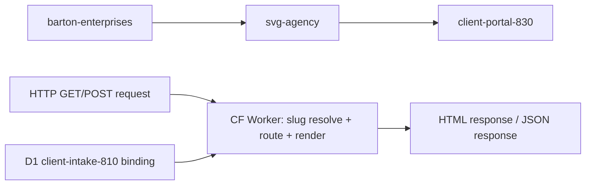
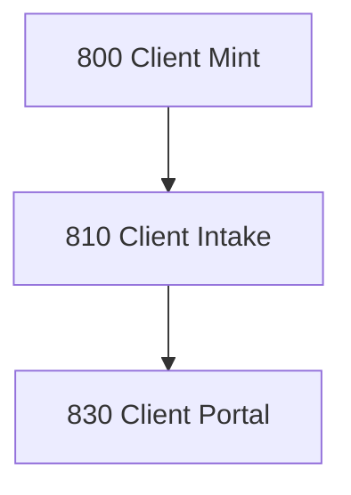

# CLIENT PORTAL
## Renders audience-specific HTML pages for each client, branded per client record, served at app.svgagency.com/:slug/:page
### Status: OPERATE
### Medium: process
### Business: svg-agency

## UT Checklist (Pre-Flight - per law/UT_CHECKLIST.md v1.2.0)

| # | Check | Status | Location |
|---|-------|--------|----------|
| 1 | PRD - what / why / who / scope / out-of-scope / success metric | [x] | §2 |
| 2 | OSAM - READ / WRITE / Process Composition / Join Chain / Forbidden Paths / Query Routing filled | [x] | §5 |
| 3 | Component Status - every dep has green / yellow / red with 1-line state | [x] | §3 |
| 4 | Owner - human who fixes this at 2 AM | [x] | §1 |
| 5 | Live Dashboard - URL or explicit "N/A" | [x] | §3 |
| 6 | Kill Switch - exact command to stop the process | [x] | §8 |
| 7 | Logbook - last audit verdict + date (after certification only) | [x] | §12 |
| 8 | FCEs Attached - which FCE runs structurally back this doc | [x] | §3c |
| 9 | BARs Referenced - every BAR this doc touches, with status | [x] | §3d |
| 10 | LBB Subjects Fed - which LBB subject(s) this doc's session logs go to | [x] | §3e |
| 11 | Geometry - CTB position + Hub-Spoke role + Altitude | [x] | §1b |
| 12 | Live Verification - every numeric count, cron, URL, command, BAR status grounded against the live system | [x] | §9b |
| 13 | ctb_node - declared path on the Barton Enterprises CTB trunk | [x] | §1 Identity |

## §1 IDENTITY {#sec-1-identity}

| Field | Value |
|-------|-------|
| ID | PROC-830 |
| Name | Client Portal |
| Medium | process |
| Business Silo | svg-agency |
| CTB Position | barton-enterprises/svg-agency/client/client-portal |
| ORBT | OPERATE |
| Strikes | 0 |
| Authority | inherited - imo-creator-v2 sovereign + Barton-Processes parent |
| Version | v3.0.1 |
| Last Modified | 2026-05-13 |
| BAR Reference | BAR-38, BAR-82, BAR-178, BAR-830-BUILD |
| Owner | Dave Barton |
| ctb_node | barton-enterprises/svg-agency/client/client-portal |

## §1b GEOMETRY {#sec-1b-geometry}

**CTB Position:** barton-enterprises → svg-agency → client → client-portal (leaf)

**Hub-Spoke Role:** Hub — this is the middle layer that receives HTTP requests (rim/input), resolves slug + routes to page renderer (hub/middle), and emits HTML to browser (rim/output). No processing logic in spokes (transport layer is CF Worker HTTP handling).

**Altitude:** 10k operational — this is a single deployable worker rendering pages for one domain. Not strategic architecture, not atomic execution.



### HEIR (8 fields - Aviation Model, Bedrock §8)

| Field | Value |
|-------|-------|
| sovereign_ref | imo-creator-v2 |
| hub_id | client-portal-830 |
| ctb_placement | leaf |
| imo_topology | egress |
| cc_layer | CC-04 |
| services | CF Worker (HTTP), D1 (shared with 810 — read + ticket writes) |
| secrets_provider | doppler |
| acceptance_criteria | Slug resolves to client_id from shared D1; Unknown slug returns 404; Each page renders with client branding (logo, colors); All pages read-only except agent (ticket status updates); Agent validates status transitions before writing; Server-side HTML — no SPA framework |

## §2 PURPOSE {#sec-2-purpose}

### WHAT
Client Portal (PROC-830) is a Cloudflare Worker that renders six audience-specific HTML pages per client, served at `https://client-portal-830.svg-outreach.workers.dev/:slug/:page` (prod target: `app.svgagency.com/:slug/:page`). Each page pulls client data from the D1 database `svg-d1-client` and wraps it in the client's branding. The employee page accepts POST requests to submit tickets; the agent page accepts POST requests to update ticket status.

### WHY
Without this process there is no client-facing view of the data SVG Agency collects and manages. Every upstream process (800 Client Mint, 810 Client Intake) builds the canonical client record but none present it to the audience that needs to act — the client's CEO, HR team, underwriter, or the internal service agent. If this fails, clients have no self-service visibility and every question becomes a phone call.

### WHO
- Client CEO (reads CEO dashboard)
- Client HR team (reads HR portal)
- Stop-loss underwriter (reads underwriting page)
- Client general contacts (reads renewal page)
- SVG Agency service team / Dave's team (reads + writes agent dashboard)
- Ops who reads this doc: Dave Barton

### SCOPE (in)
- Slug-based URL routing: `/:slug/:page` for six fixed page names (renewal, ceo, hr, underwriting, employee, agent)
- Server-side HTML rendering per page, branded with client logo + colors
- Read access to `clients`, `client_employees`, `client_contacts`, `client_interactions`, `client_vendors`, `client_compliance`, `client_tickets` tables
- Employee page ticket submit write path (POST `/:slug/employee/ticket`)
- Agent page ticket status write path (POST `/:slug/agent/ticket/:id/status`)
- D1 database `svg-d1-client` (database_id `5443887b-ba8a-4da5-9f54-6a9c2cfb1244`)

### OUT-OF-SCOPE
- Authentication per audience role — not implemented; needs CF Access or token-based auth (see Known Issues, §13)
- Slug auto-generation — handled by bp.800 Client Mint v2.3.0 (slugify + D1 uniqueness check at mint time); not in scope for 830
- Client branding asset storage (logos) — logo_url column exists but R2/CDN integration is not in scope here
- Any SPA framework or client-side data fetching — this is server-side HTML only

### SUCCESS METRIC
All six audience pages render with correct client branding and page-specific data for at least one live slug (zero 500 errors, zero blank pages). Both write paths (employee ticket submit + agent status update) return correct HTTP responses. Smoke test confirmed 2026-05-13.

## §3 RESOURCES {#sec-3-resources}

Required doctrine references for every process UT:

- `law/UNIFIED_TEMPLATE.md`
- `law/UT_CHECKLIST.md`
- `law/doctrine/PROCESS_FILL_INSTRUCTIONS.md`
- `law/doctrine/HOW_TO_BUILD_ANYTHING.md` (repair manual)
- `law/doctrine/BARTON_ENTERPRISES_WORLD_ATLAS.md` (Atlas System bundle)
- `law/doctrine/KEY.md`

### Component Status Grid

| Component | HEIR (`hub_id · ctb · cc_layer`) | ORBT | Light | State |
|-----------|----------------------------------|------|-------|-------|
| D1 svg-d1-client | 5443887b · leaf · CC-03 | OPERATE | green | Deployed; 21 tables; client_* prefix; smoke test confirmed clean |
| CF Worker client-portal-830 | client-portal-830 · leaf · CC-04 | OPERATE | green | Deployed at https://client-portal-830.svg-outreach.workers.dev; all 6 pages live |
| 800 Client Mint | client-mint-800 · leaf · CC-04 | OPERATE | green | v2.3.0 — slug auto-generated at mint via slugify(company_name) + D1 uniqueness check; portal pages live automatically on mint |
| 810 Client Intake | client-intake-810 · leaf · CC-04 | BUILD | yellow | Upstream feeder; client_* tables owned by intake flow |

### Live Dashboard

| Resource | URL | What it shows |
|----------|-----|---------------|
| Worker health | https://client-portal-830.svg-outreach.workers.dev/health | Process name, number, status — confirmed 200 2026-05-13 |
| Worker root | https://client-portal-830.svg-outreach.workers.dev/ | Route listing |
| Production target | https://app.svgagency.com/:slug/:page | Custom domain — pending DNS wiring |
| Cloudflare Dashboard | https://dash.cloudflare.com/ → Workers → client-portal-830 | Worker deployment status, request metrics |
| Mission Control API | https://mission-control-api.svg-outreach.workers.dev/processes/830/summary | Aggregate portal stats (clients_with_portal, total_tickets, open_tickets, resolved_tickets, ticket_errors) — process_id 830 registered 2026-05-13 |

### Dependencies

| Dependency | Type | What It Provides | Status |
|-----------|------|-----------------|--------|
| D1 svg-d1-client | database | All page data reads; client_tickets writes | DONE — bound and live (database_id `5443887b-ba8a-4da5-9f54-6a9c2cfb1244`) |
| 800 Client Mint | process | Client record with slug in clients table | PENDING (slug assignment manual) |
| 810 Client Intake | process | Populates client_employees, client_contacts, client_vendors, client_compliance, client_interactions | PENDING (manual intake flow) |

### Downstream Consumers

| Consumer | What It Needs |
|----------|--------------|
| (none — terminal process) | Renders HTML to browser. No downstream data consumers. |

### Tools & Integrations

| Item | Type | Cost Tier | Credentials | What It Does |
|------|------|-----------|-------------|-------------|
| Cloudflare D1 | database | Free | D1 binding (wrangler.toml) | All page data reads + agent ticket writes |
| CF Worker (HTTP) | compute | Free | none | Server-side HTML rendering, slug-based routing |

### Secrets

| Secret | Doppler Project | Config | Used By |
|--------|----------------|--------|---------|
| (none) | — | — | No external API calls; reads from shared D1 binding only |

### §3c FCEs Attached

| FCE Name | HEIR (`hub_id · ctb · cc_layer`) | ORBT | Run Directory | Latest P=1 | Rows | Status |
|----------|----------------------------------|------|--------------|------------|------|--------|
| N/A — no FCE runs for this process yet | TBV | BUILD | TBV | pending | TBV | red |

### §3d BARs Referenced

| BAR | Title | HEIR (`bar-id · ctb · cc_layer`) | ORBT | Status | Relation |
|-----|-------|----------------------------------|------|--------|----------|
| BAR-38 | TBV | TBV | TBV | TBV | implements |
| BAR-82 | TBV | TBV | TBV | TBV | implements |
| BAR-178 | TBV | TBV | TBV | TBV | implements |

### §3e LBB Subjects Fed

| LBB Subject | HEIR (`subject-id · ctb · cc_layer`) | ORBT | What This Doc Writes | Frequency |
|-------------|--------------------------------------|------|---------------------|-----------|
| svg-client | svg-client · branch · CC-02 | BUILD | session summaries, build progress, known issues | per-run |

## §4 IMO — INPUT, MIDDLE, OUTPUT {#sec-4-imo}

### Two-Question Intake (Bedrock §3)
1. **What triggers this?** User navigates to `/:slug/:page` (HTTP GET). Employee page also accepts HTTP POST to submit a ticket. Agent page also accepts HTTP POST to update ticket status.
2. **How do we get it?** Resolve slug to client_id from D1 `svg-d1-client`, query page-specific tables, render server-side HTML.

### Input
HTTP request with URL path containing two segments: slug (client identifier) and page (audience view). Slug resolves to a `ClientContext` from the `clients` table in D1. ClientContext provides: client_id, slug, company_name, slug, logo_url, color_primary, color_accent, lifecycle_stage, employee_count.

### Middle

| Step | Input | What Happens | Output | Tool Used |
|------|-------|-------------|--------|-----------|
| 1 | HTTP request URL | Parse path into slug + page segments; validate page is one of 6 known values | slug, page strings | CF Worker router |
| 2 | slug | Query `clients` table WHERE slug = ?; return ClientContext or null | ClientContext (branding + client_id) or 404 | D1 query |
| 3 | page + client_id | Route to page-specific renderer (renewal, ceo, hr, underwriting, employee, agent) | Raw HTML body for that audience | Page renderer function |
| 4 | HTML body + ClientContext | Wrap body in layout template with client branding (logo, colors, nav) | Full HTML document | layout.ts renderPage() |
| 5 | Full HTML | Return Response with Content-Type text/html | HTTP 200 response | CF Worker |
| 5a | POST /:slug/employee/ticket | Validate form fields, INSERT into client_tickets, redirect 303 to /:slug/employee?submitted=1 | HTTP 303 redirect | D1 write |
| 5b | POST /:slug/agent/ticket/:id/status | Validate status (open/in_progress/waiting/resolved/closed), UPDATE client_tickets, set resolved_at if terminal | JSON success/error response | D1 write |

### Output
- HTML page rendered with client branding, served to the requesting browser
- For employee POST: 303 redirect to `/:slug/employee?submitted=1` (ticket created in client_tickets)
- For agent POST: JSON `{"success":true}` confirming ticket status update
- No downstream data consumers — this is a terminal process

### Circle (Bedrock §5)
No automated feedback loop. The circle closes through human observation: the audience reads the page, identifies issues (wrong data, missing info), and reports back through the employee page (submit ticket) or agent dashboard (status updates). Agent page ticket updates close the loop into the client_tickets canonical table.

## §5 DATA SCHEMA {#sec-5-data-schema}

### READ Access

| Source | What It Provides | Join Key |
|--------|-----------------|----------|
| clients | Slug resolution, branding (company_name, logo_url, color_primary, color_accent), lifecycle_stage, employee_count | clients.slug (resolution), clients.client_id (all pages) |
| client_employees | Employee census (total, active, terminated, on_leave counts) for underwriting page | client_id |
| client_contacts | Key contacts (full_name, role, email, phone) for renewal page | client_id |
| client_vendors | Vendor list (vendor_name, vendor_type, group_number, integration_type) for renewal page | client_id |
| client_compliance | Compliance config (self_insured, erisa_applicable, aca_applicable, plan_year_start/end, required_forms) for underwriting page | client_id |
| client_interactions | Interaction log (type, subject, direction, resolved, occurred_at) for agent page | client_id |
| client_tickets | Ticket queue (full_name, email, category, subject, priority, status, created_at) for agent page; ticket insert target for employee page | client_id |

### WRITE Access

| Target | What It Writes | When |
|--------|---------------|------|
| client_tickets | New ticket row (full_name, email, category, subject, description, priority, status='open') | POST /:slug/employee/ticket — employee page ticket submit |
| client_tickets | ticket status column + resolved_at (when terminal) | POST /:slug/agent/ticket/:id/status — agent page status update |

### Process Composition



| Process ID | Name | Role in Composition | Status |
|-----------|------|---------------------|--------|
| PROC-800 | Client Mint | upstream feeder — creates client record with slug | yellow |
| PROC-810 | Client Intake | upstream feeder — populates canonical D1 tables | yellow |
| PROC-830 | Client Portal | this — terminal egress, renders HTML | OPERATE |

### Join Chain

```text
clients.slug (URL resolution)
  -> clients.client_id
    -> client_contacts (client_id — renewal page: key contacts)
    -> client_vendors (client_id — renewal page: vendor list)
    -> client_employees (client_id — underwriting page: census aggregate)
    -> client_compliance (client_id — underwriting page: compliance config)
    -> client_interactions (client_id — agent page: interaction log)
    -> client_tickets (client_id — agent page read + employee page insert + agent page status write)
```

### Forbidden Paths

| Action | Why |
|--------|-----|
| Write to any table except client_tickets | 830 is a read layer; only employee ticket insert and agent status update are allowed (D-830-07) |
| Direct write to clients table | Client records owned by 800 Client Mint and 810 Client Intake (D-830-08) |
| Write to client_employees, client_contacts, client_vendors, client_compliance, client_interactions | These are 810-owned canonical tables; 830 reads them only (D-830-07) |
| Cross-client data access | Each slug resolves to exactly one client_id; no page may query data outside that client_id (D-830-03) |
| POST to any path other than employee/ticket or agent/ticket/:id/status | Only these two write paths are in scope (D-830-06) |

### Query Routing

| Question | Table | Column |
|----------|-------|--------|
| What client does this slug belong to? | clients | slug → client_id |
| What is the client's display name? | clients | company_name |
| What branding to apply? | clients | logo_url, color_primary, color_accent |
| Who are the key contacts? (renewal) | client_contacts | client_id, full_name, role, email, phone |
| What vendors does this client use? (renewal) | client_vendors | client_id, vendor_name, vendor_type, group_number, integration_type |
| What is the employee census? (underwriting) | client_employees | client_id, employment_status aggregate |
| What are the compliance settings? (underwriting) | client_compliance | client_id, self_insured, erisa_applicable, aca_applicable, plan_year_start/end, required_forms |
| What interactions are on record? (agent) | client_interactions | client_id, interaction_type, subject, direction, resolved, occurred_at |
| What tickets exist or need status update? (agent/employee) | client_tickets | client_id, ticket_id, status, category, subject, priority |

## §6 DMJ — DEFINE, MAP, JOIN {#sec-6-dmj}

### §6a DEFINE (Build the Key)

| Element | ID | Format | Description | C or V |
|---------|-----|--------|-------------|--------|
| URL slug | E-830-01 | string (kebab-case) | Client identifier in URL path segment | V |
| Page name | E-830-02 | enum: renewal, ceo, hr, underwriting, employee, agent | Audience view identifier — 6 values, all fixed | C |
| ClientContext | E-830-03 | TypeScript interface | Resolved client record from clients table: client_id, slug, company_name, logo_url, color_primary, color_accent, lifecycle_stage, employee_count | C |
| client_id | E-830-04 | string (format: matches clients.client_id) | Primary key joining all page data across client_* tables | C |
| company_name | E-830-05 | string | Display name from clients.company_name | V |
| color_primary | E-830-06 | string (hex, default #1a365d) | Primary brand color | V |
| color_accent | E-830-07 | string (hex, default #3182ce) | Accent brand color | V |
| ticket_id | E-830-08 | string | client_tickets.ticket_id — agent write path identifier | V |
| ticket_status | E-830-09 | enum: open, in_progress, waiting, resolved, closed | New ticket status on agent POST — validated by VALID_STATUSES set in agent.ts | V |
| ticket_category | E-830-11 | enum: benefits, payroll, onboarding, offboarding, compliance, general | Ticket category on employee POST — CHECK constraint enforced by D1 | V |
| ticket_priority | E-830-12 | enum: low, normal, high, urgent | Ticket priority on employee POST — CHECK constraint enforced by D1 | V |
| HTML response | E-830-10 | text/html document | Full rendered page output including client branding | V |

### §6b MAP (Connect Key to Structure)

| Source | Target | Transform |
|--------|--------|-----------|
| URL path segment [0] | E-830-01 slug | direct parse |
| URL path segment [1] | E-830-02 page | classify (must match 6-value enum) |
| D1 clients table row | E-830-03 ClientContext | direct query WHERE slug = ? |
| ClientContext.client_id | E-830-04 | direct — joins to all client_* tables |
| ClientContext.company_name | E-830-05 | direct |
| page + client_id | E-830-10 HTML body | renderer function per page (renewal.ts, ceo.ts, hr.ts, underwriting.ts, employee.ts, agent.ts) |
| ClientContext + HTML body | E-830-10 full document | layout.ts renderPage() wraps with branding |
| POST body.status | E-830-09 | validated against VALID_STATUSES set; rejected if not in set |
| POST body.category | E-830-11 | validated before D1 insert; D1 CHECK constraint enforces too |

### §6c JOIN (Path to Spine)

| Join Path | Type | Description |
|-----------|------|-------------|
| clients.slug -> clients.client_id | direct | slug is the URL key; client_id is the spine for all page queries |
| client_id -> client_contacts | direct | client_id FK — renewal page: key contacts table |
| client_id -> client_vendors | direct | client_id FK — renewal page: vendor list table |
| client_id -> client_employees | direct | client_id FK — underwriting page: census aggregate |
| client_id -> client_compliance | direct | client_id FK — underwriting page: compliance config |
| client_id -> client_interactions | direct | client_id FK — agent page: interaction log |
| client_id -> client_tickets | direct | client_id FK — agent page read + employee page INSERT + agent page status UPDATE |

## §7 CONSTANTS & VARIABLES {#sec-7-constants-variables}

### Constants (structure - never changes)
- Six fixed audience pages: renewal, ceo, hr, underwriting, employee, agent (D-830-01)
- Slug-based routing pattern: `/:slug/:page` — two segments, no exceptions (D-830-02)
- Display name rule: `clients.company_name` — branding from color_primary (#1a365d default) + color_accent (#3182ce default) (D-830-04)
- Read-only default: renewal/ceo/hr/underwriting pages are read-only; employee page POSTs INSERT to client_tickets; agent page POSTs UPDATE client_tickets.status (D-830-05)
- Server-side HTML: no SPA framework; CF Worker renders full HTML documents (D-830-09)
- Shared D1 with 810: single database binding `svg-d1-client` (ID: 5443887b-ba8a-4da5-9f54-6a9c2cfb1244); 830 reads/writes client_tickets only; all other tables owned by upstream processes (D-830-10)
- ClientContext shape: client_id, slug, company_name, logo_url, color_primary, color_accent, lifecycle_stage, employee_count (D-830-11)
- CQRS write scope: client_tickets (INSERT on employee POST + UPDATE status on agent POST) + client_tickets_error (error logging); all other client_* tables are read-only to 830 (D-830-07)

### Variables (fill - changes every run/cycle)
- Which slug is requested (determines which client)
- Which page is requested (determines which renderer)
- Client branding values (logo_url, color_primary, color_accent — different per client)
- Page data (plans, people, tickets — different per client, changes over time)
- Ticket status value on POST (the new status being set by the agent)

## §8 STOP CONDITIONS {#sec-8-stop-conditions}

| Condition | Action |
|-----------|--------|
| Slug not found in D1 | Return 404 — do not guess or fall back (D-830-03) |
| Page segment not in known set (renewal, ceo, hr, underwriting, employee, agent) | Return 404 with valid page list (D-830-01) |
| POST to employee path with missing required fields | Return 400 — full_name, email, category, subject, description required (D-830-06) |
| POST category value not in valid set | Return 400 — category must be benefits/payroll/onboarding/offboarding/compliance/general |
| POST to agent status path with missing status field | Return 400 — status required (D-830-06) |
| Invalid status value on agent ticket update | Return 400 — reject with VALID_STATUSES list (D-830-06) |
| D1 query failure | Return 500 — log error to client_tickets_error, do not render partial page |
| Same page render failure repeats 3x | Troubleshoot/Train -> AD |

### Kill Switch

```text
npx wrangler delete --name client-portal-830
```

(Removes the deployed Worker from Cloudflare. To pause without deletion: undeploy via Cloudflare dashboard -> Workers -> client-portal-830 -> Disable.)

## §9 VERIFICATION {#sec-9-verification}

```text
1. GET /health -> expected: {"process":"PROC-CLIENT-PORTAL","number":830,"status":"ok"}
2. GET /nonexistent-slug/renewal -> expected: 404 "Client not found"
3. GET /valid-slug/bogus-page -> expected: 404 with valid page list
4. GET /valid-slug/renewal -> expected: 200 HTML with client branding in header
5. GET /valid-slug/ceo -> expected: 200 HTML with CEO-specific content
6. GET /valid-slug/hr -> expected: 200 HTML with HR-specific content
7. GET /valid-slug/underwriting -> expected: 200 HTML with census + compliance data
8. GET /valid-slug/employee -> expected: 200 HTML with ticket submission form
9. GET /valid-slug/agent -> expected: 200 HTML with ticket queue + interaction log
10. POST /valid-slug/employee/ticket {full_name, email, category, subject, description} -> expected: 303 redirect to employee page
11. POST /valid-slug/agent/ticket/123/status {"status":"resolved"} -> expected: 200 {"success":true}
12. POST /valid-slug/agent/ticket/123/status {} -> expected: 400 "status required"
```

### Three Primitives Check (Bedrock §1)
1. **Thing** — Does the client record exist with slug, branding columns, and status in D1?
2. **Flow** — Does the slug resolve to client_id, and does client_id reach the page renderer with correct data?
3. **Change** — Does the layout template correctly inject branding (logo, colors, display name) and does each page render the right data for its audience?

## §9b LIVE VERIFICATION LOG {#sec-9b-live-verification}

| Claim | Section | Source of Truth | Verification Command | [x] | Last Check | Value |
|-------|---------|-----------------|----------------------|-----|-----------|-------|
| Worker responds at /health | §4 | CF Worker | `curl https://client-portal-830.svg-outreach.workers.dev/health` | [x] | 2026-05-13 | `{"process":"PROC-CLIENT-PORTAL","number":830,"status":"ok"}` |
| Renewal page returns 200 for smoke-test slug | §4 | CF Worker | `curl -s -o /dev/null -w "%{http_code}" .../smoke-test/renewal` | [x] | 2026-05-13 | 200 |
| CEO page returns 200 for smoke-test slug | §4 | CF Worker | `curl -s -o /dev/null -w "%{http_code}" .../smoke-test/ceo` | [x] | 2026-05-13 | 200 |
| HR page returns 200 for smoke-test slug | §4 | CF Worker | `curl -s -o /dev/null -w "%{http_code}" .../smoke-test/hr` | [x] | 2026-05-13 | 200 |
| Underwriting page returns 200 for smoke-test slug | §4 | CF Worker | `curl -s -o /dev/null -w "%{http_code}" .../smoke-test/underwriting` | [x] | 2026-05-13 | 200 |
| Employee page returns 200 for smoke-test slug | §4 | CF Worker | `curl -s -o /dev/null -w "%{http_code}" .../smoke-test/employee` | [x] | 2026-05-13 | 200 |
| Agent page returns 200 for smoke-test slug | §4 | CF Worker | `curl -s -o /dev/null -w "%{http_code}" .../smoke-test/agent` | [x] | 2026-05-13 | 200 |
| Employee ticket POST → 303 redirect | §4 | CF Worker | `curl -s -o /dev/null -w "%{http_code}" -X POST .../smoke-test/employee/ticket -d '...'` | [x] | 2026-05-13 | 303 |
| Agent status POST → JSON success | §4 | CF Worker | `curl -X POST .../smoke-test/agent/ticket/{id}/status -d '{"status":"resolved"}'` | [x] | 2026-05-13 | `{"success":true}` |
| D1 smoke rows fully deleted after test | §5 | D1 (svg-d1-client) | `SELECT COUNT(*) FROM client_tickets WHERE client_id='smoke-830-test-0001'` | [x] | 2026-05-13 | cnt=0 (all 15 rows across 7 tables deleted) |

## §10 Operations / Schedule {#sec-10-operations}

**Cron classification:** EVENT-DRIVEN
**Decision date:** 2026-05-08
**Decision authority:** Sovereign (Dave Barton, BAR-MONDAY-16-FLEET-GREEN)

**Schedule:** N/A — event-driven
**Implementation:** HTTP-triggered
**Trigger source (if event-driven):** Client record creation / portal page request (on-demand render)

---

## §10 ANALYTICS {#sec-10-analytics}

### §10a Metrics

| Metric | Unit | Baseline | Target | Tolerance |
|--------|------|----------|--------|-----------|
| Page renders | count/day | BASELINE | TBV | TBV |
| Slug resolution time | ms | BASELINE | <100ms | <500ms |
| 404 rate | % of requests | BASELINE | <5% | <20% |
| Ticket updates | count/day | BASELINE | TBV | TBV |
| 500 error rate | % of requests | BASELINE | 0% | <1% |

### §10b Sigma Tracking

| Metric | Run 1 | Run 2 | Run 3 | Trend | Action |
|--------|-------|-------|-------|-------|--------|
| Page renders | — | — | — | pending | No production runs yet |
| 404 rate | — | — | — | pending | No production runs yet |
| 500 error rate | — | — | — | pending | No production runs yet |

### §10c ORBT Gate Rules

| From | To | Gate |
|------|-----|------|
| BUILD | OPERATE | all metrics within tolerance for 3 runs + auditor sign-off |
| OPERATE | REPAIR | any metric outside tolerance |
| REPAIR | OPERATE | fix + metric back + auditor verification |
| Any (Strike 3) | TROUBLESHOOT_TRAIN | fleet-wide fix -> AD |

## §11 EXECUTION TRACE {#sec-11-execution-trace}

| Field | Format | Required |
|-------|--------|----------|
| trace_id | UUID | Yes |
| run_id | UUID | Yes |
| step | action name | Yes |
| target | measurable | Yes |
| actual | measurable | Yes |
| delta | the gap | Yes |
| status | done / failed / skipped | Yes |
| error_code | text or null | If failed |
| error_message | text or null | If failed |
| tools_used | JSON array | Yes |
| duration_ms | integer | Yes |
| cost_cents | integer | Yes |
| timestamp | ISO-8601 | Yes |
| signed_by | agent or manual | Yes |

### Build Inputs Used

| Source | File | What Was Used |
|--------|------|--------------|
| CLAUDE.md | factory/client/830-client-portal/CLAUDE.md | Process description, pages, API endpoints, dependencies, worker config |
| PROCESS.md | factory/client/830-client-portal/PROCESS.md | IMO, OSAM, C&V, stop conditions, smoke test, analytics |
| README.md | factory/client/830-client-portal/README.md | WIRE-HERE punch list, URL routes, mock data structure |
| heir.yaml | factory/client/830-client-portal/heir.yaml | HEIR 8-field identity, acceptance criteria, pages |
| src/index.ts | factory/client/830-client-portal/src/index.ts | Worker router, POST path, page dispatch |
| src/resolve.ts | factory/client/830-client-portal/src/resolve.ts | ClientContext interface, resolveClient() |
| src/migrations/001_add_slug.sql | factory/client/830-client-portal/src/migrations/001_add_slug.sql | D1 slug migration |
| wrangler.toml | factory/client/830-client-portal/wrangler.toml | Worker name, compatibility date, D1 binding config |

### Back-Propagation Check

| Parent Constant | Conflict Check | Result |
|-----------------|----------------|--------|
| 810 Client Intake D1 schema | 830 reads all client_* canonical tables; shared D1 binding svg-d1-client | clean — 830 is read-only on all client_* tables except client_tickets (INSERT + status UPDATE) + client_tickets_error (error logging) |
| 800 Client Mint client record | 830 depends on client.slug existing | clean — dependency declared; slug is a variable, client record is constant |
| IMO-Creator Sovereign (CC-01) | 830 is CC-04 leaf | clean — inherits from sovereign, no conflict |

## §12 LOGBOOK (After Certification Only) {#sec-12-logbook}

No logbook during BUILD.

### Birth Certificate

| Field | Value |
|-------|-------|
| heir_ref | svg-outreach / 830-client-portal / CC-04 / leaf |
| orbt_entered | BUILD |
| orbt_exited | OPERATE |
| action | bp.830 Client Portal — full build, smoke test (all 6 pages 200, employee POST 303, agent POST success), all 15 smoke rows deleted. UT rewritten to v3.0.0. |
| gates_passed | Template conformity, fill-rule conformity, HEIR completeness, D1 binding exact match, 6-page route exact match, schema exact match, back-propagation clean, certification label: repo-certified |
| signed_by | sonnet-mechanic |
| signed_at | 2026-05-13 |

### Logbook (append-only)

| Date | Actor | Action | What Was Done | Evidence | LBB Record |
|------|-------|--------|---------------|----------|------------|
| 2026-03-29 | Dave Barton | BUILD | Initial PROCESS.md created; IMO, OSAM, C&V, dependencies, known issues documented | PROCESS.md v1.1.0 | none |
| 2026-04-22 | TBV | BUILD | Skeleton wrangler.toml + src/ updated; all screens render with mock data | wrangler.toml skeleton comment | none |
| 2026-04-29 | Sonnet Runner | BUILD | UT v2.7.0 consolidation — PROCESS-UT.md + DOCTRINE.md written; fragments archived | UT consolidation run | pending |
| 2026-05-06 | sonnet-mechanic | BUILD | BAR-830-CONFORM-WIRE — Atlas conformance pass; BS Law Y-junction applied to workflow.yaml; YAML frontmatter added to PROCESS-UT.md; section headers updated to §N format | BAR-830-CONFORM-WIRE MECHANIC-OUTPUT.md | pending |

## §13 FLEET FAILURE REGISTRY {#sec-13-fleet-failure-registry}

| Pattern ID | Location | Error Code | First Seen | Occurrences | Strike Count | Status |
|-----------|----------|-----------|-----------|-------------|-------------|--------|
| FP-830-01 | wrangler.toml | CONFIG_MISSING | 2026-03-29 | 1 | 0 | CLOSED — D1 database_id `5443887b-ba8a-4da5-9f54-6a9c2cfb1244` set in wrangler.toml; binding verified 2026-05-13 |
| FP-830-02 | All pages | AUTH_MISSING | 2026-03-29 | 1 | 0 | OPEN — No auth per audience; any visitor can access any page by slug |
| FP-830-03 | 800 Client Mint | SLUG_MANUAL | 2026-03-29 | 1 | 0 | CLOSED — bp.800 v2.3.0 (2026-05-13) auto-generates slug via slugify(company_name) + D1 uniqueness check at mint time |
| FP-830-04 | logo_url | ASSET_MISSING | 2026-03-29 | 1 | 0 | OPEN — No R2 bucket or CDN for client logos |

## §14 SESSION LOG {#sec-14-session-log}

| Date | Version | Author | Action | Scope |
|------|---------|--------|--------|-------|
| 2026-03-29 | v0.1 | Dave Barton | `CREATE` | Initial PROCESS.md created. Documented IMO, OSAM, C&V, dependencies, known issues. BUILD state. |
| 2026-04-22 | v0.2 | Sonnet Runner | `AMEND` | Skeleton wrangler.toml and src/ updated; all routes render with mock data. |
| 2026-04-29 | v1.0.0 | Sonnet Runner (UT v2.7.0 Consolidation) | `CREATE` | UT v2.7.0 consolidation — PROCESS-UT.md and DOCTRINE.md written; README.md, CLAUDE.md, PROCESS.md archived to _archived-fragments/. |
| 2026-05-06 | v2.1.0 | sonnet-mechanic (BAR-830-CONFORM-WIRE) | `REPAIR` | Atlas conformance pass. BS Law Y-junction applied to workflow.yaml. YAML frontmatter added to PROCESS-UT.md. Section headers updated to §N format. Gate-runner verified P=1. |
| 2026-05-08 | v2.1.1 | Sonnet Mechanic (BAR-MONDAY-16-FLEET-GREEN) | `MIGRATE` | §14 column format migrated to 5-column canonical (UT v2.8.0 / Atlas v2.3.0); verbatim footnotes preserved |
| 2026-05-08 | v2.1.2 | Sonnet Mechanic (BAR-MONDAY-16-FLEET-GREEN) | `STAMP` | §10 Operations/Schedule stamped: EVENT-DRIVEN — HTTP-triggered on client portal page request. Frontmatter version corrected from 1.0.1 to match §1/DocCtrl, then bumped to 2.1.2. Version bumped in 2 locations (frontmatter + DocCtrl). |
| 2026-05-08 | v2.1.3 | Sonnet Mechanic (BAR-MONDAY-16-FLEET-GREEN) | `AMEND` | G03: services field added to outside.heir: [cloudflare-worker, client-hub-d1] (sourced from §1 Identity services row). G06: §9b NOT YET DEPLOYED stamp added — all 8 gauge rows TBV pending first production run; gauge spec and queries locked. Version bumped in 2 locations (no §1 Version row). |
| 2026-05-10 | `v2.1.4` | BAR-FLEET-OVERNIGHT WO-2 | Sonnet Mechanic | `AUDIT_LOGBOOK` — overnight 16-process readiness sweep audit (a57f0f541e0d0b5cd, READ-ONLY). Finding: Wrangler `main = `, all D1 blocks, all routes COMMENTED OUT. Non-functional shell. UNKNOWN #5 (sovereign decision: restore or reset). Version bump (3 locations) per memory feedback_pair_version_with_last_modified. | §14 + Document Control |
| 2026-05-10 | `v2.1.5` | BAR-FLEET-OVERNIGHT Strike-1 repair | Sonnet Mechanic | `AMEND` — added §1 Identity Version row to satisfy Codex G-VERSION-3-LOCATIONS gate. Version bumped patch-level (3 locations now consistent). | §1 Identity + §14 + Document Control |
| 2026-05-13 | `v3.0.0` | sonnet-mechanic (bp.830 build completion) | `OPERATE` | Full build completed: 6-page portal deployed to `client-portal-830.svg-outreach.workers.dev`. Smoke test passed — all 6 pages 200, employee POST 303, agent POST `{"success":true}`. 15 smoke rows deleted from 7 tables, D1 clean. PROCESS-UT.md rewritten to v3.0.0 OPERATE: §1-§14 updated to reflect live build, actual schema, verified smoke results. FP-830-01 CLOSED. Birth Certificate filled. | Full UT + all sections |
| 2026-05-13 | `v3.0.1` | sonnet-mechanic (BAR-CLIENT-HUB) | `AMEND` | Registered in Mission Control process registry (MC API process_id 830); §3 Live Dashboard: MC API row added. Component Status: 800 Client Mint updated to OPERATE/green (bp.800 v2.3.0 slug auto-gen). FP-830-03 CLOSED (slug now auto-generated at mint). §2 OUT-OF-SCOPE note updated. Version bumped v3.0.0 → v3.0.1 in 3 locations. | §3 Live Dashboard, Component Status, §2, §13, §14 |

^[ROW-2026-03-29]: 2026-03-29 | Initial PROCESS.md created. Documented IMO, OSAM, C&V, dependencies, known issues. BUILD state. | none
^[ROW-2026-04-22]: 2026-04-22 | Skeleton wrangler.toml and src/ updated; all routes render with mock data. | none
^[ROW-2026-04-29]: 2026-04-29 | UT v2.7.0 consolidation — PROCESS-UT.md and DOCTRINE.md written; README.md, CLAUDE.md, PROCESS.md archived to _archived-fragments/. | pending
^[ROW-2026-05-06]: 2026-05-06 | BAR-830-CONFORM-WIRE — Atlas conformance pass. BS Law Y-junction applied to workflow.yaml. YAML frontmatter added to PROCESS-UT.md. Section headers updated to §N format. Gate-runner verified P=1. | pending

## Document Control

| Field | Value |
|-------|-------|
| Created | 2026-03-29 |
| Last Modified | 2026-05-13 |
| Version | v3.0.1 |
| Template Version | 2.8.0 |
| Medium | process |
| US Validated | pending |
| Governing Engine | law/doctrine/FOUNDATIONAL_BEDROCK.md + law/doctrine/DMJ.md |
