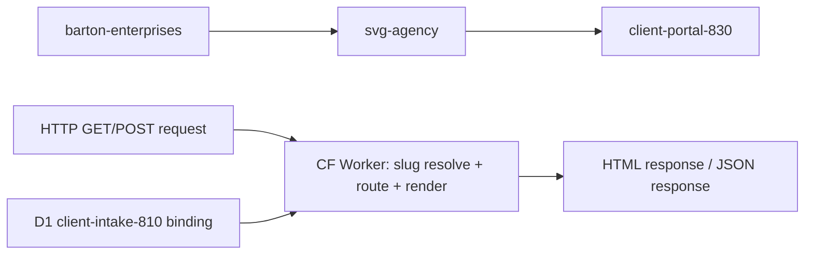
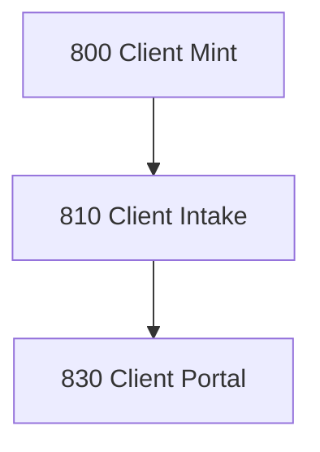

# CLIENT PORTAL
## Renders audience-specific HTML pages for each client, branded per client record, served at app.svgagency.com/:slug/:page
### Status: BUILD
### Medium: process
### Business: svg-agency

## UT Checklist (Pre-Flight - per law/UT_CHECKLIST.md v1.2.0)

| # | Check | Status | Location |
|---|-------|--------|----------|
| 1 | PRD - what / why / who / scope / out-of-scope / success metric | [ ] | §2 |
| 2 | OSAM - READ / WRITE / Process Composition / Join Chain / Forbidden Paths / Query Routing filled | [ ] | §5 |
| 3 | Component Status - every dep has green / yellow / red with 1-line state | [ ] | §3 |
| 4 | Owner - human who fixes this at 2 AM | [ ] | §1 |
| 5 | Live Dashboard - URL or explicit "N/A" | [ ] | §3 |
| 6 | Kill Switch - exact command to stop the process | [ ] | §8 |
| 7 | Logbook - last audit verdict + date (after certification only) | [ ] | §12 |
| 8 | FCEs Attached - which FCE runs structurally back this doc | [ ] | §3c |
| 9 | BARs Referenced - every BAR this doc touches, with status | [ ] | §3d |
| 10 | LBB Subjects Fed - which LBB subject(s) this doc's session logs go to | [ ] | §3e |
| 11 | Geometry - CTB position + Hub-Spoke role + Altitude | [ ] | §1b |
| 12 | Live Verification - every numeric count, cron, URL, command, BAR status grounded against the live system | [ ] | §9b |
| 13 | ctb_node - declared path on the Barton Enterprises CTB trunk | [ ] | §1 Identity |

## §1 IDENTITY {#sec-1-identity}

| Field | Value |
|-------|-------|
| ID | PROC-830 |
| Name | Client Portal |
| Medium | process |
| Business Silo | svg-agency |
| CTB Position | barton-enterprises/svg-agency/client/client-portal |
| ORBT | BUILD |
| Strikes | 0 |
| Authority | inherited - imo-creator-v2 sovereign + Barton-Processes parent |
| Last Modified | 2026-05-08 |
| BAR Reference | BAR-38, BAR-82, BAR-178 |
| Owner | Dave Barton |
| ctb_node | barton-enterprises/svg-agency/client/client-portal |

## §1b GEOMETRY {#sec-1b-geometry}

**CTB Position:** barton-enterprises → svg-agency → client → client-portal (leaf)

**Hub-Spoke Role:** Hub — this is the middle layer that receives HTTP requests (rim/input), resolves slug + routes to page renderer (hub/middle), and emits HTML to browser (rim/output). No processing logic in spokes (transport layer is CF Worker HTTP handling).

**Altitude:** 10k operational — this is a single deployable worker rendering pages for one domain. Not strategic architecture, not atomic execution.



### HEIR (8 fields - Aviation Model, Bedrock §8)

| Field | Value |
|-------|-------|
| sovereign_ref | imo-creator-v2 |
| hub_id | client-portal-830 |
| ctb_placement | leaf |
| imo_topology | egress |
| cc_layer | CC-04 |
| services | CF Worker (HTTP), D1 (shared with 810 — read + ticket writes) |
| secrets_provider | doppler |
| acceptance_criteria | Slug resolves to client_id from shared D1; Unknown slug returns 404; Each page renders with client branding (logo, colors); All pages read-only except agent (ticket status updates); Agent validates status transitions before writing; Server-side HTML — no SPA framework |

## §2 PURPOSE {#sec-2-purpose}

### WHAT
Client Portal (PROC-830) is a Cloudflare Worker that renders five audience-specific HTML pages per client, served at `app.svgagency.com/:slug/:page`. Each page pulls client data from the shared D1 database (process 810) and wraps it in the client's branding. The agent page additionally accepts POST requests to update ticket status.

### WHY
Without this process there is no client-facing view of the data SVG Agency collects and manages. Every upstream process (800 Client Mint, 810 Client Intake) builds the canonical client record but none present it to the audience that needs to act — the client's CEO, HR team, underwriter, or the internal service agent. If this fails, clients have no self-service visibility and every question becomes a phone call.

### WHO
- Client CEO (reads CEO dashboard)
- Client HR team (reads HR portal)
- Stop-loss underwriter (reads underwriting page)
- Client general contacts (reads renewal page)
- SVG Agency service team / Dave's team (reads + writes agent dashboard)
- Ops who reads this doc: Dave Barton

### SCOPE (in)
- Slug-based URL routing: `/:slug/:page` for five fixed page names
- Server-side HTML rendering per page, branded with client logo + colors
- Read-only access to client, plan, plan_quote, person, election, service_request tables
- Agent page ticket status write path (POST `/:slug/agent/ticket/:id/status`)
- Shared D1 binding with process 810 (client-intake-810 database)

### OUT-OF-SCOPE
- Authentication per audience role — not implemented; needs CF Access or token-based auth (see Known Issues, §13)
- Slug auto-generation — slugs are manually set; auto-generation belongs in 800 Client Mint or 810 Client Intake
- Client branding asset storage (logos) — logo_url column exists but R2/CDN integration is not in scope here
- Any SPA framework or client-side data fetching — this is server-side HTML only

### SUCCESS METRIC
All five audience pages render with correct client branding and page-specific data for at least one live slug in production (zero 500 errors, zero blank pages).

## §3 RESOURCES {#sec-3-resources}

Required doctrine references for every process UT:

- `law/UNIFIED_TEMPLATE.md`
- `law/UT_CHECKLIST.md`
- `law/doctrine/PROCESS_FILL_INSTRUCTIONS.md`
- `law/doctrine/HOW_TO_BUILD_ANYTHING.md` (repair manual)
- `law/doctrine/BARTON_ENTERPRISES_WORLD_ATLAS.md` (Atlas System bundle)
- `law/doctrine/KEY.md`

### Component Status Grid

| Component | HEIR (`hub_id · ctb · cc_layer`) | ORBT | Light | State |
|-----------|----------------------------------|------|-------|-------|
| 800 Client Mint | client-mint-800 · leaf · CC-04 | BUILD | yellow | Process exists; client records exist; slug assignment is manual |
| 810 Client Intake | client-intake-810 · leaf · CC-04 | BUILD | yellow | Process exists; D1 database has canonical tables; D1 ID not copied to 830 wrangler.toml yet |
| D1 client-intake-810 | TBV · leaf · CC-03 | BUILD | yellow | Shared D1 bound to 810; database_id not set in 830 wrangler.toml |
| 001_add_slug.sql migration | TBV | BUILD | red | Migration written, not yet executed against production D1 |
| CF Worker runtime | client-portal-830 · leaf · CC-04 | BUILD | yellow | Worker code written (skeleton + mock data); not deployed to production |

### Live Dashboard

| Resource | URL | What it shows |
|----------|-----|---------------|
| Worker health | https://client-portal-830.svg-outreach.workers.dev/health | Process name, number, status |
| Production URL | https://app.svgagency.com/:slug/:page | TBV — not yet live |
| Cloudflare Dashboard | TBV | Worker deployment status, request metrics |

### Dependencies

| Dependency | Type | What It Provides | Status |
|-----------|------|-----------------|--------|
| 800 Client Mint | process | Client record with slug in D1 client table | PENDING (slug assignment manual) |
| 810 Client Intake | process | Canonical D1 tables: plan, plan_quote, person, election, service_request | DONE (process exists) |
| D1 client-intake-810 | database | Shared D1 — all page data reads + agent ticket writes | PENDING (database_id not configured in 830 wrangler.toml) |
| 001_add_slug.sql | migration | slug column + unique index on client table | PENDING (needs execution) |

### Downstream Consumers

| Consumer | What It Needs |
|----------|--------------|
| (none — terminal process) | Renders HTML to browser. No downstream data consumers. |

### Tools & Integrations

| Item | Type | Cost Tier | Credentials | What It Does |
|------|------|-----------|-------------|-------------|
| Cloudflare D1 | database | Free | D1 binding (wrangler.toml) | All page data reads + agent ticket writes |
| CF Worker (HTTP) | compute | Free | none | Server-side HTML rendering, slug-based routing |

### Secrets

| Secret | Doppler Project | Config | Used By |
|--------|----------------|--------|---------|
| (none) | — | — | No external API calls; reads from shared D1 binding only |

### §3c FCEs Attached

| FCE Name | HEIR (`hub_id · ctb · cc_layer`) | ORBT | Run Directory | Latest P=1 | Rows | Status |
|----------|----------------------------------|------|--------------|------------|------|--------|
| N/A — no FCE runs for this process yet | TBV | BUILD | TBV | pending | TBV | red |

### §3d BARs Referenced

| BAR | Title | HEIR (`bar-id · ctb · cc_layer`) | ORBT | Status | Relation |
|-----|-------|----------------------------------|------|--------|----------|
| BAR-38 | TBV | TBV | TBV | TBV | implements |
| BAR-82 | TBV | TBV | TBV | TBV | implements |
| BAR-178 | TBV | TBV | TBV | TBV | implements |

### §3e LBB Subjects Fed

| LBB Subject | HEIR (`subject-id · ctb · cc_layer`) | ORBT | What This Doc Writes | Frequency |
|-------------|--------------------------------------|------|---------------------|-----------|
| svg-client | svg-client · branch · CC-02 | BUILD | session summaries, build progress, known issues | per-run |

## §4 IMO — INPUT, MIDDLE, OUTPUT {#sec-4-imo}

### Two-Question Intake (Bedrock §3)
1. **What triggers this?** User navigates to `app.svgagency.com/:slug/:page` (HTTP GET). Agent page also accepts HTTP POST for ticket status updates.
2. **How do we get it?** Resolve slug to client_id from shared D1 (client-intake-810 database), query page-specific tables, render server-side HTML.

### Input
HTTP request with URL path containing two segments: slug (client identifier) and page (audience view). Slug resolves to a `ClientContext` from the `client` table in D1 (shared with 810). ClientContext provides: client_id, slug, legal_name, label_override, logo_url, color_primary, color_accent, status.

### Middle

| Step | Input | What Happens | Output | Tool Used |
|------|-------|-------------|--------|-----------|
| 1 | HTTP request URL | Parse path into slug + page segments; validate page is one of 5 known values | slug, page strings | CF Worker router |
| 2 | slug | Query `client` table WHERE slug = ?; return ClientContext or null | ClientContext (branding + client_id) or 404 | D1 query |
| 3 | page + client_id | Route to page-specific renderer (renewal, ceo, hr, underwriting, agent) | Raw HTML body for that audience | Page renderer function |
| 4 | HTML body + ClientContext | Wrap body in layout template with client branding (logo, colors, nav) | Full HTML document | layout.ts renderPage() |
| 5 | Full HTML | Return Response with Content-Type text/html | HTTP 200 response | CF Worker |
| 5a | POST /:slug/agent/ticket/:id/status | Validate status transition, update ticket record in D1 | JSON success/error response | D1 write |

### Output
- HTML page rendered with client branding, served to the requesting browser
- For agent POST: JSON response confirming ticket status update
- No downstream data consumers — this is a terminal process

### Circle (Bedrock §5)
No automated feedback loop. The circle closes through human observation: the audience reads the page, identifies issues (wrong data, missing info), and reports back through the agent page's service request system or direct communication. Agent page ticket updates feed back into 810's canonical data (service_request table).

## §5 DATA SCHEMA {#sec-5-data-schema}

### READ Access

| Source | What It Provides | Join Key |
|--------|-----------------|----------|
| client | Slug resolution, branding (label_override, logo_url, color_primary, color_accent), legal_name, status | client.slug (resolution), client.client_id (all pages) |
| plan | Plan details for renewal page | client_id |
| plan_quote | Quote/rate data for renewal and underwriting pages | client_id |
| person | People records for HR page | client_id |
| election | Benefit elections for HR page | client_id |
| service_request | Ticket data for agent page | client_id |

### WRITE Access

| Target | What It Writes | When |
|--------|---------------|------|
| service_request | Ticket status (status column) | POST /:slug/agent/ticket/:id/status — agent page only |

### Process Composition



| Process ID | Name | Role in Composition | Status |
|-----------|------|---------------------|--------|
| PROC-800 | Client Mint | upstream feeder — creates client record with slug | yellow |
| PROC-810 | Client Intake | upstream feeder — populates canonical D1 tables | yellow |
| PROC-830 | Client Portal | this — terminal egress, renders HTML | BUILD |

### Join Chain

```text
client.slug (URL resolution)
  -> client.client_id
    -> plan (client_id — renewal page)
    -> plan_quote (client_id — renewal, underwriting pages)
    -> person (client_id — HR page)
    -> election (client_id — HR page)
    -> service_request (client_id — agent page read + ticket status write)
```

### Forbidden Paths

| Action | Why |
|--------|-----|
| Write to any table except service_request.status | 830 is a read layer; only agent ticket updates allowed (D-830-07) |
| Direct write to client table | Client records owned by 800 Client Mint and 810 Client Intake (D-830-08) |
| Cross-client data access | Each slug resolves to exactly one client_id; no page may query data outside that client_id (D-830-03) |
| POST to any non-agent path | Only the agent page accepts writes (D-830-06) |

### Query Routing

| Question | Table | Column |
|----------|-------|--------|
| What client does this slug belong to? | client | slug → client_id |
| What is the client's display name? | client | label_override, legal_name |
| What branding to apply? | client | logo_url, color_primary, color_accent |
| What plans does this client have? | plan | client_id |
| What are the current rates? | plan_quote | client_id |
| Who is enrolled? | person, election | client_id |
| What service tickets exist? | service_request | client_id |

## §6 DMJ — DEFINE, MAP, JOIN {#sec-6-dmj}

### §6a DEFINE (Build the Key)

| Element | ID | Format | Description | C or V |
|---------|-----|--------|-------------|--------|
| URL slug | E-830-01 | string (kebab-case) | Client identifier in URL path segment | V |
| Page name | E-830-02 | enum: renewal, ceo, hr, underwriting, agent | Audience view identifier | C |
| ClientContext | E-830-03 | TypeScript interface | Resolved client record with branding fields | C |
| client_id | E-830-04 | string (UUID or format TBV) | Primary key joining all page data | C |
| display_name | E-830-05 | string | label_override OR legal_name — branding fallback rule | C |
| color_primary | E-830-06 | string (hex, default #1a365d) | Primary brand color | V |
| color_accent | E-830-07 | string (hex, default #3182ce) | Accent brand color | V |
| ticket_id | E-830-08 | string | Service request identifier for agent write path | V |
| ticket_status | E-830-09 | string (valid transitions TBV) | New ticket status on POST | V |
| HTML response | E-830-10 | text/html document | Full rendered page output | V |

### §6b MAP (Connect Key to Structure)

| Source | Target | Transform |
|--------|--------|-----------|
| URL path segment [0] | E-830-01 slug | direct parse |
| URL path segment [1] | E-830-02 page | classify (must match 5-value enum) |
| D1 client table row | E-830-03 ClientContext | direct query by slug |
| ClientContext.client_id | E-830-04 | direct |
| ClientContext.label_override OR legal_name | E-830-05 | logical OR fallback |
| page + client_id | E-830-10 HTML body | renderer function per page |
| ClientContext + HTML body | E-830-10 full document | layout.ts renderPage() |

### §6c JOIN (Path to Spine)

| Join Path | Type | Description |
|-----------|------|-------------|
| client.slug -> client.client_id | direct | slug is the URL key; client_id is the spine |
| client_id -> plan | direct | client_id FK, renewal page |
| client_id -> plan_quote | direct | client_id FK, renewal + underwriting pages |
| client_id -> person | direct | client_id FK, HR page |
| client_id -> election | direct | client_id FK, HR page |
| client_id -> service_request | direct | client_id FK, agent page |

## §7 CONSTANTS & VARIABLES {#sec-7-constants-variables}

### Constants (structure - never changes)
- Five fixed audience pages: renewal, ceo, hr, underwriting, agent (D-830-01)
- Slug-based routing pattern: `/:slug/:page` — two segments, no exceptions (D-830-02)
- Display name rule: `label_override || legal_name` — branding fallback to #1a365d primary, #3182ce accent (D-830-04)
- Read-only default: all pages read-only; only agent page has a write path (ticket status) (D-830-05)
- Server-side HTML: no SPA framework; CF Worker renders full HTML documents (D-830-09)
- Shared D1 with 810: single database binding; 830 adds the slug column; all other schema owned by 810 (D-830-10)
- ClientContext shape: client_id, slug, legal_name, label_override, logo_url, color_primary, color_accent, status (D-830-11)
- Agent CQRS exception: service_request.status is the only WRITE target; all other tables are read-only (D-830-07)

### Variables (fill - changes every run/cycle)
- Which slug is requested (determines which client)
- Which page is requested (determines which renderer)
- Client branding values (logo_url, color_primary, color_accent — different per client)
- Page data (plans, people, tickets — different per client, changes over time)
- Ticket status value on POST (the new status being set by the agent)

## §8 STOP CONDITIONS {#sec-8-stop-conditions}

| Condition | Action |
|-----------|--------|
| Slug not found in D1 | Return 404 — do not guess or fall back (D-830-03) |
| Page segment not in known set (renewal, ceo, hr, underwriting, agent) | Return 404 with valid page list (D-830-01) |
| POST to non-agent path | Return 404 — only agent page accepts writes (D-830-06) |
| POST body missing status field | Return 400 — status required (D-830-06) |
| Invalid status transition on ticket update | Return 400 — reject with reason (D-830-06) |
| D1 query failure | Return 500 — log error, do not render partial page |
| D1 database_id not configured in wrangler.toml | HALT — cannot deploy until binding is set to 810's D1 ID |
| Same page render failure repeats 3x | Troubleshoot/Train -> AD |

### Kill Switch

```text
npx wrangler delete --name client-portal-830
```

(Removes the deployed Worker from Cloudflare. To pause without deletion: undeploy via Cloudflare dashboard -> Workers -> client-portal-830 -> Disable.)

## §9 VERIFICATION {#sec-9-verification}

```text
1. GET /health -> expected: {"process":"PROC-CLIENT-PORTAL","number":830,"status":"ok"}
2. GET / -> expected: 200 with route listing text
3. GET /nonexistent-slug/renewal -> expected: 404 "Client not found"
4. GET /valid-slug/bogus-page -> expected: 404 with valid page list
5. GET /valid-slug/renewal -> expected: 200 HTML with client branding in header
6. GET /valid-slug/ceo -> expected: 200 HTML with CEO-specific data
7. GET /valid-slug/hr -> expected: 200 HTML with people/election data
8. GET /valid-slug/underwriting -> expected: 200 HTML with census data
9. GET /valid-slug/agent -> expected: 200 HTML with service request table
10. POST /valid-slug/agent/ticket/123/status {"status":"resolved"} -> expected: 200 JSON success
11. POST /valid-slug/agent/ticket/123/status {} -> expected: 400 "status required"
```

### Three Primitives Check (Bedrock §1)
1. **Thing** — Does the client record exist with slug, branding columns, and status in D1?
2. **Flow** — Does the slug resolve to client_id, and does client_id reach the page renderer with correct data?
3. **Change** — Does the layout template correctly inject branding (logo, colors, display name) and does each page render the right data for its audience?

## §9b LIVE VERIFICATION LOG {#sec-9b-live-verification}

| Claim | Section | Source of Truth | Verification Command | [ ] | Last Check | Value |
|-------|---------|-----------------|----------------------|-----|-----------|-------|
| Worker responds at /health | §4 | CF Worker logs | `curl https://client-portal-830.svg-outreach.workers.dev/health` | [ ] | TBV | TBV |
| Production URL accessible | §1 | CF Worker | `curl -I https://app.svgagency.com/` | [ ] | TBV | TBV |
| D1 slug column exists on client table | §5 | D1 (client-intake-810) | `npx wrangler d1 execute client-intake-810 --remote --command "PRAGMA table_info(client)" \| grep slug` | [ ] | TBV | TBV |
| Five page routes all return 200 for valid slug | §4 | CF Worker | `curl https://client-portal-830.svg-outreach.workers.dev/{valid-slug}/renewal` (repeat for all 5 pages) | [ ] | TBV | TBV |
| Agent ticket POST returns 200 | §4 | CF Worker | `curl -X POST https://client-portal-830.svg-outreach.workers.dev/{valid-slug}/agent/ticket/{id}/status -d '{"status":"resolved"}'` | [ ] | TBV | TBV |
| BAR-38 Linear status | §3d | Linear | TBV | [ ] | TBV | TBV |
| BAR-82 Linear status | §3d | Linear | TBV | [ ] | TBV | TBV |
| BAR-178 Linear status | §3d | Linear | TBV | [ ] | TBV | TBV |

NOT YET DEPLOYED — gauge spec defined; all live values pending first production run. Queries and tolerance thresholds locked above; populate at OPERATE promotion.

## §10 Operations / Schedule {#sec-10-operations}

**Cron classification:** EVENT-DRIVEN
**Decision date:** 2026-05-08
**Decision authority:** Sovereign (Dave Barton, BAR-MONDAY-16-FLEET-GREEN)

**Schedule:** N/A — event-driven
**Implementation:** HTTP-triggered
**Trigger source (if event-driven):** Client record creation / portal page request (on-demand render)

---

## §10 ANALYTICS {#sec-10-analytics}

### §10a Metrics

| Metric | Unit | Baseline | Target | Tolerance |
|--------|------|----------|--------|-----------|
| Page renders | count/day | BASELINE | TBV | TBV |
| Slug resolution time | ms | BASELINE | <100ms | <500ms |
| 404 rate | % of requests | BASELINE | <5% | <20% |
| Ticket updates | count/day | BASELINE | TBV | TBV |
| 500 error rate | % of requests | BASELINE | 0% | <1% |

### §10b Sigma Tracking

| Metric | Run 1 | Run 2 | Run 3 | Trend | Action |
|--------|-------|-------|-------|-------|--------|
| Page renders | — | — | — | pending | No production runs yet |
| 404 rate | — | — | — | pending | No production runs yet |
| 500 error rate | — | — | — | pending | No production runs yet |

### §10c ORBT Gate Rules

| From | To | Gate |
|------|-----|------|
| BUILD | OPERATE | all metrics within tolerance for 3 runs + auditor sign-off |
| OPERATE | REPAIR | any metric outside tolerance |
| REPAIR | OPERATE | fix + metric back + auditor verification |
| Any (Strike 3) | TROUBLESHOOT_TRAIN | fleet-wide fix -> AD |

## §11 EXECUTION TRACE {#sec-11-execution-trace}

| Field | Format | Required |
|-------|--------|----------|
| trace_id | UUID | Yes |
| run_id | UUID | Yes |
| step | action name | Yes |
| target | measurable | Yes |
| actual | measurable | Yes |
| delta | the gap | Yes |
| status | done / failed / skipped | Yes |
| error_code | text or null | If failed |
| error_message | text or null | If failed |
| tools_used | JSON array | Yes |
| duration_ms | integer | Yes |
| cost_cents | integer | Yes |
| timestamp | ISO-8601 | Yes |
| signed_by | agent or manual | Yes |

### Build Inputs Used

| Source | File | What Was Used |
|--------|------|--------------|
| CLAUDE.md | factory/client/830-client-portal/CLAUDE.md | Process description, pages, API endpoints, dependencies, worker config |
| PROCESS.md | factory/client/830-client-portal/PROCESS.md | IMO, OSAM, C&V, stop conditions, smoke test, analytics |
| README.md | factory/client/830-client-portal/README.md | WIRE-HERE punch list, URL routes, mock data structure |
| heir.yaml | factory/client/830-client-portal/heir.yaml | HEIR 8-field identity, acceptance criteria, pages |
| src/index.ts | factory/client/830-client-portal/src/index.ts | Worker router, POST path, page dispatch |
| src/resolve.ts | factory/client/830-client-portal/src/resolve.ts | ClientContext interface, resolveClient() |
| src/migrations/001_add_slug.sql | factory/client/830-client-portal/src/migrations/001_add_slug.sql | D1 slug migration |
| wrangler.toml | factory/client/830-client-portal/wrangler.toml | Worker name, compatibility date, D1 binding config |

### Back-Propagation Check

| Parent Constant | Conflict Check | Result |
|-----------------|----------------|--------|
| 810 Client Intake D1 schema | 830 reads all 810 canonical tables; shared D1 binding | clean — 830 is read-only on 810 tables except service_request.status |
| 800 Client Mint client record | 830 depends on client.slug existing | clean — dependency declared; slug is a variable, client record is constant |
| IMO-Creator Sovereign (CC-01) | 830 is CC-04 leaf | clean — inherits from sovereign, no conflict |

## §12 LOGBOOK (After Certification Only) {#sec-12-logbook}

No logbook during BUILD.

### Birth Certificate

| Field | Value |
|-------|-------|
| heir_ref | pending certification |
| orbt_entered | BUILD |
| orbt_exited | pending |
| action | pending |
| gates_passed | pending |
| signed_by | pending |
| signed_at | pending |

### Logbook (append-only)

| Date | Actor | Action | What Was Done | Evidence | LBB Record |
|------|-------|--------|---------------|----------|------------|
| 2026-03-29 | Dave Barton | BUILD | Initial PROCESS.md created; IMO, OSAM, C&V, dependencies, known issues documented | PROCESS.md v1.1.0 | none |
| 2026-04-22 | TBV | BUILD | Skeleton wrangler.toml + src/ updated; all screens render with mock data | wrangler.toml skeleton comment | none |
| 2026-04-29 | Sonnet Runner | BUILD | UT v2.7.0 consolidation — PROCESS-UT.md + DOCTRINE.md written; fragments archived | UT consolidation run | pending |
| 2026-05-06 | sonnet-mechanic | BUILD | BAR-830-CONFORM-WIRE — Atlas conformance pass; BS Law Y-junction applied to workflow.yaml; YAML frontmatter added to PROCESS-UT.md; section headers updated to §N format | BAR-830-CONFORM-WIRE MECHANIC-OUTPUT.md | pending |

## §13 FLEET FAILURE REGISTRY {#sec-13-fleet-failure-registry}

| Pattern ID | Location | Error Code | First Seen | Occurrences | Strike Count | Status |
|-----------|----------|-----------|-----------|-------------|-------------|--------|
| FP-830-01 | wrangler.toml | CONFIG_MISSING | 2026-03-29 | 1 | 0 | OPEN — D1 database_id blank; 830 shares 810 D1 but ID not copied |
| FP-830-02 | All pages | AUTH_MISSING | 2026-03-29 | 1 | 0 | OPEN — No auth per audience; any visitor can access any page by slug |
| FP-830-03 | 800 Client Mint | SLUG_MANUAL | 2026-03-29 | 1 | 0 | OPEN — Slugs must be manually set on client records |
| FP-830-04 | logo_url | ASSET_MISSING | 2026-03-29 | 1 | 0 | OPEN — No R2 bucket or CDN for client logos |

## §14 SESSION LOG {#sec-14-session-log}

| Date | Version | Author | Action | Scope |
|------|---------|--------|--------|-------|
| 2026-03-29 | v0.1 | Dave Barton | `CREATE` | Initial PROCESS.md created. Documented IMO, OSAM, C&V, dependencies, known issues. BUILD state. |
| 2026-04-22 | v0.2 | Sonnet Runner | `AMEND` | Skeleton wrangler.toml and src/ updated; all routes render with mock data. |
| 2026-04-29 | v1.0.0 | Sonnet Runner (UT v2.7.0 Consolidation) | `CREATE` | UT v2.7.0 consolidation — PROCESS-UT.md and DOCTRINE.md written; README.md, CLAUDE.md, PROCESS.md archived to _archived-fragments/. |
| 2026-05-06 | v2.1.0 | sonnet-mechanic (BAR-830-CONFORM-WIRE) | `REPAIR` | Atlas conformance pass. BS Law Y-junction applied to workflow.yaml. YAML frontmatter added to PROCESS-UT.md. Section headers updated to §N format. Gate-runner verified P=1. |
| 2026-05-08 | v2.1.1 | Sonnet Mechanic (BAR-MONDAY-16-FLEET-GREEN) | `MIGRATE` | §14 column format migrated to 5-column canonical (UT v2.8.0 / Atlas v2.3.0); verbatim footnotes preserved |
| 2026-05-08 | v2.1.2 | Sonnet Mechanic (BAR-MONDAY-16-FLEET-GREEN) | `STAMP` | §10 Operations/Schedule stamped: EVENT-DRIVEN — HTTP-triggered on client portal page request. Frontmatter version corrected from 1.0.1 to match §1/DocCtrl, then bumped to 2.1.2. Version bumped in 2 locations (frontmatter + DocCtrl). |
| 2026-05-08 | v2.1.3 | Sonnet Mechanic (BAR-MONDAY-16-FLEET-GREEN) | `AMEND` | G03: services field added to outside.heir: [cloudflare-worker, client-hub-d1] (sourced from §1 Identity services row). G06: §9b NOT YET DEPLOYED stamp added — all 8 gauge rows TBV pending first production run; gauge spec and queries locked. Version bumped in 2 locations (no §1 Version row). |

^[ROW-2026-03-29]: 2026-03-29 | Initial PROCESS.md created. Documented IMO, OSAM, C&V, dependencies, known issues. BUILD state. | none
^[ROW-2026-04-22]: 2026-04-22 | Skeleton wrangler.toml and src/ updated; all routes render with mock data. | none
^[ROW-2026-04-29]: 2026-04-29 | UT v2.7.0 consolidation — PROCESS-UT.md and DOCTRINE.md written; README.md, CLAUDE.md, PROCESS.md archived to _archived-fragments/. | pending
^[ROW-2026-05-06]: 2026-05-06 | BAR-830-CONFORM-WIRE — Atlas conformance pass. BS Law Y-junction applied to workflow.yaml. YAML frontmatter added to PROCESS-UT.md. Section headers updated to §N format. Gate-runner verified P=1. | pending

## Document Control

| Field | Value |
|-------|-------|
| Created | 2026-03-29 |
| Last Modified | 2026-05-08 |
| Version | v2.1.3 |
| Template Version | 2.8.0 |
| Medium | process |
| US Validated | pending |
| Governing Engine | law/doctrine/FOUNDATIONAL_BEDROCK.md + law/doctrine/DMJ.md |
