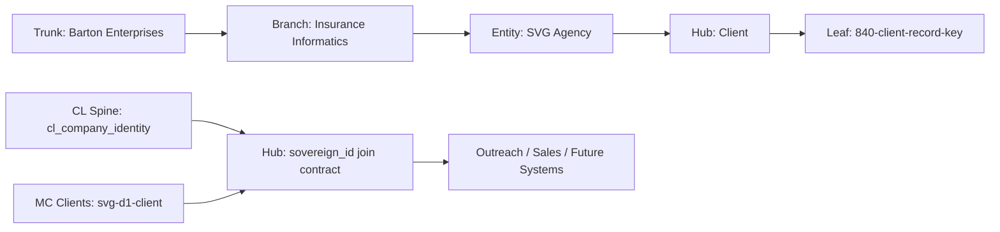

# Client Record Key — Canonical Client Record Schema
## K=C vocabulary lock for client identity across all systems. Every system holding client data uses these fields and joins via sovereign_id.
### Status: BUILD
### Medium: doctrine
### Business: svg-agency

## 📋 UT Checklist (Pre-Flight — per atlas/constants/UT_CHECKLIST.md v1.3.1)

| # | Check | Status | Location |
|---|-------|--------|----------|
| 1 | PRD — what / why / who / scope / out-of-scope / success metric | ☑ | §2 |
| 2 | OSAM — READ / WRITE / Process Composition / Join Chain / Forbidden / Query Routing filled | ☑ | §5, §6, §9 |
| 3 | Component Status — every dep 🟢 / 🟡 / 🔴 with 1-line state | ☑ | §3 |
| 4 | Owner — human who fixes this at 2 AM | ☑ | §1 |
| 5 | Live Dashboard — URL or explicit "N/A" | ☑ | §3 |
| 6 | Kill Switch — exact command to stop the process | ☑ | §8 |
| 7 | Logbook — last audit verdict + date (after certification only) | ☐ | §12 — legitimately ☐ during BUILD |
| 8 | FCEs Attached — which FCE runs structurally back this doc | ☑ | §3c |
| 9 | BARs Referenced — every BAR this doc touches, with status | ☑ | §3d |
| 10 | LBB Subjects Fed — which LBB subject(s) this doc's session logs go to | ☑ | §3e |
| 11 | Geometry — CTB position + Hub-Spoke role + Altitude | ☑ | §1b |
| 12 | Live Verification — every numeric count, cron, URL, command, BAR status grounded against the actual system | ☑ | §9b |
| 13 | ctb_node — declared path to this doc's position on the Barton Enterprises CTB trunk | ☑ | §1 Identity |

---

# IDENTITY

## 1. IDENTITY

| Field | Value |
|-------|-------|
| ID | CLIENT-RECORD-KEY |
| Name | Client Record Key — Canonical Client Record Schema |
| Medium | doctrine |
| Business Silo | svg-agency (cross-cutting — touches CL spine, MC clients, future outreach, sales pipeline) |
| CTB Position | barton-enterprises/insurance-informatics/svg-agency/hub:client/840-client-record-key |
| ORBT | BUILD |
| Strikes | 0 |
| Authority | Sovereign (CC-01) — extends from law/doctrine/KEY.md |
| Version | 2.1.0 |
| Last Modified | 2026-05-12 |
| BAR Reference | BAR-178 (DB-CLIENT origin) |
| Owner | Dave Barton |
| ctb_node | barton-enterprises/insurance-informatics/svg-agency/hub:client/840-client-record-key |

### 1b. Geometry

**CTB Position:** Barton Enterprises → Insurance Informatics → SVG Agency → Hub: Client → 840-client-record-key (leaf)

**Hub-Spoke Role:** hub (this doc IS the Middle — the vocabulary lock all systems conform to)

**Altitude:** 30k tactical (one branch — client data contracts, cross-system)



### HEIR (8 fields)

| Field | Value |
|-------|-------|
| sovereign_ref | imo-creator |
| hub_id | DB-CLIENT |
| ctb_placement | leaf |
| imo_topology | middle |
| cc_layer | CC-03 |
| services | none (doctrine doc — no infrastructure) |
| secrets_provider | none |
| acceptance_criteria | All 4 schemas inventoried, canonical field table complete (48 fields), sovereign_id declared as universal join key, ingest checklist with order enforcement, all new systems must register field mappings before going live |

---

# CONTRACT

## 2. PURPOSE

### WHAT
This document locks the canonical vocabulary for any record representing a client company across all Barton Enterprise systems. It defines every field, its format, its source of truth, and whether it is required. Any system holding client data MUST conform to this schema or declare a bridged join.

### WHY
Client data lives in at least four distinct systems: the CL spine (sovereign identity), Mission Control clients table (operational data), MC client_contacts (contacts), and MC client_interactions (touchpoints). Without one locked vocabulary, every cross-system query is guesswork — field names diverge, ownership is unclear, and JOINs rely on tribal knowledge. This is the K=C lock that makes every system readable.

### WHO
- LCS Hub compiler (reads sovereign identity, joins outreach actions to client spine)
- Mission Control API (reads/writes client operational data)
- Email triage (matches incoming email to client_contacts, logs to client_interactions)
- Future: outreach pipelines, sales pipeline, vendor/TPA records

### SCOPE (in)
- Canonical definition of every field in the client record across all current systems
- Ownership declaration: which system is the source of truth for each field
- Universal join key: sovereign_id (client_id in MC, company_unique_id in CL spine)
- Ingest checklist for loading a new client
- Template for future record-schema K=C locks (Vendor Record Key, Contact Record Key, Deal Record Key)

### OUT-OF-SCOPE
- Contact-level fields as a standalone document (see future: CONTACT_RECORD_KEY) — included here as cross-reference only
- Interaction/touchpoint fields as a standalone document (see future: INTERACTION_RECORD_KEY) — included here as cross-reference only
- Vendor fields (see future: VENDOR_RECORD_KEY)
- Sales pipeline fields (see future: DEAL_RECORD_KEY)

### SUCCESS METRIC
Every cross-system client JOIN resolves via sovereign_id with zero ambiguity. No field mapping question requires manual lookup.

---

## 3. RESOURCES

### Component Status Grid

| Component | HEIR | ORBT | Light | State |
|-----------|------|------|-------|-------|
| CL Spine (cl_company_identity) | svg-d1-spine · leaf · CC-03 | BUILD | green | 32,702 rows seeded, primary identity spine |
| MC Clients (svg-d1-client.clients) | DB-CLIENT · leaf · CC-03 | BUILD | green | Operational client table, BAR-178 |
| MC client_contacts | DB-CLIENT · leaf · CC-03 | BUILD | green | Email join key table, exists in migration 0005 |
| MC client_interactions | DB-CLIENT · leaf · CC-03 | BUILD | green | Touchpoint log table, exists in migration 0005 |
| Mission Control API (spine routes) | mission-control-api · leaf · CC-03 | BUILD | green | /spine/companies reads cl_company_identity |

### Live Dashboard

| Resource | URL | What it shows |
|----------|-----|---------------|
| Spine summary | https://mission-control-api.svg-outreach.workers.dev/spine/companies/summary | cl_company_identity counts by identity_status |
| MC clients | N/A (internal D1, admin wrangler only) | clients table row count |

### 3c. FCEs Attached

| FCE Name | HEIR | ORBT | Status |
|----------|------|------|--------|
| US (Universal Structure) | factory/agents/up/us.py · branch · CC-02 | OPERATE | green |
| K=C (Key = Constant lock) | law/doctrine/KEY.md · trunk · CC-01 | OPERATE | green |

### 3d. BARs Referenced

| BAR | Title | ORBT | Status | Relation |
|-----|-------|------|--------|----------|
| BAR-178 | DB-CLIENT Hub | BUILD | In Progress | This doc governs the schema BAR-178 implemented |

### 3e. LBB Subjects Fed

| LBB Subject | ORBT | What This Doc Writes | Frequency |
|-------------|------|---------------------|-----------|
| system | BUILD | Schema lock decisions, doctrine changes | on-change |
| svg-client | BUILD | Client record structure updates | on-change |

---

## 4. IMO

### Two-Question Intake
1. **"What triggers this?"** — Any system needs to read, write, or JOIN client data across DB boundaries
2. **"How do we get it?"** — Systems query via sovereign_id; this doc is the lookup table for what every field means and who owns it

### Input
A client company identity — sourced from the CL spine (sovereign record) or from MC clients (operational record).

### Middle
The vocabulary lock. When any system receives a client record, it maps the incoming fields against this KEY to determine: what is this field called? who owns it? which system is authoritative?

### Output
A correctly joined, correctly attributed client record. No ambiguity about field ownership or source of truth.

### Circle
As new systems are added (outreach, sales, TPA), they declare their field mappings against this KEY. If a new field emerges that isn't here, this doc is updated and the update back-propagates to all consumers.

---

## 5. CONTRACT — Canonical Field Table

_This is the vocabulary lock. 48 unique fields across all 4 schemas. Source of Truth declares ownership._

### 5a. HEIR / Identity Fields (present on all MC records)

| Field | CL Spine | MC clients | MC contacts | MC interactions | Source of Truth | Required | Format | Notes |
|-------|----------|------------|-------------|-----------------|-----------------|----------|--------|-------|
| sovereign_id | company_unique_id (UUID PK) | sovereign_id (TEXT FK) | — | — | CL Spine | YES | UUID | The universal join key. CL calls it company_unique_id; MC calls it sovereign_id. Same value. |
| sovereign_ref | — | sovereign_ref (TEXT) | sovereign_ref (TEXT) | sovereign_ref (TEXT) | MC (HEIR constant) | YES | 'imo-creator' | HEIR field — identifies the garage that owns this record |
| hub_id | — | hub_id (TEXT) | hub_id (TEXT) | hub_id (TEXT) | MC (HEIR constant) | YES | 'DB-CLIENT' | HEIR field — identifies the hub |
| cc_layer | — | cc_layer (TEXT) | cc_layer (TEXT) | cc_layer (TEXT) | MC (HEIR constant) | YES | 'CC-03' | HEIR field — context layer |
| ctb_placement | — | ctb_placement (TEXT) | ctb_placement (TEXT) | ctb_placement (TEXT) | MC (HEIR constant) | YES | 'leaf' | HEIR field — position on CTB |
| orbt_mode | — | orbt_mode (TEXT) | orbt_mode (TEXT) | orbt_mode (TEXT) | MC | YES | BUILD / OPERATE / REPAIR / TROUBLESHOOT_TRAIN | ORBT state machine |
| strike_count | — | strike_count (INTEGER) | strike_count (INTEGER) | strike_count (INTEGER) | MC | YES | integer ≥ 0 | Strike counter for ORBT escalation |

### 5b. Company Identity Fields

| Field | CL Spine | MC clients | Source of Truth | Required | Format | Notes |
|-------|----------|------------|-----------------|----------|--------|-------|
| company_name | company_name (TEXT NOT NULL) | company_name (TEXT NOT NULL) | CL Spine | YES | TEXT | Canonical company name. CL is authoritative. |
| company_domain | company_domain (TEXT) | company_domain (TEXT) | CL Spine | CONDITIONAL | TEXT | Required by CL admission gate unless linkedin_url present |
| linkedin_company_url | linkedin_company_url (TEXT) | — | CL Spine | CONDITIONAL | URL | Required by CL admission gate unless domain present |
| canonical_name | canonical_name (TEXT) | — | CL Spine (D1) | NO | TEXT | Normalized/cleaned version of company_name |
| outreach_id | outreach_id (TEXT) | — | CL Spine | NO | TEXT | Cross-link to svg-d1-outreach-ops tables |
| source_system | source_system (TEXT NOT NULL) | — | CL Spine | YES (CL) | TEXT | Provenance of the CL record — which feed sourced it |
| ein | — | ein (TEXT) | MC clients | NO | TEXT | Employer Identification Number — benefits domain |
| industry | — | industry (TEXT) | MC clients | NO | TEXT | Industry classification |
| employee_count | — | employee_count (INTEGER) | MC clients | NO | INTEGER | Headcount |
| employee_count_band | employee_count_band (TEXT) | — | CL Spine (D1) | NO | TEXT | Bucketed headcount (e.g., '50-99') |

### 5c. Client Lifecycle / Operational Fields

| Field | CL Spine | MC clients | Source of Truth | Required | Format | Notes |
|-------|----------|------------|-----------------|----------|--------|-------|
| lifecycle_stage | — | lifecycle_stage (TEXT) | MC clients | YES (MC) | prospect / onboarding / active / renewal / churned | SVG Agency client relationship state — not present in CL spine |
| identity_status | identity_status (TEXT) | — | CL Spine (D1) | NO | TEXT | Outreach pipeline identity verification state |
| identity_pass | identity_pass (TEXT) | — | CL Spine (D1) | NO | TEXT | Which pass last touched this CL record |
| state_match_result | state_match_result (TEXT) | — | CL Spine (D1) | NO | TEXT | DOL/state match validation result |
| existence_verified | existence_verified (TEXT) | — | CL Spine (D1) | NO | TEXT | Whether company existence has been verified |
| notes | — | notes (TEXT) | MC clients | NO | TEXT | Free-form operational notes |

### 5d. Timestamp Fields

| Field | CL Spine | MC clients | Source of Truth | Required | Format | Notes |
|-------|----------|------------|-----------------|----------|--------|-------|
| created_at | created_at (TIMESTAMPTZ) | created_at (TEXT) | Own system | YES | ISO-8601 | Each system stamps its own |
| updated_at | — | updated_at (TEXT) | MC clients | YES (MC) | ISO-8601 | MC tracks update; CL spine is append-only |
| onboarded_at | — | onboarded_at (TEXT) | MC clients | NO | ISO-8601 | When client became an active client |
| last_pass_at | last_pass_at (TEXT) | — | CL Spine (D1) | NO | ISO-8601 | Last time LCS pipeline touched this row |
| vaulted_at | — | vaulted_at (TEXT) | MC clients | NO | ISO-8601 | Reserved column on the `clients` table. Single-tier model (2026-05-12) — svg-d1-client.clients is canonical, no Neon vault tier; this column is unused/reserved (NULL forever). bp.800 never populates it (D-800-08). |

### 5e. Internal System PKs (not part of canonical join — system-internal only)

| Field | System | Format | Notes |
|-------|--------|--------|-------|
| client_id | MC clients | TEXT (UUID-style PK) | MC-internal PK — not the join key. Use sovereign_id to cross-system join. |
| contact_id | MC client_contacts | TEXT (UUID-style PK) | Identifies a specific contact person |
| interaction_id | MC client_interactions | TEXT (UUID-style PK) | Identifies a single touchpoint event |

### 5f. Contact-Level Fields (cross-reference — full doc: future CONTACT_RECORD_KEY)

_These fields exist on MC client_contacts. Included here for cross-schema completeness. Not owned by this KEY — subject to CONTACT_RECORD_KEY when built._

| Field | System | Required | Format | Notes |
|-------|--------|----------|--------|-------|
| full_name | MC client_contacts | YES | TEXT | Contact person's full name |
| email | MC client_contacts | YES | TEXT | Primary email — join key for email triage |
| email_secondary | MC client_contacts | NO | TEXT | Alternate email address |
| phone | MC client_contacts | NO | TEXT | Phone number |
| role | MC client_contacts | NO | TEXT | Job title or role |
| is_primary | MC client_contacts | YES | INTEGER (0/1) | Flags the primary contact for a client |
| is_billing | MC client_contacts | NO | INTEGER (0/1) | Flags the billing contact for a client |
| is_decision_maker | MC client_contacts | NO | INTEGER (0/1) | Flags the decision-maker contact for a client |

### 5g. Interaction-Level Fields (cross-reference — full doc: future INTERACTION_RECORD_KEY)

_These fields exist on MC client_interactions. Included here for cross-schema completeness. Not owned by this KEY — subject to INTERACTION_RECORD_KEY when built._

| Field | System | Required | Format | Notes |
|-------|--------|----------|--------|-------|
| interaction_type | MC client_interactions | YES | TEXT | Type of touchpoint (email, call, meeting, etc.) |
| subject | MC client_interactions | NO | TEXT | Subject line or title of interaction |
| body_snippet | MC client_interactions | NO | TEXT | Brief content excerpt |
| source_message_id | MC client_interactions | NO | TEXT | Email message ID for thread linking |
| direction | MC client_interactions | YES | TEXT | inbound / outbound / internal |
| occurred_at | MC client_interactions | YES | ISO-8601 | When the interaction happened |
| interaction_state | MC client_interactions | NO | TEXT | Processing state of the interaction (e.g. pending / processed / error) |
| contact_id_fk | MC client_interactions | NO | TEXT (FK) | FK to client_contacts — links interaction to the specific contact involved |
| resolved | MC client_interactions | NO | INTEGER (0/1) | Whether the interaction requires follow-up |

**Total unique fields across all 4 schemas: 48** (7 HEIR + 10 company identity + 6 lifecycle/op + 5 timestamps + 3 PKs + 8 contact-level + 9 interaction-level)

---

## 6. JOIN CONTRACT

### Universal Join Key

**sovereign_id** is the universal join key across all client-touching systems.

| System | Field Name | Type | Role |
|--------|-----------|------|------|
| CL Spine (cl_company_identity) | company_unique_id | UUID (PK) | The sovereign identity — never changes |
| MC clients | sovereign_id | TEXT (FK) | Points at company_unique_id in CL spine |
| MC client_contacts | client_id | TEXT (FK) | Points at client_id in MC clients — indirect join to sovereign |
| MC client_interactions | client_id | TEXT (FK) | Points at client_id in MC clients — indirect join to sovereign |
| Future systems | sovereign_id | TEXT (FK) | All future systems must carry sovereign_id and join via it |

### Join Chain

```
cl_company_identity (company_unique_id)
  → clients (sovereign_id = company_unique_id)
    → client_contacts (client_id)
      → client_interactions (client_id, contact_id)
```

### Cross-System Query Pattern

To get all interactions for a company known by its CL spine ID:
```sql
-- Starting from sovereign identity
SELECT ci.*
FROM cl_company_identity cli
JOIN clients c ON c.sovereign_id = cli.company_unique_id
JOIN client_interactions ci ON ci.client_id = c.client_id
WHERE cli.company_unique_id = ?;
```

To get a client record from its domain:
```sql
-- Domain-first lookup (CL spine is authoritative on domain)
SELECT c.*, cli.company_unique_id as sovereign_id
FROM cl_company_identity cli
JOIN clients c ON c.sovereign_id = cli.company_unique_id
WHERE cli.company_domain = ?;
```

### Forbidden Paths

| Action | Why |
|--------|-----|
| JOIN clients to cl_company_identity via company_name | Names drift; domains are stable. Use sovereign_id or company_domain only. |
| Write to cl_company_identity from MC API | CL spine is sovereign-only. MC reads from CL; CL does not receive writes from MC. |
| Create a client record without sovereign_id | Orphan records break every downstream join. If no CL row exists, create one first. |
| Use client_id as a cross-system identifier | client_id is MC-internal. sovereign_id is the only cross-system key. |

### Query Routing

| Business Question | Table | Column |
|------------------|-------|--------|
| Does this company exist in the system? | cl_company_identity | company_domain OR linkedin_company_url |
| What stage is this client? | clients | lifecycle_stage |
| Who are the contacts at this client? | client_contacts | client_id |
| What emails have we exchanged with this client? | client_interactions | client_id + interaction_type |
| What is the outreach history for this company? | cl_company_identity + lcs_cid | company_unique_id → sovereign_company_id |

---

## 7. INTEGRATION — Field Cross-Reference Map

_Which fields appear in which systems._

| Field | CL Spine | MC clients | MC contacts | MC interactions | Notes |
|-------|:--------:|:----------:|:-----------:|:---------------:|-------|
| sovereign_id (company_unique_id) | PK | FK | — | — | The spine. |
| company_name | YES | YES | — | — | Both carry it; CL is authoritative |
| company_domain | YES | YES | — | — | CL is authoritative |
| linkedin_company_url | YES | — | — | — | CL spine only |
| source_system | YES | — | — | — | CL provenance field |
| canonical_name | YES (D1) | — | — | — | CL D1 spine only |
| outreach_id | YES (D1) | — | — | — | Cross-D1 link |
| identity_status | YES (D1) | — | — | — | Outreach pipeline state |
| identity_pass | YES (D1) | — | — | — | Last pipeline pass |
| employee_count_band | YES (D1) | — | — | — | Bucketed count |
| state_match_result | YES (D1) | — | — | — | Validation result |
| existence_verified | YES (D1) | — | — | — | Verification flag |
| last_pass_at | YES (D1) | — | — | — | LCS timestamp |
| lifecycle_stage | — | YES | — | — | MC operational only |
| ein | — | YES | — | — | MC operational only |
| industry | — | YES | — | — | MC operational only |
| employee_count | — | YES | — | — | MC operational (raw) |
| onboarded_at | — | YES | — | — | MC operational only |
| notes | — | YES | — | — | MC operational only |
| HEIR fields (5) | — | YES | YES | YES | MC carries HEIR; CL does not |
| ORBT fields (2) | — | YES | YES | YES | MC carries ORBT; CL does not |
| full_name | — | — | YES | — | Contact-level only |
| email (primary) | — | — | YES | — | Contact-level; join key for email triage |
| email_secondary | — | — | YES | — | Contact-level |
| phone | — | — | YES | — | Contact-level |
| role / title | — | — | YES | — | Contact-level |
| is_primary | — | — | YES | — | Contact-level |
| is_billing | — | — | YES | — | Contact-level |
| is_decision_maker | — | — | YES | — | Contact-level |
| interaction_type | — | — | — | YES | Interaction-level |
| subject / body_snippet | — | — | — | YES | Interaction-level |
| source_message_id | — | — | — | YES | Email triage thread link |
| direction | — | — | — | YES | inbound / outbound / internal |
| occurred_at | — | — | — | YES | Interaction timestamp |
| interaction_state | — | — | — | YES | Processing state |
| contact_id_fk | — | — | — | YES | Links interaction to contact |
| resolved | — | — | — | YES | Interaction resolution flag |

---

## 8. INGEST CHECKLIST

_Loading a new client into the system. Required fields first, optional second._

### Step 1 — Establish CL Spine Record (sovereign identity)
Required: company_name, AND at least one of (company_domain OR linkedin_company_url), AND source_system.

```sql
-- Via wrangler (CL spine is on svg-d1-spine)
-- Replace values in ALL_CAPS

INSERT INTO cl_company_identity (
  company_unique_id, company_name, company_domain, linkedin_company_url, source_system, created_at
) VALUES (
  lower(hex(randomblob(16))),  -- UUID substitute for D1
  'COMPANY_NAME',
  'DOMAIN.COM',       -- NULL if not known (but linkedin_url must then be present)
  NULL,               -- or 'https://linkedin.com/company/...'
  'manual-ingest',
  datetime('now')
);
```

### Step 2 — Create MC Clients Record (operational identity)
Required: client_id (UUID), company_name, sovereign_id (from step 1 output).

```sql
-- Via MC API POST /clients, or direct wrangler on svg-d1-client

INSERT INTO clients (
  client_id, sovereign_ref, hub_id, cc_layer, ctb_placement,
  company_name, company_domain, sovereign_id, lifecycle_stage,
  orbt_mode, strike_count, created_at, updated_at
) VALUES (
  lower(hex(randomblob(16))),
  'imo-creator', 'DB-CLIENT', 'CC-03', 'leaf',
  'COMPANY_NAME',
  'DOMAIN.COM',
  'SOVEREIGN_ID_FROM_STEP_1',
  'onboarding',
  'BUILD', 0,
  datetime('now'), datetime('now')
);
```

### Step 3 — Add Primary Contact (optional but strongly recommended)
Required: contact_id, client_id, full_name, email.

```sql
INSERT INTO client_contacts (
  contact_id, sovereign_ref, hub_id, cc_layer, ctb_placement,
  client_id, full_name, email, role, is_primary,
  orbt_mode, strike_count, created_at, updated_at
) VALUES (
  lower(hex(randomblob(16))),
  'imo-creator', 'DB-CLIENT', 'CC-03', 'leaf',
  'CLIENT_ID_FROM_STEP_2',
  'FULL NAME',
  'email@domain.com',
  'Primary Contact',
  1,
  'BUILD', 0,
  datetime('now'), datetime('now')
);
```

### Optional Fields (add after core record is created)
- `ein` — add to clients record if known (benefits setup)
- `industry`, `employee_count`, `notes` — operational enrichment
- `onboarded_at` — set when lifecycle_stage moves to 'active'
- Additional contacts — add via Step 3 pattern with is_primary = 0

### Stop Conditions

| Condition | Action |
|-----------|--------|
| New client has no CL spine row | HALT ingest — create CL row first |
| sovereign_id is NULL on a clients record | HALT — orphan record, must be resolved |
| Join on sovereign_id returns no row | HALT — data integrity failure, log to clients_error |
| company_domain AND linkedin_url both NULL on CL row | HALT — violates CL admission gate |

### Kill Switch
This is a doctrine doc — no running process. Kill switch not applicable. To revoke a client:
```sql
-- Soft-delete in MC clients (never delete from CL spine)
UPDATE clients SET lifecycle_stage = 'churned', orbt_mode = 'REPAIR', updated_at = datetime('now')
WHERE client_id = 'CLIENT_ID';
```

---

# GOVERNANCE

## 9. PERMISSIONS

| System | Table | Read | Write | Authority |
|--------|-------|------|-------|-----------|
| CL Spine (svg-d1-spine) | cl_company_identity | LCS Hub compiler, MC API spine routes, any worker via D1_SPINE binding | LCS seed process (from Neon vault) ONLY | Sovereign — no direct writes except seed |
| MC Clients (svg-d1-client) | clients | MC API, Claude wrangler admin | MC API POST/PATCH /clients, wrangler admin | CC-03 operational — MC API is the write path |
| MC Clients | client_contacts | MC API email triage routes | MC API email triage (auto-create on email match) | CC-03 operational |
| MC Clients | client_interactions | MC API client routes | MC API email triage (auto-log), wrangler admin | CC-03 operational — append-only in practice |

### Write Rules
1. CL spine writes = sovereign-only. No MC operation writes to cl_company_identity except the seed sync.
2. New clients go into MC clients first, then sovereign_id is populated from CL spine.
3. If a client company doesn't exist in CL spine, create the CL row first (Step 1), then MC row (Step 2).
4. Contacts are MC-only — CL spine does not hold person-level data.
5. Interactions are MC-only — CL spine does not log touchpoints.

### Live Verification Log

| Claim / Field | Section | Source of Truth | Verification Command | Verified? | Last Check | Value at Check |
|---------------|---------|-----------------|----------------------|-----------|-----------|----------------|
| cl_company_identity row count ~32,702 | §3 | svg-d1-spine | `SELECT COUNT(*) FROM cl_company_identity` | ☐ | — | — |
| clients table exists in svg-d1-client | §3 | svg-d1-client (live) | `SELECT sql FROM sqlite_master WHERE type='table' AND name='clients'` | ☑ | 2026-05-12 | Table exists; columns: client_id, sovereign_ref, hub_id, cc_layer, ctb_placement, company_name, company_domain, ein, sovereign_id, lifecycle_stage, industry, employee_count, notes, orbt_mode, strike_count, onboarded_at, created_at, updated_at |
| client_contacts table exists | §3 | svg-d1-client (live) | `SELECT sql FROM sqlite_master WHERE type='table' AND name='client_contacts'` | ☑ | 2026-05-12 | Table exists; full schema confirmed including title field (separate from role) |
| client_interactions table exists | §3 | svg-d1-client (live) | `SELECT sql FROM sqlite_master WHERE type='table' AND name='client_interactions'` | ☑ | 2026-05-12 | Table exists; has source_thread_id (not in §5g cross-ref — informational drift) |
| clients_error table exists | §3 | svg-d1-client (live) | `SELECT sql FROM sqlite_master WHERE type='table' AND name='clients_error'` | ☑ | 2026-05-12 | Table exists; columns: error_id, client_id, error_code, error_message, sender_email, raw_subject, payload_snapshot, created_at |
| sovereign_id FK present on clients table | §5 | svg-d1-client (live) | `SELECT sql FROM sqlite_master WHERE name='clients'` | ☑ | 2026-05-12 | sovereign_id TEXT column confirmed present |
| vaulted_at column on clients table | §5d | svg-d1-client (live) | `SELECT sql FROM sqlite_master WHERE name='clients'` | ☑ | 2026-05-12 | Added via `ALTER TABLE clients ADD COLUMN vaulted_at TEXT` — Part B Step B1 |

### Verification Queries

```
1. SELECT company_unique_id FROM cl_company_identity WHERE company_domain = 'test-domain.com'
   → expected: returns UUID (sovereign_id)

2. SELECT client_id FROM clients WHERE sovereign_id = '<uuid_from_step_1>'
   → expected: returns MC client_id

3. SELECT contact_id FROM client_contacts WHERE client_id = '<client_id_from_step_2>' AND is_primary = 1
   → expected: returns primary contact

4. SELECT COUNT(*) FROM client_interactions WHERE client_id = '<client_id_from_step_2>'
   → expected: returns interaction count (0+ rows)

5. Attempt: INSERT INTO clients WHERE sovereign_id IS NULL
   → expected: this SHOULD be caught by application logic (no DB constraint yet — note for future migration)
```

**Three Primitives Check:**
1. **Thing:** Does cl_company_identity exist with rows? Does clients table exist? Do client_contacts and client_interactions exist? Are all four schemas inventoried?
2. **Flow:** Does sovereign_id flow from CL spine into clients? Does client_id flow from clients into contacts and interactions?
3. **Change:** Does lifecycle_stage update correctly as a client moves through the funnel? Does orbt_mode update on repair triggers?

---

## 10. ANALYTICS

### 10a. Metrics

| Metric | Unit | Baseline | Target | Tolerance |
|--------|------|----------|--------|-----------|
| Cross-system JOIN success rate | % | BASELINE | 100% | 0 orphaned clients |
| Clients with sovereign_id populated | % | BASELINE | 100% | 0 NULL sovereign_id rows |
| Clients with at least 1 primary contact | % | BASELINE | measured | >90% |

### 10b. Sigma Tracking

| Metric | v1.0.0 | v2.1.0 | Trend | Action |
|--------|--------|--------|-------|--------|
| Fields cataloged | 47 | 48 | STABLE | Lock when verified live |
| Systems inventoried | 4 | 4 | STABLE | Add outreach/sales when live |

### 10c. ORBT Gate Rules

| From | To | Gate |
|------|-----|------|
| BUILD | OPERATE | All 4 schemas verified live, canonical field table confirmed, auditor sign-off |
| OPERATE | REPAIR | Any new system adds fields not in this KEY without updating it |

---

## 11. EXECUTION TRACE

_Append-only. Mechanic logs actions here._

| trace_id | step | target | actual | status | timestamp | signed_by |
|----------|------|--------|--------|--------|-----------|-----------|
| TRACE-840-001 | Phase 1 - Schema Inventory (v1.0.2) | 4 schemas from migrations + docs | Inventoried from migrations 0003_client.sql, 0005_client_full.sql, CL neon/001, D1 spine routes | done | 2026-04-30 | claude-sonnet-4-6 |
| TRACE-840-002 | Phase 2 - Canonical Field Table (v1.0.2) | Master field list with ownership | 47 fields cataloged across 4 schemas (including contact/interaction cross-ref) | done | 2026-04-30 | claude-sonnet-4-6 |
| TRACE-840-003 | Phase 3 - Migrate to 840 Barton Process pattern | Decompose v1.0.2 into 4-file pattern matching 810 | DOCTRINE.md + heir.yaml + orbt.yaml + PROCESS-UT.md created in factory/client/840-client-record-key/ | done | 2026-04-30 | claude-sonnet-4-6 |

---

## 12. LOGBOOK (After Certification Only)

_No logbook during BUILD. Created when auditor certifies._

---

## 13. FLEET FAILURE REGISTRY

| Pattern ID | Location | Error Code | First Seen | Occurrences | Strike Count | Status |
|-----------|----------|-----------|-----------|-------------|-------------|--------|
| — | — | — | — | — | — | No failures recorded yet |

**Strike 1:** Repair. **Strike 2:** Scrutiny. **Strike 3:** Troubleshoot/Train → Airworthiness Directive.

---

## 14. MAINTENANCE LOGBOOK (doc's own logbook — FAA-grade)

_Every touch on this doc is a maintenance action. Every action leaves a signed, timestamped row with evidence. Append-only. A new reader picks up the doc and sees the full maintenance history._

### Action Types

| Type | Meaning |
|------|---------|
| RETROFIT | UT structure / template upgrade applied |
| VERIFY | Claim grounded against live system (§9 Live Verification Log row ticked) |
| AUDIT | FAA Inspector (auditor) pass — PASS / FAIL recorded |
| EDIT | Content change (new step added, schema changed, etc.) |
| CERTIFY | Moved ORBT state (e.g., BUILD → OPERATE) |
| REPAIR | Post-strike fix |
| STRIKE | Fleet failure recorded (§13) |
| LBB_INGEST | Session summary written to LBB |
| MIGRATE | Content migrated from prior doc to new structure |

### Logbook (append-only — never edit past rows)

| Date (ISO) | Actor | Action | What Was Done | Evidence | LBB Record |
|-----------|-------|--------|---------------|----------|------------|
| 2026-04-30 | claude-sonnet-4-6 | EDIT | Initial doc creation (v1.0.2) — 14 sections, 3 clusters, 35-field claim | TRACE-840-001 through TRACE-840-002 | pending |
| 2026-04-30 | claude-sonnet-4-6 | REPAIR | Codex audit P=0 on v1.0.x: fixed §8b/§9b illegal sub-letters, expanded §5 to 43 fields, added §13, moved Doc Control into §1; updated field count 35→43 | HEIR: CLIENT_RECORD_KEY_v1.0.1 | pending |
| 2026-04-30 | claude-sonnet-4-6 | REPAIR | Sentinel repair: added 4 missing §5 fields (is_billing, is_decision_maker, interaction_state, contact_id_fk); updated count 43→47 | HEIR: CLIENT_RECORD_KEY_v1.0.1 | pending |
| 2026-04-30 | claude-sonnet-4-6 | REPAIR | Restored missing Document Control trailer; bumped version 1.0.1→1.0.2 | HEIR: CLIENT_RECORD_KEY_v1.0.2 | pending |
| 2026-04-30 | claude-sonnet-4-6 | MIGRATE | v1.0.2 doctrine doc decomposed into Barton Process 840 (4-file pattern matching 810). DOCTRINE.md + heir.yaml + orbt.yaml + PROCESS-UT.md created in Barton-Processes/factory/client/840-client-record-key/. Version bumped to 2.0.0 (major — new artifact structure). ctb_node updated to barton-enterprises/insurance-informatics/svg-agency/hub:client/840-client-record-key. | HEIR: CLIENT_RECORD_KEY_v2.0.0; engine=K=C; mode=BUILD | pending |
| 2026-05-12 | claude-sonnet-4-6 | EDIT | BAR-bp840 — verified §5 canonical field table against live svg-d1-client schema (2026-05-12 wrangler query). All 4 tables confirmed present. Added vaulted_at to §5d Timestamp Fields (two-tier D1↔Neon marker). Bumped field count 47→48 in §5 summary + §10b + §1 HEIR acceptance_criteria + heir.yaml. Updated UT Checklist from v1.2.0 to v1.3.1 format. Ticked items 3/5/8/12 against live DB results. Noted cross-ref drift (§5f: is_billing/is_decision_maker not in live client_contacts; §5g: source_thread_id in live but not cross-ref) — informational, not blocking (cross-ref sections explicitly "not owned by this KEY"). Version bumped 2.0.0→2.1.0. | svg-d1-client schema query 2026-05-12; vaulted_at ALTER TABLE done in Part B | pending |
| 2026-05-12 | claude-sonnet-4-6 | AMEND | bp.800 single-tier adoption — corrected §5d vaulted_at Notes cell: column is reserved/unused (NULL forever), single-tier model, no Neon vault tier, bp.800 never populates it (D-800-08). No version bump — Notes-cell correction only, no schema or field-count change. | bp.800 PROCESS-UT.md v2.2.0 + DOCTRINE.md D-800-08 update (2026-05-12) | pending |

**Rules:**
- Append-only. Do NOT edit or delete prior rows. Corrections go in as a new row referencing the prior row.
- Every entry signed — Actor column is mandatory.
- Every entry with Evidence — "no evidence" rows are rejected by auditor.
- Every CERTIFY entry requires a DIFFERENT actor than the one who did the preceding RETROFIT/EDIT (Aviation Model — mechanic ≠ inspector).
- Missing entries = doc drift. Cold reader can't trust the doc's state.

---

## Document Control

| Field | Value |
|-------|-------|
| Created | 2026-04-30 |
| Last Modified | 2026-05-12 |
| Version | 2.1.0 |
| Template Version | 2.8.0 |
| Medium | doctrine |
| US Validated | pending |
| Governing Engine | law/doctrine/FOUNDATIONAL_BEDROCK.md + law/doctrine/DMJ.md |
| Supersedes | imo-creator-v2/law/doctrine/CLIENT_RECORD_KEY.md v1.0.2 |
