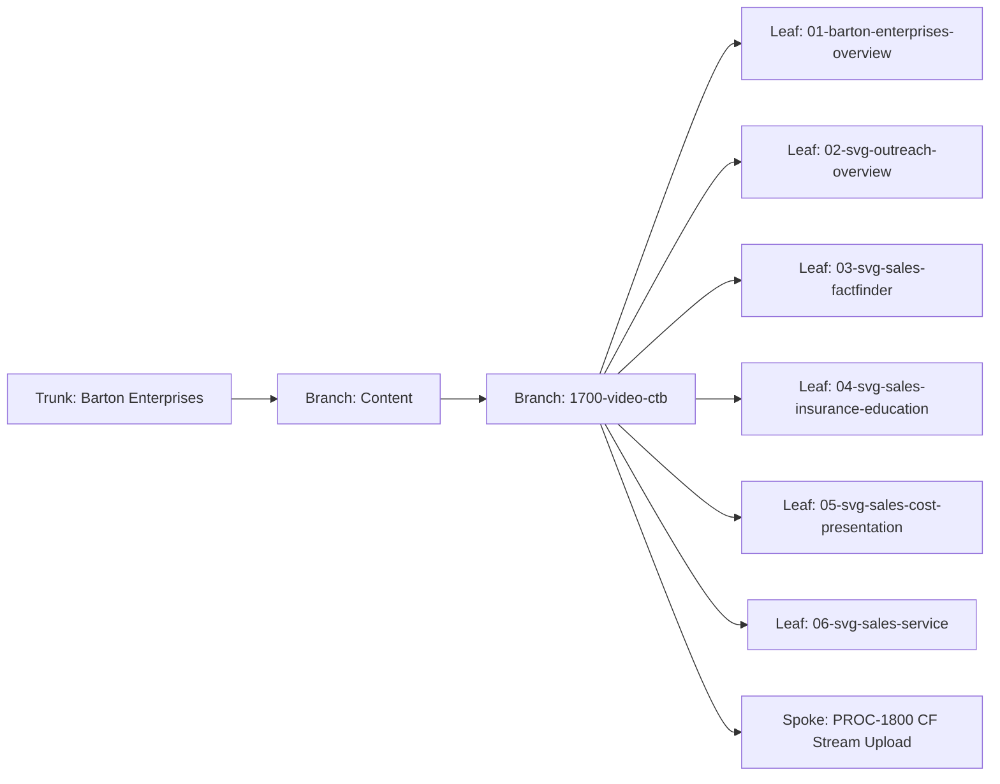

# Video CTB — NotebookLM Video Content Tree
## Produce video artifacts for each CTB node using NotebookLM Studio, then deploy via CF Stream to content-pages.
### Status: BUILD
### Medium: process
### Business: barton-enterprises (cross-cutting — SVG Agency, Briar Valley, Personal)

## UT Checklist (Pre-Flight - per law/UT_CHECKLIST.md v1.2.0)

| # | Check | Status | Location |
|---|-------|--------|----------|
| 1 | PRD — what / why / who / scope / out-of-scope / success metric | [x] | §2 |
| 2 | OSAM — READ / WRITE / Join Chain / Forbidden Paths / Query Routing filled | [x] | §5, §6 |
| 3 | Component Status — every dependency has light with 1-line state | [x] | §3 |
| 4 | Owner — human who fixes this at 2 AM | [x] | §1 |
| 5 | Live Dashboard — URL or explicit "N/A" | [x] | §3 — N/A (manual process) |
| 6 | Kill Switch — exact command to stop the process | [x] | §8 |
| 7 | Logbook — last audit verdict + date (after certification only) | [ ] | §12 — N/A during BUILD |
| 8 | FCEs Attached — which FCE runs structurally back this doc | [x] | §3c |
| 9 | BARs Referenced — every BAR this doc touches, with status | [x] | §3d |
| 10 | LBB Subjects Fed — which LBB subject(s) this doc's session logs go to | [x] | §3e |
| 11 | Geometry — CTB position + Hub-Spoke role + Altitude | [x] | §1b |
| 12 | Live Verification — every numeric count, cron, URL, command, BAR status grounded | [ ] | §9 — pending artifact production |
| 13 | ctb_node — declared path on Barton Enterprises CTB trunk | [x] | §1 |

---

# IDENTITY

## 1. IDENTITY

| Field | Value |
|-------|-------|
| ID | PROC-1700 |
| Name | Video CTB — NotebookLM Video Content Tree |
| Medium | process |
| Business Silo | barton-enterprises/content (cross-cutting — SVG Agency + Personal) |
| CTB Position | barton-enterprises/content/1700-video-ctb |
| ORBT | BUILD |
| Strikes | 0 |
| Authority | Gated (CC-03) |
| Version | 1.0.0 |
| Last Modified | 2026-04-30 |
| BAR Reference | — |
| Owner | Dave Barton |
| ctb_node | barton-enterprises/content/1700-video-ctb |

### 1b. Geometry

**CTB Position:** Barton Enterprises → Content → 1700-video-ctb (branch — one branch per video, one leaf per artifact)

**Hub-Spoke Role:** hub (this process is the Middle — source assembly, artifact generation, distribution)

**Altitude:** 30k tactical (one branch — content production pipeline)



### HEIR (8 fields)

| Field | Value |
|-------|-------|
| sovereign_ref | imo-creator |
| hub_id | content-video-ctb |
| ctb_placement | branch |
| imo_topology | middle |
| cc_layer | CC-03 |
| services | NotebookLM Studio, CF Stream, CF Pages |
| secrets_provider | Doppler (imo-creator → dev) |
| acceptance_criteria | 6 notebooks with sources loaded; video artifacts generated and uploaded to CF Stream; content-pages deployed with streamId populated; Stream UIDs recorded in LBB |

---

# CONTRACT

## 2. PURPOSE

### WHAT
Produce a set of video artifacts aligned to the Barton Enterprises CTB — one video per CTB node. Sources feed NotebookLM Studio notebooks, which generate video, podcast, slides, and infographic artifacts. Videos are uploaded to CF Stream and deployed to content-pages.

### WHY
Each CTB node (trunk/branch/leaf) represents a business domain that needs a video explanation. Without a structured content production pipeline, each video is a one-off with no reusable source management, no artifact lineage, and no deployment path. This process closes the loop from raw sources to a live embedded video on a content page.

### WHO
- Dave Barton — source curation, quality review, publication decision
- Claude Code — process execution, CF Stream upload (PROC-018), content-pages wiring
- NotebookLM Studio — artifact generation (AI-driven)

### SCOPE (in)
- 6 video folders, each mapped to a NotebookLM notebook
- Source management per video folder
- Artifact generation workflow (video, podcast, slides, infographic)
- CF Stream upload coordination (delegates to PROC-018)
- content-pages deployment with video slot populated

### OUT-OF-SCOPE
- NotebookLM account management (Google-managed)
- CF Stream billing or account setup (handled once in PROC-018)
- Content page design or template changes (handled in content-pages worker)
- Script writing or content strategy (human-owned)

### SUCCESS METRIC
All 6 notebooks have quality sources loaded, video artifacts generated, uploaded to CF Stream, and live on content pages with functional video players.

---

## 3. RESOURCES

### Component Status Grid

| Component | HEIR | ORBT | Light | State |
|-----------|------|------|-------|-------|
| NotebookLM Studio | external · branch · N/A | OPERATE | green | Notebooks created, IDs locked in README |
| CF Stream | external · branch · N/A | BUILD | yellow | Blocked on CF_STREAM_API_TOKEN (see PROC-018) |
| content-pages template | content-pages · leaf · CC-03 | OPERATE | green | Deployed, video slot present |
| PROC-018 (CF Stream Upload) | PROC-1800 · leaf · CC-03 | BUILD | yellow | Blocked on token creation |
| Doppler secrets | imo-creator/dev · leaf · CC-03 | OPERATE | green | CF_STREAM_API_TOKEN pending; GLOBAL_CLOUDFLARE_ACCOUNT_ID present |

### Live Dashboard

| Resource | URL | What it shows |
|----------|-----|---------------|
| CF Stream dashboard | https://dash.cloudflare.com/ (Stream section) | Uploaded videos, UIDs, processing status |
| content-pages | N/A — per-deployment URL | Live content page with embedded video |
| NotebookLM | https://notebooklm.google.com/ | Notebooks, sources, generated artifacts |

### 3c. FCEs Attached

| FCE Name | HEIR | ORBT | Status |
|----------|------|------|--------|
| CTB (Christmas Tree Backbone) | law/doctrine/FOUNDATIONAL_BEDROCK.md §4 | OPERATE | green — every video folder is a CTB leaf |

### 3d. BARs Referenced

| BAR | Title | ORBT | Status | Relation |
|-----|-------|------|--------|----------|
| — | No BAR yet — content production initiated organically | — | — | — |

### 3e. LBB Subjects Fed

| LBB Subject | ORBT | What This Doc Writes | Frequency |
|-------------|------|---------------------|-----------|
| system | BUILD | Process decisions, artifact lineage | on-change |
| svg-sales | BUILD | Video artifact metadata, Stream UIDs | per video |

---

## 4. IMO

### Two-Question Intake
1. **"What triggers this?"** — A CTB node needs a video artifact produced and deployed to its content page
2. **"How do we get it?"** — Add sources to the video folder → upload to NotebookLM → generate → download → upload to CF Stream → deploy to content-pages

### Input
- Source materials (markdown docs, PDFs, notes, scripts, data) placed in `sources/` subfolder for the target video
- NotebookLM notebook ID (locked in README per video)

### Middle

| Step | Input | What Happens | Output | Tool Used |
|------|-------|-------------|--------|-----------|
| 1 | Source files in `sources/` | Review and confirm sources are on-topic for the CTB node | Curated source set | Human review |
| 2 | Curated sources | Upload/paste sources into the NotebookLM notebook (ID from README) | Sources loaded in notebook | NotebookLM UI (Chrome DevTools MCP) |
| 3 | Loaded notebook | Generate video artifact in NotebookLM Studio | Video .mp4 file (30-100MB) | NotebookLM Studio |
| 4 | Generated artifacts | Download video + podcast + slides + infographic | Artifact files in Downloads/ | Chrome DevTools MCP |
| 5 | Video .mp4 in Downloads/ | Upload to CF Stream via PROC-018 | Stream UID + embed URL | PROC-018 |
| 6 | Stream UID | Wire UID into ContentConfig in content-pages App.tsx | Video slot populated | Code edit |
| 7 | Updated App.tsx | Build and deploy content-pages | Live content page with embedded video | vite build + wrangler pages deploy |
| 8 | Stream UID + metadata | Record in LBB and notebooks-registry.md | Documented artifact lineage | LBB ingest |

### Output
- Video hosted on CF Stream with adaptive bitrate
- Content page live with functional video player
- Artifact lineage recorded in LBB

### Circle (Bedrock §5)
- Video playback verified on live content page
- Stream UID and artifact metadata ingested to LBB
- Next video trigger: next CTB node with pending sources

---

## 5. WHAT IT GRABS OFF THE WALL

### Databases
None — this process doesn't read/write database tables directly. Artifact metadata goes to LBB.

### Tools & Integrations

| Item | Type | Cost Tier | Credentials | What It Does |
|------|------|-----------|-------------|-------------|
| NotebookLM Studio | Web app | Free (Google) | Google account session | Generates video, podcast, slides, infographic from sources |
| CF Stream API | API | Cheap ($1/1000 min stored, $0.01/1000 min viewed) | CF_STREAM_API_TOKEN (Doppler) | Hosts video, delivers adaptive bitrate embed |
| Chrome DevTools MCP | MCP | Free | Browser session | Downloads artifacts from NotebookLM |
| wrangler | CLI | Free | OAuth session | Deploys content-pages with updated ContentConfig |

### Secrets (from Doppler)

| Secret | Doppler Project | Config | Used By |
|--------|----------------|--------|---------|
| CF_STREAM_API_TOKEN | imo-creator | dev | PROC-018 — upload video to CF Stream |
| GLOBAL_CLOUDFLARE_ACCOUNT_ID | imo-creator | dev | PROC-018 — account identifier |

---

## 6. VIDEO FOLDER REGISTRY

| # | Folder | Notebook ID | CTB Node | Audience | Status |
|---|--------|-------------|----------|----------|--------|
| 01 | 01-barton-enterprises-overview | d36ab921-264d-40c1-8574-d3ffbcfef401 | trunk | General / LinkedIn | Sources draft |
| 02 | 02-svg-outreach-overview | 8a1014a7-075d-4a1a-928f-256f6866b3bc | branch: SVG outreach | General / LinkedIn | Sources draft |
| 03 | 03-svg-sales-factfinder | bfe9f7df-8c09-4d76-8839-4b7fd3c87023 | leaf: sales step 1 | Client-facing (pre-meeting 1) | Sources draft |
| 04 | 04-svg-sales-insurance-education | 1a5080d4-619b-4ac7-9576-32391bbf31e3 | leaf: sales step 2 | Client-facing (pre-meeting 2) | Sources draft |
| 05 | 05-svg-sales-cost-presentation | a681c244-7e48-4a64-a6e0-6b2ab045b14d | leaf: sales step 3 | Client-facing (pre-meeting 3) | Sources draft |
| 06 | 06-svg-sales-service | 44acfde8-467e-494a-8725-ba35076c7a0b | leaf: post-sale service | Client-facing (post-sale) | Sources draft |

**Notebook IDs are locked (D-1700-03). Never re-use a notebook ID for a different video.**

---

## 7. STOP CONDITIONS

| Condition | Action |
|-----------|--------|
| CF_STREAM_API_TOKEN not set | HALT at Step 5 — create token first (see PROC-018 §4) |
| NotebookLM fails to generate artifact | HALT — add more/better sources, retry |
| Video file > 200MB | HALT — check if CF Stream plan supports file size |
| Source files are off-topic for the CTB node | HALT — curate before loading (D-1700-02) |
| Stream UID not returned after upload | HALT — check PROC-018 stop conditions |
| Strike 3 on same failure | Troubleshoot/Train → check CF account limits or NotebookLM quota |

---

## 8. DEPENDENCIES

### Upstream (must exist before this runs)

| Dependency | What | Status |
|-----------|------|--------|
| NotebookLM notebooks | Created with IDs locked in README | DONE |
| Source materials | Markdown docs in sources/ per video | IN PROGRESS |
| CF Stream API token | PROC-018 §4 token creation | PENDING |
| content-pages template | CF Pages site with video slot | DONE |

### Downstream (consumes this process's output)

| Consumer | What It Needs |
|----------|--------------|
| content-pages App.tsx | Stream UID for video slot (streamId) |
| LBB | Stream UID + artifact metadata for record |

---

## 9. SMOKE TEST

```
Per video, after deployment:

1. Open content page deployment URL
   → expected: video player renders and plays

2. Verify Stream UID in notebooks-registry.md
   → expected: entry present with UID, video title, CTB node

3. Check CF Stream dashboard
   → expected: video listed with status "ready", duration populated

4. LBB query for video record
   → expected: record present in svg-sales subject with streamId
```

**Three Primitives Check (Bedrock §1):**
1. **Thing:** Did the source files exist in the correct `sources/` folder? Did the notebook ID match the folder?
2. **Flow:** Did sources reach NotebookLM? Did the video file reach CF Stream? Did the Stream UID reach App.tsx?
3. **Change:** Did NotebookLM generate the artifact? Did content-pages deploy with the new streamId? Does the video play?

---

# GOVERNANCE

## 10. PERMISSIONS

| System | Action | Who |
|--------|--------|-----|
| NotebookLM Studio | Add sources, generate artifacts | Dave Barton (Google session) |
| CF Stream | Upload video, read UID | PROC-018 (CF_STREAM_API_TOKEN) |
| content-pages | Read StreamId, deploy | Claude Code (wrangler OAuth) |
| LBB | Ingest artifact metadata | Claude Code (LBB_API_KEY) |

---

## 11. EXECUTION TRACE

_Append-only. Mechanic logs actions here._

| trace_id | step | target | actual | status | timestamp | signed_by |
|----------|------|--------|--------|--------|-----------|-----------|
| TRACE-1700-001 | MIGRATE — Extract governance from README.md into UT v2.7.0 4-file pattern | 4 files created | DOCTRINE.md + heir.yaml + orbt.yaml + PROCESS-UT.md; README.md archived | done | 2026-04-30 | claude-sonnet-4-6 |

---

## 12. LOGBOOK (After Certification Only)

_No logbook during BUILD. Created when auditor certifies._

---

## 13. FLEET FAILURE REGISTRY

| Pattern ID | Location | Error Code | First Seen | Occurrences | Strike Count | Status |
|-----------|----------|-----------|-----------|-------------|-------------|--------|
| — | — | — | — | — | — | No failures recorded yet |

**Strike 1:** Repair. **Strike 2:** Scrutiny. **Strike 3:** Troubleshoot/Train → Airworthiness Directive.

---

## 14. MAINTENANCE LOGBOOK (doc's own logbook — FAA-grade)

### Action Types

| Type | Meaning |
|------|---------|
| RETROFIT | UT structure / template upgrade applied |
| VERIFY | Claim grounded against live system |
| AUDIT | FAA Inspector pass — PASS / FAIL recorded |
| EDIT | Content change |
| CERTIFY | Moved ORBT state |
| REPAIR | Post-strike fix |
| STRIKE | Fleet failure recorded |
| LBB_INGEST | Session summary written to LBB |
| MIGRATE | Content migrated from prior doc to new structure |

### Logbook (append-only — never edit past rows)

| Date (ISO) | Actor | Action | What Was Done | Evidence | LBB Record |
|-----------|-------|--------|---------------|----------|------------|
| 2026-04-30 | claude-sonnet-4-6 | MIGRATE | README.md governance extracted into UT v2.7.0 4-file pattern. DOCTRINE.md + heir.yaml + orbt.yaml + PROCESS-UT.md created. README.md archived to _archived-fragments/. | TRACE-1700-001 | pending |

**Rules:** Append-only. Every entry signed. Every entry with evidence. Every CERTIFY requires a different actor (Aviation Model).

---

## Document Control

| Field | Value |
|-------|-------|
| Created | 2026-04-30 |
| Last Modified | 2026-04-30 |
| Version | 1.0.0 |
| Template Version | 2.7.0 |
| Medium | process |
| US Validated | pending |
| Governing Engine | law/doctrine/FOUNDATIONAL_BEDROCK.md |
| Supersedes | 1700-video-ctb/README.md (governance portions archived) |
