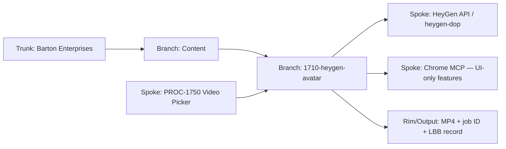
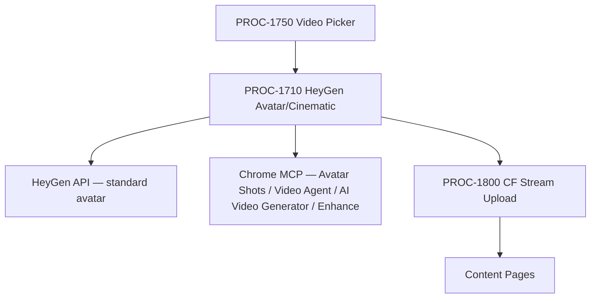

# PROC-1710 — HeyGen Avatar/Cinematic Video
## Generate founder/avatar direct-to-camera A-roll and cinematic B-roll using HeyGen API and HeyGen UI for features requiring browser automation.
### Status: BUILD
### Medium: process
### Business: barton-enterprises/content
### Version: 1.0.0

## 📋 UT Checklist (Pre-Flight — per atlas/constants/UT_CHECKLIST.md v1.3.1)

| # | Check | Status | Location |
|---|-------|--------|----------|
| 1 | PRD — what / why / who / scope / out-of-scope / success metric | ☑ | §2 |
| 2 | OSAM — READ / WRITE / Process Composition / Join Chain / Forbidden / Query Routing filled | ☑ | §5 |
| 3 | Component Status — every dep 🟢 / 🟡 / 🔴 with 1-line state | ☑ | §3 |
| 4 | Owner — human who fixes this at 2 AM | ☑ | §1 |
| 5 | Live Dashboard — URL or explicit "N/A" | ☑ | §3 — N/A (manual + API process) |
| 6 | Kill Switch — exact command to stop the process | ☑ | §8 |
| 7 | Logbook — last audit verdict + date (after certification only) | ☐ | §12 — N/A during BUILD |
| 8 | FCEs Attached — which FCE runs structurally back this doc | ☑ | §3c |
| 9 | BARs Referenced — every BAR this doc touches, with status | ☑ | §3d |
| 10 | LBB Subjects Fed — which LBB subject(s) this doc's session logs go to | ☑ | §3e |
| 11 | Geometry — CTB position + Hub-Spoke role + Altitude | ☑ | §1b |
| 12 | Live Verification — every numeric count, cron, URL, command, BAR status grounded against the actual system | ☐ | §9b — pending first render run |
| 13 | ctb_node — declared path on Barton Enterprises CTB trunk | ☑ | §1 |

---

# IDENTITY (Thing — what this IS)

## 1. IDENTITY {#sec-1-identity}

| Field | Value |
|-------|-------|
| ID | PROC-1710 |
| Name | HeyGen Avatar/Cinematic Video |
| Medium | process |
| Business Silo | barton-enterprises/content |
| CTB Position | barton-enterprises/content/1710-heygen-avatar |
| ORBT | BUILD |
| Strikes | 0 |
| Authority | Gated (CC-03) |
| Version | 1.0.0 |
| Last Modified | 2026-05-04 |
| BAR Reference | BAR-389 |
| Owner | Dave Barton |
| ctb_node | barton-enterprises/content/1710-heygen-avatar |

### HEIR (8 fields)

| Field | Value |
|-------|-------|
| sovereign_ref | imo-creator |
| hub_id | content-heygen-avatar |
| ctb_placement | branch |
| imo_topology | middle |
| cc_layer | CC-03 |
| services | HeyGen API, heygen-dop CLI, Chrome MCP (UI-only features), Doppler |
| secrets_provider | Doppler (imo-creator → dev → HEYGEN_API_KEY) |
| acceptance_criteria | Avatar identity verified; render dispatched via API or confirmed browser path; MP4 output captured with job ID; constants packet recorded; LBB ingest complete |

## 1b. Geometry {#sec-1b-geometry}

**CTB Position:** Barton Enterprises → Content → 1710-heygen-avatar (branch — one process per generator lane)

**Hub-Spoke Role:** hub (this process is the Middle — script intake, avatar/voice selection, render dispatch, output capture)

**Altitude:** 10k operational — single generator lane execution



---

# CONTRACT (Flow — what flows through this) {#sec-2-purpose}

## 2. PURPOSE {#sec-2-purpose}

PROC-1710 produces avatar-based direct-to-camera A-roll and cinematic B-roll video using HeyGen's avatar video generation, Avatar Shots, Video Agent, and AI Video Generator capabilities. Without this process, founder/avatar video production has no repeatable lane — each render is an ad-hoc UI session with no constants packet, no job ID trail, and no LBB record. Downstream processes (PROC-1800 CF Stream upload, content-pages deploy, distribution) starve for input. If this process fails, A-roll production for Insurance Informatics, SVG Agency, and Barton Enterprises video content halts entirely.

**WHY this child exists (6-fill WHY):** HeyGen avatar video has distinct tooling (API + UI hybrid), distinct constants (avatar IDs, voice IDs, cinematic prompt formula), and distinct stop conditions (identity verification, reference media gates) that cannot be inherited from a generic video process. A dedicated lane UT locks these as constants so every mechanic runs the same render without re-deriving them from research.

---

## 3. RESOURCES {#sec-3-resources}

### Dependencies

| Dependency | Type | What It Provides | Status |
|-----------|------|-----------------|--------|
| HeyGen API (`/v2/video/generate`) | external API | Avatar video generation via API | 🟢 Active — `HEYGEN_API_KEY` in Doppler |
| `heygen-dop` CLI | local script | Shell wrapper for HeyGen API calls | 🟢 Active — `~/bin/heygen-dop-impl.sh` |
| Chrome MCP | browser automation | UI-only features: Avatar Shots, Video Agent, AI Video Generator, Enhance | 🟡 Available — requires active Chrome session |
| Doppler (imo-creator → dev) | secrets | `HEYGEN_API_KEY`, avatar IDs, voice IDs | 🟢 Active |
| `fleet/content/videos/JULIA-MCCOY-AVATAR-WORKFLOW.md` | doctrine | Cinematic prompt formula, A-roll/B-roll join rules | 🟢 Present |
| `fleet/content/videos/HEYGEN-CINEMATIC-VIDEO-RESEARCH.md` | doctrine | Feature map, cautions, pipeline recommendation | 🟢 Present |
| `fleet/content/videos/VIDEO-MARKETING-CV-RESEARCH.md` | doctrine | C&V packet, input/output contracts for heygen_avatar path | 🟢 Present |
| PROC-1750 Video Picker | upstream | Routes job to this lane by `path_id: heygen_avatar` | 🟡 BUILD — not yet operational |
| PROC-1800 CF Stream Upload | downstream | Consumes MP4 output, uploads to CF Stream | 🟡 BUILD — exists, pending PROC-1710 input |
| LBB (lbb.svg-outreach.workers.dev) | knowledge store | Ingest each render session | 🟢 Active |

### Downstream Consumers

| Consumer | What It Needs |
|----------|--------------|
| PROC-1800 CF Stream Upload | MP4 file path or download URL from HeyGen |
| Content Pages | CF Stream UID (after PROC-1800) |
| Distribution (YouTube, LinkedIn) | Published video URL |
| LBB | Job ID, constants packet, output URL, render metadata |

### Tools & Integrations

| Item | Type | Cost Tier | Credentials | What It Does |
|------|------|-----------|-------------|-------------|
| HeyGen API | REST API | Paid (Team plan) | `HEYGEN_API_KEY` via Doppler | Generate avatar video, poll job status, download output |
| `heygen-dop` CLI | Shell script | Free (wrapper) | Inherits `HEYGEN_API_KEY` | Standardized command interface for HeyGen API |
| Chrome MCP | Browser automation | Free | Active Chrome session (Dave's HeyGen account) | Avatar Shots, Video Agent, AI Video Generator, Enhance — when API is unavailable |

### Secrets

| Secret | Doppler Project | Config | Used By |
|--------|----------------|--------|---------|
| `HEYGEN_API_KEY` | imo-creator | dev | heygen-dop CLI, direct API calls |

### Live Dashboard

N/A — no automated dashboard. Job status polled via API (`GET /v1/video_status.get?video_id={id}`). HeyGen account UI is secondary verification only.

### §3c. FCEs Attached

| FCE Name | HEIR | ORBT | Run Directory | Latest P=1 Date | Status |
|----------|------|------|---------------|-----------------|--------|
| C&V packet — heygen_avatar path | fleet/content/videos/VIDEO-MARKETING-CV-RESEARCH.md · leaf · CC-04 | BUILD | fleet/content/videos/ | 2026-05-04 | ☑ Present — constants extracted |

### §3d. BARs Referenced

| BAR | Title | HEIR | ORBT | Status | Relation |
|-----|-------|------|------|--------|----------|
| BAR-389 | PROC-1710 HeyGen Avatar/Cinematic UT | BAR-389 · leaf · CC-03 | BUILD | BUILD — this dispatch | This process UT |
| BAR-396 | Video Marketing C&V Research | BAR-396 · leaf · CC-04 | BUILD | BUILD — source packet | Source C&V constants |
| BAR-392 | PROC-1750 Video Picker | BAR-392 · branch · CC-03 | BUILD | BUILD — planned | Routes jobs to this lane |

### §3e. LBB Subjects Fed

| LBB Subject | HEIR | ORBT | What This Doc Writes | Frequency |
|-------------|------|------|---------------------|-----------|
| `processes` | processes · leaf · CC-04 | BUILD | Render session log: job ID, constants packet, output URL, errors | Per render run |

---

# CONTRACT (Flow — what flows through this)

## 4. IMO — Input, Middle, Output {#sec-4-imo}

### Two-Question Intake (Bedrock §3)
1. **"What triggers this?"** — A video job with `path_id: heygen_avatar` is dispatched by PROC-1750 Video Picker, or Dave manually initiates a render with an avatar script ready.
2. **"How do we get it?"** — Script comes from hand-written scripts or Claude Project AI Brain (Phase 2). Avatar and voice IDs are constants from Doppler/this UT. Cinematic scene prompts follow the prompt formula.

### Input

```yaml
path_id: heygen_avatar
script: string                    # A-roll script for avatar speech
avatar:
  provider: heygen
  id_or_name: string              # Default: cf8be1f92db345458a24fbbdfc368faa (black shirt)
voice:
  provider: heygen                # ElevenLabs is Phase 2
  id_or_name: string              # Default voice: Fish / 6bddf71228964cd59d74d62fc1070fb3
scene:                            # Optional — for cinematic B-roll via Avatar Shots
  setting_mood: string            # D-1710-02: all four slots required when present
  avatar_action: string
  camera_movement: string
  audio: string
format:
  aspect_ratio: "16:9 | 9:16 | 1:1"    # D-1710-05: declare per render
  duration_target: string               # B-roll default: 4-15 seconds per D-1710-03
output_surface: "youtube | r2 | cf_stream | content_pages | linkedin"
```

### Middle

| Step | Input | What Happens | Output | Tool Used |
|------|-------|-------------|--------|-----------|
| 1. Verify avatar identity | avatar.id_or_name | Confirm the declared avatar ID is Dave's verified digital twin. If not verified → HALT (D-1710-01) | Verified avatar ID | Constants check |
| 2. Select subpath | script + scene presence | A-roll only: use direct avatar API. Scene present: use Avatar Shots (Browser MCP if UI-only). Full-video directive: use Video Agent. B-roll without avatar: use AI Video Generator. | Subpath selection | Decision table |
| 3. Build constants packet | avatar, voice, format | Assemble full constants packet: avatar ID, voice ID/provider, aspect ratio, duration, orientation | constants_packet.yaml | Doppler + this UT |
| 4. Build prompt (cinematic) | scene slots | If cinematic: combine setting_mood + avatar_action + camera_movement + audio per prompt formula. If partial slots → REPAIR (D-1710-02) | Validated prompt string | Prompt formula |
| 5. Optionally run Enhance | prompt | If Enhance toggle on, run through HeyGen Enhance to improve prompt before generation | Enhanced prompt | HeyGen UI / API if available |
| 6. Dispatch render | constants_packet + prompt/script | Call HeyGen API (`POST /v2/video/generate`) via `heygen-dop` or Chrome MCP for UI-only features | job_id | heygen-dop / Chrome MCP |
| 7. Poll for completion | job_id | `GET /v1/video_status.get?video_id={job_id}` until status=completed | video_url | HeyGen API |
| 8. Download / capture output | video_url | Download MP4 to local path or capture URL | mp4_path or mp4_url | curl / heygen-dop |
| 9. Ingest to LBB | all metadata | Write render session record to LBB (subject: processes) | lbb_record_id | LBB API |

### Output

- HeyGen job ID
- MP4 file path or download URL
- Constants packet used (avatar ID, voice ID, aspect ratio, duration, prompt)
- LBB record ID
- Ready for PROC-1800 (CF Stream upload)

### Circle (Bedrock §5)
Completed renders log job ID + constants + output URL to LBB. If a render produces generic or off-brand output, the prompt formula is reviewed and tightened. Repeat failures (Strike 3) trigger Troubleshoot/Train on prompt quality or API integration.

---

## 5. DATA SCHEMA {#sec-5-data-schema}

### Process Composition



| Sub-Process | HEIR | ORBT | Status |
|-------------|------|------|--------|
| PROC-1750 Video Picker | content-video-picker · branch · CC-03 | BUILD | 🟡 Planned |
| PROC-1800 CF Stream Upload | content-cf-stream · branch · CC-03 | BUILD | 🟡 Exists |
| HeyGen API | heygen-api · leaf · CC-03 | OPERATE | 🟢 Active |
| Chrome MCP | chrome-mcp · leaf · CC-03 | OPERATE | 🟡 Active — session-dependent |

### READ Access

| Source | What It Provides | Join Key |
|--------|-----------------|----------|
| Doppler (imo-creator → dev) | `HEYGEN_API_KEY`, avatar IDs, voice IDs | secret name |
| `atlas/constants/BARTON_ENTERPRISES_CTB.md` | ctb_node validation | ctb_node path |
| `fleet/content/videos/VIDEO-MARKETING-CV-RESEARCH.md` | heygen_avatar C&V packet, input/output contracts | path_id = heygen_avatar |
| This UT §7 Constants | Default avatar IDs, voice ID, format defaults | constant name |

### WRITE Access

| Target | What It Writes | When |
|--------|---------------|------|
| HeyGen API (`POST /v2/video/generate`) | Render job (script, avatar, voice, format) | Step 6 |
| Local filesystem | MP4 download | Step 8 |
| LBB (`processes` subject) | Render session record (job_id, constants, output_url, status) | Step 9 |
| orbt.yaml | Strike count update on failure | On HALT or Strike |

### Join Chain

```text
Video job (path_id=heygen_avatar)
  -> PROC-1750 routing
    -> PROC-1710 constants packet (avatar ID, voice ID, format)
      -> HeyGen API job
        -> MP4 output
          -> PROC-1800 CF Stream
            -> content-pages (streamId)
```

### Forbidden Paths

| Action | Why |
|--------|-----|
| Using a non-verified avatar ID | Violates D-1710-01 — identity integrity gate |
| Using a real human face as reference media for cinematic generation | Violates D-1710-04 — HeyGen policy + ethics gate |
| Treating voice ID as architecture (hardcoded in code, not variable fill) | Violates D-1710-06 — voice is variable fill, not spine |
| Dispatching Avatar Shots / Video Agent / AI Video Generator / Enhance without a declared browser automation path | Violates D-1710-07 — UI-only features need explicit path |
| Skipping LBB ingest after render | Breaks traceability and Circle closure |
| Using incomplete prompt (missing any of 4 slots) for cinematic generation | Violates D-1710-02 — prompt is structure, not optional decoration |

### Query Routing

| Business Question | Source | Column/Field |
|------------------|--------|-------------|
| What is Dave's current default avatar ID? | §7 Constants (this UT) | `default_avatar_id` |
| What is the active voice for A-roll? | §7 Constants (this UT) | `default_voice_id` |
| Did last render complete successfully? | HeyGen API `GET /v1/video_status.get` | `status` |
| Where is the output MP4? | LBB processes subject | `video_url` field in render record |

---

## 6. DMJ — Define, Map, Join {#sec-6-dmj}

### 6a. DEFINE — Local Legend (child-only terms not in parent atlas)

| Element | ID | Format | Description | C or V |
|---------|-----|--------|-------------|--------|
| heygen_avatar path | PATH-1710 | string slug | The named lane container for all HeyGen avatar/cinematic renders | C |
| Avatar identity | AVATAR-ID | hex string (32 chars) | Verified HeyGen digital twin — Dave Barton only | C (slot); V (selected ID) |
| Voice slot | VOICE-SLOT | object: provider + id_or_name | HeyGen or ElevenLabs voice selection position | C (slot); V (fill) |
| Cinematic prompt | PROMPT-1710 | 4-slot string | Setting/mood + avatar action + camera movement + audio | C (structure); V (fill per shot) |
| Avatar Shots | SUBPATH-AS | HeyGen UI feature | Places verified digital twin into cinematic scenes — B-roll | C |
| Video Agent | SUBPATH-VA | HeyGen UI/API feature | Generates full video package from script/directive | C |
| AI Video Generator | SUBPATH-AIVG | HeyGen UI/API feature | Generates custom cinematic B-roll and brand scenes | C |
| Enhance | SUBPATH-ENH | HeyGen UI/API feature | Prompt improvement before generation | C |
| A-roll | LAYER-A | video layer | Direct-to-camera speech — carries argument | C |
| B-roll | LAYER-B | video layer | Cinematic scenes — carries attention, emotion, visual memory | C |
| constants packet | PKT-1710 | yaml object | Avatar ID + voice ID + format + orientation assembled before dispatch | C |
| job_id | JOB-ID | string | HeyGen API render job identifier | V |
| MP4 output | OUTPUT-MP4 | file path or URL | Rendered video artifact | V |

### 6b. MAP

| Source | Target | Transform |
|--------|--------|-----------|
| Dispatch packet `path_id: heygen_avatar` | PROC-1710 trigger | Route confirmation |
| Script text | HeyGen API `script` field | Direct pass-through |
| Avatar constant (this UT §7) | `avatar.id_or_name` in API call | Constant lookup |
| Voice constant (this UT §7) | `voice.id_or_name` in API call | Constant lookup |
| Scene prompt formula | HeyGen cinematic prompt | 4-slot assembly |
| `format.aspect_ratio` | HeyGen API format field | Direct |
| `format.duration_target` | HeyGen API duration | Direct (domesticated: 4-15s for B-roll) |
| API job_id | LBB render record | Stored as traceability key |
| MP4 output URL | PROC-1800 input | Downstream handoff |

### 6c. JOIN

| Join Path | Type | Description |
|-----------|------|-------------|
| ctb_node: `barton-enterprises/content/1710-heygen-avatar` | direct | Spine attachment via CTB |
| path_id: `heygen_avatar` | direct | PROC-1750 routing key |
| job_id → LBB render record | direct | Traceability chain |
| MP4 path → PROC-1800 | direct | Downstream lane handoff |

---

## 7. CONSTANTS & VARIABLES {#sec-7-constants-variables}

### Constants (structure — locked values; D-1710-01 through D-1710-07 enforce these)

| Constant | Value | Rule |
|----------|-------|------|
| path_id | `heygen_avatar` | Fixed lane identifier |
| Default avatar — black shirt | `cf8be1f92db345458a24fbbdfc368faa` | Dave Barton verified; D-1710-01 |
| Variation avatar — blue shirt | `f2f245dd75514a78a96feec067f0dd9b` | Dave Barton verified; D-1710-01 |
| Default voice name | `Fish` | Current HeyGen-native default |
| Default voice ID | `6bddf71228964cd59d74d62fc1070fb3` | Current HeyGen-native ID |
| Voice provider (Phase 1) | `heygen` | ElevenLabs PVC deferred to Phase 2 per Dave decision 2026-04-30 |
| Aspect ratio (YouTube / LinkedIn / CF Pages) | `16:9` | Active format for primary surfaces |
| Logo requirement (SVG-Agency renders) | required | Brand compliance |
| B-roll default duration range | `4–15 seconds` | Per Julia McCoy cinematic workflow; D-1710-03 |
| Prompt formula structure | `setting_mood + avatar_action + camera_movement + audio` | 4 mandatory slots; D-1710-02 |
| A-roll carries argument | structural rule | B-roll carries attention/emotion/visual memory; D-1710-08 |
| Digital twin consent | first-party, identity-verified | D-1710-01 + D-1710-04 |
| Reference media exclusion | no real human faces | D-1710-04 |

### Variables (fill — change per render)

| Variable | Format | Example |
|----------|--------|---------|
| script | string | "Insurance Informatics helps carriers..." |
| avatar selected | avatar ID (hex) | `cf8be1f92db345458a24fbbdfc368faa` |
| voice selected | voice name or ID | `Fish` |
| scene prompt fill | 4-slot string | "Office, confident morning energy. Dave walks to camera. Push-in reveal. Upbeat piano." |
| aspect_ratio | `16:9 \| 9:16 \| 1:1` | `16:9` |
| duration_target | string | `10s` |
| output_surface | slug | `youtube` |
| job_id | string | HeyGen-generated UUID |
| mp4_url | URL | `https://resource.heygen.com/...` |

---

## 8. STOP CONDITIONS {#sec-8-stop-conditions}

Per `atlas/constants/PROCESS_FILL_INSTRUCTIONS.md` §8 and `DOCTRINE.md` D-1710-xx:

| Condition | Action | Doctrine Rule |
|-----------|--------|---------------|
| Avatar identity not verified | HALT — do not render | D-1710-01 |
| `HEYGEN_API_KEY` unavailable in Doppler | HALT — cannot call API | D-1710-09 |
| Real human face used as reference media for cinematic style guidance | HALT — ethics + policy gate | D-1710-04 |
| Required cinematic feature (Avatar Shots, Video Agent, AI Video Generator, Enhance) is UI-only and no Chrome/browser automation path is specified | HALT — cannot proceed without execution path | D-1710-07 |
| Script not provided | HALT — intake incomplete | §4 IMO — Two-Question Intake |
| Prompt has fewer than 4 slots (setting/mood, avatar action, camera movement, audio) | REPAIR before render — incomplete prompt produces generic output | D-1710-02 |
| Voice provider / voice ID treated as architecture (hardcoded) rather than variable fill | REPAIR before render — unblocks voice swapping without code changes | D-1710-06 |
| Render job returns error status | REPAIR — log error to LBB, inspect constants packet, re-dispatch | §9 Verification |
| Same render failure recurs 3 times (Strike 3) | TROUBLESHOOT/TRAIN → Airworthiness Directive | Bedrock §6 |
| Dave says stop | STOP | Human authority |

### Kill Switch

```bash
# Stop a running HeyGen render (if API supports cancellation):
curl -s -X DELETE "https://api.heygen.com/v1/video.delete" \
  -H "X-Api-Key: $HEYGEN_API_KEY" \
  -H "Content-Type: application/json" \
  -d '{"video_id": "JOB_ID_HERE"}'

# If UI-only Chrome session: close the browser tab or terminate Chrome MCP session
# No background workers to kill for this process (manual + API dispatch only)
```

---

# GOVERNANCE (Change — how this is controlled)

## 9. VERIFICATION {#sec-9-verification}

```text
1. Happy path — A-roll render:
   a. Load HEYGEN_API_KEY from Doppler.
   b. Verify avatar cf8be1f92db345458a24fbbdfc368faa is active: GET /v2/avatars.
   c. Dispatch render with script, default avatar, default voice (Fish), 16:9.
   d. Poll GET /v1/video_status.get until status=completed.
   e. Download MP4 and verify file size > 0.
   f. Confirm LBB ingest record exists in `processes` subject.
   EXPECTED: MP4 on disk, job_id in LBB.

2. Missing-data path — incomplete cinematic prompt:
   a. Prepare scene with only setting_mood + avatar_action (2 of 4 slots).
   b. Run §8 Stop Conditions check before dispatch.
   EXPECTED: REPAIR triggered — render blocked, operator notified of missing camera_movement + audio slots.

3. UI-only feature path — Avatar Shots without browser path:
   a. Request Avatar Shots render with no Chrome MCP session declared.
   b. Run §8 Stop Conditions check.
   EXPECTED: HALT triggered — D-1710-07 fires, operator must specify browser automation path.
```

**Three Primitives Check:**
1. **Thing:** Does the avatar (verified HeyGen digital twin) exist in Dave's account? ✓ cf8be1f9 + f2f245dd confirmed active 2026-04-30.
2. **Flow:** Does the script/prompt reach HeyGen API and return a job ID? ✓ heygen-dop CLI + API endpoint both active.
3. **Change:** Does the render transform script/prompt into an MP4 file? ✓ Confirmed by prior LinkedIn intro render (54s, session-33).

## 9b. Live Verification Log {#sec-9b-live-verification}

| Claim / Field | Section | Source of Truth | Verification Command | Status | Last Check | Value at Check |
|---------------|---------|-----------------|----------------------|--------|------------|----------------|
| Default avatar ID (black shirt) | Section 7 | HeyGen API | `doppler run --project imo-creator --config dev -- powershell -NoProfile -ExecutionPolicy Bypass -File .codex\verify-heygen-access.ps1` | PASS | 2026-05-04 | `cf8be1f92db345458a24fbbdfc368faa` matched as `dbarton black shirt` |
| Variation avatar ID (blue shirt) | Section 7 | HeyGen API | `doppler run --project imo-creator --config dev -- powershell -NoProfile -ExecutionPolicy Bypass -File .codex\verify-heygen-access.ps1` | PASS | 2026-05-04 | `f2f245dd75514a78a96feec067f0dd9b` matched as `dbarton blue shirt` |
| Default voice (Fish) ID | Section 7 | HeyGen API | `doppler run --project imo-creator --config dev -- powershell -NoProfile -ExecutionPolicy Bypass -File .codex\verify-heygen-access.ps1` | PASS | 2026-05-04 | `6bddf71228964cd59d74d62fc1070fb3` matched as `dbarton`; additional Dave voices also present |
| HEYGEN_API_KEY in Doppler | Section 3 | Doppler imo-creator/dev | `doppler run --project imo-creator --config dev -- powershell -NoProfile -ExecutionPolicy Bypass -File .codex\verify-heygen-access.ps1` | PASS | 2026-05-04 | `HEYGEN_API_KEY_PRESENT=true`; secret value not printed |
| HeyGen API endpoint active | Section 4 | HeyGen API | `GET https://api.heygen.com/v2/avatars` and `GET https://api.heygen.com/v2/voices` through verification helper | PASS | 2026-05-04 | Avatar count 1285; voice count 2390 |
| First new render dispatch | Section 9 | HeyGen API or Chrome MCP | `heygen-dop` render command or browser automation session | PENDING | - | Not run in this verification pass; no render credits spent |

---

## 10. ANALYTICS {#sec-10-analytics}

### 10a. Metrics (define before first render)

| Metric | Unit | Baseline | Target | Tolerance |
|--------|------|----------|--------|-----------|
| Render success rate | % completed / dispatched | 0 | ≥ 90% | ≥ 90% |
| Time to MP4 (A-roll, 60s) | minutes | unknown | ≤ 15 min | ≤ 20 min |
| Prompt formula compliance | % with all 4 slots / total cinematic | 0 | 100% | 100% |
| LBB ingest per render | count | 0 | 1:1 with renders | 1:1 |
| Avatar identity HALT rate | count | 0 | 0 | 0 |

### 10b. Sigma Tracking

| Metric | Run 1 | Run 2 | Run 3 | Trend | Action |
|--------|-------|-------|-------|-------|--------|
| Render success | pending | pending | pending | TIGHTENING expected | keep |
| Prompt compliance | pending | pending | pending | TIGHTENING expected | keep |

### 10c. ORBT Gate Rules

| From | To | Gate |
|------|-----|------|
| BUILD | OPERATE | ≥ 3 successful render runs; prompt formula compliance 100%; LBB ingest confirmed; avatar IDs verified; auditor sign-off |
| OPERATE | REPAIR | Render failure, HALT condition triggered, or metric out of tolerance |
| REPAIR | OPERATE | Fix applied, 1 clean render, auditor confirms |
| Any (Strike 3) | TROUBLESHOOT/TRAIN | Same failure pattern 3× → Airworthiness Directive |

---

## 11. EXECUTION TRACE {#sec-11-execution-trace}

| Field | Value |
|-------|-------|
| trace_id | PROC-1710-BUILD-001 |
| run_id | 2026-05-04-session-01 |
| step | build-process-ut |
| target | `../Barton-Processes/factory/content/1710-heygen-avatar/PROCESS-UT.md` |
| actual | this file |
| delta | from zero to initial BUILD UT |
| status | BUILD |
| error_code | null |
| error_message | null |
| tools_used | atlas/HOW_TO_BUILD_A_CHILD_UT.md, atlas/PROCESS_FILL_INSTRUCTIONS.md, fleet/content/videos/HEYGEN-CINEMATIC-VIDEO-RESEARCH.md, fleet/content/videos/JULIA-MCCOY-AVATAR-WORKFLOW.md, fleet/content/videos/VIDEO-MARKETING-CV-RESEARCH.md, docs/plans/BAR-VIDEO-LANE-UTS.plan.md |
| duration_ms | session build |
| cost_cents | session cost |
| timestamp | 2026-05-04 |
| signed_by | Sonnet mechanic (BAR-389 dispatch) |

### Build Inputs Used

| Source | File | What Was Used |
|--------|------|--------------|
| Plan | `docs/plans/BAR-VIDEO-LANE-UTS.plan.md` | §7 PROC-1710 requirements, access/API matrix |
| C&V Research | `fleet/content/videos/VIDEO-MARKETING-CV-RESEARCH.md` | heygen_avatar path C&V + input/output contracts |
| Cinematic Research | `fleet/content/videos/HEYGEN-CINEMATIC-VIDEO-RESEARCH.md` | Feature map, prompt formula, A/B-roll join rule, cautions |
| Julia McCoy Workflow | `fleet/content/videos/JULIA-MCCOY-AVATAR-WORKFLOW.md` | Avatar IDs, voice IDs, 4-tool pipeline, operational tolerances |
| Child UT Guide | `atlas/HOW_TO_BUILD_A_CHILD_UT.md` | 6-fill structure |
| Process Fill Instructions | `atlas/PROCESS_FILL_INSTRUCTIONS.md` | 14-section anchors, fill rules |
| Reference UT | `factory/content/1700-video-ctb/PROCESS-UT.md` | Structure reference |

---

## 12. LOGBOOK (After Certification Only) {#sec-12-logbook}

**No logbook during BUILD.** Created only when ORBT transitions BUILD → OPERATE with auditor sign-off.

| Field | Value |
|-------|-------|
| heir_ref | pending certification |
| orbt_entered | BUILD |
| orbt_exited | pending |
| action | pending auditor certification |
| gates_passed | pending |
| signed_by | pending (Codex auditor) |
| signed_at | pending |

---

## 13. FLEET FAILURE REGISTRY {#sec-13-fleet-failure-registry}

| Pattern ID | Location | Error Code | First Seen | Occurrences | Strike Count | Status |
|-----------|----------|-----------|-----------|-------------|-------------|--------|
| — | — | — | — | — | — | No failures yet — BUILD phase |

---

## 14. SESSION LOG {#sec-14-session-log}

| Date | What Was Done | LBB Record |
|------|---------------|-----------|
| 2026-05-04 | PROC-1710 initial BUILD — created PROCESS-UT.md, DOCTRINE.md, heir.yaml, orbt.yaml from BAR-389 dispatch via BAR-VIDEO-LANE-UTS plan | pending LBB ingest |

---

## Document Control

| Field | Value |
|-------|-------|
| Created | 2026-05-04 |
| Last Modified | 2026-05-04 |
| Version | 1.0.0 |
| Template Version | UT v2.8.0 |
| Medium | process |
| Parent | `atlas/PROCESS_FILL_INSTRUCTIONS.md` + `atlas/HOW_TO_BUILD_A_CHILD_UT.md` |
| Governing Engine | `atlas/constants/FOUNDATIONAL_BEDROCK.md` + `atlas/constants/DMJ.md` |
| BAR | BAR-389 |
| Plan | `docs/plans/BAR-VIDEO-LANE-UTS.plan.md` |
