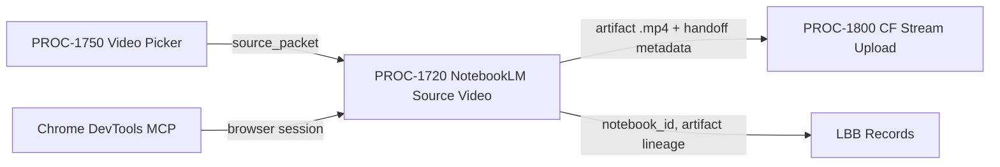

# NotebookLM Source Video — Chrome MCP Lane
## Generate video artifacts from curated source packets via NotebookLM Studio browser automation, then hand off to PROC-1800.
### Status: BUILD
### Medium: process
### Business: barton-enterprises (cross-cutting — SVG Agency + Personal)
### Version: 0.2.0

## UT Checklist (Pre-Flight — per law/UT_CHECKLIST.md v1.3.1)

| # | Check | Status | Location |
|---|-------|--------|----------|
| 1 | PRD — what / why / who / scope / out-of-scope / success metric | ☑ | §2 |
| 2 | OSAM — READ / WRITE / Join Chain / Forbidden Paths / Query Routing / Process Composition | ☑ | §5 |
| 3 | Component Status — every dependency has a status indicator with 1-line state | ☑ | §3 |
| 4 | Owner — human who fixes this at 2 AM | ☑ | §1 — Dave Barton |
| 5 | Live Dashboard — URL or explicit "N/A" | ☑ | §3 — N/A (browser-automation process) |
| 6 | Kill Switch — exact command to stop the process | ☑ | §8 |
| 7 | Logbook — last audit verdict + date (after certification only) | ☐ | §12 — N/A during BUILD |
| 8 | FCEs Attached — which FCE runs structurally back this doc | ☑ | §3c |
| 9 | BARs Referenced — every BAR this doc touches, with status | ☑ | §3d |
| 10 | LBB Subjects Fed — which LBB subject(s) this doc's session logs go to | ☑ | §3e |
| 11 | Geometry — CTB position + Hub-Spoke role + Altitude | ☑ | §1b |
| 12 | Live Verification — every numeric count, cron, URL, command, BAR status grounded | ☐ | §9b — STOP-07 blocker active; no live session run |
| 13 | mission_control_wiring — WIRE / EXEMPT declared in frontmatter | ☑ | frontmatter — WIRE → imo-creator.mission-control.system.processes |

---

# IDENTITY

## 1. IDENTITY {#sec-1-identity}

| Field | Value |
|-------|-------|
| ID | PROC-1720 |
| Name | NotebookLM Source Video — Chrome MCP Lane |
| Medium | process |
| Business Silo | barton-enterprises/content (cross-cutting — SVG Agency + Personal) |
| CTB Position | barton-enterprises/content/1720-notebooklm-source-video |
| ORBT | BUILD |
| Strikes | 0 |
| Authority | Gated (CC-03) |
| Version | 0.2.0 |
| Last Modified | 2026-05-12 |
| BAR Reference | BAR-388 |
| Owner | Dave Barton |
| ctb_node | barton-enterprises/content/1720-notebooklm-source-video |

### HEIR (8 fields)

| Field | Value |
|-------|-------|
| sovereign_ref | imo-creator |
| hub_id | content-notebooklm-source-video |
| ctb_placement | branch |
| imo_topology | middle |
| cc_layer | CC-03 |
| services | NotebookLM Studio (web), Chrome DevTools MCP, local filesystem (Downloads) |
| secrets_provider | none (auth via logged-in Chrome session for Dave's Google account — no raw secret in UT) |
| acceptance_criteria | source packet loaded into notebook; video artifact generated and downloaded to disk; handoff file present and non-zero bytes; CF Stream metadata passed to PROC-1800 |

---

## 1b. Geometry {#sec-1b-geometry}

**CTB Position:** Barton Enterprises → Content → 1720-notebooklm-source-video (branch — receives from PROC-1750 picker, produces for PROC-1800)

**Hub-Spoke Role:** middle hub (transforms source packet into video artifact via NotebookLM browser automation)

**Altitude:** 10k operational (one branch cluster — browser-session management + artifact production)

**Access surface:** Chrome DevTools MCP controls the NotebookLM web application. This is NOT a clean public API lane. NotebookLM has no published stable video-generation API. Every generation step is UI-driven via browser automation.



---

# PURPOSE

## 2. PURPOSE {#sec-2-purpose}

PROC-1720 takes a curated source packet (documents, notes, URLs, or script fragments) and produces a downloadable video artifact by automating NotebookLM Studio through the Chrome DevTools MCP. Without this lane, there is no repeatable, auditable path to convert structured content sources into NotebookLM-generated video; generation would be ad-hoc, untracked, and non-handoffable to PROC-1800 for CF Stream upload.

Downstream consumers that starve without this process: PROC-1800 (has no input file), PROC-1750 (cannot close the `notebooklm_source_video` path contract), and content-pages deployments (have no Stream UID to embed).

If this process fails silently — artifact produced but not verified, or handoff metadata missing — the video appears in PROC-1800's queue as an untraceable file, breaking the artifact lineage back to its source packet and violating the C&V traceability requirement.

**Scope:** Generate one video artifact per source packet per run. Batch runs are multiple sequential invocations of this process, not a single invocation.

**Out of scope:** Audio-only podcasts from NotebookLM (separate lane), editing or post-processing of the downloaded video (separate toolchain), upload to CF Stream (PROC-1800).

**Success metric:** artifact_download_path exists on disk, file size > 0 bytes, artifact_id traceable to source_packet_id in LBB.

---

# RESOURCES

## 3. RESOURCES {#sec-3-resources}

### 3a. Dependencies

| Dependency | Type | What It Provides | Status |
|-----------|------|-----------------|--------|
| Chrome DevTools MCP | browser automation | Opens, navigates, fills, and interacts with NotebookLM web UI | 🟢 Available — mcp__chrome-devtools tools present |
| NotebookLM Studio (notebooklm.google.com) | provider surface | Notebook creation, source ingestion, video artifact generation | 🟢 Accessible via Chrome session |
| Dave's Google account (logged-in Chrome session) | auth | Provides notebook access; no raw secret stored in this UT | 🟡 Session must be active before run |
| Local filesystem — Downloads folder | storage | Receives downloaded video artifact | 🟢 Standard OS path |
| PROC-1750 Video Picker | upstream | Dispatches source_packet with path_id = notebooklm_source_video | 🟡 BUILD — not yet certified |
| PROC-1800 CF Stream Upload | downstream | Consumes artifact_download_path + PROC-1800 handoff packet | 🟡 BUILD — 1 strike |
| LBB (lbb.svg-outreach.workers.dev) | knowledge store | Receives artifact lineage records per run | 🟢 Active |

### 3b. Tools and Integrations

| Tool / Service | Type | Cost Tier | Credentials | What It Does |
|----------------|------|-----------|-------------|-------------|
| Chrome DevTools MCP | browser automation | included (MCP server) | none (session-based) | Navigates NotebookLM, uploads sources, triggers generation, downloads artifact |
| NotebookLM Studio | AI provider | Google account plan (no API key) | logged-in Chrome session | Generates video from notebook sources |
| LBB API | knowledge store | internal | LBB_API_KEY (Doppler) | Logs notebook_id, artifact_id, source lineage |

### 3c. FCEs Attached

| FCE | How It Backs This Process |
|-----|--------------------------|
| Content FCE | Source packet selection and scoring routes through the CTB; this lane executes the NotebookLM path |

### 3d. BARs Referenced

| BAR | Topic | Status |
|-----|-------|--------|
| BAR-388 | PROC-1720 child UT build | BUILD |
| BAR-392 | PROC-1750 Video Picker (routes to this lane) | BUILD |

### 3e. LBB Subjects Fed

| Subject ID | What Gets Ingested |
|------------|-------------------|
| processes | Run records: source_packet_id, notebook_id, artifact_id, download_path, timestamps |
| system | Process updates (if architecture or doctrine changes) |

### 3f. Live Dashboard

N/A — this is a browser-automation process; no real-time dashboard. Run status tracked via §9b gauges and §14 session log.

---

# CONTRACT

## 4. IMO — Input, Middle, Output {#sec-4-imo}

### Two-Question Intake (Bedrock §3)

1. **"What triggers this?"** — PROC-1750 Video Picker dispatches a job packet with `path_id = notebooklm_source_video`.
2. **"How do we get it?"** — The job packet arrives as a structured source_packet (document list, URL list, or paste content) with a `source_packet_id` and a `target_output_type` (video).

### Input

| Item | Format | Source | Required |
|------|--------|--------|----------|
| source_packet_id | UUID string | PROC-1750 dispatch | YES |
| source_packet contents | list of files / URLs / paste text | PROC-1750 | YES |
| target_output_type | enum: `video` | PROC-1750 dispatch | YES |
| notebook_id | NotebookLM notebook URL or ID | previous run or new | conditional — new if no prior notebook for this source_packet |
| Active Chrome session | logged-in browser tab at notebooklm.google.com | operator-prepared | YES |

### Middle

| Step | Input | What Happens | Output | Tool Used |
|------|-------|-------------|--------|-----------|
| 1 | Chrome session | Verify notebooklm.google.com is open and logged-in as Dave's Google account | session_verified = true/false | Chrome DevTools MCP |
| 2 | source_packet_id, notebook_id | Open existing notebook OR create new notebook; record notebook_id | notebook_id confirmed | Chrome DevTools MCP |
| 3 | source_packet contents | Upload/paste each source item into the notebook (docs, URLs, text) | sources_loaded_count | Chrome DevTools MCP |
| 4 | sources_loaded_count | Verify source count matches source_packet expected count; halt if mismatch | sources_verified = true/false | Chrome DevTools MCP |
| 5 | notebook_id, target_output_type | Locate and trigger the video generation control in NotebookLM Studio UI | generation_started_at timestamp | Chrome DevTools MCP |
| 6 | generation progress | Poll or wait for generation complete signal in the UI | generation_complete = true/false | Chrome DevTools MCP |
| 7 | generation_complete | Locate and click the download control; confirm file appears in Downloads folder | artifact_download_path | Chrome DevTools MCP |
| 8 | artifact_download_path | Verify file size > 0 bytes; record artifact_id (hash or filename slug) | artifact_verified = true/false | filesystem check |
| 9 | artifact_id, source_packet_id | Build PROC-1800 handoff packet; write to handoff file | handoff_file_path | structured write |
| 10 | all run fields | Ingest run record to LBB (processes subject) | LBB record_id | LBB API |

### Output

| Item | Format | Consumer | Required |
|------|--------|----------|----------|
| artifact_download_path | filesystem path | PROC-1800 | YES |
| handoff_file_path | JSON file path | PROC-1800 | YES |
| notebook_id | NotebookLM ID/URL | LBB + repeat runs | YES |
| artifact_id | hash or slug | LBB lineage record | YES |
| LBB run record | structured ingest | LBB processes | YES |

**PROC-1800 handoff packet** (written at Step 9 — only after artifact_verified = true):

```json
{
  "video_job_id": "<parent job ID from PROC-1750>",
  "process_id": "PROC-1720",
  "lane": "notebooklm_source_video",
  "source_packet_id": "<source_packet_id>",
  "notebook_id": "<NotebookLM notebook ID or URL>",
  "artifact_path": "<artifact_download_path on local disk>",
  "artifact_size_bytes": "<non-zero integer>",
  "artifact_sha256": "<hex digest>",
  "ready_for_upload": true
}
```

### Circle (Bedrock §5)

If a generated video cannot be downloaded or verified (Steps 7-8), the run is marked FAILED, the artifact_download_path is not written, the handoff file is not produced, and PROC-1800 is not called. The failure is logged to LBB. PROC-1750 receives a FAILED status for this job and may re-dispatch or escalate per its own stop conditions.

---

## 5. OSAM {#sec-5-osam}

### READ Access

| Source | What It Provides | Join Key |
|--------|-----------------|----------|
| PROC-1750 dispatch packet | source_packet_id, source contents, target_output_type | source_packet_id |
| LBB (prior runs) | notebook_id for existing source packets | source_packet_id |
| Local filesystem (Downloads folder) | downloaded artifact file | artifact filename |

### WRITE Access

| Target | What It Writes | When |
|--------|---------------|------|
| Local filesystem (Downloads) | video artifact file | Step 7 (download) |
| Handoff JSON file | PROC-1800 handoff packet (see §4) | Step 9 — only after artifact_verified = true |
| LBB processes subject | run record with full field set | Step 10 |

### Join Chain

```
PROC-1750 dispatch
  -> source_packet_id (joins to notebook_id in LBB if prior run exists)
    -> NotebookLM notebook (in-browser state)
      -> artifact_download_path (local disk)
        -> handoff_file_path (JSON — PROC-1800 handoff packet)
          -> PROC-1800 (CF Stream upload)
```

### Forbidden Paths

| Action | Why |
|--------|-----|
| Calling a NotebookLM REST API directly | No stable public API exists; Chrome MCP is the required surface |
| Skipping source verification (Step 4) | An incorrect source count means the artifact is based on wrong inputs |
| Writing handoff file before artifact_verified = true | PROC-1800 must not receive a phantom path |
| Storing Dave's Google credentials in plaintext in this UT or any file | Auth is via logged-in browser session only |
| Treating notebook_id as constant across different source_packet_ids | notebook_id is a variable — each source_packet may use its own notebook |

### Query Routing

All notebook interaction routes through Chrome DevTools MCP tools (`navigate_page`, `click`, `fill`, `upload_file`, `wait_for`, `take_screenshot` for verification). No direct HTTP calls to notebooklm.google.com from code.

### Process Composition

```
PROC-1750 (picker) -> [this process] -> PROC-1800 (upload)
```

This process is the NotebookLM execution lane. It does not call PROC-1800 directly; it writes the handoff file and PROC-1800 reads it on its own trigger.

---

## 6. DMJ — Define, Map, Join {#sec-6-dmj}

### 6a. DEFINE (local legend extensions — inherits parent atlas for universal terms)

| Term | ID | Format | Description | C or V |
|------|----|--------|-------------|--------|
| source_packet | D-1720-SP | structured list | A curated set of sources (docs, URLs, paste text) dispatched by PROC-1750 | C (structure) |
| source_packet_id | D-1720-SPID | UUID string | Unique identifier for the source packet; traces the artifact back to its origin | C (field) |
| notebook_id | D-1720-NID | URL or opaque ID | The NotebookLM notebook that holds the sources for this run | V (per source_packet) |
| target_output_type | D-1720-TOT | enum: `video` | The artifact type requested for this lane; always `video` for PROC-1720 | C (constant for this lane) |
| artifact_download_path | D-1720-ADP | filesystem path | Absolute path to the downloaded video file on local disk | V (per run) |
| artifact_id | D-1720-AID | hash or slug | Unique identifier for the downloaded artifact; derived from filename or hash | V (per run) |
| transcript_summary | D-1720-TS | plain text | Optional: a brief human-readable summary of what the sources contain; aids LBB record quality | V (per run) |
| PROC-1800 handoff packet | D-1720-HSM | JSON object | Structured packet written to handoff_file_path for PROC-1800 to consume | C (structure); V (fill per run) |
| Chrome MCP session | D-1720-CMS | active browser tab | A logged-in Chrome DevTools MCP session at notebooklm.google.com | C (required precondition) |
| artifact lineage | D-1720-AL | LBB record | The traceable chain from source_packet_id through notebook_id to artifact_id | C (structure) |
| sources_loaded_count | D-1720-SLC | integer | Number of sources actually loaded into the notebook; compared against expected count | V (per run) |
| generation_complete | D-1720-GC | boolean | True when the NotebookLM UI signals the video generation is done | V (per run) |

### 6b. MAP (source to target)

| Source Element | Target Section | Transform |
|----------------|----------------|-----------|
| source_packet_id | §4 Input, §5 JOIN key, §9b gauge | static join key for lineage |
| source_packet contents | §4 Middle Step 3 | uploaded/pasted into notebook |
| notebook_id | §4 Input/Output, §7 C&V Variables | derived on Step 2; persisted for reuse |
| target_output_type | §4 Input, §7 Constants | routes this job to the video generation path |
| artifact_download_path | §4 Output, §5 WRITE, §9b gauge | the primary output evidence |
| PROC-1800 handoff packet | §4 Output, §5 WRITE | structured pass to PROC-1800 |
| artifact lineage | §5 JOIN, §10 Analytics | connects source → artifact → Stream |

### 6c. JOIN (path to spine)

| Join Path | Type | Description |
|-----------|------|-------------|
| source_packet_id → LBB processes record | direct | Every run anchors to source_packet_id in LBB |
| source_packet_id → artifact_id | derived | Produced in Steps 7-8; confirms generation fidelity |
| notebook_id → notebooklm.google.com session | browser-state | Live only during Chrome MCP session |
| artifact_download_path → handoff_file_path → PROC-1800 | downstream | The output chain to CF Stream upload |
| artifact_id → ctb_node barton-enterprises/content | atlas JOIN | Locates this artifact in the content CTB branch |

Back-propagate to 6a if any step in §4 Middle cannot be mapped to a defined element above.

---

## 7. CONSTANTS & VARIABLES {#sec-7-constants-variables}

### Constants (structure — fixed for every run of this process)

| Constant | Value / Rule |
|----------|-------------|
| Access surface | Chrome DevTools MCP; no direct NotebookLM API |
| Auth method | Logged-in Chrome session (Dave's Google account) |
| target_output_type | `video` — this lane produces video artifacts only |
| PROC-1800 handoff contract shape | JSON per D-1720-HSM schema (see §4 Output) |
| Traceability requirement | Every artifact must have a source_packet_id in LBB |
| Source verification gate | sources_loaded_count must match expected before triggering generation |
| Artifact verification gate | artifact_download_path must exist and file size > 0 bytes |
| PROC-1800 dependency | Handoff file written AFTER artifact_verified = true |
| LBB ingest | Required at end of every run (success or failure) |
| ctb_node | barton-enterprises/content/1720-notebooklm-source-video |

### Variables (fill — changes every run)

| Variable | Format | Description |
|----------|--------|-------------|
| source_packet_id | UUID string | Unique per dispatch from PROC-1750 |
| source_packet contents | list | Documents, URLs, or paste text for this job |
| notebook_id | ID or URL | One per source packet; may be reused across runs |
| artifact_download_path | filesystem path | OS-level path to downloaded video file |
| artifact_id | hash/slug | Unique identifier derived from artifact filename |
| transcript_summary | plain text | Optional human summary for LBB record quality |
| sources_loaded_count | integer | Actual count of sources loaded in this run |
| generation_started_at | ISO timestamp | When UI confirms generation started |
| generation_complete | boolean | When UI confirms generation done |
| handoff_file_path | filesystem path | Path where PROC-1800 handoff JSON is written |
| LBB record_id | UUID | Returned after LBB ingest; confirms lineage stored |

---

## 8. STOP CONDITIONS {#sec-8-stop-conditions}

| Condition | Action |
|-----------|--------|
| No active Chrome / NotebookLM browser session (Step 1 fails) | HALT — operator must start logged-in Chrome session before re-dispatch |
| Sources exceed NotebookLM notebook limits OR any source upload/paste fails (Step 3-4) | HALT — log source_packet_id and failed source item; do not trigger generation with partial sources |
| sources_loaded_count does not match expected count (Step 4) | HALT — source packet integrity broken; return to PROC-1750 for packet repair |
| Video generation does not complete within the wait window (Step 6) | HALT — log timeout; do not attempt download; mark run FAILED in LBB |
| Generated video artifact cannot be located or downloaded (Step 7) | HALT — do not write handoff file; log artifact_download_path = null |
| Artifact file size = 0 bytes after download (Step 8) | HALT — artifact corrupted; do not write handoff file; mark run FAILED |
| Artifact has no traceable source_packet_id (lineage broken) | HALT — do not pass to PROC-1800; re-verify source packet and re-run |
| Handoff file path missing or zero bytes after Step 9 | HALT — PROC-1800 must not receive an empty or missing handoff file |
| Human operator instructs stop at any step | STOP immediately; log current step and all field values to LBB |
| Same failure pattern hits Strike 3 across runs | Troubleshoot/Train — do not dispatch another repair; escalate to doctrine review |

### Kill Switch

```text
Close the Chrome tab at notebooklm.google.com, or terminate the Chrome MCP session.
No background workers or daemons for this process — all activity is UI-driven via Chrome MCP.
For a stuck download: use the browser Downloads panel to cancel; verify Downloads folder for partial file.
```

---

# GOVERNANCE

## 9. VERIFICATION {#sec-9-verification}

### Happy Path

```text
1. Chrome session verified at notebooklm.google.com (Step 1 returns true)
2. Notebook opened or created; notebook_id recorded
3. All N sources from source_packet uploaded/pasted; sources_loaded_count == N
4. Video generation triggered; generation_complete becomes true within wait window
5. Artifact downloaded; file exists at artifact_download_path; size > 0 bytes
6. PROC-1800 handoff file written to handoff_file_path; JSON is valid and contains all required fields
7. LBB record ingested; record_id returned
Expected: all steps pass, artifact_download_path delivered to PROC-1800
```

### Missing Data Path

```text
1. source_packet_id is present but source_packet contents list is empty
Expected: HALT at Step 3 — no sources to load; log FAILED to LBB with reason
```

### Error Path

```text
1. NotebookLM generation times out (Step 6 never signals complete)
Expected: HALT at Step 6; artifact_download_path = null; handoff file NOT written; PROC-1800 NOT called; LBB record FAILED with step=6 and error_code=GENERATION_TIMEOUT
```

### Three Primitives Check (Bedrock §1)

1. **Thing:** Does the source packet exist? — checked at Step 1-3 (session + sources loaded)
2. **Flow:** Did the generation signal reach the download? — checked at Steps 5-8 (generation_complete → artifact_verified)
3. **Change:** Was the video artifact created and written to disk? — confirmed by Step 8 (file size > 0)

---

## 9b. Live Verification Log {#sec-9b-live-verification}

| Gauge | Type | Expected Value | Last Verified | Status |
|-------|------|----------------|---------------|--------|
| Chrome session active | boolean | true | PENDING | 🔴 BLOCKED — STOP-07: requires Dave's logged-in Chrome session; no automated access path exists |
| sources_loaded_count match | integer check | == source_packet.count | PENDING | 🔴 BLOCKED — depends on live session |
| generation_complete | boolean | true within wait window | PENDING | 🔴 BLOCKED — depends on live session |
| artifact_download_path exists | filesystem | file exists, size > 0 | PENDING | 🔴 BLOCKED — depends on live session |
| handoff_file_path valid | JSON check | all required fields present | PENDING | 🔴 BLOCKED — depends on live session |
| LBB record_id returned | API response | non-null UUID | PENDING | 🔴 BLOCKED — depends on live session |

**STOP-07 note:** All live gauges are blocked. NotebookLM generation requires Dave's logged-in Chrome session — no credentials or API key can substitute. Live verification requires sovereign go from Dave.

---

## 10. ANALYTICS {#sec-10-analytics}

### 10a. Metrics (define before first run)

| Metric | Unit | Baseline | Target | Tolerance |
|--------|------|----------|--------|-----------|
| Run success rate | ratio | PENDING | > 0.90 | PENDING first run |
| sources_loaded_count match | ratio | PENDING | 1.0 | = 1.0 |
| generation_complete within window | ratio | PENDING | > 0.95 | PENDING |
| artifact verified (size > 0) | ratio | PENDING | 1.0 on success | = 1.0 |
| handoff file delivery rate | ratio | PENDING | 1.0 on success | = 1.0 |
| LBB ingest rate | ratio | PENDING | 1.0 | = 1.0 |
| average generation wait time (sec) | seconds | PENDING | PENDING | PENDING |

### 10b. Sigma Tracking

| Metric | Run 1 | Run 2 | Run 3 | Trend | Action |
|--------|-------|-------|-------|-------|--------|
| run success rate | PENDING | PENDING | PENDING | PENDING | compare after 3 runs |
| generation wait time | PENDING | PENDING | PENDING | PENDING | baseline then optimize |
| handoff delivery rate | PENDING | PENDING | PENDING | TIGHTENING expected | certify if 1.0 × 3 |

### 10c. ORBT Gate Rules

| From | To | Gate |
|------|-----|------|
| BUILD | OPERATE | First 3 end-to-end runs complete; all gauges 🟢; auditor sign-off |
| OPERATE | REPAIR | Any gauge 🔴 on two consecutive runs |
| REPAIR | OPERATE | Root cause fixed; 3 consecutive clean runs; auditor confirms |
| Any (Strike 3) | TROUBLESHOOT/TRAIN | Same failure pattern repeats; escalate to doctrine review |

---

## 11. EXECUTION TRACE {#sec-11-execution-trace}

| Field | Value |
|-------|-------|
| trace_id | PROC-1720-BUILD-001 |
| run_id | 2026-05-04-session-01 |
| step | build-child-ut |
| target | 1720-notebooklm-source-video/PROCESS-UT.md |
| actual | this file |
| delta | new file — initial BUILD draft |
| status | BUILD |
| error_code | null |
| error_message | null |
| tools_used | atlas/HOW_TO_BUILD_A_CHILD_UT.md, atlas/PROCESS_FILL_INSTRUCTIONS.md, docs/plans/BAR-VIDEO-LANE-UTS.plan.md |
| duration_ms | PENDING |
| cost_cents | PENDING |
| timestamp | 2026-05-04 |
| signed_by | Sonnet mechanic (BUILD); Codex audit pending |

| Field | Value |
|-------|-------|
| trace_id | PROC-1720-REPAIR-001 |
| run_id | 2026-05-12-session-01 |
| step | repair-to-ut-v2.8.0 |
| target | 1720-notebooklm-source-video/PROCESS-UT.md |
| actual | this file |
| delta | Added BS Law Y-junction YAML frontmatter; added MC wiring WIRE → system.processes; converted checklist [x]/[ ] to ☑/☐; renamed §5 DATA SCHEMA → OSAM; added PROC-1800 handoff JSON schema in §4 output; added STOP-07 blockers in §9b; added Kill Switch to §8; bumped version 0.1.0 → 0.2.0 |
| status | BUILD |
| error_code | null |
| error_message | null |
| tools_used | BAR-VIDEO-PATH-CERTIFICATION dispatch, UT v2.8.0 template, WO-1720-EX |
| timestamp | 2026-05-12 |
| signed_by | Sonnet mechanic (BAR-VIDEO-PATH-CERTIFICATION) |

---

## 12. LOGBOOK (After Certification Only) {#sec-12-logbook}

**No logbook during BUILD. Created only after auditor certification (BUILD → OPERATE).**

| Field | Value |
|-------|-------|
| heir_ref | PENDING |
| orbt_entered | BUILD |
| orbt_exited | PENDING |
| action | PENDING |
| gates_passed | PENDING |
| signed_by | PENDING |
| signed_at | PENDING |

---

## 13. FLEET FAILURE REGISTRY {#sec-13-fleet-failure-registry}

| Pattern ID | Location | Error Code | First Seen | Occurrences | Strike Count | Status |
|-----------|----------|-----------|-----------|-------------|-------------|--------|
| FP-1720-01 | §4 Middle Step 6 | GENERATION_TIMEOUT | PENDING | 0 | 0 | PENDING |
| FP-1720-02 | §4 Middle Step 8 | ARTIFACT_ZERO_BYTES | PENDING | 0 | 0 | PENDING |
| FP-1720-03 | §4 Middle Step 1 | SESSION_NOT_ACTIVE | PENDING | 0 | 0 | PENDING |
| FP-1720-04 | §4 Middle Step 4 | SOURCE_COUNT_MISMATCH | PENDING | 0 | 0 | PENDING |

*Registry pre-populated with anticipated failure patterns based on process design. Occurrences and status updated after live runs.*

---

## 14. SESSION LOG {#sec-14-session-log}

| Date | What Was Done | LBB Record |
|------|---------------|-----------|
| 2026-05-04 | Created PROCESS-UT.md initial BUILD draft for BAR-388 / PROC-1720. All 14 sections filled. Six child fills complete. Pending first live run for gauge baseline. | PENDING |
| 2026-05-12 | WO-1720-EX mechanic repair (BAR-VIDEO-PATH-CERTIFICATION) — added BS Law Y-junction YAML frontmatter, MC wiring WIRE → system.processes; converted checklist to ☑/☐; renamed §5 to OSAM; added PROC-1800 handoff JSON schema in §4; added STOP-07 blockers in §9b; added Kill Switch; bumped version 0.1.0 → 0.2.0 | pending LBB ingest |

---

## Document Control

| Field | Value |
|-------|-------|
| Created | 2026-05-04 |
| Last Modified | 2026-05-12 |
| Version | 0.2.0 |
| Template | UT v2.8.0 |
| Status | BUILD |
| Authority | Gated (CC-03) |
| BAR | BAR-388 |
| Parent CTB | barton-enterprises/content/1700-video-ctb |
