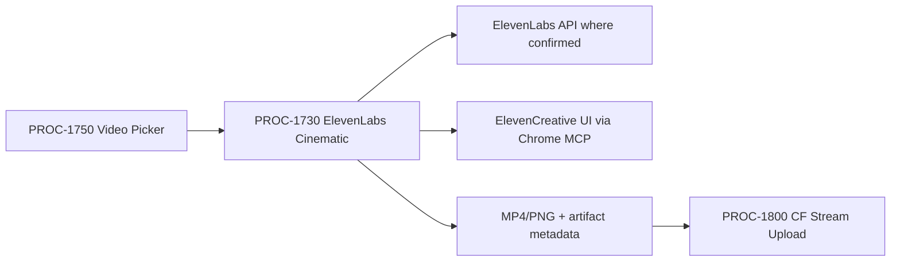

# PROC-1730 - ElevenLabs Cinematic Model Picker
## Produce cinematic image/video/lip-sync assets through ElevenLabs Image & Video where the model is variable fill, not architecture.
### Status: BUILD
### Medium: process
### Business: barton-enterprises/content

---

# IDENTITY

## 1. IDENTITY {#sec-1-identity}

| Field | Value |
|-------|-------|
| ID | PROC-1730 |
| Name | ElevenLabs Cinematic Model Picker |
| Medium | process |
| Business Silo | barton-enterprises/content |
| CTB Position | barton-enterprises/content/1730-elevenlabs-cinematic |
| ORBT | BUILD |
| Strikes | 0 |
| Authority | Gated (CC-03) |
| Version | 0.1.0 |
| Last Modified | 2026-05-05 |
| BAR Reference | BAR-390 |
| Owner | Dave Barton |
| ctb_node | barton-enterprises/content/1730-elevenlabs-cinematic |

### HEIR (8 fields)

| Field | Value |
|-------|-------|
| sovereign_ref | imo-creator |
| hub_id | content-elevenlabs-cinematic |
| ctb_placement | branch |
| imo_topology | middle |
| cc_layer | CC-03 |
| services | ElevenLabs API, ElevenCreative Image & Video UI, Chrome MCP, Doppler |
| secrets_provider | Doppler (imo-creator/dev/ELEVENLABS_API_KEY) |
| acceptance_criteria | Model selected by job fit; plan/credit gate known before generation; output downloadable as MP4/PNG or imported to ElevenCreative; artifact metadata recorded for PROC-1800 handoff |

## 1b. Geometry {#sec-1b-geometry}

**CTB Position:** Barton Enterprises -> Content -> 1730-elevenlabs-cinematic.

**Hub-Spoke Role:** branch lane. PROC-1750 routes jobs here when the script needs cinematic model selection, image/video generation, lip-sync, upscale, or reference-driven visuals.

**Altitude:** 10k operational lane.

---

# CONTRACT

## 2. PURPOSE {#sec-2-purpose}

PROC-1730 is the ElevenLabs cinematic lane. It exists because ElevenLabs is acting as a model picker/creative surface, not only a voice provider. Without this lane, every cinematic generation decision gets buried in one-off UI choices: selected model, generation mode, references, duration, aspect ratio, sound policy, credit cost, and export target.

**WHY:** This child locks the constant shape for ElevenLabs video work while allowing each video job to fill the selected model and references at runtime.

**Out of scope:** HeyGen avatar A-roll, NotebookLM source-grounded videos, local code-rendered videos, and CF Stream upload.

**Success metric:** a script/source packet can become a downloadable visual asset with the model choice, credit/cost gate, references, and export evidence recorded.

## 3. RESOURCES {#sec-3-resources}

| Component | Type | What It Provides | Status |
|-----------|------|------------------|--------|
| ElevenLabs Image & Video | provider UI | Image/video generation, variations, upscale, lip-sync, export | BUILD - requires live account smoke test |
| ElevenLabs API | API | Confirmed API features where available | BUILD - key present must be verified |
| Chrome MCP | browser automation | UI path for beta/UI-only Image & Video features | BUILD - live session required |
| Doppler | secrets | ELEVENLABS_API_KEY | BUILD - no secret value stored here |
| PROC-1750 | upstream | Routes `path_id: elevenlabs_cinematic` jobs | BUILD |
| PROC-1800 | downstream | Hosts MP4 on CF Stream | BUILD |

| BAR | Relation | Status |
|-----|----------|--------|
| BAR-390 | This lane | BUILD |
| BAR-392 | Picker that routes to this lane | BUILD |

| LBB Subject | What It Records |
|-------------|-----------------|
| processes | job_id, model, references, artifact path, export target, cost gate |

## 4. IMO — Input, Middle, Output {#sec-4-imo}

### Input

| Field | Required | Notes |
|-------|----------|-------|
| path_id | yes | `elevenlabs_cinematic` |
| script_or_prompt | yes | Prompt, script, or scene instruction |
| generation_mode | yes | text-to-video, image-to-video, image generation, lip-sync, upscale |
| selected_model | conditional | Variable fill selected by job fit |
| reference_packet | conditional | start frame, end frame, image refs, video refs, audio refs |
| sound_policy | yes | enabled, disabled, generated, supplied audio |
| duration_slot | yes | Must be supported by selected model |
| aspect_ratio_slot | yes | Must be supported by selected model |
| export_target | yes | download, ElevenCreative, CF Stream handoff |

### Middle

| Step | Input | What Happens | Output | Tool |
|------|-------|--------------|--------|------|
| 1 | job packet | Confirm this is the ElevenLabs lane | accepted/rejected | PROC-1750 contract |
| 2 | mode/model slots | Select model that supports requested inputs | model_selection_record | operator/Codex |
| 3 | plan/credit view | Confirm paid-plan and credit cost before generation | cost_gate_passed | ElevenLabs UI/API |
| 4 | references | Validate reference types against model support | reference_packet_valid | operator/Codex |
| 5 | prompt/script | Generate image/video/lip-sync/upscale output | provider_job_id | API or Chrome MCP |
| 6 | output | Download or import finished asset | artifact_path/export_id | UI/API |
| 7 | metadata | Write handoff metadata | handoff packet | local file/LBB |

### Output

- provider_job_id or UI session evidence
- selected_model and generation_mode
- credit/cost gate result
- artifact_path or ElevenCreative export ID
- handoff packet for PROC-1800 when MP4 exists
- LBB process record

## 5. DATA SCHEMA {#sec-5-data-schema}

| Source | Reads | Join Key |
|--------|-------|----------|
| PROC-1750 dispatch | path_id, objective, source type, requested output | video_job_id |
| ElevenLabs account | available models, plan/credits, generation surface | provider_session_id |
| Doppler | ELEVENLABS_API_KEY | provider |

| Target | Writes | When |
|--------|--------|------|
| handoff JSON | artifact path, selected model, generation settings | after artifact verified |
| LBB processes | run status, cost gate, artifact lineage | every run |

Forbidden: raw credentials, hardcoded selected model as architecture, generation without known cost/credit gate, output without download/import path.

## 6. DMJ — Define, Map, Join {#sec-6-dmj}

### DEFINE

| Element | ID | Format | Description | C/V |
|---------|----|--------|-------------|-----|
| path_id | D-1730-PATH | enum | `elevenlabs_cinematic` | C |
| generation_mode | D-1730-MODE | enum | selected production mode | V |
| selected_model | D-1730-MODEL | string | Sora, Veo, Kling, Runway, etc. where available | V |
| reference_packet | D-1730-REF | object | start/end/style/video/audio refs | V |
| cost_gate | D-1730-COST | boolean | credit/cost known before generation | C |
| artifact_path | D-1730-ART | path/url | downloaded or exported output | V |

### MAP

| Source | Target | Transform |
|--------|--------|-----------|
| objective + source type | generation_mode | choose best mode |
| generation_mode + references | selected_model | choose compatible model |
| selected_model | duration/aspect/sound support | validate before generation |
| output asset | handoff packet | verify and serialize |

### JOIN

`video_job_id -> selected_model -> provider_job_id -> artifact_path -> PROC-1800 handoff -> LBB process record`

## 7. CONSTANTS & VARIABLES {#sec-7-constants-variables}

Constants: lane name, model-picker architecture, cost gate before generation, reference compatibility gate, output verification gate, no raw secrets.

Variables: selected model, generation mode, prompt, references, duration, aspect ratio, sound policy, variation count, export target, artifact path.

## 8. STOP CONDITIONS {#sec-8-stop-conditions}

| Condition | Action |
|-----------|--------|
| ELEVENLABS_API_KEY unavailable when API path is selected | HALT |
| Required feature is UI-only and no Chrome MCP path is available | HALT |
| Current plan does not allow requested video generation | HALT |
| Cost/credit impact is unknown before generation | REPAIR before generation |
| Selected model cannot support requested input, duration, ratio, sound, or references | REPAIR before generation |
| Output cannot be downloaded or imported | HALT |
| Artifact lacks video_job_id lineage | HALT |

## 9. VERIFICATION {#sec-9-verification}

1. Verify Doppler exposes ELEVENLABS_API_KEY without printing it.
2. Verify UI or API lists available Image & Video generation options.
3. Run a no/low-cost readiness check that records plan/credit visibility.
4. For certification, generate or validate one short approved output.
5. Confirm artifact_path exists or export ID is captured.
6. Confirm LBB record and PROC-1800 handoff packet exist.

## 9b. Live Verification Log {#sec-9b-live-verification}

| Claim | Source | Status | Last Check | Value |
|-------|--------|--------|------------|-------|
| UT built | filesystem | PASS | 2026-05-05 | PROCESS-UT, DOCTRINE, heir, orbt created |
| API key visible | Doppler | PASS | 2026-05-05 | `ELEVENLABS_API_KEY` name present; secret value not printed |
| Image & Video account access | ElevenLabs UI/API | PENDING | - | live smoke test needed |
| First output generated | ElevenLabs UI/API | PENDING | - | no credits spent |

## 10. ANALYTICS {#sec-10-analytics}

| Metric | Target |
|--------|--------|
| cost gate before generation | 100% |
| model compatibility pass | 100% |
| artifact verification | 100% |
| LBB record per run | 1:1 |

## 11. EXECUTION TRACE {#sec-11-execution-trace}

| Field | Value |
|-------|-------|
| trace_id | PROC-1730-BUILD-001 |
| status | done |
| tools_used | Codex apply_patch |
| timestamp | 2026-05-05 |
| signed_by | Codex mechanic |

## 12. LOGBOOK (After Certification Only) {#sec-12-logbook}

No logbook entry until independent audit and live smoke test pass.

## 13. FLEET FAILURE REGISTRY {#sec-13-fleet-failure-registry}

| Pattern | Status |
|---------|--------|
| No failures registered | BUILD |

## 14. SESSION LOG {#sec-14-session-log}

| Date | What Was Done | LBB Record |
|------|---------------|------------|
| 2026-05-05 | Initial PROC-1730 lane UT created for BAR-390. | pending |

## Document Control

| Field | Value |
|-------|-------|
| Created | 2026-05-05 |
| Medium | process |
| BAR | BAR-390 |
