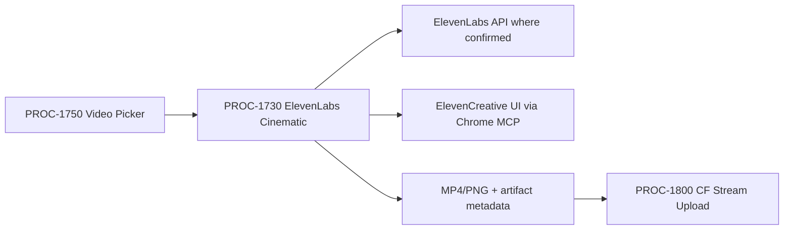

---
outside:
  heir:
    sovereign_ref: imo-creator
    hub_id: content-elevenlabs-cinematic
    ctb_placement: branch
    imo_topology: middle
    cc_layer: CC-03
    services: ElevenLabs API, ElevenCreative Image & Video UI, Chrome MCP, Doppler
    secrets_provider: Doppler (imo-creator/dev/ELEVENLABS_API_KEY)
    acceptance_criteria: Model selected by job fit; plan/credit gate known before generation; output downloadable as MP4/PNG or imported to ElevenCreative; artifact metadata recorded for PROC-1800 handoff
  orbt:
    state: BUILD
    strikes: 0
    authority: Gated (CC-03)
inside:
  heir:
    mission_control_target_slot: imo-creator.mission-control.system.processes
    mission_control_disposition: WIRE
  orbt:
    last_mechanic_trace: PROC-1730-REPAIR-001
    last_modified: 2026-05-12
---

# PROC-1730 - ElevenLabs Cinematic Model Picker
## Produce cinematic image/video/lip-sync assets through ElevenLabs Image & Video where the model is variable fill, not architecture.
### Status: BUILD
### Medium: process
### Business: barton-enterprises/content

---

## PRE-FLIGHT CHECKLIST {#sec-preflight}

| # | Item | Status | Evidence |
|---|------|--------|----------|
| 1 | heir.yaml present and valid | ☑ | `factory/content/1730-elevenlabs-cinematic/heir.yaml` |
| 2 | orbt.yaml present and valid | ☑ | `factory/content/1730-elevenlabs-cinematic/orbt.yaml` |
| 3 | §1 IDENTITY — all required fields populated | ☑ | §1 table complete |
| 4 | §2 PURPOSE — WHY and Out-of-scope stated | ☑ | §2 present |
| 5 | §3 RESOURCES — all components listed with status | ☑ | §3 table present |
| 6 | §4 IMO — Input/Middle/Output defined; PROC-1800 handoff packet in Output | ☑ | §4 Output includes handoff JSON schema |
| 7 | §5 OSAM — READ/WRITE/Join Chain/Forbidden/Query Routing present | ☑ | §5 OSAM section |
| 8 | §6 DMJ — Define/Map/Join complete | ☑ | §6 present |
| 9 | §7 CONSTANTS & VARIABLES — C column populated | ☑ | §7 table present |
| 10 | §8 STOP CONDITIONS — Kill Switch present | ☑ | §8 Kill Switch row present |
| 11 | §9 VERIFICATION — numbered steps present | ☑ | §9 present |
| 12 | §9b LIVE VERIFICATION LOG — STOP-07 blocker active; no live generation run | ☐ | §9b — all generation rows BLOCKED pending sovereign go |
| 13 | mission_control_wiring — WIRE / EXEMPT declared in frontmatter | ☑ | frontmatter — WIRE → imo-creator.mission-control.system.processes |

---

# IDENTITY

## 1. IDENTITY {#sec-1-identity}

| Field | Value |
|-------|-------|
| ID | PROC-1730 |
| Name | ElevenLabs Cinematic Model Picker |
| Medium | process |
| Business Silo | barton-enterprises/content |
| CTB Position | barton-enterprises/content/1730-elevenlabs-cinematic |
| ORBT | BUILD |
| Strikes | 0 |
| Authority | Gated (CC-03) |
| Version | 0.2.0 |
| Last Modified | 2026-05-12 |
| BAR Reference | BAR-390 |
| Owner | Dave Barton |
| ctb_node | barton-enterprises/content/1730-elevenlabs-cinematic |

### HEIR (8 fields)

| Field | Value |
|-------|-------|
| sovereign_ref | imo-creator |
| hub_id | content-elevenlabs-cinematic |
| ctb_placement | branch |
| imo_topology | middle |
| cc_layer | CC-03 |
| services | ElevenLabs API, ElevenCreative Image & Video UI, Chrome MCP, Doppler |
| secrets_provider | Doppler (imo-creator/dev/ELEVENLABS_API_KEY) |
| acceptance_criteria | Model selected by job fit; plan/credit gate known before generation; output downloadable as MP4/PNG or imported to ElevenCreative; artifact metadata recorded for PROC-1800 handoff |

## 1b. Geometry {#sec-1b-geometry}

**CTB Position:** Barton Enterprises -> Content -> 1730-elevenlabs-cinematic.

**Hub-Spoke Role:** branch lane. PROC-1750 routes jobs here when the script needs cinematic model selection, image/video generation, lip-sync, upscale, or reference-driven visuals.

**Altitude:** 10k operational lane.



---

# CONTRACT

## 2. PURPOSE {#sec-2-purpose}

PROC-1730 is the ElevenLabs cinematic lane. It exists because ElevenLabs is acting as a model picker/creative surface, not only a voice provider. Without this lane, every cinematic generation decision gets buried in one-off UI choices: selected model, generation mode, references, duration, aspect ratio, sound policy, credit cost, and export target.

**WHY:** This child locks the constant shape for ElevenLabs video work while allowing each video job to fill the selected model and references at runtime.

**Out of scope:** HeyGen avatar A-roll, NotebookLM source-grounded videos, local code-rendered videos, and CF Stream upload.

**Success metric:** a script/source packet can become a downloadable visual asset with the model choice, credit/cost gate, references, and export evidence recorded.

## 3. RESOURCES {#sec-3-resources}

| Component | Type | What It Provides | Status |
|-----------|------|------------------|--------|
| ElevenLabs Image & Video | provider UI | Image/video generation, variations, upscale, lip-sync, export | BUILD - requires live account smoke test |
| ElevenLabs API | API | Confirmed API features where available | BUILD - key present must be verified |
| Chrome MCP | browser automation | UI path for beta/UI-only Image & Video features | BUILD - live session required |
| Doppler | secrets | ELEVENLABS_API_KEY | BUILD - no secret value stored here |
| PROC-1750 | upstream | Routes `path_id: elevenlabs_cinematic` jobs | BUILD |
| PROC-1800 | downstream | Hosts MP4 on CF Stream | BUILD |

| BAR | Relation | Status |
|-----|----------|--------|
| BAR-390 | This lane | BUILD |
| BAR-392 | Picker that routes to this lane | BUILD |

| LBB Subject | What It Records |
|-------------|-----------------|
| processes | job_id, model, references, artifact path, export target, cost gate |

## 4. IMO — Input, Middle, Output {#sec-4-imo}

### Input

| Field | Required | Notes |
|-------|----------|-------|
| path_id | yes | `elevenlabs_cinematic` |
| script_or_prompt | yes | Prompt, script, or scene instruction |
| generation_mode | yes | text-to-video, image-to-video, image generation, lip-sync, upscale |
| selected_model | conditional | Variable fill selected by job fit |
| reference_packet | conditional | start frame, end frame, image refs, video refs, audio refs |
| sound_policy | yes | enabled, disabled, generated, supplied audio |
| duration_slot | yes | Must be supported by selected model |
| aspect_ratio_slot | yes | Must be supported by selected model |
| export_target | yes | download, ElevenCreative, CF Stream handoff |

### Middle

| Step | Input | What Happens | Output | Tool |
|------|-------|--------------|--------|------|
| 1 | job packet | Confirm this is the ElevenLabs lane | accepted/rejected | PROC-1750 contract |
| 2 | mode/model slots | Select model that supports requested inputs | model_selection_record | operator/Codex |
| 3 | plan/credit view | Confirm paid-plan and credit cost before generation | cost_gate_passed | ElevenLabs UI/API |
| 4 | references | Validate reference types against model support | reference_packet_valid | operator/Codex |
| 5 | prompt/script | Generate image/video/lip-sync/upscale output | provider_job_id | API or Chrome MCP |
| 6 | output | Download or import finished asset | artifact_path/export_id | UI/API |
| 7 | artifact | Verify artifact exists, non-zero size, compute sha256 | artifact_verified | local |
| 8 | metadata | Write handoff metadata | handoff packet | local file/LBB |
| 9 | handoff packet | Build PROC-1800 handoff packet; write to handoff file | handoff_file | local |
| 10 | handoff file | Ingest run record to LBB | LBB process record | LBB |

### Output

- provider_job_id or UI session evidence
- selected_model and generation_mode
- credit/cost gate result
- artifact_path or ElevenCreative export ID
- handoff packet for PROC-1800 when MP4 exists
- LBB process record

**PROC-1800 Handoff Packet — JSON Schema:**

```json
{
  "video_job_id": "<parent job ID from PROC-1750>",
  "process_id": "PROC-1730",
  "lane": "elevenlabs_cinematic",
  "provider_job_id": "<ElevenLabs API job ID or UI session evidence>",
  "selected_model": "<model name used for generation>",
  "generation_mode": "<text-to-video | image-to-video | image-generation | lip-sync | upscale>",
  "sound_policy": "<enabled | disabled | generated | supplied>",
  "artifact_path": "<local path to downloaded MP4 or PNG>",
  "artifact_size_bytes": "<non-zero integer>",
  "artifact_sha256": "<hex digest>",
  "export_target": "<download | elevencreative | cf_stream>",
  "cost_gate_passed": true,
  "ready_for_upload": true
}
```

## 5. OSAM {#sec-5-osam}

### READ

| Source | Reads | Join Key |
|--------|-------|----------|
| PROC-1750 dispatch | path_id, objective, source type, requested output | video_job_id |
| ElevenLabs account | available models, plan/credits, generation surface | provider_session_id |
| Doppler | ELEVENLABS_API_KEY | provider |

### WRITE

| Target | Writes | When |
|--------|--------|------|
| handoff JSON | artifact path, selected model, generation settings, sha256 | after artifact verified |
| LBB processes | run status, cost gate, artifact lineage | every run |

### Join Chain

`video_job_id -> selected_model -> provider_job_id -> artifact_path -> PROC-1800 handoff -> LBB process record`

### Forbidden

- Raw credentials stored in any artifact
- Hardcoded selected model as architecture (model is variable fill)
- Generation without known cost/credit gate
- Output without download/import path
- Artifact without video_job_id lineage

### Query Routing

All reads from ElevenLabs account state go through provider session (UI) or Doppler-sourced API key. No direct secret embedding.

### Process Composition

PROC-1750 → PROC-1730 → PROC-1800. PROC-1730 is middle-only. No logic in transport layers.

## 6. DMJ — Define, Map, Join {#sec-6-dmj}

### DEFINE

| Element | ID | Format | Description | C/V |
|---------|----|--------|-------------|-----|
| path_id | D-1730-PATH | enum | `elevenlabs_cinematic` | C |
| generation_mode | D-1730-MODE | enum | selected production mode | V |
| selected_model | D-1730-MODEL | string | model name selected by job fit | V |
| reference_packet | D-1730-REF | object | start/end/style/video/audio refs | V |
| cost_gate | D-1730-COST | boolean | credit/cost known before generation | C |
| artifact_path | D-1730-ART | path/url | downloaded or exported output | V |
| artifact_sha256 | D-1730-SHA | string | hex digest of artifact | V |
| provider_job_id | D-1730-PJI | string | ElevenLabs job ID or session evidence | V |

### MAP

| Source | Target | Transform |
|--------|--------|-----------|
| objective + source type | generation_mode | choose best mode |
| generation_mode + references | selected_model | choose compatible model |
| selected_model | duration/aspect/sound support | validate before generation |
| output asset | handoff packet | verify and serialize |

### JOIN

`video_job_id -> selected_model -> provider_job_id -> artifact_path -> PROC-1800 handoff -> LBB process record`

## 7. CONSTANTS & VARIABLES {#sec-7-constants-variables}

| Slot | C/V | Locked Value / Fill Examples |
|------|-----|------------------------------|
| lane name | C | `elevenlabs_cinematic` |
| model-picker architecture | C | model is variable fill, never hardcoded |
| cost gate before generation | C | always required — no exceptions |
| reference compatibility gate | C | always required before generation |
| output verification gate | C | sha256 + non-zero size always required |
| no raw secrets | C | connector references only |
| selected model | V | Sora, Veo, Kling, Runway, etc. where available |
| generation mode | V | text-to-video, image-to-video, image generation, lip-sync, upscale |
| prompt | V | per-job script or scene instruction |
| references | V | per-job start/end/style/video/audio refs |
| duration | V | per-job, must be model-supported |
| aspect ratio | V | per-job, must be model-supported |
| sound policy | V | enabled, disabled, generated, supplied audio |
| variation count | V | per-job |
| export target | V | download, ElevenCreative, CF Stream |
| artifact path | V | per-run output location |

## 8. STOP CONDITIONS {#sec-8-stop-conditions}

| Condition | Action |
|-----------|--------|
| ELEVENLABS_API_KEY unavailable when API path is selected | HALT |
| Required feature is UI-only and no Chrome MCP path is available | HALT |
| Current plan does not allow requested video generation | HALT |
| Cost/credit impact is unknown before generation | REPAIR before generation |
| Selected model cannot support requested input, duration, ratio, sound, or references | REPAIR before generation |
| Output cannot be downloaded or imported | HALT |
| Artifact lacks video_job_id lineage | HALT |
| Artifact size is zero or sha256 missing | HALT — do not write handoff packet |
| Kill Switch | Human types KILL SWITCH — halt all generation immediately, abandon job, write HALT record to LBB |

## 9. VERIFICATION {#sec-9-verification}

1. Verify Doppler exposes ELEVENLABS_API_KEY without printing it.
2. Verify UI or API lists available Image & Video generation options.
3. Run a no/low-cost readiness check that records plan/credit visibility.
4. For certification, generate or validate one short approved output.
5. Confirm artifact_path exists or export ID is captured.
6. Confirm sha256 computed and non-zero size verified.
7. Confirm LBB record and PROC-1800 handoff packet exist.

## 9b. Live Verification Log {#sec-9b-live-verification}

| Claim | Source | Status | Last Check | Value |
|-------|--------|--------|------------|-------|
| UT built | filesystem | PASS | 2026-05-12 | PROCESS-UT, DOCTRINE, heir, orbt present |
| API key visible | Doppler | PASS | 2026-05-12 | `ELEVENLABS_API_KEY` name present; secret value not printed |
| Image & Video account access | ElevenLabs UI/API | 🔴 BLOCKED | — | STOP-07: live account access requires ElevenLabs plan/credit check; blocked until sovereign go |
| First output generated | ElevenLabs UI/API | 🔴 BLOCKED | — | STOP-07: generation spends ElevenLabs credits; blocked until sovereign go |

## 10. ANALYTICS {#sec-10-analytics}

### 10a. Metrics

| Metric | Target |
|--------|--------|
| cost gate before generation | 100% |
| model compatibility pass | 100% |
| artifact verification (sha256 + non-zero) | 100% |
| LBB record per run | 1:1 |
| PROC-1800 handoff packet per run | 1:1 |

### 10b. Sigma Tracking

| Run | Metric | Value | Direction |
|-----|--------|-------|-----------|
| BUILD-001 | — | — | No runs yet — BUILD state |

Sigma tightens when: cost gate rate = 100%, model compatibility = 100%, artifact verification = 100%, LBB record rate = 1:1 across successive runs.

### 10c. ORBT Gate Rules

| Gate | Rule |
|------|------|
| BUILD → OPERATE | First certified run passes all §9 verification steps; Auditor signs off |
| OPERATE → REPAIR | Any metric below target for 2 consecutive runs |
| REPAIR → OPERATE | Root cause identified, fix applied, re-certified |
| Any → TROUBLESHOOT_TRAIN | Strike 3 reached |

## 11. EXECUTION TRACE {#sec-11-execution-trace}

| Trace ID | Status | Tools Used | Timestamp | Signed By |
|----------|--------|-----------|-----------|-----------|
| PROC-1730-BUILD-001 | done | Codex apply_patch | 2026-05-05 | Codex mechanic |
| PROC-1730-REPAIR-001 | done | Mechanic Write | 2026-05-12 | Mechanic (BAR-VIDEO-PATH-CERTIFICATION) |

**REPAIR-001 scope:** Added BS Law Y-junction YAML frontmatter, 13-item ☑/☐ checklist, renamed §5 DATA SCHEMA → OSAM, added PROC-1800 handoff JSON schema to §4 Output, added STOP-07 blockers to §9b, expanded §10 to 10a/10b/10c, added Kill Switch to §8, version bumped 0.1.0 → 0.2.0.

## 12. LOGBOOK (After Certification Only) {#sec-12-logbook}

No logbook entry until independent audit and live smoke test pass.

## 13. FLEET FAILURE REGISTRY {#sec-13-fleet-failure-registry}

| Pattern | Status |
|---------|--------|
| No failures registered | BUILD |

## 14. SESSION LOG {#sec-14-session-log}

| Date | What Was Done | LBB Record |
|------|---------------|------------|
| 2026-05-05 | Initial PROC-1730 lane UT created for BAR-390. | pending |
| 2026-05-12 | REPAIR-001: Added BS Law Y-junction frontmatter, 13-item checklist, §5 renamed to OSAM, PROC-1800 handoff JSON schema, STOP-07 blockers in §9b, expanded §10 (10a/10b/10c), Kill Switch in §8. Version 0.1.0 → 0.2.0. BAR-VIDEO-PATH-CERTIFICATION WO-1730-EX. | pending |

## Document Control

| Field | Value |
|-------|-------|
| Created | 2026-05-05 |
| Medium | process |
| BAR | BAR-390 |
| Version | 0.2.0 |
| Last Modified | 2026-05-12 |
