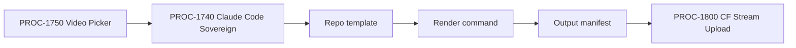

# PROC-1740 - Claude Code Sovereign Video
## Render deterministic repo-owned videos from a script using local templates, commands, and output manifests.
### Status: BUILD
### Medium: process
### Business: barton-enterprises/content

---

# IDENTITY

## 1. IDENTITY {#sec-1-identity}

| Field | Value |
|-------|-------|
| ID | PROC-1740 |
| Name | Claude Code Sovereign Video |
| Medium | process |
| Business Silo | barton-enterprises/content |
| CTB Position | barton-enterprises/content/1740-claude-code-sovereign |
| ORBT | BUILD |
| Strikes | 0 |
| Authority | Gated (CC-03) |
| Version | 0.1.0 |
| Last Modified | 2026-05-05 |
| BAR Reference | BAR-391 |
| Owner | Dave Barton |
| ctb_node | barton-enterprises/content/1740-claude-code-sovereign |

### HEIR (8 fields)

| Field | Value |
|-------|-------|
| sovereign_ref | imo-creator |
| hub_id | content-claude-code-sovereign-video |
| ctb_placement | branch |
| imo_topology | middle |
| cc_layer | CC-03 |
| services | local shell, repo templates, render command, optional CF/R2 handoff |
| secrets_provider | none by default; Doppler only for downstream storage |
| acceptance_criteria | Script accepted; template selected; deterministic render command succeeds; output manifest emitted; artifact path verified; handoff packet ready |

## 1b. Geometry {#sec-1b-geometry}

**CTB Position:** Barton Enterprises -> Content -> 1740-claude-code-sovereign.

**Hub-Spoke Role:** branch lane. This is the owned-code video path for templates we control.

**Altitude:** 5k execution lane.

---

# CONTRACT

## 2. PURPOSE {#sec-2-purpose}

PROC-1740 exists so a script can become a video through repo-owned templates instead of a vendor UI. It is the deterministic path: same script + same template + same assets + same command should produce a traceable output manifest.

**WHY:** Without this path, every video depends on vendor availability. This lane gives Barton Enterprises a sovereign build path for explainers, diagrams, slides, kinetic typography, and code-rendered videos.

**Out of scope:** provider avatar generation, NotebookLM source generation, ElevenLabs model picking, hosting/upload.

**Success metric:** a script can be rendered by a known command and produce a non-zero output artifact plus manifest.

## 3. RESOURCES {#sec-3-resources}

| Component | Type | What It Provides | Status |
|-----------|------|------------------|--------|
| gate template set | markdown prompts/assets | existing gate-video source templates | PASS-LOCAL - `workers/video-pipeline/gate-templates/` |
| existing rendered outputs | MP4 artifacts | proof that the video path has produced assets | PASS-LOCAL - 5 MP4s verified in `workers/video-pipeline/output/` |
| render command reference | documented CLI/UI sequence | reproducible generation recipe | PARTIAL - `workers/video-pipeline/VIDEO-BUILD-GUIDE.md` full automated run |
| output manifest | JSON | artifact lineage | PASS-LOCAL - `workers/video-pipeline/output/video-output-manifest.json` |
| PROC-1750 | upstream | route jobs to `claude_code_sovereign` | BUILD |
| PROC-1800 | downstream | CF Stream handoff | BUILD |

| BAR | Relation | Status |
|-----|----------|--------|
| BAR-391 | This lane | BUILD |
| BAR-392 | Picker that routes to this lane | BUILD |

## 4. IMO — Input, Middle, Output {#sec-4-imo}

### Input

| Field | Required | Notes |
|-------|----------|-------|
| path_id | yes | `claude_code_sovereign` |
| script | yes | narration or visual sequence |
| template_id | yes | repo-owned template |
| brand_packet | yes | colors, logo, typography, voice policy |
| asset_packet | conditional | images, SVGs, charts, B-roll |
| render_profile | yes | 16:9, 9:16, resolution, duration |

### Middle

| Step | Input | What Happens | Output | Tool |
|------|-------|--------------|--------|------|
| 1 | job packet | validate lane and script | accepted/rejected | process check |
| 2 | template_id | confirm template exists | template_path | filesystem |
| 3 | script/assets | generate scene plan/config | render_config | Codex/Claude Code |
| 4 | render_config | run deterministic render command | output file | shell |
| 5 | output file | verify file exists and size > 0 | artifact_verified | filesystem |
| 6 | metadata | emit output manifest | manifest_path | local write |
| 7 | manifest | hand off to PROC-1800 if MP4 | handoff packet | local write |

### Output

- output video path
- output manifest
- render command and exit code
- template_id and script reference
- handoff packet for PROC-1800

## 5. DATA SCHEMA {#sec-5-data-schema}

| Source | Reads | Join Key |
|--------|-------|----------|
| PROC-1750 dispatch | script, template_id, render_profile | video_job_id |
| repo template | composition code/assets | template_id |
| local filesystem | output files | artifact_id |

| Target | Writes | When |
|--------|--------|------|
| render config | script + template fill | before render |
| output manifest | render evidence | after output verification |
| LBB processes | status and lineage | every run |

Forbidden: no render without template, no success without manifest, no downstream handoff with zero-byte file.

## 6. DMJ — Define, Map, Join {#sec-6-dmj}

### DEFINE

| Element | ID | Format | Description | C/V |
|---------|----|--------|-------------|-----|
| path_id | D-1740-PATH | enum | `claude_code_sovereign` | C |
| template_id | D-1740-TPL | string | owned template selector | V |
| render_command | D-1740-CMD | command | deterministic render command | C once selected |
| output_manifest | D-1740-MAN | file | proof of render lineage | C |
| artifact_path | D-1740-ART | path | output video | V |

### MAP

`script -> scene plan -> render config -> render command -> artifact -> manifest`

### JOIN

`video_job_id -> template_id -> render_config -> artifact_path -> output_manifest -> PROC-1800 handoff`

## 7. CONSTANTS & VARIABLES {#sec-7-constants-variables}

Constants: owned-code lane, template existence gate, render command gate, output manifest gate, non-zero artifact gate.

Variables: script, template_id, assets, brand packet, render profile, output path.

## 8. STOP CONDITIONS {#sec-8-stop-conditions}

| Condition | Action |
|-----------|--------|
| No template exists for template_id | HALT |
| No deterministic render command is defined | HALT |
| Render command fails | HALT and log exit code |
| Output file missing or zero bytes | HALT |
| Output manifest missing | HALT |
| Required asset missing | REPAIR before render |

## 9. VERIFICATION {#sec-9-verification}

1. Locate or create the first repo-owned video template. PASS-LOCAL: gate template set exists.
2. Define exact render command. PARTIAL: `VIDEO-BUILD-GUIDE.md` documents the NotebookLM/InVideo-style generation sequence; a fully deterministic local renderer is still pending if this lane must be provider-independent.
3. Run a sample script render. PASS-HISTORICAL: five MP4 artifacts already exist in `workers/video-pipeline/output/`.
4. Verify output artifact size > 0. PASS-LOCAL: manifest generator verified all MP4 files are non-zero.
5. Verify output manifest exists and references script/template/artifact. PASS-LOCAL: `video-output-manifest.json` written.
6. Hand manifest to PROC-1800 readiness path. PENDING.

## 9b. Live Verification Log {#sec-9b-live-verification}

| Claim | Source | Status | Last Check | Value |
|-------|--------|--------|------------|-------|
| UT built | filesystem | PASS | 2026-05-05 | process files created |
| render template selected | repo | PASS-LOCAL | 2026-05-05 | `workers/video-pipeline/gate-templates/` |
| existing MP4 artifacts verified | filesystem | PASS-LOCAL | 2026-05-05 | 5 MP4s found, all non-zero |
| output manifest emitted | filesystem | PASS-LOCAL | 2026-05-05 | `workers/video-pipeline/output/video-output-manifest.json` |
| deterministic local render command | shell | PENDING | - | provider/UI-backed generation sequence documented; local code renderer not selected |

## 10. ANALYTICS {#sec-10-analytics}

| Metric | Target |
|--------|--------|
| render success | >= 90% after baseline |
| manifest per render | 1:1 |
| zero-byte outputs | 0 |

## 11. EXECUTION TRACE {#sec-11-execution-trace}

| Field | Value |
|-------|-------|
| trace_id | PROC-1740-BUILD-001 |
| status | done |
| tools_used | Codex apply_patch |
| timestamp | 2026-05-05 |
| signed_by | Codex mechanic |

## 12. LOGBOOK (After Certification Only) {#sec-12-logbook}

No logbook entry until independent audit and live render test pass.

## 13. FLEET FAILURE REGISTRY {#sec-13-fleet-failure-registry}

| Pattern | Status |
|---------|--------|
| No failures registered | BUILD |

## 14. SESSION LOG {#sec-14-session-log}

| Date | What Was Done | LBB Record |
|------|---------------|------------|
| 2026-05-05 | Initial PROC-1740 sovereign video lane UT created for BAR-391. | pending |

## Document Control

| Field | Value |
|-------|-------|
| Created | 2026-05-05 |
| Medium | process |
| BAR | BAR-391 |
