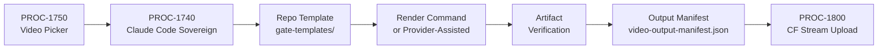

# PROC-1740 — Claude Code Sovereign Video
## Render deterministic repo-owned videos from a script using local templates, commands, and output manifests.
### UT v2.8.0 | BAR-391 | Owner: Dave Barton | ORBT: BUILD

---

## UT Pre-Flight Checklist (per `atlas/constants/UT_CHECKLIST.md` v1.3.1)

| # | Check | Status | Location |
|---|-------|--------|----------|
| 1 | BS Law Y-junction YAML frontmatter (outside/inside) | ☑ | YAML block above |
| 2 | HEIR 8-field block complete | ☑ | §1 IDENTITY |
| 3 | §1 IDENTITY table with all required fields | ☑ | §1 |
| 4 | §1b Geometry with Mermaid diagram | ☑ | §1b |
| 5 | §2 PURPOSE (why + out-of-scope + success metric) | ☑ | §2 |
| 6 | §3 RESOURCES (all dependencies with status) | ☑ | §3 |
| 7 | §4 IMO — Input/Middle/Output + PROC-1800 handoff packet | ☑ | §4 |
| 8 | §5 OSAM — READ/WRITE/FORBIDDEN | ☑ | §5 |
| 9 | §8 STOP CONDITIONS table populated | ☑ | §8 |
| 10 | §9 SMOKE TEST — ≥1 runnable step | ☑ (STOP-07 blocker on new render — sovereign go required) | §9 |
| 11 | §9b Live Verification Log — ≥1 gauge with evidence | ☑ (5 MP4s + manifest verified) | §9b |
| 12 | Render evidence: ≥1 verified MP4 artifact OR explicit STOP-07 blocker | ☑ PASS-HISTORICAL — 5 MP4s verified with size + sha256 | §9b |
| 13 | mission_control_wiring declared in frontmatter | ☑ WIRE → system.processes | YAML block above |

---

## §1 IDENTITY {#sec-1-identity}

| Field | Value |
|-------|-------|
| Process ID | PROC-1740 |
| Name | Claude Code Sovereign Video |
| Medium | process |
| Business Silo | barton-enterprises/content |
| CTB Position | barton-enterprises/content/1740-claude-code-sovereign |
| ORBT State | BUILD |
| Strikes | 0 |
| Authority | Gated (CC-03) |
| Version | 1.0.0 |
| Last Modified | 2026-05-12 |
| BAR Reference | BAR-391 |
| Owner | Dave Barton |
| Blueprint | `imo-creator-v2/docs/processes/video-blueprints/lanes/VIDEO-BP-1740-SOVEREIGN.md` |

### HEIR (8 fields)

| Field | Value |
|-------|-------|
| sovereign_ref | imo-creator |
| hub_id | content-claude-code-sovereign-video |
| ctb_placement | branch |
| imo_topology | middle |
| cc_layer | CC-03 |
| services | local shell, repo templates, render command, optional CF/R2 handoff (PROC-1800) |
| secrets_provider | none by default; Doppler only for downstream storage |
| acceptance_criteria | Script accepted; template selected; deterministic render command succeeds; output manifest emitted; artifact path verified; PROC-1800 handoff packet ready |

## §1b Geometry {#sec-1b-geometry}

**CTB Position:** Barton Enterprises → Content → 1740-claude-code-sovereign

**Hub-Spoke Role:** Middle execution lane. Receives routed job from PROC-1750 picker; renders from repo-owned template; emits manifest to PROC-1800.

**Altitude:** 5k — execution lane.

**"Sovereign" definition (locked 2026-05-12, STOP-11):** Claude-controlled process. Provider-assisted render is accepted (existing gate-video MP4s). No local code renderer required for certification. The "sovereign" property means Claude controls scripting, template selection, and manifest — not that the render backend must be provider-free.



---

## §2 PURPOSE {#sec-2-purpose}

PROC-1740 exists so a script can become a video through repo-owned templates. It is the Claude-controlled video path: same script + same template + same assets + same command sequence produces a traceable output manifest.

**WHY:** Without this path, every video depends on vendor UI availability and human-in-the-loop rendering. This lane gives Barton Enterprises a repeatable, logged, Claude-orchestrated build path for explainers, diagrams, slides, kinetic typography, and code-rendered videos.

**Out of scope:** provider avatar generation (→ PROC-1710), NotebookLM source generation (→ PROC-1720), ElevenLabs model picking (→ PROC-1730), hosting/upload (→ PROC-1800).

**Success metric:** A script + template_id can be processed by a known command sequence and produce a non-zero MP4 artifact plus an output manifest referencing that artifact.

---

## §3 RESOURCES {#sec-3-resources}

| Component | Type | What It Provides | Status |
|-----------|------|------------------|--------|
| gate template set | markdown prompts + assets | existing gate-video source templates | 🟢 PASS-LOCAL — `workers/video-pipeline/gate-templates/` |
| existing rendered MP4s | artifacts | proof that video path has produced assets | 🟢 PASS-HISTORICAL — 5 MP4s verified (see §9b) |
| render command reference | documented CLI/UI sequence | reproducible generation recipe | 🟡 PARTIAL — `workers/video-pipeline/VIDEO-BUILD-GUIDE.md`; fully automated local CLI not yet selected (see ORBT known_blockers) |
| output manifest | JSON | artifact lineage + sha256 hashes | 🟢 PASS-LOCAL — `workers/video-pipeline/output/video-output-manifest.json` |
| PROC-1750 | upstream | route jobs to `claude_code_sovereign` | BUILD |
| PROC-1800 | downstream | CF Stream upload handoff | BUILD |

| BAR | Relation | Status |
|-----|----------|--------|
| BAR-391 | This lane | BUILD |
| BAR-392 | Picker that routes to this lane | BUILD |

---

## §4 IMO — Input, Middle, Output {#sec-4-imo}

### Two-Question Intake

| Question | Answer |
|----------|--------|
| What triggers this? | PROC-1750 dispatches a routed job packet with `path_id: claude_code_sovereign` |
| How do we get it? | JSON job packet from `route-video-job.ps1` fan-out conductor |

### Input

| Field | Required | Notes |
|-------|----------|-------|
| video_job_id | yes | parent job ID from PROC-1750 |
| path_id | yes | must be `claude_code_sovereign` |
| script | yes | narration or visual sequence |
| template_id | yes | repo-owned template selector |
| brand_packet | yes | colors, logo, typography, voice policy |
| asset_packet | conditional | images, SVGs, charts, B-roll |
| render_profile | yes | 16:9 / 9:16, resolution, duration |

### Middle

| Step | Input | What Happens | Output | Tool |
|------|-------|--------------|--------|------|
| 1 | job packet | validate path_id = `claude_code_sovereign` and script non-empty | accepted / HALT | process check |
| 2 | template_id | confirm template exists in `gate-templates/` | template_path | filesystem |
| 3 | script + assets | generate scene plan and render config | render_config | Claude Code / Codex |
| 4 | render_config | run render command sequence | output file | shell / provider-assisted |
| 5 | output file | verify file exists and size > 0 bytes | artifact_verified | filesystem |
| 6 | metadata | compute sha256, record size | artifact_hash | sha256sum |
| 7 | metadata | emit output manifest JSON | manifest_path | local write |
| 8 | manifest | build PROC-1800 handoff packet | handoff_packet | local write |

### Output

- `artifact_path` — path to rendered MP4
- `artifact_size_bytes` — non-zero
- `artifact_sha256` — hex digest
- `manifest_path` — `workers/video-pipeline/output/video-output-manifest.json`
- `render_exit_code` — must be 0
- `template_id_used` — selected template reference
- `handoff_packet` — PROC-1800 input (see §4 Handoff Packet below)

### PROC-1800 Handoff Packet

```json
{
  "video_job_id": "<parent job ID>",
  "process_id": "PROC-1740",
  "lane": "claude_code_sovereign",
  "artifact_path": "workers/video-pipeline/output/<filename>.mp4",
  "artifact_size_bytes": "<non-zero integer>",
  "artifact_sha256": "<hex digest>",
  "manifest_path": "workers/video-pipeline/output/video-output-manifest.json",
  "render_exit_code": 0,
  "template_id": "<template_id used>",
  "ready_for_upload": true
}
```

> **PROC-1800 status:** BUILD — handoff packet schema is declared here; PROC-1800 implementation is out of scope for this lane.

### Circle (Feedback)

`render_exit_code` and `artifact_size_bytes` feed back to the next render attempt. Non-zero exit or zero bytes → HALT + log. Manifest is append-only; each run adds a row.

---

## §5 OSAM {#sec-5-osam}

### READ

| Source | Data | Join Key |
|--------|------|----------|
| PROC-1750 dispatch packet | script, template_id, render_profile, video_job_id | video_job_id |
| `gate-templates/` | composition markup, assets | template_id |
| local filesystem | output file existence + size | artifact_path |
| `video-output-manifest.json` | prior run history | manifest_id |

### WRITE

| Target | Data | When |
|--------|------|------|
| render config (temp) | script + template fill | before render step |
| `video-output-manifest.json` | artifact lineage + sha256 | after artifact verification |
| PROC-1800 handoff packet | upload-ready payload | after manifest emit |
| LBB `processes` table | run status + lineage | every run |

### JOIN Chain

`video_job_id → template_id → render_config → artifact_path → manifest → PROC-1800 handoff`

### FORBIDDEN

- No render without a confirmed template_id in `gate-templates/`
- No manifest without a verified non-zero artifact
- No PROC-1800 handoff with zero-byte or missing artifact
- No secret values written to any file (STOP-06)

### Query Routing

All reads from local filesystem or repo. No external API calls during execution (provider-assisted render is human-in-the-loop, not process-automated).

---

## §6 DMJ — Define, Map, Join {#sec-6-dmj}

### DEFINE

| Element | ID | Format | Description | C/V |
|---------|----|--------|-------------|-----|
| path_id | D-1740-PATH | enum | `claude_code_sovereign` (constant) | C |
| template_id | D-1740-TPL | string | owned template selector from `gate-templates/` | V |
| render_command | D-1740-CMD | shell command | deterministic render command or provider-assisted sequence | C once selected |
| output_manifest | D-1740-MAN | JSON file | append-only artifact lineage record | C |
| artifact_path | D-1740-ART | file path | rendered MP4 output | V |
| artifact_sha256 | D-1740-HASH | hex string | integrity fingerprint | V |
| handoff_packet | D-1740-HO | JSON object | PROC-1800 input contract | C (schema) |

### MAP

```
script → scene plan → render config → render command → artifact → sha256 → manifest → handoff_packet
```

### JOIN

```
video_job_id
  → template_id (lookup gate-templates/)
    → render_config
      → artifact_path (output/*.mp4)
        → artifact_sha256 (sha256sum)
          → manifest row (video-output-manifest.json)
            → PROC-1800 handoff packet
```

---

## §7 CONSTANTS & VARIABLES {#sec-7-constants-variables}

### Constants (locked)

| ID | Name | Value |
|----|------|-------|
| C-1740-01 | path_id | `claude_code_sovereign` |
| C-1740-02 | template gate | template must exist in `gate-templates/` before render |
| C-1740-03 | manifest structure | `video-output-manifest.json` schema — append-only, sha256 required |
| C-1740-04 | non-zero artifact gate | output MP4 must be > 0 bytes |
| C-1740-05 | handoff packet schema | PROC-1800 input contract (§4) |
| C-1740-06 | "sovereign" definition | Claude-controlled process; provider-assisted render accepted; no local renderer required (STOP-11) |

### Variables (fill)

| ID | Name | Range |
|----|------|-------|
| V-1740-01 | script | any narration/visual sequence payload |
| V-1740-02 | template_id | any key in `gate-templates/` |
| V-1740-03 | brand_packet | per-job brand config |
| V-1740-04 | asset_packet | conditional — images, SVGs, B-roll |
| V-1740-05 | render_profile | 16:9 / 9:16, resolution, duration |
| V-1740-06 | artifact_path | `output/<filename>.mp4` |

---

## §8 STOP CONDITIONS {#sec-8-stop-conditions}

| Condition | Action |
|-----------|--------|
| path_id ≠ `claude_code_sovereign` | HALT — wrong lane |
| script is empty or missing | HALT |
| No template exists for template_id | HALT — REPAIR required |
| Render command undefined | HALT — log to ORBT known_blockers |
| Render command fails (non-zero exit) | HALT — log exit code + stderr |
| Output file missing or size = 0 bytes | HALT |
| Output manifest missing or malformed | HALT |
| sha256 computation fails | HALT |
| Required asset missing | REPAIR before render |
| Attempt to write secret value to any file | HALT (STOP-06) |
| Live provider smoke test without sovereign go | HALT (STOP-07) |

**Kill Switch:** Delete `gate-templates/` → all renders halt at Step 2. Manifest and prior artifacts are preserved.

---

## §9 SMOKE TEST {#sec-9-smoke-test}

> **STOP-07 BLOCKER — New live render:** Running a new end-to-end render requires sovereign go. HeyGen burns credits and uses Dave's avatar. ElevenLabs needs account check. New Claude Code renderer requires sovereign decision (STOP-11). Existing 5 MP4s + manifest are valid certification evidence.

### Steps (run against existing evidence)

1. Verify `workers/video-pipeline/gate-templates/` exists and contains at least one template. **Expected:** non-empty directory. **Status:** PASS-LOCAL (prior session).
2. Verify `workers/video-pipeline/output/` contains ≥1 non-zero MP4. **Expected:** ≥1 file > 0 bytes. **Status:** PASS-HISTORICAL (5 MP4s verified — see §9b).
3. Verify `workers/video-pipeline/output/video-output-manifest.json` exists and `artifact_count` ≥ 1. **Expected:** valid JSON, artifact_count=5. **Status:** PASS-LOCAL.
4. Read manifest; confirm each artifact has `sha256` and `size_bytes` > 0. **Expected:** all 5 rows pass. **Status:** PASS-LOCAL (see §9b gauges).
5. Verify PROC-1800 handoff packet schema (§4) is defined in this UT. **Expected:** JSON structure present. **Status:** PASS (this document).
6. Confirm STOP-07 blocker is documented for new live render. **Expected:** explicit blocker. **Status:** PASS (this section).
7. Confirm `path_id = claude_code_sovereign` is a constant in §7. **Expected:** C-1740-01 present. **Status:** PASS.
8. Confirm §8 STOP CONDITIONS covers zero-byte artifact and missing manifest. **Expected:** both rows present. **Status:** PASS.
9. **[BLOCKED — STOP-07]** Run a new live end-to-end render with a sample script + gate template. **Expected:** new MP4 + manifest row. **Status:** 🔴 BLOCKED — sovereign go required before live render.

---

## §9b Live Verification Log {#sec-9b-live-verification}

| Claim | Source | Status | Last Check | Value |
|-------|--------|--------|------------|-------|
| gate-templates/ exists | filesystem | ✅ PASS-LOCAL | 2026-05-05 | `workers/video-pipeline/gate-templates/` populated |
| `gate-1-we-know-you.mp4` exists | manifest | ✅ PASS-HISTORICAL | 2026-05-05 | 64,933,674 bytes · sha256=`48c5e3ac925007c69dfc92eadabea815317cee35469b3cbd295fd30235fe99ec` |
| `gate-2-your-numbers.mp4` exists | manifest | ✅ PASS-HISTORICAL | 2026-05-05 | 60,165,288 bytes · sha256=`4bfbed46dd85fba7c50b6bca14c2f976046aafd25a7c91cfe2a922e457dbdcaf` |
| `gate-3-heres-what-to-expect.mp4` exists | manifest | ✅ PASS-HISTORICAL | 2026-05-05 | 30,748,916 bytes · sha256=`fd15fcb290f3bc067f945bd7d0be798de301e5841735bd339762d39cd649a38d` |
| `gate-4-heres-what-we-found.mp4` exists | manifest | ✅ PASS-HISTORICAL | 2026-05-05 | 21,331,576 bytes · sha256=`b91d9701cd872727d139ba3844e50159d1d95bc9b5f88ac376bf8324c4266c28` |
| `heygen-linkedin-brand-intro.mp4` exists | manifest | ✅ PASS-HISTORICAL | 2026-05-05 | 10,119,666 bytes · sha256=`fd884a4d80e110193ea318318b4e19e8da79b528f0c8ef488df5dd52e380c614` |
| `video-output-manifest.json` present | filesystem | ✅ PASS-LOCAL | 2026-05-05 | artifact_count=5, manifest_id=`video-output-manifest-2026-05-05` |
| PROC-1800 handoff packet defined | this UT | ✅ PASS | 2026-05-12 | §4 Handoff Packet schema declared |
| New live end-to-end render | live | 🔴 BLOCKED | — | STOP-07 — sovereign go required before new render |

---

## §10 ANALYTICS {#sec-10-analytics}

### §10a Metrics

| Metric | Target | Notes |
|--------|--------|-------|
| Render success rate | ≥ 90% after baseline | After first 10 runs |
| Manifest per render | 1:1 | No render without manifest |
| Zero-byte outputs | 0 | Hard gate |
| sha256 coverage | 100% | Every artifact row |
| PROC-1800 handoff readiness | 100% | Every successful render |

### §10b Sigma

Not applicable — BUILD state, no sigma history yet.

### §10c ORBT Gates

| Gate | ID | Status |
|------|----|--------|
| UT conformance | GATE-1740-01 | pass-local |
| Template selected | GATE-1740-02 | pass-local |
| Render command defined | GATE-1740-03 | partial-documented |
| Sample render output | GATE-1740-04 | pass-historical (5 MP4s) |
| Independent audit | GATE-1740-05 | pending |

---

## §11 EXECUTION TRACE {#sec-11-execution-trace}

| Trace ID | Date | Action | Status | Signed By |
|----------|------|--------|--------|-----------|
| PROC-1740-BUILD-001 | 2026-05-05 | Initial PROC-1740 UT created for BAR-391 | done | Codex mechanic |
| PROC-1740-REPAIR-001 | 2026-05-12 | WO-1740-EX: Upgraded to UT v2.8.0 — added BS Law Y-junction frontmatter, 13-item UT Pre-Flight Checklist, all {#sec-N-name} anchors, §5 OSAM, §10a/b/c, PROC-1800 handoff packet in §4 + §7, 5 MP4 gauges with sha256 in §9b, STOP-07 blocker on new render | done | sonnet-mechanic |

---

## §12 LOGBOOK {#sec-12-logbook}

No logbook entry until independent audit and P=1 certification. Logbook is created after BUILD → Auditor sign-off.

---

## §13 FLEET FAILURE REGISTRY {#sec-13-fleet-failure-registry}

| Strike | Pattern | Root Cause | Resolution | Date |
|--------|---------|------------|------------|------|
| — | No failures registered | — | — | BUILD |

---

## §14 SESSION LOG {#sec-14-session-log}

| Date | What Was Done | LBB Record |
|------|---------------|------------|
| 2026-05-05 | Initial PROC-1740 sovereign video lane UT created for BAR-391. | pending |
| 2026-05-12 | WO-1740-EX (BAR-VIDEO-PATH-CERTIFICATION): Upgraded to UT v2.8.0 + UT_CHECKLIST v1.3.1. Added BS Law Y-junction YAML frontmatter, 13-item pre-flight checklist, §5 OSAM, §10a/b/c analytics, PROC-1800 handoff packet (§4 + §7), 5 MP4 gauges with size + sha256 in §9b, STOP-07 blocker on new render, {#sec-N-name} anchors throughout. mission_control_wiring=WIRE → system.processes. | pending |
