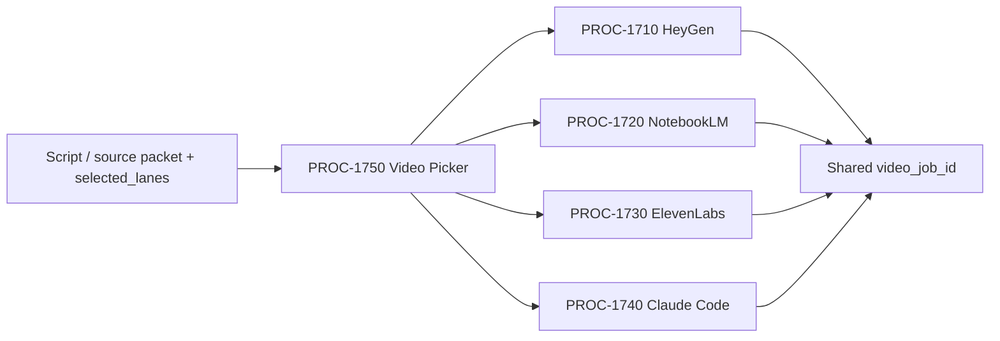

---
outside:
  heir:
    sovereign_ref: imo-creator
    hub_id: content-video-picker
    ctb_placement: branch
    imo_topology: input
    cc_layer: CC-03
    services: internal routing, lane contracts, LBB
    secrets_provider: none
    acceptance_criteria: Given a script/source packet and selected_lanes list, one lane packet is emitted per selected lane sharing a parent video_job_id; fan-out record written to LBB; lane-level halt or repair does not cancel sibling lanes
  orbt:
    state: BUILD
    strikes: 0
    authority: Gated (CC-03)
inside:
  heir:
    mission_control_target_slot: imo-creator.mission-control.system.processes
    mission_control_disposition: WIRE
  orbt:
    last_mechanic_trace: PROC-1750-REPAIR-001
    last_modified: 2026-05-12
---

# PROC-1750 - Video Picker
## Fan-out conductor: route a script/source packet to one or more video production lanes and emit per-lane job packets under a shared parent job ID.
### Status: BUILD
### Medium: process
### Business: barton-enterprises/content

---

## PRE-FLIGHT CHECKLIST {#sec-preflight}

| # | Item | Status | Evidence |
|---|------|--------|----------|
| 1 | heir.yaml present and valid | ☑ | `factory/content/1750-video-picker/heir.yaml` |
| 2 | orbt.yaml present and valid | ☑ | `factory/content/1750-video-picker/orbt.yaml` |
| 3 | §1 IDENTITY — all required fields populated | ☑ | §1 table complete |
| 4 | §2 PURPOSE — WHY and Out-of-scope stated | ☑ | §2 present |
| 5 | §3 RESOURCES — all components listed with status | ☑ | §3 table present |
| 6 | §4 IMO — Input/Middle/Output defined; fan-out steps in Middle | ☑ | §4 present |
| 7 | §5 OSAM — READ/WRITE/Join Chain/Forbidden/Query Routing present | ☑ | §5 OSAM section |
| 8 | §6 DMJ — Define/Map/Join complete with FAN constants | ☑ | §6 present |
| 9 | §7 CONSTANTS & VARIABLES — fan-out constants named | ☑ | §7 table present |
| 10 | §8 STOP CONDITIONS — Kill Switch present | ☑ | §8 Kill Switch row present |
| 11 | §9 VERIFICATION — numbered steps present | ☑ | §9 present |
| 12 | §9b LIVE VERIFICATION LOG — fan-out sample routes logged | ☑ | §9b present |
| 13 | mission_control_wiring — WIRE / EXEMPT declared in frontmatter | ☑ | frontmatter — WIRE → imo-creator.mission-control.system.processes |

---

# IDENTITY

## 1. IDENTITY {#sec-1-identity}

| Field | Value |
|-------|-------|
| ID | PROC-1750 |
| Name | Video Picker |
| Medium | process |
| Business Silo | barton-enterprises/content |
| CTB Position | barton-enterprises/content/1750-video-picker |
| ORBT | BUILD |
| Strikes | 0 |
| Authority | Gated (CC-03) |
| Version | 0.2.0 |
| Last Modified | 2026-05-12 |
| BAR Reference | BAR-392 |
| Owner | Dave Barton |
| ctb_node | barton-enterprises/content/1750-video-picker |

### HEIR (8 fields)

| Field | Value |
|-------|-------|
| sovereign_ref | imo-creator |
| hub_id | content-video-picker |
| ctb_placement | branch |
| imo_topology | input |
| cc_layer | CC-03 |
| services | internal routing, lane contracts, LBB |
| secrets_provider | none |
| acceptance_criteria | Given a script/source packet and selected_lanes list, one lane packet is emitted per selected lane sharing a parent video_job_id; fan-out record written to LBB; lane-level halt or repair does not cancel sibling lanes |

## 1b. Geometry {#sec-1b-geometry}

**CTB Position:** Barton Enterprises -> Content -> 1750-video-picker.

**Hub-Spoke Role:** fan-out conductor. It does not generate video; it dispatches job packets to one or more production lanes under a shared parent `video_job_id`.

**Altitude:** 20k routing.

---

# CONTRACT

## 2. PURPOSE {#sec-2-purpose}

PROC-1750 is the fan-out conductor for all video production jobs. Dave gives a script or source packet plus a `selected_lanes` array; the conductor emits one lane-specific job packet per selected lane, all sharing the same parent `video_job_id`. Without it, multi-lane video jobs (e.g., avatar A-roll + cinematic B-roll) have no single intake point and no shared lineage.

**WHY:** A single production job can legitimately span multiple lanes. The fan-out model unlocks N-lane dispatch while keeping the routing and lineage constants locked at the conductor level.

**Out of scope:** generating the video, uploading to CF Stream, writing the script.

**Success metric:** a single intake with two selected lanes emits two lane packets sharing one `video_job_id`, each with valid fields, without the conductor calling any provider.

## 3. RESOURCES {#sec-3-resources}

| Component | Type | What It Provides | Status |
|-----------|------|------------------|--------|
| PROC-1710 | lane | HeyGen avatar/cinematic A-roll/B-roll | BUILD |
| PROC-1720 | lane | NotebookLM source-grounded video | BUILD |
| PROC-1730 | lane | ElevenLabs cinematic model picker | BUILD |
| PROC-1740 | lane | repo-owned sovereign render | BUILD |
| route-video-job.ps1 | conductor script | fan-out routing + packet emission | BUILD |
| LBB | logbook | fan-out routing record | OPERATE - access separately verified |

| BAR | Relation | Status |
|-----|----------|--------|
| BAR-392 | This picker | BUILD |
| BAR-388 | NotebookLM lane | BUILD |
| BAR-389 | HeyGen lane | BUILD |
| BAR-390 | ElevenLabs lane | BUILD |
| BAR-391 | Claude Code lane | BUILD |

## 4. IMO — Input, Middle, Output {#sec-4-imo}

### Input

| Field | Required | Notes |
|-------|----------|-------|
| video_job_id | yes | UUID or stable slug — parent ID for all lane packets |
| selected_lanes | yes | array of lane_id strings; ≥1 entry required |
| script_payload | conditional | required for script-led lanes |
| source_packet | conditional | required for NotebookLM |
| objective | yes | educate, convert, explain, nurture |
| desired_style | yes | avatar, source-grounded, cinematic, owned-code |
| output_surface | yes | YouTube, LinkedIn, CF Stream, content pages |
| constraints | optional | budget, duration, aspect, voice, compliance |

### Middle

| Step | Input | What Happens | Output |
|------|-------|--------------|--------|
| 1 | intake | validate required fields present | valid/invalid |
| 2 | selected_lanes | verify each lane_id is in allowed lane list | valid lane list |
| 3 | lane list | for each selected lane, validate required lane fields are present | per-lane validation result |
| 4 | validated lanes | build one lane-specific job packet per selected lane | N lane packets, each with video_job_id |
| 5 | N lane packets | write fan-out routing record to LBB | LBB fan-out record |
| 6 | N lane packets | emit each lane packet to its target process | dispatched |

### Output

- N lane-specific job packets, each tagged with parent `video_job_id`
- fan-out routing record (LBB)
- routing rationale per lane
- per-lane REPAIR reason if any lane had missing fields (sibling lanes still emit)
- HALT with reason if intake is invalid

## 5. OSAM {#sec-5-osam}

### READ

| Source | Reads | Join Key |
|--------|-------|----------|
| intake packet | video_job_id, selected_lanes, script_payload, source_packet, objective, style | video_job_id |
| lane contracts | required fields and stop conditions per lane | path_id |

### WRITE

| Target | Writes | When |
|--------|--------|------|
| N lane packets | selected lane input contracts, all tagged video_job_id | after per-lane validation |
| LBB processes | fan-out routing decision, per-lane status | every dispatch |

### Join Chain

`video_job_id -> selected_lanes[] -> per-lane validation -> N lane packets -> lane processes -> N artifacts -> PROC-1800 handoff`

### Forbidden

- Routing to a lane not in the allowed lane list
- Emitting a lane packet with missing required fields
- Calling any provider directly (conductor does not generate)
- Emitting a lane packet without the parent `video_job_id`
- Treating a lane-level REPAIR or HALT as a full-job abort (lane isolation required)

### Query Routing

All reads are from intake packet and lane contract definitions — no external API calls in the conductor. No secrets needed.

### Process Composition

Intake → PROC-1750 → N × (PROC-17NN) → N × PROC-1800 handoff. PROC-1750 is input-only. No logic in transport layers.

## 6. DMJ — Define, Map, Join {#sec-6-dmj}

### DEFINE

| Element | ID | Format | Description | C/V |
|---------|----|--------|-------------|-----|
| video_job_id | D-1750-JOB | string | primary routing key; parent for all lane packets | C |
| selected_lanes | D-1750-SEL | array[enum] | list of lane IDs for this job | V |
| lane_packet | D-1750-PACKET | object | one lane input contract per selected lane | V |
| routing_rationale | D-1750-RAT | text | why each lane was selected | C |
| fan-out record | D-1750-FAN | object | LBB record of all N dispatches | C |

**FAN constants (locked):**

| ID | Rule |
|----|------|
| FAN-01 | Input contract: `{ video_job_id, script_payload, selected_lanes: [<lane_id>, ...] }` — ≥1 lane required |
| FAN-02 | One lane packet emitted per entry in `selected_lanes` |
| FAN-03 | All emitted lane packets share parent `video_job_id` |
| FAN-04 | N artifacts collected under parent `video_job_id`; all resolve before PROC-1800 handoff |
| FAN-05 | Lane-level halt or repair is isolated — does not cancel sibling lane dispatches |
| FAN-06 | Fan-out routing record written to LBB once all N dispatches are emitted |

### MAP

| Condition / selected lane_id | Lane |
|-----------------------------|------|
| `heygen_avatar` | PROC-1710 HeyGen avatar/cinematic |
| `notebooklm_source_video` | PROC-1720 NotebookLM |
| `elevenlabs_cinematic` | PROC-1730 ElevenLabs |
| `claude_code_sovereign` | PROC-1740 Claude Code |

### JOIN

`video_job_id -> selected_lanes[] -> per-lane job packets -> lane processes -> output artifacts -> PROC-1800 handoff per lane`

## 7. CONSTANTS & VARIABLES {#sec-7-constants-variables}

| Slot | C/V | Locked Value / Fill Examples |
|------|-----|------------------------------|
| allowed lane IDs | C | heygen_avatar, notebooklm_source_video, elevenlabs_cinematic, claude_code_sovereign |
| shared video_job_id | C | all lane packets from one job share this — never per-lane |
| routing rationale required | C | always written to LBB |
| no generation in conductor | C | conductor never calls a provider |
| lane isolation | C | FAN-05 — one lane's halt does not cancel siblings |
| fan-out record required | C | FAN-06 — always written to LBB |
| selected_lanes | V | per-job array, ≥1 entry |
| script_payload | V | per-job |
| source_packet | V | per-job, required for NotebookLM |
| objective | V | per-job |
| desired_style | V | per-job |
| output_surface | V | per-job |
| constraints | V | per-job, optional |

## 8. STOP CONDITIONS {#sec-8-stop-conditions}

| Condition | Action |
|-----------|--------|
| No script_payload and no source_packet | HALT |
| selected_lanes is empty or missing | HALT |
| A lane_id in selected_lanes is not in the allowed lane list | REPAIR — remove unknown lane_id or HALT if none remain |
| video_job_id not present | HALT |
| Required fields for a selected lane are missing | REPAIR for that lane; sibling lanes still dispatch (FAN-05) |
| Conductor attempts provider generation | HALT |
| Kill Switch | Human types KILL SWITCH — halt conductor immediately, abandon all dispatches, write HALT record to LBB |

## 9. VERIFICATION {#sec-9-verification}

1. Single-lane: route a HeyGen avatar script (`selected_lanes: [heygen_avatar]`) — one packet emitted, video_job_id present.
2. Single-lane: route a document-source explainer (`selected_lanes: [notebooklm_source_video]`) — one packet emitted.
3. Single-lane: route a cinematic job (`selected_lanes: [elevenlabs_cinematic]`) — one packet emitted.
4. Single-lane: route a template render (`selected_lanes: [claude_code_sovereign]`) — one packet emitted.
5. Fan-out: route avatar + cinematic (`selected_lanes: [heygen_avatar, elevenlabs_cinematic]`) — two packets, same video_job_id, fan-out record in LBB.
6. Invalid: missing script_payload — HALT.
7. Invalid: unknown lane_id — REPAIR or HALT.

## 9b. Live Verification Log {#sec-9b-live-verification}

| Claim | Source | Status | Last Check | Value |
|-------|--------|--------|------------|-------|
| UT built | filesystem | PASS | 2026-05-12 | process files present |
| single-lane routes (×4) | local check | PASS | 2026-05-05 | HeyGen, NotebookLM, ElevenLabs, sovereign routed |
| fan-out (2-lane) | local check | PENDING | — | route-video-job.ps1 rewrite required (WO-1750-CONDUCTOR) |
| ambiguity halt | local check | PASS | 2026-05-05 | ambiguous request returned REPAIR / AMBIGUOUS_LANE |
| all lane contracts available | process folders | PASS-LOCAL | 2026-05-05 | 1710-1750 folders present |

## 10. ANALYTICS {#sec-10-analytics}

### 10a. Metrics

| Metric | Target |
|--------|--------|
| valid lane dispatch per selected_lane entry | 100% |
| video_job_id present on all emitted packets | 100% |
| routing record per intake | 1:1 |
| lane isolation (sibling not cancelled on peer halt) | 100% |
| fan-out record written to LBB | 100% |

### 10b. Sigma Tracking

| Run | Metric | Value | Direction |
|-----|--------|-------|-----------|
| BUILD-001 | single-lane routes | 4/4 | — |
| REPAIR-001 | fan-out | PENDING | — (conductor rewrite not yet run) |

Sigma tightens when: fan-out runs succeed, video_job_id tagging = 100%, LBB record rate = 1:1 across successive runs.

### 10c. ORBT Gate Rules

| Gate | Rule |
|------|------|
| BUILD → OPERATE | Fan-out smoke test passes (≥2 lanes, shared video_job_id); Auditor signs off |
| OPERATE → REPAIR | Any metric below target for 2 consecutive runs |
| REPAIR → OPERATE | Root cause identified, fix applied, re-certified |
| Any → TROUBLESHOOT_TRAIN | Strike 3 reached |

## 11. EXECUTION TRACE {#sec-11-execution-trace}

| Trace ID | Status | Tools Used | Timestamp | Signed By |
|----------|--------|-----------|-----------|-----------|
| PROC-1750-BUILD-001 | done | Codex apply_patch | 2026-05-05 | Codex mechanic |
| PROC-1750-REPAIR-001 | done | Mechanic Write | 2026-05-12 | Mechanic (BAR-VIDEO-PATH-CERTIFICATION) |

**REPAIR-001 scope:** Added BS Law Y-junction YAML frontmatter, 13-item ☑/☐ checklist, updated subtitle/§2/§4/§7/§8 from single-router to fan-out conductor (FAN-01..FAN-06), renamed §5 DATA SCHEMA → OSAM with full structure, expanded §10 to 10a/10b/10c, updated §11 trace to table format, added Kill Switch to §8, version bumped 0.1.0 → 0.2.0.

## 12. LOGBOOK (After Certification Only) {#sec-12-logbook}

No logbook entry until independent audit and fan-out smoke test pass.

## 13. FLEET FAILURE REGISTRY {#sec-13-fleet-failure-registry}

| Pattern | Status |
|---------|--------|
| No failures registered | BUILD |

## 14. SESSION LOG {#sec-14-session-log}

| Date | What Was Done | LBB Record |
|------|---------------|------------|
| 2026-05-05 | Initial PROC-1750 picker UT created for BAR-392. | pending |
| 2026-05-12 | REPAIR-001: Rewrote from single-router to fan-out conductor (FAN-01..FAN-06). Added BS Law Y-junction frontmatter, 13-item checklist, §5 renamed OSAM, §10 expanded (10a/10b/10c), Kill Switch, updated §9b. Version 0.1.0 → 0.2.0. BAR-VIDEO-PATH-CERTIFICATION WO-1750-EX. | pending |

## Document Control

| Field | Value |
|-------|-------|
| Created | 2026-05-05 |
| Medium | process |
| BAR | BAR-392 |
| Version | 0.2.0 |
| Last Modified | 2026-05-12 |
