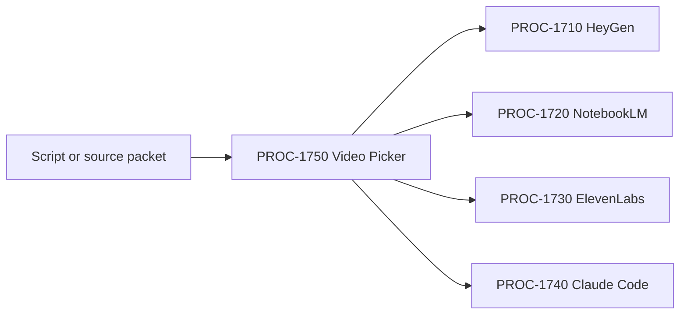

# PROC-1750 - Video Picker
## Route a script/source packet to exactly one video production path and emit the lane-specific job packet.
### Status: BUILD
### Medium: process
### Business: barton-enterprises/content

---

# IDENTITY

## 1. IDENTITY {#sec-1-identity}

| Field | Value |
|-------|-------|
| ID | PROC-1750 |
| Name | Video Picker |
| Medium | process |
| Business Silo | barton-enterprises/content |
| CTB Position | barton-enterprises/content/1750-video-picker |
| ORBT | BUILD |
| Strikes | 0 |
| Authority | Gated (CC-03) |
| Version | 0.1.0 |
| Last Modified | 2026-05-05 |
| BAR Reference | BAR-392 |
| Owner | Dave Barton |
| ctb_node | barton-enterprises/content/1750-video-picker |

### HEIR (8 fields)

| Field | Value |
|-------|-------|
| sovereign_ref | imo-creator |
| hub_id | content-video-picker |
| ctb_placement | branch |
| imo_topology | input |
| cc_layer | CC-03 |
| services | internal routing, lane contracts, LBB |
| secrets_provider | none |
| acceptance_criteria | Given a script/source packet, exactly one lane is selected or the job halts; lane packet conforms to selected path contract; routing decision is recorded |

## 1b. Geometry {#sec-1b-geometry}

**CTB Position:** Barton Enterprises -> Content -> 1750-video-picker.

**Hub-Spoke Role:** conductor. It does not generate video; it selects the one correct production lane.

**Altitude:** 20k routing.

---

# CONTRACT

## 2. PURPOSE {#sec-2-purpose}

PROC-1750 lets Dave give a script or source packet and get a clear production route. Without it, the system has multiple video lanes but no single intake decision, causing duplicate work, wrong provider use, and no consistent handoff contract.

**WHY:** This child turns "make a video" into exactly one lane packet with the constants and variables needed to start production.

**Out of scope:** generating the video, uploading to CF Stream, writing the script.

**Success metric:** one sample intake routes to exactly one lane with a valid lane packet.

## 3. RESOURCES {#sec-3-resources}

| Component | Type | What It Provides | Status |
|-----------|------|------------------|--------|
| PROC-1710 | lane | HeyGen avatar/cinematic A-roll/B-roll | BUILD |
| PROC-1720 | lane | NotebookLM source-grounded video | BUILD |
| PROC-1730 | lane | ElevenLabs cinematic model picker | BUILD |
| PROC-1740 | lane | repo-owned sovereign render | BUILD |
| LBB | logbook | routing record | OPERATE - access separately verified |

| BAR | Relation | Status |
|-----|----------|--------|
| BAR-392 | This picker | BUILD |
| BAR-388 | NotebookLM lane | BUILD |
| BAR-389 | HeyGen lane | BUILD |
| BAR-390 | ElevenLabs lane | BUILD |
| BAR-391 | Claude Code lane | BUILD |

## 4. IMO — Input, Middle, Output {#sec-4-imo}

### Input

| Field | Required | Notes |
|-------|----------|-------|
| video_job_id | yes | UUID or stable slug |
| script | conditional | required for script-led lanes |
| source_packet | conditional | required for NotebookLM |
| objective | yes | educate, convert, explain, nurture |
| desired_style | yes | avatar, source-grounded, cinematic, owned-code |
| output_surface | yes | YouTube, LinkedIn, CF Stream, content pages |
| constraints | optional | budget, duration, aspect, voice, compliance |

### Middle

| Step | Input | What Happens | Output |
|------|-------|--------------|--------|
| 1 | intake | validate required fields | valid/invalid |
| 2 | objective/style/source | score lane fit | candidate lanes |
| 3 | candidates | require exactly one winner | selected_path_id |
| 4 | selected_path_id | build lane-specific packet | job packet |
| 5 | job packet | record routing decision | LBB/process record |

### Output

- selected_path_id
- lane-specific job packet
- routing rationale
- rejection/repair reason if no single winner

## 5. DATA SCHEMA {#sec-5-data-schema}

| Source | Reads | Join Key |
|--------|-------|----------|
| intake packet | script/source/objective/style | video_job_id |
| lane contracts | required fields and stop conditions | path_id |

| Target | Writes | When |
|--------|--------|------|
| lane packet | selected lane input contract | after routing |
| LBB processes | routing decision and rationale | every decision |

Forbidden: route to more than one lane, route with missing required lane fields, call a provider directly.

## 6. DMJ — Define, Map, Join {#sec-6-dmj}

### DEFINE

| Element | ID | Format | Description | C/V |
|---------|----|--------|-------------|-----|
| video_job_id | D-1750-JOB | string | primary routing key | C |
| selected_path_id | D-1750-PATH | enum | one of four lane IDs | V |
| lane_packet | D-1750-PACKET | object | selected lane input | V |
| routing_rationale | D-1750-RAT | text | why selected | C |

### MAP

| Condition | Lane |
|-----------|------|
| founder/avatar/direct-to-camera needed | `heygen_avatar` |
| source-grounded explainer from documents | `notebooklm_source_video` |
| cinematic model selection/lip-sync/upscale/reference visuals | `elevenlabs_cinematic` |
| deterministic repo-owned template render | `claude_code_sovereign` |

### JOIN

`video_job_id -> selected_path_id -> lane_packet -> lane process -> output artifact -> PROC-1800 handoff`

## 7. CONSTANTS & VARIABLES {#sec-7-constants-variables}

Constants: exactly-one-lane rule, lane IDs, required routing rationale, no provider generation in picker.

Variables: script, source packet, objective, style, selected path, generated lane packet.

## 8. STOP CONDITIONS {#sec-8-stop-conditions}

| Condition | Action |
|-----------|--------|
| No script and no source_packet | HALT |
| More than one lane matches equally | REPAIR - Dave or planner chooses |
| No lane can satisfy constraints | HALT |
| Selected lane required fields are missing | REPAIR before dispatch |
| Picker attempts provider generation | HALT |

## 9. VERIFICATION {#sec-9-verification}

1. Route a HeyGen avatar script to PROC-1710.
2. Route a document-source explainer to PROC-1720.
3. Route a cinematic/lip-sync reference job to PROC-1730.
4. Route a template render job to PROC-1740.
5. Confirm ambiguous jobs halt instead of double-routing.

## 9b. Live Verification Log {#sec-9b-live-verification}

| Claim | Source | Status | Last Check | Value |
|-------|--------|--------|------------|-------|
| UT built | filesystem | PASS | 2026-05-05 | process files created |
| sample route run | local check | PASS | 2026-05-05 | four examples routed: HeyGen, NotebookLM, ElevenLabs, sovereign |
| ambiguity halt/repair | local check | PASS | 2026-05-05 | ambiguous avatar + cinematic request returned `REPAIR` / `AMBIGUOUS_LANE` |
| all lane contracts available | process folders | PASS-LOCAL | 2026-05-05 | 1710-1750 folders exist |

## 10. ANALYTICS {#sec-10-analytics}

| Metric | Target |
|--------|--------|
| exactly-one-lane decision | 100% |
| missing required field escapes | 0 |
| routing record per intake | 1:1 |

## 11. EXECUTION TRACE {#sec-11-execution-trace}

| Field | Value |
|-------|-------|
| trace_id | PROC-1750-BUILD-001 |
| status | done |
| tools_used | Codex apply_patch |
| timestamp | 2026-05-05 |
| signed_by | Codex mechanic |

## 12. LOGBOOK (After Certification Only) {#sec-12-logbook}

No logbook entry until independent audit and sample route tests pass.

## 13. FLEET FAILURE REGISTRY {#sec-13-fleet-failure-registry}

| Pattern | Status |
|---------|--------|
| No failures registered | BUILD |

## 14. SESSION LOG {#sec-14-session-log}

| Date | What Was Done | LBB Record |
|------|---------------|------------|
| 2026-05-05 | Initial PROC-1750 picker UT created for BAR-392. | pending |

## Document Control

| Field | Value |
|-------|-------|
| Created | 2026-05-05 |
| Medium | process |
| BAR | BAR-392 |
