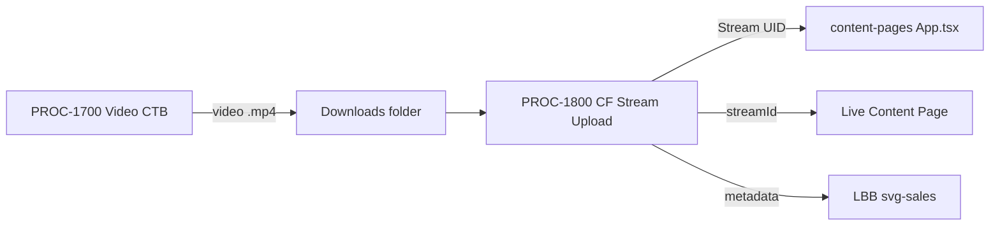

# CF Stream Video Upload
## Upload video artifacts from NotebookLM to Cloudflare Stream for embedding on content pages.
### Status: BUILD
### Medium: process
### Business: imo-creator (cross-cutting — serves all businesses)

## UT Checklist (Pre-Flight - per law/UT_CHECKLIST.md v1.2.0)

| # | Check | Status | Location |
|---|-------|--------|----------|
| 1 | PRD — what / why / who / scope / out-of-scope / success metric | [x] | §2 |
| 2 | OSAM — READ / WRITE / Join Chain / Forbidden Paths / Query Routing filled | [x] | §5, §6 |
| 3 | Component Status — every dependency has light with 1-line state | [x] | §3 |
| 4 | Owner — human who fixes this at 2 AM | [x] | §1 |
| 5 | Live Dashboard — URL or explicit "N/A" | [x] | §3 — N/A (CLI process) |
| 6 | Kill Switch — exact command to stop the process | [x] | §8 |
| 7 | Logbook — last audit verdict + date (after certification only) | [ ] | §12 — N/A during BUILD |
| 8 | FCEs Attached — which FCE runs structurally back this doc | [x] | §3c |
| 9 | BARs Referenced — every BAR this doc touches, with status | [x] | §3d |
| 10 | LBB Subjects Fed — which LBB subject(s) this doc's session logs go to | [x] | §3e |
| 11 | Geometry — CTB position + Hub-Spoke role + Altitude | [x] | §1b |
| 12 | Live Verification — every numeric count, cron, URL, command, BAR status grounded | [ ] | §9 — pending successful end-to-end run |
| 13 | ctb_node — declared path on Barton Enterprises CTB trunk | [x] | §1 |

---

# IDENTITY

## 1. IDENTITY

| Field | Value |
|-------|-------|
| ID | PROC-1800 |
| Name | CF Stream Video Upload |
| Medium | process |
| Business Silo | imo-creator (cross-cutting — serves all businesses) |
| CTB Position | barton-enterprises/content/1800-cf-stream-upload |
| ORBT | BUILD |
| Strikes | 1 |
| Authority | Gated (CC-03) |
| Version | 1.0.0 |
| Last Modified | 2026-04-30 |
| BAR Reference | — |
| Owner | Dave Barton |
| ctb_node | barton-enterprises/content/1800-cf-stream-upload |

### 1b. Geometry

**CTB Position:** Barton Enterprises → Content → 1800-cf-stream-upload (leaf — terminal step in video production chain)

**Hub-Spoke Role:** spoke (this process is transport — moves a video file from Downloads to CF Stream and wires the UID into content-pages)

**Altitude:** 5k execution (one leaf — exact CLI commands, exact API calls)



### HEIR (8 fields)

| Field | Value |
|-------|-------|
| sovereign_ref | imo-creator |
| hub_id | content-cf-stream |
| ctb_placement | leaf |
| imo_topology | middle |
| cc_layer | CC-03 |
| services | CF Stream API, CF Pages (content-pages), Doppler |
| secrets_provider | Doppler (imo-creator → dev) |
| acceptance_criteria | Video uploaded with status ready; Stream UID returned and recorded; streamId wired into App.tsx; content-pages deployed; video player functional on live page; metadata in LBB |

---

# CONTRACT

## 2. PURPOSE

### WHAT
Upload a video artifact (.mp4) downloaded from NotebookLM Studio to Cloudflare Stream via the CF Stream API, retrieve the Stream UID, wire it into the content-pages ContentConfig, and deploy the live content page with an embedded video player.

### WHY
Video files from NotebookLM are 30-100MB+ — too large for static CF Pages hosting (65MB limit). CF Stream provides adaptive bitrate streaming, a player embed, and CDN delivery. Without this process, the video slot on content pages stays empty. This is the transport layer that connects artifact generation (PROC-1700) to live content delivery.

### WHO
- Claude Code — executes curl upload, polls status, edits App.tsx, deploys content-pages
- Dave Barton — creates CF_STREAM_API_TOKEN manually (Turnstile blocks automation), confirms live page

### SCOPE (in)
- Single video file upload per run
- CF Stream API interaction (upload, status poll, embed URL extraction)
- ContentConfig wiring in content-pages App.tsx
- content-pages build and deploy
- Stream UID recording in notebooks-registry.md and LBB

### OUT-OF-SCOPE
- NotebookLM artifact generation (handled in PROC-1700)
- CF Stream account setup or billing
- content-pages template design changes
- Batch upload of multiple videos in one run (each video is a separate run)

### SUCCESS METRIC
Video hosted on CF Stream with `status.state === "ready"`, embedded on a live content page, and UID recorded in LBB.

---

## 3. RESOURCES

### Component Status Grid

| Component | HEIR | ORBT | Light | State |
|-----------|------|------|-------|-------|
| CF Stream API | external · leaf · N/A | BUILD | yellow | Blocked on CF_STREAM_API_TOKEN — Strike 1 logged 2026-04-01 |
| CF_STREAM_API_TOKEN | Doppler/imo-creator/dev · leaf | BUILD | red | NOT YET CREATED — manual CF Dashboard action required |
| GLOBAL_CLOUDFLARE_ACCOUNT_ID | Doppler/imo-creator/dev · leaf | OPERATE | green | Present in Doppler |
| content-pages template | content-pages · leaf · CC-03 | OPERATE | green | Deployed; video slot (streamId) present in ContentConfig |
| wrangler | CLI · leaf | OPERATE | green | OAuth session active |
| Chrome DevTools MCP | browser · leaf | OPERATE | green | Used to download artifacts from NotebookLM |

### Live Dashboard

| Resource | URL | What it shows |
|----------|-----|---------------|
| CF Stream dashboard | https://dash.cloudflare.com/ (Stream section) | Uploaded videos, UIDs, processing status |
| CF Stream API — list videos | `curl -H "Authorization: Bearer $CF_STREAM" https://api.cloudflare.com/client/v4/accounts/$CF_ACCOUNT/stream` | All uploaded videos with UIDs |

Live Dashboard: N/A — this is a CLI/API process with no persistent dashboard. Status verified via curl commands in §8 SMOKE TEST.

### 3c. FCEs Attached

| FCE Name | HEIR | ORBT | Status |
|----------|------|------|--------|
| IMO (Input → Middle → Output) | law/doctrine/FOUNDATIONAL_BEDROCK.md §3 | OPERATE | green — upload = I, CF Stream API = M, UID = O |

### 3d. BARs Referenced

| BAR | Title | ORBT | Status | Relation |
|-----|-------|------|--------|----------|
| — | No BAR yet — process initiated organically | — | — | — |

### 3e. LBB Subjects Fed

| LBB Subject | ORBT | What This Doc Writes | Frequency |
|-------------|------|---------------------|-----------|
| svg-sales | BUILD | Stream UID, video metadata, artifact lineage | per video upload |
| system | BUILD | Process decisions, token blocker notes | on-change |

---

## 4. IMO

### Two-Question Intake
1. **"What triggers this?"** — Video artifact (.mp4) downloaded from NotebookLM Studio (PROC-1700) is ready for hosting
2. **"How do we get it?"** — Chrome DevTools MCP clicks Download on the video artifact in NotebookLM → file lands in Downloads folder → curl upload to CF Stream API

### Input
- Video file (.mp4) in `C:/Users/CUSTOM PC/Downloads/`
- Downloaded from NotebookLM Studio tab via Chrome DevTools MCP
- Typical size: 30-100MB

### Middle

| Step | Input | What Happens | Output | Tool Used |
|------|-------|-------------|--------|-----------|
| 1 | Video .mp4 in Downloads | Upload to CF Stream via multipart POST | Stream video UID | curl + CF Stream API |
| 2 | Stream video UID | Poll until `status.state === "ready"` | Ready status + playback URL | CF Stream API (GET) |
| 3 | Stream UID | Wire into ContentConfig streamId in App.tsx | Video slot populated | Code edit |
| 4 | Updated App.tsx | Build and deploy content-pages | Live page with embedded video | vite build + wrangler pages deploy |
| 5 | Stream UID + metadata | Record in notebooks-registry.md and LBB | Documented artifact lineage | Markdown edit + LBB ingest |

### Output
- Video hosted on CF Stream with adaptive bitrate
- Embed URL: `https://customer-{subdomain}.cloudflarestream.com/{uid}/iframe`
- Content page video slot populated with `streamId`
- Artifact lineage in LBB

### Circle (Bedrock §5)
- Video playback verified on live content page
- Stream UID recorded in notebooks-registry.md
- LBB ingest with video metadata

---

## 5. WHAT IT GRABS OFF THE WALL

### Databases
None — this process does not touch D1 or Neon directly. Video files go to CF Stream (object storage). Metadata goes to LBB.

### Tools & Integrations

| Item | Type | Cost Tier | Credentials | What It Does |
|------|------|-----------|-------------|-------------|
| CF Stream API | API | Cheap ($1/1000 min stored, $0.01/1000 min viewed) | CF_STREAM_API_TOKEN | Upload video, get UID, poll status |
| Chrome DevTools MCP | MCP | Free | None (browser session) | Download video from NotebookLM |
| wrangler | CLI | Free | OAuth session | Deploy updated content-pages |

### Secrets (from Doppler)

| Secret | Doppler Project | Config | Used By |
|--------|----------------|--------|---------|
| CF_STREAM_API_TOKEN | imo-creator | dev | Step 1 — upload to CF Stream |
| GLOBAL_CLOUDFLARE_ACCOUNT_ID | imo-creator | dev | Step 1 — account identifier |

**Creating the CF Stream API Token (one-time manual action):**
1. Go to https://dash.cloudflare.com/profile/api-tokens (must be done manually — Turnstile blocks automation)
2. Create Token → Custom Token
3. Permissions: **Account > Cloudflare Stream > Edit**
4. Account Resources: Include > Specific Account > your account
5. Copy token → `doppler secrets set CF_STREAM_API_TOKEN "{token}" --project imo-creator --config dev`

**Why a separate token:** Existing CF tokens (CF_API_TOKEN, GLOBAL_CLOUDFLARE_API_TOKEN) and wrangler OAuth do NOT have Stream permissions. Stream requires its own token scope (D-1800-01).

---

## 6. CONSTANTS & VARIABLES

### Constants (structure — never changes)

| Constant | Value |
|----------|-------|
| CF Stream API endpoint | `https://api.cloudflare.com/client/v4/accounts/{ACCOUNT_ID}/stream` |
| Upload method | multipart form POST with `file` field |
| Embed URL pattern | `https://customer-{subdomain}.cloudflarestream.com/{uid}/iframe` |
| ContentConfig property | `streamId` |
| Auth header | `Authorization: Bearer {CF_STREAM_API_TOKEN}` |
| Ready state value | `status.state === "ready"` |

### Variables (fill — changes every run)

| Variable | Description |
|----------|-------------|
| Video file path | Path to .mp4 in Downloads/ |
| Video filename and metadata | Name, duration, notebook source |
| Stream UID | Returned by CF Stream API after upload |
| Target content page | Which content-pages deployment gets the streamId |

---

## 7. STOP CONDITIONS

| Condition | Action |
|-----------|--------|
| CF_STREAM_API_TOKEN not set in Doppler | HALT — create token first (§5 Creating the CF Stream API Token) |
| Upload returns 401 auth error | HALT — token does not have Stream permissions; create CF_STREAM_API_TOKEN (D-1800-01) |
| Video file > 200MB | HALT — verify CF Stream plan supports file size before upload (D-1800-06) |
| Upload succeeds but processing fails | Retry once, then HALT — check video format (.mp4 required) |
| `status.state` never reaches "ready" | HALT after 10 min polling — check CF Stream dashboard for error |
| Strike 3 on same failure | Troubleshoot/Train → check CF account limits, token scope, video format (D-1800-07) |

### Kill Switch
This is a CLI/API process — no persistent service to kill. To halt mid-run: Ctrl+C the curl command. To remove an erroneously uploaded video:
```bash
CF_ACCOUNT=$(doppler secrets get GLOBAL_CLOUDFLARE_ACCOUNT_ID --project imo-creator --config dev --plain)
CF_STREAM=$(doppler secrets get CF_STREAM_API_TOKEN --project imo-creator --config dev --plain)
curl -s -X DELETE "https://api.cloudflare.com/client/v4/accounts/$CF_ACCOUNT/stream/{uid}" \
  -H "Authorization: Bearer $CF_STREAM"
```

---

## 8. DEPENDENCIES

### Upstream (must exist before this runs)

| Dependency | What | Status |
|-----------|------|--------|
| NotebookLM video artifact | Generated and downloaded .mp4 from PROC-1700 | DONE per notebook |
| CF_STREAM_API_TOKEN | Token with Stream Edit permissions in Doppler | PENDING — needs manual creation (Strike 1) |
| content-pages template | CF Pages site with video slot (streamId in ContentConfig) | DONE |

### Downstream (consumes this process's output)

| Consumer | What It Needs |
|----------|--------------|
| content-pages App.tsx | Stream UID for streamId in ContentConfig |
| Client-facing URL | Live page with embedded video player |
| LBB | Stream UID + metadata for artifact record |

---

## 9. SMOKE TEST

```bash
# 1. Verify token exists
doppler secrets get CF_STREAM_API_TOKEN --project imo-creator --config dev --plain
# → expected: non-empty token string

# 2. Set variables
CF_ACCOUNT=$(doppler secrets get GLOBAL_CLOUDFLARE_ACCOUNT_ID --project imo-creator --config dev --plain)
CF_STREAM=$(doppler secrets get CF_STREAM_API_TOKEN --project imo-creator --config dev --plain)

# 3. Upload test video
curl -s -X POST "https://api.cloudflare.com/client/v4/accounts/$CF_ACCOUNT/stream" \
  -H "Authorization: Bearer $CF_STREAM" \
  -F "file=@/path/to/video.mp4" \
  -F 'meta={"name":"test-video"}'
# → expected: {"success":true, "result":{"uid":"...", ...}}

# 4. Poll processing status (replace {uid} with returned UID)
curl -s "https://api.cloudflare.com/client/v4/accounts/$CF_ACCOUNT/stream/{uid}" \
  -H "Authorization: Bearer $CF_STREAM"
# → expected: result.status.state === "ready"

# 5. Verify embed URL loads
# Open: https://customer-{subdomain}.cloudflarestream.com/{uid}/iframe
# → expected: video player renders

# 6. Verify content page shows video after deploy
# Open content-pages deployment URL
# → expected: video player embedded and functional in video slot
```

**Three Primitives Check (Bedrock §1):**
1. **Thing:** Did the video file exist in Downloads? Did the Stream UID get returned?
2. **Flow:** Did the upload reach CF Stream? Did the UID reach App.tsx? Did the embed URL reach the content page?
3. **Change:** Did the video process to "ready" state? Did content-pages deploy with the new streamId?

---

# GOVERNANCE

## 10. PERMISSIONS

| System | Action | Who | Auth |
|--------|--------|-----|------|
| CF Stream API | Upload video, read status, delete video | Claude Code | CF_STREAM_API_TOKEN (Doppler) |
| Doppler | Read CF_STREAM_API_TOKEN, GLOBAL_CLOUDFLARE_ACCOUNT_ID | Claude Code | Doppler CLI (authenticated) |
| content-pages | Edit App.tsx, build, deploy | Claude Code | wrangler OAuth |
| CF Dashboard | Create CF_STREAM_API_TOKEN | Dave Barton | Manual (Turnstile-protected) |

---

## 11. EXECUTION TRACE

_Append-only. Mechanic logs actions here._

| trace_id | step | target | actual | status | timestamp | signed_by |
|----------|------|--------|--------|--------|-----------|-----------|
| TRACE-1800-001 | Strike 1 — Upload auth failure | Upload video to CF Stream | All existing tokens lack Stream scope; CF Dashboard Turnstile blocks MCP | strike | 2026-04-01 | claude-sonnet-4-6 |
| TRACE-1800-002 | MIGRATE — PROCESS.md to UT v2.7.0 4-file pattern | 4 files + archive | DOCTRINE.md + heir.yaml + orbt.yaml + PROCESS-UT.md created; PROCESS.md archived to _archived-fragments/ | done | 2026-04-30 | claude-sonnet-4-6 |

---

## 12. LOGBOOK (After Certification Only)

_No logbook during BUILD. Created when auditor certifies._

---

## 13. FLEET FAILURE REGISTRY

| Pattern ID | Location | Error Code | First Seen | Occurrences | Strike Count | Status |
|-----------|----------|-----------|-----------|-------------|-------------|--------|
| CF-STREAM-AUTH-001 | Step 1 — upload | 401 Unauthorized | 2026-04-01 | 2 | 1 | Open — fix: create CF_STREAM_API_TOKEN |

**Strike 1:** Repair. **Strike 2:** Scrutiny. **Strike 3:** Troubleshoot/Train → Airworthiness Directive.

**Known Issue — CF Dashboard Turnstile:** CF Dashboard blocks Chrome DevTools MCP with Turnstile anti-bot challenge. Token creation must be done manually in a browser. This is not a bug in this process — it is a CF security feature. Not a strike.

---

## 14. MAINTENANCE LOGBOOK (doc's own logbook — FAA-grade)

### Action Types

| Type | Meaning |
|------|---------|
| RETROFIT | UT structure / template upgrade applied |
| VERIFY | Claim grounded against live system |
| AUDIT | FAA Inspector pass — PASS / FAIL recorded |
| EDIT | Content change |
| CERTIFY | Moved ORBT state |
| REPAIR | Post-strike fix |
| STRIKE | Fleet failure recorded |
| LBB_INGEST | Session summary written to LBB |
| MIGRATE | Content migrated from prior doc to new structure |

### Logbook (append-only — never edit past rows)

| Date (ISO) | Actor | Action | What Was Done | Evidence | LBB Record |
|-----------|-------|--------|---------------|----------|------------|
| 2026-04-02 | claude-sonnet-4-6 | EDIT | Initial PROCESS.md created (old format, template v2.0.0). Strike 1 logged — CF Stream auth blocked. | TRACE-1800-001 | 48d480ad-64fa-4ed3-a910-42a2e098a0f0 |
| 2026-04-30 | claude-sonnet-4-6 | MIGRATE | PROCESS.md content migrated to UT v2.7.0 4-file pattern. All original content preserved: §1 IDENTITY, §2 WHY, §3 IMO, §4 tools/secrets, §5 OSAM, §6 C&V, §7 stops, §8 dependencies, §9 smoke test, §10 logbook, §11 known issues, §12 session log. PROCESS.md archived to _archived-fragments/PROCESS-original.md. | TRACE-1800-002 | pending |

**Rules:** Append-only. Every entry signed. Every entry with evidence. Every CERTIFY requires a different actor (Aviation Model).

---

## Document Control

| Field | Value |
|-------|-------|
| Created | 2026-04-30 |
| Last Modified | 2026-04-30 |
| Version | 1.0.0 |
| Template Version | 2.7.0 |
| Medium | process |
| US Validated | pending |
| Governing Engine | law/doctrine/FOUNDATIONAL_BEDROCK.md |
| Supersedes | 1800-cf-stream-upload/PROCESS.md v1.0.0 (archived) |
