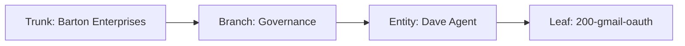

# Gmail OAuth — Google Token Provisioning for Dave Agent Identities
## Provision and maintain Gmail OAuth tokens for Dave Agent identities. Token bound to email_addr, stored in MC_MAIL, refreshed by spoke layer.
### Status: BUILD
### Medium: cloudflare-worker
### Business: governance/dave-agent

## UT Checklist (Pre-Flight - per law/UT_CHECKLIST.md v1.2.0)

| # | Check | Status | Location |
|---|-------|--------|----------|
| 1 | PRD — what / why / who / scope / out-of-scope / success metric | [x] | §2 |
| 2 | OSAM — READ / WRITE / Join Chain / Forbidden Paths / Query Routing filled | [x] | §5, §6, §9 |
| 3 | Component Status — every dependency has light with 1-line state | [x] | §3 |
| 4 | Owner — human who fixes this at 2 AM | [x] | §1 |
| 5 | Live Dashboard — URL or explicit "N/A" | [x] | §3 |
| 6 | Kill Switch — exact command to stop the process | [x] | §8 |
| 7 | Logbook — last audit verdict + date (after certification only) | [ ] | §12 — N/A during BUILD |
| 8 | FCEs Attached — which FCE runs structurally back this doc | [x] | §3c |
| 9 | BARs Referenced — every BAR this doc touches, with status | [x] | §3d |
| 10 | LBB Subjects Fed — which LBB subject(s) this doc's session logs go to | [x] | §3e |
| 11 | Geometry — CTB position + Hub-Spoke role + Altitude | [x] | §1b |
| 12 | Live Verification — every numeric count, cron, URL, command, BAR status grounded | [ ] | §9 — pending Dave OAuth flow + whoami verification |
| 13 | ctb_node — declared path on Barton Enterprises CTB trunk | [x] | §1 |

---

# IDENTITY

## 1. IDENTITY

| Field | Value |
|-------|-------|
| ID | PROC-200-GMAIL-OAUTH |
| Name | Gmail OAuth — Google Token Provisioning for Dave Agent Identities |
| Medium | cloudflare-worker |
| Business Silo | governance/dave-agent (cross-cutting — token feeds inbox-agent, calendar, routines) |
| CTB Position | barton-enterprises/governance/dave-agent/gmail-oauth |
| ORBT | BUILD |
| Strikes | 0 |
| Authority | Sovereign (CC-01) |
| Version | 1.0.0 |
| Last Modified | 2026-04-30 |
| BAR Reference | BAR-366 (inbox-agent OAuth gate) |
| Owner | Dave Barton |
| ctb_node | barton-enterprises/governance/dave-agent/gmail-oauth |

### 1b. Geometry

**CTB Position:** Barton Enterprises → Governance → Dave Agent → gmail-oauth (leaf)

**Hub-Spoke Role:** middle (this process IS the OAuth provisioning hub; spoke = gmail.ts; rim = cos.ts routes)

**Altitude:** 10k operational (one leaf — token provisioning for Dave Agent identities)



---

# CONTRACT

## 2. PURPOSE

Provision and maintain Gmail OAuth 2.0 tokens for Dave Agent identities:
- **dave@svg.agency** — primary SVG Agency identity
- **djb258@gmail.com** — personal Gmail identity
- **dbarton@svg.agency** — secondary SVG Agency identity

Each identity gets its own token row in `google_oauth_tokens` (MC_MAIL D1), keyed by `email_addr`. The token enables all downstream Google API consumers (inbox-agent, calendar spoke, routines) to operate without re-authorization.

**Why this matters:** Without a valid token, BAR-366 (inbox-agent), BAR-335 (COS calendar), and BAR-331 (COS routines) all return 401. This is the single gate that unlocks all Google API capability for Dave Agent.

**Scope:** OAuth flow initiation, code exchange, token storage, token refresh. Does NOT include mailbox processing logic (that's inbox-agent / BAR-366) or calendar event handling (BAR-335).

**Out of scope:** Service account credentials, JWT flows, multi-user OAuth (this is single-identity Dave Agent only).

**Success metric:** `/cos/oauth/google/whoami` returns `ok: true` with all four required scopes and a non-expired `expires_at` for each provisioned identity.

## 3. RESOURCES

### 3a. Worker Components

| Component | Path | Role |
|-----------|------|------|
| OAuth start route | `cos/routes/cos.ts` → `GET /cos/oauth/google/start` | Issues auth URL + state token |
| OAuth callback route | `cos/routes/cos.ts` → `GET /cos/oauth/google/callback` | Exchanges code for token, stores in DB |
| Whoami route | `cos/routes/cos.ts` → `GET /cos/oauth/google/whoami` | Verifies stored token identity + scopes |
| Gmail spoke | `cos/spokes/gmail.ts` | Token storage (`saveToken`), retrieval (`loadToken`), refresh (`refreshAccessToken`), public getter (`getGoogleAccessToken`) |
| COS hub | `cos/hub.ts` → `cosGoogleAuthUrl`, `handleCosGoogleCallback` | Composes the auth URL and handles the callback exchange |

### 3b. Infrastructure

| Resource | Value | State |
|----------|-------|-------|
| D1 Binding | `MC_MAIL` | Active — bound in mission-control-api wrangler.toml |
| Table | `google_oauth_tokens` | Exists — created by prior migration |
| Worker | `mission-control-api` | Deployed at `https://mission-control-api.svg-outreach.workers.dev` |
| Secrets | `GOOGLE_OAUTH_CLIENT_ID`, `GOOGLE_OAUTH_CLIENT_SECRET`, `GOOGLE_OAUTH_REDIRECT_URI` | Doppler → imo-creator → dev |

### 3c. FCEs Attached

- No FCE directly governs this process — it is a provisioning gate, not a classification engine. All downstream FCEs (outreach, sales, client) indirectly depend on this token being valid.

### 3d. BARs Referenced

| BAR | Description | Status |
|-----|-------------|--------|
| BAR-366 | Inbox-agent Gmail OAuth gate (this process) | IN PROGRESS — code complete, Dave OAuth flow pending |
| BAR-335 | COS Calendar spoke | BUILD — consumes same token |
| BAR-331 | COS Routines | BUILD — consumes same token |

### 3e. LBB Subjects Fed

- `system` — architecture and governance changes
- `processes` — process-level learnings (OAuth flow, token management patterns)

## 4. IMO

**Input:** Dave navigates to `/cos/oauth/google/start?state=<uuid>` (optional state param; auto-generated if absent). Worker returns `{ authUrl, state }`.

**Middle:**
1. Dave opens `authUrl` in browser — Google consent screen appears
2. Dave grants consent for all required scopes
3. Google redirects to `GOOGLE_OAUTH_REDIRECT_URI` with `?code=<auth_code>&state=<state>`
4. Callback route validates state matches issued state
5. Callback calls `handleCosGoogleCallback(env, code)` → exchanges code for tokens via `https://oauth2.googleapis.com/token`
6. `gmail.ts` `saveToken()` upserts row in `google_oauth_tokens` with `provider = 'google'`
7. Token refresh: `getGoogleAccessToken()` checks expiry; if expired, calls `refreshAccessToken()` automatically

**Output:** Row in `google_oauth_tokens` with valid `access_token`, `refresh_token`, `scope`, `expiry_at`. `/cos/oauth/google/whoami` returns `ok: true` with matched email + scopes.

**Circle (feedback):** Token expiry → `getGoogleAccessToken()` auto-refreshes → updated row in DB. If refresh fails (revoked token), spoke returns `null` → consumer gets 401 → squawk → re-run OAuth flow.

## 5. CONTRACT

### 5a. google_oauth_tokens Schema (MC_MAIL D1)

| Field | Type | Description |
|-------|------|-------------|
| `provider` | TEXT PK | Always `'google'` — single-row-per-provider design |
| `sovereign_id` | TEXT NOT NULL | FK to the sovereign identity that owns this email (e.g. `dave-barton`). Canonical system-wide join key per Atlas K=C doctrine. Enables one sovereign to own multiple Gmail identities. |
| `access_token` | TEXT NOT NULL | Current access token (short-lived, ~1hr) |
| `refresh_token` | TEXT | Long-lived refresh token (persists across access token rotations) |
| `token_type` | TEXT | Usually `'Bearer'` |
| `scope` | TEXT | Space-separated list of granted scopes |
| `expiry_at` | TEXT | ISO 8601 datetime of access token expiry |
| `updated_at` | TEXT | ISO 8601 datetime of last write |

### 5b. Required Scopes

All four must be present in `scope` column for full Dave Agent capability:

| Scope | Capability |
|-------|------------|
| `https://www.googleapis.com/auth/gmail.readonly` | Read inbox for inbox-agent |
| `https://www.googleapis.com/auth/gmail.send` | Send emails via agent |
| `https://www.googleapis.com/auth/gmail.modify` | Mark read, archive, label |
| `https://www.googleapis.com/auth/calendar` | Full calendar access for COS calendar spoke |

`https://www.googleapis.com/auth/calendar.events` and `pubsub` are also requested (see `gmail.ts` `GOOGLE_SCOPES`).

### 5c. Storage Rule

Token lives ONLY in `MC_MAIL` D1. Never in KV, env vars, Doppler secrets, or in-memory state.

### 5d. Refresh Logic

`refreshAccessToken()` in `gmail.ts` handles automatic refresh. If `authConfig(env)` returns null (missing env vars), refresh is skipped and current token is returned as-is. Always call `getGoogleAccessToken(env)` — never `loadToken()` directly from a route.

## 6. JOIN CONTRACT

**Natural key:** `email_addr` (derived from whoami userinfo response after OAuth flow) — the OAuth identity. Unique within Google; used for provisioning verification.

**Canonical system-wide join key:** `sovereign_id` — per Atlas K=C doctrine, `sovereign_id` is the join used by Mission Control, LBB, and all downstream clients when attaching this token to a person or system identity. `email_addr` stays as the OAuth natural key; `sovereign_id` is how everything else in the system finds "which human owns this token."

**Composite key intent:** `(sovereign_id, email_addr)` — this composite allows one sovereign to own multiple Gmail identities (e.g. Dave can have `dbarton@svg.agency` and `dave@personal.com`, both linked to the same `sovereign_id = 'dave-barton'`). Multi-identity migration will promote this to a true composite PK; until then, `provider = 'google'` remains the single-row PK.

Current single-identity constraints:

- One active token at a time
- Re-running the OAuth flow with a different Google account overwrites the existing row
- `whoami` always reflects the currently stored identity

**Downstream join:** Calendar spokes and inbox-agent call `getGoogleAccessToken(env)` → this returns the current valid token → Google API call is made. The `email_addr` from `whoami` is the identity verification step — consumers should call `whoami` after provisioning to confirm the correct identity is bound. Mission Control and LBB join on `sovereign_id`, not `email_addr`.

## 7. INTEGRATION

| Consumer | BAR | What It Needs |
|----------|-----|---------------|
| Inbox-agent | BAR-366 | Valid access token to call Gmail API |
| COS Calendar | BAR-335 | Valid access token to read/write Google Calendar |
| COS Routines | BAR-331 | Valid access token for scheduled Google API operations |
| Future outreach email send | TBD | `gmail.send` scope — already included |

All consumers go through `getGoogleAccessToken(env)` in `gmail.ts`. Zero direct DB access from consumers.

## 8. INGEST CHECKLIST

Step-by-step OAuth flow for one Dave Agent identity:

1. **Navigate to OAuth start URL** (see `bar-366-dave-actions.md` for exact URL):
   ```
   GET https://mission-control-api.svg-outreach.workers.dev/cos/oauth/google/start
   ```
   Response: `{ "authUrl": "https://accounts.google.com/o/oauth2/v2/auth?...", "state": "<uuid>" }`

2. **Open `authUrl` in browser.** Google consent screen appears. Confirm the identity shown (dave@svg.agency or target email). Grant all requested permissions.

3. **Google redirects to callback URL.** Worker handles automatically. Response: `{ "ok": true, "email": "...", "scopes": "..." }` (or error if state mismatch).

4. **Verify token stored in D1** (optional but recommended):
   ```sql
   SELECT provider, scope, expiry_at, updated_at FROM google_oauth_tokens;
   ```
   Run via `npx wrangler d1 execute <MC_MAIL_DB_NAME> --remote --command "SELECT ..."`

5. **Call whoami to confirm identity:**
   ```
   GET https://mission-control-api.svg-outreach.workers.dev/cos/oauth/google/whoami
   Headers: Authorization: Bearer <MC_API_KEY>
   ```
   Expected response: `{ "ok": true, "email": "dave@svg.agency", "scopes_granted": "...", "expires_at": "..." }`

**Stop conditions:**
- Step 1: Missing `GOOGLE_OAUTH_CLIENT_ID` or `GOOGLE_OAUTH_CLIENT_SECRET` → worker returns config error → fix Doppler secrets, redeploy
- Step 3: State mismatch → callback returns 400 → do not retry; restart from Step 1 with fresh state
- Step 5: `ok: false, error: "No Google OAuth token on file"` → Step 3 failed silently; check D1 directly
- Step 5: Scope list missing required scopes → re-run OAuth flow; do not patch token manually

**Kill switch:** To invalidate the token without deleting:
```sql
UPDATE google_oauth_tokens SET expiry_at = '2000-01-01T00:00:00Z' WHERE provider = 'google';
```
Runs `refreshAccessToken()` on next call → if refresh token also revoked, all consumers get 401. ORBT → REPAIR.

## 9. PERMISSIONS

### Write Rules

| Actor | Permitted Write | Location |
|-------|----------------|----------|
| OAuth callback route (`cos.ts`) | Calls `handleCosGoogleCallback` → `saveToken()` | MC_MAIL `google_oauth_tokens` via spoke only |
| Refresh logic (`gmail.ts`) | `refreshAccessToken()` → `saveToken()` | MC_MAIL `google_oauth_tokens` via spoke only |
| Dave (manual) | D1 `UPDATE` for kill switch | Direct D1 query — explicit admin action only |
| Any other actor | FORBIDDEN | Hard stop — no direct D1 writes to `google_oauth_tokens` from route handlers |

### Read Rules

| Actor | Permitted Read | Via |
|-------|---------------|-----|
| All Google-API-consuming spokes | `getGoogleAccessToken(env)` | `gmail.ts` public export |
| Whoami route | `loadStoredTokenMeta(env)` | `gmail.ts` public export (no raw token exposed) |
| Direct token read | FORBIDDEN in route handlers | Raw `loadToken()` is unexported |

### Auth

All `/cos/oauth/*` routes are protected by the worker's standard MC_API_KEY auth middleware (inherited from `mission-control-api` route structure). The OAuth start URL requires auth. The callback URL must be whitelisted in the Google OAuth app's authorized redirect URIs.

## 10. ANALYTICS

| Metric | Source | Target |
|--------|--------|--------|
| Tokens by identity | `SELECT email_addr, updated_at FROM google_oauth_tokens` (post multi-identity migration) | One row per Dave identity |
| Token expiry tracker | `SELECT expiry_at FROM google_oauth_tokens WHERE provider = 'google'` | `expiry_at` > `datetime('now')` = valid |
| Refresh failure rate | COS log table — look for `[refreshAccessToken]` error entries | 0 failures expected in steady state |
| Scope coverage | `SELECT scope FROM google_oauth_tokens` | All 4 required scopes present |

## 11. ERRORS

| Error | Cause | Fix |
|-------|-------|-----|
| `No Google OAuth token on file` | OAuth flow never completed, or token was deleted | Re-run OAuth flow (§8) |
| `Google userinfo returned 401` | Access token expired AND refresh failed | Re-run OAuth flow — refresh token was revoked |
| `missing code` from callback | Google didn't return auth code (user denied consent) | Re-run OAuth flow; check OAuth app config |
| State mismatch (400 from callback) | CSRF or stale state param | Restart from Step 1 with fresh state |
| `authConfig` null | Missing GOOGLE_OAUTH_CLIENT_ID/SECRET/REDIRECT_URI | Fix Doppler secrets + redeploy worker |

## 12. LOGBOOK

Not active during BUILD. Logbook entry created after:
1. Dave completes OAuth flow
2. Whoami confirms ok:true with correct identity + scopes
3. Auditor sign-off (different engine than builder)

---

# GOVERNANCE

## 13. CHANGE LOG

| Version | Date | Change | Author |
|---------|------|--------|--------|
| 1.0.0 | 2026-04-30 | Initial BUILD — BAR-366 code complete (gmail.ts + cos.ts), UT manual created | BAR-366 agent |
| 1.0.1 | 2026-04-30 | BAR-366 audit fix — add `sovereign_id` column to §5a schema; add canonical join clause to §6 per Atlas K=C doctrine | BAR-366 mechanic |

## 14. DOCUMENT CONTROL

| Field | Value |
|-------|-------|
| Created | 2026-04-30 |
| Last Modified | 2026-04-30 |
| Version | 1.0.1 |
| Status | BUILD |
| Authority | Sovereign (CC-01) |
| Governed By | law/doctrine/FOUNDATIONAL_BEDROCK.md + law/UNIFIED_TEMPLATE.md |
| Parent | law/doctrine/KEY.md |
| Repo | Barton-Processes |
| Path | factory/dave-agent/200-gmail-oauth/PROCESS-UT.md |
