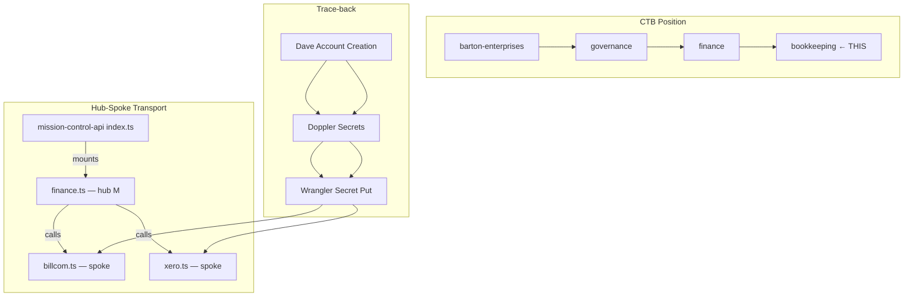
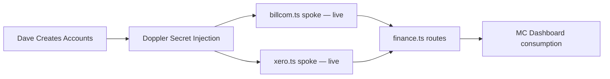

# PROCESS-UT — 350: Bookkeeping (Bill.com + Xero Scaffold)
## Status: PROVISIONAL (ORBT=BUILD)
### Business: barton-enterprises/governance/finance/bookkeeping
### Authority: BAR-122

## UT Checklist (Pre-Flight — per law/UT_CHECKLIST.md v1.2.0)

| # | Check | Status | Location |
|---|-------|--------|----------|
| 1 | PRD — what / why / who / scope / out-of-scope / success metric | ☑ | §2 |
| 2 | OSAM — READ / WRITE / Process Composition / Join Chain / Forbidden / Query Routing filled | ☑ | §5 |
| 3 | Component Status — every dep 🟢 / 🟡 / 🔴 with 1-line state | ☑ | §3 |
| 4 | Owner — human who fixes this at 2 AM | ☑ | §1 |
| 5 | Live Dashboard — URL or explicit "N/A" | ☑ | §3 |
| 6 | Kill Switch — exact command to stop the process | ☑ | §8 |
| 7 | Logbook — last audit verdict + date (after certification only) | ☐ | §12 — ORBT=BUILD, legitimately deferred |
| 8 | FCEs Attached — which FCE runs structurally back this doc | ☑ | §3c |
| 9 | BARs Referenced — every BAR this doc touches, with status | ☑ | §3d |
| 10 | LBB Subjects Fed — which LBB subject(s) this doc's session logs go to | ☑ | §3e |
| 11 | Geometry — CTB position + Hub-Spoke role + Altitude | ☑ | §1b |
| 12 | Live Verification — every numeric count, cron, URL, command, BAR status grounded | ☐ | §9b — deferred until ORBT=OPERATE (no live system yet) |
| 13 | ctb_node — declared path on Barton Enterprises CTB trunk | ☑ | §1 Identity |

---

# IDENTITY

## §1 Identity

| Field | Value |
|-------|-------|
| process_id | BOOKKEEPING |
| heir_id | BAR-122_v1.0.3 |
| sovereign_ref | imo-creator |
| hub_id | governance-bookkeeping |
| cc_layer | CC-03 |
| ctb_placement | branch |
| ctb_node | barton-enterprises/governance/finance/bookkeeping |
| process_name | Bookkeeping — Bill.com + Xero Integration Scaffold |
| runtime | cloudflare-worker |
| owner | Dave Barton |
| orbt_state | BUILD |
| version | 1.0.2 |
| created | 2026-04-30 |

## §1b Geometry

- **CTB Position:** `barton-enterprises/governance/finance/bookkeeping`
- **Hub-Spoke Role:** Branch node. `billcom.ts` and `xero.ts` are spokes (dumb transport only). `finance.ts` route handler is the hub M layer for all AP/GL logic. MC index mounts the hub.
- **Altitude:** 30k ft — tactical. This is one branch of the governance tree. Individual vendor/invoice operations live at 5k (execution). The DMJ join to sovereign_id is 10k (operational).



---

# CONTRACT

## §2 PRD

**WHAT:** Scaffold the Bill.com (AP) and Xero (GL) API integration inside mission-control-api. Stub functions are typed and structured to match the real REST API shapes. Routes are mounted and return graceful "not configured" responses until Dave creates accounts and injects secrets via Doppler.

**WHY:** Without this scaffold, bookkeeping is manual and disconnected from the MC graph. The sovereign_id join chain cannot close — vendor/client records in MC_DB have no financial counterpart. Every AP payment and GL journal entry is an orphan until this system is live.

**WHO:**
- Dave Barton (account creation, secret injection, operational use)
- mission-control-api (runtime consumer of both spokes)
- MC Dashboard (future: will surface AP/GL status via `/finance/*` routes)

**SCOPE (in):**
- Bill.com REST v3 API client stub (`listVendors`, `createBill`, `getInvoice`, `payBill`)
- Xero OAuth2 + REST API client stub (`listAccounts`, `createInvoice`, `getContact`, `postJournal`)
- Finance route group (`GET /finance/billcom/vendors`, `GET /finance/xero/accounts`)
- Graceful degradation when keys missing
- Dave-action guide for account creation + secret injection
- DOCTRINE.md (D-350-XX rules)

**OUT-OF-SCOPE:**
- Automated bill payment workflows (future BAR, post-OPERATE)
- Xero OAuth2 token refresh automation (future — requires a scheduled COS task)
- QuickBooks, FreshBooks, or any other GL tool (D-350-02: Xero is sovereign)
- Bank feed connections (Dave-action, not code)

**SUCCESS METRIC:** `GET /finance/billcom/vendors` and `GET /finance/xero/accounts` both return real data (not "not configured") within 72h of Dave completing account creation and injecting secrets. P=1 when both routes are 🟢 with live data.

---

## §3 Resources

### Component Status Grid

| Component | HEIR | ORBT | Light | State |
|-----------|------|------|-------|-------|
| mission-control-api | mc-api · trunk · CC-01 | OPERATE | 🟢 | Live, deployed, accepting auth'd routes |
| billcom.ts spoke | governance-bookkeeping · branch · CC-03 | BUILD | 🟡 | Stub functions ready; no live keys |
| xero.ts spoke | governance-bookkeeping · branch · CC-03 | BUILD | 🟡 | Stub functions ready; no live keys |
| finance.ts routes | governance-bookkeeping · branch · CC-03 | BUILD | 🟡 | Mounted, degrading gracefully |
| Doppler (imo-creator project) | infra · trunk · CC-01 | OPERATE | 🟢 | Live; awaiting 5 new secrets |
| Bill.com (external) | N/A | BUILD | 🔴 | Account not yet created — Dave-action |
| Xero (external) | N/A | BUILD | 🔴 | Account not yet created — Dave-action |

### Live Dashboard

| Resource | URL | What it shows |
|----------|-----|---------------|
| MC API health | https://mission-control-api.svg-outreach.workers.dev/health | Worker alive |
| Finance routes | GET /finance/billcom/vendors, GET /finance/xero/accounts | "not configured" until keys land |
| Doppler console | https://dashboard.doppler.com | Secret injection status |

### §3c FCEs Attached

| FCE Name | HEIR | ORBT | Status |
|----------|------|------|--------|
| N/A — predates FCE adoption for this scaffold | — | — | No FCE run yet |

### §3d BARs Referenced

| BAR | Title | HEIR | ORBT | Status | Relation |
|-----|-------|------|------|--------|---------|
| BAR-122 | Bill.com + Xero Scaffold | BAR-122 · branch · CC-03 | BUILD | In Progress | This doc IS BAR-122 |

### §3e LBB Subjects Fed

| LBB Subject | HEIR | ORBT | What This Doc Writes | Frequency |
|-------------|------|------|---------------------|-----------|
| processes | processes · trunk · CC-01 | OPERATE | Session learnings: what was built, what broke, what was decided | Per session |
| system | system · trunk · CC-01 | OPERATE | Architecture decisions: spoke pattern, graceful degradation | One-time at close |

---

## §4 IMO — Input, Middle, Output

*TODO: BUILD-state stub. Fill when ORBT moves to OPERATE.*

### Two-Question Intake
1. **"What triggers this?"** — Dave injects Doppler secrets after account creation
2. **"How do we get it?"** — Wrangler secret put → CF Worker runtime reads from env

### Input
Doppler secrets (BILLCOM_API_KEY, BILLCOM_DEV_KEY, XERO_CLIENT_ID, XERO_CLIENT_SECRET, XERO_REFRESH_TOKEN) cross the worker boundary at runtime.

### Middle
finance.ts route handler dispatches to billcom.ts or xero.ts spoke. Each spoke calls the respective external REST API with credentials from env.

### Output
JSON response to MC API caller: vendor list (Bill.com) or chart of accounts (Xero). Graceful "not configured" when keys absent.

### Circle
Live data → MC Dashboard consumption → operational visibility → Dave-triggered fixes loop back as secret re-injection or route updates.

---

## §5 OSAM

### Process Composition



| Sub-Process | Status | Handler |
|-------------|--------|---------|
| Bill.com account creation | ☐ Dave-action pending | Human |
| Xero account creation | ☐ Dave-action pending | Human |
| Doppler secret injection | ☐ Dave-action pending | Human |
| billcom.ts spoke | 🟡 BUILD — stubs ready, no live keys | mechanic |
| xero.ts spoke | 🟡 BUILD — stubs ready, no live keys | mechanic |
| finance.ts routes | 🟡 BUILD — mounted, degrading gracefully | mechanic |

### READ Access

| Source | What It Provides | Join Key |
|--------|-----------------|----------|
| Bill.com REST v3 | Vendor list, bill status, payment records | vendor_id → sovereign_id (future) |
| Xero REST API | Chart of accounts, invoices, contacts, journals | contact_id → sovereign_id (future) |
| Doppler (runtime) | BILLCOM_API_KEY, BILLCOM_DEV_KEY, XERO_CLIENT_ID, XERO_CLIENT_SECRET, XERO_REFRESH_TOKEN | N/A |

### WRITE Access

| Target | What It Writes | When |
|--------|---------------|------|
| Bill.com | New bills, payment instructions | POST /finance/billcom/bills (future) |
| Xero | Journal entries, invoice records | POST /finance/xero/invoices (future) |
| MC_DB (future) | Reconciliation records | Post-OPERATE |

### Join Chain

```
Bill.com vendor_id
  → MC_DB.vendors.billcom_vendor_id
  → MC_DB.vendors.sovereign_id
  → clients.client_id (if client) OR vendors.vendor_id (if AP)

Xero contact_id
  → MC_DB.contacts.xero_contact_id
  → MC_DB.contacts.sovereign_id
  → same spine
```
*Note: Join columns in MC_DB do not yet exist — will be added in a follow-on BAR when ORBT moves to OPERATE.*

### Forbidden Paths

| Action | Why |
|--------|-----|
| Direct DB writes bypassing spoke functions | D-350-06: all logic in hub M layer |
| Logging PII (bank/routing/EIN/SSN) | D-350-04: mask to last-4 only |
| Creating accounts via automation | D-350-08: human-only action |
| Running non-Bill.com AP workflows | D-350-01: Bill.com is sovereign for AP |

### Query Routing

| Business Question | Tool | Endpoint |
|-------------------|------|----------|
| Who are our active vendors? | Bill.com | GET /finance/billcom/vendors |
| What's in the chart of accounts? | Xero | GET /finance/xero/accounts |
| What invoices are outstanding? | Xero | GET /finance/xero/accounts (future: /invoices) |
| What bills are due? | Bill.com | GET /finance/billcom/bills (future) |

---

## §6 DMJ — Define, Map, Join

*TODO: BUILD-state stub. Fill when ORBT moves to OPERATE and join columns exist in MC_DB.*

### §6a DEFINE

| Element | ID | Format | Description | C or V |
|---------|-----|--------|-------------|--------|
| vendor_id | BILLCOM-VENDOR-ID | string | Bill.com vendor identifier | C |
| contact_id | XERO-CONTACT-ID | string | Xero contact identifier | C |
| sovereign_id | SOVEREIGN-ID | string | MC_DB spine identity | C |

### §6b MAP

| Source | Target | Transform |
|--------|--------|-----------|
| Bill.com vendor_id | MC_DB.vendors.billcom_vendor_id | direct |
| Xero contact_id | MC_DB.contacts.xero_contact_id | direct |

### §6c JOIN

| Join Path | Type | Description |
|-----------|------|-------------|
| billcom_vendor_id → sovereign_id | indirect | via MC_DB.vendors (future — columns not yet created) |
| xero_contact_id → sovereign_id | indirect | via MC_DB.contacts (future — columns not yet created) |

---

## §7 Constants & Variables

### Constants (structure — never changes)
- Hub-Spoke geometry: finance.ts = hub M, billcom.ts + xero.ts = spokes
- D-350-01: Bill.com is sovereign for AP
- D-350-02: Xero is sovereign for GL
- D-350-04: PII masking rule (last-4 only)
- D-350-06: All logic in hub M layer only
- D-350-08: Account creation is human-only

### Variables (fill — changes every run/cycle)
- BILLCOM_API_KEY (Doppler — injected by Dave)
- BILLCOM_DEV_KEY (Doppler — injected by Dave)
- XERO_CLIENT_ID (Doppler — injected by Dave)
- XERO_CLIENT_SECRET (Doppler — injected by Dave)
- XERO_REFRESH_TOKEN (Doppler — injected by Dave)
- vendor_id, contact_id (API response values — change per call)

---

## §8 Stop Conditions

| Condition | Action |
|-----------|--------|
| Secrets missing at runtime | Graceful "not configured" response — no halt |
| Bill.com API returns 401 | Log to error table, return structured error |
| Xero OAuth token expired | Log to error table, surface to Dave for refresh |
| Strike 3 on same failure | Troubleshoot/Train → AD |

### Kill Switch

```bash
# Disable finance routes (remove from index.ts mount — requires redeploy):
# Comment out in workers/mission-control-api/src/index.ts:
#   import { finance } from './routes/finance';
#   app.route('/', finance);
# Then redeploy:
cd workers/mission-control-api && npx wrangler deploy

# Or: revoke Bill.com API key in Bill.com console (immediate — no redeploy needed)
# Or: revoke Xero app credentials in Xero developer portal (immediate)
```

---

# GOVERNANCE

## §9 Verification

```
1. ls workers/mission-control-api/src/cos/spokes/billcom.ts → expected: file exists
2. ls workers/mission-control-api/src/cos/spokes/xero.ts → expected: file exists
3. grep "finance" workers/mission-control-api/src/index.ts → expected: import + route mount found
```

**Three Primitives Check:**
1. **Thing:** Did every component exist where it should? (billcom.ts, xero.ts, finance.ts)
2. **Flow:** Did the data/work reach every step? (secrets → spoke → route → response)
3. **Change:** Did the transformation happen correctly? (raw API response → structured JSON)

---

## §9b Live Verification

| Claim | Section | Source of Truth | Verification Command | Status | Last Check |
|-------|---------|----------------|---------------------|--------|-----------|
| billcom.ts stubs exist | §5 | File system | `ls workers/mission-control-api/src/cos/spokes/billcom.ts` | ☐ | 2026-04-30 |
| xero.ts stubs exist | §5 | File system | `ls workers/mission-control-api/src/cos/spokes/xero.ts` | ☐ | 2026-04-30 |
| finance.ts route mounted | §5 | index.ts | `grep "finance" workers/mission-control-api/src/index.ts` | ☐ | 2026-04-30 |
| Graceful degradation | §2 | Route handler | `curl -H "X-API-Key: $MC_API_KEY" https://mission-control-api.svg-outreach.workers.dev/finance/billcom/vendors` | ☐ | Deferred until deployed |

*Note: Items 1-3 verified at commit time. Item 4 deferred until worker is redeployed with finance route.*

---

## §10 Analytics

*TODO: BUILD-state stub. Metrics defined at OPERATE gate.*

### §10a Metrics

| Metric | Unit | Baseline | Target | Tolerance |
|--------|------|----------|--------|-----------|
| /finance/billcom/vendors response | HTTP status | N/A (BUILD) | 200 with live data | < 500ms |
| /finance/xero/accounts response | HTTP status | N/A (BUILD) | 200 with live data | < 500ms |

### §10b Sigma Tracking

*Deferred. No runs until ORBT=OPERATE.*

### §10c ORBT Gate Rules

| From | To | Gate |
|------|-----|------|
| BUILD | OPERATE | Both routes return live data for 3 consecutive checks + auditor sign-off |
| OPERATE | REPAIR | Any route returns non-200 or "not configured" |
| REPAIR | OPERATE | Fix verified + routes return live data + auditor verification |
| Any (Strike 3) | TROUBLESHOOT/TRAIN | Fleet-wide fix → AD |

---

## §11 Execution Trace

*Append-only. No entries during BUILD — first entry at OPERATE transition.*

| Field | Format | Required |
|-------|--------|----------|
| trace_id | UUID | Yes |
| run_id | UUID | Yes |
| step | action name | Yes |
| target | measurable | Yes |
| actual | measurable | Yes |
| delta | the gap | Yes |
| status | done / failed / skipped | Yes |
| error_code | text or null | If failed |
| error_message | text or null | If failed |
| tools_used | JSON array | Yes |
| duration_ms | integer | Yes |
| cost_cents | integer | Yes |
| timestamp | ISO-8601 | Yes |
| signed_by | agent or manual | Yes |

---

## §12 Logbook

*Deferred. ORBT=BUILD. No audit entry until ORBT=OPERATE (requires Dave account creation + live keys).*

---

## §13 Fleet Failure Registry

*No entries during BUILD state.*

| Pattern ID | Location | Error Code | First Seen | Occurrences | Strike Count | Status |
|-----------|----------|-----------|-----------|-------------|-------------|--------|
| — | — | — | — | — | — | — |

---

## §14 Maintenance Logbook

### Action Types

| Type | Meaning |
|------|---------|
| RETROFIT | UT structure / template upgrade applied |
| VERIFY | Claim grounded against live system (§9b row ticked ☑) |
| AUDIT | FAA Inspector (auditor) pass — PASS / FAIL recorded |
| EDIT | Content change (new step added, schema changed, etc.) |
| CERTIFY | Moved ORBT state (e.g., BUILD → OPERATE) |
| REPAIR | Post-strike fix |
| STRIKE | Fleet failure recorded (§13) |
| LBB_INGEST | Session summary written to LBB |

### Logbook (append-only — never edit past rows)

| Date (ISO) | Actor | Action | What Was Done | Evidence | LBB Record |
|-----------|-------|--------|---------------|----------|------------|
| 2026-04-30 00:00 UTC | Claude (Sonnet mechanic) | RETROFIT | UT v2.7.0 conformance fix per BAR-122 Strike 2 (FFR-122-002): sequential §1-§14, cluster banners corrected, heir.yaml + orbt.yaml schema patched, version bumped 1.0.0 → 1.0.2 | commit pending | pending |

---

## Document Control

| Field | Value |
|-------|-------|
| Created | 2026-04-30 |
| Version | 1.0.3 |
| ORBT | BUILD |
| Template Version | 2.7.0 |
| Governing Engine | law/doctrine/FOUNDATIONAL_BEDROCK.md + law/doctrine/DMJ.md |
| Next gate | Dave creates Bill.com + Xero accounts → injects secrets → verify both routes return live data → ORBT → OPERATE |

### Amendment Log

| Version | Date | Author | Change |
|---------|------|--------|--------|
| 1.0.0 | 2026-04-30 | Claude (mechanic) | Initial BUILD scaffold |
| 1.0.2 | 2026-04-30 | Claude (Sonnet mechanic) | UT v2.7.0 conformance fix per BAR-122 Strike 2 (FFR-122-002): sequential §1-§14, cluster banners corrected (`# CLUSTER N — X` → `# IDENTITY/CONTRACT/GOVERNANCE`), heir.yaml `process_id` + `runtime` fields added, orbt.yaml `blockers` array added |
| 1.0.3 | 2026-04-30 | Claude (Sonnet mechanic) | BAR-122 FFR-122-003: section label prefix `A§` → `§` per UT v2.7.0. Audit finding confirmed already-clean — zero `A§` occurrences found; version bump + amendment row added to close the FFR. |
