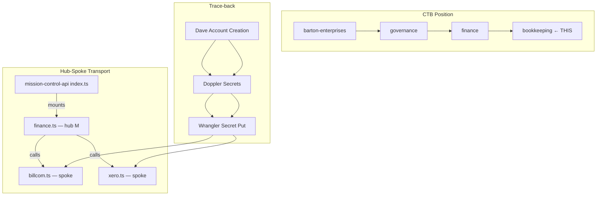
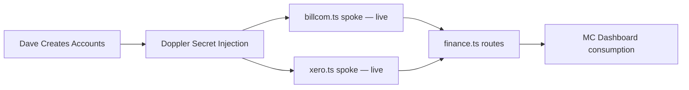

# PROCESS-UT — 350: Bookkeeping (Bill.com + Xero Scaffold)
## Status: PROVISIONAL (ORBT=BUILD)
### Business: barton-enterprises/governance/finance/bookkeeping
### Authority: BAR-122

## UT Checklist (Pre-Flight — per law/UT_CHECKLIST.md v1.2.0)

| # | Check | Status | Location |
|---|-------|--------|----------|
| 1 | PRD — what / why / who / scope / out-of-scope / success metric | ☑ | §2 |
| 2 | OSAM — READ / WRITE / Process Composition / Join Chain / Forbidden / Query Routing filled | ☑ | §5 |
| 3 | Component Status — every dep 🟢 / 🟡 / 🔴 with 1-line state | ☑ | §3 |
| 4 | Owner — human who fixes this at 2 AM | ☑ | §1 |
| 5 | Live Dashboard — URL or explicit "N/A" | ☑ | §3 |
| 6 | Kill Switch — exact command to stop the process | ☑ | §8 |
| 7 | Logbook — last audit verdict + date (after certification only) | ☐ | §12 — ORBT=BUILD, legitimately deferred |
| 8 | FCEs Attached — which FCE runs structurally back this doc | ☑ | §3c |
| 9 | BARs Referenced — every BAR this doc touches, with status | ☑ | §3d |
| 10 | LBB Subjects Fed — which LBB subject(s) this doc's session logs go to | ☑ | §3e |
| 11 | Geometry — CTB position + Hub-Spoke role + Altitude | ☑ | §1b |
| 12 | Live Verification — every numeric count, cron, URL, command, BAR status grounded | ☐ | §9b — deferred until ORBT=OPERATE (no live system yet) |
| 13 | ctb_node — declared path on Barton Enterprises CTB trunk | ☑ | §1 Identity |

---

# ═══════════════════════════════════════════════════════════
# CLUSTER 1 — IDENTITY
# ═══════════════════════════════════════════════════════════

## §1 Identity

| Field | Value |
|-------|-------|
| heir_id | BAR-122_v1.0.0 |
| sovereign_ref | imo-creator |
| hub_id | governance-bookkeeping |
| cc_layer | CC-03 |
| ctb_placement | branch |
| ctb_node | barton-enterprises/governance/finance/bookkeeping |
| process_name | Bookkeeping — Bill.com + Xero Integration Scaffold |
| owner | Dave Barton |
| orbt_state | BUILD |
| version | 1.0.0 |
| created | 2026-04-30 |

## §1b Geometry

- **CTB Position:** `barton-enterprises/governance/finance/bookkeeping`
- **Hub-Spoke Role:** Branch node. `billcom.ts` and `xero.ts` are spokes (dumb transport only). `finance.ts` route handler is the hub M layer for all AP/GL logic. MC index mounts the hub.
- **Altitude:** 30k ft — tactical. This is one branch of the governance tree. Individual vendor/invoice operations live at 5k (execution). The DMJ join to sovereign_id is 10k (operational).



---

# ═══════════════════════════════════════════════════════════
# CLUSTER 2 — CONTRACT
# ═══════════════════════════════════════════════════════════

## §2 PRD

**WHAT:** Scaffold the Bill.com (AP) and Xero (GL) API integration inside mission-control-api. Stub functions are typed and structured to match the real REST API shapes. Routes are mounted and return graceful "not configured" responses until Dave creates accounts and injects secrets via Doppler.

**WHY:** Without this scaffold, bookkeeping is manual and disconnected from the MC graph. The sovereign_id join chain cannot close — vendor/client records in MC_DB have no financial counterpart. Every AP payment and GL journal entry is an orphan until this system is live.

**WHO:**
- Dave Barton (account creation, secret injection, operational use)
- mission-control-api (runtime consumer of both spokes)
- MC Dashboard (future: will surface AP/GL status via `/finance/*` routes)

**SCOPE (in):**
- Bill.com REST v3 API client stub (`listVendors`, `createBill`, `getInvoice`, `payBill`)
- Xero OAuth2 + REST API client stub (`listAccounts`, `createInvoice`, `getContact`, `postJournal`)
- Finance route group (`GET /finance/billcom/vendors`, `GET /finance/xero/accounts`)
- Graceful degradation when keys missing
- Dave-action guide for account creation + secret injection
- DOCTRINE.md (D-350-XX rules)

**OUT-OF-SCOPE:**
- Automated bill payment workflows (future BAR, post-OPERATE)
- Xero OAuth2 token refresh automation (future — requires a scheduled COS task)
- QuickBooks, FreshBooks, or any other GL tool (D-350-02: Xero is sovereign)
- Bank feed connections (Dave-action, not code)

**SUCCESS METRIC:** `GET /finance/billcom/vendors` and `GET /finance/xero/accounts` both return real data (not "not configured") within 72h of Dave completing account creation and injecting secrets. P=1 when both routes are 🟢 with live data.

---

## §5 OSAM

### Process Composition



| Sub-Process | Status | Handler |
|-------------|--------|---------|
| Bill.com account creation | ☐ Dave-action pending | Human |
| Xero account creation | ☐ Dave-action pending | Human |
| Doppler secret injection | ☐ Dave-action pending | Human |
| billcom.ts spoke | 🟡 BUILD — stubs ready, no live keys | mechanic |
| xero.ts spoke | 🟡 BUILD — stubs ready, no live keys | mechanic |
| finance.ts routes | 🟡 BUILD — mounted, degrading gracefully | mechanic |

### READ Access

| Source | What It Provides | Join Key |
|--------|-----------------|----------|
| Bill.com REST v3 | Vendor list, bill status, payment records | vendor_id → sovereign_id (future) |
| Xero REST API | Chart of accounts, invoices, contacts, journals | contact_id → sovereign_id (future) |
| Doppler (runtime) | BILLCOM_API_KEY, BILLCOM_DEV_KEY, XERO_CLIENT_ID, XERO_CLIENT_SECRET, XERO_REFRESH_TOKEN | N/A |

### WRITE Access

| Target | What It Writes | When |
|--------|---------------|------|
| Bill.com | New bills, payment instructions | POST /finance/billcom/bills (future) |
| Xero | Journal entries, invoice records | POST /finance/xero/invoices (future) |
| MC_DB (future) | Reconciliation records | Post-OPERATE |

### Join Chain

```
Bill.com vendor_id
  → MC_DB.vendors.billcom_vendor_id
  → MC_DB.vendors.sovereign_id
  → clients.client_id (if client) OR vendors.vendor_id (if AP)

Xero contact_id
  → MC_DB.contacts.xero_contact_id
  → MC_DB.contacts.sovereign_id
  → same spine
```
*Note: Join columns in MC_DB do not yet exist — will be added in a follow-on BAR when ORBT moves to OPERATE.*

### Forbidden Paths

| Action | Why |
|--------|-----|
| Direct DB writes bypassing spoke functions | D-350-06: all logic in hub M layer |
| Logging PII (bank/routing/EIN/SSN) | D-350-04: mask to last-4 only |
| Creating accounts via automation | D-350-08: human-only action |
| Running non-Bill.com AP workflows | D-350-01: Bill.com is sovereign for AP |

### Query Routing

| Business Question | Tool | Endpoint |
|-------------------|------|----------|
| Who are our active vendors? | Bill.com | GET /finance/billcom/vendors |
| What's in the chart of accounts? | Xero | GET /finance/xero/accounts |
| What invoices are outstanding? | Xero | GET /finance/xero/accounts (future: /invoices) |
| What bills are due? | Bill.com | GET /finance/billcom/bills (future) |

---

# ═══════════════════════════════════════════════════════════
# CLUSTER 3 — GOVERNANCE
# ═══════════════════════════════════════════════════════════

## §3 Dependencies & Component Status

| Component | HEIR | ORBT | Light | State |
|-----------|------|------|-------|-------|
| mission-control-api | mc-api · trunk · CC-01 | OPERATE | 🟢 | Live, deployed, accepting auth'd routes |
| billcom.ts spoke | governance-bookkeeping · branch · CC-03 | BUILD | 🟡 | Stub functions ready; no live keys |
| xero.ts spoke | governance-bookkeeping · branch · CC-03 | BUILD | 🟡 | Stub functions ready; no live keys |
| finance.ts routes | governance-bookkeeping · branch · CC-03 | BUILD | 🟡 | Mounted, degrading gracefully |
| Doppler (imo-creator project) | infra · trunk · CC-01 | OPERATE | 🟢 | Live; awaiting 5 new secrets |
| Bill.com (external) | N/A | BUILD | 🔴 | Account not yet created — Dave-action |
| Xero (external) | N/A | BUILD | 🔴 | Account not yet created — Dave-action |

### §3a Live Dashboard

| Resource | URL | What it shows |
|----------|-----|---------------|
| MC API health | https://mission-control-api.svg-outreach.workers.dev/health | Worker alive |
| Finance routes | GET /finance/billcom/vendors, GET /finance/xero/accounts | "not configured" until keys land |
| Doppler console | https://dashboard.doppler.com | Secret injection status |

### §3c FCEs Attached

| FCE Name | HEIR | ORBT | Status |
|----------|------|------|--------|
| N/A — predates FCE adoption for this scaffold | — | — | No FCE run yet |

### §3d BARs Referenced

| BAR | Title | HEIR | ORBT | Status | Relation |
|-----|-------|------|------|--------|---------|
| BAR-122 | Bill.com + Xero Scaffold | BAR-122 · branch · CC-03 | BUILD | In Progress | This doc IS BAR-122 |

### §3e LBB Subjects Fed

| LBB Subject | HEIR | ORBT | What This Doc Writes | Frequency |
|-------------|------|------|---------------------|-----------|
| processes | processes · trunk · CC-01 | OPERATE | Session learnings: what was built, what broke, what was decided | Per session |
| system | system · trunk · CC-01 | OPERATE | Architecture decisions: spoke pattern, graceful degradation | One-time at close |

---

## §8 Kill Switch

```bash
# Disable finance routes (remove from index.ts mount — requires redeploy):
# Comment out in workers/mission-control-api/src/index.ts:
#   import { finance } from './routes/finance';
#   app.route('/', finance);
# Then redeploy:
cd workers/mission-control-api && npx wrangler deploy

# Or: revoke Bill.com API key in Bill.com console (immediate — no redeploy needed)
# Or: revoke Xero app credentials in Xero developer portal (immediate)
```

---

## §9b Live Verification

| Claim | Section | Source of Truth | Verification Command | Status | Last Check |
|-------|---------|----------------|---------------------|--------|-----------|
| billcom.ts stubs exist | §5 | File system | `ls workers/mission-control-api/src/cos/spokes/billcom.ts` | ☐ | 2026-04-30 |
| xero.ts stubs exist | §5 | File system | `ls workers/mission-control-api/src/cos/spokes/xero.ts` | ☐ | 2026-04-30 |
| finance.ts route mounted | §5 | index.ts | `grep "finance" workers/mission-control-api/src/index.ts` | ☐ | 2026-04-30 |
| Graceful degradation | §2 | Route handler | `curl -H "X-API-Key: $MC_API_KEY" https://mission-control-api.svg-outreach.workers.dev/finance/billcom/vendors` | ☐ | Deferred until deployed |

*Note: Items 1-3 verified at commit time. Item 4 deferred until worker is redeployed with finance route.*

---

## §12 Logbook

*Deferred. ORBT=BUILD. No audit entry until ORBT=OPERATE (requires Dave account creation + live keys).*

---

## Document Control

| Field | Value |
|-------|-------|
| Created | 2026-04-30 |
| Version | 1.0.0 |
| ORBT | BUILD |
| Next gate | Dave creates Bill.com + Xero accounts → injects secrets → verify both routes return live data → ORBT → OPERATE |
