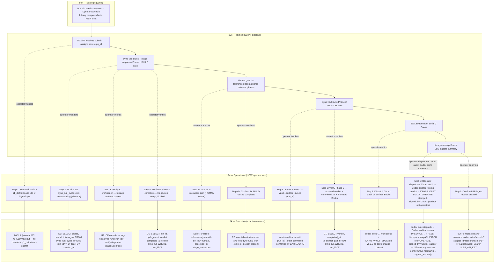
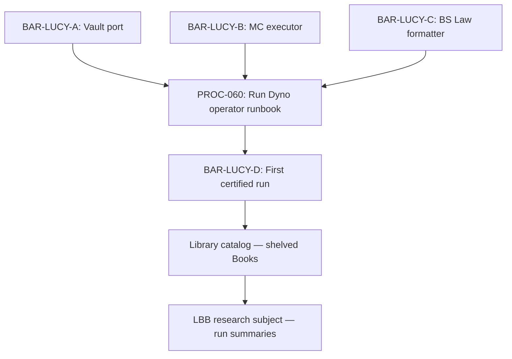

# PROCESS-UT — 060: Run Dyno (End-to-End Operator Runbook)
## Unified Template v2.8.0 | PROC-060 | v0.2.0 — 2026-05-04
### Status: PROVISIONAL (ORBT=BUILD)
### Medium: process
### Business: imo-creator

> **Governance:** Rules enforced by `DOCTRINE.md` (D-060-XX, pending first fill).
> **Authority:** `atlas/constants/FOUNDATIONAL_BEDROCK.md`, `atlas/constants/UNIFIED_TEMPLATE.md` (in imo-creator-v2 — the canonical doctrine repo)
> **CTB:** `atlas/constants/BARTON_ENTERPRISES_CTB.md` → imo-creator → lucy → process-run-dyno
> **Companion YAML:** `atlas/manifests/dyno-vault.yaml` (in imo-creator-v2 — engine wrapper spec, BAR-397)
>
> **ARCHITECTURAL CONTEXT — READ BEFORE FILLING:**
> - `djb258/imo-engine-vault` (private repo) = the sealed engine itself (Coca-Cola recipe, never open)
> - `atlas/DYNO_VAULT_SPEC.md` (in imo-creator-v2) = WHAT the engine IS (blueprint, Codex audit PASS v0.3.3)
> - **THIS DOC** = HOW an OPERATOR runs the engine end-to-end (submit → monitor → verify → certify)

---

## UT Checklist (Pre-Flight — per `atlas/constants/UT_CHECKLIST.md` v1.3.1)

| # | Check | Status | Location |
|---|-------|--------|----------|
| 1 | PRD — what / why / who / scope / out-of-scope / success metric | ☑ | §2 |
| 2 | OSAM — READ / WRITE / Process Composition / Join Chain / Forbidden / Query Routing filled | ☑ | §5 |
| 3 | Component Status — every dep 🟢 / 🟡 / 🔴 with 1-line state | ☑ | §3 |
| 4 | Owner — human who fixes this at 2 AM | ☑ | §1 |
| 5 | Live Dashboard — URL or explicit "N/A" | ☐ | §3 — MC URLs pending BAR-LUCY-A/B; wrangler + LBB rows are real URLs |
| 6 | Kill Switch — exact command to stop the process | ☑ | §8 |
| 7 | Logbook — last audit verdict + date (after certification only) | ☐ | §12 — ORBT=BUILD, legitimately deferred |
| 8 | FCEs Attached — which FCE runs structurally back this doc | ☑ | §3c |
| 9 | BARs Referenced — every BAR this doc touches, with status | ☑ | §3d |
| 10 | LBB Subjects Fed — which LBB subject(s) this doc's session logs go to | ☑ | §3e |
| 11 | Geometry — CTB position + Hub-Spoke role + Altitude | ☑ | §1b |
| 12 | Live Verification — every numeric count, URL, command, BAR status grounded against live system | ☐ | §9b — legitimately deferred until LUCY-A through LUCY-C deploy |
| 13 | ctb_node — declared path on Barton Enterprises CTB trunk | ☑ | §1 Identity |

**Status:** Items 7 (post-cert) and 12 (first live run) legitimately ☐. Item 5 ☐ until BAR-LUCY-A/B deploy (wrangler + LBB rows are real). Doc is PROVISIONAL — ready for Codex audit.

---

## Table of Contents {#toc}

| Section | Title |
|---------|-------|
| §1 | Identity |
| §1b | Geometry |
| §2 | PRD |
| §3 | Resources (Component Status Grid, Live Dashboard, Dependencies, Downstream Consumers) |
| §3c | FCEs Attached |
| §3d | BARs Referenced |
| §3e | LBB Subjects Fed |
| §3f | Vocabulary |
| §4 | Middle (Operator Step Sequence) |
| §5 | OSAM |
| §6 | Inputs |
| §7 | Outputs |
| §8 | Kill Switch |
| §9 | Observability |
| §9b | Live Verification |
| §10 | Success Metrics |
| §10a | Metric Targets |
| §10b | Tolerance Spec |
| §10c | Metric Derivation |
| §11 | Out-of-Scope |
| §12 | Logbook / Birth Certificate |
| §13 | Document Control |
| §14 | Maintenance Logbook |

---

## §3f. Vocabulary {#sec-3f-vocab}

> **Parent KEY:** `atlas/constants/KEY.md` (in imo-creator-v2) — all universal terms (HEIR, ORBT, IMO, CTB, C&V, Three Primitives, Tier 0) are defined there and inherited here without repetition. This section declares only local terms specific to PROC-060.

| Term | Definition |
|------|------------|
| Operator | The human (Dave Barton) or authorized agent who drives the Dyno end-to-end using this runbook |
| Phase 1 BUILD pass | The first invocation of the Dyno engine — 3 models independently identify constants, run C&V, produce candidate set |
| Phase 2 AUDITOR pass | The second invocation — a different model audits Phase 1 output for BS Law conformance; produces the certified Book |
| ts-tolerances.json | Human-authored tolerance file (`k_i` values per comparator) required before Phase 2; gating artifact |
| sovereign_id | UUID assigned by MC API at submission; propagates through R2 keying, D1 rows, and all emitted Book HEIR coordinates |
| run_id | Same as sovereign_id in D1 context (`dyno_run.run_id`) |
| FCE Book | The emitted FCE output Book (Research-Body species) produced by the Dyno for a given domain |
| Artifact Book | The emitted UT/Plan/Audit artifact (one of the 5 Book species) produced for the target domain |
| dyno-vault | The sealed CF Worker engine at `imo-engine-vault.svg-outreach.workers.dev` (service-binding only; no public routes) |
| MC API | Mission Control API (`/dyno/run` POST route) — accepts submission, assigns sovereign_id, calls vault |
| BAR-LUCY-A | BAR that ports missing dyno-vault features (multi-cycle, R2 writes, D1 writes, LBB ingest) |
| BAR-LUCY-B | BAR that adds MC API route + executor wiring |
| BAR-LUCY-C | BAR that adds BS Law formatter to emitted Books |
| BAR-LUCY-E | BAR for this operator runbook (PROC-060) itself |

---

## §1 IDENTITY {#sec-1-identity}

| Field | Value |
|-------|-------|
| Process ID | PROC-060 |
| Name | Run Dyno — End-to-End Operator Runbook |
| Short Name | RUN-DYNO |
| Medium | process |
| Business Silo | imo-creator |
| CTB Position | leaf — `barton-enterprises/imo-creator/lucy/process-run-dyno` |
| ORBT | BUILD |
| Strikes | 0 |
| Authority | inherited (sovereign: Dave Barton via imo-creator) |
| Last Modified | 2026-05-04 (BAR-PROC-CLEANUP — atlas-centralization migration: `law/...` citations → `atlas/...`; UT_CHECKLIST v1.2.0 → v1.3.1; UT v2.7.0 → v2.8.0; companion YAML cross-ref added) |
| Version | 0.2.0 |
| BAR Reference | BAR-LUCY-E (operator runbook — this doc); BAR-PROC-CLEANUP (atlas-centralization refresh) |
| Owner | Dave Barton |
| ctb_node | `barton-enterprises/imo-creator/lucy/process-run-dyno` |
| Created | 2026-05-01 |

---

## §1b. Geometry {#sec-1b-geometry}

**CTB Position:** `trunk: barton-enterprises → branch: imo-creator → sub-branch: lucy → leaf: process-run-dyno`

**Hub-Spoke Role:** **SPOKE** — This process is a spoke that describes how an operator interfaces with the dyno-vault hub. The hub (dyno-vault engine) owns all logic. This runbook documents the operator's INPUT actions and OUTPUT verification steps; it has no logic itself. It points at the hub.

**Altitude:** **10k operational** — This is a step-by-step operator runbook. Strategic (50k) = why Dyno exists. Tactical (30k) = how Lucy pipeline is wired. This doc = what the operator does in sequence.

```mermaid
flowchart LR
  %% CTB Tree
  TRUNK[Trunk: Barton Enterprises] --> BRANCH[Branch: imo-creator]
  BRANCH --> SUB[Sub-branch: Lucy]
  SUB --> LEAF[Leaf: process-run-dyno THIS DOC]

  %% Operator perspective
  OPERATOR[Operator] --> MC_UI[MC UI — DynoInput Page<br/>/dyno/input]
  MC_UI --> MC_API[MC API POST /dyno/run<br/>assigns sovereign_id]
  MC_API --> HUB[Hub: dyno-vault Engine<br/>sealed Coca-Cola]
  HUB --> R2[R2 workbench<br/>svg-files/dyno-runs/{run_id}/]
  HUB --> D1[D1 dyno_run + dyno_run_cycle<br/>per-cycle audit trail]
  R2 --> VERIFY[Operator verifies<br/>Phase 1 artifacts]
  D1 --> VERIFY
  VERIFY --> TOLERANCES[Operator authors<br/>ts-tolerances.json]
  TOLERANCES --> PHASE2[Operator invokes<br/>Phase 2 -- auditor]
  PHASE2 --> AUDIT_BOOKS[Operator dispatches<br/>Codex audit on emitted Books]
  AUDIT_BOOKS --> CERTIFY[Codex auditor certifies<br/>ORBT BUILD→OPERATE on PASS<br/>signed_by=Codex auditor; operator ≠ certifier]
  CERTIFY --> LBB[Confirm LBB ingest<br/>subject_id=research]
```

### HEIR

| Field | Value |
|-------|-------|
| sovereign_ref | imo-creator |
| hub_id | process-run-dyno |
| ctb_placement | leaf |
| imo_topology | full I/M/O — operator is the I, dyno-vault is the M, verified Books are the O |
| cc_layer | CC-04 (process — operator-level, references CC-02 hub) |
| services | Mission Control UI, dyno-vault (service binding), R2 workbench (svg-files bucket), D1 mission-control, Library catalog, LBB worker, Codex (audit) |
| secrets_provider | doppler (VAULT_SECRET for kill switch; operator reads from Doppler imo-creator → dev) |
| acceptance_criteria | Operator can submit a domain + p1_definition via MC UI, monitor Phase 1 cycles in D1/R2, author ts-tolerances.json between phases, invoke Phase 2 auditor, **dispatch Codex audit on emitted Books — Codex (auditor, different engine than Mechanic) returns the certify verdict and signs the ORBT BUILD→OPERATE transition. Operator does NOT certify; operator dispatches + observes + logs.** All without touching engine internals. Three successful end-to-end runs with Codex PASS verdicts (signed by Codex auditor) required for ORBT=OPERATE. |

---

## §2. PURPOSE {#sec-2-purpose}

### WHAT

An operator process for running a single Dyno run from MC UI submission to certified Library shelving. The operator submits a domain + p1_definition via Mission Control, monitors Phase 1 engine execution, authors the required ts-tolerances.json between phases, invokes Phase 2 auditor, and **dispatches Codex audit on the two emitted Books. Codex (auditor, different engine than Mechanic) — NOT the operator — signs the ORBT BUILD→OPERATE certify event on a PASS verdict.** Per Aviation Model + memory `feedback_codex_certifies_not_operator.md`: operator ≠ certifier; the certifying actor is always the Codex auditor. This is the HOW-TO for driving the engine end-to-end — not the engine itself (that is `DYNO_VAULT_SPEC.md`) and not the code-level port (that is BAR-LUCY-A/B/C).

### WHY

Without this runbook, operators treat the engine as a black box and skip verification steps. Phase 2 never gets invoked because no one knows the gate sequence. Books get emitted but never audited, never shelved. The Library starves — Books are produced but never compound because they are never certified. This runbook closes the operator's side of the Circle: it is the document that makes the engine's output enter the Library reliably.

### WHO

- **Dave Barton** — primary operator (sovereign, runs Dyno for new domains)
- **Foreman agent** — dispatches runs per BAR sequences (BAR-LUCY-D and successors)
- **Codex** — auditor role, dispatched in Step 5 of operator sequence; different engine than the builder
- **Ops staff** — any future operator acting in Dave's role

### SCOPE (in)

- Submitting a Dyno run via MC UI (domain + p1_definition input fields at `/dyno/input`)
- Monitoring Phase 1 cycle progress via D1 `dyno_run` + `dyno_run_cycle` rows and MC DynoGrid UI
- Verifying R2 workbench artifacts (stage-keyed JSON objects: `svg-files/dyno-runs/{run_id}/cycle-{n}-{stage}.json`)
- Verifying D1 `dyno_run` final Phase 1 row (all 6 BUILD-pass stage artifacts written: 01-us, 01-orchestrator, 02-define, 03-map, 04-join or 04-backprop, 05-qc)
- Authoring `ts-tolerances.json` between Phase 1 and Phase 2 (human-owned; must contain `set_by=human`, `approved_at`, `stage_tolerances` for define/map/join)
- Invoking Phase 2 AUDITOR pass via `vault --auditor --run-id {run_id}` (separate from Phase 1; gated by 3+ completed BUILD runs + ts-tolerances + model separation)
- Verifying Phase 2 completion (`06-audit.json` written; `dyno_run.verdict` non-null + `completed_at` populated)
- Dispatching Codex FAA audit on Artifact Book + FCE Book (both Research-Body species)
- Dispatching Codex audit on emitted Books and observing the verdict (Codex — different engine than Mechanic — signs the ORBT BUILD→OPERATE certify event; operator dispatches + observes + logs, never signs CERTIFY)
- Shelving Books in Library catalog
- Confirming LBB ingest record at `subject_id=research` with sovereign_id stamped
- Halting a run mid-flight via kill switch (VAULT_SECRET rotation in Doppler)

### OUT-OF-SCOPE

- **Engine internals** — US/K=C/DMJ/UP prompts, 3-model consensus logic, back-prop algorithm. Sealed Coca-Cola. See `djb258/imo-engine-vault` (sealed) and `atlas/DYNO_VAULT_SPEC.md` v0.3.3 (blueprint, in imo-creator-v2).
- **Code-level port (BAR-LUCY-A)** — feature-parity porting of dyno.py into the vault worker. Separate BAR.
- **MC executor implementation (BAR-LUCY-B)** — the MC API route + executor logic that calls vault. Separate BAR.
- **BS Law formatter implementation (BAR-LUCY-C)** — the formatter that wraps vault response into conformant Books. Separate BAR.
- **Library shelving mechanics** — how Books promote from PROVISIONAL to CERTIFIED in the Library catalog. See Library doctrine.
- **Cross-Book JOIN operations** — joining Books from this Dyno run to other Library Books via HEIR. Library-level concern.
- **LBB subject taxonomy** — which subject a given domain's FCE Book classifies under. See LBB PROCESS doc.
- **MC UI development** — DynoInput/DynoOutput/DynoGrid pages. See BAR-LUCY-B/C.

### SUCCESS METRIC

One conformant FCE Book + one conformant Artifact Book (both Research-Body species) shelved in Library catalog with ORBT=OPERATE, sovereign ID traceable end-to-end from MC intake → R2 artifacts → D1 cycle rows → emitted Books → Library → LBB, with Codex audit PASS on both Books and zero manual engine touches. Numeric targets in §10a; ORBT gate in §10c.

---

## §3. RESOURCES {#sec-3-resources}

### Component Status Grid (Checklist item 3)

| Component | HEIR (`hub_id · ctb · cc_layer`) | ORBT | Light | State |
|-----------|----------------------------------|------|-------|-------|
| dyno-vault engine (deployed) | `dyno-vault · branch · CC-02` | BUILD | 🟡 | Stub deployed; missing multi-cycle, R2 writes, D1 writes, LBB ingest, per-cycle audit. BAR-LUCY-A ports the missing features. |
| MC UI — DynoInput page (`/dyno/input`) | `mission-control · branch · CC-02` | BUILD | 🟡 | Page exists; submit form may need executor wiring from BAR-LUCY-B. |
| MC UI — DynoGrid (`/garage/dyno-grid`) | `mission-control · branch · CC-02` | BUILD | 🟡 | Run list view; populated only after BAR-LUCY-A writes D1 rows. |
| MC executor + BS Law formatter | `mc-formatter · branch · CC-02` | BUILD | 🔴 | Does not exist. BAR-LUCY-B adds executor; BAR-LUCY-C adds formatter. |
| D1 `dyno_run` + `dyno_run_cycle` tables | `mission-control · branch · CC-03` | OPERATE | 🟢 | Schema exists (migrations/0018_dyno_run.sql). Tables ready; per-cycle rows never written today — BAR-LUCY-A adds. |
| R2 workbench bucket (`svg-files`) | `svg-files · spoke · CC-04` | OPERATE | 🟢 | Bucket exists; vault binding pending BAR-LUCY-A. |
| LBB worker | `lbb · spoke · CC-04` | OPERATE | 🟢 | Live at `https://lbb.svg-outreach.workers.dev`. Vault has no ingest call today — BAR-LUCY-A adds. |
| Library catalog | `library-catalog · branch · CC-02` | BUILD | 🟡 | Build status; Books can be manually shelved; API-based shelving needs implementation. |
| MC API `/dyno/run` | `mc-api · leaf · CC-03` | BUILD | 🔴 | Does not exist — endpoint pending BAR-LUCY-B implementation. |
| MC executor (BAR-LUCY-B) | `mc-executor · leaf · CC-03` | BUILD | 🔴 | Does not exist — executor logic pending BAR-LUCY-B. |
| Codex (auditor) | `codex · external · CC-04` | OPERATE | 🟢 | Available via `codex exec`; dispatched by operator at Step 5. |
| OpenRouter API | `openrouter · external · spoke · CC-04` | OPERATE | 🟢 | Live; auth via `OPENROUTER_API_KEY` in vault Doppler env. |

### Live Dashboard (Checklist item 5)

| Resource | URL | What it shows |
|----------|-----|---------------|
| Mission Control — DynoInput | N/A — pending BAR-LUCY-A/B deployment | Operator submission form — domain + p1_definition |
| Mission Control — DynoGrid | N/A — pending BAR-LUCY-A/B deployment | Run list, cycle count, status per run |
| Vault health probe | `N/A — service-binding only via DYNO_VAULT binding (no public access)`. Internal probe only; vault has no public route. Liveness verified via service-binding from MC executor, not via external URL. | Vault liveness check |
| D1 dyno_run query (wrangler) | `npx wrangler d1 execute mission-control --remote --command "SELECT run_id, domain, status, cycle_count, verdict, completed_at FROM dyno_run ORDER BY created_at DESC LIMIT 10"` | Recent run rows — status + verdict |
| D1 dyno_run_cycle query (wrangler) | `npx wrangler d1 execute mission-control --remote --command "SELECT run_id, phase, model, tokens_in, tokens_out, cost_usd, duration_ms FROM dyno_run_cycle WHERE run_id='<run_id>' ORDER BY created_at"` | Per-cycle audit trail for a specific run |
| R2 workbench | Cloudflare R2 console → `svg-files/dyno-runs/` | Intermediate cycle artifacts keyed by sovereign ID |
| LBB research subject | `curl -s -X POST "https://lbb.svg-outreach.workers.dev/records?subject_id=research&limit=20" -H "Authorization: Bearer $LBB_API_KEY"` | Run summaries in LBB |

### Dependencies

| Dependency | Type | What It Provides | Status |
|-----------|------|-----------------|--------|
| dyno-vault | CF Worker (service binding) | Engine execution — all 7 stages | PENDING BAR-LUCY-A |
| MC API `/dyno/run` | API route | Run submission + sovereign ID assignment | PENDING BAR-LUCY-B |
| MC executor | API worker logic | Reads D1 inputs, calls vault, marks complete | PENDING BAR-LUCY-B |
| D1 mission-control | database | `dyno_run` + `dyno_run_cycle` persistence | DONE (schema exists) |
| R2 workbench (svg-files) | object storage | Stage-by-stage intermediate artifacts | PENDING vault binding (BAR-LUCY-A) |
| LBB worker | CF Worker | Session ingest at run completion | DONE (available) |
| OpenRouter | external API | 3-model consensus inside vault | DONE (live, keyed in vault) |
| Library catalog | CF Worker or D1 | Emitted Book shelving | PENDING |
| Codex auditor | external CLI | BS Law conformance audit on emitted Books | DONE |

### Downstream Consumers

| Consumer | What It Needs |
|----------|--------------|
| Library catalog | Conformant Books (Artifact Book + FCE Book, Research-Body species) with HEIR coordinates + ORBT stamp |
| LBB | Run summary (domain, cycle_count, cost, verdict, sovereign_ref) at subject_id=research |
| Foreman agent | ORBT status update so next BAR in sequence can unblock |

### 3c. FCEs Attached (Checklist item 8)

| FCE Name | HEIR (`hub_id · ctb · cc_layer`) | ORBT | Run Directory | Latest P=1 | Rows | Status |
|----------|----------------------------------|------|--------------|------------|------|--------|
| Dyno engine output — FCE Book (per-run; Research-Body species) | `dyno-vault · branch · CC-02` | BUILD | `R2: svg-files/dyno-runs/{run_id}/` | pending first run | 0 | 🟡 pending first run |
| US engine (sealed, reference) | `us.py · leaf · CC-03` | OPERATE | `factory/agents/up/us-runs/...` | varies per domain | varies | 🟢 |
| UP engine (sealed, reference) | `up.py · leaf · CC-03` | OPERATE | `factory/agents/up/.up-runs/...` | varies per domain | varies | 🟢 |

> FCE Books are per-run artifacts emitted by the engine. This process doc governs how to execute runs that produce them. The structural backing is `DYNO_VAULT_SPEC.md` v0.3.3 (Codex audit PASS).

### 3d. BARs Referenced (Checklist item 9)

| BAR | Title | HEIR (`bar-id · ctb · cc_layer`) | ORBT | Status | Relation |
|-----|-------|----------------------------------|------|--------|----------|
| BAR-LUCY-A | Dyno vault feature-parity port | `bar-lucy-a · leaf · CC-04` | BUILD | pending | blocks: this process cannot execute end-to-end until LUCY-A deploys vault with D1/R2/LBB |
| BAR-LUCY-B | MC executor for dyno runs | `bar-lucy-b · leaf · CC-04` | BUILD | pending | blocks: Step 1 submit sequence (operator cannot submit without executor) |
| BAR-LUCY-C | BS Law output formatter | `bar-lucy-c · leaf · CC-04` | BUILD | pending | blocks: Step 5 audit sequence (no conformant Books to audit until formatter exists) |
| BAR-LUCY-D | First end-to-end Dyno run | `bar-lucy-d · leaf · CC-04` | BUILD | blocked-by A,B,C | this runbook is the operating procedure for LUCY-D execution |
| BAR-LUCY-E | Operator runbook (this doc) | `bar-lucy-e · leaf · CC-04` | BUILD | in-progress | implements this document |

### 3e. LBB Subjects Fed (Checklist item 10)

| LBB Subject | HEIR (`subject-id · ctb · cc_layer`) | ORBT | What This Doc Writes | Frequency |
|-------------|--------------------------------------|------|---------------------|-----------|
| research | `research · trunk · CC-03` | OPERATE | FCE Book outputs + domain analysis results from each run; sovereign_id + constants discovered | per-run |
| processes | `processes · trunk · CC-03` | OPERATE | Session summaries for each Dyno run execution; operator action log; BAR dispatch record | per-run |
| system | `system · trunk · CC-03` | OPERATE | Infrastructure observations (vault health, D1 row counts, R2 artifacts present) | on-change |

---

## §4. IMO — Input, Middle, Output {#sec-4-imo}

### Two-Question Intake (Bedrock §3)

1. **"What triggers this?"** — Operator (Dave or Foreman) decides a domain needs a Dyno run; a BAR (typically BAR-LUCY-D or successor) dispatches, or Dave decides manually.
2. **"How do we get it?"** — Operator opens Mission Control UI → DynoInput page (`/dyno/input`) and enters domain + p1_definition. MC API `/dyno/run` assigns sovereign ID (`crypto.randomUUID()`) and writes pending row to D1. MC executor reads the pending row and calls vault via service binding.

### Input

**What triggers this:** BAR dispatch or manual operator decision to analyze a new domain.

**What enters:** `{ domain: string, p1_definition: string }` — the two fields that define what the engine decomposes. The operator enters these in the MC UI DynoInput page; the MC API assigns `run_id` (sovereign ID, UUID v4) before dispatching to vault.

**Initial condition (already inside at t₀):** D1 `dyno_run` table exists with schema (migrations/0018_dyno_run.sql). R2 workbench bucket (`svg-files`) exists. Vault must be deployed with BAR-LUCY-A features before first real run.

### Middle

Operator-perspective steps only. Engine internals are sealed Coca-Cola and not described here. The engine runs two phases; the operator drives the gap between them.

| Step | Operator Action | What Happens (observable) | Expected Output | Tool Used |
|------|-----------------|--------------------------|-----------------|-----------|
| 1 | Submit domain + p1_definition via MC UI `/dyno/input` | MC API writes pending row to `dyno_run`; executor dispatches to vault via service binding | D1 `dyno_run` row appears with `run_id` assigned; Phase 1 begins | MC UI DynoInput |
| 2 | Monitor Phase 1 cycle progress | Engine runs 6-stage BUILD pass (US → orchestrator → d-define → m-map → j-join → qc); each stage writes D1 `dyno_run_cycle` rows (up to 18 rows = 3 models × 6 stages) and R2 artifacts | D1 `dyno_run_cycle` rows accumulate; R2 stage artifacts written at `svg-files/dyno-runs/{run_id}/cycle-{n}-{stage}.json` | MC DynoGrid or D1 query |
| 3 | Verify R2 workbench Phase 1 artifacts | Operator checks R2 for 6 stage-keyed JSON objects (cycle-n-us, orchestrator, define, map, join or backprop, qc) | 6 artifacts present at `svg-files/dyno-runs/{run_id}/` | R2 console or CF dashboard |
| 4 | Verify D1 Phase 1 completion | Operator checks `dyno_run` for Phase 1 complete state; checks `05-qc.json` content for stage statuses (provisional/lockable/blocked) | `dyno_run_cycle` shows 18 rows; R2 has `cycle-{n}-qc.json`; no `run_state='qc_blocked'` stamp | D1 query (wrangler) |
| 4a | Author `ts-tolerances.json` (HUMAN GATE between phases) | Operator reads `05-qc.json` from R2, evaluates stage_tolerances for define/map/join; authors file manually | `ts-tolerances.json` file exists with `set_by: "human"`, `approved_at`, `stage_tolerances: { define: {...}, map: {...}, join: {...} }` | Text editor + R2 download |
| 4b | Confirm 3+ BUILD passes completed (Phase 2 gate) | Operator confirms `count_completed_runs() >= 3` — presence of `05-qc.json` in 3 separate run directories | 3 R2 run directories each with a `cycle-{n}-qc.json` | R2 console |
| 5 | Invoke Phase 2 AUDITOR pass | Operator runs `vault --auditor --run-id {run_id}` (exact invocation TBD by BAR-LUCY-A); vault enforces 3 gates: count_completed_runs, validate_ts_tolerances, ensure_model_separation | Auditor stage runs with UP_AUDIT_MODEL ≠ UP_BUILD_MODEL; `06-audit.json` written; `dyno_run.verdict` populated (non-null) + `completed_at` set | vault CLI / MC API |
| 6 | Verify Phase 2 completion and emitted Books | Operator checks D1 for `non-null verdict + completed_at`; confirms Artifact Book + FCE Book emitted by BS Law formatter (both Research-Body species) | 2 Books in Library catalog; each carries HEIR coordinates with sovereign_id; ORBT=BUILD until certified | D1 query + Library catalog |
| 7 | Dispatch Codex audit on emitted Books | Operator runs `codex exec` with emitted Books + `DYNO_VAULT_SPEC.md` v0.3.3 as conformance contract; Codex returns PASS or FAIL + gap report per `atlas/AUDIT_GAP_TAXONOMY.md` | Codex returns verdict (PASS = Books conform to BS Law; FAIL = gap report with `gap_type`, `fault_domain`, `root_cause`) | `codex exec` CLI |
| 8 | Certify Books (if Codex PASS) | Operator DISPATCHES Codex audit on emitted Books (Artifact Book + FCE Book). Codex auditor (different engine than Mechanic per Aviation Model) returns verdict (certify \| reject). If verdict=certify: ORBT BUILD→OPERATE transition is stamped, `signed_by = Codex (auditor — different engine than Sonnet/Opus mechanic)`. Operator's role: dispatch the audit, observe the verdict, log to LBB. Operator does NOT sign the certify event. | Books carry `orbt=OPERATE`, `signed_by=Codex (auditor — different engine than Sonnet/Opus mechanic)`, `signed_at=timestamp`; Library catalog updated | Library catalog API + `codex exec` |
| 9 | Confirm LBB ingest | Vault auto-ingest fires at run completion; operator verifies LBB record exists | LBB record in `research` subject with `sovereign_ref=run_id`, domain, constants discovered, verdict | `curl -s -X POST "https://lbb.svg-outreach.workers.dev/records?subject_id=research&limit=5" -H "Authorization: Bearer $LBB_API_KEY"` |

### Output

**Emitted output (crosses boundary outward):**
- **Artifact Book** (Research-Body species): 7 stage outputs in Body (01-us, 01-orchestrator, 02-define, 03-map, 04-join, 05-qc, 06-audit), each addressable via internal HEIR sub-coordinates (`{sovereign_id}/body/{stage}`). K=C vocabulary embedded within 01-us section; DMJ structure spans 02/03/04 sections.
- **FCE Book** (Research-Body species): 4-column classification verdict (Valuation / Concentration / Trend / Liquidity) → GO / MONITOR / NO-GO / UNCLASSIFIABLE. Cross-references Artifact Book via HEIR.
- Both Books carry ORBT=BUILD until **Codex (auditor) signs the certify event in Step 8** — operator dispatches the audit; Codex returns the verdict and signs CERTIFY (operator ≠ certifier per Aviation Model).
- LBB record under `subject_id=research` with sovereign_id, constants found, verdict.

**Retained output (stays inside as updated state):**
- D1 `dyno_run` row: `verdict`, `cycle_count`, `cost_usd`, `tokens_total`, `r2_artifact_path`, `completed_at`
- D1 `dyno_run_cycle` rows: per-stage per-model audit trail (model, prompt_hash, response_hash, tokens_in, tokens_out, cost_usd, duration_ms) — up to 21 rows (3 models × 7 stages)
- R2 workbench: 7 stage artifacts archived, never deleted post-run (append-only evidence trail)

### Circle (Bedrock §5)

Operator receives Codex audit verdict (Step 7). If **FAIL**: diagnose gap type per `atlas/AUDIT_GAP_TAXONOMY.md` → determine root cause → if engine-wrapper issue → open BAR → fix → re-run. Strike 3 on same issue → Troubleshoot/Train. If **PASS**: certify (Step 8) → Circle closes. Output (certified Books) feeds back as input to the Library compounding loop — next Dyno run can JOIN against prior FCE Books via HEIR. The auditor's sigma tracking across runs tells whether the engine wrapper is producing tightening or expanding output consistency.

---

### CTB Information-Flow (Operator Perspective)

_How the four CTB altitudes map onto this process. Placed at the end of the Middle subsection per UT v2.7.0 (§4b heading removed — 16-anchor section contract enforced)._



---

## §5. DATA SCHEMA (OSAM) {#sec-5-data-schema}

### READ Access

| Source | What It Provides | Join Key |
|--------|-----------------|----------|
| D1 `dyno_run` | Run status, cycle count, verdict, cost, r2_artifact_path, completed_at | `run_id` (sovereign ID) |
| D1 `dyno_run_cycle` | Per-stage per-model audit trail: phase, model, prompt_hash, response_hash, tokens_in, tokens_out, cost_usd, duration_ms | `run_id` + `phase` + `model` |
| R2 workbench (`svg-files/dyno-runs/{run_id}/`) | Stage-keyed intermediate artifacts: `cycle-{n}-{stage}.json` for each of the 7 stages | `run_id` + `{n}` + `{stage}` |
| Library catalog | Emitted Book metadata + ORBT state | `book_id` (derived from `dyno_run.r2_artifact_path` + sovereign_id) |
| LBB (`subject_id=research`) | Prior run summaries for this domain (to avoid re-running); sovereign_ref joins to D1 | `sovereign_ref` = `run_id` |

### WRITE Access

| Target | What It Writes | When |
|--------|---------------|------|
| D1 `dyno_run` (insert) | Input row: `run_id`, `domain`, `p1_definition`, `created_at` | Step 1 — MC API at submit |
| D1 `dyno_run` (update) | Phase 1 completion: `cycle_count` incremented | Phase 1 stages, vault |
| D1 `dyno_run` (update) | Phase 2 completion: `verdict`, `completed_at`, `cost_usd`, `r2_artifact_path` | Phase 2 end, vault |
| D1 `dyno_run_cycle` (insert) | 3 rows per stage (one per model): phase, model, prompt_hash, response_hash, tokens, cost, duration | Each stage invocation, vault |
| `ts-tolerances.json` (authored by human) | `set_by: "human"`, `approved_at`, `stage_tolerances: { define: {...}, map: {...}, join: {...} }` | Step 4a — operator manually between phases |
| Library catalog | Book ORBT state (`OPERATE`), `signed_by=Codex (auditor)`, `signed_at` on both emitted Books | Step 8 — operator dispatches Codex audit; Codex auditor signs the certify event (not the operator) |
| LBB via auto-ingest (vault fires at run completion) | Run summary record: domain, constants found, verdict, cost, sovereign_ref | Step 9 — auto-fires at vault completion; operator confirms |

> Vault writes to D1 `dyno_run_cycle` and R2 workbench automatically during engine execution (Steps 2-4). Operator is READ-only during Phase 1 monitoring. Operator WRITES at: `ts-tolerances.json` (Step 4a), Phase 2 invocation (Step 5), Library catalog certification (Step 8).

### Process Composition



| Process ID | Name | Role in Composition | Status |
|-----------|------|---------------------|--------|
| BAR-LUCY-A | Vault feature-parity port | upstream — enables vault to write D1 + R2 + LBB | BUILD |
| BAR-LUCY-B | MC executor | upstream — enables submit via MC UI + executor chain | BUILD |
| BAR-LUCY-C | BS Law formatter | upstream — enables conformant Book output | BUILD |
| PROC-060 | Run Dyno (this doc) | this — operator runbook | BUILD |
| BAR-LUCY-D | First end-to-end run | downstream — executes using this runbook | BUILD |

### Join Chain

```
dyno_run (D1) — PK: run_id
  → dyno_run_cycle (D1) on run_id (1:N — one run, up to 21 cycle rows: 3 models × 7 stages)
    → R2 workbench on run_id + {n} + {stage} (1:1 per stage artifact: svg-files/dyno-runs/{run_id}/cycle-{n}-{stage}.json)
  → Library catalog on sovereign_id → external HEIR (1:2 — Artifact Book + FCE Book per run)
    → LBB records on sovereign_ref = run_id (1:N — run summary + domain-level entries)
      → CTB spine on domain → ctb_node (domain maps to BE CTB branch for cross-Book JOIN)
```

### Forbidden Paths

| Action | Why |
|--------|-----|
| Touching engine internals (vault src/, prompts, consensus logic) | Sealed Coca-Cola — locked constants #7 + #8. Any touch voids audit trail. |
| Writing to `dyno_run_cycle` rows manually | Audit trail must be engine-written; manual rows corrupt sigma tracking and back-prop evidence |
| Operator or Mechanic signing the CERTIFY event | Aviation Model — operator ≠ certifier; mechanic ≠ certifier. Codex auditor (different engine than Mechanic) is the ONLY actor that signs CERTIFY. signed_by on any CERTIFY row MUST = Codex auditor. |
| Deleting R2 workbench artifacts post-run | Cycle artifacts are the evidence trail. Append-only. Deletion = destroyed audit chain. |
| Modifying LBB records post-ingest | LBB is append-only. Corrections go as new records referencing prior record_id. |
| Treating `dyno_run.status` as canonical engine state | Status fields are observational metadata only. Canonical truth = non-null `verdict` + `completed_at`. Never let a status string become single source of truth. |
| Invoking Phase 2 AUDITOR before 3+ completed BUILD runs | `count_completed_runs() >= MIN_RUNS_FOR_LOCK (3)` is a hard gate. Early auditor invocation = phantom constants = broken Library entries. |
| Invoking Phase 2 AUDITOR without `ts-tolerances.json` | Human-owned tolerances are a mandatory gate. `validate_ts_tolerances()` must PASS. No operator shortcut. |
| Using same OpenRouter model for build stages and auditor stage | `ensure_model_separation()` requires `UP_BUILD_MODEL ≠ UP_AUDIT_MODEL`. Aviation Model: mechanic ≠ inspector. |
| Skipping any of the 7 stages | Forced 7-step sequence is a locked constant. Partial runs produce structurally incomplete artifacts that cannot enter the Library. |

### Query Routing

| Question | Table | Column |
|----------|-------|--------|
| Is this run complete? | D1 `dyno_run` | `verdict` NOT NULL AND `completed_at` NOT NULL (canonical signal) |
| How many cycles ran? | D1 `dyno_run` | `cycle_count` |
| What books were emitted? | D1 `dyno_run` | `r2_artifact_path` (points to run directory) |
| Which model ran each stage? | D1 `dyno_run_cycle` | `model`, filter by `phase` (note: D1 column is `phase`, not `stage`) |
| What did back-propagation do? | R2 workbench | `cycle-{n}-backprop.json` in run directory |
| Did vault ingest to LBB? | LBB API | `sovereign_ref` = `run_id` at `subject_id=research` |
| Did Phase 2 gates pass? | R2 workbench | count of run dirs with `05-qc.json` present; `ts-tolerances.json` existence |
| What is the FCE verdict? | D1 `dyno_run` | `verdict` (GO / MONITOR / NO-GO / UNCLASSIFIABLE) |

---

## §6. DMJ — Define, Map, Join {#sec-6-dmj}

### 6a. DEFINE (Build the Key)

| Element | ID | Format | Description | C or V |
|---------|-----|--------|-------------|--------|
| Operator Action | OA-001 | enum: submit / monitor / verify-r2 / verify-d1 / author-tolerances / confirm-runs / invoke-phase2 / verify-phase2 / audit / certify / confirm-lbb | The 11 discrete operator actions in sequence (Steps 1, 2, 3, 4, 4a, 4b, 5, 6, 7, 8, 9 — where 4a and 4b are sub-steps counted separately) | C |
| Phase Gate | PG-001 | struct: { phase, gate_name, condition, observable, expected } | A measured condition the operator checks before proceeding to the next phase | C |
| Verification Step | VS-001 | struct: { target, query_or_url, expected_result } | Specific D1 query, R2 path, or LBB API call the operator executes | C |
| Domain | DOM-001 | string: lowercase, descriptive phrase (e.g., "computer code") | The subject area submitted to the engine | V |
| P=1 Definition | P1-001 | string: defines P=1 for this domain (e.g., "define constants inside computer code") | The outcome the engine aims to decompose | V |
| Run ID (Sovereign ID) | RID-001 | UUID v4 assigned by MC API at submit | Unique identity that propagates through all artifacts | V (per-run; constant once stamped) |
| ts-tolerances.json | TS-001 | JSON: `{ set_by: "human", approved_at: ISO8601, stage_tolerances: { define: {...}, map: {...}, join: {...} } }` | Human-authored tolerance file required for Phase 2 gate | V (per-run) |
| Codex Audit Verdict | AV-001 | enum: PASS / FAIL | Codex auditor's determination on emitted Books | V (per-run) |
| ORBT Transition | OT-001 | enum: BUILD→OPERATE | The certification action; requires Codex PASS verdict + different actor (Aviation Model) | C |

### 6b. MAP (Connect Key to Structure)

| Source | Target | Transform |
|--------|--------|-----------|
| Domain + P=1 Definition (operator input) | `dyno_run.domain` + `dyno_run.p1_definition` (D1) | Direct — MC API writes on submit |
| Run ID (MC API assigns) | All D1 rows, R2 key prefixes, Book HEIR coordinates, LBB sovereign_ref | Propagation — sovereign ID stamped at intake, flows through entire pipeline unchanged |
| Operator Action 1 (submit) | MC UI DynoInput page → POST `/dyno/run` | Direct — operator fills form, clicks submit |
| Operator Actions 2-4 (monitor/verify Phase 1) | D1 `dyno_run_cycle` query + R2 path check + `dyno_run` check | Read — operator queries observability surfaces |
| Operator Action 4a (author tolerances) | `ts-tolerances.json` file | Write — operator creates file manually based on `05-qc.json` content |
| Operator Action 5 (invoke Phase 2) | `vault --auditor --run-id {run_id}` | Tool invocation — operator passes run_id; vault enforces 3 gates internally |
| Operator Actions 6-7 (verify Phase 2 + audit Books) | D1 `dyno_run.verdict + completed_at`; Codex exec with Books + spec | Read + tool dispatch — operator verifies state, then dispatches auditor |
| Operator Action 8 (dispatch Codex audit) | Library catalog PATCH + D1 update | Write — **Codex auditor** signs the ORBT BUILD→OPERATE transition on PASS verdict (signed_by=Codex auditor); operator dispatches the audit but does NOT sign CERTIFY (operator ≠ certifier per Aviation Model) |
| Operator Action 9 (confirm LBB) | LBB query by sovereign_ref | Read — operator confirms auto-ingest completed |

### 6c. JOIN (Path to Spine)

| Join Path | Type | Description |
|-----------|------|-------------|
| run_id → dyno_run_cycle | direct | 1:N — run_id is the FK in cycle table (up to 21 rows) |
| run_id → R2 workbench | direct | run_id is prefix of all R2 keys for this run (`svg-files/dyno-runs/{run_id}/`) |
| run_id → emitted Books (Artifact + FCE) | direct | sovereign_id IS the external HEIR root for both Books |
| book HEIR → Library catalog | direct | External HEIR coordinates join to catalog entry |
| run_id → LBB records | direct | LBB records carry `sovereign_ref` = run_id at `subject_id=research` |
| domain → ctb_node | multi-hop | domain maps to BE CTB branch via Library catalog → Atlas |
| run_id → barton-enterprises spine | multi-hop | run_id → domain → ctb_node → BARTON_ENTERPRISES_CTB.md |

---

## §7. CONSTANTS & VARIABLES {#sec-7-constants-variables}

### Constants (structure — never changes regardless of domain)

- **11-step operator action sequence** (submit → monitor-phase1 → verify-r2 → verify-d1 → author-tolerances → confirm-runs → invoke-phase2 → verify-phase2 → audit → certify → confirm-lbb) — the operator always does these 11 actions in this order (Steps 1, 2, 3, 4, 4a, 4b, 5, 6, 7, 8, 9 in §4 Middle table; 4a and 4b are counted separately)
- **Two-phase control plane** — Phase 1 BUILD pass (6 stages) always comes before Phase 2 AUDITOR pass; phases are structurally separated and operator-gated
- **Phase 2 gates** — `count_completed_runs() >= 3` AND `validate_ts_tolerances()` PASS AND `ensure_model_separation()` PASS; all three must be satisfied; no shortcuts
- **Sovereign ID propagation rule** — run_id stamped at MC API intake, flows unchanged through all artifacts: D1 rows, R2 keys, Book HEIR coordinates, LBB record sovereign_ref
- **Aviation Model audit gate** — Codex (different engine than vault builder/Mechanic) returns the verdict AND **signs the ORBT BUILD→OPERATE certify event itself (signed_by=Codex auditor). Operator ≠ certifier; operator cannot self-certify emitted Books.** Per memory `feedback_codex_certifies_not_operator.md`.
- **Append-only rule for D1 `dyno_run_cycle` rows and R2 workbench artifacts** — evidence trail is write-once; no deletion after run
- **ORBT transition sequence** — BUILD → OPERATE requires Codex auditor sign-off, not operator self-cert; OPERATE requires 3 successful end-to-end runs with all stages complete + 3 Codex PASS verdicts
- **Two Books per run** — every run emits exactly 2 Books (Artifact Book + FCE Book, both Research-Body species); no partial shelving
- **ts-tolerances.json format** — `{ set_by: "human", approved_at, stage_tolerances: { define, map, join } }` — human ownership of tolerances is structurally enforced at Phase 2 gate
- **Kill switch mechanism** — rotate `VAULT_SECRET` in Doppler to halt new vault dispatches; canonical method regardless of run state
- **Certification authority** — Codex auditor (different engine than the Mechanic who built/ran the vault). Operator dispatches the audit, observes the verdict, and logs it to LBB — but the operator does NOT sign the certify event. Per Aviation Model: mechanic ≠ inspector; this extends to operator ≠ certifier. `signed_by` on any CERTIFY row MUST be the auditor (Codex), never the operator (Dave Barton) or the mechanic (Sonnet/Opus).

### Variables (fill — changes per run)

- Domain (what domain is being analyzed)
- P=1 Definition (the operator's decomposition target for this domain)
- Run ID (UUID assigned per run)
- Cycle count (how many cycle rows the engine wrote; varies by back-prop loops)
- Book IDs / HEIR coordinates (which Books were emitted from this run)
- Cost/token totals (runtime economics; varies by domain complexity)
- Codex audit verdict (PASS or FAIL per emitted Book pair)
- ts-tolerances values (operator-set per run based on Phase 1 QC output)
- Stage statuses in 05-qc.json (provisional/lockable; varies by domain)

---

## §8. STOP CONDITIONS {#sec-8-stop-conditions}

| Condition | Action |
|-----------|--------|
| Ambiguous domain or p1_definition (operator unsure what to type) | HALT before submit. Clarify domain and P=1 definition before proceeding. Ambiguous input → ambiguous engine output → broken Library entry. |
| MC UI not responding at `/dyno/input` | HALT. Check MC worker health. Do not retry blindly. |
| Vault returns 403 (auth fail) | HALT executor. Rotate/verify VAULT_SECRET in Doppler. Do not retry until auth resolved. |
| `dyno_run_cycle` rows not accumulating after 5 minutes of Phase 1 | Vault may be stuck. Check vault worker logs in CF dashboard. Check OpenRouter rate limits. Do not certify. |
| R2 workbench missing stage artifacts post-Phase 1 | BAR-LUCY-A vault binding may not be deployed. Do not proceed to Phase 2 or certify. |
| `05-qc.json` shows `status: "blocked"` for any stage | HALT before Phase 2. Investigate QC failure. Do not force Phase 2 invocation with blocked QC output. |
| Phase 2 gate fails (`count_completed_runs < 3` OR `ts-tolerances.json` missing/malformed OR `ensure_model_separation()` fails) | HALT Phase 2 invocation. Complete the missing gate condition. Never bypass. |
| Codex audit returns FAIL on emitted Books | Do NOT certify. Open BAR. Diagnose gap type per `atlas/AUDIT_GAP_TAXONOMY.md` (record `gap_type`, `fault_domain`, `root_cause`, `why_not_caught_earlier`, `prevention_control`, `certification_impact`). Fix root cause. Re-run. |
| Codex audit FAIL 3 times on same issue (Strike 3) | Troubleshoot/Train — not another repair. Escalate to Opus mechanic. Airworthiness Directive if fleet-wide. |
| LBB ingest not confirmed at Step 9 | Run is unlogged. Force manual LBB ingest before closing the run. Never close a run without LBB record. |
| Budget cap reached mid-run | Use kill switch (below). D1 partial rows + R2 partial artifacts are evidence trail; do not delete. |

### Kill Switch (Checklist item 6)

```bash
# HALT NEW VAULT DISPATCHES — rotate VAULT_SECRET so in-flight vault auth calls fail
# This prevents new runs from being dispatched; in-flight stages may complete their current
# OpenRouter call before the next auth check, but no new stage invocations will succeed.

# Step 1: Rotate the secret in Doppler
doppler secrets set VAULT_SECRET="$(openssl rand -hex 32)" --project imo-creator --config dev

# Step 2: Redeploy vault worker to pick up new secret (if env is injected at deploy time)
# (exact wrangler deploy command confirmed by BAR-LUCY-A implementation)
# npx wrangler deploy --config djb258/imo-engine-vault/wrangler.toml

# Step 3: Verify vault rejects old secret (new calls return 403)
# curl -X POST https://imo-engine-vault.svg-outreach.workers.dev/run \
#   -H "X-Vault-Secret: <old_secret>" \
#   -H "Content-Type: application/json" \
#   -d '{"run_id":"test"}' → expected: 403 Forbidden

# ALTERNATIVE: If MC executor has a pause flag in D1 (check BAR-LUCY-B implementation)
# npx wrangler d1 execute mission-control --remote --command \
#   "UPDATE dyno_config SET paused=1 WHERE key='executor_active'"
```

---

## §9. VERIFICATION {#sec-9-verification}

```
Phase 1 smoke test — submit test run:
  domain = "computer code"
  p1_definition = "define constants inside computer code"
  (This is the canonical first-run domain per DYNO_VAULT_SPEC.md §1 acceptance_criteria)

Step 1 — Submit:
  → Expected: D1 dyno_run row created with run_id (UUID), domain="computer code"

Step 2 — Monitor Phase 1:
  → Expected: D1 dyno_run_cycle accumulates rows per stage (up to 18 rows = 3 models × 6 stages)
  → R2 stage artifacts appear at svg-files/dyno-runs/{run_id}/

Step 3 — Verify R2:
  → Expected: 6 files present: cycle-{n}-us.json, cycle-{n}-orchestrator.json,
    cycle-{n}-define.json, cycle-{n}-map.json, cycle-{n}-join.json (or backprop), cycle-{n}-qc.json

Step 4 — Verify Phase 1 complete:
  → Expected: 05-qc.json present; no run_state='qc_blocked'; stage statuses = provisional (first run)

Step 4a — Author ts-tolerances.json:
  → Expected: File created with set_by="human", approved_at, stage_tolerances for define/map/join

Step 4b — Confirm 3+ BUILD passes:
  → Expected: 3 separate run directories each with 05-qc.json; count_completed_runs() >= 3

Step 5 — Invoke Phase 2:
  → Expected: vault --auditor --run-id {run_id} succeeds; 06-audit.json written;
    dyno_run.verdict = "GO" (or "MONITOR" etc.) + completed_at populated

Step 6 — Verify emitted Books:
  → Expected: 2 Books in Library catalog with sovereign_id in HEIR; ORBT=BUILD

Step 7 — Dispatch Codex audit:
  → Expected: PASS on both Artifact Book + FCE Book (BS Law conformance)

Step 8 — Certify (operator dispatches Codex audit; Codex certifies):
  → Expected: ORBT=OPERATE stamped on both Books; signed_by=Codex (auditor — different engine than Sonnet/Opus mechanic); operator dispatched audit and observed verdict but did NOT sign the certify event

Step 9 — Confirm LBB ingest:
  → Expected: LBB record at subject_id=research with sovereign_ref={run_id}, domain, verdict
```

**Three Primitives Check (Bedrock §1):**
1. **Thing:** Did the vault worker exist and respond at submit time? (`/health` probe passes)
2. **Flow:** Did the run_id propagate from MC API → vault → D1 → R2 → Books → Library → LBB without breaking? (sovereign_id trace-through at each boundary)
3. **Change:** Did each stage produce new D1 rows (phase increments) and new R2 artifacts? (cycle-{n} file count matches stage count)

---

## §9b. Live Verification Log {#sec-9b-live-verification}

All rows ☐ — no live system to verify against until BAR-LUCY-A through LUCY-C deploy and first run completes. This is legitimately deferred (checklist item 12 ☐).

| Claim / Field | Section | Source of Truth | Verification Command / Query | Verified? | Last Check | Value at Check |
|---------------|---------|-----------------|------------------------------|-----------|-----------|----------------|
| D1 dyno_run schema exists | §5 | D1 mission-control | `npx wrangler d1 execute mission-control --remote --command "SELECT name FROM sqlite_master WHERE type='table' AND name='dyno_run'"` | ☐ | — | — |
| D1 dyno_run_cycle schema exists | §5 | D1 mission-control | `npx wrangler d1 execute mission-control --remote --command "SELECT name FROM sqlite_master WHERE type='table' AND name='dyno_run_cycle'"` | ☐ | — | — |
| R2 workbench bucket (svg-files) exists | §5 | CF R2 console | `npx wrangler r2 bucket list` | ☐ | — | — |
| Vault deployed and health reachable | §3 | Vault worker | Service-binding only — no public health URL. Verify via MC executor service-binding probe or CF Worker logs (vault has no public route per DYNO_VAULT_SPEC.md v0.3.3). | ☐ | — | — |
| VAULT_SECRET in Doppler (imo-creator dev) | §8 kill switch | Doppler | `doppler secrets get VAULT_SECRET --project imo-creator --config dev` | ☐ | — | — |
| LBB worker live | §3 | LBB health | `curl https://lbb.svg-outreach.workers.dev/health` | ☐ | — | — |
| MC DynoInput page accessible | §4 | MC worker | Navigate to `(internal MC URL)/dyno/input` | ☐ | — | — |
| MC DynoGrid page accessible | §3 | MC worker | Navigate to `(internal MC URL)/garage/dyno-grid` | ☐ | — | — |
| BAR-LUCY-A status (vault port) | §3d | Linear | Linear — search BAR-LUCY-A | ☐ | — | — |
| BAR-LUCY-B status (MC executor) | §3d | Linear | Linear — search BAR-LUCY-B | ☐ | — | — |
| BAR-LUCY-C status (BS Law formatter) | §3d | Linear | Linear — search BAR-LUCY-C | ☐ | — | — |
| ctb_node leaf exists on CTB trunk | §1 | `atlas/constants/BARTON_ENTERPRISES_CTB.md` | `grep -n "process-run-dyno" "C:/Users/CUSTOM PC/Desktop/Cursor Builds/imo-creator-v2/atlas/constants/BARTON_ENTERPRISES_CTB.md"` | ☐ | — | — |
| DYNO_VAULT_SPEC.md at v0.3.3 with Codex PASS | §2 | `atlas/DYNO_VAULT_SPEC.md` | Read file header for version + audit status | ☐ | — | — |

---

## §10. ANALYTICS {#sec-10-analytics}

### 10a. Metrics

| Metric | Unit | Baseline | Target | Tolerance |
|--------|------|----------|--------|-----------|
| Time from submit to Phase 1 complete | minutes | BASELINE (first run) | < 10 min for standard domain | TBD post first run |
| Time from ts-tolerances authored to Phase 2 complete | minutes | BASELINE | < 5 min (auditor stage only) | TBD post first run |
| D1 cycle rows per run (Phase 1) | count | 18 (3 models × 6 stages, no backprop) | 18 (standard); up to 21 on backprop path (3 extra define rows) | must be > 0; max 21 without backprop |
| R2 stage artifacts per Phase 1 run | count | 6 files | 6 (us, orchestrator, define, map, join or backprop, qc) | exactly 6 — no partial shelving |
| Codex audit PASS rate on emitted Books | % of runs | BASELINE | 100% (no run certified without PASS) | 0% tolerance — PASS required |
| Books shelved per run | count | 2 (Artifact + FCE) | 2 | exactly 2 — no partial shelving |
| LBB ingest success rate | % of runs | BASELINE | 100% | 0% tolerance — every run logged |
| Operator error rate (bad submits, missing ts-tolerances, etc.) | count per 10 runs | BASELINE | 0 | TBD post first 10 runs |

### 10b. Sigma Tracking (Bedrock §2)

| Metric | Run 1 | Run 2 | Run 3 | Trend | Action |
|--------|-------|-------|-------|-------|--------|
| Cycles per run (cycle_count) | STUB | STUB | STUB | TIGHTENING expected as domain becomes familiar | Track; if expanding → investigate engine wrapper |
| Cost per run (USD) | STUB | STUB | STUB | TIGHTENING expected | Track; if expanding → check backprop loop count |
| Codex audit PASS rate | STUB | STUB | STUB | Must reach 100% by run 3 for ORBT gate | If FAIL on run 3 → open BAR for formatter fix |
| Phase 1 completion time (min) | STUB | STUB | STUB | TIGHTENING expected | FLAT or expanding → check OpenRouter latency |

### 10c. ORBT Gate Rules

| From | To | Gate |
|------|-----|------|
| BUILD | OPERATE | DYNO_VAULT_SPEC.md Codex audit PASS (v0.3.3 — already achieved) + this runbook content filled (done) + 3 successful operator runs with all 11 steps complete (per §6a/§7 11-step enumeration: 1, 2, 3, 4, 4a, 4b, 5, 6, 7, 8, 9) + metrics within tolerance + 3 Codex PASS verdicts on emitted Books (signed by Codex auditor — operator ≠ certifier per Aviation Model) + Codex auditor sign-off on this process doc itself |
| OPERATE | REPAIR | Any metric outside tolerance OR vault error on submission OR Codex FAIL on emitted Books |
| REPAIR | OPERATE | Fix + metrics back within tolerance + auditor verification |
| Any (Strike 3) | TROUBLESHOOT/TRAIN | Fleet-wide fix → Airworthiness Directive |

---

## §11. EXECUTION TRACE {#sec-11-execution-trace}

No runs yet. First row fills during BAR-LUCY-D first end-to-end run.

| Field | Format | Required |
|-------|--------|----------|
| trace_id | UUID | Yes |
| run_id | UUID (sovereign ID from dyno_run) | Yes |
| step | operator action name (submit / monitor / verify-r2 / verify-d1 / author-tolerances / confirm-runs / invoke-phase2 / verify-phase2 / audit / certify / confirm-lbb) | Yes |
| target | measurable surface (e.g., "D1 dyno_run row, run_id=X", "R2 svg-files/dyno-runs/X/cycle-1-qc.json") | Yes |
| actual | measurable result (e.g., "status=complete, cycle_count=18, verdict=GO") | Yes |
| delta | the gap vs expected (e.g., "0 — matched expected"; or "1 — cycle_count=15 not 18") | Yes |
| status | done / failed / skipped | Yes |
| error_code | text or null | If failed |
| error_message | text or null | If failed |
| tools_used | JSON array (e.g., ["MC UI", "wrangler d1", "codex exec", "doppler"]) | Yes |
| duration_ms | integer (wall time for this step) | Yes |
| cost_cents | integer (vault call cost for run; read from dyno_run.cost_usd × 100) | Yes |
| timestamp | ISO-8601 | Yes |
| signed_by | "Dave Barton" / "Foreman" / agent-id | Yes |

---

## §12. LOGBOOK (After Certification Only) {#sec-12-logbook}

_Created ONLY when the auditor certifies (BUILD → OPERATE). Append-only. The legal identity._

**No logbook during BUILD.**

### Birth Certificate

| Field | Value |
|-------|-------|
| heir_ref | (full HEIR record, populated at cert) |
| orbt_entered | BUILD |
| orbt_exited | OPERATE |
| action | Certified — airworthiness confirmed |
| gates_passed | { imo: true, ctb: true, circle: true, bs_law: true } |
| signed_by | (Codex auditor — different engine than mechanic) |
| signed_at | (timestamp) |

---

## §13. FLEET FAILURE REGISTRY {#sec-13-fleet-failure-registry}

No failures yet. Append failures here as they occur.

| Pattern ID | Location | Error Code | First Seen | Occurrences | Strike Count | Status |
|-----------|----------|-----------|-----------|-------------|-------------|--------|
| (empty) | — | — | — | — | — | — |

---

## §14. MAINTENANCE LOGBOOK {#sec-14-maintenance-logbook}

_Every touch on this doc is a maintenance action. Every action leaves a signed, timestamped row with evidence. Append-only. A new reader picks up the doc and sees the full maintenance history._

### Action Types

| Type | Meaning |
|------|---------|
| RETROFIT | UT structure / template upgrade applied |
| VERIFY | Claim grounded against live system (§9b row ticked ☑) |
| AUDIT | FAA Inspector (auditor) pass — PASS / FAIL recorded |
| EDIT | Content change (new step added, schema changed, etc.) |
| CERTIFY | Moved ORBT state (e.g., BUILD → OPERATE) |
| REPAIR | Post-strike fix |
| STRIKE | Fleet failure recorded (§13) |
| LBB_INGEST | Session summary written to LBB |

### Logbook (append-only — never edit past rows)

| Date (ISO) | Actor | Action | What Was Done | Evidence | LBB Record |
|-----------|-------|--------|---------------|----------|------------|
| 2026-05-01 | Claude Sonnet 4.6 | RETROFIT | All 14 sections stubbed per UNIFIED_TEMPLATE v2.7.0. Awaiting DYNO_VAULT_SPEC.md Codex audit PASS before content fill. | `Barton-Processes/factory/imo-creator/060-run-dyno/PROCESS-UT.md` created | pending |
| 2026-05-01 | Claude Sonnet 4.6 | EDIT | All 14 sections filled with operational content derived from DYNO_VAULT_SPEC.md v0.3.3 (Codex audit PASS, session 32 source of truth). Checklist updated: items 1-6, 8-11, 13 now ☑. Items 7 (logbook) and 12 (live verification) legitimately ☐ pending first live run. Version bumped to 0.1.0. | Source: `imo-creator-v2/law/doctrine/DYNO_VAULT_SPEC.md` v0.3.3 PASS | pending |
| 2026-05-01 | Claude Sonnet 4.6 (claude-sonnet-4-6) | REPAIR | Addressed 6 audit findings: §4b drift (heading removed, CTB diagram moved inside §4 Middle subsection), §12 birth cert added per template, §14 action types + rules added, checklist item 3 false ☑ (MC API + MC executor rows added to Component Status Grid), checklist item 5 false ☑ (MC UI URLs replaced with explicit N/A pending BAR-LUCY-A/B deployment, checklist updated to ☐), missing TOC + Vocabulary blocks added per Book Law #15. Version bumped 0.1.0 → 0.1.1. | 6 audit findings addressed per audit dispatch | pending |
| 2026-05-01 | Codex (Auditor, session 32) | AUDIT | Independent audit on v0.1.1. VERDICT: FAIL. Dimensions A/B/D/E PASS; Dimensions C/F FAIL. All 6 prior repair items RESOLVED. New findings: (C-1) §4 step 8 + execution block say `operator certifies` (signed_by='Dave Barton'), conflicts with §12 Codex auditor signature requirement and §14 mechanic ≠ inspector rule; (C-2) certification workflow ambiguous to cold readers. Plus 2 non-critical: §6a/§7 9-step vs 11 actions count drift; vault health row URL/no-public-access wording drift. | Foreman dispatched independent audit after rejecting prior internal Sonnet self-audit (Aviation Model violation). | pending |
| 2026-05-01 | Sonnet (Mechanic, session 32) | REPAIR | Repaired both critical findings + 2 non-criticals. C-1/C-2: §4 step 8 + CTB execution block rewritten — operator DISPATCHES Codex audit (does not certify); CERTIFY signed_by = Codex auditor (different engine than Mechanic per Aviation Model); §7 added new constant "Certification authority = Codex auditor; operator ≠ certifier"; §14 Rules block expanded with explicit CERTIFY signer rule. NC-1: count reconciled — §6a/§7 updated from 9-step to 11-step to match actual 11 action enum (Steps 1,2,3,4,4a,4b,5,6,7,8,9). NC-2: vault health row reconciled — URL removed, replaced with N/A — service-binding only note (§3 Live Dashboard + §9b Live Verification). Bumped to v0.1.2. | Doctrine repair — no code changes; no locked constants touched. | pending |
| 2026-05-01 | Codex (Auditor, session 32) | AUDIT | Independent re-audit on v0.1.2. VERDICT: FAIL. Dimensions A/B/D PASS; Dimensions C/E/F FAIL. v0.1.1 critical (C-1 step 8 certify text) and NC-2 (vault health) RESOLVED. But certification-actor drift PERSISTS in 6 other locations: §1b mermaid line 141 ("Operator certifies"), §1 HEIR acceptance_criteria line 156 ("stamp ORBT"), §2 PRD line 164, §2 Scope line 187 ("Certifying..."), §5 OSAM WRITE line 534, §7 Constants line 559, §10c gate line 726 (still says "9 steps" while §6a/§7 say 11). Cold reader still sees both "Codex certifies" and "`operator certifies`/stamps" depending on section. Strike 2 on Path independent audit cycle → Three-Brain routing escalates to Opus mechanic. | Foreman dispatched independent re-audit; Sonnet repair did not propagate to all sections. | pending |
| 2026-05-01 | Claude Opus 4.7 (Opus Mechanic — Three-Brain Strike 2 escalation, session 32) | REPAIR | Strike 2 escalation per Three-Brain routing. Aviation Model preserved (Codex still audits, different engine). Surgical certification-actor reconciliation across 9 locations: (1) §1b mermaid CERTIFY node — "Codex auditor certifies / signed_by=Codex auditor; operator ≠ certifier"; (2) §1 HEIR acceptance_criteria — "Codex returns verdict and signs ORBT BUILD→OPERATE; operator dispatches+observes+logs, does NOT certify"; (3) §2 PRD WHAT — "Codex (auditor) — NOT the operator — signs the certify event"; (4) §2 Scope — "Dispatching Codex audit and observing the verdict"; (5) §4 step note "`operator certifies`" → "Codex auditor signs the certify event in Step 8; operator dispatches"; (6) §4 CTB Ee node "`operator certifies`" → "operator dispatches Codex audit; Codex signs CERTIFY"; (7) §5 Forbidden Paths — operator/mechanic cannot self-certify; signed_by must be Codex; (8) §5 OSAM WRITE — Codex auditor signs ORBT transition, operator dispatches; (9) §7 Constants — Codex returns verdict AND signs CERTIFY itself. Plus §10c BUILD→OPERATE gate corrected from "9 steps" → "11 steps complete (per §6a/§7 11-step enumeration: 1,2,3,4,4a,4b,5,6,7,8,9)". All certification authority language now consistent across §1/§1b/§2/§4/§5/§7/§10c/§12/§14. Bumped to v0.1.3. References memory `feedback_codex_certifies_not_operator.md` for the Aviation Model rule extension (operator ≠ certifier). | Doctrine repair — no code changes; no locked constants touched; surgical edits only on certification-actor rows + step-count gate. | pending |
| 2026-05-01 | Codex (Auditor, session 32) | AUDIT | Independent re-audit on v0.1.3. VERDICT: FAIL. Dimensions A/B/E PASS; Dimensions C/D/F FAIL. Operative cert-actor language clean across §1/§2/§4/§5/§7/§10c/§12 — but Strike 3 on this audit cycle. Two failures: (1) §14 historical AUDIT/REPAIR rows quote forbidden `` `operator certifies` `` text describing prior bad state — caught by zero-instance regex even though they're historical references, not live claims; (2) §1 Identity Version field still says 0.1.2 while header + Document Control say 0.1.3 — Version field appears in 3 locations and only 2 were bumped. NC: Document Control had duplicate Last Modified rows. | Strike 3 → Troubleshoot/Train identified two dispatch-template defects; saved as memory `feedback_logbook_historical_phrases_in_backticks.md`. | pending |
| 2026-05-01 | Claude Opus 4.7 (Opus Mechanic — Strike 3 Troubleshoot/Train output applied, session 32) | REPAIR | Strike 3 lesson applied: (a) wrapped all live `` `operator certifies` `` phrases in §14 historical rows with backticks per new doctrine rule (audit treats backticked tokens as quoted historical references, not live drift); (b) bumped §1 Identity Version 0.1.2 → 0.1.4 to align with header + Document Control (the 3-location Version rule extended from session 32 prior lesson); (c) removed duplicate Last Modified row in Document Control; (d) updated header line to v0.1.4; (e) reordered §14 so logbook rows come before Rules block per UT v2.7.0 structure. Substantive operative content unchanged from v0.1.3. References new memory `feedback_logbook_historical_phrases_in_backticks.md` for the doctrinal lesson on append-only logbook + zero-instance audit reconciliation. | Doctrine repair — no code changes; no locked constants touched; surgical edits only. | pending |
| 2026-05-04 | Claude Opus 4.7 (Opus Mechanic — BAR-PROC-CLEANUP, sibling repo refresh) | EDIT | Atlas-centralization migration applied: all live-prose `` `law/doctrine/...` `` and `` `law/UNIFIED_TEMPLATE.md` `` and `` `law/BARTON_ENTERPRISES_CTB.md` `` and `` `law/UT_CHECKLIST.md` `` citations migrated to `atlas/...` equivalents (paths resolve against imo-creator-v2 — the canonical doctrine repo). UT_CHECKLIST citation v1.2.0 → v1.3.1. Template version v2.7.0 → v2.8.0. Companion YAML cross-reference added at header (`atlas/manifests/dyno-vault.yaml`, BAR-397). §14 historical rows (lines 807-815) preserved unchanged per append-only rule — historical `law/...` and `imo-creator-v2/law/...` strings left as-is (they describe what was true at that time). Version bumped 0.1.4 → 0.2.0 across all 3 locations (header line 2, §1 Identity, Document Control). Last Modified updated to 2026-05-04. | All `law/*` live-prose citations migrated; phantom directory in imo-creator-v2 deleted in paired commit. | pending |

**Rules:**
- Append-only. Do NOT edit or delete prior rows. Corrections go in as a new row referencing the prior row.
- Every entry signed — Actor column is mandatory.
- Every entry with Evidence — "no evidence" rows are rejected by auditor.
- Every CERTIFY entry requires a DIFFERENT actor than the one who did the preceding RETROFIT/EDIT (Aviation Model — mechanic ≠ inspector).
- CERTIFY rows MUST be signed by an actor different from the preceding REPAIR/EDIT/EXPAND row's actor. Per Aviation Model: CERTIFY is signed by Codex (auditor) when the build was done by Sonnet/Opus (mechanic). Operator is NEVER the CERTIFY signer — operator dispatches the audit and observes the verdict, but the certify event's `signed_by` is always the auditor (Codex). Any CERTIFY row with `signed_by=Dave Barton` or `signed_by=Sonnet` or `signed_by=Opus` is non-conformant.
- **Historical phrase quoting:** When a row description must reference a prior forbidden phrase (e.g., to record what was wrong before a repair), wrap the phrase in backticks. Backticked phrases are quoted historical references, not active claims. Example: a REPAIR row may legitimately say "fixed `` `operator certifies` `` drift in §4." Audits treat backticked tokens as historical quotes per memory `feedback_logbook_historical_phrases_in_backticks.md`.
- Missing entries = doc drift. Cold reader can't trust the doc's state.

---

## Document Control

| Field | Value |
|-------|-------|
| Created | 2026-05-01 |
| Last Modified | 2026-05-04 (BAR-PROC-CLEANUP — atlas-centralization migration: `law/...` → `atlas/...` citations across live prose; UT_CHECKLIST v1.2.0 → v1.3.1; UT v2.7.0 → v2.8.0; companion YAML cross-ref added) |
| Version | 0.2.0 (ATLAS-CENTRALIZATION REFRESH — minor bump per BAR-PROC-CLEANUP. All live-prose `law/*` citations migrated to `atlas/*` equivalents resolving against imo-creator-v2 (canonical doctrine repo). UT_CHECKLIST citation bumped 1.2.0→1.3.1; UT 2.7.0→2.8.0. Companion YAML cross-ref added at header (`atlas/manifests/dyno-vault.yaml`, BAR-397). §14 append-only logbook history preserved untouched. Preserves all v0.1.4 substantive content.) |
| Template Version | UNIFIED_TEMPLATE.md v2.8.0 |
| UT Checklist Version | UT_CHECKLIST.md v1.3.1 |
| Companion YAML | atlas/manifests/dyno-vault.yaml (in imo-creator-v2 — engine wrapper spec, BAR-397) |
| Medium | process |
| US Validated | source-of-truth = DYNO_VAULT_SPEC.md v0.3.3 (Codex audit PASS) |
| Governing Engine | atlas/constants/FOUNDATIONAL_BEDROCK.md + atlas/constants/DMJ.md (in imo-creator-v2) |
| Authority | inherited (sovereign: Dave Barton via imo-creator) |
| BAR Reference | BAR-LUCY-E (operator runbook — this doc) |
| Source Spec | atlas/DYNO_VAULT_SPEC.md v0.3.3 (in imo-creator-v2 — blueprint, Codex audit PASS) |
