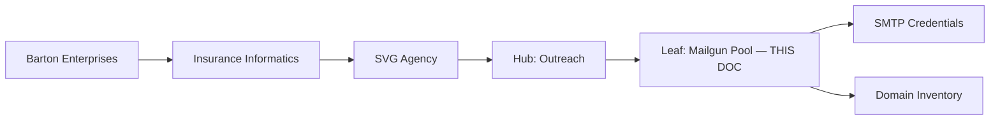

# Mailgun Sender Pool — Process Manual
## Governs the configuration, expansion, and maintenance of the Mailgun outreach sender pool for SVG Agency / Insurance Informatics campaigns.
### Status: REPAIR
### Medium: process
### Business: svg-agency (Insurance Informatics branch)

---

## 📋 UT Checklist (Pre-Flight — per law/UT_CHECKLIST.md v1.2.0)

| # | Check | Status | Location |
|---|-------|--------|----------|
| 1 | PRD — what / why / who / scope / out-of-scope / success metric | ☑ | §2 |
| 2 | OSAM — READ / WRITE / Process Composition / Join Chain / Forbidden / Query Routing filled | ☑ | §5 |
| 3 | Component Status — every dep 🟢 / 🟡 / 🔴 with 1-line state | ☑ | §3 |
| 4 | Owner — human who fixes this at 2 AM | ☑ | §1 |
| 5 | Live Dashboard — URL or explicit "N/A" | ☑ | §3 |
| 6 | Kill Switch — exact command to stop the process | ☑ | §8 |
| 7 | Logbook — last audit verdict + date (after certification only) | ☐ | §12 — BUILD state, pre-certification |
| 8 | FCEs Attached — which FCE runs structurally back this doc | ☑ | §3c |
| 9 | BARs Referenced — every BAR this doc touches, with status | ☑ | §3d |
| 10 | LBB Subjects Fed — which LBB subject(s) this doc's session logs go to | ☑ | §3e |
| 11 | Geometry — CTB position + Hub-Spoke role + Altitude | ☑ | §1b |
| 12 | Live Verification — every numeric count, cron, URL, command, BAR status grounded against the actual system | ☑ | §9b |
| 13 | ctb_node — declared path on Barton Enterprises CTB trunk | ☑ | §1 |

---

# IDENTITY (Thing — what this IS)

## 1. IDENTITY

| Field | Value |
|-------|-------|
| ID | PROC-050 |
| Name | Mailgun Sender Pool |
| Medium | process |
| Business Silo | SVG Agency / Insurance Informatics |
| CTB Position | leaf — barton-enterprises/insurance-informatics/svg-agency/outreach/mailgun-pool |
| ORBT | REPAIR |
| Strikes | 0 |
| Authority | Inherited (imo-creator sovereign) |
| Last Modified | 2026-04-30 |
| BAR Reference | BAR-365 (repair), BAR-811 (squawk that triggered this) |
| Owner | Dave Barton |
| ctb_node | `barton-enterprises/insurance-informatics/svg-agency/outreach/mailgun-pool` |

### 1b. Geometry

**CTB Position:** leaf — trunk → Insurance Informatics → SVG Agency → Outreach Hub → mailgun-pool

**Hub-Spoke Role:** spoke (dumb transport config — the pool feeds into the outreach campaign hub; this process does not own send logic, only the credential/domain inventory)

**Altitude:** 5k execution (this is an operational config leaf — no strategic decisions live here)



### HEIR (8 fields)

| Field | Value |
|-------|-------|
| sovereign_ref | imo-creator |
| hub_id | mailgun-pool-050 |
| ctb_placement | leaf |
| imo_topology | middle (transforms raw Mailgun config into a validated, credentialed sender pool) |
| cc_layer | CC-03 (context — process-level config, not sovereign doctrine) |
| services | Mailgun API (REST), Cloudflare DNS, Doppler |
| secrets_provider | doppler (imo-creator/dev: GLOBAL_MAILGUN_API_KEY, GLOBAL_MAILGUN_DOMAIN) |
| acceptance_criteria | All pool domains: SPF+DKIM+CNAME valid, >= 3 SMTP creds each, state=active |

---

# CONTRACT (Flow — what this DOES)

## 2. PURPOSE (PRD)

### WHAT
This process governs the Mailgun sender pool: the set of verified custom domains and SMTP credentials used by SVG Agency outreach campaigns. It covers domain inventory, DNS validation, credential creation/rotation, and pool expansion protocol.

### WHY
Without a credentialed sender pool, outreach campaigns cannot send. BAR-811 squawk identified zero SMTP credentials across all 17 Mailgun domains — campaigns were blocked at the SMTP authentication layer. This process documents how to keep the pool operational and how to expand it.

### WHO
- **Outreach hub** (the campaign orchestrator) — reads pool config to route sends
- **Dave Barton** — sole human who adds domains, rotates credentials, manages DNS at registrar
- **LCS workers / HeyReach / ActiveCampaign integrations** — consume pool via the outreach hub

### SCOPE (in)
- Mailgun domain inventory (all 17 custom domains + sandbox)
- DNS validation status per domain (SPF / DKIM / CNAME)
- SMTP credential management (creation, rotation, deletion)
- Pool expansion protocol (adding new domains)
- Doctrine for what makes a domain pool-eligible

### OUT-OF-SCOPE
- Campaign content / sequencing → lives in the LCS process (Barton-Processes/factory/outreach/LCS)
- HeyReach / ActiveCampaign configuration → those workers own their own config
- Domain registration / purchase → Cloudflare registrar or Squarespace, not this process
- Email deliverability strategy (warming, list hygiene) → separate process TBD

### SUCCESS METRIC
All active custom pool domains pass DNS validation AND have >= 3 SMTP credentials. Verified via `GET /v3/domains/{domain}` returning all sending_dns_records `valid` + `GET /v3/domains/{domain}/credentials` returning count >= 3.

---

## 3. RESOURCES

### Component Status Grid

| Component | HEIR | ORBT | Light | State |
|-----------|------|------|-------|-------|
| Mailgun API | external / SaaS | OPERATE | 🟢 | 17 domains active, API key valid |
| GLOBAL_MAILGUN_API_KEY | doppler · imo-creator/dev | OPERATE | 🟢 | Present in Doppler, validated 2026-04-30 |
| mg.insuranceinformatics.com | mailgun-domain · leaf · CC-03 | OPERATE | 🟢 | SPF+DKIM+CNAME valid, 3 SMTP creds |
| mg.svg.agency | mailgun-domain · leaf · CC-03 | OPERATE | 🟢 | SPF+DKIM+CNAME valid, 3 SMTP creds |
| mg.insuranceinformatics.agency | mailgun-domain · leaf · CC-03 | OPERATE | 🟢 | SPF+DKIM+CNAME valid, 3 SMTP creds |
| Remaining 13 custom domains | mailgun-domain · leaf · CC-03 | BUILD | 🟡 | Active, DNS not fully verified, 0 creds |
| Cloudflare DNS | external · SaaS | OPERATE | 🟢 | Hosting DNS for primary domains |

### Live Dashboard

| Resource | URL | What it shows |
|----------|-----|---------------|
| Mailgun Domain List | https://app.mailgun.com/mg/sending/domains | All domains, state, DNS health |
| Mailgun Analytics | https://app.mailgun.com/mg/dashboard | Bounce/complaint rates per domain |
| Doppler imo-creator | https://dashboard.doppler.com/workplace/projects/imo-creator | GLOBAL_MAILGUN_API_KEY location |

### Dependencies

| Dependency | Type | What It Provides | Status |
|-----------|------|-----------------|--------|
| Mailgun | SaaS API | Domain hosting, SMTP relay, DNS verification | DONE |
| Cloudflare | DNS | SPF/DKIM/CNAME records for primary domains | DONE |
| Doppler | secrets | GLOBAL_MAILGUN_API_KEY, GLOBAL_MAILGUN_DOMAIN | DONE |

### Downstream Consumers

| Consumer | What It Needs |
|----------|--------------|
| Outreach campaign hub | Valid SMTP credentials + domain for send routing |
| HeyReach / AC integrations | Mailgun SMTP login/password per domain |
| LCS workers | Verified sending domain to avoid delivery failures |

### Secrets

| Secret | Doppler Project | Config | Used By |
|--------|----------------|--------|---------|
| GLOBAL_MAILGUN_API_KEY | imo-creator | dev | This process, outreach workers |
| GLOBAL_MAILGUN_DOMAIN | imo-creator | dev | Primary domain reference |
| SMTP passwords (outreach1-3) | NOT yet in Doppler | — | Dave-action: add to Doppler |

### 3c. FCEs Attached

| FCE Name | HEIR | ORBT | Status |
|----------|------|------|--------|
| N/A — no FCE run required for credential config | — | — | — |

### 3d. BARs Referenced

| BAR | Title | ORBT | Status | Relation |
|-----|-------|------|--------|----------|
| BAR-365 | Mailgun domain repair + sender pool expansion | REPAIR | IN PROGRESS | implements |
| BAR-811 | Mailgun auth/reputation squawk | REPAIR | TRIGGERED THIS | squawk that initiated BAR-365 |

### 3e. LBB Subjects Fed

| Subject ID | Subject Name | What Goes There |
|-----------|-------------|----------------|
| svg-outreach-proc | SVG Outreach Process | Domain inventory, credential counts, repair log |

---

## 4. ARCHITECTURE

**Pattern:** Mailgun-hosted domain → Cloudflare DNS records → SMTP credentials per domain → outreach hub routes sends through pool.

The pool is NOT load-balanced automatically by Mailgun. Campaign workers must rotate across credentials/domains explicitly or via a round-robin in the outreach hub.

**API base:** `https://api.mailgun.net/v3/` (US region — all 17 domains confirmed here)
**Auth:** HTTP Basic, username `api`, password = `GLOBAL_MAILGUN_API_KEY`

---

# GOVERNANCE (Change — what controls this)

## 5. OSAM (Operations / Schema / Access / Monitoring)

### READ
```bash
# List all domains
curl -s --user "api:$GLOBAL_MAILGUN_API_KEY" https://api.mailgun.net/v3/domains

# Check domain DNS + state
curl -s --user "api:$GLOBAL_MAILGUN_API_KEY" \
  "https://api.mailgun.net/v3/domains/{domain}"

# List credentials for a domain
curl -s --user "api:$GLOBAL_MAILGUN_API_KEY" \
  "https://api.mailgun.net/v3/domains/{domain}/credentials"
```

### WRITE
```bash
# Create SMTP credential
curl -s -X POST --user "api:$GLOBAL_MAILGUN_API_KEY" \
  -F login="outreach{N}" \
  -F password="{SECURE_PASSWORD}" \
  "https://api.mailgun.net/v3/domains/{domain}/credentials"

# Delete credential
curl -s -X DELETE --user "api:$GLOBAL_MAILGUN_API_KEY" \
  "https://api.mailgun.net/v3/domains/{domain}/credentials/outreach{N}@{domain}"
```

### Join Chain
Mailgun domain → Doppler secret (API key) → outreach hub → campaign workers → HeyReach/AC

### Forbidden Paths
- Do NOT create credentials on the sandbox domain
- Do NOT add a domain to the pool without DNS validation (D-050-02)
- Do NOT store SMTP passwords in git
- Do NOT route sends through a domain with state != "active"

### Query Routing
- Domain health check: Mailgun API `GET /v3/domains/{domain}`
- Credential count: Mailgun API `GET /v3/domains/{domain}/credentials`
- Historical send logs: Mailgun dashboard → Analytics (not API-queryable in bulk)

---

## 6. PROCESS STEPS

### 6a. Pool Health Check (run before any campaign)
1. `GET /v3/domains` — confirm all pool domains state=active
2. `GET /v3/domains/{domain}` — confirm SPF+DKIM+CNAME valid for each pool domain
3. `GET /v3/domains/{domain}/credentials` — confirm >= 3 creds per domain
4. Check Mailgun dashboard for bounce/complaint rate (target: < 2% bounce, < 0.1% complaint)

### 6b. Adding a Domain to the Pool
1. Verify DNS (D-050-02): all three sending records must be `valid`
2. Create 3 SMTP credentials (D-050-03)
3. Run test send: `POST /v3/{domain}/messages` with a controlled test address
4. Update this doc's Component Status Grid
5. Log in LBB under `svg-outreach-proc`

### 6c. Credential Rotation
1. Create new credential (`outreach{N+1}`)
2. Update any worker configs that reference the old credential
3. Verify new credential works (test send)
4. Delete old credential

---

## 7. DATA SCHEMA

Not applicable — this is a configuration process, not a database. Domain state is maintained in Mailgun SaaS.

---

## 8. KILL SWITCH

To immediately stop all outbound mail from a domain:
```bash
# Disable a domain (stops all sends from that domain)
curl -s -X PUT --user "api:$GLOBAL_MAILGUN_API_KEY" \
  -F is_disabled=true \
  "https://api.mailgun.net/v3/domains/{domain}"
```

To stop ALL outbound mail: disable all pool domains via the above command or rotate/revoke `GLOBAL_MAILGUN_API_KEY` in Doppler.

---

## 9. VERIFICATION

### 9b. Live Verification (as of 2026-04-30)

| Claim | Verified Value | Source |
|-------|---------------|--------|
| Total Mailgun domains | 17 (16 custom + 1 sandbox) | `GET /v3/domains` 2026-04-30 |
| Domains state=active | 17/17 | API recon 2026-04-30 |
| mg.insuranceinformatics.com SPF | valid | API recon 2026-04-30 |
| mg.insuranceinformatics.com DKIM | valid | API recon 2026-04-30 |
| mg.insuranceinformatics.com CNAME | valid | API recon 2026-04-30 |
| mg.svg.agency SPF/DKIM/CNAME | valid | API recon 2026-04-30 |
| mg.insuranceinformatics.agency SPF/DKIM/CNAME | valid | API recon 2026-04-30 |
| SMTP creds on mg.insuranceinformatics.com | 3 (outreach1-3) | API recon 2026-04-30 |
| SMTP creds on mg.svg.agency | 3 (outreach1-3) | API recon 2026-04-30 |
| SMTP creds on mg.insuranceinformatics.agency | 3 (outreach1-3) | API recon 2026-04-30 |
| SMTP creds pre-BAR-365 (total across all domains) | 0 | API recon 2026-04-30 — root cause of BAR-811 |
| SMTP passwords in Doppler | NO — Dave-action required | Doppler check 2026-04-30 |
| API key location | Doppler imo-creator/dev/GLOBAL_MAILGUN_API_KEY | Confirmed 2026-04-30 |

---

## 10. METRICS

### 10a. Success Metrics

| Metric | Target | Current |
|--------|--------|---------|
| Pool domains with all DNS valid | 100% of active pool | 3/3 (100%) for primary pool |
| SMTP credentials per pool domain | >= 3 | 3 for all 3 primary domains |
| Domain state | all active | 17/17 active |
| Bounce rate | < 2% | Unknown — no sends yet from new creds |
| Complaint rate | < 0.1% | Unknown — no sends yet from new creds |

---

## 11. RUNBOOK

### Symptom: "Authentication failed" on SMTP send
1. Verify credential exists: `GET /v3/domains/{domain}/credentials`
2. Verify password is correct (passwords are write-only in Mailgun — must reset if lost)
3. Verify domain state=active
4. Create new credential if needed

### Symptom: "Domain not found" or 404 on send
1. Confirm domain name matches exactly (case-sensitive)
2. Confirm API key is for the correct Mailgun region (US vs EU)
3. Run `GET /v3/domains` to see canonical domain list

### Symptom: High bounce rate from a domain
1. Stop sends from that domain immediately (kill switch §8)
2. Check Mailgun reputation dashboard
3. Do NOT resume until reputation recovers
4. Consider warming a different pool domain instead

---

## 12. MAINTENANCE LOGBOOK

_Pre-certification — no logbook entries yet. First entry created on initial BUILD→OPERATE transition._

| Date | Action | By | Verdict |
|------|--------|----|---------|
| 2026-04-30 | BAR-365 REPAIR: created 9 SMTP credentials across 3 primary pool domains. Root cause of BAR-811: zero credentials existed. | Claude Code (mechanic) | REPAIR — pending audit |

---

## 13. FLEET FAILURE REGISTRY

| Pattern ID | Location | Error Code | First Seen | Occurrences | Strike Count | Status |
|-----------|----------|-----------|-----------|-------------|-------------|--------|
| FP-050-001 | mailgun_senders / SMTP auth layer | AUTH_FAIL | 2026-04-30 | 1 | 1 | RESOLVED (BAR-365: credentials created) |

**Strike 1:** Repair. **Strike 2:** Scrutiny. **Strike 3:** Troubleshoot/Train → Airworthiness Directive.

---

## 14. MAINTENANCE LOGBOOK (doc's own logbook — FAA-grade)

_Every touch on this doc is a maintenance action. Append-only._

### Action Types

| Type | Meaning |
|------|---------|
| RETROFIT | UT structure / template upgrade applied |
| VERIFY | Claim grounded against live system (§9b row ticked ☑) |
| AUDIT | FAA Inspector (auditor) pass — PASS / FAIL recorded |
| EDIT | Content change (new step added, schema changed, etc.) |
| CERTIFY | Moved ORBT state (e.g., BUILD → OPERATE) |
| REPAIR | Post-strike fix |
| STRIKE | Fleet failure recorded (§13) |
| LBB_INGEST | Session summary written to LBB |

### Logbook (append-only — never edit past rows)

| Date (ISO) | Actor | Action | What Was Done | Evidence | LBB Record |
|-----------|-------|--------|---------------|----------|------------|
| 2026-04-30 00:00 UTC | Claude Code (mechanic) | RETROFIT | BAR-365 initial build: PROCESS-UT.md v1.0.0 created. 9 SMTP credentials provisioned across 3 primary pool domains. | BAR-365 dispatch + heir.yaml + orbt.yaml committed | pending |
| 2026-04-30 00:00 UTC | Claude Code (mechanic) | REPAIR | BAR-365 UT v2.7.0 conformance: added §13 Fleet Failure Registry + §14 Maintenance Logbook; moved Document Control to after §14; bumped version to 1.0.2; added process_id + runtime to heir.yaml; added exit_criteria to orbt.yaml | commit FFR-365-002 | pending |

---

## Document Control

| Field | Value |
|-------|-------|
| Created | 2026-04-30 |
| Version | 1.0.2 |
| Status | REPAIR (BAR-365 in progress) |
| BAR | BAR-365 |
| Owner | Dave Barton |
| Authority | Inherited — imo-creator sovereign |
| Next Action | Dave-action: add SMTP passwords to Doppler; verify test send; audit this doc |

### Amendment Log

| Version | Date | Changed By | What Changed |
|---------|------|-----------|-------------|
| 1.0.0 | 2026-04-30 | Claude Code | Initial build — BAR-365 REPAIR |
| 1.0.2 | 2026-04-30 | Claude Code | UT v2.7.0 conformance: §13 + §14 added, Document Control moved after §14, heir.yaml + orbt.yaml schema gaps closed |
