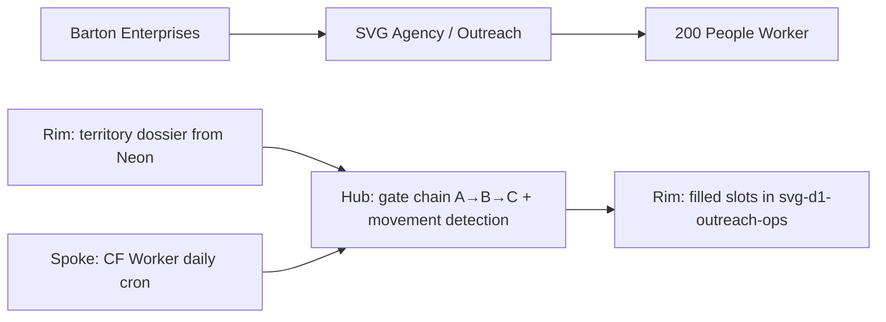
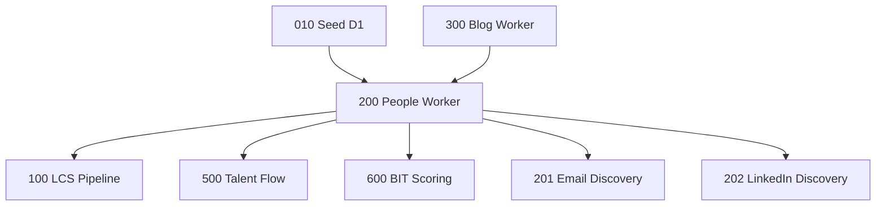

# 200 People Worker
## Monthly dumb worker that fills CEO/CFO/HR slots for every company in the territory and detects personnel movement — the gateway to the entire outreach pipeline.
### Status: REPAIR
### Medium: process
### Business: svg-agency

## UT Checklist (Pre-Flight - per law/UT_CHECKLIST.md v1.2.0)

| # | Check | Status | Location |
|---|-------|--------|----------|
| 1 | PRD - what / why / who / scope / out-of-scope / success metric | [x] | §2 |
| 2 | OSAM - READ / WRITE / Process Composition / Join Chain / Forbidden Paths / Query Routing filled | [x] | §5 |
| 3 | Component Status - every dep has green / yellow / red with 1-line state | [x] | §3 |
| 4 | Owner - human who fixes this at 2 AM | [x] | §1 |
| 5 | Live Dashboard - URL or explicit "N/A" | [x] | §3 |
| 6 | Kill Switch - exact command to stop the process | [x] | §8 |
| 7 | Logbook - last audit verdict + date (after certification only) | [ ] | §12 — BUILD, no logbook yet |
| 8 | FCEs Attached - which FCE runs structurally back this doc | [ ] | §3c — TBV |
| 9 | BARs Referenced - every BAR this doc touches, with status | [x] | §3d |
| 10 | LBB Subjects Fed - which LBB subject(s) this doc's session logs go to | [x] | §3e |
| 11 | Geometry - CTB position + Hub-Spoke role + Altitude | [x] | §1b |
| 12 | Live Verification - every numeric count, cron, URL, command, BAR status grounded against the live system | [x] | §9b |
| 13 | ctb_node - declared path on the Barton Enterprises CTB trunk | [x] | §1 Identity |

## §1 IDENTITY {#sec-1-identity}

| Field | Value |
|-------|-------|
| ID | PROC-200 |
| Name | People Worker |
| Medium | process |
| Business Silo | svg-agency |
| CTB Position | barton-enterprises → svg-agency → outreach → 200-people-worker (LEAF) |
| ORBT | REPAIR |
| Strikes | 1 |
| Authority | Inherited from imo-creator-v2 (sovereign) + Barton-Processes (parent) |
| Last Modified | 2026-04-29 |
| BAR Reference | BAR-52 |
| Owner | Dave Barton |
| ctb_node | barton-enterprises/svg-agency/outreach/200-people-worker |

### 1b. Geometry {#sec-1b-geometry}

**CTB Position:** barton-enterprises → svg-agency → outreach → 200-people-worker (LEAF)

**Hub-Spoke Role:** Spoke — dumb transport worker. Ingests company territory, fills CEO/CFO/HR contact slots via well-drinks-first gate chain, and writes to svg-d1-outreach-ops. No hub logic. All enrichment logic lives in the sub-hub tools (16-fetcher, 17-parser-registry, 20-cache-layer, 21-dedup-engine, 23-rate-limiter).

**Altitude:** 5k execution — leaf-level process operating on individual slot rows.



### HEIR (8 fields - Aviation Model, Bedrock §8)

| Field | Value |
|-------|-------|
| sovereign_ref | imo-creator-v2 |
| hub_id | PROC-PEOPLE |
| ctb_placement | leaf |
| imo_topology | spoke |
| cc_layer | CC-04 |
| services | CF Worker (daily cron), D1_OUTREACH (svg-d1-outreach-ops), D1_SPINE (svg-d1-spine), Doppler secrets |
| secrets_provider | doppler |
| acceptance_criteria | At least one reachable slot before company enters LCS; well drinks exhausted before top shelf; every data point tagged with source_tool + timestamp; monthly snapshot compared to previous month; binary movement gate per slot; DOL-linked companies prioritized; errors write to master error table; wide schema — collect everything |

## §2 PURPOSE {#sec-2-purpose}

### WHAT
Monthly CF Worker that fills CEO, CFO, and HR contact slots for every agent-assigned company in the territory (32,704 companies → 43,209+ slots). Runs a four-pass well-drinks-first gate chain: promote staging → scrape about/team pages → Startpage search via proxy → movement detection. Produces reachability status per company (UNREACHABLE, EMAIL_ONLY, LINKEDIN_ONLY, FULL).

### WHY
Without filled slots, nothing downstream works. Process 100 (LCS Pipeline) cannot construct SIDs, Process 500 (Talent Flow) has no movement signals, Process 600 (BIT Scoring) has no people score component, and Process 700 (Campaign Engine) cannot send personalized outreach. This is the gateway process — a dead slot is dead revenue.

### WHO
Dave Barton (operator); outreach agents (consumers of reachability status); Process 100, 500, 600, 700 (downstream system consumers); Dave (reads this doc for session context).

### SCOPE (in)
- Fill person_first_name, person_last_name, person_full_name in people_people_master
- Fill CEO, CFO, HR slot records in people_company_slot
- Detect monthly movement (0/1 binary per slot)
- Tag every data point with source_tool + timestamp
- Produce reachability status per company
- Write errors to master error table

### OUT-OF-SCOPE
- Email discovery (Process 201 owns person_email)
- LinkedIn URL discovery beyond incidental Gate C captures (Process 202 owns systematic LinkedIn)
- Company data writes (Process 300/400 own outreach_blog and outreach_dol)
- Neon queries during WORK phase (vault is read-only until PUSH)
- AI-based name matching (deterministic only)

### SUCCESS METRIC
At least 60% slot fill rate maintained across the territory with every filled slot tagged with source_tool and every company assigned a reachability status by end of monthly cycle.

## §3 RESOURCES {#sec-3-resources}

Required doctrine references for every process UT:

- `law/UNIFIED_TEMPLATE.md`
- `law/UT_CHECKLIST.md`
- `law/doctrine/PROCESS_FILL_INSTRUCTIONS.md`
- `law/doctrine/HOW_TO_BUILD_ANYTHING.md` (repair manual)
- `law/doctrine/BARTON_ENTERPRISES_WORLD_ATLAS.md` (Atlas System bundle)
- `law/doctrine/KEY.md`

### Component Status Grid

| Component | HEIR (`hub_id · ctb · cc_layer`) | ORBT | Light | State |
|-----------|----------------------------------|------|-------|-------|
| CF Worker (people-worker-200) | PROC-PEOPLE · leaf · CC-04 | REPAIR | yellow | Deployed; Strike 1 active (FP-200-01: spurious person_email_verified flag) |
| svg-d1-outreach-ops (D1_OUTREACH) | TBV · branch · CC-03 | OPERATE | green | Live; 43,209 slot rows |
| svg-d1-spine (D1_SPINE) | TBV · branch · CC-03 | OPERATE | green | Read-only; canonical company identity |
| DataImpulse Proxy | TBV · leaf · CC-04 | OPERATE | green | Sticky session, US targeting, POST form method proven |
| Startpage Search | TBV · leaf · CC-04 | OPERATE | green | Pass 2 tool; CAPTCHA-resistant via DataImpulse POST |
| Doppler (imo-creator/dev) | TBV · branch · CC-02 | OPERATE | green | PROXY_USER, PROXY_PASS, NEON_URL active |
| MillionVerifier (MV) | TBV · leaf · CC-04 | OPERATE | yellow | Used for email verification; Strike 1: flag set spuriously (FP-200-01) |

### Live Dashboard

| Resource | URL | What it shows |
|----------|-----|---------------|
| Worker health | https://people-worker-200.svg-outreach.workers.dev/health | status ok, company count, slot fill metrics |
| D1 slot counts | wrangler d1 execute svg-d1-outreach-ops --remote --command "SELECT COUNT(*) FROM people_company_slot" | Live slot row count |
| Contradicted-flag gauge | wrangler d1 execute svg-d1-outreach-ops --remote --command "SELECT COUNT(*) FROM slot_workbench WHERE person_email_verified=1 AND has_verified_email=0" | FP-200-01 gauge — expected 0 |

### Dependencies

| Dependency | Type | What It Provides | Status |
|-----------|------|-----------------|--------|
| svg-d1-outreach-ops | D1 database | People slots, people master, staging, company targeting, DOL, blog | DONE |
| svg-d1-spine | D1 database | cl_company_identity (canonical name, domain, LinkedIn) — READ ONLY | DONE |
| intake_people_staging | D1 table (in D1_OUTREACH) | Pre-discovered people for Pass 0 promotion (24,727 records) | DONE |
| DataImpulse proxy | External service | Residential IP rotation for Pass 2 Startpage queries | ACTIVE |
| Doppler | Secrets provider | PROXY_USER, PROXY_PASS, NEON_URL | ACTIVE |
| Process 010 (SEED) | Upstream process | Companies, slots seeded into D1 workspace | DONE |
| Process 300 (Blog/Recon) | Upstream process | recon_name_titles, recon_organized_people in slot_workbench | DONE |

### Downstream Consumers

| Consumer | What It Needs |
|----------|--------------|
| Process 100 (LCS Pipeline) | Reachable slots (is_filled=1, reachability != UNREACHABLE) for SID construction |
| Process 500 (Talent Flow) | Movement signals (0/1 per slot) for monthly diff |
| Process 600 (BIT Scoring) | People score component from filled slots |
| Process 700 (Campaign Engine) | Slots with readiness_tier = REACHABLE for outreach |
| Process 201 (Email Discovery) | Slots with has_name=1 AND has_email=0 |
| Process 202 (LinkedIn Discovery) | Slots with has_name=1 AND has_linkedin=0 |

### Tools & Integrations

| Item | Type | Cost Tier | Credentials | What It Does |
|------|------|-----------|-------------|-------------|
| CF Worker (daily cron) | Compute | Free | Cloudflare auth | Runs gate chain, writes to D1 |
| DataImpulse | Proxy API | Cheap | PROXY_USER, PROXY_PASS (Doppler) | Residential IP for Pass 2 Startpage queries |
| Startpage | Search engine | Free (proxy cost only) | None | Pass 2 natural language search for names |
| MillionVerifier | Email verification | Top Shelf (surgical) | TBV (Doppler) | Verifies email addresses after discovery |
| Hunter | Enrichment API | Top Shelf (surgical) | TBV (Doppler) | Name + email enrichment when free gates exhausted |
| Apollo | Enrichment API | Top Shelf (surgical) | TBV (Doppler) | Backup to Hunter on top-shelf tier |
| MXLookup | CF fetch tool | Well Drink (free) | None | MX record check per domain |
| SMTPCheck | CF fetch tool | Well Drink (free) | None | SMTP validation per email |
| LinkedInCheck | CF fetch tool | Well Drink (free) | None | LinkedIn head-only check |

### Secrets

| Secret | Doppler Project | Config | Used By |
|--------|----------------|--------|---------|
| PROXY_USER | imo-creator | dev | Pass 2 — DataImpulse proxy |
| PROXY_PASS | imo-creator | dev | Pass 2 — DataImpulse proxy |
| NEON_URL | imo-creator | dev | SEED and PUSH phases only |

### 3c. FCEs Attached

| FCE Name | HEIR (`hub_id · ctb · cc_layer`) | ORBT | Run Directory | Latest P=1 | Rows | Status |
|----------|----------------------------------|------|--------------|------------|------|--------|
| TBV | TBV | TBV | TBV | TBV | TBV | TBV |

### 3d. BARs Referenced

| BAR | Title | HEIR (`bar-id · ctb · cc_layer`) | ORBT | Status | Relation |
|-----|-------|----------------------------------|------|--------|----------|
| BAR-52 | Data refresh / full monthly cycle | TBV | In Progress | Open | implements |
| BAR-197 | Data gap — 29K empty slots, 69K about_urls never scraped | TBV | BUILD | Open | tracks |

### 3e. LBB Subjects Fed

| LBB Subject | HEIR (`subject-id · ctb · cc_layer`) | ORBT | What This Doc Writes | Frequency |
|-------------|--------------------------------------|------|---------------------|-----------|
| svg-outreach-proc | TBV | BUILD | Session summaries, fill-rate data, gate performance | Per-run |
| processes | TBV | BUILD | Cross-cutting process learnings | On-change |

## §4 IMO - Input, Middle, Output {#sec-4-imo}

### Two-Question Intake (Bedrock §3)
1. What triggers this? Daily cron at 6am UTC (`0 6 * * *`). Day 1 runs SEED. Days 1-28 run batches. Day 28+ runs PUSH.
2. How do we get it? Territory dossier seeded from Neon into D1 on Day 1. Daily batches read from svg-d1-outreach-ops and execute gate chain.

### Input
Territory: 32,704 agent-assigned companies × 3 slots each = 98,112 slot records in svg-d1-outreach-ops. Trigger: daily cron. Source: D1_OUTREACH (primary), D1_SPINE (read-only company names), intake_people_staging (24,727 pre-discovered records for Pass 0).

### Middle

| Step | Input | What Happens | Output | Tool Used |
|------|-------|-------------|--------|-----------|
| Pass 0: Promote Staging | intake_people_staging records (status='pending') | Match staging entries to people_title_slot_mapping deterministically; create people_people_master record; update people_company_slot is_filled=1 | Filled slots from pre-staged data | D1 exec (FREE) |
| Pass 1: Scrape About Pages | outreach_blog.about_url for companies with empty slots | CF Worker fetch team/about pages, parse executive names, match to slot_type via people_title_slot_mapping | Filled slots from page scraping | CF fetch (FREE) |
| Pass 2: Startpage Search | Empty slots after Pass 0+1 + cl_company_identity.canonical_name + city/state | Build NL query, POST to Startpage via DataImpulse proxy, parse names, tag source | Filled slots from search (CHEAP) | DataImpulse + Startpage |
| Pass 3: Movement Detection | Monthly snapshot vs baseline (people_company_slot + baseline table) | Slot-by-slot snapshot diff; binary 0/1 per slot; write signals JOINED/LEFT/REPLACED/TITLE_CHANGED/EMAIL_CHANGED | Movement signals in D1 | D1 exec (FREE) |
| PUSH (Day 28+) | All verified D1 results | Promote from D1 → Neon vault; sync outreach D1 (svg-d1-outreach-ops) for LCS access | Neon vault updated, outreach D1 current | Neon via Hyperdrive |

### Output
Filled CEO/CFO/HR slots with: person name, source_tool tag, timestamp. Reachability status per company (UNREACHABLE / EMAIL_ONLY / LINKEDIN_ONLY / FULL). Movement signals per slot (0/1). Errors in D1 errors table.

### Circle (Bedrock §5)
Each month's snapshot becomes next month's baseline. Movement trends accumulate in Process 500 (Talent Flow). Companies that were UNREACHABLE become reachable as slots fill. BIT scores (Process 600) improve with people data. LCS pipeline (Process 100) sends outreach to newly reachable contacts. Responses feed back to slot status. If a person leaves, slot clears and process re-runs.

## §5 DATA SCHEMA {#sec-5-data-schema}

### READ Access

| Source | What It Provides | Join Key |
|--------|-----------------|----------|
| people_company_slot (D1_OUTREACH) | Slot state, slot_type, is_filled, person_unique_id | outreach_id |
| people_people_master (D1_OUTREACH) | Contact details: name, email, LinkedIn, source_tool | unique_id ← slot.person_unique_id |
| outreach_company_target (D1_OUTREACH) | City, state, industry, employees, agent assignment | outreach_id |
| outreach_blog (D1_OUTREACH) | about_url for team page scraping | outreach_id |
| outreach_dol (D1_OUTREACH) | filing_present (DOL trust signal) | outreach_id |
| dol_form_5500 (D1_OUTREACH) | sponsor_dfe_name (legal company name) | outreach_id |
| intake_people_staging (D1_OUTREACH) | Pre-discovered people for Pass 0 promotion | company_unique_id |
| people_title_slot_mapping (D1_OUTREACH) | Title pattern → slot_type (deterministic lookup) | n/a (lookup table) |
| cl_company_identity (D1_SPINE) | canonical_name, company_domain, linkedin_company_url | outreach_id |
| slot_workbench (D1_OUTREACH) | Consolidated slot view with recon_organized_people, hunter data, readiness_tier | outreach_id |

### WRITE Access

| Target | What It Writes | When |
|--------|---------------|------|
| people_people_master | INSERT new contacts, UPDATE existing (name, source_tool, timestamp) | Pass 0, 1, 2 |
| people_company_slot | UPDATE is_filled, person_unique_id, filled_at | Pass 0, 1, 2 |
| intake_people_staging | UPDATE status = 'promoted' | Pass 0 only |
| errors (D1) | Error details per fetch attempt | Any failure |

### Process Composition



| Process ID | Name | Role in Composition | Status |
|-----------|------|---------------------|--------|
| PROC-010 | Seed D1 | upstream feeder — seeds companies + slots into D1 | green |
| PROC-300 | Blog Worker | upstream feeder — populates recon_organized_people in slot_workbench | green |
| PROC-200 | People Worker | this | yellow (REPAIR) |
| PROC-100 | LCS Pipeline | downstream consumer — reads filled slots for SID construction | green |
| PROC-500 | Talent Flow | downstream consumer — reads movement signals | green |
| PROC-600 | BIT Scoring | downstream consumer — reads people score component | green |
| PROC-201 | Email Discovery | downstream consumer — reads has_name=1 slots | green |
| PROC-202 | LinkedIn Discovery | downstream consumer — reads has_name=1 slots | green |

### Join Chain

```text
slot_workbench.outreach_id (spine join key)
  → people_company_slot.outreach_id (slot state)
    → people_people_master.unique_id (contact details, via slot.person_unique_id)
  → outreach_company_target.outreach_id (city, state, employees)
  → outreach_blog.outreach_id (about_url for scraping)
  → outreach_dol.outreach_id (DOL filing trust signal)
  → cl_company_identity.outreach_id [D1_SPINE, READ ONLY] (canonical_name, domain)
  → dol_form_5500.outreach_id (sponsor_dfe_name — legal name)
```

### Forbidden Paths

| Action | Why |
|--------|-----|
| WRITE to cl_company_identity | CL is authority — read only; D-200-09 |
| WRITE to outreach_company_target | Targeting data — Process 200 does not own; D-200-09 |
| WRITE to outreach_blog | Blog Worker (300) owns this; D-200-09 |
| WRITE to outreach_dol | DOL Views (400) owns this; D-200-09 |
| WRITE to D1_SPINE | Spine is read-only for all outreach processes; D-200-09 |
| Query Neon during WORK phase | Vault only — SEED phase and PUSH phase only; D-200-10 |
| Skip gate order (Pass 0→1→2) | Well drinks before top shelf — gate order is a constant; D-200-02 |
| Write person_email from this process | Process 201 owns email discovery; D-200-11 |
| Enter LCS with UNREACHABLE status | Reachability gate must pass first; D-200-04 |

### Query Routing

| Question | Table | Column |
|----------|-------|--------|
| Which slots need filling? | people_company_slot | WHERE is_filled = 0 |
| What's the company's canonical name? | cl_company_identity (D1_SPINE) | canonical_name |
| Is this company DOL-linked? | outreach_dol | filing_present |
| Does company have a team page? | outreach_blog | about_url |
| Which slot type does this title map to? | people_title_slot_mapping | title_pattern → slot_type |
| What pre-staged people exist? | intake_people_staging | WHERE status = 'pending' |
| What's the company's location? | outreach_company_target | city, state |
| Where did a person record come from? | people_people_master | source_tool |
| Did a slot move this month? | people_company_slot vs baseline | diff on slot state columns |
| Contradicted email-verified flags? | slot_workbench | WHERE person_email_verified=1 AND has_verified_email=0 |

## §6 DMJ - Define, Map, Join {#sec-6-dmj}

### 6a. DEFINE (Build the Key)

| Element | ID | Format | Description | C or V |
|---------|-----|--------|-------------|--------|
| slot_workbench row | DMJ-01 | D1 row, 50+ columns | One slot per company per role (CEO/CFO/HR) | C (structure) |
| slot_type | DMJ-02 | TEXT, enum: CEO/CFO/HR | Which of the three fixed roles this slot represents | C (structure) |
| outreach_id | DMJ-03 | TEXT, UUID | Spine join key — present on every slot row | C (structure) |
| person_first_name | DMJ-04 | TEXT, title case, 1-30 chars | Person's first name | V (fill) |
| person_last_name | DMJ-05 | TEXT, title case, 1-30 chars | Person's last name | V (fill) |
| person_source | DMJ-06 | TEXT, enum: recon_300/hunter/dol/vendor/startpage_v3 | Provenance tag — which gate filled this slot | C (provenance) |
| readiness_tier | DMJ-07 | TEXT, enum: FULL/REACHABLE/PATTERN_READY/NAME_ONLY/EMPTY/HUNTER_READY | Completeness state of the slot | V (state) |
| movement_flag | DMJ-08 | INTEGER, 0 or 1 | Binary movement detection per slot per month | V (monthly diff) |
| reachability_status | DMJ-09 | TEXT, enum: UNREACHABLE/EMAIL_ONLY/LINKEDIN_ONLY/FULL | Whether company can enter LCS pipeline | V (derived) |
| source_tool | DMJ-10 | TEXT + timestamp | Tagged provenance for every data point | C (provenance format) |

### 6b. MAP (Connect Key to Structure)

| Source | Target | Transform |
|--------|--------|-----------|
| intake_people_staging (Pass 0) | people_first_name + people_last_name | Direct; mark status='promoted' |
| outreach_blog.about_url page parse (Pass 1) | person_first_name + person_last_name + slot_type | Parse executive names; match to slot via people_title_slot_mapping |
| Startpage search result (Pass 2) | person_first_name + person_last_name + optional person_linkedin | NL parse; title case |
| people_title_slot_mapping | slot_type | Title pattern → CEO/CFO/HR (deterministic lookup) |
| current snapshot vs baseline | movement_flag (0/1) + signal type | Slot-by-slot diff: JOINED/LEFT/REPLACED/TITLE_CHANGED/EMAIL_CHANGED |
| slot fill status + reachability check | reachability_status | UNREACHABLE if no verified contact; EMAIL_ONLY/LINKEDIN_ONLY/FULL based on what's filled |

### 6c. JOIN (Path to Spine)

| Join Path | Type | Description |
|-----------|------|-------------|
| slot_workbench.outreach_id → cl_company_identity.outreach_id | Direct | One hop. The spine key lives on every slot row. |
| people_company_slot.person_unique_id → people_people_master.unique_id | Direct | One hop. Slot points to contact record. |
| intake_people_staging.company_unique_id → people_company_slot.company_unique_id | Direct | Pass 0 join for staging promotion. |

## §7 CONSTANTS & VARIABLES {#sec-7-constants-variables}

### Constants (structure - never changes)

- 3 slot types: CEO, CFO, HR — always these three, always in this order (D-200-01)
- Gate chain order: Pass 0 → Pass 1 → Pass 2 (well drinks before top shelf) — skipping is a HALT (D-200-02)
- Source trust hierarchy: DOL-linked > Hunter > Clay (D-200-03)
- Enrichment priority: DOL-linked + movement + empty slots first (D-200-06)
- Reachability gate: UNREACHABLE companies cannot enter LCS (D-200-04)
- Binary movement detection: deterministic, monthly diff, 0 or 1 only (D-200-07)
- Wide schema rule: collect all data points, tag source_tool + timestamp on every point (D-200-08)
- Process 200 writes NAME only — never person_email; that is Process 201's job (D-200-11)
- D1_SPINE is read-only for all outreach processes (D-200-09)
- Neon is vault only — no queries during WORK phase (D-200-10)
- Minimum 1 reachable slot before company enters LCS (D-200-04)
- Monthly snapshot becomes next month's baseline (Circle constant) (D-200-12)

### Variables (fill - changes every run/cycle)

- Person names (first, last) per slot — empty until gate succeeds
- person_source (which gate filled this slot — changes per fill)
- readiness_tier (changes as slots fill)
- movement_flag (0 or 1 — recomputed monthly)
- reachability_status (derived from slot state — changes as slots fill)
- Gate A fill rate, Gate B fill rate, Gate C fill rate (metrics per run)
- CAPTCHA rate (Gate C/Pass 2 quality signal)
- Slot fill count, error count (per batch)
- Tolerance values k_i (calibrated through operation)

## §8 STOP CONDITIONS {#sec-8-stop-conditions}

| Condition | Action |
|-----------|--------|
| Can't answer two-question intake | HALT — process is undefined |
| OSAM question cannot be routed | HALT — semantic gap, ask human |
| UNREACHABLE company queued for LCS | HALT — reachability gate violation (D-200-04) |
| Budget cap reached on top-shelf tool (Hunter/Apollo/MV) | HALT — do not proceed |
| CAPTCHA > 10% of Pass 2 searches | HALT — rotate proxy port, check DataImpulse credentials, wait and retry |
| Error rate > 5% of total processed in a batch | HALT — check D1 connectivity, wrangler auth |
| Pass 0 → Pass 1 → Pass 2 gate order skipped | HALT — gate skip is a process violation (D-200-02) |
| person_email written by this process | HALT — that is Process 201's job (D-200-11) |
| person_email_verified=1 where has_verified_email=0 count > 0 | INVESTIGATE — FP-200-01 active (spurious MV flag) |
| Fill rate plateaus for 3 consecutive runs | INVESTIGATE — recon stale, Hunter exhausted, or query patterns need refinement |
| Strike 3 on same failure pattern | Troubleshoot/Train → Airworthiness Directive |

### Kill Switch

```text
# Stop the CF Worker cron (Cloudflare dashboard) or:
wrangler cron triggers delete --name people-worker-200 --cron "0 6 * * *"
# Or deploy with empty [triggers] block to disable cron execution.
# For immediate batch halt, deploy a worker version that returns 200 with no-op on POST /batch.
```

## §9 VERIFICATION {#sec-9-verification}

```text
1. GET https://people-worker-200.svg-outreach.workers.dev/health
   -> Expected: {"status":"ok", "companies": >0, "slots": >0}

2. SELECT COUNT(*) FROM people_company_slot WHERE is_filled = 1
   -> Expected: > 0 (slots filled)

3. SELECT COUNT(*) FROM people_company_slot WHERE is_filled = 0
   -> Expected: decreasing month over month

4. SELECT COUNT(*) FROM errors WHERE created_at > date('now','-1 day')
   -> Expected: low relative to BATCH_SIZE (100)

5. SELECT person_source, COUNT(*) FROM people_people_master GROUP BY person_source
   -> Expected: recon_300 and/or staging should be largest source (free gates used first)

6. SELECT COUNT(*) FROM slot_workbench WHERE person_email_verified=1 AND has_verified_email=0
   -> Expected: 0 (FP-200-01 — contradicted flags must be 0)
```

### Three Primitives Check (Bedrock §1)
1. Thing - Do slot records exist in people_company_slot? Does intake_people_staging have pending records?
2. Flow - Does the daily cron fire? Does the gate chain execute Pass 0 → Pass 1 → Pass 2 in order?
3. Change - Is is_filled set to 1? Is source_tool tagged? Is readiness_tier updated? Are movement signals written?

## 9b. Live Verification Log {#sec-9b-live-verification}

| Claim | Section | Source of Truth | Verification Command | [ ] | Last Check | Value |
|-------|---------|-----------------|----------------------|-----|-----------|-------|
| CF Worker deployed and healthy | §1 | Worker health endpoint | `curl https://people-worker-200.svg-outreach.workers.dev/health` | [ ] | TBV | TBV |
| people_company_slot row count ~43K | §2, §5 | svg-d1-outreach-ops | `wrangler d1 execute svg-d1-outreach-ops --remote --command "SELECT COUNT(*) FROM people_company_slot"` | [ ] | 2026-03-24 | 43,209 |
| Slot fill rate (is_filled=1) | §10 | svg-d1-outreach-ops | `wrangler d1 execute svg-d1-outreach-ops --remote --command "SELECT COUNT(*) FROM people_company_slot WHERE is_filled=1"` | [ ] | TBV | TBV |
| No contradicted email-verified flags (FP-200-01 gauge) | §13 | svg-d1-outreach-ops / slot_workbench | `wrangler d1 execute svg-d1-outreach-ops --remote --command "SELECT COUNT(*) FROM slot_workbench WHERE person_email_verified=1 AND has_verified_email=0"` | [ ] | TBV | expected 0 |
| Cron registered at 0 6 * * * | §4 | Cloudflare dashboard / wrangler.toml | `wrangler triggers list --name people-worker-200` | [ ] | TBV | TBV |
| Proxy hit rate 87-95% on LinkedIn | §2 | PROCESS.md session log | Manual batch test + grep snapshots | [ ] | 2026-03-19 | 87-95% |
| intake_people_staging pending count | §5 | svg-d1-outreach-ops | `wrangler d1 execute svg-d1-outreach-ops --remote --command "SELECT COUNT(*) FROM intake_people_staging WHERE status='pending'"` | [ ] | TBV | TBV |
| DOL records in D1 | §5 | PROCESS.md (MANIFEST) | `wrangler d1 execute svg-d1-outreach-ops --remote --command "SELECT COUNT(*) FROM outreach_dol WHERE filing_present=1"` | [ ] | 2026-03-24 | ~27,464 |
| 356-row quarantine from process 100 REPAIR | §13 | svg-d1-outreach-ops slot_workbench | `wrangler d1 execute svg-d1-outreach-ops --remote --command "SELECT COUNT(*) FROM slot_workbench WHERE person_email_verified=1 AND has_verified_email=0"` | [ ] | 2026-04-28 | TBV (investigate FP-200-01) |

## §10 Operations / Schedule {#sec-10-operations}

**Cron classification:** RECURRING-daily
**Decision date:** 2026-05-08
**Decision authority:** Sovereign (Dave Barton, BAR-MONDAY-16-FLEET-GREEN)

**Schedule:** `0 6 * * *` (daily 6am UTC / 2am ET)
**Implementation:** CF Worker cron
**Trigger source (if event-driven):** N/A

---

## §10 ANALYTICS {#sec-10-analytics}

### 10a. Metrics

| Metric | Unit | Baseline | Target | Tolerance |
|--------|------|----------|--------|-----------|
| Overall slot fill rate | % | TBV | ≥ 60% | < 60% = REPAIR |
| Pass 0 (staging promote) fill rate | % | TBV | BASELINE | set after first run |
| Pass 1 (about page scrape) fill rate | % | TBV | BASELINE | set after first run |
| Pass 2 (Startpage search) fill rate | % | TBV | BASELINE | set after first run |
| CAPTCHA rate (Pass 2) | % | TBV | < 10% | > 10% = HALT |
| LinkedIn capture rate (incidental) | % | TBV | BASELINE | set after first run |
| Error rate per batch | % | TBV | < 5% | > 5% = HALT |
| Contradicted email-verified flag count | count | 0 | 0 | > 0 = INVESTIGATE FP-200-01 |

### 10b. Sigma Tracking

| Metric | Run 1 | Run 2 | Run 3 | Trend | Action |
|--------|-------|-------|-------|-------|--------|
| Overall fill rate | TBV | TBV | TBV | TBV | TBV |
| Pass 0 fill rate | TBV | TBV | TBV | TBV | TBV |
| Pass 2 CAPTCHA rate | TBV | TBV | TBV | TBV | TBV |
| Error rate | TBV | TBV | TBV | TBV | TBV |

### 10c. ORBT Gate Rules

| From | To | Gate |
|------|-----|------|
| BUILD | OPERATE | All metrics within tolerance for 3 runs + auditor sign-off |
| OPERATE | REPAIR | Any metric outside tolerance OR Strike 1 triggered |
| REPAIR | OPERATE | Fix applied + FP-200-01 cleared + metric back within tolerance + auditor verification |
| Any (Strike 3) | TROUBLESHOOT_TRAIN | Fleet-wide fix → Airworthiness Directive |

## §11 EXECUTION TRACE {#sec-11-execution-trace}

| Field | Format | Required |
|-------|--------|----------|
| trace_id | UUID | Yes |
| run_id | UUID | Yes |
| step | action name | Yes |
| target | measurable | Yes |
| actual | measurable | Yes |
| delta | the gap | Yes |
| status | done / failed / skipped | Yes |
| error_code | text or null | If failed |
| error_message | text or null | If failed |
| tools_used | JSON array | Yes |
| duration_ms | integer | Yes |
| cost_cents | integer | Yes |
| timestamp | ISO-8601 | Yes |
| signed_by | agent or manual | Yes |

### Build Inputs Used

| Source | File | What Was Used |
|--------|------|--------------|
| heir.yaml | 200-people-worker/heir.yaml | HEIR fields, tool_priority, acceptance_criteria, source_trust, enrichment_priority, reachability_gate, slot constants |
| PRD.md | 200-people-worker/PRD.md | R1-R8 requirements, definition of done, acceptance criteria |
| OSAM.md | 200-people-worker/OSAM.md | Read/write tables, forbidden paths, query routing |
| MANIFEST.md | 200-people-worker/MANIFEST.md | Current state metrics, IMO description, dependencies |
| PROCESS.md | 200-people-worker/PROCESS.md | 14-section detail, gate chain, constants/variables, stop conditions |
| CLAUDE.md | 200-people-worker/CLAUDE.md | Four-pass architecture, D1 bindings, governance rules |
| wrangler-v2.toml | 200-people-worker/wrangler-v2.toml | Canonical bindings (D1_OUTREACH, D1_SPINE), cron, proxy config |
| D1_SCHEMA.md | 200-people-worker/D1_SCHEMA.md | Table schemas, row counts, column definitions |

### Back-Propagation Check

| Parent Constant | Conflict Check | Result |
|-----------------|----------------|--------|
| Well drinks before top shelf (heir.yaml) | Pass order in §4 and §7 | Clean |
| 3 slot types: CEO/CFO/HR (heir.yaml) | Slot constants in §7 and DOCTRINE | Clean |
| UNREACHABLE = cannot enter LCS (heir.yaml) | §8 stop condition, D-200-04 | Clean |
| D1_SPINE read-only (OSAM.md) | §5 forbidden paths | Clean |
| Process 200 writes name only (PROCESS.md) | §5 forbidden paths, D-200-11 | Clean |

## §12 LOGBOOK (After Certification Only) {#sec-12-logbook}

No logbook during BUILD/REPAIR.

### Birth Certificate

| Field | Value |
|-------|-------|
| heir_ref | TBV — pending auditor certification |
| orbt_entered | BUILD |
| orbt_exited | TBV |
| action | TBV — pending certification |
| gates_passed | TBV |
| signed_by | TBV |
| signed_at | TBV |

### Logbook (append-only)

| Date | Actor | Action | What Was Done | Evidence | LBB Record |
|------|-------|--------|---------------|----------|------------|
| — | — | — | No logbook until auditor certification | — | — |

## §13 FLEET FAILURE REGISTRY {#sec-13-fleet-failure-registry}

| Pattern ID | Location | Error Code | First Seen | Occurrences | Strike Count | Status |
|-----------|----------|-----------|-----------|-------------|-------------|--------|
| FP-001 (legacy) | find-person-v3 | SCHEMA_MISMATCH | 2026-04-01 | 1 | 0 | RESOLVED — v1 used old schema; rewrote as v3 against slot_workbench |
| FP-200-01 | slot_workbench + MV adapter | SPURIOUS_EMAIL_VERIFIED_FLAG | 2026-04-28 | TBV | 1 | OPEN — person_email_verified=1 set on rows where MV did not pass; investigate where MV adapter sets the local flag; 356-row quarantine from process 100 REPAIR action today |

## §14 SESSION LOG {#sec-14-session-log}

| Date | Version | Author | Action | Scope |
|------|---------|--------|--------|-------|
| 2026-03-19 | v0.0.1 | legacy-session | `CREATE` | Full build + deploy — CF Worker, 35K companies seeded, SearchEngineProxy pattern proven (LBB: processes/Session 2026-03-19) |
| 2026-03-24 | v0.0.2 | legacy-session | `CREATE` | MANIFEST.md written, documentation chain created (LBB: session/2026-03-24-full-session-final) |
| 2026-03-29 | v0.0.3 | legacy-session | `CREATE` | Initial PROCESS.md created (v1 format) |
| 2026-04-01 | v0.0.4 | legacy-session | `RESTRUCTURE` | Full PROCESS.md rewrite to v3 against slot_workbench; C&V audit; gate chain documented |
| 2026-04-02 | v0.0.5 | legacy-session | `AMEND` | Math engine added (6 comparators); Gate A updated to recon_organized_people; funnel built; DOL 5500 signer match (LBB: a65dd7b1, 5db86e97, 54f035e9) |
| 2026-04-28 | v1.0.0 | Claude Code | `CREATE` | UT v2.7.0 consolidation — PROCESS-UT.md + DOCTRINE.md + orbt.yaml written; fragments archived; FP-200-01 added; ORBT → REPAIR (Strike 1) |
| 2026-05-08 | v1.0.1 | Sonnet Mechanic (BAR-MONDAY-16-FLEET-GREEN) | `MIGRATE` | §14 column format migrated to canonical 5-column shape per Atlas v2.3.0 / UT v2.8.0 / UT_CHECKLIST v1.3.1. Original 3-column rows preserved as table rows where possible; original verbatim text preserved as footnotes when reshaping lost content. |
| 2026-05-08 | v1.0.2 | Sonnet Mechanic (BAR-MONDAY-16-FLEET-GREEN) | `STAMP` | §10 Operations/Schedule stamped: RECURRING-daily `0 6 * * *` CF Worker cron. Version bumped in 3 locations. |
| 2026-05-08 | v1.0.3 | Sonnet Mechanic (BAR-MONDAY-16-FLEET-GREEN) | `AMEND` | G03: services field added to outside.heir frontmatter: [cloudflare-worker, svg-d1-outreach-ops, svg-d1-spine, doppler]. |

^[ROW-2026-03-19]: Full build + deploy — CF Worker, 35K companies seeded, SearchEngineProxy pattern proven (87-95% LinkedIn hit rate) | LBB Record: processes/Session 2026-03-19
^[ROW-2026-03-24]: MANIFEST.md written, documentation chain created | LBB Record: session/2026-03-24-full-session-final
^[ROW-2026-03-29]: Initial PROCESS.md created (v1 format) | LBB Record: none
^[ROW-2026-04-01]: Full PROCESS.md rewrite to v3 against slot_workbench; C&V audit; gate chain documented | LBB Record: none
^[ROW-2026-04-02]: Math engine added (6 comparators); Gate A updated to recon_organized_people; funnel built (7,209 free fills); DOL 5500 signer match (1,979 fills) | LBB Records: a65dd7b1, 5db86e97, 54f035e9
^[ROW-2026-04-28]: UT v2.7.0 consolidation — PROCESS-UT.md + DOCTRINE.md + orbt.yaml written; all fragments archived; FP-200-01 added to failure registry; ORBT set to REPAIR (Strike 1) | LBB: pending

## Document Control

| Field | Value |
|-------|-------|
| Created | 2026-03-19 |
| Last Modified | 2026-05-08 |
| Version | v1.0.3 |
| Template Version | 2.7.0 |
| Medium | process |
| US Validated | pending |
| Governing Engine | law/doctrine/FOUNDATIONAL_BEDROCK.md + law/doctrine/DMJ.md |
