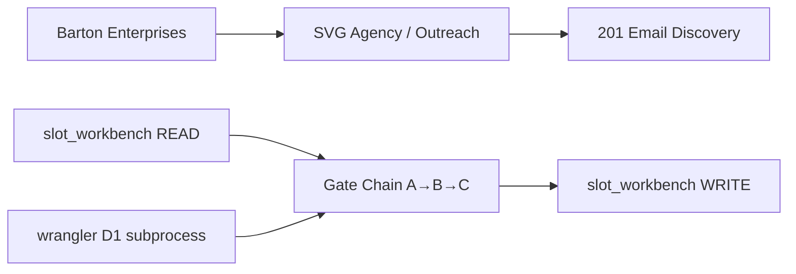
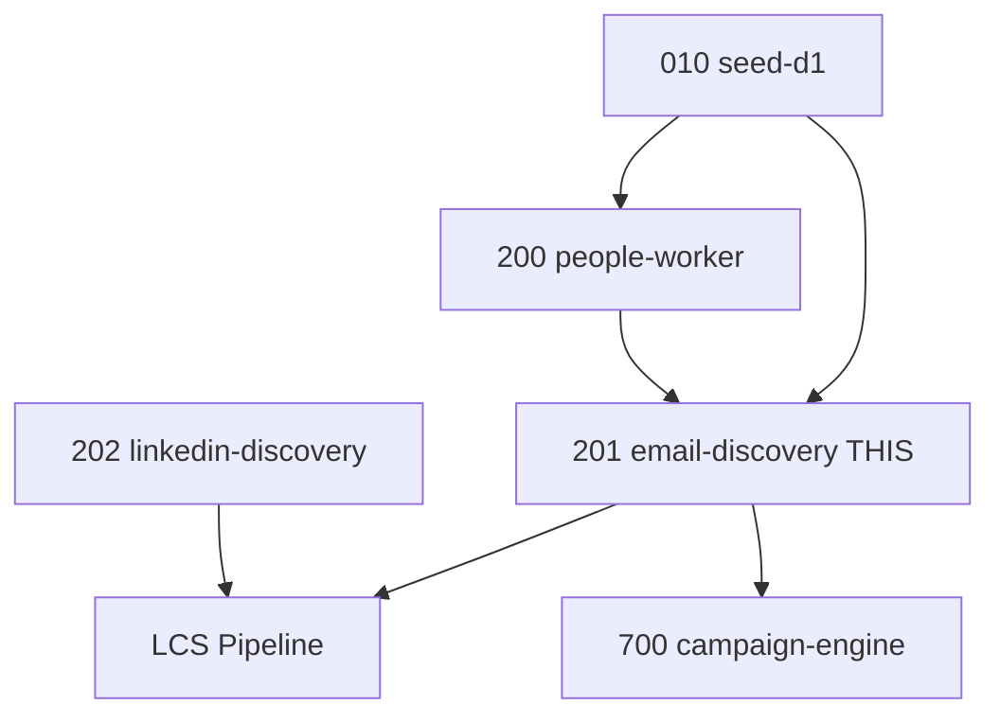

---
# BS Law Y-junction frontmatter — mirrors workflow.yaml outside/inside arms
# Species: UT-Body | companion_yaml: Barton-Processes/factory/outreach/201-email-discovery/workflow.yaml
species: UT-Body
certification_label: provisional-runtime
companion_yaml: Barton-Processes/factory/outreach/201-email-discovery/workflow.yaml

outside:
  heir:
    sovereign_ref: svg-outreach
    hub_id: 201-email-discovery
    cc_layer: CC-04
    ctb_placement: leaf
    ctb_node: barton-enterprises/svg-agency/outreach/201-email-discovery
    imo_topology: middle
    secrets_provider: doppler
    species: Workflow-Body
    services:
      - vendor-email-api
      - cloudflare-d1
      - lbb
      - mission-control
    acceptance_criteria: "UT-local Workflow-Body; email discovery deterministic; 10 BAR-377 gates green"
  orbt:
    library_state: BUILD
    last_indexed_at: "2026-05-06T00:00:00Z"
    indexed_by: sonnet-mechanic

inside:
  heir:
    process_id: bp.201
    version: "1.0.4"
    last_modified: "2026-05-10"
    companion_manifest: Barton-Processes/factory/outreach/201-email-discovery/PROCESS-UT.md
    rim_gate_adoption:
      template: tpl.rim-gate
      specialization: tpl.rim-gate.throughput-control
      reference: imo-creator-v2/atlas/templates/rim-gate/throughput-control/UT.md
      adoption_status: declared
      first_runtime_audit_due: post-Monday-first-fire
    aviation_model:
      planner: opus-4.7
      mechanic: sonnet
      auditor: codex
      rule: mechanic != auditor
    determinism_gate: ai_on_spine_forbidden
    species: UT-Body
  orbt:
    library_state: BUILD
---

# Process 201 — Find Email
## Fills person_email on slot_workbench slots that have a name but no email, enabling LCS pipeline entry.
### Status: BUILD
### Medium: process
### Business: svg-agency

## UT Checklist (Pre-Flight - per law/UT_CHECKLIST.md v1.2.0)

| # | Check | Status | Location |
|---|-------|--------|----------|
| 1 | PRD - what / why / who / scope / out-of-scope / success metric | [x] | §2 |
| 2 | OSAM - READ / WRITE / Process Composition / Join Chain / Forbidden Paths / Query Routing filled | [x] | §5 |
| 3 | Component Status - every dep has green / yellow / red with 1-line state | [x] | §3 |
| 4 | Owner - human who fixes this at 2 AM | [x] | §1 |
| 5 | Live Dashboard - URL or explicit "N/A" | [x] | §3 |
| 6 | Kill Switch - exact command to stop the process | [x] | §8 |
| 7 | Logbook - last audit verdict + date (after certification only) | [ ] | §12 |
| 8 | FCEs Attached - which FCE runs structurally back this doc | [ ] | §3c |
| 9 | BARs Referenced - every BAR this doc touches, with status | [x] | §3d |
| 10 | LBB Subjects Fed - which LBB subject(s) this doc's session logs go to | [x] | §3e |
| 11 | Geometry - CTB position + Hub-Spoke role + Altitude | [x] | §1b |
| 12 | Live Verification - every numeric count, cron, URL, command, BAR status grounded against the live system | [ ] | §9b |
| 13 | ctb_node - declared path on the Barton Enterprises CTB trunk | [x] | §1 Identity |

## §1 IDENTITY {#sec-1-identity}

| Field | Value |
|-------|-------|
| ID | PROC-201 |
| Name | Find Email |
| Medium | process |
| Business Silo | svg-agency |
| CTB Position | barton-enterprises/svg-agency/factory/outreach/201-email-discovery (LEAF) |
| ORBT | BUILD |
| Strikes | 0 |
| Authority | inherited - imo-creator-v2 sovereign + Barton-Processes parent |
| Last Modified | 2026-05-10 |
| BAR Reference | BAR-52, BAR-191 |
| Owner | Dave Barton |
| ctb_node | barton-enterprises/svg-agency/factory/outreach/201-email-discovery |

## §1b GEOMETRY {#sec-1b-geometry}

**CTB Position:** barton-enterprises → svg-agency → factory → outreach → 201-email-discovery (leaf)

**Hub-Spoke Role:** hub — all gate-chain logic lives in this process; slot_workbench is the rim (I/O boundary); wrangler subprocess is the dumb spoke transport

**Altitude:** 5k execution — runs per-slot, per-gate, deterministic email discovery



### HEIR (8 fields - Aviation Model, Bedrock §8)

| Field | Value |
|-------|-------|
| sovereign_ref | imo-creator-v2 |
| hub_id | outreach |
| ctb_placement | leaf |
| imo_topology | middle |
| cc_layer | CC-03 |
| services | svg-d1-outreach-ops (D1), DataImpulse proxy (Gate C), Million Verifier (PLANNED) |
| secrets_provider | doppler |
| acceptance_criteria | Gate order A→B→C enforced; person_email_verified tracks MV verdict only (not existence of guess); pattern guesses not written to person_email until gate hit; hunter_confidence threshold ≥ 80 enforced for Gate B |

## §2 PURPOSE {#sec-2-purpose}

### WHAT
Process 201 discovers and writes email addresses to slot_workbench for slots that have a person name but no email. It runs three gates in deterministic priority order — pattern generation (free), Hunter promotion (free), and Startpage search (proxy cost only) — stopping at the first hit per slot.

### WHY
Without a verified email, a slot cannot enter the LCS pipeline for Mailgun delivery. Process 200 fills the name; Process 201 fills the email. A slot at readiness_tier T3 (name only) starves the entire outreach sequence until this process runs. The bounce-rate root cause (FP-201-01) is also gated here: person_email_verified must track MV verdict, not email existence.

### WHO
Outreach operations (Dave Barton). Downstream consumers: LCS pipeline, Process 700 Campaign Engine. Doc readers: mechanics running the gate chain, auditors reviewing certification.

### SCOPE (in)
- Email discovery via three-gate chain (pattern, Hunter, Startpage)
- Writing person_email, has_email, person_source, readiness_tier to slot_workbench
- JSONL audit trail per run
- Resume support and dry-run mode

### OUT-OF-SCOPE
- Email verification (Million Verifier Gate D — PLANNED, not yet implemented; see PROCESS.md §3)
- LinkedIn discovery (Process 202 owns that)
- Person name discovery (Process 200 owns that)
- Company seed data (Process 010 owns that)

### SUCCESS METRIC
Overall email fill rate ≥ 80% across all three gates, with D1 write success rate ≥ 99% and Gate C CAPTCHA rate < 5%.

## §3 RESOURCES {#sec-3-resources}

Required doctrine references for every process UT:

- `law/UNIFIED_TEMPLATE.md`
- `law/UT_CHECKLIST.md`
- `law/doctrine/PROCESS_FILL_INSTRUCTIONS.md`
- `law/doctrine/HOW_TO_BUILD_ANYTHING.md` (repair manual)
- `law/doctrine/BARTON_ENTERPRISES_WORLD_ATLAS.md` (Atlas System bundle)
- `law/doctrine/KEY.md`

### Component Status Grid

| Component | HEIR (`hub_id · ctb · cc_layer`) | ORBT | Light | State |
|-----------|----------------------------------|------|-------|-------|
| svg-d1-outreach-ops | outreach · leaf · CC-03 | OPERATE | green | Active D1 instance; slot_workbench table populated by Process 010 |
| Process 200 (Find Person) | outreach · leaf · CC-03 | TBV | yellow | Must complete before 201 runs (has_name = 1 prerequisite) |
| Process 010 (Seed D1) | outreach · leaf · CC-03 | TBV | yellow | Populates company constants and Hunter data |
| DataImpulse proxy | external · spoke · CC-03 | OPERATE | green | Residential proxy for Gate C; PROXY_USER/PROXY_PASS in Doppler |
| Million Verifier | external · spoke · CC-03 | BUILD | red | PLANNED Gate D — not yet integrated; 111,167 credits available |
| wrangler CLI | local · spoke · CC-03 | OPERATE | green | D1 subprocess; requires npx wrangler in PATH |

### Live Dashboard

| Resource | URL | What it shows |
|----------|-----|---------------|
| slot_workbench email coverage | N/A — query D1 directly | `SELECT count(*) FROM slot_workbench WHERE has_email=1` |
| JSONL run output | src/output/find-email-YYYY-MM-DD.jsonl | Per-slot gate results, hits, misses, source |

### Dependencies

| Dependency | Type | What It Provides | Status |
|-----------|------|-----------------|--------|
| Process 010 (seed-d1) | upstream process | Populates slot_workbench company constants, hunter_email_pattern, hunter_email, hunter_confidence | DONE |
| Process 200 (people-worker) | upstream process | Fills person_first_name, person_last_name (has_name=1) | DONE |
| Process 300 (blog-worker) | upstream process (optional) | Optional enrichment; may surface emails during recon | DONE |
| svg-d1-outreach-ops D1 | database | slot_workbench read/write | DONE |
| DataImpulse proxy | API | Residential proxy for Gate C Startpage search | DONE |
| curl_cffi | Python library | Browser fingerprint impersonation for Gate C | DONE |

### Downstream Consumers

| Consumer | What It Needs |
|----------|--------------|
| LCS Pipeline | person_email + has_email=1 for Mailgun MID delivery |
| Process 700 (Campaign Engine) | readiness_tier T2+ to enter campaign queue |
| Million Verifier Gate D (PLANNED) | person_email candidate to verify; will write person_email_verified when integrated |
| Process 202 (LinkedIn Discovery) | Runs in parallel; no dependency but shares same slot_workbench |

### Tools & Integrations

| Item | Type | Cost Tier | Credentials | What It Does |
|------|------|-----------|-------------|-------------|
| String pattern formatting | Built-in | Free | none | Gate A — deterministic email generation from 12 pattern formats |
| Hunter data (pre-loaded D1) | D1 lookup | Free | none | Gate B — confidence-based promotion if confidence ≥ 80 |
| Startpage + curl_cffi | Search + library | Free (proxy cost) | PROXY_USER, PROXY_PASS | Gate C — natural language search, email extraction, domain scoring |
| DataImpulse residential proxy | Proxy | Free (bundled) | PROXY_USER, PROXY_PASS | Rotates IP per 50 queries for Gate C |
| Million Verifier | Verification API | Top Shelf ($0.003/check) | MV_API_KEY | PLANNED Gate D — 111,167 credits; not yet integrated |

### Secrets

| Secret | Doppler Project | Config | Used By |
|--------|----------------|--------|---------|
| PROXY_USER | imo-creator | dev | Gate C DataImpulse proxy auth |
| PROXY_PASS | imo-creator | dev | Gate C DataImpulse proxy auth |
| MV_API_KEY | imo-creator | dev | Million Verifier — PLANNED, not yet used |

### 3c. FCEs Attached

| FCE Name | HEIR (`hub_id · ctb · cc_layer`) | ORBT | Run Directory | Latest P=1 | Rows | Status |
|----------|----------------------------------|------|--------------|------------|------|--------|
| TBV | TBV | TBV | TBV | TBV | TBV | TBV |

### 3d. BARs Referenced

| BAR | Title | HEIR (`bar-id · ctb · cc_layer`) | ORBT | Status | Relation |
|-----|-------|----------------------------------|------|--------|----------|
| BAR-52 | TBV | TBV | TBV | TBV | implements |
| BAR-191 | TBV | TBV | TBV | TBV | implements |

### 3e. LBB Subjects Fed

| LBB Subject | HEIR (`subject-id · ctb · cc_layer`) | ORBT | What This Doc Writes | Frequency |
|-------------|--------------------------------------|------|---------------------|-----------|
| svg-outreach | svg-outreach · branch · CC-03 | BUILD | session summaries, gate hit rates, bounce flag events | per-run |
| processes | processes · branch · CC-03 | BUILD | process consolidation events, UT retrofit | on-change |

## §4 IMO {#sec-4-imo}

### Two-Question Intake (Bedrock §3)
1. What triggers this? A slot in slot_workbench where has_name = 1 AND has_email = 0.
2. How do we get it? Manual execution of `python3 src/find-email.py` after Process 200 completes; queried directly from D1 svg-d1-outreach-ops.

### Input
Rows from slot_workbench where has_name=1 AND has_email=0. Contains person_first_name, person_last_name, domain, company constants (canonical_name, city, state), and Hunter data (hunter_email_pattern, hunter_email, hunter_confidence). Triggered manually after Process 200 run.

### Middle

| Step | Input | What Happens | Output | Tool Used |
|------|-------|-------------|--------|-----------|
| 1 - Load slots | D1 slot_workbench | SELECT where has_name=1 AND has_email=0, ORDER BY outreach_id | Slot list in memory | wrangler D1 subprocess |
| 2 - Gate A: Pattern Generate | hunter_email_pattern / vendor_email_pattern + first + last + domain | Apply 12-format pattern map deterministically; stop if hit | Generated email or None | Python string formatting (free) |
| 3 - Gate B: Hunter Promote | hunter_email + hunter_confidence | Promote if hunter_email exists AND confidence ≥ 80 | Promoted email or None | D1 data lookup (free) |
| 4 - Gate C: Startpage Search | first + last + canonical_name + city/state | POST query to Startpage, extract emails, score by domain + name match; accept if score ≥ 30 | Best-scored email or None | curl_cffi + DataImpulse proxy |
| 5 - Write result | found_email + slot_id | UPDATE slot_workbench: person_email, has_email=1, person_source, email_last_checked_at, readiness_tier | D1 row updated | wrangler D1 subprocess |
| 6 - Audit trail | per-slot result | Append JSONL record with gate, email, source, timestamp | find-email-YYYY-MM-DD.jsonl | Python file I/O |

### Output
- `slot_workbench.person_email` = discovered email
- `slot_workbench.has_email` = 1
- `slot_workbench.person_source` = gate identifier (pattern_generate, hunter_promote, startpage_201)
- `slot_workbench.readiness_tier` = recalculated (T3→T2 or T1)
- JSONL audit file in `src/output/`

### Circle (Bedrock §5)
Email found → slot updated → readiness_tier promoted → enters LCS pipeline → Mailgun sends → bounce webhook (future) → person_email_verified flag checked → if bounce, re-enter 201 on next cycle. Bounce feedback closes the loop. MV Gate D (PLANNED) will close verification loop independently.

## §5 DATA SCHEMA {#sec-5-data-schema}

### READ Access

| Source | What It Provides | Join Key |
|--------|-----------------|----------|
| slot_workbench.slot_id | Primary key | slot_id |
| slot_workbench.outreach_id | Company identifier | outreach_id |
| slot_workbench.person_first_name | Gate A/B/C input | slot_id |
| slot_workbench.person_last_name | Gate A/B/C input | slot_id |
| slot_workbench.domain | Email domain for pattern + scoring | outreach_id |
| slot_workbench.company_domain | Fallback domain field | outreach_id |
| slot_workbench.canonical_name | Gate C search query component | outreach_id |
| slot_workbench.company_name | Gate C search query fallback | outreach_id |
| slot_workbench.city | Gate C disambiguation | outreach_id |
| slot_workbench.state | Gate C disambiguation | outreach_id |
| slot_workbench.hunter_email_pattern | Gate A pattern template | outreach_id |
| slot_workbench.vendor_email_pattern | Gate A alternate pattern | outreach_id |
| slot_workbench.hunter_email | Gate B email candidate | slot_id |
| slot_workbench.hunter_confidence | Gate B confidence score 0-100 | slot_id |
| slot_workbench.has_name | Gate pre-condition (must = 1) | slot_id |
| slot_workbench.has_email | Gate pre-condition (must = 0) | slot_id |
| slot_workbench.has_linkedin | Readiness tier calculation | slot_id |

### WRITE Access

| Target | What It Writes | When |
|--------|---------------|------|
| slot_workbench.person_email | Discovered email address | On gate hit |
| slot_workbench.has_email | Set to 1 | On gate hit |
| slot_workbench.person_source | Gate identifier string | On gate hit |
| slot_workbench.email_last_checked_at | UTC timestamp of discovery | On gate hit |
| slot_workbench.email_changed | Set to 1 | On gate hit |
| slot_workbench.readiness_tier | Recalculated tier (T1/T2/T3/T4) | On gate hit |

### Process Composition



| Process ID | Name | Role in Composition | Status |
|-----------|------|---------------------|--------|
| PROC-010 | seed-d1 | upstream feeder — company constants, Hunter data | green |
| PROC-200 | people-worker | upstream feeder — person_first_name, person_last_name | green |
| PROC-201 | email-discovery | this process | BUILD |
| PROC-202 | linkedin-discovery | parallel peer — runs concurrently | TBV |
| PROC-700 | campaign-engine | downstream consumer | TBV |

### Join Chain

```text
slot_workbench.slot_id (individual slot, person-level variables)
  -> slot_workbench.outreach_id (company-level constants: domain, patterns, city/state)
    -> LCS Pipeline (join key: slot_id + has_email=1)
```

### Forbidden Paths

| Action | Why |
|--------|-----|
| Skip Gate A and start at B or C | Gate order is constant; determinism first — D-201-04 |
| Write person_email without setting has_email=1 | Inconsistent state breaks downstream queries — D-201-05 |
| Run on slots where has_name = 0 | No name = nothing to generate from — D-201-02 |
| Overwrite an existing person_email (has_email=1) | Those slots are not in the query set — D-201-02 |
| Write directly to Neon vault | Neon is vault only; all working data on CF D1 |
| Set person_email_verified=1 without MV pass | Root cause of FP-201-01 — D-201-01 |
| Write pattern guess to person_email before gate hit | CQRS gate violation — D-201-03 |

### Query Routing

| Question | Table | Column |
|----------|-------|--------|
| Which slots need emails? | slot_workbench | has_name=1 AND has_email=0 |
| What email pattern for this company? | slot_workbench | hunter_email_pattern, vendor_email_pattern |
| How confident is the Hunter email? | slot_workbench | hunter_confidence |
| What gate found the email? | slot_workbench | person_source |
| Is this slot ready for LCS? | slot_workbench | readiness_tier |
| Is email verified by MV? | slot_workbench | person_email_verified (tracks MV verdict only — D-201-01) |

## §6 DMJ {#sec-6-dmj}

### 6a. DEFINE (Build the Key)

| Element | ID | Format | Description | C or V |
|---------|-----|--------|-------------|--------|
| Gate order | EL-001 | enum: A→B→C | Sequence gates run; deterministic, immutable | C |
| Email pattern formats | EL-002 | 12-entry map (string→string) | Hunter/vendor tokens mapped to format strings | C |
| Hunter confidence threshold | EL-003 | integer ≥ 80 | Minimum score for Gate B promotion | C |
| Startpage query template | EL-004 | "{first} {last} {company} email contact" | Base query; city/state appended for common names | C |
| Score acceptance floor | EL-005 | integer ≥ 30 | Minimum score to accept a Gate C result | C |
| slot_id | EL-006 | UUID string | Primary key for individual slot | C |
| person_email | EL-007 | email string | The fill — empty until gate succeeds | V |
| hunter_confidence | EL-008 | integer 0-100 | Confidence score per slot | V |
| Gate hit result | EL-009 | (email, source) tuple or (None, None) | Per-slot gate output | V |
| readiness_tier | EL-010 | T1/T2/T3/T4 | Derived from has_name + has_email + has_linkedin | V |
| person_email_verified | EL-011 | integer 0/1 | Tracks MV verification verdict ONLY (not email existence) | C (structure), V (fill) |

### 6b. MAP (Connect Key to Structure)

| Source | Target | Transform |
|--------|--------|-----------|
| hunter_email_pattern + name + domain | slot_workbench.person_email | apply_pattern() → format string |
| hunter_email where confidence ≥ 80 | slot_workbench.person_email | direct promote |
| Startpage search result (score ≥ 30) | slot_workbench.person_email | extract + score → best match |
| Gate hit result | slot_workbench.has_email | set 1 |
| Gate identifier string | slot_workbench.person_source | direct write |
| has_name + has_email + has_linkedin | slot_workbench.readiness_tier | calc_readiness_tier() |

### 6c. JOIN (Path to Spine)

| Join Path | Type | Description |
|-----------|------|-------------|
| slot_workbench.slot_id → LCS pipeline | direct | slot_id is the spine key for all downstream consumption |
| slot_workbench.outreach_id → company constants | self-join | company-level pattern/domain data fetched via outreach_id |
| person_email_verified → MV verdict (PLANNED) | future | MV Gate D will write this field; must not be set by discovery gates |

## §7 CONSTANTS & VARIABLES {#sec-7-constants-variables}

### Constants (structure - never changes)
- Gate order: A → B → C — enforced by D-201-04; gate_skip_count tolerance = ε
- 12 email pattern format map (EL-002) — enforced by D-201-06; pattern_deviation_count tolerance = ε
- Gate B threshold: hunter_confidence ≥ 80 (EL-003) — enforced by D-201-07; threshold_deviation_count tolerance = ε
- Startpage query template: "{first} {last} {company} email contact" (EL-004) — enforced by D-201-08
- Gate C score acceptance floor ≥ 30 (EL-005) — enforced by D-201-08
- Pre-condition: has_name=1 AND has_email=0 (query gate) — enforced by D-201-02
- person_email_verified tracks MV verdict only, never email existence — enforced by D-201-01
- JSONL audit trail required per run — enforced by D-201-09

### Variables (fill - changes every run/cycle)
- person_first_name, person_last_name (input from Process 200)
- person_email (the fill — empty until gate succeeds; EL-007)
- hunter_confidence value per slot (0-100; EL-008)
- Which gate hits first (depends on available data per slot; EL-009)
- readiness_tier (derived; EL-010)
- Startpage search results (different HTML per query)
- CAPTCHA rate per run
- Fill rate per gate per run
- MV credits remaining (111,167 — applies after Gate D integration)

## §8 STOP CONDITIONS {#sec-8-stop-conditions}

| Condition | Action |
|-----------|--------|
| CAPTCHA rate > 10% on Gate C queries | HALT Gate C — rotate proxy, increase SEARCH_DELAY |
| D1 write failures > 5 consecutive | HALT — check wrangler auth, D1 availability (D-201-05) |
| person_email_verified set without MV verdict | HALT — FP-201-01 violation; investigate find-email.py write path (D-201-01) |
| Pattern guess written to person_email before gate hit | HALT — CQRS gate violation (D-201-03) |
| Gate order skipped (B or C before A) | HALT — doctrine violation (D-201-04) |
| Million Verifier credits < 1,000 | HALT MV gate (after Gate D integration) — alert for credit purchase |
| Bounce rate on 201-generated emails > 5% | HALT — investigate gate logic, tighten thresholds |
| Missing PROXY_USER / PROXY_PASS | Gate C skipped automatically; A+B continue |
| Can't answer two-question intake | HALT — process is undefined |
| Same failure pattern 3x | Troubleshoot/Train → produce Airworthiness Directive |

### Kill Switch

```text
# Interrupt the running process:
Ctrl+C (kills the Python process; partial JSONL output preserved)

# Prevent further D1 writes without stopping:
python3 src/find-email.py --dry-run --limit 0

# Resume after kill:
python3 src/find-email.py --resume --limit N
```

## §9 VERIFICATION {#sec-9-verification}

```text
1. Select 5 slots: has_name=1, has_email=0, has_email_pattern=1
   -> Run: python3 src/find-email.py --gate a --limit 5
   -> Expected: pattern-generated emails in JSONL; D1 has_email=1 for those slots

2. Select 5 slots: hunter_email IS NOT NULL AND hunter_confidence >= 80
   -> Run: python3 src/find-email.py --gate b --limit 5
   -> Expected: hunter emails promoted; D1 updated

3. Select 5 slots that miss Gate A and B
   -> Run: python3 src/find-email.py --gate all --limit 5
   -> Expected: Gate C fires; Startpage queried; email parsed or miss logged

4. Dry-run test:
   -> Run: python3 src/find-email.py --dry-run --limit 10
   -> Expected: JSONL written; zero D1 writes (d1_written field absent or false)

5. D1 state verification:
   -> SELECT slot_id, person_email, has_email, person_source, person_email_verified, readiness_tier
      FROM slot_workbench WHERE person_source LIKE 'pattern_generate%' LIMIT 5
   -> Expected: person_email populated; has_email=1; person_email_verified=NULL (MV not integrated); readiness_tier=T2 or T1

6. Resume test:
   -> Run --limit 5, stop, run --resume --limit 10
   -> Expected: first 5 skipped; next 5 processed
```

### Three Primitives Check (Bedrock §1)
1. Thing — Does the slot exist in slot_workbench with has_name=1?
2. Flow — Does the name + domain reach the gate chain? Does the result reach D1 via wrangler?
3. Change — Is person_email written? Is has_email flipped to 1? Is readiness_tier recalculated?

## §9b LIVE VERIFICATION {#sec-9b-live-verification}

| Claim | Section | Source of Truth | Verification Command | [ ] | Last Check | Value |
|-------|---------|-----------------|----------------------|-----|-----------|-------|
| Slots needing email exist | §4 | slot_workbench | `npx wrangler d1 execute svg-d1-outreach-ops --remote --command "SELECT count(*) as c FROM slot_workbench WHERE has_name=1 AND has_email=0"` | [ ] | TBV | TBV |
| Email fill count | §2 | slot_workbench | `npx wrangler d1 execute svg-d1-outreach-ops --remote --command "SELECT count(*) as c FROM slot_workbench WHERE has_email=1"` | [ ] | TBV | TBV |
| Gate A hit count (pattern_generate) | §4 | slot_workbench | `npx wrangler d1 execute svg-d1-outreach-ops --remote --command "SELECT count(*) as c FROM slot_workbench WHERE person_source LIKE 'pattern_generate%'"` | [ ] | 2026-04-02 | 226 |
| person_email_verified NULL (MV not integrated) | §5 | slot_workbench | `npx wrangler d1 execute svg-d1-outreach-ops --remote --command "SELECT count(*) as c FROM slot_workbench WHERE person_email_verified=1"` | [ ] | TBV | TBV (must be 0 until MV Gate D integrated) |
| Proxy credentials in Doppler | §3 | Doppler imo-creator/dev | `doppler secrets get PROXY_USER PROXY_PASS --project imo-creator --config dev` | [ ] | TBV | TBV |
| JSONL output file exists for last run | §4 | src/output/ | `ls src/output/find-email-*.jsonl` | [ ] | TBV | TBV |

Rule: at least one live gauge row is required before BUILD can move to OPERATE.

## §10 Operations / Schedule {#sec-10-operations}

**Cron classification:** RECURRING-daily
**Decision date:** 2026-05-08
**Decision authority:** Sovereign (Dave Barton, BAR-MONDAY-16-FLEET-GREEN)

**Schedule:** `0 7 * * *` (daily 7am UTC / 3am ET)
**Implementation:** GitHub Actions cron
**Trigger source (if event-driven):** N/A

---

## §10 ANALYTICS {#sec-10-analytics}

### 10a. Metrics

| Metric | Unit | Baseline | Target | Tolerance |
|--------|------|----------|--------|-----------|
| Gate A hit rate | % | BASELINE | > 40% | +/- 5% |
| Gate B hit rate | % | BASELINE | > 15% | +/- 3% |
| Gate C hit rate | % | BASELINE | fill remainder | n/a |
| Overall email fill rate | % | BASELINE | > 80% | +/- 5% |
| Gate C CAPTCHA rate | % | BASELINE | < 5% | max 10% |
| D1 write success rate | % | BASELINE | > 99% | min 95% |
| Bounce rate on generated emails | % | BASELINE | < 5% (after MV) | max 8% |
| Cost per email found (current) | $/email | BASELINE | ~$0.00 (proxy bundled) | n/a |

### 10b. Sigma Tracking

| Metric | Run 1 | Run 2 | Run 3 | Trend | Action |
|--------|-------|-------|-------|-------|--------|
| Gate A hit rate | -- | -- | -- | -- | -- |
| Gate B hit rate | -- | -- | -- | -- | -- |
| Overall fill rate | -- | -- | -- | -- | -- |
| CAPTCHA rate | -- | -- | -- | -- | -- |
| D1 write success rate | -- | -- | -- | -- | -- |

### 10c. ORBT Gate Rules

| From | To | Gate |
|------|-----|------|
| BUILD | OPERATE | all metrics within tolerance for 3 runs + auditor sign-off |
| OPERATE | REPAIR | any metric outside tolerance |
| REPAIR | OPERATE | fix + metric back within tolerance + auditor verification |
| Any (Strike 3) | TROUBLESHOOT_TRAIN | fleet-wide fix → AD |

## §11 EXECUTION TRACE {#sec-11-execution-trace}

| Field | Format | Required |
|-------|--------|----------|
| trace_id | UUID | Yes |
| run_id | UUID | Yes |
| step | action name | Yes |
| target | measurable | Yes |
| actual | measurable | Yes |
| delta | the gap | Yes |
| status | done / failed / skipped | Yes |
| error_code | text or null | If failed |
| error_message | text or null | If failed |
| tools_used | JSON array | Yes |
| duration_ms | integer | Yes |
| cost_cents | integer | Yes |
| timestamp | ISO-8601 | Yes |
| signed_by | agent or manual | Yes |

### Build Inputs Used

| Source | File | What Was Used |
|--------|------|--------------|
| CLAUDE.md | factory/outreach/201-email-discovery/CLAUDE.md | Identity, gate chain, pre-flight |
| PROCESS.md | factory/outreach/201-email-discovery/PROCESS.md | Full 14-section doc, constants, variables, stop conditions |
| DATA_FLOW.md | factory/outreach/201-email-discovery/DATA_FLOW.md | Read/write/gate chain paths, readiness tier table |
| heir.yaml | factory/outreach/201-email-discovery/heir.yaml | HEIR 8-field identity |
| src/find-email.py | factory/outreach/201-email-discovery/src/find-email.py | Gate implementation, FP-201-01 line investigation |

### Back-Propagation Check

| Parent Constant | Conflict Check | Result |
|-----------------|----------------|--------|
| Gate order A→B→C | Verified in find-email.py main() — gate sequence enforced by if/elif chain | clean |
| person_email_verified tracks MV verdict only | find-email.py does NOT write person_email_verified in any path (MV not integrated) — FP-201-01 source is elsewhere in write path or upstream | clean (no violation in current code) |
| CQRS write gate | D1 writes only occur after found_email is confirmed not None | clean |

## §12 LOGBOOK {#sec-12-logbook}

No logbook during BUILD.

### Birth Certificate

| Field | Value |
|-------|-------|
| heir_ref | TBV — pending auditor certification |
| orbt_entered | BUILD |
| orbt_exited | OPERATE |
| action | Certified - airworthiness confirmed |
| gates_passed | { imo: true, ctb: true, circle: true } |
| signed_by | TBV — auditor (must differ from builder) |
| signed_at | TBV |

### Logbook (append-only)

| Date | Actor | Action | What Was Done | Evidence | LBB Record |
|------|-------|--------|---------------|----------|------------|
| 2026-04-29 | claude-sonnet-4-6 | BUILD | UT consolidation — PROCESS-UT.md + DOCTRINE.md written from fragments | WAVE-1 Packet 5 dispatch | pending |

## §13 FLEET FAILURE REGISTRY {#sec-13-fleet-failure-registry}

| Pattern ID | Location | Error Code | First Seen | Occurrences | Strike Count | Status |
|-----------|----------|-----------|-----------|-------------|-------------|--------|
| FP-201-01 | slot_workbench.person_email_verified | SPURIOUS_VERIFIED_FLAG | TBV | TBV | 1 | OPEN — investigate which write path sets person_email_verified=1 when MV has not passed; fix at source per Bedrock §6 step 10 |

**FP-201-01 Investigation Note:** Current find-email.py code does NOT write person_email_verified in any gate path. The spurious flag is set elsewhere — likely in the write path of a different process or a manual update. Auditor must trace which line/process sets this flag before Strike 2.

## §14 SESSION LOG {#sec-14-session-log}

| Date | Version | Author | Action | Scope |
|------|---------|--------|--------|-------|
| 2026-04-02 | v0.0.1 | legacy-session | `CREATE` | Initial PROCESS.md created (v2.0.0 format) |
| 2026-04-02 | v0.0.2 | legacy-session | `RESTRUCTURE` | Rewritten to PROCESS_TEMPLATE v4.0.0 — all 14 sections |
| 2026-04-02 | v0.0.3 | legacy-session | `AMEND` | Math engine added: 6 comparators, P(x;θ), conditional logic SQL. Gate A: 2,478 slots, 226 emails. Gate C not yet run. (LBB: 5db86e97) |
| 2026-04-02 | v0.0.4 | legacy-session | `AMEND` | recon_emails (7.5K) identified as unused; Branch 1 database join fix queued (LBB: 54f035e9) |
| 2026-04-29 | v1.0.0 | claude-sonnet-4-6 | `CREATE` | UT v2.7.0 consolidation — PROCESS-UT.md + DOCTRINE.md written from fragments. FP-201-01 captured in §13. |
| 2026-05-08 | v1.0.1 | Sonnet Mechanic (BAR-MONDAY-16-FLEET-GREEN) | `MIGRATE` | §14 column format migrated to canonical 5-column shape per Atlas v2.3.0 / UT v2.8.0 / UT_CHECKLIST v1.3.1. Original 3-column rows preserved as table rows where possible; original verbatim text preserved as footnotes when reshaping lost content. |
| 2026-05-08 | v1.0.2 | Sonnet Mechanic (BAR-MONDAY-16-FLEET-GREEN) | `STAMP` | §10 Operations/Schedule stamped: RECURRING-daily `0 7 * * *` GitHub Actions cron. Version bumped in 3 locations. |
| 2026-05-08 | v1.0.3 | Sonnet Mechanic (BAR-MONDAY-16-FLEET-GREEN) | `AMEND` | G03: ctb_placement corrected from full path string to canonical enum value `leaf`; ctb_node added to outside.heir with path `barton-enterprises/svg-agency/outreach/201-email-discovery`. |
| 2026-05-10 | `v1.0.4` | BAR-FLEET-OVERNIGHT WO-2 + WO-3 | Sonnet Mechanic | `AUDIT_LOGBOOK` — overnight 16-process readiness sweep audit (a57f0f541e0d0b5cd, READ-ONLY). Finding: RIM-GATE → THROUGHPUT-CONTROL adoption declared this dispatch (WO-3). MillionVerifier + Hunter rims. GH Actions cron-bp-201 present. Vendor-budget cap enforcement TBV. Version bump (3 locations) per memory feedback_pair_version_with_last_modified. | §14 + Document Control + inside.heir.rim_gate_adoption |

^[ROW-2026-04-02a]: Initial PROCESS.md created (v2.0.0 format) | LBB: none
^[ROW-2026-04-02b]: Rewritten to PROCESS_TEMPLATE v4.0.0 — all 14 sections | LBB: none
^[ROW-2026-04-02c]: Math engine added: 6 comparators, P(x;θ), conditional logic SQL. Gate A ran all 2,478 slots: 226 emails generated via pattern. Gate C not yet run. | LBB Record: 5db86e97
^[ROW-2026-04-02d]: recon_emails (7.5K) identified as unused data — emails found during 300 recon sitting in JSON array, never written to person_email. Branch 1 database join fixing this. | LBB Record: 54f035e9
^[ROW-2026-04-29]: UT v2.7.0 consolidation — PROCESS-UT.md + DOCTRINE.md written from fragments. FP-201-01 captured in §13. | LBB: pending

## Document Control

| Field | Value |
|-------|-------|
| Created | 2026-04-02 |
| Last Modified | 2026-05-10 |
| Version | v1.0.4 |
| Template Version | 2.7.0 |
| Medium | process |
| US Validated | pending |
| Governing Engine | law/doctrine/FOUNDATIONAL_BEDROCK.md + law/doctrine/DMJ.md |
