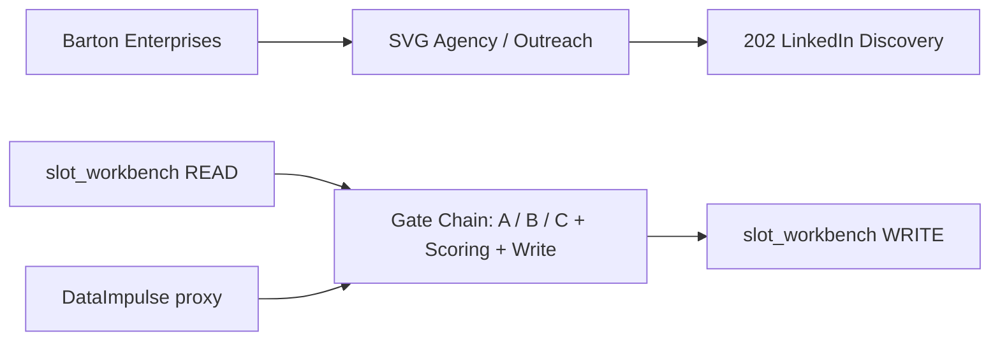
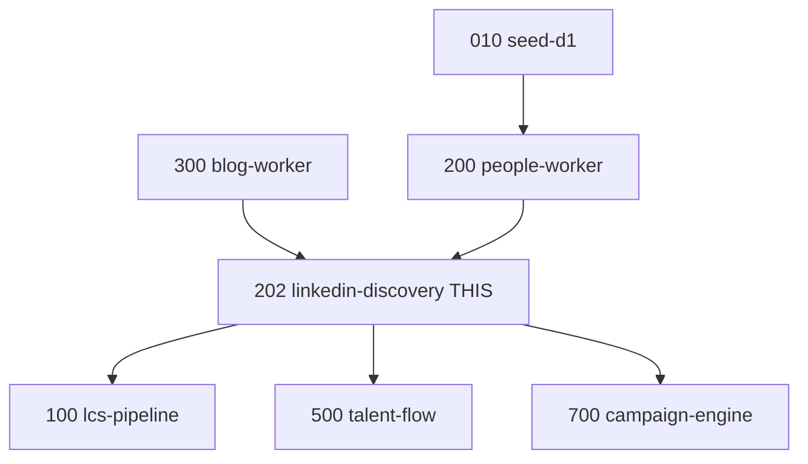

# Process 202: LinkedIn Discovery
## §1 IDENTITY
Fills person_linkedin on slots that have a name but no LinkedIn URL via a 3-gate waterfall (recon match → hunter promote → Startpage search).
### Status: BUILD
### Medium: process
### Business: svg-agency

## §2 PRD
Section placeholder — content to be filled by process owner.

## §3 RESOURCES
Section placeholder — content to be filled by process owner.

## §4 MIDDLE
Section placeholder — content to be filled by process owner.

## §5 OSAM
Section placeholder — content to be filled by process owner.

## §6 OUTPUT
Section placeholder — content to be filled by process owner.

## §7 GOVERNANCE
Section placeholder — content to be filled by process owner.

## §8 KILL SWITCH
Section placeholder — content to be filled by process owner.

## §9 OBSERVABILITY
Section placeholder — content to be filled by process owner.

## §10 LBB SUBJECTS
Section placeholder — content to be filled by process owner.

## §11 OPEN BLOCKERS
Section placeholder — content to be filled by process owner.

## §12 STRIKE LADDER
Section placeholder — content to be filled by process owner.

## §13 BARS
Section placeholder — content to be filled by process owner.

## §14 LOGBOOK
Section placeholder — content to be filled by process owner.

## UT Checklist (Pre-Flight — per law/UT_CHECKLIST.md v1.2.0)

| # | Check | Status | Location |
|---|-------|--------|----------|
| 1 | PRD — what / why / who / scope / out-of-scope / success metric | [x] | §2 |
| 2 | OSAM — READ / WRITE / Process Composition / Join Chain / Forbidden Paths / Query Routing filled | [x] | §5 |
| 3 | Component Status — every dep has green / yellow / red with 1-line state | [x] | §3 |
| 4 | Owner — human who fixes this at 2 AM | [x] | §1 |
| 5 | Live Dashboard — URL or explicit "N/A" | [x] | §3 |
| 6 | Kill Switch — exact command to stop the process | [x] | §8 |
| 7 | Logbook — last audit verdict + date (after certification only) | [ ] | §12 |
| 8 | FCEs Attached — which FCE runs structurally back this doc | [ ] | §3c |
| 9 | BARs Referenced — every BAR this doc touches, with status | [x] | §3d |
| 10 | LBB Subjects Fed — which LBB subject(s) this doc's session logs go to | [x] | §3e |
| 11 | Geometry — CTB position + Hub-Spoke role + Altitude | [x] | §1b |
| 12 | Live Verification — every numeric count, cron, URL, command, BAR status grounded against the live system | [ ] | §9b |
| 13 | ctb_node — declared path on the Barton Enterprises CTB trunk | [x] | §1 Identity |

## 1. IDENTITY {#sec-1-identity}

| Field | Value |
|-------|-------|
| ID | PROC-202 |
| Name | LinkedIn Discovery |
| Medium | process |
| Business Silo | svg-agency |
| CTB Position | factory/outreach/202-linkedin-discovery (LEAF) |
| ORBT | BUILD |
| Strikes | 0 |
| Authority | inherited — parent doctrine / imo-creator-v2 sovereign |
| Last Modified | 2026-04-29 |
| BAR Reference | BAR-52, BAR-192 |
| Owner | Dave Barton |
| ctb_node | barton-enterprises/svg-agency/outreach/202-linkedin-discovery |

### 1b. Geometry {#sec-1b-geometry}

**CTB Position:** barton-enterprises → svg-agency → outreach → 202-linkedin-discovery (leaf)

**Hub-Spoke Role:** Hub — all discovery logic (gate chain, slug parsing, proxy search, scoring, D1 write) runs inside this process. Data flows in from slot_workbench (spoke/read) and results flow out to slot_workbench (spoke/write). No logic runs in the transport layer.

**Altitude:** 10k operational — one leaf on the outreach branch; operates within the slot-fill pipeline defined by 200-people-worker (upstream) and 100-lcs-pipeline (downstream consumer).



### HEIR (8 fields — Aviation Model, Bedrock §8)

| Field | Value |
|-------|-------|
| sovereign_ref | imo-creator |
| hub_id | outreach |
| ctb_placement | leaf |
| imo_topology | middle |
| cc_layer | CC-03 |
| services | svg-d1-outreach-ops (D1), DataImpulse proxy (Gate C), Startpage search (Gate C via proxy) |
| secrets_provider | doppler |
| acceptance_criteria | See DOCTRINE.md — 8 rules in heir.yaml acceptance_criteria array |

## 2. PURPOSE {#sec-2-purpose}

### WHAT
Process 202 fills the `person_linkedin` field on outreach slots that have a confirmed person name but no LinkedIn URL. It operates a 3-gate waterfall: Gate A matches the person name against LinkedIn slugs already scraped by Process 300 (free), Gate B promotes hunter_linkedin if present (free), Gate C fires a natural-language Startpage search via residential proxy (cheap, ~$0.001/query). First gate to produce a valid `/in/` URL wins; the result is written to slot_workbench with readiness_tier recalculated.

### WHY
LinkedIn URL is a write-once, person-scoped asset with long shelf life. Without it, the LCS pipeline loses profile-based personalization and HeyReach loses its backup delivery channel. When email fails or bounces, LinkedIn is the fallback. Process 700 (Campaign Engine) requires FULL (email+linkedin) or REACHABLE (one channel) tier to sequence a touch.

### WHO
- LCS Pipeline (100) — consumes person_linkedin for message personalization
- HeyReach — consumes LinkedIn URL for connection-request delivery
- Process 500 (Talent Flow) — uses LinkedIn URL for monthly movement detection
- Process 700 (Campaign Engine) — reads readiness_tier to determine sequencing

### SCOPE (in)
- Fill person_linkedin on slots where has_name = 1 AND has_linkedin = 0
- Run Gate A (recon slug match), Gate B (hunter promotion), Gate C (Startpage search)
- Recalculate and write readiness_tier on each successful discovery
- Log JSONL run output to src/output/ for traceability

### OUT-OF-SCOPE
- Email discovery — owned by Process 201 (email-discovery)
- LinkedIn profile scraping — TOS violation; search index only
- Company-level LinkedIn pages — slot_workbench person_linkedin is person-scoped only
- Talent movement detection — owned by Process 500 (talent-flow)

### SUCCESS METRIC
Overall LinkedIn fill rate ≥ 90% across all slots with has_name = 1, measured as (slots with has_linkedin = 1 after run) / (slots with has_name = 1 total).

## 3. RESOURCES {#sec-3-resources}

Required doctrine references for every process UT:

- `law/UNIFIED_TEMPLATE.md`
- `law/UT_CHECKLIST.md`
- `law/doctrine/PROCESS_FILL_INSTRUCTIONS.md`
- `law/doctrine/HOW_TO_BUILD_ANYTHING.md` (repair manual)
- `law/doctrine/BARTON_ENTERPRISES_WORLD_ATLAS.md` (Atlas System bundle)
- `law/doctrine/KEY.md`

### Component Status Grid

| Component | HEIR (`hub_id · ctb · cc_layer`) | ORBT | Light | State |
|-----------|----------------------------------|------|-------|-------|
| svg-d1-outreach-ops (D1) | outreach · leaf · CC-03 | OPERATE | green | slot_workbench is live; 73a285b8 |
| DataImpulse Proxy | outreach · leaf · CC-03 | BUILD | yellow | Configured; creds in Doppler; Gate C pending full run validation |
| Startpage Search | outreach · leaf · CC-03 | BUILD | yellow | Accessed via DataImpulse proxy; no direct API; pending Gate C run |
| curl_cffi | outreach · leaf · CC-03 | OPERATE | green | chrome131 impersonation validated 2026-03-31 |
| Process 010 (seed-d1) | outreach · branch · CC-02 | OPERATE | green | Slots exist with company fields populated |
| Process 200 (people-worker) | outreach · branch · CC-02 | OPERATE | green | has_name = 1 on target slots; hunter_linkedin populated |
| Process 300 (blog-worker) | outreach · branch · CC-02 | OPERATE | green | recon_linkedin_people populated on slots |

### Live Dashboard

| Resource | URL | What it shows |
|----------|-----|---------------|
| D1 Console | N/A (wrangler CLI only) | slot_workbench row counts, linkedin fill rates |
| JSONL run output | src/output/find-linkedin-{date}.jsonl | Per-slot gate result, source, timestamp |

### Dependencies

| Dependency | Type | What It Provides | Status |
|-----------|------|-----------------|--------|
| Process 010 (seed-d1) | upstream process | slot_workbench rows with company_name, city, state | DONE |
| Process 200 (people-worker) | upstream process | person_first_name, person_last_name, hunter_linkedin | DONE |
| Process 300 (blog-worker) | upstream process | recon_linkedin_people JSON array on slots | DONE |
| svg-d1-outreach-ops | D1 database | slot_workbench READ/WRITE | DONE |
| DataImpulse proxy | external service | Residential proxy for Gate C | DONE |
| Doppler (imo-creator / dev) | secrets manager | PROXY_USER, PROXY_PASS | DONE |
| curl_cffi | Python library | chrome131 TLS fingerprint impersonation | DONE |

### Downstream Consumers

| Consumer | What It Needs |
|----------|--------------|
| LCS Pipeline (100) | person_linkedin for profile-based message personalization |
| HeyReach | LinkedIn URL for connection request delivery channel |
| Process 500 (talent-flow) | LinkedIn URL for monthly movement detection |
| Process 700 (campaign-engine) | readiness_tier = FULL or REACHABLE to sequence a touch |

### Tools & Integrations

| Item | Type | Cost Tier | Credentials | What It Does |
|------|------|-----------|-------------|-------------|
| Startpage Search | Search (POST form) | Free (via proxy) | none | Natural language LinkedIn profile search |
| DataImpulse Proxy | Residential proxy | Cheap (~$0.001/query) | PROXY_USER, PROXY_PASS (Doppler) | US residential proxy for Startpage requests |
| curl_cffi | Python library | Free | none | chrome131 TLS fingerprint impersonation |
| npx wrangler | CLI tool | Free | CF_ACCOUNT_ID (env) | D1 read/write via subprocess |

### Secrets

| Secret | Doppler Project | Config | Used By |
|--------|----------------|--------|---------|
| PROXY_USER | imo-creator | dev | DataImpulse proxy auth (Gate C only) |
| PROXY_PASS | imo-creator | dev | DataImpulse proxy auth (Gate C only) |

### 3c. FCEs Attached

| FCE Name | HEIR (`hub_id · ctb · cc_layer`) | ORBT | Run Directory | Latest P=1 | Rows | Status |
|----------|----------------------------------|------|--------------|------------|------|--------|
| TBV | TBV | TBV | TBV | TBV | TBV | TBV |

### 3d. BARs Referenced

| BAR | Title | HEIR (`bar-id · ctb · cc_layer`) | ORBT | Status | Relation |
|-----|-------|----------------------------------|------|--------|----------|
| BAR-52 | TBV | TBV | TBV | TBV | implements |
| BAR-192 | TBV | TBV | TBV | TBV | implements |

### 3e. LBB Subjects Fed

| LBB Subject | HEIR (`subject-id · ctb · cc_layer`) | ORBT | What This Doc Writes | Frequency |
|-------------|--------------------------------------|------|---------------------|-----------|
| svg-outreach | svg-outreach · branch · CC-02 | OPERATE | Session run summaries: gate hit rates, CAPTCHA rate, slot fill count, tier upgrades | per-run |
| processes | processes · trunk · CC-01 | OPERATE | Retrofit event for UT v2.7.0 consolidation | on-change |

## 4. IMO — Input, Middle, Output {#sec-4-imo}

### Two-Question Intake (Bedrock §3)
1. What triggers this? — A slot in slot_workbench where has_name = 1 AND has_linkedin = 0.
2. How do we get it? — Three gates checked in priority order: (A) match person name against recon_linkedin_people slugs from Process 300, (B) promote hunter_linkedin if valid linkedin.com/in/ URL, (C) search Startpage with "{first} {last} {company} linkedin" via DataImpulse residential proxy.

### Input
- `slot_workbench` rows where `has_name = 1 AND has_linkedin = 0`
- Fields used: slot_id, person_first_name, person_last_name, company_name, city, state, domain, recon_linkedin_people (JSON array), hunter_linkedin, has_name, has_email, has_linkedin, readiness_tier
- Triggered manually (`python3 find-linkedin.py --limit N`) or by orchestrator

### Middle

| Step | Input | What Happens | Output | Tool Used |
|------|-------|-------------|--------|-----------|
| 1 — Gate A | recon_linkedin_people + person name | Parse each /in/ slug (strip hex/numeric suffix, split on hyphens, drop single-char parts). Compare slug_first + slug_last to person_first + person_last, case-insensitive. First-initial match also accepted. | LinkedIn URL or None | String parsing — FREE (D-202-01, D-202-10) |
| 2 — Gate B | hunter_linkedin column value | If non-null and matches linkedin.com/in/ regex, promote it. | LinkedIn URL or None | Column read — FREE (D-202-01) |
| 3 — Gate C | first + last + company + "linkedin" | POST to startpage.com/do/dsearch via DataImpulse proxy (port 10000, sticky, __cr.us, chrome131). Extract /in/ URLs from HTML. Score by slug-name similarity. Require last-name match (score ≥ 2). Add city for common first names. Delay 3s between queries. Rotate port every 50 queries. | Best-match LinkedIn URL or None | DataImpulse + curl_cffi — CHEAP (D-202-03, D-202-06, D-202-09) |
| 4 — Write | LinkedIn URL + slot_id | UPDATE slot_workbench SET person_linkedin, has_linkedin=1, linkedin_found_at=UTC, readiness_tier (recalculated). | Slot updated | npx wrangler D1 (D-202-07) |

Gate priority: A → B → C. First hit wins. Gate C only fires if A and B both miss.

### Output
- `slot_workbench.person_linkedin` — cleaned LinkedIn URL, no query params
- `slot_workbench.has_linkedin` = 1
- `slot_workbench.linkedin_found_at` — UTC timestamp
- `slot_workbench.readiness_tier` — recalculated: FULL / REACHABLE / PATTERN_READY / EMPTY
- `src/output/find-linkedin-{date}.jsonl` — per-slot run log (slot_id, person, company, url, source, timestamp)

### Circle (Bedrock §5)
LinkedIn URL found → slot tier upgraded → LCS uses URL for personalization → HeyReach uses URL for delivery → Process 500 monitors URL monthly for job changes → dead profile triggers re-discovery flag → PROC-202 re-runs on flagged slot. Run JSONL output feeds next-run gate tuning (hit rates per gate calibrate Gate C search strategy).

## 5. DATA SCHEMA {#sec-5-data-schema}

### READ Access

| Source | What It Provides | Join Key |
|--------|-----------------|----------|
| slot_workbench (svg-d1-outreach-ops) | slot_id, outreach_id, company_name, city, state, domain, person_first_name, person_last_name, recon_linkedin_people, hunter_linkedin, has_name, has_email, has_linkedin, readiness_tier | slot_id (PK), outreach_id (FK) |

### WRITE Access

| Target | What It Writes | When |
|--------|---------------|------|
| slot_workbench | person_linkedin, has_linkedin (=1), linkedin_found_at (UTC), linkedin_last_checked_at (UTC), linkedin_changed (=1), readiness_tier (recalculated) | On successful LinkedIn discovery at any gate |

### Process Composition



| Process ID | Name | Role in Composition | Status |
|-----------|------|---------------------|--------|
| PROC-010 | seed-d1 | upstream feeder — populates slot_workbench company fields | green |
| PROC-200 | people-worker | upstream feeder — populates person names, hunter_linkedin | green |
| PROC-300 | blog-worker | upstream feeder — populates recon_linkedin_people | green |
| PROC-202 | linkedin-discovery | this process | BUILD |
| PROC-100 | lcs-pipeline | downstream consumer — uses person_linkedin for personalization | green |
| PROC-500 | talent-flow | downstream consumer — uses person_linkedin for movement detection | green |
| PROC-700 | campaign-engine | downstream consumer — uses readiness_tier to sequence touches | green |

### Join Chain

```text
slot_workbench.slot_id (PK)
  -> slot_workbench.outreach_id (FK to company-level data)
    -> slot_workbench.recon_linkedin_people (JSON array, sourced from PROC-300)
    -> slot_workbench.hunter_linkedin (sourced from PROC-200 via Hunter.io)
```

### Forbidden Paths

| Action | Why |
|--------|-----|
| Direct write to Neon vault | Neon is vault only — all working data stays on D1 (SEED→WORK→PUSH lifecycle) — D-202-07 |
| Include domain in Startpage query | Returns website results, not LinkedIn profiles — proven constant — D-202-03 |
| Scrape LinkedIn directly | TOS violation — search index only — D-202-04 |
| Write to any table other than slot_workbench | Process is scoped to slot_workbench only — D-202-07 |
| Skip or reorder the gate chain | Gate A must fire before B; B before C — D-202-01 |

### Query Routing

| Question | Table | Column |
|----------|-------|--------|
| Does this person have a LinkedIn? | slot_workbench | has_linkedin |
| What is the LinkedIn URL? | slot_workbench | person_linkedin |
| When was it found? | slot_workbench | linkedin_found_at |
| What tier is this slot? | slot_workbench | readiness_tier |
| How many slots still need LinkedIn? | slot_workbench | WHERE has_name=1 AND has_linkedin=0 (COUNT) |
| Which gate found this URL? | src/output/find-linkedin-{date}.jsonl | source field |

## 6. DMJ — Define, Map, Join {#sec-6-dmj}

### 6a. DEFINE (Build the Key)

| Element | ID | Format | Description | C or V |
|---------|-----|--------|-------------|--------|
| linkedin_url | LD-01 | TEXT, URL matching linkedin.com/in/{slug} | LinkedIn profile URL for a person — no query params, no trailing slash | V |
| profile_slug | LD-02 | TEXT, hyphen-separated parts, e.g. john-smith-12345 | Raw slug from LinkedIn /in/ URL before parsing | V |
| outreach_id | LD-03 | TEXT, UUID | FK join key on slot_workbench row | C |
| slot_id | LD-04 | TEXT, UUID | PK on slot_workbench — uniquely identifies a slot | C |
| gate_source | LD-05 | TEXT, enum: recon_match_202 / hunter_linkedin_202 / startpage_202 | Which gate produced the URL | V |
| readiness_tier | LD-06 | TEXT, enum: FULL / REACHABLE / PATTERN_READY / EMPTY | Recalculated slot tier after discovery | V |
| query_format | LD-07 | TEXT, pattern: "{first} {last} {company} linkedin" | Constant query template for Gate C | C |
| proxy_config | LD-08 | Struct: host=gw.dataimpulse.com, port=10000, suffix=__cr.us, impersonation=chrome131 | DataImpulse sticky proxy configuration — proven 2026-03-31 | C |

### 6b. MAP (Connect Key to Structure)

| Source | Target | Transform |
|--------|--------|-----------|
| LD-01 linkedin_url | slot_workbench.person_linkedin | Direct write after URL cleaning (strip query params, trailing slash) |
| LD-06 readiness_tier | slot_workbench.readiness_tier | Direct — calculated from has_name + has_email + has_linkedin state |
| LD-05 gate_source | src/output/find-linkedin-{date}.jsonl | Logged as `source` field in JSONL per-slot record |
| LD-07 query_format | Gate C Startpage POST | Direct — filled with slot field values |
| LD-08 proxy_config | DataImpulse connection | Direct — config constants instantiated per session |

### 6c. JOIN (Path to Spine)

| Join Path | Type | Description |
|-----------|------|-------------|
| slot_workbench.slot_id → PROC-202 processing loop | direct | slot_id is the row identifier; all reads and writes reference it |
| slot_workbench.outreach_id → company-level context | direct | outreach_id is the FK that ties the slot to the campaign/company |
| recon_linkedin_people (JSON array) → Gate A slug parsing | direct | JSON parsed inline; each element is a candidate linkedin.com/in/ URL |
| hunter_linkedin → Gate B promotion | direct | Column value promoted if it matches LINKEDIN_IN_RE pattern |

## 7. CONSTANTS & VARIABLES {#sec-7-constants-variables}

### Constants (structure — never changes)
- Gate execution order: A → B → C (D-202-01)
- LinkedIn URL format: `linkedin.com/in/{slug}` validated by regex before any write (D-202-02)
- Query format for Gate C: `"{first} {last} {company} linkedin"` — domain excluded (D-202-03)
- Prohibition on direct LinkedIn scraping — search index only (D-202-04)
- CAPTCHA halt threshold: 10% rate or 3 consecutive — Gate C stop (D-202-05)
- Proxy configuration: host=gw.dataimpulse.com, port=10000 sticky, __cr.us country, chrome131 impersonation (D-202-06)
- Write target: slot_workbench only — no Neon vault, no other tables (D-202-07)
- Eligible slot filter: has_name = 1 AND has_linkedin = 0 — no substitution (D-202-08)
- Search delay: 3 seconds minimum between Gate C queries (D-202-09)
- Port rotation: every 50 queries (D-202-09)
- Gate A data source: recon_linkedin_people JSON array from Process 300 Organizer — not raw recon (D-202-10)

### Variables (fill — changes every run)
- Which LinkedIn URL matches for a given slot (guarded by slug-name scoring)
- person_first_name, person_last_name values (per-slot, from Process 200)
- recon_linkedin_people content (per-slot JSON array, from Process 300)
- hunter_linkedin value (per-slot, may be null)
- Gate A/B/C hit rates per run
- CAPTCHA rate per run
- Cost per run (DataImpulse GB consumed)
- readiness_tier recalculated value after discovery (FULL / REACHABLE / PATTERN_READY / EMPTY)
- Current proxy port (rotates per D-202-09)
- Tolerance values k_i (calibrated after baseline run)

## 8. STOP CONDITIONS {#sec-8-stop-conditions}

| Condition | Action |
|-----------|--------|
| Cannot answer two-question intake (no eligible slots defined) | HALT — process not defined (D-202-08) |
| LinkedIn URL from any gate fails regex validation | HALT write for that slot — do not write invalid URL (D-202-02) |
| Domain included in Gate C query | HALT Gate C query — rebuild without domain (D-202-03) |
| Any attempt to write to Neon vault or non-slot_workbench table | HALT — forbidden path (D-202-07) |
| CAPTCHA rate exceeds 10% of Gate C queries | HALT Gate C — investigate proxy (D-202-05) |
| 3 consecutive CAPTCHAs from Startpage | HALT Gate C immediately — investigate proxy credentials (D-202-05) |
| DataImpulse returns 5 consecutive connection errors | HALT — check PROXY_USER / PROXY_PASS in Doppler |
| Gate C hit rate drops below 30% over 100 queries | INVESTIGATE — query format or proxy issue; do not auto-halt but flag |
| Budget cap on proxy spend reached | HALT Gate C — do not proceed |
| All eligible slots processed (WHERE has_name=1 AND has_linkedin=0 COUNT = 0) | DONE — process complete |
| Same failure pattern repeats 3x (Strike 3) | Troubleshoot/Train → produce Airworthiness Directive |

### Kill Switch

```text
# Stop the process immediately:
# Ctrl+C on the running Python process, or:
kill $(pgrep -f find-linkedin.py)

# Verify no slots are being written (dry-run check):
python3 src/find-linkedin.py --limit 1 --dry-run

# Check remaining eligible slots:
npx wrangler d1 execute svg-d1-outreach-ops --remote --command \
  "SELECT COUNT(*) as pending FROM slot_workbench WHERE has_name = 1 AND has_linkedin = 0"
```

## 9. VERIFICATION {#sec-9-verification}

```text
1. Check eligible slot count
   -> npx wrangler d1 execute svg-d1-outreach-ops --remote --command \
      "SELECT COUNT(*) as pending FROM slot_workbench WHERE has_name = 1 AND has_linkedin = 0"
   -> Expected: > 0 (process has work to do)

2. Dry-run Gate A + B on 5 slots
   -> python3 src/find-linkedin.py --limit 5 --dry-run
   -> Expected: Gates fire, no D1 writes, output logged to JSONL

3. Gate C proxy check (no query)
   -> python3 -c "from curl_cffi import requests as creq; s = creq.Session(); r = s.get('https://www.startpage.com', impersonate='chrome131', timeout=10); print(r.status_code)"
   -> Expected: 200 (no CAPTCHA on homepage)

4. Live run on 5 slots
   -> python3 src/find-linkedin.py --limit 5
   -> Expected: D1 writes succeed, has_linkedin=1, readiness_tier updated

5. Verify slot write
   -> npx wrangler d1 execute svg-d1-outreach-ops --remote --command \
      "SELECT slot_id, person_linkedin, has_linkedin, linkedin_found_at, readiness_tier FROM slot_workbench WHERE has_linkedin = 1 ORDER BY linkedin_found_at DESC LIMIT 5"
   -> Expected: 5 rows with valid linkedin.com/in/ URLs and linkedin_found_at populated
```

### Three Primitives Check (Bedrock §1)
1. Thing — Do eligible slots exist in slot_workbench? Does the proxy respond? Does recon_linkedin_people data exist?
2. Flow — Does the Gate C query reach Startpage? Do results return? Does the UPDATE reach D1?
3. Change — Is person_linkedin populated? Is has_linkedin = 1? Is readiness_tier recalculated?

## 9b. Live Verification Log {#sec-9b-live-verification}

| Claim | Section | Source of Truth | Verification Command | [ ] | Last Check | Value |
|-------|---------|-----------------|----------------------|-----|-----------|-------|
| Eligible slot count > 0 | §4 Input | svg-d1-outreach-ops D1 | `npx wrangler d1 execute svg-d1-outreach-ops --remote --command "SELECT COUNT(*) FROM slot_workbench WHERE has_name=1 AND has_linkedin=0"` | [ ] | TBV | TBV |
| Proxy responds without CAPTCHA | §4 Middle (Gate C) | DataImpulse / curl_cffi | `python3 -c "from curl_cffi import requests as creq; r = creq.Session().get('https://www.startpage.com', impersonate='chrome131', timeout=10); print(r.status_code)"` | [ ] | TBV | TBV |
| Gate A+B historical run: 1,065 URLs filled from 10,786 slots | §14 Session Log | PROCESS.md §14 / LBB 5db86e97 | `npx wrangler d1 execute svg-d1-outreach-ops --remote --command "SELECT COUNT(*) FROM slot_workbench WHERE has_linkedin=1"` | [ ] | 2026-04-02 | 1,065 (at time of run) |
| PROXY_USER and PROXY_PASS set in Doppler | §3 Secrets | Doppler imo-creator/dev | `doppler secrets get PROXY_USER PROXY_PASS --project imo-creator --config dev` | [ ] | TBV | TBV |
| Proxy port 10000 sticky / __cr.us configured | §4 Middle (D-202-06) | src/find-linkedin.py constants block | Code review: `PROXY_HOST = "gw.dataimpulse.com"` and `get_proxy_url()` function | [x] | 2026-04-29 | Confirmed in code |

Rule: at least one live gauge row is required before BUILD can move to OPERATE.

## 10. ANALYTICS {#sec-10-analytics}

### 10a. Metrics

| Metric | Unit | Baseline | Target | Tolerance |
|--------|------|----------|--------|-----------|
| Gate A hit rate (recon slug match) | % | BASELINE | > 40% | 30–50% |
| Gate B hit rate (hunter promote) | % | BASELINE | > 20% | 10–30% |
| Gate C hit rate (Startpage search) | % | BASELINE | > 80% | 70–90% |
| Overall LinkedIn fill rate | % | BASELINE | ≥ 90% | 85–95% |
| Cost per LinkedIn URL found | $/unit | BASELINE | < $0.01 | $0.00–$0.02 |
| CAPTCHAs per 100 Gate C queries | count | BASELINE | < 2 | 0–5 |
| Gate C query latency | ms | BASELINE | < 5,000 | 2,000–8,000 |

Historical data point (2026-04-02, Gates A+B only): 941 Gate A + 124 Gate B = 1,065 / 10,786 slots = ~9.9% fill (Gates A+B only; Gate C not yet run).

### 10b. Sigma Tracking

| Metric | Run 1 | Run 2 | Run 3 | Trend | Action |
|--------|-------|-------|-------|-------|--------|
| Gate A hit rate | 8.7% (941/10,786) | — | — | — | — |
| Gate B hit rate | 1.1% (124/10,786) | — | — | — | — |
| Gate C hit rate | — | — | — | — | pending Gate C run |
| Overall fill rate | — | — | — | — | pending Gate C run |
| CAPTCHA rate | — | — | — | — | pending Gate C run |

### 10c. ORBT Gate Rules

| From | To | Gate |
|------|-----|------|
| BUILD | OPERATE | All 7 metrics within tolerance for 3 consecutive runs + auditor sign-off |
| OPERATE | REPAIR | Any metric outside tolerance |
| REPAIR | OPERATE | Fix applied + metric back within tolerance + auditor verification |
| Any (Strike 3) | TROUBLESHOOT_TRAIN | Same failure pattern 3×  at fleet level → Airworthiness Directive |

## 11. EXECUTION TRACE {#sec-11-execution-trace}

| Field | Format | Required |
|-------|--------|----------|
| trace_id | UUID | Yes |
| run_id | UUID | Yes |
| step | action name (Gate A / Gate B / Gate C / Write) | Yes |
| target | measurable target from §10 metrics | Yes |
| actual | measurable actual result | Yes |
| delta | target vs actual gap | Yes |
| status | done / failed / skipped | Yes |
| error_code | text or null | If failed |
| error_message | text or null | If failed |
| tools_used | JSON array (e.g. ["d1_query", "startpage_post", "dataimpulse_proxy"]) | Yes |
| duration_ms | integer | Yes |
| cost_cents | integer | Yes |
| timestamp | ISO-8601 | Yes |
| signed_by | agent or manual | Yes |

### Build Inputs Used

| Source | File | What Was Used |
|--------|------|--------------|
| PROCESS.md | factory/outreach/202-linkedin-discovery/PROCESS.md | §3 IMO, §5 OSAM, §6 C&V, §7 Stop Conditions, §4 Tools |
| CLAUDE.md | factory/outreach/202-linkedin-discovery/CLAUDE.md | Gate chain, pre-flight, script reference |
| DATA_FLOW.md | factory/outreach/202-linkedin-discovery/DATA_FLOW.md | Read/write paths, gate chain diagram, readiness tier table |
| heir.yaml | factory/outreach/202-linkedin-discovery/heir.yaml | HEIR fields, acceptance_criteria |
| find-linkedin.py | factory/outreach/202-linkedin-discovery/src/find-linkedin.py | Constants block, gate logic, proxy config, CAPTCHA halt |

### Back-Propagation Check

| Parent Constant | Conflict Check | Result |
|-----------------|----------------|--------|
| slot_workbench schema (from PROC-010) | §5 READ/WRITE columns match established schema | clean |
| recon_linkedin_people source (PROC-300) | Gate A reads organized output, not raw recon — confirmed D-202-10 | clean |
| SEED→WORK→PUSH D1 lifecycle | No Neon writes — D-202-07 | clean |
| DataImpulse proxy config (2026-03-31 validation) | chrome131 + port 10000 + __cr.us confirmed in code — D-202-06 | clean |

## 12. LOGBOOK (After Certification Only) {#sec-12-logbook}

No logbook during BUILD.

### Birth Certificate

| Field | Value |
|-------|-------|
| heir_ref | TBV — will be filled at auditor certification |
| orbt_entered | BUILD |
| orbt_exited | TBV |
| action | TBV — pending auditor sign-off |
| gates_passed | TBV |
| signed_by | TBV |
| signed_at | TBV |

### Logbook (append-only)

| Date | Actor | Action | What Was Done | Evidence | LBB Record |
|------|-------|--------|---------------|----------|------------|
| 2026-04-29 | claude-sonnet-4-6 | BUILD | UT v2.7.0 consolidation — PROCESS-UT.md, DOCTRINE.md, orbt.yaml written; heir.yaml updated to 8-field standard | This file | pending |

## 13. FLEET FAILURE REGISTRY {#sec-13-fleet-failure-registry}

| Pattern ID | Location | Error Code | First Seen | Occurrences | Strike Count | Status |
|-----------|----------|-----------|-----------|-------------|-------------|--------|
| — | — | — | — | — | 0 | no failures logged |

## 14. SESSION LOG {#sec-14-session-log}

| Date | Version | Author | Action | Scope |
|------|---------|--------|--------|-------|
| 2026-04-01 | v0.0.1 | legacy-session | `CREATE` | Process doc created (v2.0.0, old format) |
| 2026-04-01 | v0.0.2 | legacy-session | `RESTRUCTURE` | Rewritten to PROCESS_TEMPLATE v4.0.0 (14 sections) |
| 2026-04-02 | v0.0.3 | legacy-session | `AMEND` | Math engine added: 6 comparators, P(x;θ), conditional logic SQL. Gate A reads recon_organized_linkedin. (LBB: 5db86e97) |
| 2026-04-02 | v0.0.4 | legacy-session | `AMEND` | Gate A+B ran all 10,786 slots: 941+124 = 1,065 LinkedIn URLs filled. 999 slots → FULL, 66 → REACHABLE. (LBB: 5db86e97) |
| 2026-04-29 | v1.0.0 | claude-sonnet-4-6 | `CREATE` | UT v2.7.0 consolidation: PROCESS-UT.md written from fragments. DOCTRINE.md extracted (10 rules). orbt.yaml created. heir.yaml updated to 8-field standard. Fragments archived. |
| 2026-05-08 | v1.0.1 | Sonnet Mechanic (BAR-MONDAY-16-FLEET-GREEN) | `MIGRATE` | §14 column format migrated to canonical 5-column shape per Atlas v2.3.0 / UT v2.8.0 / UT_CHECKLIST v1.3.1. Original 3-column rows preserved as table rows where possible; original verbatim text preserved as footnotes when reshaping lost content. |

^[ROW-2026-04-01a]: Process doc created (v2.0.0, old format) | LBB: none
^[ROW-2026-04-01b]: Rewritten to PROCESS_TEMPLATE v4.0.0 (14 sections) | LBB: none
^[ROW-2026-04-02a]: Math engine added: 6 comparators, P(x;θ), conditional logic SQL. Gate A reads recon_organized_linkedin. | LBB Record: 5db86e97
^[ROW-2026-04-02b]: Gate A+B ran all 10,786 slots: 941 Gate A + 124 Gate B = 1,065 LinkedIn URLs filled. 999 slots → FULL, 66 → REACHABLE. | LBB Record: 5db86e97
^[ROW-2026-04-29]: UT v2.7.0 consolidation: PROCESS-UT.md written from fragments (PROCESS.md + CLAUDE.md + DATA_FLOW.md + heir.yaml + src/find-linkedin.py). DOCTRINE.md extracted (10 rules). orbt.yaml created. heir.yaml updated to 8-field standard. Fragments archived. | LBB: pending

## Document Control

| Field | Value |
|-------|-------|
| Created | 2026-04-01 |
| Last Modified | 2026-05-08 |
| Version | v1.0.1 |
| Template Version | 2.7.0 |
| Medium | process |
| US Validated | pending |
| Governing Engine | law/doctrine/FOUNDATIONAL_BEDROCK.md + law/doctrine/DMJ.md |
