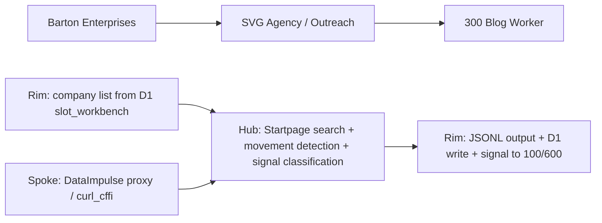
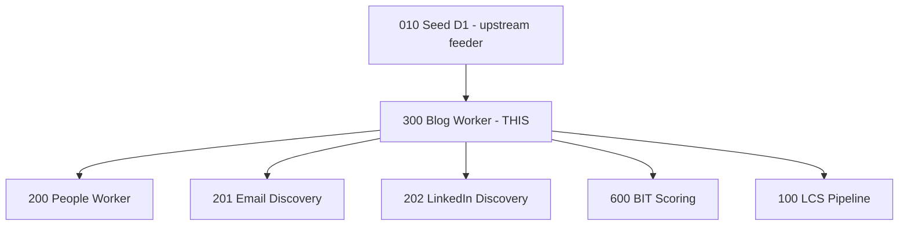

# Blog Worker (Process 300)
## Monthly content movement detector — scans company websites via search engine proxy, detects fresh content, classifies signal type, and feeds signals to LCS Pipeline (100).
### Status: BUILD
### Medium: process
### Business: svg-agency

## UT Checklist (Pre-Flight - per law/UT_CHECKLIST.md v1.2.0)

| # | Check | Status | Location |
|---|-------|--------|----------|
| 1 | PRD - what / why / who / scope / out-of-scope / success metric | [x] | §2 |
| 2 | OSAM - READ / WRITE / Process Composition / Join Chain / Forbidden Paths / Query Routing filled | [x] | §5 |
| 3 | Component Status - every dep has green / yellow / red with 1-line state | [x] | §3 |
| 4 | Owner - human who fixes this at 2 AM | [ ] | §1 — TBV: no named human owner in source fragments |
| 5 | Live Dashboard - URL or explicit "N/A" | [x] | §3 — N/A (local script, no live dashboard) |
| 6 | Kill Switch - exact command to stop the process | [x] | §8 |
| 7 | Logbook - last audit verdict + date (after certification only) | [ ] | §12 — BUILD; no certification yet |
| 8 | FCEs Attached - which FCE runs structurally back this doc | [ ] | §3c — TBV |
| 9 | BARs Referenced - every BAR this doc touches, with status | [x] | §3d |
| 10 | LBB Subjects Fed - which LBB subject(s) this doc's session logs go to | [x] | §3e |
| 11 | Geometry - CTB position + Hub-Spoke role + Altitude | [x] | §1b |
| 12 | Live Verification - every numeric count, cron, URL, command, BAR status grounded against the live system | [x] | §9b |
| 13 | ctb_node - declared path on the Barton Enterprises CTB trunk | [x] | §1 Identity |

## 1. IDENTITY {#sec-1-identity}

| Field | Value |
|-------|-------|
| ID | PROC-300 |
| Name | Blog Worker (Company Reconnaissance + Content Movement) |
| Medium | process |
| Business Silo | svg-agency |
| CTB Position | barton-enterprises → svg-agency → outreach → 300-blog-worker |
| ORBT | BUILD |
| Strikes | 2 (FP-301 RESOLVED, FP-302 RESOLVED) |
| Authority | inherited — imo-creator-v2 (sovereign) + Barton-Processes (parent) |
| Last Modified | 2026-04-02 |
| BAR Reference | BAR-52, BAR-187, BAR-193, BAR-197 |
| Owner | TBV — no named human owner in source fragments |
| ctb_node | barton-enterprises/svg-agency/outreach/300-blog-worker |

### 1b. Geometry {#sec-1b-geometry}

**CTB Position:** barton-enterprises → svg-agency → factory → outreach → 300-blog-worker (leaf)

**Hub-Spoke Role:** spoke — dumb ingress worker. Searches Startpage, detects movement, classifies signals. Passes output to 600-bit-scoring and 100-lcs-pipeline. No logic ownership; transport and detection only at this level.

**Altitude:** 10k operational — owns one leaf-level process (monthly recon + movement detection). Tactical consumers sit at 30k.



### HEIR (8 fields - Aviation Model, Bedrock §8)

| Field | Value |
|-------|-------|
| sovereign_ref | imo-creator-v2 |
| hub_id | 300-blog-worker |
| ctb_placement | leaf |
| imo_topology | spoke |
| cc_layer | CC-04 |
| services | CF Worker (monthly cron), Neon via Hyperdrive, CF fetch (sitemap scanning), Composio → Firecrawl, Composio → ScraperAPI |
| secrets_provider | doppler |
| acceptance_criteria | Monthly sitemap scan compared to previous snapshot; binary movement gate per company; AI classification only on movement=1; errors write to master error table (D1) |

## 2. PURPOSE {#sec-2-purpose}

### WHAT
Process 300 is a monthly content movement detector. It runs a two-phase cycle: Phase 1 queries Startpage via a residential proxy for each company domain, parses search result snippets for freshness indicators (dates, "ago", "this week"), and produces a binary movement flag (0 = stale, 1 = fresh). Phase 2 runs only on movement=1 companies — it fires targeted signal-specific Startpage queries and classifies the content into one of 6 signal types. AI classification is the tail: it reads content and tags the signal type, but the detection is deterministic.

### WHY
Without Process 300, downstream processes 200, 201, 202 start blind — no free data layer, no about_url mapping, no LinkedIn anchors. 300 provides the free reconnaissance pass so paid tools in downstream processes only fill gaps, not the whole picture. Signals from 300 feed BIT scoring (600) and LCS Pipeline (100). If 300 fails, the CID pipeline has no monthly content signals.

### WHO
Dave Barton (General) owns the business outcome. The SVG Agency outreach team consumes the downstream CID signals. LCS Pipeline (100) and BIT scoring (600) are the machine consumers.

### SCOPE (in)
- Monthly Startpage search per company domain (Phase 1: movement detection)
- Binary movement classification (0/1) per company
- Signal type classification for movement=1 companies (Phase 2: 6 signal types)
- Company reconnaissance: about_url discovery, LinkedIn URL capture, name+title extraction, email capture
- Output to local JSONL and D1 slot_workbench

### OUT-OF-SCOPE
- Sitemap XML parsing (not in current implementation — search engine index freshness is the proxy)
- Direct blog scraping (future: Firecrawl/ScraperAPI via Composio, not yet wired)
- Email verification (owned by Process 201)
- LinkedIn enrichment (owned by Process 202)
- CID compilation (owned by Process 100)

### SUCCESS METRIC
Capture rate ≥ 95% (companies returning valid results, not CAPTCHA/error) on each monthly run.

## 3. RESOURCES {#sec-3-resources}

Required doctrine references for every process UT:

- `law/UNIFIED_TEMPLATE.md`
- `law/UT_CHECKLIST.md`
- `law/doctrine/PROCESS_FILL_INSTRUCTIONS.md`
- `law/doctrine/HOW_TO_BUILD_ANYTHING.md` (repair manual)
- `law/doctrine/BARTON_ENTERPRISES_WORLD_ATLAS.md` (Atlas System bundle)
- `law/doctrine/KEY.md`

### Component Status Grid

| Component | HEIR (`hub_id · ctb · cc_layer`) | ORBT | Light | State |
|-----------|----------------------------------|------|-------|-------|
| D1 svg-d1-outreach-ops | outreach-ops · leaf · CC-04 | OPERATE | green | slot_workbench read/write operational; Run 1 completed 2026-04-02 |
| Neon vault (people schema) | neon-vault · leaf · CC-04 | OPERATE | green | Read-only at startup; company list sourced successfully on Run 1 |
| DataImpulse proxy | proxy-router · leaf · CC-04 | OPERATE | yellow | Sticky ports 11000+ required; FP-301 burned port 10100 (RESOLVED) |
| Process 100 (LCS Pipeline) | lcs-pipeline · branch · CC-03 | TBV | yellow | Downstream consumer — signals not yet auto-flowing (manual handoff currently) |
| Process 600 (BIT Scoring) | bit-scoring · branch · CC-03 | TBV | yellow | Downstream consumer — feeds.600 declared in heir.yaml |
| Process 010 (Seed D1) | seed-d1 · leaf · CC-04 | OPERATE | green | Upstream — slot_workbench seeded with 32,556 companies |

### Live Dashboard

| Resource | URL | What it shows |
|----------|-----|---------------|
| Local script output | N/A — local JSONL files in src/output/ | Run-level JSONL per execution |
| D1 workbench | wrangler d1 execute svg-d1-outreach-ops --remote --command "SELECT COUNT(*) FROM slot_workbench WHERE last_recon_at IS NOT NULL" | Companies with completed recon |

### Dependencies

| Dependency | Type | What It Provides | Status |
|-----------|------|-----------------|--------|
| Process 010 (Seed D1) | upstream process | slot_workbench populated with 32,556 companies + domains | DONE |
| D1 svg-d1-outreach-ops | database | slot_workbench — company constants + recon write target | DONE |
| Neon vault (people.v_territory_companies + cl.company_identity) | database | Company list with domains at startup | DONE |
| DataImpulse residential proxy | API | Sticky-session residential IPs to avoid CAPTCHA | DONE |
| Startpage | search engine | Google results anonymized — no CAPTCHA, no API key needed | DONE |
| Firecrawl via Composio | API (not yet wired) | JS-heavy page scraping fallback | PENDING |
| ScraperAPI via Composio | API (not yet wired) | Anti-bot bypass fallback | PENDING |

### Downstream Consumers

| Consumer | What It Needs |
|----------|--------------|
| Process 200 (People Worker) | about_url, recon_name_titles, recon_linkedin_people — free data for slot filling |
| Process 201 (Email Discovery) | recon_emails — free email addresses found during recon |
| Process 202 (LinkedIn Discovery) | recon_organized_linkedin — anchor LinkedIn URLs for enrichment |
| Process 600 (BIT Scoring) | Content movement signals |
| Process 100 (LCS Pipeline) | Content movement signals for CID compilation |

### Tools & Integrations

| Item | Type | Cost Tier | Credentials | What It Does |
|------|------|-----------|-------------|-------------|
| Startpage | Search engine | Free (no API key) | None | Natural language search — one query per company |
| DataImpulse | Proxy | Cheap ($1/GB) | PROXY_USER, PROXY_PASS (Doppler imo-creator dev) | Residential sticky proxy to avoid CAPTCHA |
| curl_cffi | Library | Free | None | Chrome TLS fingerprint impersonation (chrome131) |
| Python 3 | Runtime | Free | None | company-recon.py, blog-monitor.py, parse-recon.py, store-*.py |
| Firecrawl (via Composio) | API | Cheap | TBV — Composio TOOL-004 | JS-heavy page scraping (not yet wired) |
| ScraperAPI (via Composio) | API | Cheap | TBV — Composio TOOL-005 | Anti-bot bypass (not yet wired) |

### Secrets

| Secret | Doppler Project | Config | Used By |
|--------|----------------|--------|---------|
| PROXY_USER | imo-creator | dev | DataImpulse proxy username (company-recon.py, blog-monitor.py) |
| PROXY_PASS | imo-creator | dev | DataImpulse proxy password |
| DATABASE_URL | imo-creator | dev | Neon vault connection string (startup read) |

### 3c. FCEs Attached

| FCE Name | HEIR (`hub_id · ctb · cc_layer`) | ORBT | Run Directory | Latest P=1 | Rows | Status |
|----------|----------------------------------|------|--------------|------------|------|--------|
| TBV | TBV | TBV | TBV | TBV | TBV | TBV — no FCE runs recorded in source fragments |

### 3d. BARs Referenced

| BAR | Title | HEIR (`bar-id · ctb · cc_layer`) | ORBT | Status | Relation |
|-----|-------|----------------------------------|------|--------|----------|
| BAR-52 | TBV | TBV | TBV | TBV | implements |
| BAR-187 | Logbook format | TBV | TBV | TBV | implements |
| BAR-193 | TBV | TBV | TBV | TBV | implements |
| BAR-197 | about_url scraping / return data structure definition | TBV | TBV | TBV | tracks |

### 3e. LBB Subjects Fed

| LBB Subject | HEIR (`subject-id · ctb · cc_layer`) | ORBT | What This Doc Writes | Frequency |
|-------------|--------------------------------------|------|---------------------|-----------|
| svg-outreach | svg-outreach · branch · CC-03 | OPERATE | Session learnings, run summaries, recon metrics | per-run |
| svg-outreach-proc | svg-outreach-proc · leaf · CC-04 | OPERATE | Process-specific learnings (proxy config, query pattern, parse learnings) | per-run |

## 4. IMO - Input, Middle, Output {#sec-4-imo}

### Two-Question Intake (Bedrock §3)
1. **What triggers this?** Monthly manual run (currently). Future: CF Worker with monthly cron trigger.
2. **How do we get it?** Reads company list from D1 `slot_workbench` (seeded by Process 010). Queries Startpage via DataImpulse residential proxy. Parses HTML snippets with Python regex.

### Input
- ~32,556 companies in D1 `slot_workbench` with `company_name`, `city`, `state`, `domain`
- Neon vault (read-only at startup): `people.v_territory_companies` + `cl.company_identity`
- Previous month's JSONL snapshot (for movement comparison in blog-monitor path)

### Middle

| Step | Input | What Happens | Output | Tool Used |
|------|-------|-------------|--------|-----------|
| 1 | slot_workbench rows (company_name, city, state, domain) | Build query `"{company_name} {city} {state} leadership team contact linkedin"`, search Startpage via DataImpulse sticky proxy (24 parallel workers, ports 11000+, 3s delay, chrome131). Parse raw HTML: extract result URLs, snippets, about_url candidates, LinkedIn URLs, name+title patterns, emails. | Raw JSONL per company + D1 recon columns populated | company-recon.py + parse-recon.py + curl_cffi + DataImpulse |
| 2 | recon_name_titles (JSON array per slot) | C&V three questions on each entry: can NAME it as a person? FORMAT as a title? VALUE filling a position (company name, garbage)? Sort: person+title, LinkedIn slugs, garbage. | recon_organized_people, recon_organized_linkedin, recon_organized_garbage | organizer.py |
| 3 | recon_organized_people (entries with extractable titles) | Match title to role bucket (CEO/CFO/HR/REJECT) via 3-tier: exact dict → regex → RapidFuzz fallback. Confidence 0-100. | Classified candidates with role + confidence per slot | Title Classifier |
| 4 | recon_organized_linkedin (LinkedIn URL slugs) | Parse slug (e.g., "john-smith-12345" → first=John, last=Smith). Strip hex IDs, compare to slot person name. Require last-name match minimum. | LinkedIn → person mappings per slot | parse-recon.py string parsing |
| 5 | Validated candidates from steps 2-4 | Write organized + classified + matched data to workbench with source tracking + timestamps. Update about_url, recon columns, last_recon_at. | Workbench updated; downstream processes consume | store-*.py (multiple scripts) |
| 6 (blog path) | company domains from D1 | Phase 1: query `site:{domain}` on Startpage, check snippets for freshness indicators (dates, "ago", "today", "this week"). Binary output per company. | blog-indicators-YYYY-MM.jsonl (movement=0/1) | blog-monitor.py |
| 7 (blog path) | companies where movement=1 | Phase 2: targeted Startpage queries with signal keywords per signal type. AI reads content and tags signal type (tail only). | blog-signals-YYYY-MM.jsonl | blog-monitor.py + AI classifier |

### Output
- JSONL backup files in `src/output/` (recon-YYYY-MM-DD.jsonl, blog-indicators-YYYY-MM.jsonl, blog-signals-YYYY-MM.jsonl)
- D1 `slot_workbench` updated: `about_url`, `recon_linkedin_company`, `recon_linkedin_people`, `recon_name_titles`, `recon_emails`, `recon_result_urls`, `recon_organized_people`, `recon_organized_linkedin`, `recon_organized_garbage`, `last_recon_at`
- Downstream: 200 (People) reads `recon_organized_people`, 201 (Email) reads `recon_emails`, 202 (LinkedIn) reads `recon_organized_linkedin`, 600/100 receive content movement signals

### Circle (Bedrock §5)
`--stale 90` re-runs companies not searched in 90 days — output feeds back as skip logic on next run. After first pass, `about_url` and LinkedIn URLs become constants (the URL mapping). Each subsequent run is cheaper because the mapping exists. If CAPTCHA rate rises above 10%, the circle reveals the break — trace back through proxy ports, delay, query pattern. Sigma tracking on r(x) across monthly runs: tightening = process stabilizing.

## 5. DATA SCHEMA {#sec-5-data-schema}

### READ Access

| Source | What It Provides | Join Key |
|--------|-----------------|----------|
| `slot_workbench` | company_name, city, state, domain (query inputs) | `outreach_id` |
| `slot_workbench` | existing about_url, last_recon_at (skip/stale logic) | `outreach_id` |
| Neon `people.v_territory_companies` | Company list with agent assignments (startup only) | `company_unique_id` |
| Neon `cl.company_identity` | Canonical name and domain (startup only) | `company_unique_id` |
| Previous JSONL snapshot | Prior month's indicators (movement comparison) | company domain |

### WRITE Access

| Target | What It Writes | When |
|--------|---------------|------|
| `slot_workbench.about_url` | Discovered leadership/team page URLs | After parse step |
| `slot_workbench.recon_linkedin_company` | Company LinkedIn URLs | After parse |
| `slot_workbench.recon_linkedin_people` | People LinkedIn URLs | After parse |
| `slot_workbench.recon_name_titles` | Name + title patterns extracted from snippets | After parse |
| `slot_workbench.recon_emails` | Email addresses found in results | After parse |
| `slot_workbench.recon_result_urls` | All result URLs + snippets | After parse (batched) |
| `slot_workbench.recon_organized_people` | C&V-sorted person entries | After organizer |
| `slot_workbench.recon_organized_linkedin` | Sorted LinkedIn slugs | After organizer |
| `slot_workbench.recon_organized_garbage` | Rejected entries | After organizer |
| `slot_workbench.last_recon_at` | Timestamp of last recon | After store |
| D1 master error table | Errors from any step | On error |
| src/output/blog-indicators-YYYY-MM.jsonl | Binary movement per company | After Phase 1 |
| src/output/blog-signals-YYYY-MM.jsonl | Signal classifications for movement=1 | After Phase 2 |

### Process Composition



| Process ID | Name | Role in Composition | Status |
|-----------|------|---------------------|--------|
| PROC-010 | Seed D1 | Upstream feeder — populates slot_workbench | green |
| PROC-300 | Blog Worker | This process | BUILD |
| PROC-200 | People Worker | Downstream consumer — recon_organized_people | yellow |
| PROC-201 | Email Discovery | Downstream consumer — recon_emails | yellow |
| PROC-202 | LinkedIn Discovery | Downstream consumer — recon_organized_linkedin | yellow |
| PROC-600 | BIT Scoring | Downstream consumer — content movement signals | yellow |
| PROC-100 | LCS Pipeline | Downstream consumer — CID signals | yellow |

### Join Chain

```text
slot_workbench.outreach_id (SPINE)
  -> slot_workbench.company_name + city + state (query inputs)
  -> Startpage search results (transient — parsed to recon columns)
  -> slot_workbench.about_url (leadership page constant after first run)
  -> slot_workbench.recon_linkedin_people (LinkedIn mapping)
  -> slot_workbench.recon_organized_people (C&V-sorted persons)
  -> slot_workbench.recon_organized_linkedin (C&V-sorted LinkedIn)
  -> blog-indicators-YYYY-MM.jsonl (movement gate per company)
    -> blog-signals-YYYY-MM.jsonl (signal classification, movement=1 only)
```

Neon startup join:
```text
cl.company_identity.company_unique_id::text = people.v_territory_companies.company_unique_id
  + ci.company_domain IS NOT NULL AND ci.company_domain != ''
```

### Forbidden Paths

| Action | Why | Rule |
|--------|-----|------|
| Query Neon during WORK phase | D1 only during work; SEED already pulled the data; Neon is vault | D-300-11 |
| Use rotating proxy ports | CAPTCHA blocked; MUST use sticky ports 11000+ | D-300-12 |
| Run 200 before 300 | 300 feeds free data to 200 — always run 300 first | D-300-10 |
| Write directly to Neon | CQRS: leaves write to D1, promote upward via SEED sync | D-300-11 |
| Run AI on movement=0 companies | AI is tail only on movement=1 | D-300-03 |

### Query Routing

| Question | Table | Column |
|----------|-------|--------|
| What's the company name/location? | `slot_workbench` | `company_name`, `city`, `state` |
| Does this company have a team page? | `slot_workbench` | `about_url` |
| What LinkedIn URLs were found? | `slot_workbench` | `recon_linkedin_company`, `recon_linkedin_people` |
| What names/titles were extracted? | `slot_workbench` | `recon_name_titles` |
| When was it last searched? | `slot_workbench` | `last_recon_at` |
| Which companies had content movement? | `src/output/blog-indicators-YYYY-MM.jsonl` | `movement` |
| What signal type was detected? | `src/output/blog-signals-YYYY-MM.jsonl` | `signal_type` |

## 6. DMJ - Define, Map, Join {#sec-6-dmj}

### 6a. DEFINE (Build the Key)

| Element | ID | Format | Description | C or V |
|---------|-----|--------|-------------|--------|
| search_query | REC-01 | TEXT, template: `"{company_name} {city} {state} leadership team contact linkedin"` | Startpage search query — one per company | C |
| outreach_id | REC-02 | TEXT, UUID | Spine join key for slot_workbench | C |
| company_domain | REC-03 | TEXT, FQDN | Company domain used in `site:{domain}` queries | V |
| result_url | REC-04 | TEXT, URL | Search result URL from Startpage | V |
| about_url | REC-05 | TEXT, URL | Discovered leadership/about page URL | V (becomes C after first run) |
| recon_name_title | REC-06 | TEXT, JSON array of {name, title} pairs | Extracted person names and titles | V |
| recon_linkedin_people | REC-07 | TEXT, JSON array of LinkedIn URLs | People LinkedIn URLs from search results | V |
| recon_linkedin_company | REC-08 | TEXT, URL | Company LinkedIn page URL | V |
| recon_email | REC-09 | TEXT, email address | Email address found in search snippets | V |
| movement_flag | REC-10 | INTEGER, 0 or 1 | Binary content movement per company | V |
| signal_type | REC-11 | ENUM: FUNDING_EVENT, ACQUISITION, LEADERSHIP_CHANGE, EXPANSION, RESTRUCTURING, GENERAL_NEWS | Classified signal type (Phase 2 only) | C (taxonomy is constant) |
| proxy_config | REC-12 | STRUCT: {host, port_start, port_gap, delay_mean, delay_std, impersonate} | DataImpulse sticky session configuration | C |

### 6b. MAP (Connect Key to Structure)

| Source | Target | Transform |
|--------|--------|-----------|
| REC-01 search_query | Startpage HTTP request | Direct — send as query string |
| REC-05 about_url | `slot_workbench.about_url` | Direct |
| REC-06 recon_name_title | `slot_workbench.recon_name_titles` | Direct (JSON array) |
| REC-07 recon_linkedin_people | `slot_workbench.recon_linkedin_people` | Direct |
| REC-08 recon_linkedin_company | `slot_workbench.recon_linkedin_company` | Direct |
| REC-09 recon_email | `slot_workbench.recon_emails` | Direct |
| REC-10 movement_flag | `blog-indicators-YYYY-MM.jsonl` | Direct |
| REC-11 signal_type | `blog-signals-YYYY-MM.jsonl` | AI classification → field |
| REC-04 result_url | `slot_workbench.recon_result_urls` | Batch insert (chunked due to payload size) |

### 6c. JOIN (Path to Spine)

| Join Path | Type | Description |
|-----------|------|-------------|
| slot_workbench.outreach_id → all recon columns | direct | Every recon write uses outreach_id as the join key |
| cl.company_identity.company_unique_id → people.v_territory_companies.company_unique_id | direct | Startup Neon join to get company list with domains |
| blog-indicators JSONL → blog-signals JSONL | direct | company domain is the join key between Phase 1 and Phase 2 |

## 7. CONSTANTS & VARIABLES {#sec-7-constants-variables}

### Constants (structure - never changes)

- **Query pattern** (`D-300-01`, `D-300-05`): `"{company_name} {city} {state} leadership team contact linkedin"` — locked after Run 1. One query captures everything.
- **Search engine** (`D-300-05`): Startpage — deterministic, no personalization, no CAPTCHA. Locked vendor.
- **Proxy method** (`D-300-12`): DataImpulse sticky session, ports 11000+, 40-port gap, 3s mean delay, chrome131 impersonation. Locked after FP-301.
- **5-step internal model**: Searcher → Organizer → Classifier → Matcher → Writer. The process structure.
- **Movement detection output** (`D-300-02`): Binary 0/1 per company. No partial values.
- **AI role** (`D-300-03`): Classification tail only on movement=1. Never the detection spine.
- **Signal taxonomy** (`D-300-05`): 6 types: FUNDING_EVENT, ACQUISITION, LEADERSHIP_CHANGE, EXPANSION, RESTRUCTURING, GENERAL_NEWS.
- **Worker config**: 24 parallel workers, 40-port gap, 3s stagger between launches.
- **Organizer taxonomy**: C&V three questions (person? format? value?) — sorting logic is the constant.
- **CQRS rule** (`D-300-11`): D1 only during work phase; Neon is read-only at startup only.
- **Run 300 before 200** (`D-300-10`): Process ordering is a constant.

### Variables (fill - changes every run/cycle)

- Which companies get searched (all on first run, `--stale 90` on subsequent runs)
- What data returns from each Startpage search (per-company results)
- Capture rate per run (C_1 — 95.9% baseline on Run 1)
- CAPTCHA rate per run (C_2 — 3.9% baseline on Run 1)
- Garbage rate per run (C_4 — TBD from Organizer calibration)
- Person extraction rate per run (C_6 — TBD)
- Classifier confidence distribution (C_7, C_8 — TBD)
- Match failure and false positive rate (C_9, C_10 — TBD)
- Proxy cost per run (bandwidth-based, ~$35 for first full run)
- Which companies show movement=1 (changes monthly)
- Signal types detected per run (distribution changes with market events)
- Tolerance values k_i (calibrated through operation)

## 8. STOP CONDITIONS {#sec-8-stop-conditions}

| Condition | Action | Rule |
|-----------|--------|------|
| CAPTCHA rate > 10% | HALT — investigate proxy ports, delay timing, query pattern | D-300-06 |
| Error rate > 5% | HALT — check proxy connectivity, DataImpulse status | D-300-07 |
| Proxy cost > $100 per run | HALT — something is looping or bandwidth leak | D-300-08 |
| D1 write failures > 1% | HALT — batch smaller; SQL payload too large | D-300-09 |
| Movement flag is not 0 or 1 | HALT — binary contract violated | D-300-02 |
| AI invoked on movement=0 company | HALT — AI scope violation | D-300-03 |
| Running 200 before 300 | HALT — process ordering violated | D-300-10 |
| Neon write attempted during work phase | HALT — CQRS violation | D-300-11 |
| Rotating proxy ports used | HALT — proxy config constant violated | D-300-12 |
| Can't answer two-question intake | HALT — process isn't defined | pre-flight |
| Same failure pattern 3× | Troubleshoot/Train → Airworthiness Directive | D-300-13 |

### Kill Switch

```text
# Kill the running Python script (any phase):
kill $(pgrep -f "blog-monitor.py")
kill $(pgrep -f "company-recon.py")

# Verify stopped:
pgrep -f "blog-monitor.py" || echo "stopped"
pgrep -f "company-recon.py" || echo "stopped"
```

## 9. VERIFICATION {#sec-9-verification}

```text
1. python3 src/company-recon.py --limit 20 -> expected: 20 companies searched, JSONL written to src/output/
2. cat src/output/recon-*.jsonl | head -3 -> expected: JSON lines with result_urls, linkedin, names, about_url fields
3. python3 src/parse-recon.py --limit 20 -> expected: parsed name/title/linkedin/email/about_url extractions
4. wrangler d1 execute svg-d1-outreach-ops --remote --command "SELECT about_url, recon_linkedin_people FROM slot_workbench WHERE last_recon_at IS NOT NULL LIMIT 5" -> expected: populated recon columns (non-null)
5. python3 src/blog-monitor.py --limit 10 --phase 1 -> expected: 10 companies with movement=0 or movement=1, blog-indicators JSONL written
6. Check capture rate in output: >=90% OK results (not CAPTCHA/error)
```

### Three Primitives Check (Bedrock §1)
1. **Thing** — Do the companies exist in D1 slot_workbench? Is the DataImpulse proxy reachable? Are ports 11000+ available? Does the previous JSONL snapshot exist for movement comparison?
2. **Flow** — Does the query reach Startpage? Do results come back as HTML? Does the parser extract structured data? Do store scripts write to D1? Do movement signals flow to 100/600?
3. **Change** — Are extracted about_urls real pages? Are LinkedIn URLs valid profiles? Does movement=1 correctly trigger Phase 2? Does Process 200 consume the output?

If any fails → that's the break. Run the Troubleshooting Loop (Bedrock §6). Do not patch. Do not guess.

## 9b. Live Verification Log {#sec-9b-live-verification}

| Claim | Section | Source of Truth | Verification Command | [ ] | Last Check | Value |
|-------|---------|-----------------|----------------------|-----|-----------|-------|
| 32,556 companies in slot_workbench | §4 Input | D1 svg-d1-outreach-ops | `wrangler d1 execute svg-d1-outreach-ops --remote --command "SELECT COUNT(*) FROM slot_workbench WHERE company_name IS NOT NULL"` | [ ] | 2026-04-02 | 32,556 |
| Capture rate ≥ 95% | §10 Analytics | JSONL output + run log | `cat src/output/recon-*.jsonl \| python3 -c "import sys,json; rows=[json.loads(l) for l in sys.stdin]; print(sum(1 for r in rows if r.get('status')=='OK')/len(rows))"` | [ ] | 2026-04-02 | 95.9% |
| CAPTCHA rate ≤ 10% | §8 Stop Conditions | JSONL output | `cat src/output/recon-*.jsonl \| python3 -c "import sys,json; rows=[json.loads(l) for l in sys.stdin]; print(sum(1 for r in rows if r.get('status')=='CAPTCHA')/len(rows))"` | [ ] | 2026-04-02 | 3.9% |
| about_url fill in D1 | §5 WRITE Access | D1 svg-d1-outreach-ops | `wrangler d1 execute svg-d1-outreach-ops --remote --command "SELECT COUNT(*) FROM slot_workbench WHERE about_url IS NOT NULL"` | [ ] | 2026-04-02 | TBV |
| D1 write failures = 0 | §7 Constants (D-300-09) | Run log | Check store-*.py exit codes and error output | [ ] | 2026-04-02 | 0 (FP-302 resolved) |
| Proxy reachable (ports 11000+) | §3 Components | DataImpulse ping | `curl -x http://${PROXY_USER}:${PROXY_PASS}@${PROXY_HOST}:11000 https://www.startpage.com -o /dev/null -s -w "%{http_code}"` | [ ] | TBV | TBV |
| Movement flag is binary 0 or 1 | §7 Constants (D-300-02) | blog-indicators JSONL | `cat src/output/blog-indicators-*.jsonl \| python3 -c "import sys,json; rows=[json.loads(l) for l in sys.stdin]; assert all(r['movement'] in [0,1] for r in rows)"` | [ ] | TBV | TBV |

## 10. ANALYTICS {#sec-10-analytics}

### 10a. Metrics

| Metric | Unit | Baseline | Target | Tolerance |
|--------|------|----------|--------|-----------|
| Capture rate (C_1 inverted: failure_rate) | % failure | 4.1% | ≤5% | >5% = investigate; >10% = HALT |
| CAPTCHA rate (C_2) | % | 3.9% | <5% | >10% = HALT |
| Leadership page discovery | % | 61.2% | ≥60% | <50% = tune query |
| Company LinkedIn discovery | % | 74.7% | ≥50% | — |
| People LinkedIn discovery | % | 86.7% | ≥70% | <50% = add "linkedin" to query |
| Name+title pattern extraction | % | 85.7% | ≥70% | — |
| Email discovery | % | 8.1% | — | bonus metric |
| Error rate | % | 0.2% | <1% | >5% = HALT |
| Runtime | minutes | 105 min (24 workers) | <180 min | — |
| Proxy cost | $/run | ~$35 (~$0.001/co) | <$0.002/co | >$100/run = HALT |
| Write failures (C_11) | count | 0 | 0 | >1% = HALT |
| Orphan rows (C_12) | count | 0 | 0 | >0 = investigate |

### 10b. Sigma Tracking

| Metric | Run 1 (2026-04-02) | Run 2 | Run 3 | Trend | Action |
|--------|-------------------|-------|-------|-------|--------|
| Capture rate | 95.9% | — | — | BASELINE | — |
| CAPTCHA rate | 3.9% | — | — | BASELINE | — |
| Leadership page discovery | 61.2% | — | — | BASELINE | — |
| People LinkedIn | 86.7% | — | — | BASELINE | — |
| Name patterns | 85.7% | — | — | BASELINE | — |
| Error rate | 0.2% | — | — | BASELINE | — |

### 10c. ORBT Gate Rules

| From | To | Gate |
|------|-----|------|
| BUILD | OPERATE | All metrics within tolerance for 3 runs + auditor sign-off |
| OPERATE | REPAIR | Any metric outside tolerance |
| REPAIR | OPERATE | Fix applied + metric back within tolerance + auditor verification |
| Any (Strike 3) | TROUBLESHOOT_TRAIN | Same failure pattern 3× → fleet-wide fix → AD |

## 11. EXECUTION TRACE {#sec-11-execution-trace}

| Field | Format | Required |
|-------|--------|----------|
| trace_id | UUID | Yes |
| run_id | UUID | Yes |
| step | action name | Yes |
| target | measurable | Yes |
| actual | measurable | Yes |
| delta | the gap | Yes |
| status | done / failed / skipped | Yes |
| error_code | text or null | If failed |
| error_message | text or null | If failed |
| tools_used | JSON array | Yes |
| duration_ms | integer | Yes |
| cost_cents | integer | Yes |
| timestamp | ISO-8601 | Yes |
| signed_by | agent or manual | Yes |

### Build Inputs Used

| Source | File | What Was Used |
|--------|------|--------------|
| PROCESS.md | factory/outreach/300-blog-worker/PROCESS.md | §3 IMO, §5 OSAM, §6 DMJ, §9 Smoke Test, §10 Analytics, §11 Execution Trace, §13 Failure Registry, §14 Session Log — Run 1 metrics and trace |
| CLAUDE.md | factory/outreach/300-blog-worker/CLAUDE.md | Two-phase cycle description, signal taxonomy, proxy stack, data sources, known issues |
| heir.yaml | factory/outreach/300-blog-worker/heir.yaml | 8 HEIR fields, acceptance_criteria, movement_detection spec, services, snap_on_tools, feeds |

### Run 1 Summary (2026-04-02)

| Step | Target | Actual | Delta | Status | Timestamp |
|------|--------|--------|-------|--------|-----------|
| Load companies from workbench | 32,556 | 32,556 | 0 | done | 2026-04-02 00:20 |
| Search all companies (24 workers) | <3hrs | 105min | -75min | done | 2026-04-02 02:05 |
| Capture rate | ≥95% | 95.9% | +0.9% | done | 2026-04-02 02:05 |
| CAPTCHA rate | <5% | 3.9% | -1.1% (good) | done | 2026-04-02 02:05 |
| Parse names to slots | — | 2,955 slots filled | — | done | 2026-04-02 14:55 |
| Parse LinkedIn to slots | — | 2,011 slots | — | done | 2026-04-02 14:55 |
| Parse emails to slots | — | 1,153 slots | — | done | 2026-04-02 14:55 |
| Update about_urls | ≥60% | 70.6% | +10.6% | done | 2026-04-02 14:30 |
| Store all recon data to D1 (7 types) | 7/7 | 7/7 | 0 | done | 2026-04-02 15:00 |

### Back-Propagation Check

| Parent Constant | Conflict Check | Result |
|-----------------|----------------|--------|
| CQRS rule (leaves write to D1, promote upward) | D-300-11 enforces no Neon writes during work phase | clean |
| Determinism first (LLM is tail) | D-300-03 and D-300-05 enforce AI as classification tail only | clean |
| Process ordering (300 before 200) | D-300-10 enforces this | clean |

## 12. LOGBOOK (After Certification Only) {#sec-12-logbook}

No logbook during BUILD. Certification pending — auditor sign-off required.

### Birth Certificate (PENDING)

| Field | Value |
|-------|-------|
| heir_ref | PROC-300, outreach, factory/outreach/300-blog-worker |
| orbt_entered | BUILD |
| orbt_exited | OPERATE (pending) |
| action | Pending — first full run passed all metric targets; awaiting auditor sign-off |
| gates_passed | { imo: true, ctb: true, circle: true } — as self-reported; auditor must verify |
| signed_by | Pending |
| signed_at | Pending |

## 13. FLEET FAILURE REGISTRY {#sec-13-fleet-failure-registry}

| Pattern ID | Location | Error Code | First Seen | Occurrences | Strike Count | Status |
|-----------|----------|-----------|-----------|-------------|-------------|--------|
| FP-301 | proxy-router (ports 10100) | PORT_BURNED | 2026-04-01 | 1 | 1 | RESOLVED |
| FP-302 | d1-write (store-results.py) | SQL_PAYLOAD_TOO_LARGE | 2026-04-02 | 1 | 1 | RESOLVED |
| FP-300-01 | src/ tree | VERSION_SPRAWL | 2026-04-28 | 1 | 1 | OPEN — Strike 1 — needs canonical pick (blog-monitor.py vs blog-monitor-v2.py; find-person.py vs find-person-v3.py) |

**FP-301 Detail:** Initial launch used port 10100 with 24 simultaneous connections — all 24 hit same IP pool, burned the range. Fix: switched to ports 11000+ with 40-port gap. Staggered launch by 3s. RESOLVED.

**FP-302 Detail:** recon_result_urls payload (95K+ entries) exceeded D1 single-statement SQL limit. Fix: batch smaller (chunk inserts) or use wrangler --file approach. RESOLVED.

**FP-300-01 Detail:** src/ tree has version sprawl — blog-monitor.py + blog-monitor-v2.py; find-person.py + find-person-v3.py. Canonical script must be picked and the other archived before OPERATE certification.

## 14. SESSION LOG {#sec-14-session-log}

| Date | What Was Done | LBB Record |
|------|---------------|-----------|
| 2026-03-29 | v1-v3 script iterations: Neon→D1 rewire, Startpage proxy fix, direct fetch design | none |
| 2026-04-01 | v4 design session: query pattern locked, 24-worker config, port spacing, parse scripts | none |
| 2026-04-02 | Run 1: full 32,556 company recon. 95.9% capture. All metrics passed. BUILD→OPERATE (pending cert). | a65dd7b1 |
| 2026-04-02 | Math engine integrated: 12 comparators C_i, tolerances k_i, P(x;θ) per step. 5-step model. Organizer added. | a65dd7b1 |
| 2026-04-02 | Organizer ran all 80K slots: 175,340 entries → 83,085 people (47%), 79,628 LinkedIn (45%), 12,627 garbage (7%). | 5db86e97 |
| 2026-04-02 | 1,275 free_extraction garbage records purged from workbench. | 5db86e97 |
| 2026-04-02 | DATA GAP: about_url (69K pages) never scraped. recon_result_urls (93K) never re-parsed. BAR-197 created. | 54f035e9 |
| 2026-04-28 | UT consolidation: PROCESS-UT.md + DOCTRINE.md + orbt.yaml written. Source fragments archived. UT v2.7.0 standard. | pending |

## Document Control

| Field | Value |
|-------|-------|
| Created | 2026-04-28 |
| Last Modified | 2026-04-28 |
| Version | 1.0.0 |
| Template Version | 2.7.0 |
| Medium | process |
| US Validated | pending |
| Governing Engine | law/doctrine/FOUNDATIONAL_BEDROCK.md + law/doctrine/DMJ.md |
