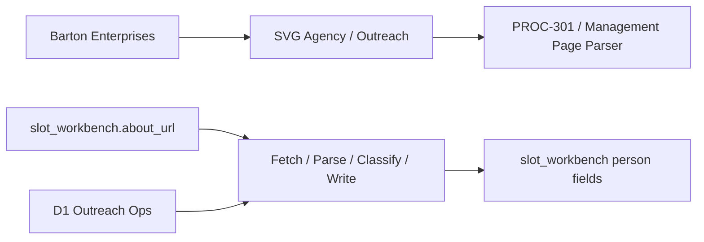
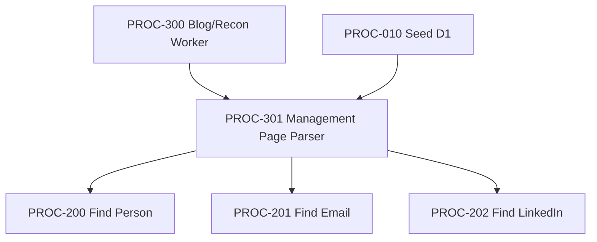

# Management Page Parser
## §1 IDENTITY
Fetches leadership/team pages discovered by Process 300, parses ALL names + titles, and fills CEO/CFO/HR slots — one page fetch, up to three slot fills.
### Status: BUILD
### Medium: process
### Business: svg-agency

## §2 PRD
Section placeholder — content to be filled by process owner.

## §3 RESOURCES
Section placeholder — content to be filled by process owner.

## §4 MIDDLE
Section placeholder — content to be filled by process owner.

## §5 OSAM
Section placeholder — content to be filled by process owner.

## §6 OUTPUT
Section placeholder — content to be filled by process owner.

## §7 GOVERNANCE
Section placeholder — content to be filled by process owner.

## §8 KILL SWITCH
Section placeholder — content to be filled by process owner.

## §9 OBSERVABILITY
Section placeholder — content to be filled by process owner.

## §10 Operations / Schedule {#sec-10-operations}

**Cron classification:** RECURRING-monthly
**Decision date:** 2026-05-08
**Decision authority:** Sovereign (Dave Barton, BAR-MONDAY-16-FLEET-GREEN)

**Schedule:** `0 0 1 * *` (monthly — 1st of month, midnight UTC)
**Implementation:** GitHub Actions cron
**Trigger source (if event-driven):** N/A

---

## §10 LBB SUBJECTS
Section placeholder — content to be filled by process owner.

## §11 OPEN BLOCKERS
Section placeholder — content to be filled by process owner.

## §12 STRIKE LADDER
Section placeholder — content to be filled by process owner.

## §13 BARS
Section placeholder — content to be filled by process owner.

## §14 LOGBOOK
Section placeholder — content to be filled by process owner.

## UT Checklist (Pre-Flight - per law/UT_CHECKLIST.md v1.2.0)

| # | Check | Status | Location |
|---|-------|--------|----------|
| 1 | PRD - what / why / who / scope / out-of-scope / success metric | [x] | §2 |
| 2 | OSAM - READ / WRITE / Process Composition / Join Chain / Forbidden Paths / Query Routing filled | [x] | §5 |
| 3 | Component Status - every dep has green / yellow / red with 1-line state | [x] | §3 |
| 4 | Owner - human who fixes this at 2 AM | [x] | §1 |
| 5 | Live Dashboard - URL or explicit "N/A" | [x] | §3 |
| 6 | Kill Switch - exact command to stop the process | [x] | §8 |
| 7 | Logbook - last audit verdict + date (after certification only) | [ ] | §12 |
| 8 | FCEs Attached - which FCE runs structurally back this doc | [ ] | §3c |
| 9 | BARs Referenced - every BAR this doc touches, with status | [x] | §3d |
| 10 | LBB Subjects Fed - which LBB subject(s) this doc's session logs go to | [x] | §3e |
| 11 | Geometry - CTB position + Hub-Spoke role + Altitude | [x] | §1b |
| 12 | Live Verification - every numeric count, cron, URL, command, BAR status grounded against the live system | [ ] | §9b |
| 13 | ctb_node - declared path on the Barton Enterprises CTB trunk | [x] | §1 Identity |

## 1. IDENTITY {#sec-1-identity}

| Field | Value |
|-------|-------|
| ID | PROC-301 |
| Name | Management Page Parser |
| Medium | process |
| Business Silo | svg-agency |
| CTB Position | barton-enterprises/svg-agency/outreach/factory/301-page-parser (LEAF) |
| ORBT | BUILD |
| Strikes | 0 |
| Authority | inherited - imo-creator-v2 sovereign + Barton-Processes parent |
| Last Modified | 2026-05-08 |
| BAR Reference | BAR-197 |
| Owner | Dave Barton |
| ctb_node | barton-enterprises/svg-agency/outreach/factory/301-page-parser |

### 1b. Geometry {#sec-1b-geometry}

**CTB Position:** barton-enterprises → svg-agency → outreach → factory → 301-page-parser (leaf)

**Hub-Spoke Role:** Hub — this process owns all page-fetch, parse, classify, and write logic. The `src/` scripts are the hub. D1 reads/writes are spokes (dumb transport). No logic lives in the spoke.

**Altitude:** 5k execution — one leaf in the outreach factory chain. Strategic decisions made at 50k (PROC-300 discovers pages, PROC-200 handles fallback); this process executes against a pre-scoped input list.



### HEIR (8 fields - Aviation Model, Bedrock §8)

| Field | Value |
|-------|-------|
| sovereign_ref | imo-creator |
| hub_id | outreach |
| ctb_placement | leaf |
| imo_topology | middle |
| cc_layer | CC-03 |
| services | svg-d1-outreach-ops (D1), DataImpulse (proxy), curl_cffi (fetch) |
| secrets_provider | doppler |
| acceptance_criteria | fetch_failure_rate ≤ 20%; no_names_rate ≤ 40%; write_failure_count = 0; slots_filled_per_company_avg ≥ 1.5; 3 consecutive runs passing all C_i/k_i; auditor sign-off |

## 2. PURPOSE {#sec-2-purpose}

### WHAT
PROC-301 reads `about_url` entries in `slot_workbench` (populated by PROC-300), fetches each page once via curl_cffi with DataImpulse proxy fallback, decomposes the HTML into typed elements using `key_builder_constants.py`, and writes person names + titles into the three slot types (CEO, CFO, HR) in one pass. A single fetch fills up to three slots per company.

### WHY
PROC-300 discovered 69,174 leadership page URLs but never opened them. Those pages already publish the CEO, CFO, and HR director by name and title. Without PROC-301, PROC-200 must run a separate Startpage search per person — three searches per company vs. one page fetch. Every slot PROC-301 fills is a search PROC-200 never has to run. This is a 3× throughput multiplier on the middle of the pipeline.

### WHO
Dave Barton runs this process manually after PROC-300 completes a recon batch. PROC-200 (Find Person), PROC-201 (Find Email), and PROC-202 (Find LinkedIn) consume the output. This doc is read by Dave and any agent running or auditing this process.

### SCOPE (in)
- Fetch `about_url` pages already stored in `slot_workbench`
- Decompose raw HTML into typed element buckets (KB-01 through KB-99)
- Classify elements using `key_builder_constants.py` (person_name, title, email, linkedin_url, phone, company, unidentified)
- Write person names, source flag, and LinkedIn URL to `slot_workbench`
- Classify URLs in `recon_result_urls` by type (company_page, linkedin_profile, directory, noise, etc.) via `classify-urls.py`
- Store ALL elements including unidentified — nothing is discarded
- Run `recalc_tier.py` after writes

### OUT-OF-SCOPE
- Setting `readiness_tier` — computed by `recalc_tier.py` post-write (PROC-010 scope)
- Writing `person_email` — PROC-201's job
- Discovering new about_url values — PROC-300's job
- Searching Startpage for names — PROC-300 (discovery) and PROC-200 Gate C (fallback)
- Scraping LinkedIn directly — ToS violation; only parse /in/ URLs found on company pages

### SUCCESS METRIC
Average slots filled per company ≥ 1.5 across three consecutive runs, with fetch failure rate ≤ 20% and no write errors.

## 3. RESOURCES {#sec-3-resources}

Required doctrine references for every process UT:

- `law/UNIFIED_TEMPLATE.md`
- `law/UT_CHECKLIST.md`
- `law/doctrine/PROCESS_FILL_INSTRUCTIONS.md`
- `law/doctrine/HOW_TO_BUILD_ANYTHING.md` (repair manual)
- `law/doctrine/BARTON_ENTERPRISES_WORLD_ATLAS.md` (Atlas System bundle)
- `law/doctrine/KEY.md`

### Component Status Grid

| Component | HEIR (`hub_id · ctb · cc_layer`) | ORBT | Light | State |
|-----------|----------------------------------|------|-------|-------|
| svg-d1-outreach-ops | outreach · leaf · CC-03 | OPERATE | green | D1 binding live; slot_workbench and about_url populated by PROC-300 |
| PROC-300 (Recon) | outreach · leaf · CC-03 | OPERATE | green | about_url populated for 69,174 companies |
| PROC-010 (Seed) | outreach · leaf · CC-03 | OPERATE | green | Companies + slots seeded in D1 |
| DataImpulse proxy | TBV | OPERATE | yellow | Residential proxy live; $1/GB — verify credits before long runs |
| curl_cffi | TBV | OPERATE | green | Chrome131 impersonation library — no auth required |
| Title Classifier (key_builder_constants.py) | outreach · leaf · CC-03 | BUILD | yellow | Snap-On Tool — defined and tested; identification rate 39% on first run, tighter rules applied |
| recalc_tier.py | outreach · leaf · CC-03 | OPERATE | green | Script runs post-write; no known failures |

### Live Dashboard

| Resource | URL | What it shows |
|----------|-----|---------------|
| D1 Outreach Ops | N/A — query via wrangler CLI | slot_workbench rows with about_url IS NOT NULL |
| JSONL audit output | local file per run | Full parse audit trail per run |

### Dependencies

| Dependency | Type | What It Provides | Status |
|-----------|------|-----------------|--------|
| PROC-300 (Recon) | upstream process | about_url populated in slot_workbench | DONE |
| PROC-010 (Seed) | upstream process | Companies + slots seeded in D1 | DONE |
| svg-d1-outreach-ops (D1) | database | slot_workbench read/write access | DONE |
| DataImpulse | proxy service | Residential proxy for blocked page fetches | DONE |
| curl_cffi | Python library | Chrome131 browser impersonation | DONE |
| key_builder_constants.py | script/snap-on tool | Element classification buckets + rules | DONE |
| recalc_tier.py | script | Tier recalculation post-write | DONE |

### Downstream Consumers

| Consumer | What It Needs |
|----------|--------------|
| PROC-200 (Find Person) | Slots NOT filled by PROC-301 — handles remainder via Startpage search |
| PROC-201 (Find Email) | person_first_name + person_last_name for email pattern generation |
| PROC-202 (Find LinkedIn) | person_first_name + person_last_name for LinkedIn slug matching |

### Tools & Integrations

| Item | Type | Cost Tier | Credentials | What It Does |
|------|------|-----------|-------------|-------------|
| curl_cffi | Python library | Free | None | Chrome131 impersonation for page fetches |
| DataImpulse | Proxy service | Cheap ($1/GB) | PROXY_USER, PROXY_PASS | Residential proxy fallback when direct fetch fails |
| Title Classifier (key_builder_constants.py) | Snap-On Tool | Free | None | Classifies parsed titles → CEO/CFO/HR bucket; 7 buckets + KB-99 unidentified |
| recalc_tier.py | Script | Free | None | Recalculates readiness tiers after every write batch |
| wrangler CLI | D1 interface | Free | CF account | Executes D1 queries in classify-urls.py |

### Secrets

| Secret | Doppler Project | Config | Used By |
|--------|----------------|--------|---------|
| PROXY_USER | imo-creator | dev | DataImpulse proxy auth |
| PROXY_PASS | imo-creator | dev | DataImpulse proxy auth |

### 3c. FCEs Attached

| FCE Name | HEIR (`hub_id · ctb · cc_layer`) | ORBT | Run Directory | Latest P=1 | Rows | Status |
|----------|----------------------------------|------|--------------|------------|------|--------|
| TBV | TBV | TBV | TBV | TBV | TBV | TBV |

### 3d. BARs Referenced

| BAR | Title | HEIR (`bar-id · ctb · cc_layer`) | ORBT | Status | Relation |
|-----|-------|----------------------------------|------|--------|----------|
| BAR-197 | Management Page Parser build | TBV | BUILD | TBV | implements |

### 3e. LBB Subjects Fed

| LBB Subject | HEIR (`subject-id · ctb · cc_layer`) | ORBT | What This Doc Writes | Frequency |
|-------------|--------------------------------------|------|---------------------|-----------|
| svg-outreach | svg-outreach · leaf · CC-03 | BUILD | Session summaries, run results, identification rate learnings | per-run |
| processes | processes · leaf · CC-03 | BUILD | Cross-process learnings (key-builder pattern, funnel approach) | on-change |

## 4. IMO - Input, Middle, Output {#sec-4-imo}

### Two-Question Intake (Bedrock §3)
1. **What triggers this?** — A company in `slot_workbench` where `about_url IS NOT NULL AND has_name = 0`.
2. **How do we get it?** — Fetch the `about_url`, decompose the HTML, classify each element using key_builder_constants.py, quality-gate, organize into `page_contacts`, then slot-fill from `page_contacts` into `slot_workbench`.

### Input
- `slot_workbench.about_url` — leadership/team page URL (discovered by PROC-300)
- `slot_workbench.company_name` — used for cross-validation in name classification
- `slot_workbench.outreach_id` — company join key
- `slot_workbench.slot_type` — CEO/CFO/HR (determines which slot gets filled)
- One fetch per company (not per slot). Extract EVERYTHING, not just target slots.

### Middle

| Step | Input | What Happens | Output | Tool Used |
|------|-------|-------------|--------|-----------|
| 1 FETCHER | about_url per company | Fetch page via curl_cffi Chrome131. Direct first, DataImpulse proxy as fallback. One fetch per company. Store raw HTML. | Raw HTML + fetch_status | curl_cffi + DataImpulse |
| 2 DECOMPOSER | Raw HTML | Break page into individual elements (text block, heading, link, image caption, list item, table cell). Each gets position + tag_type + text_content + href + parent_context. Strip scripts/styles, preserve ALL content. | List of elements [{position, tag_type, text_content, href, parent_context}] | HTML parsing (BeautifulSoup) |
| 3 KEY BUILDER | Decomposed elements | Classify each element into a bucket (KB-01 company, KB-02 position, KB-03 title, KB-04 person_name, KB-05 email, KB-06 linkedin_url, KB-07 phone, KB-99 unidentified). Unidentified elements stored, not discarded. | Page key [{position, tag_type, text_content, classification, confidence}] | key_builder_constants.py classify_element() |
| 4 QUALITY GATE | Page key | Validate identifications via C&V three questions. Cross-check company_name match. Bad identifications downgraded to "unidentified" — still stored. | Validated key (same structure, classifications confirmed or downgraded) | C&V rules |
| 5 ORGANIZER | Validated key | Map identified elements to output columns: KB-04 → person_name (PG-01), KB-03 → person_title (PG-02), KB-06 → LinkedIn (PG-03), KB-05 → email (PG-04). Unidentified → stored in unidentified column. ALL elements stored. | Structured records in page_contacts table | Column mapping |
| 6 SLOT FILLER | page_contacts records | Query page_contacts for this company. Match classified titles to slot_types (CEO/CFO/HR via POSITIONS set). Fill workbench slots. page_contacts is the source of truth; workbench is a view. | slot_workbench person fields updated | D1 write |
| 7 RECALC | All written slot_ids | Run recalc_tier.py on all slots touched. | Readiness tiers updated | recalc_tier.py |

### Output
- `slot_workbench.person_first_name` + `person_last_name` — filled for matched CEO/CFO/HR slots
- `slot_workbench.person_full_name` — combined name
- `slot_workbench.person_source` = `'page_parser_301'`
- `slot_workbench.has_name` = 1 for filled slots
- `slot_workbench.person_found_at` — timestamp
- `slot_workbench.person_linkedin` — if LinkedIn /in/ URL found on page
- `slot_workbench.has_linkedin` = 1 if LinkedIn found
- JSONL output file with full parse audit trail (one record per company)
- Readiness tiers recalculated via recalc_tier.py

### Circle (Bedrock §5)
Slots filled by PROC-301 directly reduce PROC-200's search queue. Sigma tracking on `fetch_failure_rate` and `no_names_rate` identifies pages needing different parsing strategies. If `no_names_rate > 40%` for 3 consecutive runs → investigate whether `about_url` classification in PROC-300 needs tightening. Unidentified element pile is the feedback loop — if a new tool can identify more elements, run the unidentified pile through it without re-fetching pages. The stored key is reusable: PROC-500 (Talent Flow) monthly checks can fetch page + apply stored key + diff values without re-classifying.

## 5. DATA SCHEMA {#sec-5-data-schema}

### READ Access

| Source | What It Provides | Join Key |
|--------|-----------------|----------|
| slot_workbench | about_url, company_name, slot_type, has_name, outreach_id | outreach_id |
| slot_workbench | domain — used by classify-urls.py for company_page detection | outreach_id |
| slot_workbench | recon_result_urls — JSON array of URLs classified by classify-urls.py | outreach_id |

### WRITE Access

| Target | What It Writes | When |
|--------|---------------|------|
| slot_workbench | person_first_name, person_last_name, person_full_name, person_source, has_name, person_found_at | Step 6 — on classified title→slot_type match |
| slot_workbench | person_linkedin, has_linkedin, linkedin_found_at | Step 6 — if LinkedIn /in/ URL found on page |

### Process Composition



| Process ID | Name | Role in Composition | Status |
|-----------|------|---------------------|--------|
| PROC-300 | Blog/Recon Worker | upstream feeder — discovers and stores about_url | OPERATE |
| PROC-010 | Seed D1 | upstream feeder — companies + slots seeded in D1 | OPERATE |
| PROC-301 | Management Page Parser | this process | BUILD |
| PROC-200 | Find Person (Startpage) | downstream consumer — handles slots NOT filled by 301 | TBV |
| PROC-201 | Find Email | downstream consumer — uses first+last from 301 output | TBV |
| PROC-202 | Find LinkedIn | downstream consumer — uses first+last from 301 output | TBV |

### Join Chain

```text
slot_workbench (outreach_id)
  -> about_url fetch (URL key, one per company)
    -> page_contacts (outreach_id, position in page)
      -> slot_workbench person fields (outreach_id + slot_type)
```

### Forbidden Paths

| Action | Why |
|--------|-----|
| Set readiness_tier directly | D-301-05 — tier is computed by recalc_tier.py, not this process |
| Write person_email | D-301-06 — PROC-201's job |
| Search Startpage | D-301-07 — PROC-300 (discovery) and PROC-200 Gate C (fallback) |
| Scrape LinkedIn directly | D-301-08 — ToS violation; only parse /in/ URLs found on company pages |
| Fetch pages not in about_url | D-301-09 — this process reads stored URLs, never discovers new ones |
| Multi-fetch per company | D-301-01 — one fetch per company only |

### Query Routing

| Question | Table | Column |
|----------|-------|--------|
| How many companies have about_url but no name? | slot_workbench | about_url IS NOT NULL AND has_name = 0 |
| How many slots filled by this process? | slot_workbench | person_source = 'page_parser_301' |
| What is the fetch/fill rate? | JSONL audit file | fetch_status, names_found, slots_filled |
| What URL categories exist in recon_result_urls? | classify-urls.py output | category breakdown by company |

## 6. DMJ - Define, Map, Join {#sec-6-dmj}

### 6a. DEFINE (Build the Key)

| Element | ID | Format | Description | C or V |
|---------|-----|--------|-------------|--------|
| Bucket taxonomy | KB-01..KB-07, KB-99 | Enum | 7 named buckets + unidentified; defined in key_builder_constants.py BUCKETS dict | C |
| POSITIONS set | D-301-02 | Set of strings | ~60 position keywords (C-suite, Director, Owner/Founder, Finance, HR, Board) — exact and substring match | C |
| NAME_REJECT_WORDS | D-301-03 | Set of strings | Navigation, company-structure, and generic words rejected from person_name classification | C |
| GENERIC_EMAIL_PREFIXES | D-301-04 | Set of strings | Generic email prefixes (info, contact, admin…) — personal emails only | C |
| URL classification taxonomy | D-301-10 | Enum | 10 URL categories: linkedin_profile, company_page, linkedin_company, directory, job_site, government, academic, social, pdf, noise | C |
| fetch_failure_rate | C_1 | Float 0-1 | % URLs returning error/timeout/404; tolerance k_1=0.20 | V |
| fetch_latency_p95 | C_2 | Integer ms | 95th percentile fetch time; tolerance k_2=15000 | V |
| no_names_rate | C_3 | Float 0-1 | % fetched pages yielding zero names; tolerance k_3=0.40 | V |
| names_per_page_avg | C_4 | Float | Average names extracted per page; target ≥3 | V |
| reject_rate | C_5 | Float 0-1 | % parsed names classified REJECT; tolerance k_5=0.50 | V |
| write_failure_count | C_6 | Integer | D1 write failures; tolerance k_6=ε_k | V |
| slots_filled_per_company_avg | C_7 | Float | Average slots filled per company; target ≥1.5 | V |

### 6b. MAP (Connect Key to Structure)

| Source | Target | Transform |
|--------|--------|-----------|
| KB-04 (person_name) | slot_workbench.person_first_name / person_last_name | Parse: first word → first_name, last word → last_name |
| KB-03 (title) | slot_workbench slot_type match | Classify: POSITION_RE match → CEO/CFO/HR via POSITIONS set |
| KB-06 (linkedin_url) | slot_workbench.person_linkedin | Direct — LINKEDIN_RE match from href or text |
| KB-05 (email) | page_contacts.email (stored only; not written to slot_workbench) | Direct — personal emails only; generic rejected |
| KB-99 (unidentified) | page_contacts.unidentified | Direct — raw text stored, not promoted |
| URL → category | classify-urls.py output | classify_url() function routes to 10-category enum |

### 6c. JOIN (Path to Spine)

| Join Path | Type | Description |
|-----------|------|-------------|
| slot_workbench.outreach_id → page_contacts.outreach_id | direct | Company-level join; one page_contacts record per company per URL |
| page_contacts.outreach_id + slot_type → slot_workbench person fields | direct | Title → slot_type match writes to the correct slot row |
| slot_workbench.domain → classify_url(company_domain) | fuzzy | Domain matching in classify-urls.py to detect company_page category |

## 7. CONSTANTS & VARIABLES {#sec-7-constants-variables}

### Constants (structure - never changes)

Per DOCTRINE.md rules:

- One fetch per company, not per slot (D-301-01) — `multi_fetch_count` comparator, ε_k tolerance
- 7-step pipeline sequence is fixed: Fetch → Decompose → Key Build → Quality Gate → Organize → Slot Fill → Recalc (D-301-02) — `step_skip_count` comparator, ε_k tolerance
- Key Builder constants (BUCKETS, POSITIONS, NAME_REJECT_WORDS, GENERIC_EMAIL_PREFIXES) are structural — locked in key_builder_constants.py; only amended by process owner (D-301-03)
- URL classification taxonomy is fixed at 10 categories (D-301-10) — any new category requires doctrine amendment
- about_url is the only input source — no URL discovery within this process (D-301-09)
- Direct fetch attempted before proxy (D-301-11) — `proxy_first_count` comparator, ε_k tolerance
- Unidentified elements are stored, never discarded (D-301-12) — `discard_count` comparator, ε_k tolerance
- Process does not set readiness_tier (D-301-05) — `tier_set_count` comparator, ε_k tolerance
- Process does not write person_email (D-301-06) — `email_write_count` comparator, ε_k tolerance

### Variables (fill - changes every run/cycle)

- Which companies have empty slots + about_url (changes as other processes fill slots)
- Raw HTML content per company page (different for every company)
- Number of names parsed per page
- Which names match which slot types on a given run
- Fetch success/failure per URL
- Comparator values C_i(x) per run
- Tolerance values k_i (calibrated through operation — initial values set; Phase 1 calibration in progress)

## 8. STOP CONDITIONS {#sec-8-stop-conditions}

| Condition | Action |
|-----------|--------|
| Fetch failure rate > 30% (D-301-13) | HALT — check proxy credentials, check URL quality in about_url |
| No names found on 10 consecutive pages (D-301-14) | HALT — parser HTML patterns may need updating |
| D1 write errors > 1% (D-301-15) | HALT — check D1 connectivity and binding |
| All about_url companies have has_name = 1 | DONE — nothing to process |
| Same failure repeats 3× (Strike 3) | Troubleshoot/Train → Airworthiness Directive |

### Kill Switch

```text
# Interrupt the running Python process:
Ctrl+C

# Or kill by PID:
kill $(pgrep -f "page-parser.py")

# Verify no slots were left in a partial write state:
SELECT COUNT(*) FROM slot_workbench WHERE person_source = 'page_parser_301' AND person_first_name IS NULL;
```

## 9. VERIFICATION {#sec-9-verification}

```text
1. python3 src/page-parser.py --limit 10 -> expected: 10 companies fetched, names parsed, JSONL output written
2. Check output JSONL: names + titles extracted per page, classification buckets populated
3. SELECT person_source, COUNT(*) FROM slot_workbench WHERE person_source = 'page_parser_301' -> expected: > 0
4. Verify recalc_tier ran: SELECT DISTINCT readiness_tier FROM slot_workbench WHERE person_source = 'page_parser_301' -> no NULL tiers
5. python3 src/classify-urls.py --limit 100 -> expected: category breakdown table, HIGH value URL count > 0
```

### Three Primitives Check (Bedrock §1)
1. **Thing** — Do about_url pages exist in slot_workbench? Do they return parseable HTML?
2. **Flow** — Does raw HTML reach the DECOMPOSER? Do classified elements reach the ORGANIZER? Do writes reach D1?
3. **Change** — Are names correctly extracted (not navigation words)? Are titles correctly classified to slot_type? Does recalc_tier update after writes?

## 9b. Live Verification Log {#sec-9b-live-verification}

| Claim | Section | Source of Truth | Verification Command | [ ] | Last Check | Value |
|-------|---------|-----------------|----------------------|-----|-----------|-------|
| about_url rows with has_name=0 exist | §4 Input | D1 slot_workbench | `SELECT COUNT(*) FROM slot_workbench WHERE about_url IS NOT NULL AND has_name = 0` | [ ] | TBV | TBV |
| Slots filled by PROC-301 count | §2 Success Metric | D1 slot_workbench | `SELECT COUNT(*) FROM slot_workbench WHERE person_source = 'page_parser_301'` | [ ] | TBV | TBV |
| Fetch failure rate ≤ 20% | §7 C_1 | JSONL audit file | Count fetch_status=failed / total in last run JSONL | [ ] | TBV | TBV |
| No names rate ≤ 40% | §7 C_3 | JSONL audit file | Count pages with names_found=0 / total fetched in last run | [ ] | TBV | TBV |
| Slots/company avg ≥ 1.5 | §7 C_7 | JSONL audit file | Sum slots_filled / total companies in last run | [ ] | TBV | TBV |
| D1 write errors = 0 | §7 C_6 | JSONL audit file | Count write_error entries in last run JSONL | [ ] | TBV | TBV |
| DataImpulse proxy live | §3 Dependencies | DataImpulse dashboard | Curl test with PROXY_USER/PROXY_PASS against a known URL | [ ] | TBV | TBV |

Rule: at least one live gauge row is required before BUILD can move to OPERATE.

## 10. ANALYTICS {#sec-10-analytics}

### 10a. Metrics

| Metric | Unit | Baseline | Target | Tolerance |
|--------|------|----------|--------|-----------|
| Fetch failure rate (C_1) | % | TBD | ≤ 20% | k_1 = 0.20 |
| Fetch latency p95 (C_2) | ms | TBD | ≤ 15,000ms | k_2 = 15000 |
| No names rate (C_3) | % | TBD | ≤ 40% | k_3 = 0.40 |
| Names per page avg (C_4) | count | TBD | ≥ 3 | k_4 = 1/3 (inverted) |
| Reject rate (C_5) | % | TBD | ≤ 50% | k_5 = 0.50 |
| Write failures (C_6) | count | TBD | 0 | k_6 = ε_k |
| Slots filled per company (C_7) | avg | TBD | ≥ 1.5 | k_7 = 1/1.5 (inverted) |

```
P_301(x;θ) = 1  if  max_i[C_i(x)/k_i] ≤ 1  for i ∈ {1..7}
r(x) = [C_1/k_1, ..., C_7/k_7]   (diagnostic vector)
```

### 10b. Sigma Tracking

| Metric | Run 1 | Run 2 | Run 3 | Trend | Action |
|--------|-------|-------|-------|-------|--------|
| Fetch failure rate | — | — | — | BASELINE | Establish on first production run |
| No names rate | — | — | — | BASELINE | First run showed 94% pages with people (6% no-names) |
| Slots/company avg | — | — | — | BASELINE | Establish on first production run |

Note: First test run (100 pages, 2026-04-03) showed identification rate 39% — "Edit Profile" and "Leadership Team" passing as person names. NAME_REJECT_WORDS tightened. Re-run required before sigma baseline.

### 10c. ORBT Gate Rules

| From | To | Gate |
|------|-----|------|
| BUILD | OPERATE | All C_i/k_i ≤ 1 for 3 consecutive runs + auditor sign-off |
| OPERATE | REPAIR | Any C_i/k_i > 1 in any run |
| REPAIR | OPERATE | Fix applied + metric back within tolerance + auditor verification |
| Any (Strike 3) | TROUBLESHOOT_TRAIN | Same failure pattern 3× → Airworthiness Directive |

## 11. EXECUTION TRACE {#sec-11-execution-trace}

| Field | Format | Required |
|-------|--------|----------|
| trace_id | UUID | Yes |
| run_id | UUID | Yes |
| step | action name | Yes |
| target | measurable | Yes |
| actual | measurable | Yes |
| delta | the gap | Yes |
| status | done / failed / skipped | Yes |
| error_code | text or null | If failed |
| error_message | text or null | If failed |
| tools_used | JSON array | Yes |
| duration_ms | integer | Yes |
| cost_cents | integer | Yes |
| timestamp | ISO-8601 | Yes |
| signed_by | agent or manual | Yes |

### Build Inputs Used

| Source | File | What Was Used |
|--------|------|--------------|
| CLAUDE.md | _archived-fragments/CLAUDE.md | Boundaries, tool list, pre-flight sequence |
| PROCESS.md | _archived-fragments/PROCESS.md | IMO, comparators, constants, stop conditions, session log |
| heir.yaml | heir.yaml | 8-field HEIR identity |
| key_builder_constants.py | src/key_builder_constants.py | BUCKETS, POSITIONS, NAME_REJECT_WORDS, classify_element() |
| classify-urls.py | src/classify-urls.py | URL taxonomy (10 categories), classify_url() |

### Back-Propagation Check

| Parent Constant | Conflict Check | Result |
|-----------------|----------------|--------|
| Bedrock §1 Three Primitives | All 7 comparators trace to Thing/Flow/Change | clean |
| Bedrock §2 C&V | BUCKETS, POSITIONS are named+formatted = constants; values = variables | clean |
| Atlas §1.6 Hub-Spoke | Hub = page-parser logic; spokes = D1 transport; no logic in spokes | clean |
| PROC-300 about_url output → PROC-301 input | PROC-300 OPERATE state confirmed as upstream | clean |

## 12. LOGBOOK (After Certification Only) {#sec-12-logbook}

No logbook during BUILD.

### Birth Certificate

| Field | Value |
|-------|-------|
| heir_ref | TBV — pending certification |
| orbt_entered | BUILD |
| orbt_exited | TBV |
| action | TBV |
| gates_passed | TBV |
| signed_by | TBV |
| signed_at | TBV |

### Logbook (append-only)

| Date | Actor | Action | What Was Done | Evidence | LBB Record |
|------|-------|--------|---------------|----------|------------|
| 2026-04-03 | Dave Barton | BUILD | PROC-301 created; PROCESS.md, heir.yaml, CLAUDE.md authored; 7 comparators defined; key_builder_constants.py written; first 100-page test run | LBB 54f035e9 | 54f035e9 |
| 2026-04-29 | Claude (Sonnet Runner) | BUILD | UT v2.7.0 consolidation — PROCESS-UT.md, DOCTRINE.md, orbt.yaml written; fragments archived | UT consolidation wave 1 | pending |

## 13. FLEET FAILURE REGISTRY {#sec-13-fleet-failure-registry}

| Pattern ID | Location | Error Code | First Seen | Occurrences | Strike Count | Status |
|-----------|----------|-----------|-----------|-------------|-------------|--------|
| FP-301-01 | Step 3 KEY BUILDER | LOOSE_NAME_MATCH | 2026-04-03 | 1 | 0 | RESOLVED — NAME_REJECT_WORDS tightened; re-run required |

## 14. SESSION LOG {#sec-14-session-log}

| Date | Version | Author | Action | Scope |
|------|---------|--------|--------|-------|
| 2026-04-03 | v0.1 | Sonnet Runner | `CREATE` | PROC-301 created via 060 altitude descent. Station added between 300-recon and 200-people. 14-section PROCESS.md, heir.yaml, CLAUDE.md created. 7 comparators defined. LBB: 54f035e9 |
| 2026-04-03 | v0.2 | Sonnet Runner | `AMEND` | Key Builder approach designed: decompose page → identify each element into defined buckets → quality gate → organize → store ALL. Unidentified stored, not discarded. Key reusable for Talent Flow monthly checks. LBB: pending |
| 2026-04-03 | v0.3 | Sonnet Runner | `AMEND` | key_builder_constants.py written: 7 buckets, ~60 position constants, strict name rules (reject navigation/company words). Snap-On Tool — reusable by any page-parsing process. LBB: pending |
| 2026-04-03 | v0.4 | Sonnet Runner | `AMEND` | First run (100 pages): 89 fetched, 84 with people (94%), 4,841 people found. Identification rate 39% — "Edit Profile" and "Leadership Team" passing as person names. NAME_REJECT_WORDS tightened. Re-run needed. LBB: pending |
| 2026-04-03 | v0.5 | Dave Barton | `AMEND` | KEY INSIGHT: Each page gets its own key. Store the key per URL — reusable. Talent Flow monthly checks = fetch page + apply stored key + diff values. LBB: pending |
| 2026-04-03 | v0.6 | Dave Barton | `AMEND` | KEY INSIGHT: Key Builder IS a Snap-On Tool. If current rules insufficient, use sub-hub 27 (Vendor Scout) to find a better driver. Unidentified pile is the funnel — each pass tightens. LBB: pending |
| 2026-04-29 | v1.0.0 | Sonnet Runner (Wave 1 UT Consolidation) | `CREATE` | UT v2.7.0 consolidation. PROCESS-UT.md, DOCTRINE.md, orbt.yaml written. CLAUDE.md and PROCESS.md moved to _archived-fragments/. Locked shape applied. LBB: pending |
| 2026-05-08 | v1.0.1 | Sonnet Mechanic (BAR-MONDAY-16-FLEET-GREEN) | `MIGRATE` | §14 column format migrated to 5-column canonical shape (UT v2.8.0 / Atlas v2.3.0). Version bumped across frontmatter + §1 + Document Control. |
| 2026-05-08 | v2.0.2 | Sonnet Mechanic (BAR-MONDAY-16-FLEET-GREEN) | `STAMP` | §10 Operations/Schedule stamped: RECURRING-monthly `0 0 1 * *` GitHub Actions cron. Frontmatter version corrected from 1.0.1 to match §1/DocCtrl 2.0.1, then bumped to 2.0.2 in all 3 locations. |

^[ROW-2026-04-03a]: 2026-04-03 | PROC-301 created via 060 altitude descent. Station added between 300-recon and 200-people. 14-section PROCESS.md, heir.yaml, CLAUDE.md created. 7 comparators defined. | 54f035e9
^[ROW-2026-04-03b]: 2026-04-03 | Key Builder approach designed: decompose page → identify each element into defined buckets → quality gate → organize → store ALL. Unidentified stored, not discarded. Key reusable for Talent Flow monthly checks. | pending
^[ROW-2026-04-03c]: 2026-04-03 | key_builder_constants.py written: 7 buckets, ~60 position constants, strict name rules (reject navigation/company words). Snap-On Tool — reusable by any page-parsing process. | pending
^[ROW-2026-04-03d]: 2026-04-03 | First run (100 pages): 89 fetched, 84 with people (94%), 4,841 people found. Identification rate 39% — "Edit Profile" and "Leadership Team" passing as person names. NAME_REJECT_WORDS tightened. Re-run needed. | pending
^[ROW-2026-04-03e]: 2026-04-03 | KEY INSIGHT (Dave): Each page gets its own key. Store the key per URL — reusable. Talent Flow monthly checks = fetch page + apply stored key + diff values. | pending
^[ROW-2026-04-03f]: 2026-04-03 | KEY INSIGHT (Dave): Key Builder IS a Snap-On Tool. If current rules insufficient, use sub-hub 27 (Vendor Scout) to find a better driver. Unidentified pile is the funnel — each pass tightens. | pending
^[ROW-2026-04-29]: 2026-04-29 | UT v2.7.0 consolidation (Wave 1). PROCESS-UT.md, DOCTRINE.md, orbt.yaml written. CLAUDE.md and PROCESS.md moved to _archived-fragments/. Locked shape applied. | pending

## Document Control

| Field | Value |
|-------|-------|
| Created | 2026-04-03 |
| Last Modified | 2026-05-08 |
| Version | v2.0.2 |
| Template Version | 2.7.0 |
| Medium | process |
| US Validated | pending |
| Governing Engine | law/doctrine/FOUNDATIONAL_BEDROCK.md + law/doctrine/DMJ.md |
