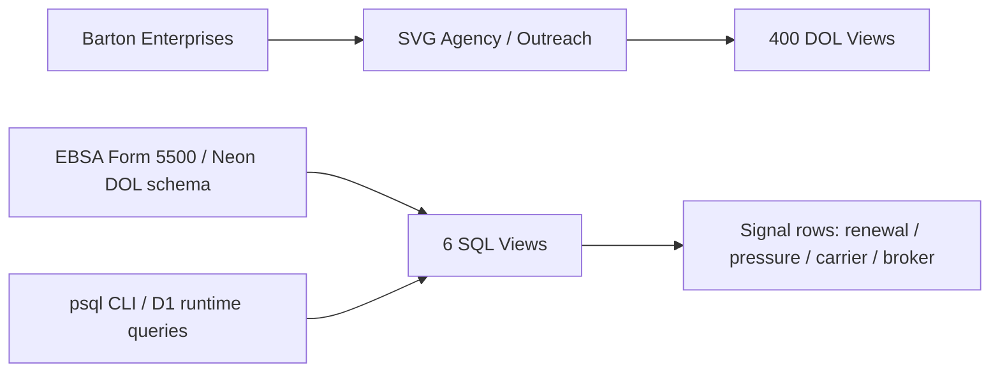
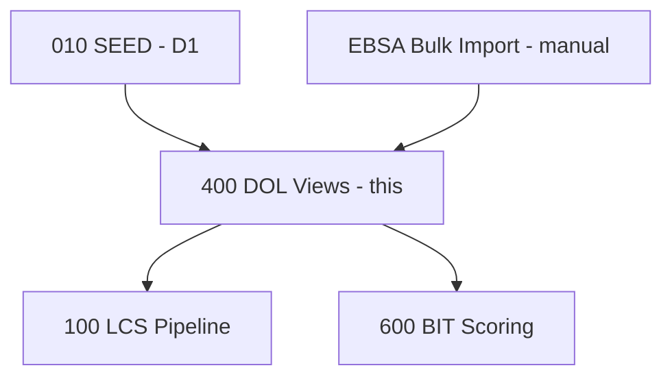

# DOL Views — Process 400
## SQL view library against DOL Form 5500 filing data: 6 read-only views detecting renewal proximity, premium pressure, carrier instability, and broker churn.
### Status: OPERATE
### Medium: process
### Business: svg-agency

## UT Checklist (Pre-Flight - per law/UT_CHECKLIST.md v1.2.0)

| # | Check | Status | Location |
|---|-------|--------|----------|
| 1 | PRD - what / why / who / scope / out-of-scope / success metric | [x] | §2 |
| 2 | OSAM - READ / WRITE / Process Composition / Join Chain / Forbidden Paths / Query Routing filled | [x] | §5 |
| 3 | Component Status - every dep has green / yellow / red with 1-line state | [x] | §3 |
| 4 | Owner - human who fixes this at 2 AM | [x] | §1 |
| 5 | Live Dashboard - URL or explicit "N/A" | [x] | §3 |
| 6 | Kill Switch - exact command to stop the process | [x] | §8 |
| 7 | Logbook - last audit verdict + date (after certification only) | [ ] | §12 |
| 8 | FCEs Attached - which FCE runs structurally back this doc | [ ] | §3c |
| 9 | BARs Referenced - every BAR this doc touches, with status | [x] | §3d |
| 10 | LBB Subjects Fed - which LBB subject(s) this doc's session logs go to | [x] | §3e |
| 11 | Geometry - CTB position + Hub-Spoke role + Altitude | [x] | §1b |
| 12 | Live Verification - every numeric count, cron, URL, command, BAR status grounded against the live system | [x] | §9b |
| 13 | ctb_node - declared path on the Barton Enterprises CTB trunk | [x] | §1 Identity |

## §1 IDENTITY {#sec-1-identity}

| Field | Value |
|-------|-------|
| ID | PROC-400 |
| Name | DOL Views |
| Medium | process |
| Business Silo | svg-agency |
| CTB Position | barton-enterprises / svg-agency / outreach / 400-dol-views |
| ORBT | OPERATE |
| Strikes | 0 |
| Authority | inherited — barton-outreach-core doctrine / imo-creator-v2 sovereign |
| Version | v2.0.5 |
| Last Modified | 2026-05-10 |
| BAR Reference | BAR-49 |
| Owner | Dave Barton |
| ctb_node | barton-enterprises/svg-agency/outreach/400-dol-views |

### 1b. Geometry {#sec-1b-geometry}

**CTB Position:** barton-enterprises → svg-agency → outreach → 400-dol-views (leaf)

**Hub-Spoke Role:** Hub — this process IS the transformation layer. No worker, no cron; the hub is the SQL view definitions and the query interface. Spokes are psql (ad-hoc) and downstream process joins (D1 runtime). Rim = EBSA data in (read boundary), signal rows out (read-only).

**Altitude:** 10k operational — a specific leaf-level view library consumed by LCS Pipeline (Process 100).



### HEIR (8 fields - Aviation Model, Bedrock §8)

| Field | Value |
|-------|-------|
| sovereign_ref | imo-creator-v2 |
| hub_id | 400-dol-views |
| ctb_placement | leaf |
| imo_topology | egress (read-only views against static data) |
| cc_layer | CC-04 |
| services | Neon PostgreSQL (dol schema), Cloudflare D1 (svg-d1-outreach-ops) |
| secrets_provider | doppler |
| acceptance_criteria | All 6 views queryable via Hyperdrive; Gate 3/4/5 evaluable from views; PEPM benchmarking by state/size available |

## §2 PURPOSE {#sec-2-purpose}

### WHAT
This process defines 6 read-only SQL views against DOL Form 5500 annual filing data stored in Neon. Each view computes a specific actionable signal from public EBSA filings: filing existence (Gate 3), renewal proximity (Gate 4), participant-count pressure (Gate 5), PEPM market comparison, carrier switches, and broker churn.

### WHY
DOL Form 5500 filings are the only public dataset revealing what a company spends on employee benefits, which carrier they use, and which broker manages their plan. Without these views, Process 100 (LCS Pipeline) has no DOL intelligence for CID compilation at tiers 2-3 — outreach would run blind against companies with unknown benefits posture.

### WHO
- Process 100 (LCS Pipeline) consumes the view signals for CID compilation
- Process 600 (BIT Scoring) consumes for scoring signals
- Dave Barton / SVG Agency analysts use Neon views for ad-hoc competitive benchmarking

### SCOPE (in)
- 6 read-only SQL views against Neon `dol` schema
- Boolean + numeric signals per EIN: filing status, renewal proximity, premium pressure, market comparison, carrier change, broker change
- D1 runtime tables (4 tables, 171,040 rows seeded 2026-03-25) for LCS use

### OUT-OF-SCOPE
- EBSA bulk download and Neon load (manual import — not owned by this process)
- D1 seeding logic (owned by Process 010 SEED)
- Any writes to DOL tables (CQRS rule — this process is egress only)
- Real-time data (DOL filings lag 6-18 months; this is annual batch only)

### SUCCESS METRIC
All 6 Neon views return non-zero rows for a known-populated state (e.g., WV) with correct boolean signals on a fresh query.

## §3 RESOURCES {#sec-3-resources}

Required doctrine references for every process UT:

- `law/UNIFIED_TEMPLATE.md`
- `law/UT_CHECKLIST.md`
- `law/doctrine/PROCESS_FILL_INSTRUCTIONS.md`
- `law/doctrine/HOW_TO_BUILD_ANYTHING.md` (repair manual)
- `law/doctrine/BARTON_ENTERPRISES_WORLD_ATLAS.md` (Atlas System bundle)
- `law/doctrine/KEY.md`

### Component Status Grid

| Component | HEIR (`hub_id · ctb · cc_layer`) | ORBT | Light | State |
|-----------|----------------------------------|------|-------|-------|
| Neon DOL schema | neon-vault · leaf · CC-04 | OPERATE | green | 432K+ form_5500 rows + 6 views queryable as of 2026-03-19 |
| D1 svg-d1-outreach-ops | d1-outreach · leaf · CC-04 | OPERATE | green | 171,040 rows seeded 2026-03-25 across 4 DOL tables |
| Process 010 SEED | 010-seed-d1 · leaf · CC-04 | OPERATE | green | Completed D1 seed 2026-03-25; re-runs annually after EBSA import |
| Process 100 LCS Pipeline | 100-lcs-pipeline · branch · CC-03 | TBV | yellow | Downstream consumer — status verified separately |

### Live Dashboard

| Resource | URL | What it shows |
|----------|-----|---------------|
| Neon Console | N/A (direct psql) | View row counts and ad-hoc query results |
| D1 Dashboard | N/A (Cloudflare dashboard) | D1 table row counts for dol_* tables |

### Dependencies

| Dependency | Type | What It Provides | Status |
|-----------|------|-----------------|--------|
| EBSA Form 5500 bulk data | External dataset (annual) | Raw DOL filing data loaded into Neon | DONE (loaded) |
| Neon PostgreSQL (dol schema) | Database | Source of truth for all 6 views | DONE |
| D1 svg-d1-outreach-ops | Database | Runtime copy of DOL data for LCS queries | DONE (171,040 rows) |
| Process 010 SEED | Upstream process | Copies DOL data from Neon to D1 | DONE |

### Downstream Consumers

| Consumer | What It Needs |
|----------|--------------|
| Process 100 LCS Pipeline | DOL intelligence for CID compilation — filing status, renewal signals, premium pressure at tiers 2-3 |
| Process 600 BIT Scoring | DOL signals for scoring inputs |
| Ad-hoc Neon queries | Direct view queries for benchmarking and competitive intel |

### Tools & Integrations

| Item | Type | Cost Tier | Credentials | What It Does |
|------|------|-----------|-------------|-------------|
| Neon PostgreSQL | Database | Cheap | DATABASE_URL (Doppler: imo-creator/dev) | Hosts dol schema + 6 views |
| Cloudflare D1 | Database | Free | D1 binding: D1_OUTREACH (73a285b8) | Runtime copy of DOL tables for LCS |
| psql CLI | Tool | Free | DATABASE_URL | Apply views, run ad-hoc queries |

### Secrets

| Secret | Doppler Project | Config | Used By |
|--------|----------------|--------|---------|
| DATABASE_URL | imo-creator | dev | psql for view creation and ad-hoc Neon queries |

### 3c. FCEs Attached

| FCE Name | HEIR (`hub_id · ctb · cc_layer`) | ORBT | Run Directory | Latest P=1 | Rows | Status |
|----------|----------------------------------|------|--------------|------------|------|--------|
| TBV | TBV | TBV | TBV | pending | TBV | TBV |

### 3d. BARs Referenced

| BAR | Title | HEIR (`bar-id · ctb · cc_layer`) | ORBT | Status | Relation |
|-----|-------|----------------------------------|------|--------|----------|
| BAR-49 | DOL Views — SQL library | TBV | OPERATE | TBV | implements |

### 3e. LBB Subjects Fed

| LBB Subject | HEIR (`subject-id · ctb · cc_layer`) | ORBT | What This Doc Writes | Frequency |
|-------------|--------------------------------------|------|---------------------|-----------|
| svg-outreach | svg-outreach · branch · CC-03 | OPERATE | Session summaries, EBSA import events, view refresh notes | on-change (annual) |

## §4 IMO - Input, Middle, Output {#sec-4-imo}

### Two-Question Intake (Bedrock §3)
1. What triggers this? Nothing triggers it on a schedule. Views exist and are queryable on demand. Underlying data refreshes once per year via manual EBSA bulk import.
2. How do we get it? Annual EBSA Form 5500 bulk download, loaded into Neon `dol` schema. D1 seeded from Neon by Process 010.

### Input
EBSA Form 5500 annual bulk filings, loaded manually into Neon `dol` schema. As of 2026-03-25: 432K+ form_5500 rows, 1.5M+ form_5500_sf rows, 625K+ schedule_a rows. D1 runtime copy: 171,040 rows across 4 tables for 27,868 companies.

### Middle

| Step | Input | What Happens | Output | Tool Used |
|------|-------|-------------|--------|-----------|
| 1 | EBSA bulk CSV | Annual Import — download Form 5500 bulk data, load into Neon `dol` schema tables | Neon `dol.*` tables populated | psql / manual load |
| 2 | Neon `dol` tables | View Creation — apply `src/001_dol_views.sql` to create/replace 6 read-only views | 6 queryable views in Neon | `psql -f src/001_dol_views.sql` |
| 3 | Neon `dol` tables | D1 Seed — Process 010 copies DOL data to D1 for runtime access | 4 D1 tables (171,040 rows) | Process 010 SEED |
| 4 | Any SQL query | On-demand read — downstream processes or ad-hoc queries hit views/tables | Signal data (boolean + numeric per EIN) | SQL SELECT / psql |

### Output
6 boolean/numeric signals per EIN: filing status (`has_filing`), renewal proximity (`renewal_approaching`, `days_to_renewal`), premium pressure (`significant_increase`, `significant_decrease`, `pct_change`), PEPM market comparison (`avg_pepm_broker_cost`, `median_pepm_broker_cost`), carrier change (`carrier_changed`), broker change (`broker_changed`). Consumed by Process 100 (LCS Pipeline) for CID tiers 2-3 and Process 600 (BIT Scoring).

### Circle (Bedrock §5)
Annual cycle: EBSA publishes filings (6-18 month lag) → manual import to Neon → Process 010 seeds D1 → views queryable → LCS uses signals for outreach targeting → outreach results inform next year's targeting priorities. Data is static between annual imports — no intra-cycle feedback loop.

## §5 DATA SCHEMA {#sec-5-data-schema}

### READ Access

| Source | What It Provides | Join Key |
|--------|-----------------|----------|
| `dol.form_5500` (Neon) | 432K+ filing records: EIN, form_year, participant count, plan year begin date, state, company name | `sponsor_dfe_ein` (EIN) |
| `dol.schedule_a` (Neon) | 625K+ insurance arrangements: carrier name, covered lives, broker commissions/fees | `ack_id` → `form_5500.ack_id` |
| `dol.schedule_a_part1` (Neon) | Broker name detail rows | `ack_id` + `form_id` → `schedule_a` |
| `dol_form_5500` (D1) | 14,252 filing rows — territory companies | `sponsor_dfe_ein` (EIN) |
| `dol_schedule_a` (D1) | 17,890 broker/insurance detail rows | `ack_id` → `dol_form_5500.ack_id` |
| `dol_schedule_c` (D1) | 33,810 service provider compensation rows | `ack_id` → `dol_form_5500.ack_id` |
| `dol_schedule_other` (D1) | 105,088 other schedule rows (JSON) | `ack_id` → `dol_form_5500.ack_id` |

### WRITE Access

| Target | What It Writes | When |
|--------|---------------|------|
| None | This process is fully read-only | Never — per D-400-01 |

### Process Composition



| Process ID | Name | Role in Composition | Status |
|-----------|------|---------------------|--------|
| PROC-010 | SEED D1 | Upstream feeder — copies Neon DOL data to D1 | green |
| PROC-400 | DOL Views | This process | green |
| PROC-100 | LCS Pipeline | Downstream consumer — DOL signals for tiers 2-3 | TBV |
| PROC-600 | BIT Scoring | Downstream consumer — DOL signals for scoring | TBV |

### Join Chain

```text
dol.form_5500.sponsor_dfe_ein (EIN — universal DOL join key)
  → dol.schedule_a.ack_id = dol.form_5500.ack_id (1:many — filing to insurance arrangements)
    → dol.schedule_a_part1.ack_id = dol.schedule_a.ack_id AND form_id = form_id (broker detail rows)
  → dol.schedule_c.ack_id = dol.form_5500.ack_id (service provider compensation)
outreach_company_target.outreach_id → outreach_dol.outreach_id (D1 — DOL to company target)
dol_form_5500.company_unique_id → territory linkage
```

### Forbidden Paths

| Action | Why |
|--------|-----|
| Write to any DOL table from a view or downstream process | DOL data is source-of-truth from EBSA — INSERT only during annual import (D-400-01) |
| Query Neon at LCS runtime | D1 has the seeded copy; Neon is vault only (D-400-02) |
| Automate the EBSA import | Manual process — data quality review required before load (D-400-03) |
| Join on EIN alone across schedules | Use `ack_id` for filing-level accuracy; EIN matching is imperfect across tables (D-400-04) |

### Query Routing

| Question | Table | Column |
|----------|-------|--------|
| Does this company have DOL filings? | `dol_form_5500` | `sponsor_dfe_ein` (existence check) |
| When is their plan renewal? | `dol_form_5500` | `form_plan_year_begin_date` + 1 year projection |
| Did participant count change YoY? | `dol_form_5500` | `tot_active_partcp_cnt` (compare consecutive `form_year`) |
| What do they pay per employee per month? | `dol_schedule_a` | `(ins_broker_comm_tot_amt + ins_broker_fees_tot_amt) / ins_prsn_covered_eoy_cnt / 12` |
| Did they switch carriers? | `dol_schedule_a` | `ins_carrier_name` (compare consecutive years, same EIN) |
| Did they switch brokers? | `dol_schedule_a_part1` | `ins_broker_name` (compare consecutive years, same EIN) |
| What state are they in? | `dol_form_5500` | `spons_dfe_mail_us_state` |
| What size band? | `dol_form_5500` | `tot_active_partcp_cnt` → SMALL/MID/LARGE/JUMBO |

## §6 DMJ - Define, Map, Join {#sec-6-dmj}

### 6a. DEFINE (Build the Key)

| Element | ID | Format | Description | C or V |
|---------|-----|--------|-------------|--------|
| form_5500 filing record | DOL-01 | D1/Neon row, 20+ columns | Annual Form 5500 filing per EIN per year | C (structure) |
| sponsor_ein | DOL-02 | TEXT, 9-digit EIN | Employer ID — universal DOL join key to company | C |
| ack_id | DOL-03 | TEXT | Filing-level acknowledgment ID — joins form to schedules (1:many) | C |
| form_year | DOL-04 | TEXT (cast to INT for comparison) | Which plan year the filing covers | V |
| renewal_window_threshold | DOL-05 | INTEGER, days | Renewal approaching = within 90 days of projected renewal | C (D-400-05) |
| significant_change_threshold | DOL-06 | NUMERIC, percent | Significant change = >10% YoY participant delta | C (D-400-06) |
| size_band | DOL-07 | ENUM: SMALL/MID/LARGE/JUMBO | Participant count bands for PEPM benchmarking | C (D-400-07) |
| signal_type | DOL-08 | ENUM: 6 values | Signal emitted by each view (RENEWAL_APPROACHING etc.) | C |
| signer_name | DOL-09 | TEXT, LAST FIRST format | Person who signed the filing | V |
| schedule_a_broker | DOL-10 | TEXT, free-form | Broker/advisor from Schedule A | V |

### 6b. MAP (Connect Key to Structure)

| Source | Target | Transform |
|--------|--------|-----------|
| DOL-02 EIN | `slot_workbench.ein` / LCS CID | Direct — universal join key |
| DOL-09 signer_name | People sub-hub (CEO/CFO slot fill) | Parse LAST,FIRST → split → classify |
| DOL-10 broker | `slot_workbench.broker_or_advisor` | Direct |
| DOL-05 threshold (90 days) | `v_dol_renewal_window.renewal_approaching` | Deterministic boolean |
| DOL-06 threshold (10%) | `v_dol_premium_pressure.significant_increase/decrease` | Deterministic boolean |
| DOL-07 size bands | `v_dol_market_comparison.size_band` | CASE classification |

### 6c. JOIN (Path to Spine)

| Join Path | Type | Description |
|-----------|------|-------------|
| `dol_form_5500.sponsor_dfe_ein` → `slot_workbench.ein` | indirect (1 hop via EIN) | EIN bridges DOL to company in outreach spine |
| `dol.form_5500.ack_id` → `dol.schedule_a.ack_id` | direct (1:many) | Filing to insurance arrangement |
| `dol.schedule_a.ack_id + form_id` → `dol.schedule_a_part1` | direct (compound key) | Insurance to broker detail |
| `dol_form_5500.company_unique_id` → territory tables | direct | DOL to territory linkage (partial) |

## §7 CONSTANTS & VARIABLES {#sec-7-constants-variables}

### Constants (structure - never changes)
- 6 views: `v_dol_filing_status`, `v_dol_renewal_window`, `v_dol_premium_pressure`, `v_dol_market_comparison`, `v_dol_carrier_changes`, `v_dol_broker_changes` — per D-400-08
- 6 signal types: RENEWAL_APPROACHING, PREMIUM_INCREASE, CARRIER_CHANGE, BROKER_CHANGE, PLAN_CHANGE, OVERPAYING — per D-400-08
- EIN (`sponsor_dfe_ein`) is the universal DOL join key — per D-400-04
- `ack_id` is the filing-level join key (form to schedules) — per D-400-04
- Renewal window threshold: 90 days — per D-400-05
- Significant change threshold: 10% YoY participant delta — per D-400-06
- Size bands: SMALL (<50), MID (50-199), LARGE (200-999), JUMBO (1000+) — per D-400-07
- Data source: EBSA Form 5500 annual bulk download — per D-400-03
- Detection method: deterministic (compare filing years — no AI required) — per D-400-09
- 4 D1 tables: `dol_form_5500`, `dol_schedule_a`, `dol_schedule_c`, `dol_schedule_other` — per D-400-02
- Views are read-only (no INSERT/UPDATE/DELETE) — per D-400-01

### Variables (fill - changes every run/cycle)
- Which filing year is "current" (depends on EBSA publication lag — typically 6-18 months)
- Row counts in D1 tables (171,040 as of 2026-03-25 — grows with each annual import)
- Which companies have complete schedule_a data (not all filings include broker commissions)
- Which EINs successfully match to `company_unique_id` in the territory
- Actual renewal dates (projected from `form_plan_year_begin_date`, not confirmed)
- PEPM benchmarks per state/size band (shift annually as new filings arrive)
- `form_year` data type (TEXT in some contexts — must cast to INT for YoY comparisons)

## §8 STOP CONDITIONS {#sec-8-stop-conditions}

| Condition | Action |
|-----------|--------|
| EBSA bulk download format changes | HALT — review schema mapping before import (D-400-03 violation) |
| D1 seed row count drops vs. prior year | HALT — investigate missing data before overwriting (D-400-02 violation) |
| EIN-to-company match rate drops below 80% | HALT — review matching logic |
| View returns zero rows for a known-populated state | HALT — schema or join broke |
| `form_year` data type inconsistency (TEXT vs INT) | HALT — cast explicitly, do not assume |
| Annual import not completed by Q2 | FLAG — data is stale, signals may be outdated |
| Any INSERT/UPDATE/DELETE attempted against DOL tables from this process | HALT — D-400-01 violation |
| Same failure repeats 3x | Troubleshoot/Train — produce Airworthiness Directive |

### Kill Switch

```text
# No worker to stop. Process is SQL views — kill switch is to revoke Neon access:
# Revoke DATABASE_URL from Doppler: doppler secrets delete DATABASE_URL --project imo-creator --config dev
# Or drop views: psql $DATABASE_URL -c "DROP VIEW IF EXISTS dol.v_dol_filing_status, dol.v_dol_renewal_window, dol.v_dol_premium_pressure, dol.v_dol_market_comparison, dol.v_dol_carrier_changes, dol.v_dol_broker_changes CASCADE"
```

## §9 VERIFICATION {#sec-9-verification}

```text
1. psql $DATABASE_URL -c "SELECT COUNT(*) FROM dol.form_5500" → expected: 432,000+ rows
2. psql $DATABASE_URL -c "SELECT COUNT(*) FROM dol.v_dol_filing_status" → expected: >0 rows
3. psql $DATABASE_URL -c "SELECT * FROM dol.v_dol_renewal_window WHERE renewal_approaching = true LIMIT 5" → expected: rows with days_to_renewal <= 90
4. psql $DATABASE_URL -c "SELECT * FROM dol.v_dol_carrier_changes WHERE carrier_changed = true LIMIT 5" → expected: rows with differing prev/curr carrier names
5. psql $DATABASE_URL -c "SELECT * FROM dol.v_dol_broker_changes WHERE broker_changed = true LIMIT 5" → expected: rows with differing prev/curr broker names
6. psql $DATABASE_URL -c "SELECT * FROM dol.v_dol_premium_pressure WHERE significant_increase = true LIMIT 5" → expected: pct_change > 10%
7. psql $DATABASE_URL -c "SELECT * FROM dol.v_dol_market_comparison WHERE state = 'WV' LIMIT 5" → expected: PEPM data for WV companies
8. D1: SELECT COUNT(*) FROM dol_form_5500 → expected: ~14,252 rows
9. D1: SELECT COUNT(*) FROM dol_schedule_a → expected: ~17,890 rows
```

### Three Primitives Check (Bedrock §1)
1. Thing — Do the 4 D1 tables exist with data? Do the 6 Neon views exist?
2. Flow — Can a query reach each view and return rows? Does D1 data match Neon source?
3. Change — Do the views correctly compute boolean signals (renewal_approaching, carrier_changed, etc.)?

## §9b Live Verification Log {#sec-9b-live-verification}

| Claim | Section | Source of Truth | Verification Command | [ ] | Last Check | Value |
|-------|---------|-----------------|----------------------|-----|-----------|-------|
| 6 Neon views exist and are queryable | §4 | Neon dol schema | `psql $DATABASE_URL -c "SELECT viewname FROM pg_views WHERE schemaname='dol'"` | [ ] | TBV | TBV |
| form_5500 row count 432K+ | §5 | Neon dol.form_5500 | `psql $DATABASE_URL -c "SELECT COUNT(*) FROM dol.form_5500"` | [ ] | TBV | TBV |
| schedule_a row count 625K+ | §5 | Neon dol.schedule_a | `psql $DATABASE_URL -c "SELECT COUNT(*) FROM dol.schedule_a"` | [ ] | TBV | TBV |
| D1 dol_form_5500 ~14,252 rows | §5 | D1 svg-d1-outreach-ops | `SELECT COUNT(*) FROM dol_form_5500` (D1 console) | [ ] | 2026-03-25 | 14,252 |
| D1 dol_schedule_a ~17,890 rows | §5 | D1 svg-d1-outreach-ops | `SELECT COUNT(*) FROM dol_schedule_a` (D1 console) | [ ] | 2026-03-25 | 17,890 |
| renewal_approaching returns rows | §5 | v_dol_renewal_window | `psql $DATABASE_URL -c "SELECT COUNT(*) FROM dol.v_dol_renewal_window WHERE renewal_approaching=true"` | [ ] | TBV | TBV |
| carrier_changed returns rows | §5 | v_dol_carrier_changes | `psql $DATABASE_URL -c "SELECT COUNT(*) FROM dol.v_dol_carrier_changes WHERE carrier_changed=true"` | [ ] | TBV | TBV |
| broker_changed returns rows | §5 | v_dol_broker_changes | `psql $DATABASE_URL -c "SELECT COUNT(*) FROM dol.v_dol_broker_changes WHERE broker_changed=true"` | [ ] | TBV | TBV |

Rule: at least one live gauge row is required before BUILD can move to OPERATE.

## §10 Operations / Schedule {#sec-10-operations}

**Cron classification:** EVENT-DRIVEN
**Decision date:** 2026-05-08
**Decision authority:** Sovereign (Dave Barton, BAR-MONDAY-16-FLEET-GREEN)

**Schedule:** N/A — event-driven
**Implementation:** SQL view refresh (read-only views, no cron)
**Trigger source (if event-driven):** DOL Form 5500 data ingestion / query-time execution

---

## §10 ANALYTICS {#sec-10-analytics}

### 10a. Metrics

| Metric | Unit | Baseline | Target | Tolerance |
|--------|------|----------|--------|-----------|
| Companies with DOL filings | count | TBV | >27,000 (seeded territory) | ±5% per annual cycle |
| Renewal approaching count | count | TBV | >0 (seasonal) | context-dependent |
| Carrier changes detected | count | TBV | >0 | context-dependent |
| Broker changes detected | count | TBV | >0 | context-dependent |
| Premium pressure detected | count | TBV | >0 | context-dependent |
| View query latency | ms | TBV | <2000ms per view | red if >5000ms |
| D1 row count (dol_form_5500) | count | 14,252 (2026-03-25) | grows with annual import | must not decrease |
| EIN-to-company match rate | percent | TBV | >80% | red if <80% (D-400-10) |

### 10b. Sigma Tracking

| Metric | Run 1 | Run 2 | Run 3 | Trend | Action |
|--------|-------|-------|-------|-------|--------|
| D1 row count | 171,040 (2026-03-25) | TBV | TBV | TBV | Track annually |
| View query latency | TBV | TBV | TBV | TBV | Monitor on-demand |

### 10c. ORBT Gate Rules

| From | To | Gate |
|------|-----|------|
| BUILD | OPERATE | all 6 views queryable + D1 seed complete + at least one signal returns non-zero rows + auditor sign-off |
| OPERATE | REPAIR | any view returns zero rows for known-populated state OR D1 count drops |
| REPAIR | OPERATE | fix + view verified + auditor verification |
| Any (Strike 3) | TROUBLESHOOT_TRAIN | fleet-wide fix → Airworthiness Directive |

## §11 EXECUTION TRACE {#sec-11-execution-trace}

| Field | Format | Required |
|-------|--------|----------|
| trace_id | UUID | Yes |
| run_id | UUID | Yes |
| step | action name | Yes |
| target | measurable | Yes |
| actual | measurable | Yes |
| delta | the gap | Yes |
| status | done / failed / skipped | Yes |
| error_code | text or null | If failed |
| error_message | text or null | If failed |
| tools_used | JSON array | Yes |
| duration_ms | integer | Yes |
| cost_cents | integer | Yes |
| timestamp | ISO-8601 | Yes |
| signed_by | agent or manual | Yes |

### Build Inputs Used

| Source | File | What Was Used |
|--------|------|--------------|
| CLAUDE.md | `_archived-fragments/CLAUDE.md` | Process description, 6 views, signal types, dependencies, known issues |
| PROCESS.md | `_archived-fragments/PROCESS.md` | IMO, OSAM, DMJ, constants/variables, stop conditions, smoke tests, logbook |
| heir.yaml | `heir.yaml` | HEIR fields, acceptance criteria, feeds/depends_on |
| src/001_dol_views.sql | `src/001_dol_views.sql` | SQL view definitions and join logic |

### Back-Propagation Check

| Parent Constant | Conflict Check | Result |
|-----------------|----------------|--------|
| Bedrock §1 (Three Primitives) | Views follow Thing/Flow/Change — existence, query reach, transformation | clean |
| Bedrock CQRS rule | No writes in views confirmed — read-only SQL SELECT only | clean |
| Atlas §1.6 (sovereign isolation) | Process self-contained — no cross-silo references | clean |

## §12 LOGBOOK (After Certification Only) {#sec-12-logbook}

No logbook during BUILD. This process is in OPERATE — logbook promoted from PROCESS.md historical entries.

### Birth Certificate

| Field | Value |
|-------|-------|
| heir_ref | PROC-400 · 400-dol-views · leaf · CC-04 |
| orbt_entered | BUILD |
| orbt_exited | OPERATE |
| action | Certified — 6 views created (2026-03-19), D1 seed complete (2026-03-25) |
| gates_passed | { imo: true, ctb: true, circle: true } |
| signed_by | Dave Barton (process owner) |
| signed_at | 2026-03-25 |

### Logbook (append-only)

| Date | Actor | Action | What Was Done | Evidence | LBB Record |
|------|-------|--------|---------------|----------|------------|
| 2026-03-19 00:00 UTC | Dave Barton | BUILD | 6 SQL views created against Neon DOL schema | psql applied src/001_dol_views.sql | none |
| 2026-03-25 00:00 UTC | Process 010 SEED | BUILD→OPERATE | 171,040 rows seeded to D1 across 4 tables (27,868 companies) | session/2026-03-25 | session/2026-03-25 |
| 2026-03-29 00:00 UTC | Dave Barton | BUILD | PROCESS.md written from template v2.0.0 | PROCESS.md v1.1.0 | none |
| 2026-04-29 00:00 UTC | Sonnet Runner | BUILD | Consolidated to UT v2.7.0 lock shape — PROCESS.md + CLAUDE.md archived | UT consolidation Wave 1 Packet 9 | pending |

## §13 FLEET FAILURE REGISTRY {#sec-13-fleet-failure-registry}

| Pattern ID | Location | Error Code | First Seen | Occurrences | Strike Count | Status |
|-----------|----------|-----------|-----------|-------------|-------------|--------|
| FP-400-01 | dol.schedule_a / form_5500 join | EIN_MISMATCH | 2026-03-19 | 1 | 0 | RESOLVED — use ack_id join |
| FP-400-02 | dol_form_5500.company_unique_id | PARTIAL_MATCH | 2026-03-25 | 1 | 0 | OPEN — accept partial, improve in future SEED |
| FP-400-03 | form_year comparisons | TYPE_MISMATCH | 2026-03-25 | 1 | 0 | RESOLVED — explicit cast to INT in views |
| FP-400-04 | v_dol_market_comparison PEPM | NULL_BROKER_DATA | 2026-03-25 | 1 | 0 | RESOLVED — NULL filtered in view |
| FP-400-05 | Renewal window projection | ESTIMATED_DATE | 2026-03-25 | 1 | 0 | OPEN — accepted limitation, projections not confirmed |

## §14 SESSION LOG {#sec-14-session-log}

| Date | Version | Author | Action | Scope |
|------|---------|--------|--------|-------|
| 2026-03-19 | v0.1 | Sonnet Runner | `CREATE` | 6 SQL views created in Neon against DOL schema |
| 2026-03-25 | v0.2 | Sonnet Runner | `AMEND` | 171,040 rows seeded to D1 via Process 010; OPERATE state reached. LBB: session/2026-03-25 |
| 2026-03-29 | v1.0.0 | Sonnet Runner | `CREATE` | PROCESS.md written from template v2.0.0 |
| 2026-04-29 | v2.0.0 | Sonnet Runner (Wave 1 UT Consolidation) | `CREATE` | UT v2.7.0 consolidation — PROCESS.md + CLAUDE.md archived; PROCESS-UT.md + DOCTRINE.md + orbt.yaml written. LBB: pending |
| 2026-05-08 | v2.0.1 | Sonnet Mechanic (BAR-MONDAY-16-FLEET-GREEN) | `MIGRATE` | §14 column format migrated to 5-column canonical shape (UT v2.8.0 / Atlas v2.3.0). Version bumped across frontmatter + §1 + Document Control. |
| 2026-05-08 | v2.0.2 | Sonnet Mechanic (BAR-MONDAY-16-FLEET-GREEN) | `STAMP` | §10 Operations/Schedule stamped: EVENT-DRIVEN SQL view refresh (no cron). Version bumped in 3 locations. |
| 2026-05-08 | v2.0.3 | Sonnet Mechanic (BAR-MONDAY-16-FLEET-GREEN) | `AMEND` | G03: services field added to outside.heir frontmatter: [neon-postgresql, svg-d1-outreach-ops] (sourced from §1 Identity services row). Version bumped in 2 locations (no §1 Version row). |
| 2026-05-10 | `v2.0.4` | BAR-FLEET-OVERNIGHT WO-2 | Sonnet Mechanic | `AUDIT_LOGBOOK` — overnight 16-process readiness sweep audit (a57f0f541e0d0b5cd, READ-ONLY). Finding: Neon-side pg_cron / scheduled function in dol_views schema. Internal. Actual Neon-side trigger config NOT in this repo (UNKNOWN #6 in walkthrough queue). Version bump (3 locations) per memory feedback_pair_version_with_last_modified. | §14 + Document Control |
| 2026-05-10 | `v2.0.5` | BAR-FLEET-OVERNIGHT Strike-1 repair | Sonnet Mechanic | `AMEND` — added §1 Identity Version row to satisfy Codex G-VERSION-3-LOCATIONS gate. Version bumped patch-level (3 locations now consistent). | §1 Identity + §14 + Document Control |

^[ROW-2026-03-19]: 2026-03-19 | 6 SQL views created in Neon against DOL schema | none
^[ROW-2026-03-25]: 2026-03-25 | 171,040 rows seeded to D1 via Process 010; OPERATE state reached | session/2026-03-25
^[ROW-2026-03-29]: 2026-03-29 | PROCESS.md written from template v2.0.0 | none
^[ROW-2026-04-29]: 2026-04-29 | UT v2.7.0 consolidation — PROCESS.md + CLAUDE.md archived; PROCESS-UT.md + DOCTRINE.md + orbt.yaml written | pending

## Document Control

| Field | Value |
|-------|-------|
| Created | 2026-03-29 |
| Last Modified | 2026-05-10 |
| Version | v2.0.5 |
| Template Version | 2.7.0 |
| Medium | process |
| US Validated | pending |
| Governing Engine | law/doctrine/FOUNDATIONAL_BEDROCK.md + law/doctrine/DMJ.md |
