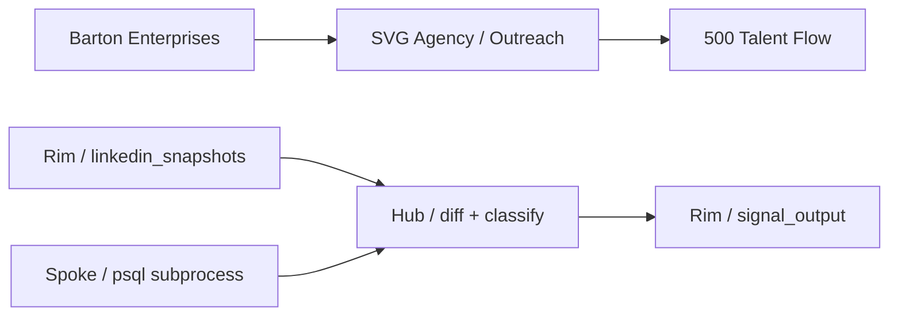
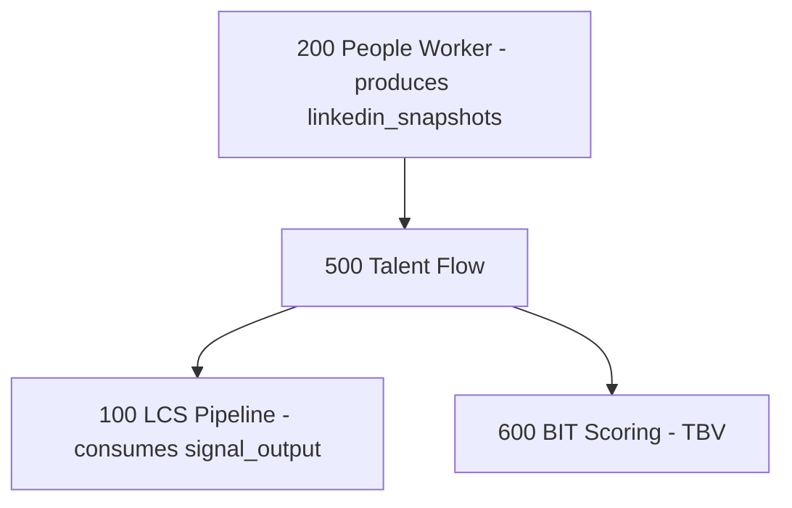

# Talent Flow
## Movement detection engine for executive slot changes — if we can't see who moved, we're selling blind
### Status: BUILD
### Medium: process
### Business: svg-agency

## UT Checklist (Pre-Flight - per law/UT_CHECKLIST.md v1.2.0)

| # | Check | Status | Location |
|---|-------|--------|----------|
| 1 | PRD - what / why / who / scope / out-of-scope / success metric | [x] | §2 |
| 2 | OSAM - READ / WRITE / Process Composition / Join Chain / Forbidden Paths / Query Routing filled | [x] | §5 |
| 3 | Component Status - every dep has green / yellow / red with 1-line state | [x] | §3 |
| 4 | Owner - human who fixes this at 2 AM | [x] | §1 |
| 5 | Live Dashboard - URL or explicit "N/A" | [x] | §3 |
| 6 | Kill Switch - exact command to stop the process | [x] | §8 |
| 7 | Logbook - last audit verdict + date (after certification only) | [ ] | §12 |
| 8 | FCEs Attached - which FCE runs structurally back this doc | [x] | §3c |
| 9 | BARs Referenced - every BAR this doc touches, with status | [x] | §3d |
| 10 | LBB Subjects Fed - which LBB subject(s) this doc's session logs go to | [x] | §3e |
| 11 | Geometry - CTB position + Hub-Spoke role + Altitude | [x] | §1b |
| 12 | Live Verification - every numeric count, cron, URL, command, BAR status grounded against the live system | [x] | §9b |
| 13 | ctb_node - declared path on the Barton Enterprises CTB trunk | [x] | §1 Identity |

## §1 IDENTITY {#sec-1-identity}

| Field | Value |
|-------|-------|
| ID | PROC-500 |
| Name | Talent Flow |
| Medium | process |
| Business Silo | svg-agency |
| CTB Position | factory → outreach → 500-talent-flow (leaf) |
| ORBT | BUILD |
| Strikes | 0 |
| Authority | inherited — barton-outreach-core + imo-creator-v2 sovereign |
| Last Modified | 2026-05-10 |
| BAR Reference | BAR-50 |
| Owner | Dave Barton |
| ctb_node | barton-enterprises/svg-agency/outreach/talent-flow |

### 1b. Geometry {#sec-1b-geometry}

**CTB Position:** barton-enterprises → svg-agency → outreach → 500-talent-flow

**Hub-Spoke Role:** Spoke — pure sensor/diff process. Reads Process 200's snapshot output, classifies signals, writes to outreach.signal_output. No logic hub of its own; feeds the LCS Pipeline hub (100).

**Altitude:** 10k operational — leaf-level monthly sensor producing discrete binary signals per executive slot



### HEIR (8 fields - Aviation Model, Bedrock §8)

| Field | Value |
|-------|-------|
| sovereign_ref | imo-creator-v2 |
| hub_id | PROC-TALENT-FLOW |
| ctb_placement | leaf |
| imo_topology | spoke |
| cc_layer | CC-04 |
| services | Python 3 script (monthly cron, manual trigger); Neon via DATABASE_URL |
| secrets_provider | doppler |
| acceptance_criteria | Runs AFTER 200-people-worker completes monthly refresh; compares current vs previous People snapshot; emits TF-01/TF-02 signals for executive movement; snapshot gate enforced (count=0 → HALT); dedup via ON CONFLICT DO NOTHING |

## §2 PURPOSE {#sec-2-purpose}

### WHAT
Talent Flow is a monthly snapshot-diff sensor that reads Process 200's LinkedIn snapshot data, compares it month-over-month against stored people records, and emits deterministic movement signals (TF-01 EXECUTIVE_JOINED, TF-02 EXECUTIVE_LEFT) for CEO, CFO, and HR slots in territory companies.

### WHY
If Process 200 fills the slots but nobody watches for changes, the LCS Pipeline (100) outreaches to ghosts — wrong name, wrong title, wrong company. Talent Flow closes the loop: movement signals adjust CID priority so sales works on live targets.

### WHO
Downstream: Process 100 (LCS Pipeline) consumes signals from outreach.signal_output. Process owner and Dave Barton read this doc.

### SCOPE (in)
- Monthly diff of linkedin_snapshots against people_master and company_slot
- Signal classification: TF-01 (title changed at same company), TF-02 (company changed or both changed)
- Territory filter: only companies in v_territory_companies
- Executive filter: CEO, CFO, HR slots only
- Dedup enforcement: one signal per outreach_id per signal_code per run_month

### OUT-OF-SCOPE
- Cascade discovery (TF-03 DISPLACE, TF-04 CASCADE) — BAR-50 scope, not yet implemented
- ICP gate for cascade targets (50–5,000 employees, 6 target states) — BAR-50 scope
- Clay.com integration for unknown company lookup — BAR-50 scope
- D1 workspace writes — currently writes directly to Neon; SEED-WORK-PUSH pattern is a known future fix
- Converting to a CF Worker — currently a Python script; future state only

### SUCCESS METRIC
Monthly signal count > 0 when Process 200 has produced snapshots, with classification deviation count = 0 and write failure count = 0.

## §3 RESOURCES {#sec-3-resources}

Required doctrine references for every process UT:

- `law/UNIFIED_TEMPLATE.md`
- `law/UT_CHECKLIST.md`
- `law/doctrine/PROCESS_FILL_INSTRUCTIONS.md`
- `law/doctrine/HOW_TO_BUILD_ANYTHING.md` (repair manual)
- `law/doctrine/BARTON_ENTERPRISES_WORLD_ATLAS.md` (Atlas System bundle)
- `law/doctrine/KEY.md`

### Component Status Grid

| Component | HEIR (`hub_id · ctb · cc_layer`) | ORBT | Light | State |
|-----------|----------------------------------|------|-------|-------|
| Process 200 (People Worker) | PROC-200 · leaf · CC-04 | BUILD | yellow | Upstream dependency; must complete monthly LinkedIn refresh before this runs |
| Neon (Marketing DB) | TBV · leaf · CC-04 | OPERATE | green | people.* tables and outreach.signal_output available |
| psql CLI | TBV · leaf · CC-04 | OPERATE | green | Installed on execution machine |
| Python 3 | TBV · leaf · CC-04 | OPERATE | green | Available on execution machine |
| Process 100 (LCS Pipeline) | PROC-100 · leaf · CC-04 | BUILD | yellow | Downstream consumer of signal_output |

### Live Dashboard

| Resource | URL | What it shows |
|----------|-----|---------------|
| Neon console | TBV | Table row counts for linkedin_snapshots, signal_output |
| Local run output | N/A (stdout) | Snapshot count, movement count, signal summary per run |

### Dependencies

| Dependency | Type | What It Provides | Status |
|-----------|------|-----------------|--------|
| Process 200 (People Worker) | process | linkedin_snapshots rows for target month | BUILD |
| Neon PostgreSQL (Marketing DB) | database | people.* read tables + outreach.signal_output write | DONE |
| psql CLI | runtime | SQL execution against Neon | DONE |
| Python 3 | runtime | Script execution, argument parsing | DONE |
| DATABASE_URL env var | secret | Neon connection string | DONE |

### Downstream Consumers

| Consumer | What It Needs |
|----------|--------------|
| Process 100 (LCS Pipeline) | TF-01 and TF-02 signal rows from outreach.signal_output; adjusts CID priority |
| Process 600 (BIT Scoring) | TBV — heir.yaml lists 600 as a feed target |

### Tools & Integrations

| Item | Type | Cost Tier | Credentials | What It Does |
|------|------|-----------|-------------|-------------|
| Neon PostgreSQL | database | Free | DATABASE_URL (Doppler: imo-creator → dev) | All people table reads + signal_output writes via psql |
| Python 3 | local runtime | Free | None | Script execution, argument parsing, signal classification |
| psql CLI | local runtime | Free | Embedded in DATABASE_URL | SQL query execution against Neon |

### Secrets

| Secret | Doppler Project | Config | Used By |
|--------|----------------|--------|---------|
| DATABASE_URL | imo-creator | dev | psql subprocess — Neon connection string |

### 3c. FCEs Attached

| FCE Name | HEIR (`hub_id · ctb · cc_layer`) | ORBT | Run Directory | Latest P=1 | Rows | Status |
|----------|----------------------------------|------|--------------|------------|------|--------|
| TBV | TBV | TBV | TBV | TBV | TBV | red — no FCE run yet |

### 3d. BARs Referenced

| BAR | Title | HEIR (`bar-id · ctb · cc_layer`) | ORBT | Status | Relation |
|-----|-------|----------------------------------|------|--------|----------|
| BAR-50 | Cascade Discovery (TF-03, TF-04) | TBV | BUILD | open | tracks — cascade signals are planned scope under this BAR |

### 3e. LBB Subjects Fed

| LBB Subject | HEIR (`subject-id · ctb · cc_layer`) | ORBT | What This Doc Writes | Frequency |
|-------------|--------------------------------------|------|---------------------|-----------|
| svg-outreach-proc | TBV | BUILD | Monthly run summaries, signal counts, movement detection results | per-run |

## §4 IMO - Input, Middle, Output {#sec-4-imo}

### Two-Question Intake (Bedrock §3)
1. What triggers this? — Monthly, after Process 200 completes its LinkedIn refresh for the target month.
2. How do we get it? — Pure database diff against Neon tables (`people.linkedin_snapshots`, `people.people_master`, `people.company_slot`, `people.v_territory_companies`). No external APIs, no proxy, no AI.

### Input
Process 200's LinkedIn snapshots for the target month in `people.linkedin_snapshots`. Stored person baselines in `people.people_master`. Executive slot assignments in `people.company_slot` (CEO, CFO, HR only). Territory filter in `people.v_territory_companies`. Run month parameter (defaults to current month).

### Middle

| Step | Input | What Happens | Output | Tool Used |
|------|-------|-------------|--------|-----------|
| 1 | run_month parameter | Gate check: COUNT(*) from people.linkedin_snapshots WHERE run_month = target. If 0, HALT with error. | Go/no-go signal | psql against Neon |
| 2 | Snapshots + people_master + company_slot + v_territory_companies | Movement detection: 4-table join filtered to movement_detected=true, slot_type IN (CEO,CFO,HR), territory match | List of executive movements with movement_type per person | psql against Neon |
| 3 | Movement list with movement_type | Signal classification: COMPANY_CHANGED → TF-02; TITLE_CHANGED → TF-01; BOTH_CHANGED → TF-02; other → skip | Classified signals with code, magnitude (10 or 8), expiry (90 days) | Python deterministic logic |
| 4 | Classified signals | Write to outreach.signal_output with ON CONFLICT (outreach_id, signal_code, run_month) DO NOTHING | Signal rows in Neon (or dry-run stdout only) | psql INSERT against Neon |

### Output
TF-01 and TF-02 signal rows in `outreach.signal_output` (Neon), keyed by outreach_id + signal_code + run_month. One signal per company per type per month. Stdout summary printed on each run.

### Circle (Bedrock §5)
Signals feed Process 100 (LCS Pipeline) which compiles CIDs. Movement signals adjust outreach priority — a company with a freshly joined CEO is a higher-value target than one with a stable roster. Signal expiry (90 days) ensures stale movements don't persist. The following month, Process 200 runs again, produces new snapshots, and Talent Flow diffs against the updated baseline, closing the loop.

## §5 DATA SCHEMA {#sec-5-data-schema}

### READ Access

| Source | What It Provides | Join Key |
|--------|-----------------|----------|
| `people.linkedin_snapshots` | Monthly LinkedIn profile snapshots from Process 200 | person_id, company_unique_id, run_month, movement_detected, movement_type |
| `people.people_master` | Stored contact records — baseline for diff | unique_id = linkedin_snapshots.person_id |
| `people.company_slot` | CEO/CFO/HR slot assignments, is_filled, outreach_id | person_unique_id = linkedin_snapshots.person_id |
| `people.v_territory_companies` | Territory filter (agent assignments) | company_unique_id = linkedin_snapshots.company_unique_id |

### WRITE Access

| Target | What It Writes | When |
|--------|---------------|------|
| `outreach.signal_output` | TF-01 and TF-02 signal rows (outreach_id, signal_code, signal_name, signal_source, signal_value, magnitude, expires_at, run_month) | Step 4 — after classification, one per executive movement |

### Process Composition



| Process ID | Name | Role in Composition | Status |
|-----------|------|---------------------|--------|
| PROC-200 | People Worker | upstream feeder — produces linkedin_snapshots | BUILD |
| PROC-500 | Talent Flow | this process | BUILD |
| PROC-100 | LCS Pipeline | downstream consumer — reads signal_output | BUILD |
| PROC-600 | BIT Scoring | downstream consumer (TBV per heir.yaml) | BUILD |

### Join Chain

```text
people.linkedin_snapshots (person_id, run_month = target, movement_detected = true)
  -> people.people_master.unique_id (baseline title/company for diff context)
  -> people.company_slot.person_unique_id (filter: slot_type IN CEO/CFO/HR, is_filled = true)
    -> people.company_slot.outreach_id (provides outreach_id for signal_output write)
  -> people.v_territory_companies.company_unique_id (territory filter)
```

### Forbidden Paths

| Action | Why |
|--------|-----|
| Call external APIs during movement detection | Pure database diff — no LinkedIn API, no proxy, no scraping (D-500-06) |
| Run without Process 200 completing first | Snapshots are the input; no snapshots = no diff; gate enforced (D-500-01) |
| Use AI for signal classification | Classification is deterministic: movement_type maps directly to signal code (D-500-04) |
| Overwrite existing signals | Dedup enforced via ON CONFLICT DO NOTHING — one signal per company per type per month (D-500-05) |

### Query Routing

| Question | Table | Column |
|----------|-------|--------|
| Did Process 200 run this month? | `people.linkedin_snapshots` | `run_month = target_month`, COUNT(*) |
| Who moved? | `people.linkedin_snapshots` | `movement_detected = true` |
| What kind of movement? | `people.linkedin_snapshots` | `movement_type` |
| Is this an executive slot? | `people.company_slot` | `slot_type IN ('CEO', 'CFO', 'HR')` |
| What company does the signal attach to? | `people.company_slot` | `outreach_id` |
| Is this company in territory? | `people.v_territory_companies` | `company_unique_id` |

## §6 DMJ - Define, Map, Join {#sec-6-dmj}

### 6a. DEFINE (Build the Key)

| Element | ID | Format | Description | C or V |
|---------|-----|--------|-------------|--------|
| signal_type | TF-DEF-01 | TEXT, enum: TF-01 / TF-02 | Which movement signal type | C |
| executive_slot_filter | TF-DEF-02 | TEXT, enum: CEO / CFO / HR | Which slot types qualify for signals | C |
| classification_rule | TF-DEF-03 | TEXT, deterministic mapping | movement_type → signal_code mapping | C |
| dependency_gate | TF-DEF-04 | INTEGER, count of snapshots | Must be > 0 to proceed | C |
| dedup_key | TF-DEF-05 | TUPLE: (outreach_id, signal_code, run_month) | Uniqueness constraint for signal_output | C |
| run_month | TF-DEF-06 | TEXT, YYYY-MM | Target month for the diff | V |
| snapshot_count | TF-DEF-07 | INTEGER | Count of Process 200 snapshots for run_month | V |
| movements_detected | TF-DEF-08 | INTEGER | Count of executive movements found | V |
| signal_magnitude | TF-DEF-09 | INTEGER: 10 (TF-01) or 8 (TF-02) | Weight of the signal | C |
| signal_expiry_days | TF-DEF-10 | INTEGER: 90 | Days until signal expires | C |

### 6b. MAP (Connect Key to Structure)

| Source | Target | Transform |
|--------|--------|-----------|
| linkedin_snapshots.movement_type = COMPANY_CHANGED | TF-02 signal in signal_output | direct (D-500-03) |
| linkedin_snapshots.movement_type = BOTH_CHANGED | TF-02 signal in signal_output | direct (D-500-03) |
| linkedin_snapshots.movement_type = TITLE_CHANGED | TF-01 signal in signal_output | direct (D-500-03) |
| company_slot.outreach_id | signal_output.outreach_id | direct join |
| run_date + 90 days | signal_output.expires_at | calculate |

### 6c. JOIN (Path to Spine)

| Join Path | Type | Description |
|-----------|------|-------------|
| linkedin_snapshots.person_id → people_master.unique_id | direct | Person identity join for baseline context |
| linkedin_snapshots.person_id → company_slot.person_unique_id | direct | Slot identity and outreach_id retrieval |
| linkedin_snapshots.company_unique_id → v_territory_companies.company_unique_id | direct | Territory filter |
| company_slot.outreach_id → signal_output.outreach_id | direct | Spine join — attaches signal to outreach entity |

## §7 CONSTANTS & VARIABLES {#sec-7-constants-variables}

### Constants (structure - never changes)
- Signal types are fixed: TF-01 (EXECUTIVE_JOINED, magnitude 10, 90d expiry) and TF-02 (EXECUTIVE_LEFT, magnitude 8, 90d expiry) — see D-500-02
- Executive slot filter is locked: CEO, CFO, HR only — see D-500-07
- Classification mapping is deterministic: COMPANY_CHANGED/BOTH_CHANGED → TF-02; TITLE_CHANGED → TF-01 — see D-500-03
- Dependency gate rule: snapshot count for run_month must be > 0 to proceed — see D-500-01
- Dedup key structure: (outreach_id, signal_code, run_month) — one signal per company per type per month — see D-500-05
- No external APIs, no AI, no proxy — pure database diff only — see D-500-06

### Variables (fill - changes every run/cycle)
- run_month — which month is being processed
- snapshot_count — how many Process 200 snapshots exist for the target month
- movements_detected — how many executive movements found in the diff
- joined_count — TF-01 signals emitted this run
- left_count — TF-02 signals emitted this run
- affected companies and persons — changes each month

## §8 STOP CONDITIONS {#sec-8-stop-conditions}

| Condition | Action |
|-----------|--------|
| Process 200 snapshots for target month = 0 (D-500-01) | HALT — dependency not met. Exit with error: "Gate check: FAIL — dependency not met." |
| DATABASE_URL not set and psql cannot connect | HALT — can't connect to Neon; set DATABASE_URL env var |
| psql not installed on execution machine | HALT — runtime dependency missing |
| Signal write fails (Neon connectivity or schema error) | HALT — check Neon connectivity and signal_output schema |
| movement_type not in (COMPANY_CHANGED, TITLE_CHANGED, BOTH_CHANGED) | Signal silently skipped — known gap; no crash but logged in §13 as known issue |
| Strike 3 on same failure pattern | Troubleshoot/Train → produce Airworthiness Directive |

### Kill Switch

```text
# Stop process: Ctrl+C during execution (Python script, no daemon)
# Prevent next scheduled run: remove or comment the cron trigger
# Dry-run mode (no writes): python3 src/talent-flow.py --dry-run
```

## §9 VERIFICATION {#sec-9-verification}

```text
1. python3 src/talent-flow.py --dry-run -> expected: gate check passes, movements listed, no writes to signal_output
2. psql $DATABASE_URL -c "SELECT COUNT(*) FROM people.linkedin_snapshots WHERE run_month = '2026-04-01'" -> expected: > 0
3. psql $DATABASE_URL -c "SELECT COUNT(*) FROM people.linkedin_snapshots ls JOIN people.company_slot cs ON cs.person_unique_id = ls.person_id WHERE ls.movement_detected = true AND cs.slot_type IN ('CEO','CFO','HR')" -> expected: >= 0
4. python3 src/talent-flow.py --month 2026-03 -> expected: signals written, summary printed
5. psql $DATABASE_URL -c "SELECT signal_code, COUNT(*) FROM outreach.signal_output WHERE signal_source = 'talent_flow' GROUP BY signal_code" -> expected: TF-01 and/or TF-02 counts match script summary
```

### Three Primitives Check (Bedrock §1)
1. Thing — do linkedin_snapshots exist for the target month? Does outreach.signal_output table exist? Are executive company_slot rows populated and is_filled = true?
2. Flow — does linkedin_snapshots join correctly to people_master and company_slot? Does territory filter apply? Do classified signals reach signal_output?
3. Change — is movement_type classified correctly to TF-01 or TF-02? Does dedup prevent duplicates on re-run? Does magnitude match signal definition (10 for joined, 8 for left)?

## §9b Live Verification Log {#sec-9b-live-verification}

| Claim | Section | Source of Truth | Verification Command | [ ] | Last Check | Value |
|-------|---------|-----------------|----------------------|-----|-----------|-------|
| Process 200 snapshots exist for current month | §8 / D-500-01 | people.linkedin_snapshots | `psql $DATABASE_URL -c "SELECT COUNT(*) FROM people.linkedin_snapshots WHERE run_month = CURRENT_DATE - interval '1 month'"` | [ ] | TBV | TBV |
| signal_output table accessible | §5 WRITE | outreach.signal_output in Neon | `psql $DATABASE_URL -c "SELECT COUNT(*) FROM outreach.signal_output WHERE signal_source = 'talent_flow'"` | [ ] | TBV | TBV |
| Executive slot rows exist (CEO/CFO/HR, is_filled=true) | §5 READ | people.company_slot | `psql $DATABASE_URL -c "SELECT COUNT(*) FROM people.company_slot WHERE slot_type IN ('CEO','CFO','HR') AND is_filled = true"` | [ ] | TBV | TBV |
| Movement detection query returns results | §4 Middle Step 2 | people.linkedin_snapshots | `python3 src/talent-flow.py --dry-run` | [ ] | TBV | TBV |
| Monthly run completes without HALT | §8 stop conditions | script stdout | `python3 src/talent-flow.py --month YYYY-MM` | [ ] | TBV | TBV |

NOT YET DEPLOYED — gauge spec defined; all live values pending first production run. Queries and tolerance thresholds locked above; populate at OPERATE promotion.

## §10 Operations / Schedule {#sec-10-operations}

**Cron classification:** RECURRING-monthly
**Decision date:** 2026-05-08
**Decision authority:** Sovereign (Dave Barton, BAR-MONDAY-16-FLEET-GREEN)

**Schedule:** `0 8 1 * *` (monthly — 1st of month, 8am UTC / 4am ET)
**Implementation:** GitHub Actions cron
**Trigger source (if event-driven):** N/A

---

## §10 ANALYTICS {#sec-10-analytics}

### 10a. Metrics

| Metric | Unit | Baseline | Target | Tolerance |
|--------|------|----------|--------|-----------|
| Snapshot count (Process 200 input) | count | BASELINE | > 0 per run | 0 = HALT |
| Executive movements detected | count | BASELINE | >= 0 (0 is valid — clean month) | TBV |
| TF-01 signals emitted (EXECUTIVE_JOINED) | count | BASELINE | >= 0 | TBV |
| TF-02 signals emitted (EXECUTIVE_LEFT) | count | BASELINE | >= 0 | TBV |
| Classification deviation count | count | BASELINE | 0 | ε_k (zero tolerance) |
| Signal write failure count | count | BASELINE | 0 | ε_k (zero tolerance) |
| Dedup collision rate | % | BASELINE | <= 50% on reruns | 0.50 |

### 10b. Sigma Tracking

| Metric | Run 1 | Run 2 | Run 3 | Trend | Action |
|--------|-------|-------|-------|-------|--------|
| Executive movements detected | TBV | TBV | TBV | TBV | Collect first 3 runs |
| TF-01 count | TBV | TBV | TBV | TBV | Collect first 3 runs |
| TF-02 count | TBV | TBV | TBV | TBV | Collect first 3 runs |

### 10c. ORBT Gate Rules

| From | To | Gate |
|------|-----|------|
| BUILD | OPERATE | all metrics within tolerance for 3 runs + auditor sign-off |
| OPERATE | REPAIR | any metric outside tolerance |
| REPAIR | OPERATE | fix + metric back + auditor verification |
| Any (Strike 3) | TROUBLESHOOT_TRAIN | fleet-wide fix -> AD |

## §11 EXECUTION TRACE {#sec-11-execution-trace}

| Field | Format | Required |
|-------|--------|----------|
| trace_id | UUID | Yes |
| run_id | UUID | Yes |
| step | action name | Yes |
| target | measurable | Yes |
| actual | measurable | Yes |
| delta | the gap | Yes |
| status | done / failed / skipped | Yes |
| error_code | text or null | If failed |
| error_message | text or null | If failed |
| tools_used | JSON array | Yes |
| duration_ms | integer | Yes |
| cost_cents | integer | Yes |
| timestamp | ISO-8601 | Yes |
| signed_by | agent or manual | Yes |

### Build Inputs Used

| Source | File | What Was Used |
|--------|------|--------------|
| Fragment | CLAUDE.md | Process description, signal types, data sources, usage, known issues |
| Fragment | PROCESS.md | Full IMO, OSAM, constants, stop conditions, smoke test, analytics |
| Fragment | heir.yaml | 8-field HEIR, acceptance criteria, depends_on, feeds |
| Fragment | src/talent-flow.py | Signal constants, classification logic, dependency gate, query structure |

### Back-Propagation Check

| Parent Constant | Conflict Check | Result |
|-----------------|----------------|--------|
| Signal types TF-01/TF-02 | CLAUDE.md lists TF-03/TF-04 as planned (BAR-50); no conflict — those are future scope | clean |
| Dependency gate (Process 200 first) | Confirmed in heir.yaml, PROCESS.md, CLAUDE.md, and source code | clean |
| Pure database diff (no AI, no external APIs) | Confirmed in all fragments and code | clean |

## §12 LOGBOOK (After Certification Only) {#sec-12-logbook}

No logbook during BUILD.

### Birth Certificate

| Field | Value |
|-------|-------|
| heir_ref | TBV |
| orbt_entered | BUILD |
| orbt_exited | TBV |
| action | TBV |
| gates_passed | TBV |
| signed_by | TBV |
| signed_at | TBV |

### Logbook (append-only)

| Date | Actor | Action | What Was Done | Evidence | LBB Record |
|------|-------|--------|---------------|----------|------------|
| 2026-04-29 | Sonnet Runner | BUILD | UT v2.7.0 consolidation — PROCESS-UT.md, DOCTRINE.md, orbt.yaml written; fragments archived | STAGE-1-CODEX-MECHANIC-OUTPUT.md Packet 10 | pending |

## §13 FLEET FAILURE REGISTRY {#sec-13-fleet-failure-registry}

| Pattern ID | Location | Error Code | First Seen | Occurrences | Strike Count | Status |
|-----------|----------|-----------|-----------|-------------|-------------|--------|
| FP-500-01 | src/talent-flow.py | Python script not CF Worker | 2026-03-29 | 1 | 0 | OPEN |
| FP-500-02 | src/talent-flow.py line 166 | Writes directly to Neon (violates SEED-WORK-PUSH) | 2026-03-29 | 1 | 0 | OPEN |
| FP-500-03 | src/talent-flow.py line 26 | DATABASE_URL hardcoded as fallback (credentials in source) | 2026-03-29 | 1 | 0 | OPEN |
| FP-500-04 | CLAUDE.md / heir.yaml | Only 2 of 4 planned signals (TF-03, TF-04 not implemented) | 2026-03-29 | 1 | 0 | OPEN — BAR-50 scope |
| FP-500-05 | src/talent-flow.py | Unknown movement_type silently skipped (no logging) | 2026-03-29 | 1 | 0 | OPEN |
| FP-500-06 | src/talent-flow.py line 103 | Dependency check is simple count, not Process 200 completion flag | 2026-03-29 | 1 | 0 | OPEN |

## §14 SESSION LOG {#sec-14-session-log}

| Date | Version | Author | Action | Scope |
|------|---------|--------|--------|-------|
| 2026-03-29 | v1.0.0 | Sonnet Runner | `CREATE` | PROCESS.md written from CLAUDE.md + source code + heir.yaml |
| 2026-04-29 | v2.0.0 | Sonnet Runner (Wave 1 UT Consolidation) | `CREATE` | UT v2.7.0 consolidation — all fragments consolidated into PROCESS-UT.md + DOCTRINE.md; orbt.yaml written; fragments archived. LBB: pending |
| 2026-05-08 | v2.0.1 | Sonnet Mechanic (BAR-MONDAY-16-FLEET-GREEN) | `MIGRATE` | §14 column format migrated to 5-column canonical shape (UT v2.8.0 / Atlas v2.3.0). Version bumped across frontmatter + §1 + Document Control. |
| 2026-05-08 | v2.0.2 | Sonnet Mechanic (BAR-MONDAY-16-FLEET-GREEN) | `STAMP` | §10 Operations/Schedule stamped: RECURRING-monthly `0 8 1 * *` GitHub Actions cron. Frontmatter version corrected from 1.0.1 to match §1/DocCtrl 2.0.1, then bumped to 2.0.2 in all 3 locations. |
| 2026-05-08 | v2.0.3 | Sonnet Mechanic (BAR-MONDAY-16-FLEET-GREEN) | `AMEND` | G03: services field added to outside.heir frontmatter: [python3-script, neon-via-hyperdrive]. G06: §9b NOT YET DEPLOYED stamp added — all 5 gauge rows remain TBV pending first production run. Version bumped in 2 locations (no §1 Version row). |
| 2026-05-10 | `v2.0.4` | BAR-FLEET-OVERNIGHT WO-2 | Sonnet Mechanic | `AUDIT_LOGBOOK` — overnight 16-process readiness sweep audit (a57f0f541e0d0b5cd, READ-ONLY). Finding: Monthly cron bp-500. Internal Neon-via-hyperdrive. Zero-detection squawk wiring referenced in acceptance criteria, not verified in code. Version bump (3 locations) per memory feedback_pair_version_with_last_modified. | §14 + Document Control |

^[ROW-2026-03-29]: 2026-03-29 | PROCESS.md written from CLAUDE.md + source code + heir.yaml | none
^[ROW-2026-04-29]: 2026-04-29 | UT v2.7.0 consolidation — all fragments consolidated into PROCESS-UT.md + DOCTRINE.md; orbt.yaml written; fragments archived | pending

## Document Control

| Field | Value |
|-------|-------|
| Created | 2026-03-29 |
| Last Modified | 2026-05-10 |
| Version | v2.0.4 |
| Template Version | 2.7.0 |
| Medium | process |
| US Validated | pending |
| Governing Engine | law/doctrine/FOUNDATIONAL_BEDROCK.md + law/doctrine/DMJ.md |
