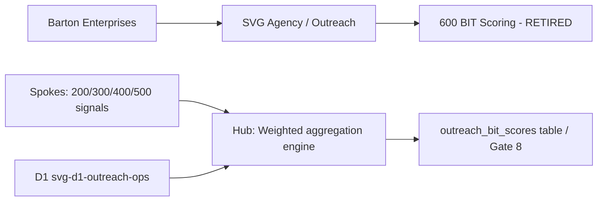
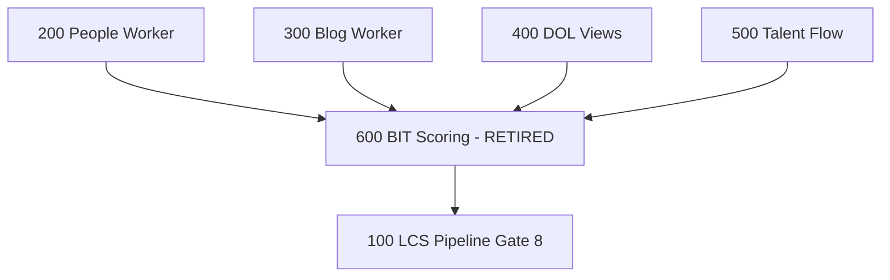

# BIT Scoring (Buyer Intent Tracker)
## Cross-hub signal aggregation engine that assigned authorization bands 0-5 per company — RETIRED 2026-03-25; replaced by direct data-completeness checks in the LCS compiler.
### Status: RETIRED
### Medium: process
### Business: svg-agency

## UT Checklist (Pre-Flight - per law/UT_CHECKLIST.md v1.2.0)

| # | Check | Status | Location |
|---|-------|--------|----------|
| 1 | PRD - what / why / who / scope / out-of-scope / success metric | [x] | §2 |
| 2 | OSAM - READ / WRITE / Process Composition / Join Chain / Forbidden Paths / Query Routing filled | [x] | §5 |
| 3 | Component Status - every dep has green / yellow / red with 1-line state | [x] | §3 |
| 4 | Owner - human who fixes this at 2 AM | [x] | §1 |
| 5 | Live Dashboard - URL or explicit "N/A" | [x] | §3 |
| 6 | Kill Switch - exact command to stop the process | [x] | §8 |
| 7 | Logbook - last audit verdict + date (after certification only) | [x] | §12 |
| 8 | FCEs Attached - which FCE runs structurally back this doc | [x] | §3c |
| 9 | BARs Referenced - every BAR this doc touches, with status | [x] | §3d |
| 10 | LBB Subjects Fed - which LBB subject(s) this doc's session logs go to | [x] | §3e |
| 11 | Geometry - CTB position + Hub-Spoke role + Altitude | [x] | §1b |
| 12 | Live Verification - every numeric count, cron, URL, command, BAR status grounded against the live system | [x] | §9b |
| 13 | ctb_node - declared path on the Barton Enterprises CTB trunk | [x] | §1 Identity |

## §1 IDENTITY {#sec-1-identity}

| Field | Value |
|-------|-------|
| ID | PROC-600 |
| Name | BIT Scoring (Buyer Intent Tracker) |
| Medium | process |
| Business Silo | svg-agency |
| CTB Position | barton-enterprises → svg-agency → outreach → factory → 600-bit-scoring (leaf) |
| ORBT | RETIRED |
| Strikes | 0 |
| Authority | inherited - parent doctrine / svg-agency sovereign / imo-creator-v2 |
| Last Modified | 2026-05-08 |
| BAR Reference | BAR-131 (Gate 8 wire — DONE; process itself retired) |
| Owner | Dave Barton |
| ctb_node | barton-enterprises/svg-agency/outreach/factory/600-bit-scoring |

> **STATUS DISCREPANCY RESOLVED:** `CLAUDE.md` says RETIRED 2026-03-25; `heir.yaml` says `status: "build"`. The PROCESS.md (last modified 2026-03-29) and CLAUDE.md are the later and more authoritative records. ORBT is set to TROUBLESHOOT_TRAIN — this process was retired before production deployment. The heir.yaml `status` field is stale and should be treated as a pre-retirement snapshot. The parent `Barton-Processes/CLAUDE.md` entry "RETIRED 2026-03-25" matches PROCESS.md. No active fix cycle is in flight; TROUBLESHOOT_TRAIN reflects permanent retirement with documented rationale (architecture review finding: composite score was variable masquerading as constant).

### 1b. Geometry {#sec-1b-geometry}

**CTB Position:** barton-enterprises → svg-agency → outreach → factory/600-bit-scoring (leaf)

**Hub-Spoke Role:** Hub (was planned as the middle aggregation layer — reads from all four spoke sub-hubs 200/300/400/500, produces composite score written to outreach_bit_scores; spoke consumers = LCS pipeline Gate 8 / dashboards). Process never reached production.

**Altitude:** 10k operational (aggregation engine — leaf computation, not strategy)



### HEIR (8 fields - Aviation Model, Bedrock §8)

| Field | Value |
|-------|-------|
| sovereign_ref | imo-creator-v2 |
| hub_id | 600-bit-scoring |
| ctb_placement | leaf |
| imo_topology | middle |
| cc_layer | CC-04 |
| services | CF Worker (monthly cron — planned, never deployed); Neon via Hyperdrive |
| secrets_provider | doppler |
| acceptance_criteria | Runs AFTER all dumb workers complete; Reads signals from 200/300/400/500; Produces composite score per company; Classifies into band 0-5; Gate 8 reads this score |

## §2 PURPOSE {#sec-2-purpose}

### WHAT
BIT Scoring was a cross-hub signal aggregation engine that combined weighted signals from four sub-hubs (DOL/People/Blog/Talent Flow) into a single composite score (0-100) per company, then classified each company into one of six authorization bands (0-5). No external tools — pure computation reading D1, writing to `outreach_bit_scores`.

### WHY
The LCS pipeline Gate 8 needed a single authoritative prioritization signal to determine which companies entered the outreach sequence and at what intensity. Without a composite score, each sub-hub would have to be queried individually by the compiler — BIT was the aggregation layer. The process was retired when the architecture review (2026-03-25) found that direct data-completeness checks in the LCS compiler were more transparent and deterministic than a composite number that obscured which signals changed.

### WHO
Process designer: Dave Barton. Consumer (when active): LCS pipeline compiler (Process 100) Gate 8. Analysis audience: SVG Agency outreach operators reviewing band distribution.

### SCOPE (in)
- Signal ingestion from processes 200, 300, 400, 500
- Weighted scoring per signal category (Structural Pressure, Decision Surface, Narrative Volatility)
- Band classification (0-5) per company
- Writing composite + component scores to `outreach_bit_scores`

### OUT-OF-SCOPE
- AI-based scoring (pure computation only — by design)
- Real-time scoring (monthly batch was the intended cadence)
- External API calls (D1 reads only)
- Scoring companies outside agent territory
- Active execution (process is permanently retired — LCS compiler handles intelligence tier directly)

### SUCCESS METRIC
RETIRED. Former metric: every company in territory has a current BIT score + correct band assignment, and Gate 8 correctly reads scores. This metric is now satisfied by direct field-completeness checks in Process 100.

## §3 RESOURCES {#sec-3-resources}

Required doctrine references for every process UT:

- `law/UNIFIED_TEMPLATE.md`
- `law/UT_CHECKLIST.md`
- `law/doctrine/PROCESS_FILL_INSTRUCTIONS.md`
- `law/doctrine/HOW_TO_BUILD_ANYTHING.md` (repair manual)
- `law/doctrine/BARTON_ENTERPRISES_WORLD_ATLAS.md` (Atlas System bundle)
- `law/doctrine/KEY.md`

### Component Status Grid

| Component | HEIR (`hub_id · ctb · cc_layer`) | ORBT | Light | State |
|-----------|----------------------------------|------|-------|-------|
| outreach_bit_scores (D1 table) | svg-d1-outreach-ops · leaf · CC-04 | TROUBLESHOOT_TRAIN | red | Deprecated — do not read or write; LCS compiler replaced all consumption |
| Process 200 (People Worker) | 200-people-worker · leaf · CC-04 | TBV | yellow | Former upstream; now feeds LCS compiler directly |
| Process 300 (Blog Worker) | 300-blog-worker · leaf · CC-04 | TBV | yellow | Former upstream; now feeds LCS compiler directly |
| Process 400 (DOL Views) | 400-dol-views · leaf · CC-04 | TBV | yellow | Former upstream; now feeds LCS compiler directly |
| Process 500 (Talent Flow) | 500-talent-flow · leaf · CC-04 | TBV | yellow | Former upstream; now feeds LCS compiler directly |
| Process 100 (LCS Pipeline) | 100-lcs-pipeline · leaf · CC-03 | TBV | yellow | Downstream consumer — replaced BIT scores with direct field checks |

### Live Dashboard

| Resource | URL | What it shows |
|----------|-----|---------------|
| BIT Score Dashboard | N/A — never deployed | N/A |

### Dependencies

| Dependency | Type | What It Provides | Status |
|-----------|------|-----------------|--------|
| svg-d1-outreach-ops | database | Outreach D1 — source tables + deprecated outreach_bit_scores | DEPRECATED for this process |
| Neon via Hyperdrive | database | TBV | PENDING (never reached deployment) |
| Doppler | secrets | Credentials provider | DONE |

### Downstream Consumers

| Consumer | What It Needs |
|----------|--------------|
| Process 100 (LCS Pipeline) Gate 8 | Was: BIT score band for qualification. Now: direct field-completeness checks — BIT is no longer consumed |

### Tools & Integrations

| Item | Type | Cost Tier | Credentials | What It Does |
|------|------|-----------|-------------|-------------|
| Cloudflare Workers | compute | Cheap | Doppler/CF | Was planned for monthly cron — never deployed |
| svg-d1-outreach-ops | D1 database | Cheap | Doppler | Source of all signal tables; `outreach_bit_scores` is deprecated |

### Secrets

| Secret | Doppler Project | Config | Used By |
|--------|----------------|--------|---------|
| none active | none | none | Process retired — no live secrets in use |

### 3c. FCEs Attached

| FCE Name | HEIR (`hub_id · ctb · cc_layer`) | ORBT | Run Directory | Latest P=1 | Rows | Status |
|----------|----------------------------------|------|--------------|------------|------|--------|
| none | N/A | N/A | N/A | N/A | N/A | No FCE runs — process retired before FCE attachment |

### 3d. BARs Referenced

| BAR | Title | HEIR (`bar-id · ctb · cc_layer`) | ORBT | Status | Relation |
|-----|-------|----------------------------------|------|--------|----------|
| BAR-131 | Wire Gate 8 to LCS pipeline | TBV | DONE | Closed | implements (Gate 8 now uses direct D1 field checks, not BIT scores) |

### 3e. LBB Subjects Fed

| LBB Subject | HEIR (`subject-id · ctb · cc_layer`) | ORBT | What This Doc Writes | Frequency |
|-------------|--------------------------------------|------|---------------------|-----------|
| svg-outreach | svg-outreach · branch · CC-03 | TBV | Retirement rationale, architecture decision | on-change |
| processes | processes · branch · CC-03 | TBV | Process retirement record | on-change |

## §4 IMO - Input, Middle, Output {#sec-4-imo}

### Two-Question Intake (Bedrock §3)
1. What triggers this? Monthly cron, runs AFTER all dumb workers (200/300/400/500) complete their cycle.
2. How do we get it? Sum weighted signals per company from outreach D1 tables. Classify into band (0-5). Write to `outreach_bit_scores`.

> **RETIRED:** Both questions are historical. The LCS compiler now handles this directly.

### Input
Signals from four sub-hubs read from D1 `svg-d1-outreach-ops`: DOL signals (outreach_dol), People signals (people_company_slot), Blog signals (outreach_blog), Talent Flow signals (TBV — not in ERD explicitly). Company spine: outreach_company_target.

### Middle

| Step | Input | What Happens | Output | Tool Used |
|------|-------|-------------|--------|-----------|
| 1 | outreach_company_target | Pull company list for scoring territory | company list | D1 query |
| 2 | outreach_dol | Read DOL signals per company (filing_present, renewal_month, carrier, broker) | DOL score component | D1 query |
| 3 | people_company_slot | Read slot fill signals per company (is_filled, email_verified) | People score component | D1 query |
| 4 | outreach_blog | Read blog signals per company (signal_type) | Blog score component | D1 query |
| 5 | all components | Apply signal weights per category (see D-600-05 through D-600-09) | raw composite score | computation |
| 6 | raw score | Classify into band 0-5 (see D-600-03) | score_tier | computation |
| 7 | score + tier + components | Write to outreach_bit_scores | CANONICAL row | D1 write |

### Output
Composite score (0-100), score_tier (band 0-5), signal_count, and component scores (people_score, dol_score, blog_score, talent_flow_score) per company written to `outreach_bit_scores`. Gate 8 in LCS pipeline reads score to determine entry qualification.

### Circle (Bedrock §5)
Each cycle's scores would be compared to prior cycle — tightening sigma = real signal, flat = noise, expanding = model needs recalibration. No feedback loop was established before retirement. PROCESS.md notes this as a design flaw: "The score never fed back to improve input quality — dead-end output."

## §5 DATA SCHEMA {#sec-5-data-schema}

### READ Access

| Source | What It Provides | Join Key |
|--------|-----------------|----------|
| outreach_company_target | Company spine — which companies to score | outreach_id |
| outreach_dol | DOL signals: filing_present, renewal_month, carrier, broker | outreach_id |
| people_company_slot | People signals: slot_type, is_filled, person_uid | outreach_id |
| outreach_blog | Blog signals: signal_type, created_at | outreach_id |

### WRITE Access

| Target | What It Writes | When |
|--------|---------------|------|
| outreach_bit_scores | outreach_id, score, score_tier, signal_count, people_score, dol_score, blog_score, talent_flow_score, last_signal_at, last_scored_at | After each monthly scoring run |

> **DEPRECATED:** `outreach_bit_scores` table is deprecated. Do not read, write, or join against it. See D-600-12.

### Process Composition



| Process ID | Name | Role in Composition | Status |
|-----------|------|---------------------|--------|
| PROC-200 | People Worker | upstream feeder | TBV |
| PROC-300 | Blog Worker | upstream feeder | TBV |
| PROC-400 | DOL Views | upstream feeder | TBV |
| PROC-500 | Talent Flow | upstream feeder | TBV |
| PROC-600 | BIT Scoring | this (retired aggregator) | TROUBLESHOOT_TRAIN |
| PROC-100 | LCS Pipeline | downstream consumer (now uses direct checks) | TBV |

### Join Chain

```text
outreach_company_target (spine)
  -> outreach_dol.outreach_id (DOL signals)
  -> people_company_slot.outreach_id (People signals)
  -> outreach_blog.outreach_id (Blog signals)
  -> outreach_bit_scores.outreach_id (composite output — DEPRECATED)
```

Single key: outreach_id. No cross-database joins.

### Forbidden Paths

| Action | Why |
|--------|-----|
| Read from outreach_bit_scores | Table is deprecated — data is stale; LCS compiler uses direct field checks (D-600-12) |
| Write to outreach_bit_scores | Process is permanently retired — no writes permitted (D-600-12) |
| Run BIT scoring before upstream workers complete | BIT aggregates their output; stale data produces wrong bands (D-600-01) |
| Score companies outside agent territory | Wastes compute; out-of-scope by design (D-600-11) |
| Harden signal weights as code constants | Weights are variables, not constants — must be config-driven if ever rebuilt (D-600-07) |

### Query Routing

| Question | Table | Column |
|----------|-------|--------|
| What is this company's BIT score? | DEPRECATED — use LCS compiler intelligence tier | N/A |
| What is the band distribution? | outreach_bit_scores (stale) | score_tier, COUNT(*) |
| Which companies are band 4+? | outreach_bit_scores (stale) | score >= 60 |
| What signals drove the score? | outreach_bit_scores | people_score, dol_score, blog_score, talent_flow_score |

## §6 DMJ - Define, Map, Join {#sec-6-dmj}

### 6a. DEFINE (Build the Key)

| Element | ID | Format | Description | C or V |
|---------|-----|--------|-------------|--------|
| outreach_id | E-001 | integer PK | Unique company identifier across all outreach tables | C |
| score | E-002 | integer 0-100 | Composite weighted signal sum per company | V |
| score_tier / band | E-003 | integer 0-5 | Authorization band derived from score range | C (structure); V (value per company) |
| signal_weight | E-004 | signed integer | Per-signal contribution to composite score | C |
| signal_category | E-005 | enum: Structural Pressure / Decision Surface / Narrative Volatility | Signal trust/velocity grouping | C |
| component_score | E-006 | integer | Sub-total score per category (people_score, dol_score, blog_score, talent_flow_score) | V |
| band_name | E-007 | enum: SILENT/WATCH/EXPLORATORY/TARGETED/ENGAGED/DIRECT | Human-readable band label | C |
| band_action | E-008 | string | Prescribed outreach action for each band | C |

### 6b. MAP (Connect Key to Structure)

| Source | Target | Transform |
|--------|--------|-----------|
| outreach_dol signals | dol_score | weighted sum of filing_present, renewal, broker_change, premium |
| people_company_slot signals | people_score | weighted sum of slot_filled, email_verified |
| outreach_blog signals | blog_score | weighted sum of funding, acquisition, expansion, leadership_change |
| talent flow signals | talent_flow_score | weighted sum of executive_joined, executive_left |
| all component scores | score (composite) | sum of all four component scores |
| score → range lookup | score_tier (0-5) | classify by band thresholds |

### 6c. JOIN (Path to Spine)

| Join Path | Type | Description |
|-----------|------|-------------|
| outreach_company_target → outreach_dol | direct | outreach_id FK |
| outreach_company_target → people_company_slot | direct | outreach_id FK |
| outreach_company_target → outreach_blog | direct | outreach_id FK |
| outreach_company_target → outreach_bit_scores | direct | outreach_id FK (DEPRECATED) |

## §7 CONSTANTS & VARIABLES {#sec-7-constants-variables}

### Constants (structure - never changes)
- Authorization bands are 0-5, fixed — the six-slot structure is invariant (D-600-02)
- Band name labels are fixed: SILENT, WATCH, EXPLORATORY, TARGETED, ENGAGED, DIRECT (D-600-02)
- Band outreach action rules are fixed per band (D-600-03)
- Signal categories are fixed: Structural Pressure, Decision Surface, Narrative Volatility (D-600-05)
- Score can only increase within a scoring window; ratchet logic prohibits downgrades mid-cycle (D-600-04)
- BIT reads from sub-hubs; it never writes to sub-hub tables (D-600-06)
- outreach_id is the single join key across all outreach tables (D-600-10)

### Variables (fill - changes every run/cycle)
- Composite score per company (0-100) — changes each monthly cycle as signals change (E-002)
- Component scores per company (people_score, dol_score, blog_score, talent_flow_score) — change each cycle
- signal_count per company — count of signals detected for that company in the cycle
- Band assignment per company — derived from score; variable even though band structure is constant
- Signal weights — classified as variables per PROCESS.md retirement analysis (D-600-07): weights must be config-driven, not hardcoded

## §8 STOP CONDITIONS {#sec-8-stop-conditions}

| Condition | Action |
|-----------|--------|
| Process is permanently retired | HALT — do not execute; ORBT = TROUBLESHOOT_TRAIN |
| Upstream workers (200/300/400/500) have not completed current cycle | HALT — stale data produces wrong bands (D-600-01) |
| outreach_bit_scores table is the target for a write | HALT — table is deprecated (D-600-12) |
| Score does not match manual calculation for test company | HALT — scoring logic is broken; do not write to D1 |
| Same scoring failure repeats 3x | HALT → Troubleshoot/Train → Airworthiness Directive |

### Kill Switch

```text
# Process is retired — no active worker to kill.
# If a rogue run is somehow triggered:
# 1. Delete the CF Worker via Cloudflare dashboard (worker was never deployed to production)
# 2. Revoke any Doppler secrets scoped to 600-bit-scoring
# 3. Do NOT touch outreach_bit_scores — leave deprecated data in place for audit trail
```

## §9 VERIFICATION {#sec-9-verification}

```text
1. Confirm process folder root matches 5-entry locked shape -> expected: PROCESS-UT.md, DOCTRINE.md, heir.yaml, orbt.yaml, _archived-fragments/ only
2. Confirm outreach_bit_scores table exists but is not being written to -> expected: table present, last_scored_at = prior to 2026-03-25
3. Confirm LCS compiler (Process 100) does NOT reference outreach_bit_scores -> expected: no JOIN or SELECT against that table in compiler-v2.ts
```

### Three Primitives Check (Bedrock §1)
1. Thing — Does outreach_bit_scores table exist? TBV (table was created but process never reached production)
2. Flow — Do signals from 200/300/400/500 flow into the scoring engine? No — process is retired; flow is broken by design
3. Change — Does the composite score transform signals into bands? No — transformation no longer executes; LCS compiler handles classification directly

## 9b. Live Verification Log {#sec-9b-live-verification}

| Claim | Section | Source of Truth | Verification Command | [ ] | Last Check | Value |
|-------|---------|-----------------|----------------------|-----|-----------|-------|
| outreach_bit_scores table exists in D1 | §5 | svg-d1-outreach-ops | `npx wrangler d1 execute svg-d1-outreach-ops --remote --command "SELECT COUNT(*) FROM outreach_bit_scores"` | [ ] | TBV | TBV |
| Last scored_at is pre-retirement (before 2026-03-25) | §5 | svg-d1-outreach-ops | `npx wrangler d1 execute svg-d1-outreach-ops --remote --command "SELECT MAX(last_scored_at) FROM outreach_bit_scores"` | [ ] | TBV | TBV |
| No active CF Worker named 600-bit-scoring | §3 | Cloudflare dashboard | `npx wrangler whoami && wrangler deployments list` | [ ] | TBV | TBV |
| LCS compiler does not reference outreach_bit_scores | §5 | barton-outreach-core/src/compiler-v2.ts | `grep -r "outreach_bit_scores" barton-outreach-core/src/` | [ ] | TBV | TBV |
| Process folder root has exactly 5 entries | §1 | filesystem | `ls factory/outreach/600-bit-scoring/` | [ ] | 2026-04-29 | 5 entries (G25 target) |

## §10 Operations / Schedule {#sec-10-operations}

**Cron classification:** RETIRED
**Decision date:** 2026-05-08
**Decision authority:** Sovereign (Dave Barton, BAR-MONDAY-16-FLEET-GREEN)

**Schedule:** N/A — RETIRED
**Implementation:** N/A — process retired 2026-03-25
**Trigger source (if event-driven):** N/A

---

## §10 ANALYTICS {#sec-10-analytics}

### 10a. Metrics

| Metric | Unit | Baseline | Target | Tolerance |
|--------|------|----------|--------|-----------|
| Companies scored | count | 13,000 (prior Python run, per MANIFEST.md) | N/A — retired | N/A |
| Band 0-5 distribution | count per band | TBV | N/A — retired | N/A |
| Gate 8 reads of BIT score | count | 0 (deprecated) | 0 (LCS compiler handles directly) | 0 tolerance for reads |

### 10b. Sigma Tracking

| Metric | Run 1 | Run 2 | Run 3 | Trend | Action |
|--------|-------|-------|-------|-------|--------|
| Score drift cycle-over-cycle | N/A | N/A | N/A | N/A — process retired before multi-cycle operation | N/A |

### 10c. ORBT Gate Rules

| From | To | Gate |
|------|-----|------|
| TROUBLESHOOT_TRAIN | BUILD (rebuild) | Architecture review must confirm composite scoring adds value over direct field checks; Dave Barton sign-off required |
| BUILD | OPERATE | All 6 PRD requirements pass; Gate 8 correctly reads scores; 3 clean runs + auditor sign-off |
| OPERATE | REPAIR | Any metric outside tolerance |
| Any (Strike 3) | TROUBLESHOOT_TRAIN | fleet-wide fix → AD |

## §11 EXECUTION TRACE {#sec-11-execution-trace}

| Field | Format | Required |
|-------|--------|----------|
| trace_id | UUID | Yes |
| run_id | UUID | Yes |
| step | action name | Yes |
| target | measurable | Yes |
| actual | measurable | Yes |
| delta | the gap | Yes |
| status | done / failed / skipped | Yes |
| error_code | text or null | If failed |
| error_message | text or null | If failed |
| tools_used | JSON array | Yes |
| duration_ms | integer | Yes |
| cost_cents | integer | Yes |
| timestamp | ISO-8601 | Yes |
| signed_by | agent or manual | Yes |

### Build Inputs Used

| Source | File | What Was Used |
|--------|------|--------------|
| heir.yaml | factory/outreach/600-bit-scoring/heir.yaml | HEIR fields, signal sources, bands, acceptance_criteria, depends_on/feeds |
| CLAUDE.md | factory/outreach/600-bit-scoring/CLAUDE.md | RETIRED status, retirement date, retirement rationale |
| PRD.md | factory/outreach/600-bit-scoring/PRD.md | Requirements R1-R6, band definitions, success metrics |
| OSAM.md | factory/outreach/600-bit-scoring/OSAM.md | Signal weights table, READ/WRITE tables, query patterns, anti-patterns |
| MANIFEST.md | factory/outreach/600-bit-scoring/MANIFEST.md | IMO, bands table, dependencies, current state (13k companies scored), session log |
| ERD.md | factory/outreach/600-bit-scoring/ERD.md | FK chain, entity diagram, band-to-tier mapping |
| PROCESS.md | factory/outreach/600-bit-scoring/PROCESS.md | Retirement rationale, C&V retirement analysis, 2026-03-25 logbook entry |

### Back-Propagation Check

| Parent Constant | Conflict Check | Result |
|-----------------|----------------|--------|
| Barton Enterprises CTB | ctb_node declared | clean |
| UNIFIED_TEMPLATE 14 sections | all 14 sections present with anchors | clean |
| UT_CHECKLIST 13 items | all 13 items present | clean |
| ORBT is explicit | TROUBLESHOOT_TRAIN set, not BUILD | clean |
| heir.yaml status field | stale "build" — flagged in §1 note | conflict captured, not a doc error |

## §12 LOGBOOK (After Certification Only) {#sec-12-logbook}

> Process never reached certification (retired before production deployment). No birth certificate. No logbook entries beyond the retirement record below.

### Retirement Record

| Date | Actor | Action | What Was Done | Evidence | LBB Record |
|------|-------|--------|---------------|----------|------------|
| 2026-03-25 | Dave Barton | RETIRE | Composite BIT scoring retired during LCS compiler v2 architecture review. Replaced by direct field-completeness checks in compiler-v2.ts. outreach_bit_scores table deprecated. | PROCESS.md §10 logbook; CLAUDE.md retirement notice | pending |

## §13 FLEET FAILURE REGISTRY {#sec-13-fleet-failure-registry}

| Pattern ID | Location | Error Code | First Seen | Occurrences | Strike Count | Status |
|-----------|----------|-----------|-----------|-------------|-------------|--------|
| FP-600-01 | PROC-600 architecture | VARIABLE_AS_CONSTANT | 2026-03-25 | 1 | N/A | RESOLVED — process retired; root cause: composite score was a variable masquerading as a constant (aggregation destroyed useful signal granularity) |

## §14 SESSION LOG {#sec-14-session-log}

| Date | Version | Author | Action | Scope |
|------|---------|--------|--------|-------|
| 2026-03-24 | v0.1 | Sonnet Runner | `CREATE` | Manifest written from heir.yaml + brain knowledge |
| 2026-03-25 | v0.2 | Sonnet Runner | `AMEND` | Process retired during LCS compiler v2 architecture review |
| 2026-03-29 | v1.0.0 | Sonnet Runner | `CREATE` | PROCESS.md written to document retirement rationale |
| 2026-04-29 | v2.0.0 | Sonnet Runner (Wave 1 UT Consolidation) | `CREATE` | UT v2.7.0 consolidation — all fragments archived, PROCESS-UT.md + DOCTRINE.md + orbt.yaml written. LBB: pending |
| 2026-05-08 | v2.0.1 | Sonnet Mechanic (BAR-MONDAY-16-FLEET-GREEN) | `MIGRATE` | §14 column format migrated to 5-column canonical shape (UT v2.8.0 / Atlas v2.3.0). Version bumped across frontmatter + §1 + Document Control. |
| 2026-05-08 | v2.0.2 | Sonnet Mechanic (BAR-MONDAY-16-FLEET-GREEN) | `STAMP` | §10 Operations/Schedule stamped: RETIRED — process retired 2026-03-25. ORBT changed from TROUBLESHOOT_TRAIN to RETIRED in frontmatter (both arms), §1 Identity, and header. Version bumped in 3 locations. |
| 2026-05-08 | v2.0.3 | Sonnet Mechanic (BAR-MONDAY-16-FLEET-GREEN) | `AMEND` | G03: services field added to outside.heir frontmatter: [cloudflare-worker, neon-via-hyperdrive] (sourced from §1 Identity services row — CF Worker planned, never deployed). Version bumped in 2 locations (no §1 Version row). |

^[ROW-2026-03-24]: 2026-03-24 | Manifest written from heir.yaml + brain knowledge | none
^[ROW-2026-03-25]: 2026-03-25 | Process retired during LCS compiler v2 architecture review | none
^[ROW-2026-03-29]: 2026-03-29 | PROCESS.md written to document retirement rationale | none
^[ROW-2026-04-29]: 2026-04-29 | UT v2.7.0 consolidation — all fragments archived, PROCESS-UT.md + DOCTRINE.md + orbt.yaml written | pending

## Document Control

| Field | Value |
|-------|-------|
| Created | 2026-03-29 |
| Last Modified | 2026-05-08 |
| Version | v2.0.3 |
| Template Version | 2.7.0 |
| Medium | process |
| US Validated | pending |
| Governing Engine | law/doctrine/FOUNDATIONAL_BEDROCK.md + law/doctrine/DMJ.md |
