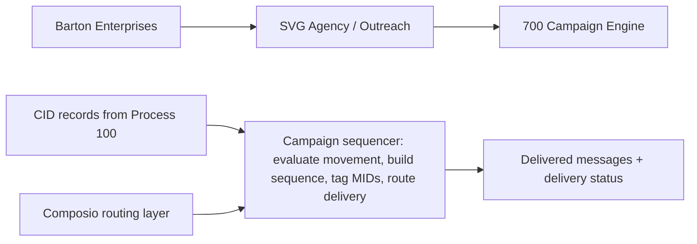
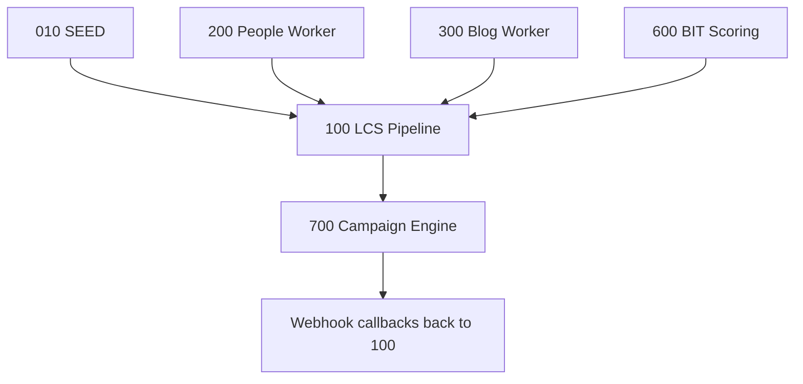

# Campaign Engine
## Sequences outreach messages (MIDs) based on movement detection — terminal execution layer of the LCS pipeline.
### Status: BUILD
### Medium: process
### Business: svg-agency

## UT Checklist (Pre-Flight - per law/UT_CHECKLIST.md v1.2.0)

| # | Check | Status | Location |
|---|-------|--------|----------|
| 1 | PRD - what / why / who / scope / out-of-scope / success metric | [x] | §2 |
| 2 | OSAM - READ / WRITE / Process Composition / Join Chain / Forbidden Paths / Query Routing filled | [x] | §5 |
| 3 | Component Status - every dep has green / yellow / red with 1-line state | [x] | §3 |
| 4 | Owner - human who fixes this at 2 AM | [x] | §1 |
| 5 | Live Dashboard - URL or explicit "N/A" | [x] | §3 |
| 6 | Kill Switch - exact command to stop the process | [x] | §8 |
| 7 | Logbook - last audit verdict + date (after certification only) | [ ] | §12 |
| 8 | FCEs Attached - which FCE runs structurally back this doc | [x] | §3c |
| 9 | BARs Referenced - every BAR this doc touches, with status | [x] | §3d |
| 10 | LBB Subjects Fed - which LBB subject(s) this doc's session logs go to | [x] | §3e |
| 11 | Geometry - CTB position + Hub-Spoke role + Altitude | [x] | §1b |
| 12 | Live Verification - every numeric count, cron, URL, command, BAR status grounded against the live system | [x] | §9b |
| 13 | ctb_node - declared path on the Barton Enterprises CTB trunk | [x] | §1 Identity |

## §1. IDENTITY {#sec-1-identity}

| Field | Value |
|-------|-------|
| ID | PROC-700 |
| Name | Campaign Engine |
| Medium | process |
| Business Silo | svg-agency |
| CTB Position | barton-enterprises/svg-agency/outreach/campaign-engine |
| ORBT | BUILD |
| Strikes | 0 |
| Authority | inherited — parent doctrine imo-creator-v2 sovereign + Barton-Processes |
| Last Modified | 2026-05-08 |
| BAR Reference | BAR-175, BAR-177 |
| Owner | Dave Barton |
| ctb_node | barton-enterprises/svg-agency/outreach/campaign-engine |

### 1b. Geometry {#sec-1b-geometry}

**CTB Position:** barton-enterprises → svg-agency → outreach → campaign-engine (leaf)

**Hub-Spoke Role:** Hub — all sequencing logic lives here. Spokes are dumb transport (Composio routes to Mailgun/HeyReach). Rim in = CID records from Process 100. Rim out = delivered MIDs + delivery status events.

**Altitude:** 5k execution — terminal delivery layer; sequences and sends individual messages per company per cycle.



### HEIR (8 fields - Aviation Model, Bedrock §8)

| Field | Value |
|-------|-------|
| sovereign_ref | imo-creator-v2 |
| hub_id | 700-campaign-engine |
| ctb_placement | leaf |
| imo_topology | middle |
| cc_layer | CC-04 |
| services | CF Worker (lcs-hub, post-CID compile), Neon via Hyperdrive |
| secrets_provider | doppler |
| acceptance_criteria | Tags every MID (path_type + channel + movement_signal + sequence_position); sequences movement campaigns over 2 weeks; monthly generic for non-movement; CTA link in every MID; errors write to D1 master error table |

## §2. PURPOSE {#sec-2-purpose}

### WHAT
The Campaign Engine is the terminal execution layer of the LCS outreach pipeline. It receives CID (Campaign Instruction Document) targets compiled by Process 100, evaluates movement signals from Process 200, selects the appropriate campaign model, tags each outreach message (MID), and routes delivery through Composio to Mailgun (email) or HeyReach (LinkedIn). It is not a separate worker — sequencing logic lives inside the LCS Hub (lcs-hub) worker as a cron-triggered campaign scanner.

### WHY
Without this process, the entire upstream pipeline — SEED (010), People Worker (200), Blog Worker (300), DOL Views (400), Talent Flow (500), BIT Scoring (600), LCS Pipeline (100) — produces intelligence but delivers nothing. Campaign Engine is the only process that turns compiled intelligence into actual contact. If it fails, outreach stops entirely.

### WHO
Dave Barton operates this. SVG Agency sales team consumes the meeting pipeline downstream. This doc is read by the mechanic building the campaign worker and the FAA auditor verifying compliance.

### SCOPE (in)
- Campaign model selection (NO_MOVEMENT vs MOVEMENT_DETECTED) based on movement signals
- Sequence building: 1 touch monthly (no movement) or 3-5 touches over 2 weeks (movement)
- MID tagging: path_type, channel, movement_signal, sequence_position
- Delivery routing via Composio to Mailgun or HeyReach
- Delivery status tracking and webhook callback processing
- Error writing to master error table

### OUT-OF-SCOPE
- CID compilation — owned by Process 100 (LCS Pipeline)
- Movement signal detection — owned by Process 200 (People Worker)
- Domain rotation management — owned by Process 100
- Campaign content templates / message frame copy — not defined here (TBV)
- LinkedIn account management — HeyReach platform manages this

### SUCCESS METRIC
100% of pending CIDs produce tagged MIDs delivered within the cadence window, with delivery failure rate below 5%.

## §3. RESOURCES {#sec-3-resources}

Required doctrine references for every process UT:

- `law/UNIFIED_TEMPLATE.md`
- `law/UT_CHECKLIST.md`
- `law/doctrine/PROCESS_FILL_INSTRUCTIONS.md`
- `law/doctrine/HOW_TO_BUILD_ANYTHING.md` (repair manual)
- `law/doctrine/BARTON_ENTERPRISES_WORLD_ATLAS.md` (Atlas System bundle)
- `law/doctrine/KEY.md`

### Component Status Grid

| Component | HEIR (`hub_id · ctb · cc_layer`) | ORBT | Light | State |
|-----------|----------------------------------|------|-------|-------|
| Process 100 — LCS Pipeline | 100-lcs-pipeline · leaf · CC-04 | OPERATE | green | Compiles CIDs; campaign engine depends on its output |
| Process 200 — People Worker | 200-people-worker · leaf · CC-04 | BUILD | yellow | Movement signals not yet fully operational |
| D1 spine (svg-d1-spine) | 641a9a1e | OPERATE | green | CID records, campaign queue, MID state, event log |
| D1 outreach (svg-d1-outreach-ops) | 73a285b8 | OPERATE | green | People slots, people master — read only |
| Composio (TOOL-007) | sovereign: composio · leaf · TBV | BUILD | yellow | Routing integration configured; not yet firing live MIDs |
| Mailgun | external · leaf · TBV | OPERATE | green | 14 verified sending domains managed by Process 100 |
| HeyReach | external · leaf · TBV | BUILD | red | API key not set, account not configured |
| Campaign content templates | TBV | BUILD | red | Message frames per movement signal type — not yet defined |

### Live Dashboard

| Resource | URL | What it shows |
|----------|-----|---------------|
| LCS Hub worker | https://lcs-hub.svg-outreach.workers.dev | Health of the lcs-hub worker (campaign engine lives here) |
| CF Worker analytics | Cloudflare dashboard → lcs-hub | Request counts, errors, cron triggers |
| D1 spine | N/A — query direct via wrangler | CID queue depth, MID state counts |

### Dependencies

| Dependency | Type | What It Provides | Status |
|-----------|------|-----------------|--------|
| Process 100 (LCS Pipeline) | Process | CID targets: company, signal type, intelligence tier, message frame | OPERATE |
| Process 200 (People Worker) | Process | Movement signals (binary per slot: moved=1 / static=0) | BUILD |
| D1 spine (svg-d1-spine) | Database | Campaign queue, MID sequence state, event log, error table | DONE |
| D1 outreach-ops | Database | People master and slots — email, LinkedIn, movement signals | DONE |
| Composio | API integration | Routes tagged MIDs to Mailgun or HeyReach | CONFIGURED |
| Mailgun (14 domains) | Email API | Email delivery | DONE (managed by 100) |
| HeyReach | LinkedIn API | LinkedIn outreach delivery | PENDING |
| Campaign content templates | Content | Message frames per movement signal type | NOT STARTED |

### Downstream Consumers

| Consumer | What It Needs |
|----------|--------------|
| None — terminal | Webhook delivery events feed back to Process 100 for reachability updates and ORBT strike tracking |

### Tools & Integrations

| Item | Type | Cost Tier | Credentials | What It Does |
|------|------|-----------|-------------|-------------|
| Cloudflare D1 (spine) | Database | Free | D1 binding | Campaign model eval, sequence building, queue, event logging |
| Cloudflare D1 (outreach-ops) | Database | Free | D1_OUTREACH binding | Read people slots and master for movement signals and contact info |
| Composio (TOOL-007) | Integration | Cheap | COMPOSIO_API_KEY (Doppler: imo-creator/dev) | Routes tagged MIDs to Mailgun or HeyReach |
| Mailgun | Email delivery | Cheap | MAILGUN_API_KEY (Doppler: imo-creator/dev) | Email delivery — 14-domain rotation managed by Process 100 |
| HeyReach | LinkedIn delivery | Cheap | HEYREACH_API_KEY (Doppler: imo-creator/dev) | LinkedIn outreach delivery |
| CF Cron Triggers | Scheduling | Free | none | Daily batch send scheduling; runs after Process 100 cron (0 7 * * *) |

### Secrets

| Secret | Doppler Project | Config | Used By |
|--------|----------------|--------|---------|
| COMPOSIO_API_KEY | imo-creator | dev | Step 4 — MID routing to Mailgun/HeyReach |
| MAILGUN_API_KEY | imo-creator | dev | Step 4 — email delivery |
| HEYREACH_API_KEY | imo-creator | dev | Step 4 — LinkedIn delivery |

### 3c. FCEs Attached

| FCE Name | HEIR (`hub_id · ctb · cc_layer`) | ORBT | Run Directory | Latest P=1 | Rows | Status |
|----------|----------------------------------|------|--------------|------------|------|--------|
| TBV | TBV | BUILD | TBV | pending | TBV | red — no FCE runs yet |

### 3d. BARs Referenced

| BAR | Title | HEIR (`bar-id · ctb · cc_layer`) | ORBT | Status | Relation |
|-----|-------|----------------------------------|------|--------|----------|
| BAR-175 | TBV | TBV · TBV · TBV | TBV | TBV | implements |
| BAR-177 | TBV | TBV · TBV · TBV | TBV | TBV | implements |

### 3e. LBB Subjects Fed

| LBB Subject | HEIR (`subject-id · ctb · cc_layer`) | ORBT | What This Doc Writes | Frequency |
|-------------|--------------------------------------|------|---------------------|-----------|
| svg-outreach-proc | svg-outreach-proc · leaf · CC-03 | BUILD | Session summaries, delivery run results, error patterns | per-run |

## §4. IMO - Input, Middle, Output {#sec-4-imo}

### Two-Question Intake (Bedrock §3)
1. **What triggers this?** — LCS Pipeline (Process 100) completes CID compilation for a company cycle; cron fires at `0 7 * * *` and the campaign scanner evaluates pending CIDs.
2. **How do we get it?** — CID records from D1 spine (`lcs_cid WHERE status = 'pending'`). Movement signals from D1 outreach-ops (`people_company_slot`). Contact info from `people_people_master`. Delivery via Composio routing.

### Input
CID records from Process 100 (company target, signal type, intelligence tier, message frame assignment). Movement signals from Process 200 (binary per slot: CEO/CFO/HR). Reachability status per company (EMAIL_ONLY, LINKEDIN_ONLY, or FULL). Recipient contact info (verified email, LinkedIn URL) from `people_people_master`.

### Middle

| Step | Input | What Happens | Output | Tool Used |
|------|-------|-------------|--------|-----------|
| 1 | CID record | Evaluate movement: query all 3 slots for movement signals. Any slot moved = MOVEMENT_DETECTED. Zero slots = NO_MOVEMENT. | Campaign model selection | D1 query (svg-d1-spine) |
| 2 | Campaign model + CID | Build sequence: NO_MOVEMENT → 1 generic MID. MOVEMENT_DETECTED → 3-5 MIDs, cadence every 2-3 days, frame matched to signal type. | Sequence plan: MID count, cadence, frame per position | D1 query (campaign registry) |
| 3 | Sequence plan + recipient | Tag each MID: stamp path_type (WARM/COLD), channel (MG/HR), movement_signal, sequence_position ("2 of 5"). | Tagged MID records in campaign queue | D1 write |
| 4 | Tagged MID | Route to channel: EMAIL_ONLY or FULL → Composio → Mailgun. LINKEDIN_ONLY → Composio → HeyReach. CTA link in every message. | Delivered message + delivery status | Composio → Mailgun / HeyReach |
| 5 | Delivery webhook callback | Record outcome: update MID state (SENT, DELIVERED, OPENED, CLICKED, BOUNCED, FAILED). Bounces write to error table. | Updated MID state + event log entry | Webhook receiver (CF Worker) |

### Output
Delivered outreach messages (email via Mailgun, LinkedIn via HeyReach). Full MID audit trail: CID → sequence plan → tagged MID → delivery status → webhook event. Every MID tagged with path_type + channel + movement_signal + sequence_position.

### Circle (Bedrock §5)
Webhook callbacks from Mailgun/HeyReach feed delivery status back to Process 100 (LCS Pipeline). Bounces and failures update company reachability status. Repeated bounces on a contact trigger ORBT strikes on the person record. Delivery metrics (open rate, click rate per frame type) inform frame selection in future CID compilations — closing the feedback loop.

## §5. DATA SCHEMA {#sec-5-data-schema}

### READ Access

| Source | What It Provides | Join Key |
|--------|-----------------|----------|
| `lcs_cid` (D1 spine) | CID records: company target, signal type, intelligence tier, message frame | `sovereign_company_id` |
| `people_company_slot` (D1 outreach-ops) | Movement signals per slot (CEO/CFO/HR), reachability status | `outreach_id` |
| `people_people_master` (D1 outreach-ops) | Recipient contact info — verified email, LinkedIn URL | `unique_id` via slot's `person_unique_id` |
| `outreach_company_target` (D1 outreach-ops) | Company metadata for message personalization | `outreach_id` |
| Campaign registry tables (D1 spine) | Campaign models, frame templates, sequence configurations | config lookup |

### WRITE Access

| Target | What It Writes | When |
|--------|---------------|------|
| Campaign queue (D1 spine) | Tagged MID records: sequence plan, path_type, channel, movement_signal, sequence_position | Step 3 |
| `lcs_mid_sequence_state` (D1 spine) | Delivery status per MID: SENT, DELIVERED, OPENED, CLICKED, BOUNCED, FAILED | Steps 4-5 |
| `lcs_event` (D1 spine) | Webhook event log — delivery callbacks from Mailgun/HeyReach | Step 5 |
| Error table (D1 spine) | Failed deliveries, bounces — master error record | Step 5 |

### Process Composition



| Process ID | Name | Role in Composition | Status |
|-----------|------|---------------------|--------|
| PROC-010 | SEED | Upstream feeder — seeds D1 with company + people data | OPERATE |
| PROC-100 | LCS Pipeline | Upstream feeder — compiles CIDs; campaign engine depends on this completing first | OPERATE |
| PROC-200 | People Worker | Upstream feeder — provides movement signals | BUILD |
| PROC-700 | Campaign Engine | This process — terminal delivery | BUILD |

### Join Chain

```text
lcs_cid.sovereign_company_id (CID from pipeline)
  -> outreach_company_target.company_unique_id (company metadata)
  -> people_company_slot.outreach_id (3 slots — movement signals)
    -> people_people_master.unique_id (via person_unique_id — email, LinkedIn)
  -> campaign_queue.cid_id (tagged MIDs for delivery)
    -> lcs_mid_sequence_state.mid_id (delivery status)
      -> lcs_event.mid_id (webhook callbacks)
```

### Forbidden Paths

| Action | Why |
|--------|-----|
| Deliver without a CID | Every MID traces back to a CID. No CID = no delivery. (D-700-03) |
| Send untagged MID | Every MID must have all 4 tags before routing. (D-700-01) |
| Send to UNREACHABLE contacts | No verified email AND no LinkedIn URL = blocked. Mark UNREACHABLE. |
| Query Neon directly | D1 only during WORK phase. LCS pipeline already compiled from D1. |
| Override domain rotation | Sending domains managed by Process 100. Campaign engine uses assigned domain only. |
| Send movement campaign without movement signal | Movement model requires a signal. No signal = generic monthly only. (D-700-09) |
| Send to suppressed contact | Suppression list is a hard block before routing. (D-700-04) |
| Bypass Composio | Direct Mailgun/HeyReach API calls without Composio routing are forbidden. (D-700-10) |
| Send MID without CTA link | Every message must contain a schedule-a-meeting CTA link. (D-700-07) |

### Query Routing

| Question | Table | Column |
|----------|-------|--------|
| Which companies have pending CIDs? | `lcs_cid` | `status = 'pending'` |
| Does this company have movement? | `people_company_slot` | movement signal columns |
| What channel for this recipient? | `people_people_master` | `email IS NOT NULL` → MG; `linkedin_url IS NOT NULL` → HR |
| Where is this MID in the sequence? | Campaign queue | `sequence_position` |
| What happened after delivery? | `lcs_mid_sequence_state` | `delivery_status` |
| Did the webhook come back? | `lcs_event` | `event_type`, `received_at` |
| Is the contact suppressed? | Suppression list table | `suppressed = true` |

## §6. DMJ - Define, Map, Join {#sec-6-dmj}

### 6a. DEFINE (Build the Key)

| Element | ID | Format | Description | C or V |
|---------|-----|--------|-------------|--------|
| message_id (MID) | CE-01 | TEXT, UUID | Unique message identifier — traceable to CID | C |
| outreach_id | CE-02 | TEXT, UUID | Which company is the target | C |
| slot_type | CE-03 | TEXT, enum: CEO/CFO/HR | Which person in the company is receiving | C |
| template_id / frame | CE-04 | TEXT, template reference | Which message frame is used | C |
| campaign_model | CE-05 | TEXT, enum: NO_MOVEMENT/MOVEMENT_DETECTED | Which cadence model applies | C |
| path_type | CE-06 | TEXT, enum: WARM/COLD | A/B tracking classification for this MID | C |
| channel | CE-07 | TEXT, enum: MG/HR | Delivery channel (Mailgun or HeyReach) | C |
| movement_signal | CE-08 | TEXT, enum: JOINED/LEFT/REPLACED/TITLE_CHANGED/EMAIL_CHANGED/NONE | Which signal triggered this campaign | V |
| sequence_position | CE-09 | TEXT, format: "N of M" | Position in sequence (e.g., "2 of 5") | V |
| send_domain | CE-10 | TEXT, domain format | Which Mailgun domain sends — assigned by Process 100 | V |
| delivery_status | CE-11 | TEXT, enum: SENT/DELIVERED/OPENED/CLICKED/BOUNCED/FAILED | MID lifecycle state | V |

### 6b. MAP (Connect Key to Structure)

| Source | Target | Transform |
|--------|--------|-----------|
| CE-02 outreach_id + CE-03 slot_type | `people_people_master` → verified email or LinkedIn URL | Read recipient contact from slot |
| CE-05 campaign_model | Cadence plan | NO_MOVEMENT → 1 touch / month; MOVEMENT_DETECTED → 3-5 over 2 weeks |
| CE-08 movement_signal | CE-04 template_id | Signal type determines message frame from campaign registry |
| CE-07 channel | Composio route | MG → Mailgun API; HR → HeyReach API |
| CE-10 send_domain | `lcs_domain_rotation` | Round-robin LRU selection by Process 100 — passed through |

### 6c. JOIN (Path to Spine)

| Join Path | Type | Description |
|-----------|------|-------------|
| lcs_cid.sovereign_company_id → outreach_id | direct | CID connects to company target — the primary spine join |
| people_company_slot.outreach_id → people_people_master.unique_id | indirect | Slot links to person record via person_unique_id |
| campaign_queue.cid_id → lcs_mid_sequence_state.mid_id | direct | Tagged MID connects to delivery state record |

## §7. CONSTANTS & VARIABLES {#sec-7-constants-variables}

### Constants (structure - never changes)
- Two campaign models: NO_MOVEMENT and MOVEMENT_DETECTED — binary, no other options (D-700-02)
- 4-field MID tag: path_type + channel + movement_signal + sequence_position — all four required, zero tolerance (D-700-01)
- Two delivery channels: MG (Mailgun) and HR (HeyReach) — no other channel options (D-700-10)
- Channel selection rule: email present → MG primary; LinkedIn only → HR; both → MG primary
- Every MID traces to a CID — orphan MIDs are a zero-tolerance violation (D-700-03)
- CTA link required in every message — no exceptions (D-700-07)
- Movement cadence: 3-5 touches, every 2-3 days, over approximately 2 weeks (D-700-02, D-700-06)
- No-movement cadence: exactly 1 touch per month per company (D-700-06)
- Suppression check is mandatory before routing — no exceptions (D-700-04)
- Campaign engine is dependent on Process 100 CID completion before firing (D-700-05)

### Variables (fill - changes every run/cycle)
- Which companies have pending CIDs (changes as pipeline runs)
- Which companies have movement signals (changes as People Worker detects changes)
- How many MIDs in queue (depends on signal volume)
- Delivery success rate per channel (Mailgun vs HeyReach) — calibrated through operation
- Open/click rates per frame type — informs future frame selection
- Which sending domain gets assigned — LCS pipeline rotation manages this
- Sequence position per company — advances with each delivery
- movement_signal value per MID (JOINED/LEFT/REPLACED/TITLE_CHANGED/EMAIL_CHANGED/NONE)
- Tolerance thresholds k_i — calibrated through production runs

## §8. STOP CONDITIONS {#sec-8-stop-conditions}

| Condition | Action |
|-----------|--------|
| Cannot answer two-question intake | HALT — process is not defined |
| Process 100 CID compilation incomplete | WAIT — do not run until CID compile is finished (D-700-05) |
| MID has missing tag (any of the 4 required) | HALT — untagged MID violates D-700-01; do not deliver |
| MID has no CID parent | HALT — orphan MID violates D-700-03 |
| Recipient is on suppression list | SKIP — mark suppressed, do not route to Composio (D-700-04) |
| Recipient has no email AND no LinkedIn | SKIP — mark UNREACHABLE, do not attempt delivery |
| Movement campaign triggered without signal | HALT — D-700-09 violation; fallback to generic monthly |
| MID has no CTA link | HALT — D-700-07 violation; do not send |
| Composio routing errors > 5 consecutive | HALT — check Composio credentials and connection |
| Mailgun delivery errors > 20% of batch | HALT — check API key, domain status, sending limits |
| HeyReach delivery errors > 20% of batch | HALT — check API key, LinkedIn account status |
| Daily sending cap reached (per domain) | NORMAL — queue remaining MIDs for next day |
| Webhook callbacks not arriving for > 24 hours | INVESTIGATE — Composio webhook config or endpoint down |
| Same failure repeats 3x (Strike 3) | Troubleshoot/Train → produce Airworthiness Directive |

### Kill Switch

```text
npx wrangler cron delete --name lcs-hub-campaign-scanner
# OR disable the cron trigger in Cloudflare dashboard for lcs-hub worker
# To drain the queue without further sends:
# UPDATE campaign_queue SET status = 'PAUSED' WHERE status = 'pending'
```

## §9. VERIFICATION {#sec-9-verification}

```text
1. Verify CID exists: SELECT COUNT(*) FROM lcs_cid WHERE status = 'pending' → expected: > 0
2. Movement check: SELECT outreach_id, movement_signal FROM people_company_slot WHERE movement_signal IS NOT NULL LIMIT 5 → expected: rows with signal data
3. Tag test MID: INSERT into campaign_queue with path_type=COLD, channel=MG, movement_signal=NONE, sequence_position='1 of 1' → expected: row created
4. Route test MID via Composio to Mailgun sandbox → expected: 200 response, message queued
5. Receive webhook callback → expected: delivery status updated in lcs_mid_sequence_state
6. Trace full chain: CID → campaign_queue → lcs_mid_sequence_state → lcs_event → expected: all records linked
7. Verify no untagged MIDs: SELECT COUNT(*) FROM campaign_queue WHERE path_type IS NULL OR channel IS NULL OR movement_signal IS NULL OR sequence_position IS NULL → expected: 0
8. Verify suppression check: SELECT COUNT(*) FROM campaign_queue q JOIN suppression_list s ON q.recipient_id = s.contact_id → expected: 0
```

### Three Primitives Check (Bedrock §1)
1. **Thing** — Does the CID exist in D1? Does the recipient have a contact method? Does the Composio route config exist?
2. **Flow** — Does the CID reach the campaign model selector? Does the tagged MID reach Composio? Does the webhook reach back to the event table?
3. **Change** — Is the MID correctly tagged with all 4 fields? Is the message delivered? Is the delivery status recorded in `lcs_mid_sequence_state`?

## §9b. Live Verification Log {#sec-9b-live-verification}

| Claim | Section | Source of Truth | Verification Command | [ ] | Last Check | Value |
|-------|---------|-----------------|----------------------|-----|-----------|-------|
| Pending CID queue depth | §5 | D1 spine lcs_cid | `SELECT COUNT(*) FROM lcs_cid WHERE status = 'pending'` | [ ] | TBV | TBV |
| Campaign queue MID count | §5 | D1 spine campaign_queue | `SELECT COUNT(*) FROM campaign_queue WHERE status = 'pending'` | [ ] | TBV | TBV |
| Untagged MIDs = 0 (D-700-01) | §7 | D1 spine campaign_queue | `SELECT COUNT(*) FROM campaign_queue WHERE path_type IS NULL OR channel IS NULL OR movement_signal IS NULL OR sequence_position IS NULL` | [ ] | TBV | TBV |
| Delivery failure rate < 5% (D-700-02) | §10 | D1 spine lcs_mid_sequence_state | `SELECT CAST(SUM(CASE WHEN delivery_status='FAILED' THEN 1 ELSE 0 END) AS FLOAT) / COUNT(*) FROM lcs_mid_sequence_state` | [ ] | TBV | TBV |
| Webhook miss rate < 5% | §10 | D1 spine lcs_event | `SELECT COUNT(*) FROM lcs_mid_sequence_state WHERE delivery_status='SENT' AND mid_id NOT IN (SELECT mid_id FROM lcs_event)` | [ ] | TBV | TBV |
| LCS Hub worker healthy | §3 | CF dashboard / worker URL | `curl -s https://lcs-hub.svg-outreach.workers.dev/health` | [ ] | TBV | TBV |
| HeyReach API key set | §3 | Doppler imo-creator/dev | `doppler secrets get HEYREACH_API_KEY --project imo-creator --config dev` | [ ] | TBV | TBV (PENDING) |
| Suppression check enforced (D-700-04) | §7 | D1 spine | `SELECT COUNT(*) FROM campaign_queue q JOIN suppression_list s ON q.recipient_id = s.contact_id WHERE q.status != 'SUPPRESSED'` | [ ] | TBV | TBV |

## §10. ANALYTICS {#sec-10-analytics}

### 10a. Metrics

| Metric | Unit | Baseline | Target | Tolerance |
|--------|------|----------|--------|-----------|
| MIDs tagged (all 4 fields) | count | BASELINE | 100% of queued | 0 untagged |
| Movement campaigns triggered | count | BASELINE | TBV | TBV |
| No-movement touches sent | count | BASELINE | TBV | TBV |
| Delivery success rate | % | BASELINE | ≥ 95% | ≤ 5% failure |
| CTA click rate | % | BASELINE | TBV | TBV |
| Meeting conversion rate | % | BASELINE | TBV | TBV |
| Webhook miss rate | % | BASELINE | < 5% | ≤ 5% |
| Bounce rate | % | BASELINE | < 5% | ≤ 5% |

### 10b. Sigma Tracking

| Metric | Run 1 | Run 2 | Run 3 | Trend | Action |
|--------|-------|-------|-------|-------|--------|
| Delivery success rate | — | — | — | TBV | No runs yet — BUILD state |
| Untagged MID count | — | — | — | TBV | No runs yet — BUILD state |
| Webhook miss rate | — | — | — | TBV | No runs yet — BUILD state |

### 10c. ORBT Gate Rules

| From | To | Gate |
|------|-----|------|
| BUILD | OPERATE | all metrics within tolerance for 3 runs + auditor sign-off + HeyReach operational + campaign content templates defined |
| OPERATE | REPAIR | any metric outside tolerance |
| REPAIR | OPERATE | fix + metric back within tolerance + auditor verification |
| Any (Strike 3) | TROUBLESHOOT_TRAIN | fleet-wide fix → AD |

## §11. EXECUTION TRACE {#sec-11-execution-trace}

| Field | Format | Required |
|-------|--------|----------|
| trace_id | UUID | Yes |
| run_id | UUID | Yes |
| step | action name | Yes |
| target | measurable | Yes |
| actual | measurable | Yes |
| delta | the gap | Yes |
| status | done / failed / skipped | Yes |
| error_code | text or null | If failed |
| error_message | text or null | If failed |
| tools_used | JSON array | Yes |
| duration_ms | integer | Yes |
| cost_cents | integer | Yes |
| timestamp | ISO-8601 | Yes |
| signed_by | agent or manual | Yes |

### Build Inputs Used

| Source | File | What Was Used |
|--------|------|--------------|
| heir.yaml | factory/outreach/700-campaign-engine/heir.yaml | campaign_models, acceptance_criteria, depends_on, mid_tagging, secrets_provider |
| PROCESS.md | factory/outreach/700-campaign-engine/PROCESS.md | IMO steps, OSAM tables, DMJ, constants/variables, stop conditions, analytics |
| CLAUDE.md | factory/outreach/700-campaign-engine/CLAUDE.md | What/how, campaign models table, acceptance criteria, known issues |

### Back-Propagation Check

| Parent Constant | Conflict Check | Result |
|-----------------|----------------|--------|
| Process 100 dependency (depends_on: [100]) | Campaign engine fires only after Process 100 CID compile | clean |
| D1 spine binding (641a9a1e) | Same binding used by Process 100 — shared schema | clean |
| Suppression list (CQRS rule) | No fragment conflict found — PROCESS.md Forbidden Paths aligns | clean |

## §12. LOGBOOK (After Certification Only) {#sec-12-logbook}

No logbook during BUILD.

### Birth Certificate

| Field | Value |
|-------|-------|
| heir_ref | TBV — pending certification |
| orbt_entered | BUILD |
| orbt_exited | TBV |
| action | TBV |
| gates_passed | TBV |
| signed_by | TBV |
| signed_at | TBV |

### Logbook (append-only)

| Date | Actor | Action | What Was Done | Evidence | LBB Record |
|------|-------|--------|---------------|----------|------------|
| 2026-04-28 | Sonnet Runner | BUILD | UT consolidation — PROCESS-UT.md, DOCTRINE.md, orbt.yaml written; fragments archived | _archived-fragments/ contains CLAUDE.md, PROCESS.md | pending |

## §13. FLEET FAILURE REGISTRY {#sec-13-fleet-failure-registry}

| Pattern ID | Location | Error Code | First Seen | Occurrences | Strike Count | Status |
|-----------|----------|-----------|-----------|-------------|-------------|--------|
| FP-700-01 | src/ (empty) | BUILD_BLOCKER | 2026-03-29 | 1 | 0 | OPEN — no source code; BUILD state |
| FP-700-02 | Campaign content templates | MISSING_FRAMES | 2026-03-29 | 1 | 0 | OPEN — message frames per movement signal not defined |
| FP-700-03 | HeyReach integration | API_NOT_CONFIGURED | 2026-03-29 | 1 | 0 | OPEN — no API key, no account setup |
| FP-700-04 | Webhook feedback loop | NOT_IMPLEMENTED | 2026-03-29 | 1 | 0 | OPEN — Composio webhook → Process 100 status update not built |

## §14. SESSION LOG {#sec-14-session-log}

| Date | Version | Author | Action | Scope |
|------|---------|--------|--------|-------|
| 2026-03-29 | v1.0.0 | Sonnet Runner | `CREATE` | Process doc written from heir.yaml + CLAUDE.md contract. Template v2.0.0 format. |
| 2026-04-28 | v2.0.0 | Sonnet Runner (Wave 1 UT Consolidation) | `CREATE` | UT v2.7.0 consolidation — PROCESS-UT.md, DOCTRINE.md (10 rules), orbt.yaml, heir.yaml updated with hub_id; fragments archived to _archived-fragments/. LBB: pending |
| 2026-05-06 | v2.1.0 | Sonnet Mechanic (BAR-700-CONFORM-WIRE) | `REPAIR` | BS Law Y-junction conformance pass. YAML frontmatter added. Section headers converted to §N format. workflow.yaml rewritten to Y-junction spec. certification_label: provisional-runtime. LBB: pending |
| 2026-05-08 | v2.1.1 | Sonnet Mechanic (BAR-MONDAY-16-FLEET-GREEN) | `MIGRATE` | §14 column format migrated to 5-column canonical shape (UT v2.8.0 / Atlas v2.3.0). Version bumped across frontmatter + §1 + Document Control. |

^[ROW-2026-03-29]: 2026-03-29 | Process doc written from heir.yaml + CLAUDE.md contract. Template v2.0.0 format. | none
^[ROW-2026-04-28]: 2026-04-28 | UT v2.7.0 consolidation — PROCESS-UT.md, DOCTRINE.md (10 rules), orbt.yaml, heir.yaml updated with hub_id; fragments archived to _archived-fragments/ | pending
^[ROW-2026-05-06]: 2026-05-06 | BAR-700-CONFORM-WIRE — BS Law Y-junction conformance pass. YAML frontmatter added. Section headers converted to §N format. workflow.yaml rewritten to Y-junction spec. certification_label: provisional-runtime. | pending

## Document Control

| Field | Value |
|-------|-------|
| Created | 2026-03-29 |
| Last Modified | 2026-05-08 |
| Version | v2.1.1 |
| Template Version | 2.8.0 |
| Medium | process |
| US Validated | pending |
| Governing Engine | law/doctrine/FOUNDATIONAL_BEDROCK.md + law/doctrine/DMJ.md |
