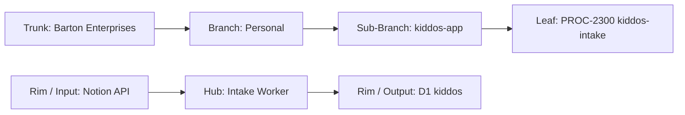

# PROCESS: KIDDOS NOTION INTAKE
## Pulls academic, sports, and health data from Notion pages → validates → writes to D1 kiddos database
### Status: BUILD
### Medium: process
### Business: personal

---

## 📋 UT Checklist (Pre-Flight — per law/UT_CHECKLIST.md v1.2.0)

| # | Check | Status | Location |
|---|-------|--------|----------|
| 1 | PRD — what / why / who / scope / out-of-scope / success metric | ☐ | §2 |
| 2 | OSAM — READ / WRITE / Process Composition / Join Chain / Forbidden / Query Routing filled | ☐ | §5 |
| 3 | Component Status — every dep 🟢 / 🟡 / 🔴 with 1-line state | ☐ | §3 |
| 4 | Owner — human who fixes this at 2 AM | ☐ | §1 |
| 5 | Live Dashboard — URL or explicit "N/A" | ☐ | §3 |
| 6 | Kill Switch — exact command to stop the process | ☐ | §8 |
| 7 | Logbook — last audit verdict + date (after certification only) | ☐ | §12 |
| 8 | FCEs Attached — which FCE runs structurally back this doc | ☐ | §3c |
| 9 | BARs Referenced — every BAR this doc touches, with status | ☐ | §3d |
| 10 | LBB Subjects Fed — which LBB subject(s) this doc's session logs go to | ☐ | §3e |
| 11 | Geometry — CTB position + Hub-Spoke role + Altitude | ☐ | §1b |
| 12 | Live Verification — every numeric count, cron, URL, command, BAR status grounded against the actual system | ☐ | §9b |
| 13 | ctb_node — declared path on Barton Enterprises CTB trunk | ☐ | §1 Identity |

---

# IDENTITY (Thing — what this IS)

## 1. IDENTITY

| Field | Value |
|-------|-------|
| ID | PROC-2300 |
| Name | Kiddos Notion Intake |
| Medium | process |
| Business Silo | personal |
| CTB Position | leaf → personal → kiddos-app → kiddos-intake |
| ORBT | BUILD |
| Strikes | 0 |
| Authority | inherited — kiddos-app |
| Last Modified | 2026-04-16 |
| BAR Reference | BAR-167 (Notion+Google), BAR-168 (academics), BAR-169 (sports) |
| Owner | Dave Barton |
| ctb_node | barton-enterprises/personal/kiddos-app/kiddos-intake |

### 1b. Geometry

**CTB Position:** leaf → personal → kiddos-app → kiddos-intake

**Hub-Spoke Role:** middle (intake processing logic — pulls from Notion spoke, writes to D1 hub)

**Altitude:** 5K execution



### HEIR (8 fields)

| Field | Value |
|-------|-------|
| sovereign_ref | imo-creator |
| hub_id | PROC-2300 |
| ctb_placement | leaf |
| imo_topology | middle |
| cc_layer | CC-04 |
| services | Cloudflare D1 (kiddos), Cloudflare Workers |
| secrets_provider | doppler |
| acceptance_criteria | Notion API pulls valid pages, records validated and written to D1, errors traced |

---

## 2. PURPOSE (PRD)

### WHAT
CF Worker that connects to the Notion API, pulls academic/sports/health pages for each family member, validates the data structure, and writes canonical records to D1 kiddos database keyed by person_id.

### WHY
Without this process, family data stays trapped in Notion with no structured queryable form. Portal (PROC-2800) and Export (PROC-2900) both starve without canonical data in D1. No intake, no downstream operations.

### WHO
- Dave Barton — operator, triggers runs, reviews errors
- PROC-2800 (Portal) — downstream consumer of canonical D1 data
- PROC-2900 (Export) — downstream consumer of canonical D1 data

### SCOPE (in)
- Pull academic pages from Notion → parse → validate → D1 academics table
- Pull sports pages from Notion → parse → validate → D1 sports table
- Pull health/performance pages from Notion → parse → validate → D1 health table
- Write validation failures to D1 errors table with traceability

### OUT-OF-SCOPE
- MatBoss wrestling stats — handled by PROC-2301
- Portal rendering — handled by PROC-2800
- PDF/export generation — handled by PROC-2900
- Notion page creation or modification — read-only intake

### SUCCESS METRIC
All family members have populated records across all 3 branches with validation pass rate > 90%. Points at §10a.

---

## 3. RESOURCES

### Component Status Grid

| Component | HEIR (`hub_id · ctb · cc_layer`) | ORBT | Light | State |
|-----------|----------------------------------|------|-------|-------|
| D1: kiddos | `kiddos · leaf · CC-04` | BUILD | 🟡 | Schema designed, not created |
| Notion API | `notion · spoke · CC-04` | OPERATE | 🟢 | Active, kids use daily |
| CF Worker | `PROC-2300 · leaf · CC-04` | BUILD | 🔴 | Not started |

### Live Dashboard

| Resource | URL | What it shows |
|----------|-----|---------------|
| N/A | — | No dashboard yet |

### Dependencies

| Dependency | Type | What It Provides | Status |
|-----------|------|-----------------|--------|
| D1 kiddos database | database | 5 target tables | PENDING |
| Notion API | service | Family data pages | DONE |
| NOTION_API_KEY | secret | API authentication | PENDING |
| people table seeded | data | 4 person records must exist | PENDING |

### Downstream Consumers

| Consumer | What It Needs |
|----------|--------------|
| PROC-2800 (Portal) | Canonical records in academics, sports, health |
| PROC-2900 (Export) | Canonical records for recruiting packets |

### 3c. FCEs Attached

| FCE Name | HEIR (`hub_id · ctb · cc_layer`) | ORBT | Run Directory | Latest P=1 | Rows | Status |
|----------|----------------------------------|------|--------------|------------|------|--------|
| N/A — predates FCE adoption | — | — | — | — | — | — |

### 3d. BARs Referenced

| BAR | Title | HEIR (`bar-id · ctb · cc_layer`) | ORBT | Status | Relation |
|-----|-------|----------------------------------|------|--------|----------|
| BAR-167 | Notion + Google Integration | `bar-167 · leaf · CC-04` | BUILD | [PENDING — verify in Linear] | implements |
| BAR-168 | Academics Pipeline | `bar-168 · leaf · CC-04` | BUILD | [PENDING — verify in Linear] | implements |
| BAR-169 | Sports Pipeline | `bar-169 · leaf · CC-04` | BUILD | [PENDING — verify in Linear] | implements |

### 3e. LBB Subjects Fed

| LBB Subject | HEIR (`subject-id · ctb · cc_layer`) | ORBT | What This Doc Writes | Frequency |
|-------------|--------------------------------------|------|---------------------|-----------|
| personal | `personal · branch · CC-03` | BUILD | Session summaries, intake run logs | per-session |

---

# CONTRACT (Flow — what flows through this)

## 4. IMO — Input, Middle, Output

### Two-Question Intake
1. **"What triggers this?"** — Cron schedule or manual trigger by Dave
2. **"How do we get it?"** — Notion API — query database pages for each family member

### Input
- Notion API response: pages from configured Notion databases (academic, sports, health)
- Each page has person_id mapped via Notion page property or naming convention

### Middle

| Step | Input | What Happens | Output | Tool Used |
|------|-------|-------------|--------|-----------|
| 1 | Cron/manual trigger | Query Notion API for pages updated since last run | Raw Notion pages | Notion API |
| 2 | Raw Notion pages | Parse page properties, extract structured fields per branch | Parsed records | Worker logic |
| 3 | Parsed records | Validate against D1 schema (person_id must exist in people table) | Valid records + errors | Validation |
| 4 | Valid records | INSERT/UPSERT into D1 canonical table (academics, sports, or health) | D1 rows | D1 INSERT |
| 5 | Validation errors | Write to D1 errors table with source traceability | Error records | D1 INSERT |

### Output
- Canonical records in D1 academics, sports, health tables
- Error records in D1 errors table
- Run summary (counts: pulled, validated, written, errored)

### Circle
Error table review surfaces data quality issues in Notion. Dave corrects Notion pages. Next run pulls corrected data. Sigma tightens on validation pass rate.

---

## 5. OSAM — DATA SCHEMA

### READ Access

| Source | What It Provides | Join Key |
|--------|-----------------|----------|
| Notion API | Raw family data pages | Notion page ID |
| `people` | Person identity — must exist before intake | `person_id` |

### WRITE Access

| Target | What It Writes | When |
|--------|---------------|------|
| `academics` | Class records, grades, semester data | Step 4 |
| `sports` | Sport type, season, events, stats | Step 4 |
| `health` | Workout, nutrition, weight, medical records | Step 4 |
| `errors` | Validation failures | Step 5 |

### Join Chain

```
people.person_id (SOVEREIGN — must exist)
  → academics.person_id (written by this process)
  → sports.person_id (written by this process)
  → health.person_id (written by this process)
  → errors.person_id (written by this process)
```

### Forbidden Paths

| Action | Why |
|--------|-----|
| Write to people table | people is seeded separately — intake doesn't create people |
| Skip validation | Rejected data never enters canonical tables |
| Write to D1 without person_id FK | person_id is sovereign — every record must trace to a person |
| Modify Notion pages | This is read-only intake |

### Query Routing

| Question | Table | Column |
|----------|-------|--------|
| What was pulled in last run? | run log [PENDING] | run_id, timestamp |
| How many errors are open? | `errors` | `status = 'open'`, `source = 'PROC-2300'` |
| What academic records exist for Tyler? | `academics` | `person_id = 'person-tyler'` |

---

## 6. DMJ — Define, Map, Join

### 6a. DEFINE

| Element | ID | Format | Description | C or V |
|---------|-----|--------|-------------|--------|
| Notion Page | notion_page_id | Notion UUID | Source page identity | C |
| Branch Routing | branch | `academic \| sports \| health` | Which D1 table to target | C |
| Person Mapping | person_id | `person-{slug}` | FK to people table | C |
| Page Properties | properties | JSON | Notion page property values | V |

### 6b. MAP

| Source | Target | Transform |
|--------|--------|-----------|
| Notion page title/properties → person name | person_id lookup | match to people.name |
| Notion database type | branch routing key | classify by Notion DB |
| Notion page properties | D1 table columns | parse per branch schema |

### 6c. JOIN

| Join Path | Type | Description |
|-----------|------|-------------|
| Notion page → person_id → people table | direct | Every intake record traces to a person |
| Error → source Notion page ID | direct | Every error traces to its source |

---

## 7. CONSTANTS & VARIABLES (Bedrock §2)

### Constants
- Notion API is the source — read-only
- 3 branches (academic, sports, health) route to 3 D1 tables
- person_id FK is required on every record
- Validation happens at boundary before D1 write
- Errors go to errors table, never silently dropped

### Variables
- Which Notion pages have been updated since last run
- Number of records per branch per run
- Validation pass/fail ratio
- Specific field values (grades, stats, health metrics)

---

## 8. STOP CONDITIONS

| Condition | Action |
|-----------|--------|
| NOTION_API_KEY not set | HALT — cannot connect to Notion |
| person_id not found in people table | REJECT record — person must exist |
| Notion API returns 401/403 | HALT — investigate API key permissions |
| D1 database not created | HALT — run `wrangler d1 create kiddos` |
| Validation errors > 50% | HALT — investigate Notion data quality |
| Strike 3 on same failure | Troubleshoot/Train → AD |

### Kill Switch

```
[PENDING — needs Dave input: exact kill switch command TBD once worker is deployed]
```

---

# GOVERNANCE (Change — how this is controlled)

## 9. VERIFICATION

```
1. Notion API call returns pages → expected: valid JSON with page properties
2. Parse academic page → expected: class_name, semester, grade extracted
3. Validate with person_id → expected: person exists in people table
4. INSERT to D1 academics → expected: row written with correct person_id FK
5. Invalid record → expected: error written to errors table, not canonical
```

**Three Primitives Check:**
1. **Thing:** Does the Notion page exist? Does the person_id exist in people?
2. **Flow:** Does data flow from Notion API → Worker → D1?
3. **Change:** Did validation reject bad data? Did INSERT write correct columns?

---

## 9b. Live Verification Log

| Claim / Field | Section | Source of Truth | Verification Command | Verified? | Last Check | Value |
|---------------|---------|-----------------|---------------------|-----------|-----------|-------|
| Notion API accessible | §3 | Notion API | `curl -H "Authorization: Bearer $NOTION_API_KEY" https://api.notion.com/v1/users/me` | ☐ | — | — |
| D1 kiddos exists | §3 | CF dashboard | `wrangler d1 list \| grep kiddos` | ☐ | — | — |
| BAR-167 status | §3d | Linear | Linear MCP query | ☐ | — | — |

---

## 10. ANALYTICS

### 10a. Metrics

| Metric | Unit | Baseline | Target | Tolerance |
|--------|------|----------|--------|-----------|
| Pages pulled per run | count | BASELINE | — | — |
| Validation pass rate | % | BASELINE | > 90% | — |
| Records written to D1 | count | BASELINE | — | — |
| Errors per run | count | BASELINE | < 10% of total | — |

### 10b. Sigma Tracking

| Metric | Run 1 | Run 2 | Run 3 | Trend | Action |
|--------|-------|-------|-------|-------|--------|
| — | — | — | — | — | _No runs yet_ |

### 10c. ORBT Gate Rules

| From | To | Gate |
|------|-----|------|
| BUILD | OPERATE | Notion connected, all 3 branches writing to D1, pass rate > 90% + auditor sign-off |
| OPERATE | REPAIR | Any intake fails or validation rate drops |
| REPAIR | OPERATE | Fix + metric back + auditor verification |

---

## 11. EXECUTION TRACE

_No entries yet. Process is in BUILD state._

---

## 12. LOGBOOK (After Certification Only)

_No logbook during BUILD._

---

## 13. FLEET FAILURE REGISTRY

| Pattern ID | Location | Error Code | First Seen | Occurrences | Strike Count | Status |
|-----------|----------|-----------|-----------|-------------|-------------|--------|
| — | — | — | — | — | — | _No failures recorded_ |

---

## 14. MAINTENANCE LOGBOOK

### Action Types

| Type | Meaning |
|------|---------|
| RETROFIT | UT structure / template upgrade applied |
| VERIFY | Claim grounded against live system |
| AUDIT | FAA Inspector pass |
| EDIT | Content change |
| CERTIFY | Moved ORBT state |
| REPAIR | Post-strike fix |
| STRIKE | Fleet failure recorded |
| LBB_INGEST | Session summary written to LBB |

### Logbook (append-only)

| Date (ISO) | Actor | Action | What Was Done | Evidence | LBB Record |
|-----------|-------|--------|---------------|----------|------------|
| 2026-04-16 14:00 UTC | Claude | EDIT | Initial PROCESS.md created from UT v2.7.0 | This file | pending |

---

## Document Control

| Field | Value |
|-------|-------|
| Created | 2026-04-16 |
| Last Modified | 2026-04-16 |
| Version | 1.0.0 |
| Template Version | 2.7.0 |
| Medium | process |
| US Validated | pending |
| Governing Engine | law/doctrine/FOUNDATIONAL_BEDROCK.md + law/doctrine/DMJ.md |
