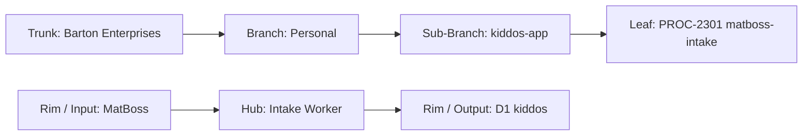

# PROCESS: MATBOSS SPORTS INTAKE
## Pulls wrestling match stats from MatBoss → normalizes → validates → writes to D1 kiddos sports table
### Status: BUILD
### Medium: process
### Business: personal

---

## 📋 UT Checklist (Pre-Flight — per law/UT_CHECKLIST.md v1.2.0)

| # | Check | Status | Location |
|---|-------|--------|----------|
| 1 | PRD — what / why / who / scope / out-of-scope / success metric | ☐ | §2 |
| 2 | OSAM — READ / WRITE / Process Composition / Join Chain / Forbidden / Query Routing filled | ☐ | §5 |
| 3 | Component Status — every dep 🟢 / 🟡 / 🔴 with 1-line state | ☐ | §3 |
| 4 | Owner — human who fixes this at 2 AM | ☐ | §1 |
| 5 | Live Dashboard — URL or explicit "N/A" | ☐ | §3 |
| 6 | Kill Switch — exact command to stop the process | ☐ | §8 |
| 7 | Logbook — last audit verdict + date (after certification only) | ☐ | §12 |
| 8 | FCEs Attached — which FCE runs structurally back this doc | ☐ | §3c |
| 9 | BARs Referenced — every BAR this doc touches, with status | ☐ | §3d |
| 10 | LBB Subjects Fed — which LBB subject(s) this doc's session logs go to | ☐ | §3e |
| 11 | Geometry — CTB position + Hub-Spoke role + Altitude | ☐ | §1b |
| 12 | Live Verification — every numeric count, cron, URL, command, BAR status grounded against the actual system | ☐ | §9b |
| 13 | ctb_node — declared path on Barton Enterprises CTB trunk | ☐ | §1 Identity |

---

# IDENTITY (Thing — what this IS)

## 1. IDENTITY

| Field | Value |
|-------|-------|
| ID | PROC-2301 |
| Name | MatBoss Sports Intake |
| Medium | process |
| Business Silo | personal |
| CTB Position | leaf → personal → kiddos-app → matboss-intake |
| ORBT | BUILD |
| Strikes | 0 |
| Authority | inherited — kiddos-app |
| Last Modified | 2026-04-16 |
| BAR Reference | BAR-288 (MatBoss), BAR-169 (sports pipeline) |
| Owner | Dave Barton |
| ctb_node | barton-enterprises/personal/kiddos-app/matboss-intake |

### 1b. Geometry

**CTB Position:** leaf → personal → kiddos-app → matboss-intake

**Hub-Spoke Role:** middle (intake processing — scrapes MatBoss spoke, writes to D1 hub)

**Altitude:** 5K execution



### HEIR (8 fields)

| Field | Value |
|-------|-------|
| sovereign_ref | imo-creator |
| hub_id | PROC-2301 |
| ctb_placement | leaf |
| imo_topology | middle |
| cc_layer | CC-04 |
| services | Cloudflare D1 (kiddos), Cloudflare Workers |
| secrets_provider | doppler |
| acceptance_criteria | MatBoss data scraped, wrestling stats normalized, validated records in D1 sports table |

---

## 2. PURPOSE (PRD)

### WHAT
CF Worker that scrapes or API-pulls wrestling match data from MatBoss, normalizes the stats into the D1 sports table schema, validates against person_id, and writes canonical sports records for Tyler Barton's wrestling career.

### WHY
MatBoss is the authoritative source for wrestling match statistics (wins, losses, pins, takedowns, near falls, etc.). Without this process, wrestling data stays locked in MatBoss with no way to correlate with health/nutrition data or generate recruiting packets. PROC-2800 (Portal) and PROC-2900 (Export) need structured wrestling data in D1.

### WHO
- Dave Barton — operator, triggers runs, reviews data quality
- Tyler Barton — primary beneficiary (wrestling stats)
- PROC-2800 (Portal) — renders wrestling stats on Tyler's page
- PROC-2900 (Export) — includes wrestling stats in recruiting packets

### SCOPE (in)
- Scrape/pull match data from MatBoss for configured athletes
- Normalize wrestling-specific stats (wins, losses, pins, takedowns, near falls, tech falls, etc.)
- Validate and write to D1 sports table with person_id FK and sport_type='wrestling'
- Store MatBoss platform IDs for cross-reference
- Write validation failures to D1 errors table

### OUT-OF-SCOPE
- Other sports data — handled by PROC-2300 (Notion intake)
- Non-wrestling MatBoss features (team management, etc.)
- MatBoss account management or configuration
- Live match scoring or real-time updates

### SUCCESS METRIC
All Tyler's wrestling matches for the current season in D1 with correct stats. Points at §10a.

---

## 3. RESOURCES

### Component Status Grid

| Component | HEIR (`hub_id · ctb · cc_layer`) | ORBT | Light | State |
|-----------|----------------------------------|------|-------|-------|
| D1: kiddos | `kiddos · leaf · CC-04` | BUILD | 🟡 | Schema designed, not created |
| MatBoss | `matboss · spoke · CC-04` | OPERATE | 🟢 | Tyler's data available |
| CF Worker | `PROC-2301 · leaf · CC-04` | BUILD | 🔴 | Not started |

### Live Dashboard

| Resource | URL | What it shows |
|----------|-----|---------------|
| N/A | — | No dashboard yet |

### Dependencies

| Dependency | Type | What It Provides | Status |
|-----------|------|-----------------|--------|
| D1 kiddos database | database | sports table | PENDING |
| MatBoss access | service | Wrestling match data | DONE |
| MATBOSS_CREDENTIALS | secret | Authentication | PENDING |
| people table seeded | data | person-tyler must exist | PENDING |

### Downstream Consumers

| Consumer | What It Needs |
|----------|--------------|
| PROC-2800 (Portal) | Wrestling stats in D1 sports table |
| PROC-2900 (Export) | Wrestling stats for recruiting packets |

### 3c. FCEs Attached

| FCE Name | HEIR (`hub_id · ctb · cc_layer`) | ORBT | Run Directory | Latest P=1 | Rows | Status |
|----------|----------------------------------|------|--------------|------------|------|--------|
| N/A — predates FCE adoption | — | — | — | — | — | — |

### 3d. BARs Referenced

| BAR | Title | HEIR (`bar-id · ctb · cc_layer`) | ORBT | Status | Relation |
|-----|-------|----------------------------------|------|--------|----------|
| BAR-288 | MatBoss Integration | `bar-288 · leaf · CC-04` | BUILD | [PENDING — verify in Linear] | implements |
| BAR-169 | Sports Pipeline | `bar-169 · leaf · CC-04` | BUILD | [PENDING — verify in Linear] | implements |

### 3e. LBB Subjects Fed

| LBB Subject | HEIR (`subject-id · ctb · cc_layer`) | ORBT | What This Doc Writes | Frequency |
|-------------|--------------------------------------|------|---------------------|-----------|
| personal | `personal · branch · CC-03` | BUILD | Session summaries, MatBoss run logs | per-session |

---

# CONTRACT (Flow — what flows through this)

## 4. IMO — Input, Middle, Output

### Two-Question Intake
1. **"What triggers this?"** — Cron schedule (weekly during season) or manual trigger by Dave
2. **"How do we get it?"** — MatBoss scrape/API — pull match results for configured athlete IDs

### Input
- MatBoss match data: wrestler profile page, season records, individual match results
- Configured athlete IDs (Tyler's MatBoss ID) [PENDING — needs Dave input]

### Middle

| Step | Input | What Happens | Output | Tool Used |
|------|-------|-------------|--------|-----------|
| 1 | Trigger | Connect to MatBoss, pull match data for configured athletes | Raw match data | MatBoss scraper |
| 2 | Raw match data | Parse and normalize: wins, losses, pins, takedowns, near falls, tech falls, opponent, weight class, date | Normalized stats records | Worker logic |
| 3 | Normalized records | Validate: person_id exists, required fields present, no duplicate matches | Valid records + errors | Validation |
| 4 | Valid records | INSERT/UPSERT into D1 sports table with person_id FK, sport_type='wrestling' | D1 rows | D1 INSERT |
| 5 | Validation errors | Write to D1 errors table | Error records | D1 INSERT |

### Output
- Wrestling match records in D1 sports table with sport_type='wrestling'
- Platform IDs stored (MatBoss athlete ID, match ID)
- Error records in D1 errors table
- Run summary (matches pulled, validated, written, errored)

### Circle
Portal displays wrestling stats. Dave reviews for missing matches or incorrect stats. Corrects MatBoss data or adjusts parser. Next run captures corrections. Season-over-season comparison tightens sigma.

---

## 5. OSAM — DATA SCHEMA

### READ Access

| Source | What It Provides | Join Key |
|--------|-----------------|----------|
| MatBoss | Raw match data, season records | MatBoss athlete ID |
| `people` | Person identity — must exist | `person_id` |
| `sports` | Existing records (dedup check) | `person_id + match date + opponent` |

### WRITE Access

| Target | What It Writes | When |
|--------|---------------|------|
| `sports` | Wrestling match records with stats JSON | Step 4 |
| `errors` | Validation/parse failures | Step 5 |

### Join Chain

```
people.person_id (SOVEREIGN)
  → sports.person_id (wrestling records written by this process)
    → sports.platform_id → MatBoss athlete/match ID (external reference)
  → errors.person_id (failures from this process)
```

### Forbidden Paths

| Action | Why |
|--------|-----|
| Write to people table | People seeded separately |
| Write to academics or health tables | Wrong process — use PROC-2300 |
| Skip validation | Rejected data never enters sports table |
| Delete existing sports records | Append-only — update via UPSERT |

### Query Routing

| Question | Table | Column |
|----------|-------|--------|
| Tyler's wrestling record this season? | `sports` | `person_id='person-tyler'`, `sport_type='wrestling'`, `season` |
| How many pins this season? | `sports` | `stats->>'pins'` WHERE conditions above |
| Any MatBoss intake errors? | `errors` | `source = 'PROC-2301'` |

---

## 6. DMJ — Define, Map, Join

### 6a. DEFINE

| Element | ID | Format | Description | C or V |
|---------|-----|--------|-------------|--------|
| MatBoss Athlete ID | matboss_athlete_id | string | External platform identity | C |
| Match | match_id | UUID | D1 record identity | C |
| Weight Class | weight_class | string | Wrestling weight class (e.g., "138") | C |
| Result | result | `win \| loss` | Match outcome | V |
| Win Method | win_method | `decision \| pin \| tech_fall \| major_decision \| forfeit` | How the match was won | V |
| Takedowns | takedowns | integer | Count of takedowns | V |
| Near Falls | near_falls | integer | Count of near falls (2pt + 3pt) | V |
| Opponent | opponent_name | string | Opponent's name | V |

### 6b. MAP

| Source | Target | Transform |
|--------|--------|-----------|
| MatBoss match page | sports.stats JSON | parse + normalize |
| MatBoss athlete ID | sports.platform_id | direct |
| Match date + opponent | dedup key | composite for UPSERT |

### 6c. JOIN

| Join Path | Type | Description |
|-----------|------|-------------|
| sports.person_id → people.person_id | direct | Every match traces to a person |
| sports.platform_id → MatBoss athlete ID | indirect | External platform cross-reference |

---

## 7. CONSTANTS & VARIABLES

### Constants
- MatBoss is the source for wrestling stats — read-only scrape
- sport_type = 'wrestling' for all records from this process
- person_id FK required on every record
- Stats schema: wins, losses, pins, takedowns, near falls, tech falls, weight class
- UPSERT by match date + opponent to prevent duplicates

### Variables
- Number of new matches per run
- Specific stat values per match
- Season (changes yearly)
- Weight class (may change within a season)

---

## 8. STOP CONDITIONS

| Condition | Action |
|-----------|--------|
| MATBOSS_CREDENTIALS not set | HALT |
| MatBoss returns 401/403 | HALT — credentials expired |
| person_id not in people table | REJECT record |
| MatBoss page structure changed | HALT — parser needs update |
| No matches found for season | LOG WARNING — verify season is active |
| Strike 3 on same failure | Troubleshoot/Train → AD |

### Kill Switch

```
[PENDING — needs Dave input: exact kill switch command TBD once worker is deployed]
```

---

# GOVERNANCE (Change — how this is controlled)

## 9. VERIFICATION

```
1. MatBoss scrape returns data → expected: valid match records
2. Parse match → expected: result, takedowns, near_falls, weight_class extracted
3. Validate person_id → expected: person-tyler exists in people table
4. INSERT to sports → expected: row with sport_type='wrestling', stats JSON populated
5. Duplicate match → expected: UPSERT updates, no duplicate row
```

**Three Primitives Check:**
1. **Thing:** Does the MatBoss page exist? Does person_id exist in people?
2. **Flow:** Does data flow from MatBoss → Worker → D1 sports table?
3. **Change:** Did parser extract correct stats? Did UPSERT prevent duplicates?

---

## 9b. Live Verification Log

| Claim / Field | Section | Source of Truth | Verification Command | Verified? | Last Check | Value |
|---------------|---------|-----------------|---------------------|-----------|-----------|-------|
| MatBoss accessible | §3 | MatBoss website | Manual browser check | ☐ | — | — |
| D1 kiddos exists | §3 | CF dashboard | `wrangler d1 list \| grep kiddos` | ☐ | — | — |
| BAR-288 status | §3d | Linear | Linear MCP query | ☐ | — | — |

---

## 10. ANALYTICS

### 10a. Metrics

| Metric | Unit | Baseline | Target | Tolerance |
|--------|------|----------|--------|-----------|
| Matches pulled per run | count | BASELINE | — | — |
| Parse success rate | % | BASELINE | 100% | — |
| Records written to D1 | count | BASELINE | — | — |
| Duplicate detection rate | % | BASELINE | 100% | — |

### 10b. Sigma Tracking

| Metric | Run 1 | Run 2 | Run 3 | Trend | Action |
|--------|-------|-------|-------|-------|--------|
| — | — | — | — | — | _No runs yet_ |

### 10c. ORBT Gate Rules

| From | To | Gate |
|------|-----|------|
| BUILD | OPERATE | MatBoss connected, season data in D1, parse rate 100% + auditor sign-off |
| OPERATE | REPAIR | Parse failures or MatBoss structure change |
| REPAIR | OPERATE | Fix + metric back + auditor verification |

---

## 11. EXECUTION TRACE

_No entries yet. Process is in BUILD state._

---

## 12. LOGBOOK (After Certification Only)

_No logbook during BUILD._

---

## 13. FLEET FAILURE REGISTRY

| Pattern ID | Location | Error Code | First Seen | Occurrences | Strike Count | Status |
|-----------|----------|-----------|-----------|-------------|-------------|--------|
| — | — | — | — | — | — | _No failures recorded_ |

---

## 14. MAINTENANCE LOGBOOK

### Action Types

| Type | Meaning |
|------|---------|
| RETROFIT | UT structure / template upgrade applied |
| VERIFY | Claim grounded against live system |
| AUDIT | FAA Inspector pass |
| EDIT | Content change |
| CERTIFY | Moved ORBT state |
| REPAIR | Post-strike fix |
| STRIKE | Fleet failure recorded |
| LBB_INGEST | Session summary written to LBB |

### Logbook (append-only)

| Date (ISO) | Actor | Action | What Was Done | Evidence | LBB Record |
|-----------|-------|--------|---------------|----------|------------|
| 2026-04-16 14:00 UTC | Claude | EDIT | Initial PROCESS.md created from UT v2.7.0 | This file | pending |

---

## Document Control

| Field | Value |
|-------|-------|
| Created | 2026-04-16 |
| Last Modified | 2026-04-16 |
| Version | 1.0.0 |
| Template Version | 2.7.0 |
| Medium | process |
| US Validated | pending |
| Governing Engine | law/doctrine/FOUNDATIONAL_BEDROCK.md + law/doctrine/DMJ.md |
