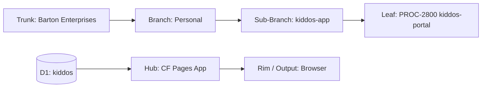
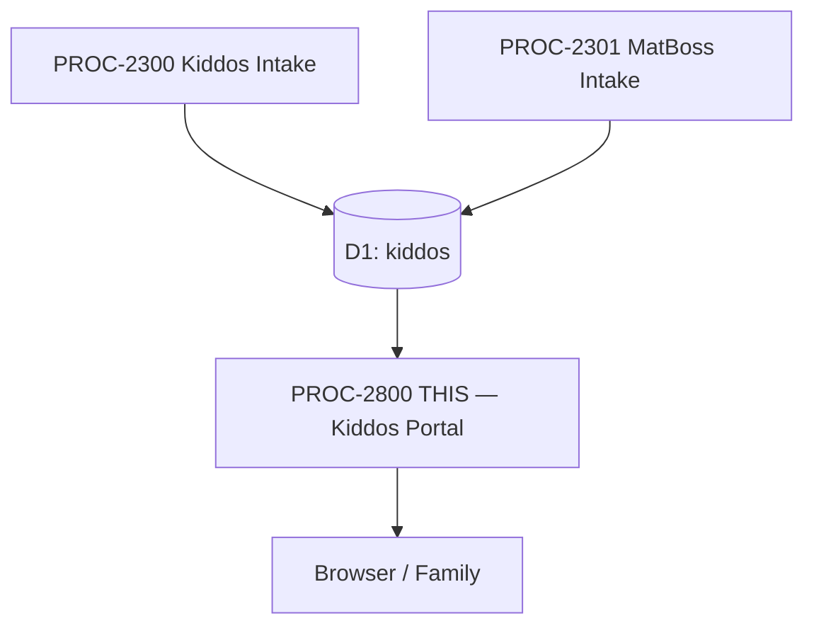

# PROCESS: KIDDOS PORTAL
## CF Pages app rendering per-person portal pages with academic, sports, health data and correlation views
### Status: BUILD
### Medium: process
### Business: personal

---

## 📋 UT Checklist (Pre-Flight — per law/UT_CHECKLIST.md v1.2.0)

| # | Check | Status | Location |
|---|-------|--------|----------|
| 1 | PRD — what / why / who / scope / out-of-scope / success metric | ☐ | §2 |
| 2 | OSAM — READ / WRITE / Process Composition / Join Chain / Forbidden / Query Routing filled | ☐ | §5 |
| 3 | Component Status — every dep 🟢 / 🟡 / 🔴 with 1-line state | ☐ | §3 |
| 4 | Owner — human who fixes this at 2 AM | ☐ | §1 |
| 5 | Live Dashboard — URL or explicit "N/A" | ☐ | §3 |
| 6 | Kill Switch — exact command to stop the process | ☐ | §8 |
| 7 | Logbook — last audit verdict + date (after certification only) | ☐ | §12 |
| 8 | FCEs Attached — which FCE runs structurally back this doc | ☐ | §3c |
| 9 | BARs Referenced — every BAR this doc touches, with status | ☐ | §3d |
| 10 | LBB Subjects Fed — which LBB subject(s) this doc's session logs go to | ☐ | §3e |
| 11 | Geometry — CTB position + Hub-Spoke role + Altitude | ☐ | §1b |
| 12 | Live Verification — every numeric count, cron, URL, command, BAR status grounded against the actual system | ☐ | §9b |
| 13 | ctb_node — declared path on Barton Enterprises CTB trunk | ☐ | §1 Identity |

---

# IDENTITY (Thing — what this IS)

## 1. IDENTITY

| Field | Value |
|-------|-------|
| ID | PROC-2800 |
| Name | Kiddos Portal |
| Medium | process |
| Business Silo | personal |
| CTB Position | leaf → personal → kiddos-app → kiddos-portal |
| ORBT | BUILD |
| Strikes | 0 |
| Authority | inherited — kiddos-app |
| Last Modified | 2026-04-16 |
| BAR Reference | BAR-290 (build app) |
| Owner | Dave Barton |
| ctb_node | barton-enterprises/personal/kiddos-app/kiddos-portal |

### 1b. Geometry

**CTB Position:** leaf → personal → kiddos-app → kiddos-portal

**Hub-Spoke Role:** rim (read-only output boundary — renders D1 data, no write-back)

**Altitude:** 5K execution



### HEIR (8 fields)

| Field | Value |
|-------|-------|
| sovereign_ref | imo-creator |
| hub_id | PROC-2800 |
| ctb_placement | leaf |
| imo_topology | middle |
| cc_layer | CC-04 |
| services | Cloudflare D1 (kiddos), Cloudflare Pages |
| secrets_provider | doppler |
| acceptance_criteria | Each person renders at /:slug, all 3 branches displayed, correlation view functional, cross-person isolation enforced |

---

## 2. PURPOSE (PRD)

### WHAT
CF Pages application that renders per-person portal pages at kiddos.bartonenterprises.com/:slug. Each person sees their own academic, sports, and health data. Includes correlation view showing sports performance vs health/nutrition/workouts over time.

### WHY
Without the portal, D1 data has no human-facing output. The family can't see their own data, can't spot gaps, can't track progress. The correlation view is the highest-value deliverable — connecting wrestling performance to nutrition and workout patterns.

### WHO
- Dave Barton — primary viewer, reviews all family data
- Risa Barton — parent viewer
- Tyler Barton — views own academic, wrestling, health data
- Mallory Barton — views own academic, sports, health data

### SCOPE (in)
- Per-person pages at kiddos.bartonenterprises.com/:slug (tyler, mallory, dave, risa)
- Academic view: semesters, classes, grades, GPA trend
- Sports view: season records, match stats, win/loss trend
- Health view: workout log, nutrition trends, weight tracking
- Correlation view: sports performance ↔ health/nutrition/workouts over time
- Family overview page (all 4 people summary)

### OUT-OF-SCOPE
- Data entry through the portal — portal is read-only rim
- Authentication/access control — [PENDING — needs Dave input: family-only access mechanism]
- PDF export — handled by PROC-2900
- Data intake — handled by PROC-2300 and PROC-2301

### SUCCESS METRIC
All 4 people render at their slugs with data from all 3 branches, correlation view produces visual insights. Points at §10a.

---

## 3. RESOURCES

### Component Status Grid

| Component | HEIR (`hub_id · ctb · cc_layer`) | ORBT | Light | State |
|-----------|----------------------------------|------|-------|-------|
| D1: kiddos | `kiddos · leaf · CC-04` | BUILD | 🟡 | Schema designed, not created |
| CF Pages | `PROC-2800 · leaf · CC-04` | BUILD | 🔴 | Not started |
| PROC-2300 (upstream) | `PROC-2300 · leaf · CC-04` | BUILD | 🔴 | Not started — portal needs data |
| PROC-2301 (upstream) | `PROC-2301 · leaf · CC-04` | BUILD | 🔴 | Not started — portal needs wrestling data |

### Live Dashboard

| Resource | URL | What it shows |
|----------|-----|---------------|
| Kiddos Portal | kiddos.bartonenterprises.com | N/A — not deployed |

### Dependencies

| Dependency | Type | What It Provides | Status |
|-----------|------|-----------------|--------|
| D1 kiddos database | database | All 5 tables for reading | PENDING |
| PROC-2300 | process | Academic, sports, health data in D1 | PENDING |
| PROC-2301 | process | Wrestling stats in D1 | PENDING |
| CF Pages project | hosting | kiddos.bartonenterprises.com | PENDING |
| DNS: kiddos.bartonenterprises.com | infrastructure | Custom domain | PENDING |

### Downstream Consumers

| Consumer | What It Needs |
|----------|--------------|
| Family members | Browser access to portal pages |
| Dave Barton | Correlation views for coaching decisions |

### 3c. FCEs Attached

| FCE Name | HEIR (`hub_id · ctb · cc_layer`) | ORBT | Run Directory | Latest P=1 | Rows | Status |
|----------|----------------------------------|------|--------------|------------|------|--------|
| N/A — predates FCE adoption | — | — | — | — | — | — |

### 3d. BARs Referenced

| BAR | Title | HEIR (`bar-id · ctb · cc_layer`) | ORBT | Status | Relation |
|-----|-------|----------------------------------|------|--------|----------|
| BAR-290 | Build Kiddos App | `bar-290 · branch · CC-03` | BUILD | [PENDING — verify in Linear] | implements |

### 3e. LBB Subjects Fed

| LBB Subject | HEIR (`subject-id · ctb · cc_layer`) | ORBT | What This Doc Writes | Frequency |
|-------------|--------------------------------------|------|---------------------|-----------|
| personal | `personal · branch · CC-03` | BUILD | Session summaries, portal design decisions | per-session |

---

# CONTRACT (Flow — what flows through this)

## 4. IMO — Input, Middle, Output

### Two-Question Intake
1. **"What triggers this?"** — HTTP request to kiddos.bartonenterprises.com/:slug
2. **"How do we get it?"** — Browser navigation by family member or Dave

### Input
- HTTP GET request with /:slug parameter
- slug maps to person_id via people table lookup

### Middle

| Step | Input | What Happens | Output | Tool Used |
|------|-------|-------------|--------|-----------|
| 1 | /:slug | Lookup person_id from people table WHERE slug = :slug | Person record or 404 | D1 SELECT |
| 2 | person_id | Query academics WHERE person_id = X | Academic records | D1 SELECT |
| 3 | person_id | Query sports WHERE person_id = X | Sports records | D1 SELECT |
| 4 | person_id | Query health WHERE person_id = X | Health records | D1 SELECT |
| 5 | All records | Render HTML page with academic, sports, health views + correlation chart | HTML response | CF Pages |

### Output
- HTML page rendered for the requested person
- Correlation view (sports stats over time + health metrics over time, overlaid)
- 404 for unknown slugs

### Circle
Family members view their portal pages. Spot missing data or errors. Enter corrections in Notion. PROC-2300/2301 pulls corrections. Portal re-renders with updated data. Visual feedback loop.

---

## 5. OSAM — DATA SCHEMA

### READ Access

| Source | What It Provides | Join Key |
|--------|-----------------|----------|
| `people` | Person identity + slug → person_id mapping | `slug` / `person_id` |
| `academics` | Academic records for this person | `person_id` |
| `sports` | Sports records for this person | `person_id` |
| `health` | Health records for this person | `person_id` |

### WRITE Access

| Target | What It Writes | When |
|--------|---------------|------|
| — | Portal is READ-ONLY — no writes | Never |

### Process Composition



| Process ID | Name | Role in Composition | Status |
|-----------|------|---------------------|--------|
| PROC-2300 | Kiddos Notion Intake | upstream feeder | 🔴 BUILD |
| PROC-2301 | MatBoss Sports Intake | upstream feeder | 🔴 BUILD |
| PROC-2800 | Kiddos Portal | this — downstream consumer | 🔴 BUILD |

### Join Chain

```
people.slug (URL parameter)
  → people.person_id (sovereign lookup)
    → academics.person_id (academic data)
    → sports.person_id (sports data)
    → health.person_id (health data)
```

### Forbidden Paths

| Action | Why |
|--------|-----|
| Write to ANY D1 table from portal | Portal is read-only rim — no logic in output boundary |
| Show data for person_id != requested slug | Cross-person data isolation — each slug sees ONLY their data |
| Render page for unknown slug | Return 404, not empty page |
| Cache stale data beyond TTL | [PENDING — needs Dave input: cache TTL] |

### Query Routing

| Question | Table | Column |
|----------|-------|--------|
| Does this slug exist? | `people` | `slug` |
| What's Tyler's GPA? | `academics` | `person_id='person-tyler'`, aggregate grades |
| Tyler's wrestling record? | `sports` | `person_id='person-tyler'`, `sport_type='wrestling'` |
| Sports vs health correlation? | `sports` JOIN `health` | `person_id + date range` |

---

## 6. DMJ — Define, Map, Join

### 6a. DEFINE

| Element | ID | Format | Description | C or V |
|---------|-----|--------|-------------|--------|
| URL Slug | slug | kebab-case | URL path parameter | C |
| Person Page | page_view | HTML | Rendered portal page | V |
| Academic View | academic_view | HTML section | GPA, classes, grades | V |
| Sports View | sports_view | HTML section | Records, stats, trends | V |
| Health View | health_view | HTML section | Workouts, nutrition, weight | V |
| Correlation View | correlation_view | chart/HTML | Sports ↔ health over time | V |

### 6b. MAP

| Source | Target | Transform |
|--------|--------|-----------|
| URL /:slug | people.slug lookup | direct |
| D1 academic records | Academic view HTML | render template |
| D1 sports records | Sports view HTML | render template |
| D1 health records | Health view HTML | render template |
| D1 sports + health (time series) | Correlation chart | aggregate + overlay |

### 6c. JOIN

| Join Path | Type | Description |
|-----------|------|-------------|
| slug → people.person_id | direct | URL maps to sovereign identity |
| person_id → all 3 branch tables | direct | All data traces to one person |

---

## 7. CONSTANTS & VARIABLES

### Constants
- Portal is READ-ONLY — no writes to D1
- Each /:slug maps to exactly one person_id
- Cross-person data isolation enforced at query level
- 3 branch views per person (academic, sports, health)
- Correlation view = sports + health joined on person_id + date
- CF Pages renders from D1 queries (no intermediate cache layer initially)

### Variables
- Which person is being viewed (slug)
- Content of each view (depends on D1 data at render time)
- Number of records per branch per person
- Correlation chart data points

---

## 8. STOP CONDITIONS

| Condition | Action |
|-----------|--------|
| D1 kiddos not bound | HALT — Pages function needs D1 binding |
| Unknown slug | Return 404 |
| people table empty | HALT — seed people first |
| No data in any branch for a person | Render empty state with "no data yet" message |
| Strike 3 on same failure | Troubleshoot/Train → AD |

### Kill Switch

```
[PENDING — needs Dave input: exact kill switch — likely `wrangler pages deployment delete` or DNS removal]
```

---

# GOVERNANCE (Change — how this is controlled)

## 9. VERIFICATION

```
1. GET kiddos.bartonenterprises.com/tyler → expected: 200, page with Tyler's data
2. GET kiddos.bartonenterprises.com/mallory → expected: 200, page with Mallory's data
3. GET kiddos.bartonenterprises.com/dave → expected: 200, page with Dave's data
4. GET kiddos.bartonenterprises.com/risa → expected: 200, page with Risa's data
5. GET kiddos.bartonenterprises.com/unknown → expected: 404
6. Tyler's page shows wrestling stats → expected: matches from D1 sports table
7. Correlation view renders → expected: chart with sports + health data overlaid
```

**Three Primitives Check:**
1. **Thing:** Does the CF Pages app exist? Does the D1 binding work? Do all 4 slugs resolve?
2. **Flow:** Does HTTP request → slug lookup → D1 query → rendered page?
3. **Change:** Does the page render correct data per person? Is cross-person isolation working?

---

## 9b. Live Verification Log

| Claim / Field | Section | Source of Truth | Verification Command | Verified? | Last Check | Value |
|---------------|---------|-----------------|---------------------|-----------|-----------|-------|
| Portal URL resolves | §3 | Browser | `curl kiddos.bartonenterprises.com/tyler` | ☐ | — | — |
| D1 binding works | §3 | CF Pages config | CF dashboard check | ☐ | — | — |
| BAR-290 status | §3d | Linear | Linear MCP query | ☐ | — | — |

---

## 10. ANALYTICS

### 10a. Metrics

| Metric | Unit | Baseline | Target | Tolerance |
|--------|------|----------|--------|-----------|
| Page render time | ms | BASELINE | < 500ms | — |
| All 4 slugs render | boolean | false | true | exactly true |
| Correlation view renders | boolean | false | true | exactly true |
| Cross-person isolation | boolean | false | true (verified) | exactly true |

### 10b. Sigma Tracking

| Metric | Run 1 | Run 2 | Run 3 | Trend | Action |
|--------|-------|-------|-------|-------|--------|
| — | — | — | — | — | _No runs yet_ |

### 10c. ORBT Gate Rules

| From | To | Gate |
|------|-----|------|
| BUILD | OPERATE | All 4 slugs render, all 3 branches display, correlation view works + auditor sign-off |
| OPERATE | REPAIR | Any page broken or data isolation failure |
| REPAIR | OPERATE | Fix + metric back + auditor verification |

---

## 11. EXECUTION TRACE

_No entries yet. Process is in BUILD state._

---

## 12. LOGBOOK (After Certification Only)

_No logbook during BUILD._

---

## 13. FLEET FAILURE REGISTRY

| Pattern ID | Location | Error Code | First Seen | Occurrences | Strike Count | Status |
|-----------|----------|-----------|-----------|-------------|-------------|--------|
| — | — | — | — | — | — | _No failures recorded_ |

---

## 14. MAINTENANCE LOGBOOK

### Action Types

| Type | Meaning |
|------|---------|
| RETROFIT | UT structure / template upgrade applied |
| VERIFY | Claim grounded against live system |
| AUDIT | FAA Inspector pass |
| EDIT | Content change |
| CERTIFY | Moved ORBT state |
| REPAIR | Post-strike fix |
| STRIKE | Fleet failure recorded |
| LBB_INGEST | Session summary written to LBB |

### Logbook (append-only)

| Date (ISO) | Actor | Action | What Was Done | Evidence | LBB Record |
|-----------|-------|--------|---------------|----------|------------|
| 2026-04-16 14:00 UTC | Claude | EDIT | Initial PROCESS.md created from UT v2.7.0 | This file | pending |

---

## Document Control

| Field | Value |
|-------|-------|
| Created | 2026-04-16 |
| Last Modified | 2026-04-16 |
| Version | 1.0.0 |
| Template Version | 2.7.0 |
| Medium | process |
| US Validated | pending |
| Governing Engine | law/doctrine/FOUNDATIONAL_BEDROCK.md + law/doctrine/DMJ.md |
