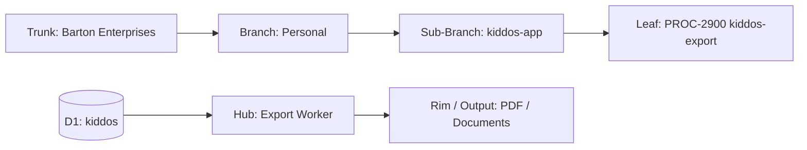
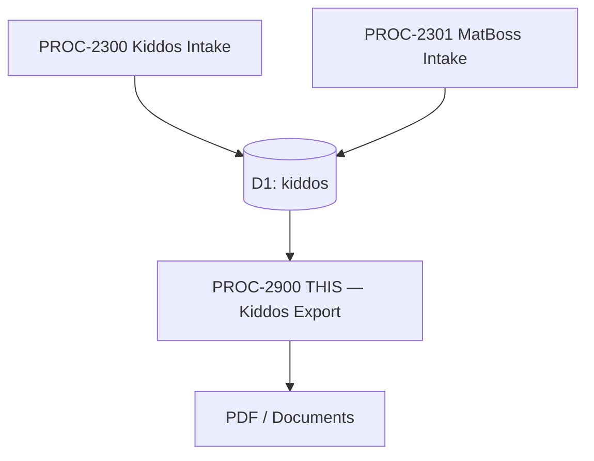

# PROCESS: KIDDOS EXPORT
## Generates recruiting packets, report cards, and PDF output from D1 kiddos data
### Status: BUILD
### Medium: process
### Business: personal

---

## 📋 UT Checklist (Pre-Flight — per law/UT_CHECKLIST.md v1.2.0)

| # | Check | Status | Location |
|---|-------|--------|----------|
| 1 | PRD — what / why / who / scope / out-of-scope / success metric | ☐ | §2 |
| 2 | OSAM — READ / WRITE / Process Composition / Join Chain / Forbidden / Query Routing filled | ☐ | §5 |
| 3 | Component Status — every dep 🟢 / 🟡 / 🔴 with 1-line state | ☐ | §3 |
| 4 | Owner — human who fixes this at 2 AM | ☐ | §1 |
| 5 | Live Dashboard — URL or explicit "N/A" | ☐ | §3 |
| 6 | Kill Switch — exact command to stop the process | ☐ | §8 |
| 7 | Logbook — last audit verdict + date (after certification only) | ☐ | §12 |
| 8 | FCEs Attached — which FCE runs structurally back this doc | ☐ | §3c |
| 9 | BARs Referenced — every BAR this doc touches, with status | ☐ | §3d |
| 10 | LBB Subjects Fed — which LBB subject(s) this doc's session logs go to | ☐ | §3e |
| 11 | Geometry — CTB position + Hub-Spoke role + Altitude | ☐ | §1b |
| 12 | Live Verification — every numeric count, cron, URL, command, BAR status grounded against the actual system | ☐ | §9b |
| 13 | ctb_node — declared path on Barton Enterprises CTB trunk | ☐ | §1 Identity |

---

# IDENTITY (Thing — what this IS)

## 1. IDENTITY

| Field | Value |
|-------|-------|
| ID | PROC-2900 |
| Name | Kiddos Export |
| Medium | process |
| Business Silo | personal |
| CTB Position | leaf → personal → kiddos-app → kiddos-export |
| ORBT | BUILD |
| Strikes | 0 |
| Authority | inherited — kiddos-app |
| Last Modified | 2026-04-16 |
| BAR Reference | BAR-170 (graduation output), BAR-290 (build app) |
| Owner | Dave Barton |
| ctb_node | barton-enterprises/personal/kiddos-app/kiddos-export |

### 1b. Geometry

**CTB Position:** leaf → personal → kiddos-app → kiddos-export

**Hub-Spoke Role:** middle (export processing — reads D1 hub, produces document output)

**Altitude:** 5K execution



### HEIR (8 fields)

| Field | Value |
|-------|-------|
| sovereign_ref | imo-creator |
| hub_id | PROC-2900 |
| ctb_placement | leaf |
| imo_topology | middle |
| cc_layer | CC-04 |
| services | Cloudflare D1 (kiddos), Cloudflare Workers |
| secrets_provider | doppler |
| acceptance_criteria | Recruiting packet PDF generated per person, report cards include all semesters with GPA, graduation output meets BAR-170 |

---

## 2. PURPOSE (PRD)

### WHAT
CF Worker that queries D1 kiddos database and generates formatted output documents: recruiting packets (academic + sports stats combined), report cards (semester-by-semester GPA and grades), and graduation summaries. Output is downloadable PDF or structured document.

### WHY
Without this process, there's no way to package family data for external consumption. Tyler needs a wrestling recruiting packet with academic credentials and athletic stats combined. Graduation summaries need structured academic history. Report cards need formatted semester views. All data exists in D1 — this process formats and exports it.

### WHO
- Dave Barton — triggers exports, reviews output quality
- Tyler Barton — recruiting packet recipient (for college coaches)
- Mallory Barton — future recruiting packet recipient
- College coaches — external consumers of recruiting packets
- School administrators — graduation verification [PENDING — needs Dave input]

### SCOPE (in)
- Wrestling recruiting packet: athlete profile + academic GPA + wrestling stats + season records
- Report card export: per-semester, per-class grades with GPA calculation
- Graduation summary: cumulative academic record
- Per-person exports (one person per packet/report)
- PDF generation or structured document output [PENDING — needs Dave input: PDF library choice]

### OUT-OF-SCOPE
- Data intake — handled by PROC-2300 and PROC-2301
- Portal rendering — handled by PROC-2800
- Sending/emailing packets to coaches — manual for now
- Financial aid applications — not in scope
- Video/media attachments — [PENDING — needs Dave input]

### SUCCESS METRIC
Recruiting packet generates cleanly for Tyler with current season stats + GPA. Report card exports all semesters accurately. Points at §10a.

---

## 3. RESOURCES

### Component Status Grid

| Component | HEIR (`hub_id · ctb · cc_layer`) | ORBT | Light | State |
|-----------|----------------------------------|------|-------|-------|
| D1: kiddos | `kiddos · leaf · CC-04` | BUILD | 🟡 | Schema designed, not created |
| CF Worker | `PROC-2900 · leaf · CC-04` | BUILD | 🔴 | Not started |
| PDF library | [PENDING] | BUILD | 🔴 | Library not chosen |
| PROC-2300 (upstream) | `PROC-2300 · leaf · CC-04` | BUILD | 🔴 | Needs data in D1 |
| PROC-2301 (upstream) | `PROC-2301 · leaf · CC-04` | BUILD | 🔴 | Needs wrestling data in D1 |

### Live Dashboard

| Resource | URL | What it shows |
|----------|-----|---------------|
| N/A | — | No dashboard yet |

### Dependencies

| Dependency | Type | What It Provides | Status |
|-----------|------|-----------------|--------|
| D1 kiddos database | database | All canonical data for export | PENDING |
| PROC-2300 | process | Academic, sports, health data in D1 | PENDING |
| PROC-2301 | process | Wrestling stats in D1 | PENDING |
| PDF generation library | tool | Document rendering | PENDING |
| R2 bucket (optional) | storage | Store generated PDFs | [PENDING — needs Dave input] |

### Downstream Consumers

| Consumer | What It Needs |
|----------|--------------|
| Dave Barton | Downloads PDF packets |
| College coaches | Receive recruiting packets (manually sent) |

### 3c. FCEs Attached

| FCE Name | HEIR (`hub_id · ctb · cc_layer`) | ORBT | Run Directory | Latest P=1 | Rows | Status |
|----------|----------------------------------|------|--------------|------------|------|--------|
| N/A — predates FCE adoption | — | — | — | — | — | — |

### 3d. BARs Referenced

| BAR | Title | HEIR (`bar-id · ctb · cc_layer`) | ORBT | Status | Relation |
|-----|-------|----------------------------------|------|--------|----------|
| BAR-170 | Graduation Output | `bar-170 · leaf · CC-04` | BUILD | [PENDING — verify in Linear] | implements |
| BAR-290 | Build Kiddos App | `bar-290 · branch · CC-03` | BUILD | [PENDING — verify in Linear] | implements |

### 3e. LBB Subjects Fed

| LBB Subject | HEIR (`subject-id · ctb · cc_layer`) | ORBT | What This Doc Writes | Frequency |
|-------------|--------------------------------------|------|---------------------|-----------|
| personal | `personal · branch · CC-03` | BUILD | Session summaries, export template decisions | per-session |

---

# CONTRACT (Flow — what flows through this)

## 4. IMO — Input, Middle, Output

### Two-Question Intake
1. **"What triggers this?"** — Manual trigger by Dave (HTTP request or CLI) specifying person + export type
2. **"How do we get it?"** — D1 query for all data branches for the specified person

### Input
- Export request: person_id + export_type (recruiting_packet | report_card | graduation_summary)
- Triggered by Dave via HTTP endpoint or CLI

### Middle

| Step | Input | What Happens | Output | Tool Used |
|------|-------|-------------|--------|-----------|
| 1 | person_id + export_type | Validate person exists, determine template | Export config | D1 SELECT |
| 2 | Export config | Query academics for this person (all semesters, classes, grades) | Academic data | D1 SELECT |
| 3 | Export config | Query sports for this person (seasons, stats, records) | Sports data | D1 SELECT |
| 4 | Export config | Query health for this person (if relevant to export type) | Health data | D1 SELECT |
| 5 | All queried data | Apply template, calculate aggregates (GPA, win/loss record), render document | PDF or structured doc | PDF library |

### Output
- PDF document (recruiting packet, report card, or graduation summary)
- Stored to R2 or returned directly [PENDING — needs Dave input]
- Export log record

### Circle
Dave reviews generated packets. Spots errors or missing data. Corrects source data in Notion. PROC-2300/2301 pulls corrections. Re-generate export. Quality tightens per iteration.

---

## 5. OSAM — DATA SCHEMA

### READ Access

| Source | What It Provides | Join Key |
|--------|-----------------|----------|
| `people` | Person identity (name, DOB, role) | `person_id` |
| `academics` | All academic records for GPA/grades | `person_id` |
| `sports` | All sport records for stats/records | `person_id` |
| `health` | Health data (if relevant to export type) | `person_id` |

### WRITE Access

| Target | What It Writes | When |
|--------|---------------|------|
| R2 bucket (optional) | Generated PDF files | Step 5 [PENDING] |
| Export log [PENDING] | Record of what was generated, when, for whom | Step 5 |

### Process Composition



| Process ID | Name | Role in Composition | Status |
|-----------|------|---------------------|--------|
| PROC-2300 | Kiddos Notion Intake | upstream feeder | 🔴 BUILD |
| PROC-2301 | MatBoss Sports Intake | upstream feeder | 🔴 BUILD |
| PROC-2900 | Kiddos Export | this — downstream consumer | 🔴 BUILD |

### Join Chain

```
people.person_id (SOVEREIGN)
  → academics.person_id (for GPA, grades)
  → sports.person_id (for stats, records)
  → health.person_id (for health metrics, if relevant)
```

### Forbidden Paths

| Action | Why |
|--------|-----|
| Write to D1 canonical tables | Export is read-only — no data modification |
| Generate packet without person_id | Must trace to sovereign identity |
| Include data from other person_ids | Cross-person isolation — one person per export |
| Skip GPA calculation on report cards | GPA is a required aggregate |

### Query Routing

| Question | Table | Column |
|----------|-------|--------|
| What's Tyler's cumulative GPA? | `academics` | `person_id='person-tyler'`, aggregate grades |
| Tyler's wrestling record? | `sports` | `person_id='person-tyler'`, `sport_type='wrestling'` |
| What exports have been generated? | export_log [PENDING] | `person_id`, `export_type`, `created_at` |

---

## 6. DMJ — Define, Map, Join

### 6a. DEFINE

| Element | ID | Format | Description | C or V |
|---------|-----|--------|-------------|--------|
| Export Type | export_type | `recruiting_packet \| report_card \| graduation_summary` | Type of document | C |
| Template | template_id | string | Document template for this export type | C |
| GPA | gpa | decimal (0.00-4.00) | Calculated aggregate | V |
| Win/Loss Record | record | `W-L` | Calculated from sports stats | V |
| PDF Output | pdf_bytes | binary | Generated document | V |

### 6b. MAP

| Source | Target | Transform |
|--------|--------|-----------|
| D1 academic records | Template academic section | aggregate + format |
| D1 sports records | Template sports section | aggregate + format |
| D1 health records | Template health section (if applicable) | aggregate + format |
| Calculated GPA | Template GPA field | weighted average of grades |
| Calculated W/L | Template record field | count wins/losses from sports |

### 6c. JOIN

| Join Path | Type | Description |
|-----------|------|-------------|
| person_id → all 3 branch tables | direct | All export data traces to one person |
| export_type → template | direct | Each type maps to exactly one template |

---

## 7. CONSTANTS & VARIABLES

### Constants
- 3 export types: recruiting_packet, report_card, graduation_summary
- One person per export — no cross-person mixing
- GPA calculated as weighted average (how to weight = [PENDING — needs Dave input])
- Win/loss record calculated from sports.stats where sport_type matches
- Export is read-only on D1 — generates output, doesn't modify source
- person_id is sovereign — every export traces to a person

### Variables
- Which person the export is for
- Which export type requested
- Content of the generated document (depends on D1 data at generation time)
- Number of semesters/seasons included
- File size of generated PDF

---

## 8. STOP CONDITIONS

| Condition | Action |
|-----------|--------|
| person_id not in people table | REJECT — person must exist |
| No academic records for report_card export | HALT — nothing to export |
| No sports records for recruiting_packet | LOG WARNING — academic-only packet possible |
| PDF library unavailable | HALT — cannot generate output |
| Strike 3 on same failure | Troubleshoot/Train → AD |

### Kill Switch

```
[PENDING — needs Dave input: exact kill switch command TBD once worker is deployed]
```

---

# GOVERNANCE (Change — how this is controlled)

## 9. VERIFICATION

```
1. POST /export { person_id: 'person-tyler', type: 'recruiting_packet' } → expected: 200, PDF returned
2. PDF contains Tyler's name, GPA, wrestling record → expected: correct values from D1
3. POST /export { person_id: 'person-tyler', type: 'report_card' } → expected: 200, all semesters listed
4. POST /export { person_id: 'unknown', type: 'report_card' } → expected: 404
5. GPA calculation → expected: matches manual calculation from D1 grades
```

**Three Primitives Check:**
1. **Thing:** Does the person exist? Does the data exist in D1? Does the PDF library work?
2. **Flow:** Does data flow from D1 → Worker → PDF → download?
3. **Change:** Did GPA calculate correctly? Did template render all fields? Is the PDF valid?

---

## 9b. Live Verification Log

| Claim / Field | Section | Source of Truth | Verification Command | Verified? | Last Check | Value |
|---------------|---------|-----------------|---------------------|-----------|-----------|-------|
| D1 kiddos exists | §3 | CF dashboard | `wrangler d1 list \| grep kiddos` | ☐ | — | — |
| PDF library available | §3 | package.json | `grep pdf package.json` | ☐ | — | — |
| BAR-170 status | §3d | Linear | Linear MCP query | ☐ | — | — |

---

## 10. ANALYTICS

### 10a. Metrics

| Metric | Unit | Baseline | Target | Tolerance |
|--------|------|----------|--------|-----------|
| Export generation time | ms | BASELINE | < 5000ms | — |
| PDF file size | KB | BASELINE | < 5000KB | — |
| GPA accuracy | boolean | false | verified correct | exactly true |
| All export types functional | count | 0 | 3 | exactly 3 |

### 10b. Sigma Tracking

| Metric | Run 1 | Run 2 | Run 3 | Trend | Action |
|--------|-------|-------|-------|-------|--------|
| — | — | — | — | — | _No runs yet_ |

### 10c. ORBT Gate Rules

| From | To | Gate |
|------|-----|------|
| BUILD | OPERATE | All 3 export types generate, GPA verified correct, PDF renders cleanly + auditor sign-off |
| OPERATE | REPAIR | Any export fails or GPA incorrect |
| REPAIR | OPERATE | Fix + metric back + auditor verification |

---

## 11. EXECUTION TRACE

_No entries yet. Process is in BUILD state._

---

## 12. LOGBOOK (After Certification Only)

_No logbook during BUILD._

---

## 13. FLEET FAILURE REGISTRY

| Pattern ID | Location | Error Code | First Seen | Occurrences | Strike Count | Status |
|-----------|----------|-----------|-----------|-------------|-------------|--------|
| — | — | — | — | — | — | _No failures recorded_ |

---

## 14. MAINTENANCE LOGBOOK

### Action Types

| Type | Meaning |
|------|---------|
| RETROFIT | UT structure / template upgrade applied |
| VERIFY | Claim grounded against live system |
| AUDIT | FAA Inspector pass |
| EDIT | Content change |
| CERTIFY | Moved ORBT state |
| REPAIR | Post-strike fix |
| STRIKE | Fleet failure recorded |
| LBB_INGEST | Session summary written to LBB |

### Logbook (append-only)

| Date (ISO) | Actor | Action | What Was Done | Evidence | LBB Record |
|-----------|-------|--------|---------------|----------|------------|
| 2026-04-16 14:00 UTC | Claude | EDIT | Initial PROCESS.md created from UT v2.7.0 | This file | pending |

---

## Document Control

| Field | Value |
|-------|-------|
| Created | 2026-04-16 |
| Last Modified | 2026-04-16 |
| Version | 1.0.0 |
| Template Version | 2.7.0 |
| Medium | process |
| US Validated | pending |
| Governing Engine | law/doctrine/FOUNDATIONAL_BEDROCK.md + law/doctrine/DMJ.md |
