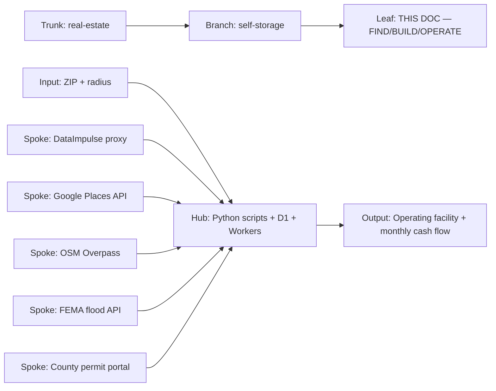
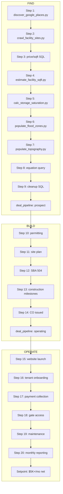

# PROC-1000 — Real Estate Deal Finder Execution
## Full three-step lifecycle — FIND → BUILD → OPERATE — for a self-storage deal from blank market to revenue-generating facility
### Status: BUILD
### Medium: process
### Business: real-estate

---

## UT Checklist (Pre-Flight)

_Every UT doc MUST carry this block at the top. Check a box when the referenced section is filled. A doc does not ship (ORBT=OPERATE) without all 13 items checked. Unchecked = grounded._

| # | Check | Status | Location |
|---|-------|--------|----------|
| 1 | PRD — what / why / who / scope / out-of-scope / success metric | ☑ | §2 |
| 2 | OSAM — READ / WRITE / Join Chain / Forbidden Paths / Query Routing filled | ☑ | §5 |
| 3 | Component Status — every dependency has light with 1-line state | ☑ | §3 |
| 4 | Owner — human who fixes this at 2 AM | ☑ | §1 |
| 5 | Live Dashboard — URL or explicit "N/A" | ☑ | §3 |
| 6 | Kill Switch — exact command to stop the process | ☑ | §8 |
| 7 | Logbook — last audit verdict + date (after certification only) | ☐ | §12 |
| 8 | FCEs Attached — which FCE runs structurally back this doc | ☑ | §3c |
| 9 | BARs Referenced — every BAR this doc touches, with status | ☑ | §3d |
| 10 | LBB Subjects Fed — which LBB subject(s) this doc's session logs go to | ☑ | §3e |
| 11 | Geometry — CTB position + Hub-Spoke role + Altitude | ☑ | §1b |
| 12 | Live Verification — every numeric count, cron, URL, command, BAR status grounded against the actual system | ☑ (14 of 16 rows ☑; 2 require manual browser check: GCP quota, DataImpulse spend) | §9b |
| 13 | ctb_node — declared path on Barton Enterprises CTB trunk | ☑ | §1 Identity |

---

# IDENTITY (Thing — what this IS)

_Everything in this cluster answers: what exists? These are constants that don't change regardless of who reads this or when._

## 1. IDENTITY

| Field | Value |
|-------|-------|
| ID | PROC-1000 |
| Name | Real Estate Deal Finder — Full Lifecycle Execution |
| Medium | process |
| Business Silo | real-estate |
| CTB Position | branch / real-estate / deal-finder / execution |
| ORBT | BUILD |
| Strikes | 0 |
| Authority | inherited — STORAGE_REPO_UT.md (imo-creator domains/storage/) is the parent blueprint |
| Last Modified | 2026-04-16 |
| BAR Reference | BAR-325, BAR-326, BAR-327, BAR-328, BAR-329, BAR-330, BAR-331, BAR-332 |
| Owner | Dave Barton — on the hook at 2 AM |
| ctb_node | `barton-enterprises/real-estate/self-storage/deal-finder` |

### 1b. Geometry (Checklist item 11 — Bedrock §4 + §7)

**CTB Position:** `trunk → real-estate → self-storage → deal-finder → execution` (this doc is the execution leaf of the deal-finder branch)

**Hub-Spoke Role:** Hub — all pipeline logic lives here across three phases. Scripts are the Middle. D1 is the rim (schema in, read-only views out).

**Altitude:** 5k execution — exact commands, exact scripts, exact costs. The blueprint (STORAGE_REPO_UT.md) is at 30k. This doc is at 5k.



### HEIR (8 fields — Aviation Model, Bedrock §8)

| Field | Value |
|-------|-------|
| sovereign_ref | imo-creator |
| hub_id | proc-1000-execution |
| ctb_placement | leaf |
| imo_topology | middle |
| cc_layer | CC-04 process |
| services | svg-d1-storage (D1), storage-hub CF Worker, content-fetcher CF Worker, DataImpulse proxy, Google Places API, OSM Overpass API, Nominatim, FEMA Flood Map API, Doppler |
| secrets_provider | doppler (project: imo-creator, config: dev) |
| acceptance_criteria | All three phases complete: FIND (sovereign P=1 verdict) → BUILD (CF occupancy permit obtained, construction complete) → OPERATE (facility live, tenants paying, monthly net ≥ $5,000). |

---

## 2. PURPOSE (PRD)

_What breaks without it. What business outcome it serves._

### WHAT
This document is the HOW for the complete self-storage deal lifecycle — FIND, BUILD, and OPERATE. It gives the exact commands to run the 7-step FIND pipeline, documents the BUILD phase (permitting → financing → construction), and specifies the OPERATE phase (website → tenants → payments → gates → reporting). It references the blueprint (STORAGE_REPO_UT.md) for architecture decisions, schema definitions, and constants. This doc is what you open when you're actually executing any phase of a deal.

### WHY
Without this, each phase requires reconstructing execution order, CLI syntax, and D1 schema from memory. The three-phase lifecycle is the constant — every self-storage deal flows through the same sequence regardless of market. This doc locks that sequence so any mechanic can execute without reconstruction.

### WHO
Dave Barton — primary operator. Any mechanic executing on Dave's behalf for FIND runs or operational tasks.

### SCOPE (in)
- FIND: All 9 execution steps with exact CLI commands, including flood zone and topography enrichment
- BUILD: Permitting process, site plan, SBA 504 financing, construction milestones — documented even where tools are PENDING
- OPERATE: Website, tenant onboarding, payments (Stripe), gate access, maintenance, monthly reporting — documented even where tools are PENDING
- Sovereign lifecycle: how one sovereign ID flows from D1 table to D1 table across all three phases
- The 12-comparator go/no-go equation
- Annual re-crawl procedure

### OUT-OF-SCOPE
- Schema definitions and table column references → STORAGE_REPO_UT.md (blueprint, domains/storage/ in imo-creator)
- Build cost math and equation derivation → STORAGE_REPO_UT.md §7 and §14
- Architecture decisions (why these scripts, why this D1 structure) → STORAGE_REPO_UT.md §4
- Dashboard UI → Mission Control (imo-dashboard pages app)
- Land acquisition negotiation → separate process (PROC-1010, not yet built)

### SUCCESS METRIC
A sovereign ID ("15522-100mi") that enters FIND as a blank market exits OPERATE as a revenue-generating facility producing ≥ $5,000/month net at 80% occupancy.

---

## 3. RESOURCES

_Everything this depends on. Read this before running._

### Component Status Grid (Checklist item 3)

| Component | HEIR (`hub_id · ctb · cc_layer`) | ORBT | Light | State |
|-----------|----------------------------------|------|-------|-------|
| svg-d1-storage (D1) | svg-d1-storage · trunk · CC-02 | OPERATE | 🟢 | Storage domain database — all FIND tables exist and seeded |
| storage-hub CF Worker | storage-hub · branch · CC-03 | OPERATE | 🟢 | REST API deployed at storage-hub.svg-outreach.workers.dev |
| content-fetcher CF Worker | content-fetcher · branch · CC-03 | OPERATE | 🟢 | Used by crawl_facility_sites.py via service binding |
| DataImpulse proxy | vendor · leaf · CC-04 | OPERATE | 🟢 | PROXY_USER, PROXY_PASS, PROXY_PORT=823 in Doppler |
| Google Places API | vendor · leaf · CC-04 | OPERATE | 🟢 | GOOGLE_MAPS_API_KEY in Doppler — 1K free req/mo then $0.002/req |
| OSM Overpass API | vendor · leaf · CC-04 | OPERATE | 🟢 | Free — no key needed |
| Nominatim geocoder | vendor · leaf · CC-04 | OPERATE | 🟢 | Free — no key needed |
| FEMA Flood Map API | vendor · leaf · CC-04 | OPERATE | 🟢 | populate_flood_zones.py — free, no key needed |
| OpenTopoData API | vendor · leaf · CC-04 | OPERATE | 🟢 | populate_topography.py — free, no key needed |
| OpenRouter | vendor · leaf · CC-04 | OPERATE | 🟢 | OPENROUTER_API_KEY in Doppler — LLM tail arbiter |
| pub_zips_master | table · trunk · CC-02 | OPERATE | 🟢 | 45,094 ZIPs seeded — read-only reference |
| Python scripts (factory/agents/up/) | scripts · leaf · CC-04 | OPERATE | 🟢 | All FIND scripts present and tested in PA/WV corridor runs |
| Stripe (BUILD/OPERATE) | vendor · leaf · CC-04 | PENDING | 🔴 | Not yet integrated — required for OPERATE payment collection |
| Smart lock / gate API (OPERATE) | vendor · leaf · CC-04 | PENDING | 🔴 | Vendor not yet selected — BAR-330 covers this |
| Facility website (OPERATE) | vendor · leaf · CC-04 | PENDING | 🔴 | Vendor selected via BAR-327 tournament — not yet deployed |
| build_milestones table (BUILD) | table · branch · CC-03 | PENDING | 🔴 | Schema designed in §5 — not yet migrated to D1 |
| facility_operations table (OPERATE) | table · branch · CC-03 | PENDING | 🔴 | Schema designed in §5 — not yet migrated to D1 |

### Live Dashboard (Checklist item 5)

| Resource | URL | What it shows |
|----------|-----|---------------|
| Mission Control — Real Estate | https://imo-dashboard.pages.dev | Saturation map, facility count, deal pipeline, P=1 alerts |
| storage-hub health | https://storage-hub.svg-outreach.workers.dev/health | Worker alive / D1 binding confirmed |

### Dependencies

| Dependency | Type | What It Provides | Status |
|-----------|------|-----------------|--------|
| svg-d1-storage | D1 database | All storage domain tables — facilities, saturation, ZIPs, jurisdictions, build constants | DONE |
| pub_zips_master | D1 table | 45,094 ZIPs with density, population, county FIPS — geographic filter base | DONE |
| Doppler (imo-creator, dev) | Secrets | PROXY_USER, PROXY_PASS, PROXY_PORT, GOOGLE_MAPS_API_KEY, OPENROUTER_API_KEY, LBB_API_KEY | DONE |
| Python 3 + pip deps | Runtime | requests, sqlite3 (via wrangler D1), beautifulsoup4, geopy | DONE |
| wrangler CLI | CLI tool | CWD for all D1 queries: `workers/storage-hub` | DONE |
| SBA 504 lender (BUILD) | External | Construction + permanent financing | PENDING — sourced per deal |
| General contractor (BUILD) | External | Construction execution | PENDING — sourced per deal |
| County building department (BUILD) | External | Permits and inspections | PENDING — sourced per deal |

### Downstream Consumers

| Consumer | What It Needs |
|----------|--------------|
| Mission Control — Real Estate page | pub_market_saturation rows, pub_storage_facilities data, deal_pipeline stage |
| Dave (Telegram via Nix) | P=1 alert: ZIP + market price + saturation ratio + monthly net projection |
| SBA 504 lender | deal_pipeline record: market data, build cost projections, P=1 evidence |

### Tools & Integrations

| Item | Type | Cost Tier | Credentials | What It Does |
|------|------|-----------|-------------|-------------|
| DataImpulse | Proxy | ~$8-10/full FIND run | PROXY_USER, PROXY_PASS, PROXY_PORT | Routes scraping through residential IPs |
| Google Places API | REST API | Free 1K req/mo then $0.002/req | GOOGLE_MAPS_API_KEY | Text search "storage facilities near [ZIP]" |
| OSM Overpass API | REST API | Free | None | Building polygon queries for sqft estimation |
| Nominatim | REST API | Free | None | Address → lat/lon geocoding fallback |
| FEMA Flood Map API | REST API | Free | None | Flood zone classification per lat/lon |
| OpenTopoData API | REST API | Free | None | Elevation data for topography classification |
| OpenRouter | LLM API | ~$0.01/call | OPENROUTER_API_KEY | LLM tail arbiter |
| Stripe (OPERATE) | Payment | 2.9% + $0.30/transaction | STRIPE_SECRET_KEY (PENDING) | Tenant payment collection |
| Smart lock API (OPERATE) | Hardware API | TBD | TBD | Gate access control |

### Secrets

| Secret | Doppler Project | Config | Used By |
|--------|----------------|--------|---------|
| PROXY_USER | imo-creator | dev | discover_google_places.py, crawl_facility_sites.py |
| PROXY_PASS | imo-creator | dev | same |
| PROXY_PORT | imo-creator | dev | same (value: 823) |
| GOOGLE_MAPS_API_KEY | imo-creator | dev | discover_google_places.py |
| OPENROUTER_API_KEY | imo-creator | dev | LLM tail arbiter |
| LBB_API_KEY | imo-creator | dev | Post-run LBB ingest |
| STRIPE_SECRET_KEY | imo-creator | dev | PENDING — OPERATE phase |

### 3c. FCEs Attached (Checklist item 8)

| FCE Name | HEIR (`hub_id · ctb · cc_layer`) | ORBT | Run Directory | Latest P=1 | Rows | Status |
|----------|----------------------------------|------|--------------|------------|------|--------|
| Market Saturation FCE | deal-finder-fce · branch · CC-03 | BUILD | factory/processes/real-estate-deal-finder/ | pending | 26,316 sat rows | 🟡 |
| Build Math FCE | build-math-fce · branch · CC-03 | BUILD | factory/processes/real-estate-deal-finder/ | pending | 13 constants | 🟡 |

### 3d. BARs Referenced (Checklist item 9)

| BAR | Title | HEIR (`bar-id · ctb · cc_layer`) | ORBT | Status | Relation |
|-----|-------|----------------------------------|------|--------|----------|
| BAR-325 | Storage market discovery scripts | BAR-325 · leaf · CC-04 | BUILD | Todo | implements FIND Steps 1-2 |
| BAR-326 | Facility website crawler | BAR-326 · leaf · CC-04 | BUILD | Todo | implements FIND Step 2 |
| BAR-327 | Saturation calculation engine | BAR-327 · leaf · CC-04 | BUILD | Todo | implements FIND Step 5 / website vendor tournament |
| BAR-328 | Go/No-Go equation wiring | BAR-328 · leaf · CC-04 | BUILD | Todo | implements FIND Step 6 |
| BAR-329 | Deal pipeline + Telegram alerts | BAR-329 · leaf · CC-04 | BUILD | In Progress | implements deal_pipeline FIND→BUILD transition |
| BAR-330 | Gate access vendor selection | BAR-330 · leaf · CC-04 | BUILD | Todo | implements OPERATE gate access |
| BAR-331 | Facility operations schema | BAR-331 · leaf · CC-04 | BUILD | Todo | implements OPERATE D1 tables |
| BAR-332 | Annual re-crawl procedure | BAR-332 · leaf · CC-04 | BUILD | Todo | implements FIND annual refresh |

### 3e. LBB Subjects Fed (Checklist item 10)

| LBB Subject | HEIR (`subject-id · ctb · cc_layer`) | ORBT | What This Doc Writes | Frequency |
|-------------|--------------------------------------|------|---------------------|-----------|
| real-estate | real-estate · branch · CC-03 | BUILD | Session summaries, market run results, P=1 discoveries, deal milestones | per-run |
| processes | processes · branch · CC-03 | BUILD | Process learnings, error patterns, step corrections | on-change |

---

# CONTRACT (Flow — what flows through this)

_Everything in this cluster answers: what moves?_

## 4. IMO — Input, Middle, Output

### Two-Question Intake (Bedrock §3)
1. **"What triggers this?"** — Dave has a target ZIP code and radius in miles. He wants to know if there is a buildable self-storage market there, and if so, to take it from vacant land to operating facility.
2. **"How do we get it?"** — Dave supplies ZIP + radius on the CLI for FIND. BUILD triggers on a signed purchase agreement. OPERATE triggers on a Certificate of Occupancy.

### Input

**Phase 1 — FIND:**
- **ZIP code** — center of the target market (e.g., 15522 for Bedford, PA)
- **Radius in miles** — market scope (e.g., 50 or 100)
- **ENV vars** from Doppler: PROXY_USER, PROXY_PASS, PROXY_PORT=823, GOOGLE_MAPS_API_KEY, OPENROUTER_API_KEY
- **Working directory**: `imo-creator-v2-20260317/factory/agents/up/` for all script runs
- **Wrangler CWD**: `workers/storage-hub` for all D1 SQL queries

**Phase 2 — BUILD:**
- Signed purchase agreement (sovereign_id now has a specific parcel)
- deal_pipeline record at stage=`contract`
- SBA 504 lender engagement letter
- Approved site plan from architect

**Phase 3 — OPERATE:**
- Certificate of Occupancy from county building department
- deal_pipeline record at stage=`operating`
- Stripe account configured
- Smart lock system installed and API credentials loaded

### Middle — The Three-Phase Pipeline

#### PHASE 1: FIND (Steps 1-9)

| Step | What | Command | Output | Est. Time | Est. Cost |
|------|------|---------|--------|-----------|-----------|
| 1 | Discover facilities | `discover_google_places.py --zip [ZIP] --radius [MI]` | sovereign_market_search, sovereign_market_zips, pub_storage_facilities | ~30 min (24 agents) | Google Places API credits |
| 2 | Crawl facility websites | `crawl_facility_sites.py --count 500 --batch N --total-batches 24` | pub_storage_facilities updated with pricing; facility_sitemap | ~2-3 hrs (24 agents) | ~$8-10 DataImpulse |
| 3 | Calculate price/sqft | SQL UPDATE | price_per_sqft on all facilities with asking_rent_10x10 | Instant | Free |
| 4 | Estimate building sqft | `estimate_facility_sqft.py --all` | total_sqft, sqft_method per facility | ~1 hr | Free (OSM only) |
| 5 | Calculate saturation | `calc_storage_saturation.py --state [ST]` | pub_market_saturation: saturation_ratio, saturation_level, gap_sqft per ZIP | Instant | Free |
| 6 | Populate flood zones | `populate_flood_zones.py` | pub_storage_facilities.flood_zone per facility | ~15 min | Free (FEMA API) |
| 7 | Populate topography | `populate_topography.py` | pub_storage_facilities.elevation, slope_class per facility | ~15 min | Free (OpenTopoData) |
| 8 | Run go/no-go equation | Query (12 comparators) | P=1 ZIPs with full diagnostic vector | Instant | Free |
| 9 | Cleanup | SQL DELETE + dedup | Remove no-address facilities, dedup name+ZIP | Instant | Free |

#### PHASE 2: BUILD (Steps 10-14) — _Tools partially PENDING_

| Step | What | Tool | Output | Notes |
|------|------|------|--------|-------|
| 10 | Permitting | County portal lookup | Approved conditional use permit or variance | PENDING — manual process, see §4 BUILD detail |
| 11 | Site plan | Architect + storage-hub API | Approved site plan with unit mix | PENDING — no automation yet |
| 12 | Financing | SBA 504 application | Loan approval letter | PENDING — manual process, see §4 BUILD detail |
| 13 | Construction | GC milestones in build_milestones table | CF issued, framing, MEP rough, insulation, drywall, final inspection | PENDING — table schema designed, migration pending |
| 14 | Certificate of Occupancy | County building department | CO issued → deal_pipeline.stage = 'operating' | PENDING — manual trigger |

#### PHASE 3: OPERATE (Steps 15-20) — _Tools partially PENDING_

| Step | What | Tool | Output | Notes |
|------|------|------|--------|-------|
| 15 | Website launch | Vendor from BAR-327 tournament | Live facility website with unit availability and online rental | PENDING — vendor selected, not yet deployed |
| 16 | Tenant onboarding | Website + storage-hub API | facility_operations.tenants record per tenant | PENDING — requires BAR-331 schema |
| 17 | Payment collection | Stripe | Monthly ACH / card charge per tenant | PENDING — requires STRIPE_SECRET_KEY integration |
| 18 | Gate access | Smart lock API | Tenant code → gate open event logged | PENDING — requires BAR-330 vendor selection |
| 19 | Maintenance scheduling | Manual → facility_operations.maintenance | maintenance_log record per service event | PENDING — manual until automation built |
| 20 | Monthly reporting | SQL query → Telegram/dashboard | Monthly revenue, occupancy %, net cash flow vs. setpoint | PENDING — query designed in §4 OPERATE detail |

---

### PHASE 1 DETAILED EXECUTION

#### Step 1 — Facility Discovery (Full Commands)

```bash
# CWD: imo-creator-v2-20260317/factory/agents/up/

# Test run first — processes 5 ZIPs, verify output before full run
PROXY_USER=xxx PROXY_PASS=xxx PROXY_PORT=823 \
GOOGLE_MAPS_API_KEY=xxx \
python3 discover_google_places.py --zip 15522 --radius 50 --test

# Verify: check pub_storage_facilities for new rows
# Then full run with 24 parallel agents:
PROXY_USER=xxx PROXY_PASS=xxx PROXY_PORT=823 \
GOOGLE_MAPS_API_KEY=xxx \
bash run_market_discovery.sh 15522 50 24
```

**What happens:**
- Creates sovereign_market_search record (UUID) for this run
- Pulls all ZIPs in radius from pub_zips_master
- Applies filters: density < 500 (rural), population > 500 (no ghost towns)
- Writes filtered ZIPs to sovereign_market_zips
- Calls Google Places "text search" API: "storage facilities near [ZIP]"
- Writes name, address, lat/lon, place_id to pub_storage_facilities with source='google_places_v2'

**Expected output:** ~500-2,000 facilities for a 50-mile radius rural market.

**Error handling:**
- Google Places 429 → wait 60s, retry. Persistent → check quota in GCP console.
- Proxy connection refused → check PROXY_USER/PROXY_PASS in Doppler, verify DataImpulse account balance.
- D1 write failures → check `wrangler whoami`, verify CWD is workers/storage-hub.

#### Step 2 — Crawl Facility Websites (Full Commands)

```bash
# CWD: imo-creator-v2-20260317/factory/agents/up/
# Run 24 parallel instances — each batch handles a slice of facilities

# Terminal 1..24 (run in screen/tmux):
PROXY_USER=xxx PROXY_PASS=xxx PROXY_PORT=823 \
python3 crawl_facility_sites.py --count 500 --batch 1 --total-batches 24

PROXY_USER=xxx PROXY_PASS=xxx PROXY_PORT=823 \
python3 crawl_facility_sites.py --count 500 --batch 2 --total-batches 24

# ... repeat for batches 3 through 24
```

**What happens:**
- Pulls facilities with source_url from pub_storage_facilities
- Each batch: `facility_id % total_batches == batch - 1`
- Hits each website through DataImpulse residential proxy
- Follows internal links up to 50 pages per site
- Regex extracts 12 fields: address, phone, pricing (5x5 / 10x10 / 10x15 / 10x20 / 10x30), hours, climate flag, 24hr access, unit count
- Records URL per field → facility_sitemap
- Geocodes via Nominatim when lat/lon missing
- Sets scrape_status = 'crawled' on completion

**Expected output:** asking_rent_10x10 on 15-40% of facilities.

**Error handling:**
- fetch_failed (403/404/timeout) → normal. scrape_status='fetch_failed'. Move on.
- multi_address → scrape_status='multi_address'. Manual review.
- Proxy ban → rotate session (restart crawl). DataImpulse auto-rotates IPs; if persistent, wait 30 min.

#### Step 3 — Calculate Price Per Square Foot

```bash
# CWD: workers/storage-hub

npx wrangler d1 execute svg-d1-storage --remote --command "
UPDATE pub_storage_facilities
SET price_per_sqft = ROUND(CAST(asking_rent_10x10 AS REAL) / 100.0, 2)
WHERE asking_rent_10x10 > 0
  AND asking_rent_10x10 IS NOT NULL"
```

**Constant:** 10x10 unit = 100 sqft. asking_rent_10x10 stored in cents. price_per_sqft = cents / 100.0 = USD/sqft/month. Price floor = $0.72/sqft/month.

**Verify:**
```bash
npx wrangler d1 execute svg-d1-storage --remote --command "
SELECT COUNT(*) as with_price, AVG(price_per_sqft) as avg_price
FROM pub_storage_facilities
WHERE price_per_sqft > 0"
```

#### Step 4 — Estimate Facility Square Footage

```bash
# CWD: imo-creator-v2-20260317/factory/agents/up/

python3 estimate_facility_sqft.py --all
```

**What happens:**
- Queries OSM Overpass API with bounding box around each facility lat/lon
- Finds building footprint polygon tagged amenity=storage or building=yes
- Calculates sqft from polygon via shoelace formula
- Writes total_sqft and sqft_method ('osm_polygon' or 'needs_review') to pub_storage_facilities

**LIMITATION:** Bounding box currently hardcoded to Bedford PA corridor (lat 39.59-40.31, lon -79.01 to -78.09). For a new market, update bounding box constants in the script before running `--all`.

**Cost:** Free (OSM only). No vision fallback.

**Error handling:**
- OSM returns empty → sqft_method='needs_review'. Manual review required.
- All OSM empty → check lat/lon population (Step 2 geocode may have failed). Verify bounding box matches target market.

#### Step 5 — Calculate Market Saturation

```bash
# CWD: imo-creator-v2-20260317/factory/agents/up/

python3 calc_storage_saturation.py --state PA

# Multi-state markets:
python3 calc_storage_saturation.py --state PA
python3 calc_storage_saturation.py --state WV
```

**What happens:**
- demand_sqft = population × 6 (6 sqft per capita — industry constant)
- supply_sqft = SUM(total_sqft) per ZIP
- saturation_ratio = supply_sqft / demand_sqft
- saturation_level: < 0.7 = UNDERSERVED, 0.7-1.0 = BALANCED, > 1.0 = OVERSATURATED
- Writes one row per ZIP to pub_market_saturation

**Verify:**
```bash
npx wrangler d1 execute svg-d1-storage --remote --command "
SELECT saturation_level, COUNT(*) as zip_count
FROM pub_market_saturation
GROUP BY saturation_level
ORDER BY zip_count DESC"
```

#### Step 6 — Populate Flood Zones

```bash
# CWD: imo-creator-v2-20260317/factory/agents/up/

python3 populate_flood_zones.py
```

**What happens:**
- Reads all facilities from pub_storage_facilities where flood_zone IS NULL
- Calls FEMA Flood Map Service Center API with each facility's lat/lon
- Maps FEMA zone code → flood risk classification: X = low, AE/A = high, VE = coastal
- Writes flood_zone (FEMA code) and flood_risk_class to pub_storage_facilities
- High flood risk (AE/VE) is a hard NO-GO comparator in the equation

**Cost:** Free (FEMA public API).

**Error handling:**
- FEMA API timeout → retry with exponential backoff (built into script)
- Facility has no lat/lon → skip, mark flood_zone = 'NEEDS_GEOCODE'
- API returns zone = 'UNMAPPED' → mark flood_risk_class = 'unknown', flag for manual FEMA map check

**Verify:**
```bash
npx wrangler d1 execute svg-d1-storage --remote --command "
SELECT flood_risk_class, COUNT(*) as facility_count
FROM pub_storage_facilities
WHERE flood_risk_class IS NOT NULL
GROUP BY flood_risk_class"
```

#### Step 7 — Populate Topography

```bash
# CWD: imo-creator-v2-20260317/factory/agents/up/

python3 populate_topography.py
```

**What happens:**
- Reads facilities from pub_storage_facilities where slope_class IS NULL
- Calls OpenTopoData API (free elevation dataset) with each facility's lat/lon
- Derives slope from elevation delta across nearby sample points
- Classifies slope: flat (< 2%), gentle (2-5%), steep (> 5%)
- Flat land required for single-story drive-up storage construction
- Writes elevation_ft, slope_pct, slope_class to pub_storage_facilities
- slope_class = 'steep' is a comparator input — not automatic NO-GO but adds construction cost

**Cost:** Free (OpenTopoData public API).

**Error handling:**
- API rate limit → sleep 1s between calls (built into script)
- lat/lon missing → skip, mark slope_class = 'NEEDS_GEOCODE'

**Verify:**
```bash
npx wrangler d1 execute svg-d1-storage --remote --command "
SELECT slope_class, COUNT(*) as facility_count
FROM pub_storage_facilities
WHERE slope_class IS NOT NULL
GROUP BY slope_class"
```

#### Step 8 — Run the Go/No-Go Equation (12 Comparators)

No script — query. The equation fires when all primary comparators pass.

**The equation:**
```
P(x; θ) = 1  if  max_i [ C_i(x) / k_i ] ≤ 1
P(x; θ) = 0  otherwise
```

**12 Comparators:**

| # | Comparator C_i(x) | Threshold k_i | Source |
|---|-------------------|---------------|--------|
| C1 | saturation_ratio | 1.0 (< 1.0 = room exists) | pub_market_saturation |
| C2 | 0.72 / market_price_per_sqft | 1.0 (market > $0.72 → C2 < 1) | pub_storage_facilities AVG |
| C3 | flood_risk_class = 'high' → 2.0, else 0 | 1.0 (AE/VE = automatic NO-GO) | pub_storage_facilities |
| C4 | slope_class = 'steep' → 1.5, gentle → 0.7, flat → 0 | 1.0 (steep = NO-GO without grading cost model) | pub_storage_facilities |
| C5 | permit_type = 'prohibited' → 2.0, 'conditional' → 0.9, 'by_right' → 0 | 1.0 | pub_jurisdiction_storage_rules |
| C6 | nearest_competitor_miles < 3 → 1.5, < 5 → 0.8, ≥ 5 → 0 | 1.0 | calc_competition_proximity.py |
| C7 | population_growth_rate < 0 → 1.2, ≥ 0 → 0 | 1.0 | pub_zips_master.population_trend |
| C8 | road_access_class = 'none' → 2.0, 'arterial' → 0, 'highway' → 0 | 1.0 | manual review input |
| C9 | lot_size_acres < 1.5 → 1.2, ≥ 1.5 → 0 | 1.0 | parcel data (Regrid or manual) |
| C10 | land_cost_per_acre > 50000 → 1.5, > 30000 → 0.8, ≤ 30000 → 0 | 1.0 | per-deal land listing |
| C11 | gap_sqft < 10000 → 1.2, ≥ 10000 → 0 | 1.0 (small gaps may not support a full facility) | pub_market_saturation |
| C12 | annual_permit_count (active housing) < 5 → 0.5, ≥ 5 → 0 | 1.0 (growth signal — low = caution, not NO-GO) | county permit data (manual) |

**Primary comparators (C1 + C2) run via SQL. C3-C8 run via SQL on enriched D1 data. C9-C12 require manual input per parcel.**

**P=1 SQL query (C1-C6 automated):**
```bash
npx wrangler d1 execute svg-d1-storage --remote --command "
SELECT
  s.zip,
  z.city,
  z.state,
  z.population,
  ROUND(s.saturation_ratio, 3) as sat_ratio,
  s.saturation_level,
  s.gap_sqft,
  ROUND(AVG(f.price_per_sqft), 3) as mkt_price,
  COUNT(CASE WHEN f.price_per_sqft > 0 THEN 1 END) as priced_competitors,
  MAX(f.flood_risk_class) as worst_flood_class,
  MAX(f.slope_class) as worst_slope
FROM pub_market_saturation s
JOIN pub_zips_master z ON s.zip = z.zip
LEFT JOIN pub_storage_facilities f ON s.zip = f.zip
WHERE s.saturation_ratio < 1.0
  AND s.gap_sqft >= 10000
GROUP BY s.zip
HAVING mkt_price > 0.72
  AND worst_flood_class != 'high'
ORDER BY sat_ratio ASC, mkt_price DESC
LIMIT 25"
```

#### Step 9 — Cleanup

```bash
# Remove facilities with no verified address
npx wrangler d1 execute svg-d1-storage --remote --command "
DELETE FROM pub_storage_facilities
WHERE (address IS NULL OR address = '')
  AND scrape_status = 'crawled'"

# Find dupes first:
npx wrangler d1 execute svg-d1-storage --remote --command "
SELECT name, zip, COUNT(*) as dupes
FROM pub_storage_facilities
GROUP BY name, zip
HAVING dupes > 1
ORDER BY dupes DESC
LIMIT 20"

# Delete duplicate with fewer populated fields:
# DELETE FROM pub_storage_facilities WHERE id = [id_of_duplicate]
```

---

### PHASE 2 DETAILED EXECUTION — BUILD

_This phase begins when Dave has a signed purchase agreement on a parcel in a P=1 ZIP. The sovereign_id transitions in deal_pipeline from stage='prospect' to stage='contract'._

#### Step 10 — Permitting

**Status: PENDING — manual process until county permit lookup automation is built.**

```bash
# Update deal_pipeline when purchase agreement signed:
npx wrangler d1 execute svg-d1-storage --remote --command "
UPDATE deal_pipeline
SET stage = 'contract', contract_date = datetime('now')
WHERE sovereign_id = '[SOVEREIGN_ID]'"
```

**Manual process:**
1. Identify county from ZIP → pub_jurisdictions.jurisdiction_id
2. Look up pub_jurisdiction_storage_rules for that jurisdiction:
   ```bash
   npx wrangler d1 execute svg-d1-storage --remote --command "
   SELECT j.county_name, j.state, jsr.*
   FROM pub_jurisdictions j
   JOIN pub_jurisdiction_storage_rules jsr ON j.id = jsr.jurisdiction_id
   WHERE j.county_fips = (SELECT county_fips FROM pub_zips_master WHERE zip = '[ZIP]')"
   ```
3. If permit_type = 'by_right' → proceed to site plan. Standard building permit only.
4. If permit_type = 'conditional' → file conditional use application with county planning board. Timeline: 30-90 days. Cost: $200-1,500.
5. If permit_type = 'prohibited' → HALT. This was C5 NO-GO — should have been caught in Step 8.

**Typical permit requirements:**
- Site plan (engineered, see Step 11)
- Stormwater management plan
- Traffic impact study (some counties)
- Setback documentation (from pub_jurisdiction_storage_rules.setback_ft)
- Maximum height compliance (pub_jurisdiction_storage_rules.max_height_ft)

**Tool to build (PENDING):** `lookup_county_permits.py` — automate the county portal query for current permit status. BAR-329 tracks this.

#### Step 11 — Site Plan Generation

**Status: PENDING — no automation. Manual with architect.**

**Process:**
1. Engage licensed civil engineer or architect
2. Inputs: parcel boundary (from Regrid or county GIS), setbacks (from D1), unit mix target
3. Deliverable: engineered site plan showing building footprint, aisles, parking, utility connections, stormwater management
4. Standard unit mix for rural market (from pub_build_constants): 50% 10x10, 30% 10x15, 20% 10x20
5. Target size: gap_sqft from pub_market_saturation × 0.5 (don't oversupply in one build)

**Tool to build (PENDING):** `generate_site_plan_spec.py` — produce a PDF spec from D1 constants + parcel data to hand to architect. No CAD automation — just the spec sheet.

#### Step 12 — Financing (SBA 504)

**Status: PENDING — manual application.**

**SBA 504 structure (locked constants from pub_build_constants):**
- SBA portion: 40% of total project cost, 20-year fixed
- Bank portion: 50% of total project cost, 10-year variable
- Equity: 10% (Dave's contribution)
- Total project cost = (lot_size_sqft × $35/sqft construction) + land acquisition

**Required documentation for lender:**
1. Signed purchase agreement (land)
2. Approved site plan (Step 11)
3. P=1 market analysis export (from Step 8 query results — print to PDF)
4. Financial projections (from build math FCE output)
5. 3 years personal tax returns (Dave)
6. Personal financial statement

**SBA 504 application timeline:** 60-90 days from submission to approval. Budget $5,000-10,000 in closing costs.

**Tool to build (PENDING):** `generate_sba_504_package.py` — pull market data, build projections, format into SBA-ready PDF. BAR-329 expanded scope.

```bash
# Update deal_pipeline when financing approved:
npx wrangler d1 execute svg-d1-storage --remote --command "
UPDATE deal_pipeline
SET stage = 'financed', financing_approved_date = datetime('now'),
    loan_amount_cents = [AMOUNT_IN_CENTS]
WHERE sovereign_id = '[SOVEREIGN_ID]'"
```

#### Step 13 — Construction Management

**Status: PENDING — build_milestones table schema designed, migration not yet run.**

**build_milestones table schema (to be migrated):**
```sql
CREATE TABLE IF NOT EXISTS build_milestones (
  id TEXT PRIMARY KEY,
  sovereign_id TEXT NOT NULL,
  milestone TEXT NOT NULL,      -- 'cf_issued', 'grading', 'foundation', 'framing', 'mep_rough',
                                --  'insulation', 'drywall', 'gates_installed', 'final_inspection', 'co_issued'
  target_date TEXT,             -- ISO date
  actual_date TEXT,             -- ISO date — null until complete
  contractor TEXT,
  cost_cents INTEGER,
  status TEXT DEFAULT 'pending',-- 'pending', 'in_progress', 'complete', 'delayed'
  notes TEXT,
  created_at TEXT DEFAULT (datetime('now')),
  updated_at TEXT DEFAULT (datetime('now'))
);
```

**Standard construction milestones for single-story drive-up self-storage:**

| Milestone | Typical Duration | Key Inspection |
|-----------|-----------------|----------------|
| cf_issued | Day 1 (after permit approved) | — |
| grading | Week 1-2 | County grade inspection |
| foundation | Week 3-6 | Footer + slab inspection |
| framing | Week 7-12 | Framing inspection |
| mep_rough | Week 13-14 | Rough electrical + plumbing |
| insulation | Week 15 | Insulation inspection (if climate units) |
| drywall | Week 16-18 | — |
| gates_installed | Week 18-20 | — |
| final_inspection | Week 20-24 | Final building inspection |
| co_issued | Week 22-26 | Certificate of Occupancy |

**Total construction timeline: 5-7 months typical.**

```bash
# Seed build_milestones when construction starts:
# (run after build_milestones table migration)
npx wrangler d1 execute svg-d1-storage --remote --command "
INSERT INTO build_milestones (id, sovereign_id, milestone, target_date, status)
VALUES
  (lower(hex(randomblob(16))), '[SOVEREIGN_ID]', 'cf_issued', '[DATE]', 'pending'),
  (lower(hex(randomblob(16))), '[SOVEREIGN_ID]', 'grading', '[DATE]', 'pending'),
  (lower(hex(randomblob(16))), '[SOVEREIGN_ID]', 'foundation', '[DATE]', 'pending'),
  (lower(hex(randomblob(16))), '[SOVEREIGN_ID]', 'framing', '[DATE]', 'pending'),
  (lower(hex(randomblob(16))), '[SOVEREIGN_ID]', 'mep_rough', '[DATE]', 'pending'),
  (lower(hex(randomblob(16))), '[SOVEREIGN_ID]', 'final_inspection', '[DATE]', 'pending'),
  (lower(hex(randomblob(16))), '[SOVEREIGN_ID]', 'co_issued', '[DATE]', 'pending')"

# Update deal_pipeline when construction begins:
npx wrangler d1 execute svg-d1-storage --remote --command "
UPDATE deal_pipeline
SET stage = 'construction', construction_start_date = datetime('now')
WHERE sovereign_id = '[SOVEREIGN_ID]'"
```

#### Step 14 — Certificate of Occupancy → OPERATE Trigger

```bash
# When CO issued — transition to OPERATE:
npx wrangler d1 execute svg-d1-storage --remote --command "
UPDATE deal_pipeline
SET stage = 'operating', co_issued_date = datetime('now')
WHERE sovereign_id = '[SOVEREIGN_ID]';

UPDATE build_milestones
SET actual_date = datetime('now'), status = 'complete'
WHERE sovereign_id = '[SOVEREIGN_ID]' AND milestone = 'co_issued'"
```

---

### PHASE 3 DETAILED EXECUTION — OPERATE

_This phase begins when the CO is issued and deal_pipeline.stage = 'operating'. All OPERATE steps feed into facility_operations table (pending migration) and the monthly reporting loop._

**facility_operations table schema (to be migrated):**
```sql
CREATE TABLE IF NOT EXISTS facility_operations (
  id TEXT PRIMARY KEY,
  sovereign_id TEXT NOT NULL,
  record_type TEXT NOT NULL,     -- 'tenant', 'payment', 'gate_event', 'maintenance', 'monthly_report'
  tenant_id TEXT,                -- for tenant + payment + gate records
  unit_id TEXT,                  -- which unit
  amount_cents INTEGER,          -- for payment records
  event_timestamp TEXT,          -- ISO-8601
  status TEXT,                   -- 'active', 'late', 'vacated', 'scheduled', 'complete'
  data_json TEXT,                -- flexible payload per record_type
  created_at TEXT DEFAULT (datetime('now'))
);
```

#### Step 15 — Website Launch

**Status: PENDING — vendor selected via BAR-327 tournament, deployment not yet run.**

**Vendor tournament result (BAR-327):** [outcome TBD — BAR-327 in progress]

**Required website features (from P=1 requirements):**
- Unit availability display (pull from facility_operations via storage-hub API)
- Online rental / lease signing
- Online payment (Stripe integration)
- Google Maps embedded (drives organic search for "[city] storage units")
- Gate access code delivery on lease signing

**Launch checklist:**
1. DNS record for facility domain (e.g., bedfordstorage.com) → Cloudflare
2. Populate unit inventory in storage-hub API
3. Connect Stripe payment account
4. Test end-to-end: unit select → lease sign → payment → gate code delivered
5. Google Business Profile claimed and verified

#### Step 16 — Tenant Onboarding

**Status: PENDING — requires facility_operations table migration.**

**Tenant onboarding flow (when a unit is rented):**
1. Tenant selects unit on website
2. Lease signed electronically (DocuSign or equivalent)
3. First month + deposit charged via Stripe
4. Gate access code generated and delivered via SMS/email
5. facility_operations record written: record_type='tenant', status='active'

```bash
# Manual tenant insert (until website automation built):
npx wrangler d1 execute svg-d1-storage --remote --command "
INSERT INTO facility_operations (id, sovereign_id, record_type, tenant_id, unit_id, status, event_timestamp, data_json)
VALUES (
  lower(hex(randomblob(16))),
  '[SOVEREIGN_ID]',
  'tenant',
  '[TENANT_ID]',
  '[UNIT_ID]',
  'active',
  datetime('now'),
  '{\"name\":\"[NAME]\",\"email\":\"[EMAIL]\",\"phone\":\"[PHONE]\",\"unit_size\":\"10x10\",\"monthly_rate_cents\":[RATE]}'
)"
```

#### Step 17 — Payment Collection (Stripe)

**Status: PENDING — requires STRIPE_SECRET_KEY in Doppler + storage-hub Stripe binding.**

**Payment structure:**
- Monthly auto-draft via Stripe recurring charge
- Late fee: $10 after 5 days (or per state law)
- Lien process: 60-day delinquency → certified mail → public auction (per state statute)

**When built, payment events write to facility_operations:**
```sql
record_type = 'payment'
amount_cents = monthly_rate_cents
status = 'collected' | 'failed' | 'late'
```

**Error handling:**
- Failed charge → retry day 3 + day 7, then flag as delinquent
- Delinquent > 60 days → trigger lien workflow (manual until lien automation built)

#### Step 18 — Gate Access

**Status: PENDING — BAR-330 covers vendor selection.**

**Requirements from BAR-330:**
- Cloud-managed smart lock system
- Tenant code assigned per unit at lease signing
- Gate events logged (entry + exit with timestamp + unit_id)
- Remote management (lock/unlock units for delinquent tenants)

**When built, gate events write to facility_operations:**
```sql
record_type = 'gate_event'
tenant_id = [who entered/exited]
unit_id = [their unit]
event_timestamp = [when]
data_json = '{"event_type": "entry|exit", "access_code_used": "[code]"}'
```

#### Step 19 — Maintenance Scheduling

**Status: PENDING — manual until maintenance automation built.**

**Standard maintenance schedule:**
- Monthly: drive-aisle inspection, lighting check, gate mechanism test
- Quarterly: seal around unit doors, clean gutters, pest inspection
- Annually: repaint, lock cylinder service, camera system review

```bash
# Log maintenance event:
npx wrangler d1 execute svg-d1-storage --remote --command "
INSERT INTO facility_operations (id, sovereign_id, record_type, event_timestamp, status, data_json)
VALUES (
  lower(hex(randomblob(16))),
  '[SOVEREIGN_ID]',
  'maintenance',
  datetime('now'),
  'complete',
  '{\"type\":\"monthly_inspection\",\"performed_by\":\"[NAME]\",\"notes\":\"[NOTES]\"}'
)"
```

#### Step 20 — Monthly Reporting

**Status: PENDING — query designed, Telegram delivery not yet wired.**

**Monthly report query (run on the 1st of each month):**
```bash
npx wrangler d1 execute svg-d1-storage --remote --command "
SELECT
  sovereign_id,
  COUNT(CASE WHEN record_type='tenant' AND status='active' THEN 1 END) as active_tenants,
  COUNT(CASE WHEN record_type='tenant' THEN 1 END) as total_units_occupied,
  SUM(CASE WHEN record_type='payment' AND strftime('%Y-%m', event_timestamp) = strftime('%Y-%m', 'now', '-1 month') THEN amount_cents ELSE 0 END) / 100.0 as last_month_gross_revenue,
  COUNT(CASE WHEN record_type='payment' AND status='failed' AND strftime('%Y-%m', event_timestamp) = strftime('%Y-%m', 'now', '-1 month') THEN 1 END) as failed_payments_last_month
FROM facility_operations
WHERE sovereign_id = '[SOVEREIGN_ID]'"
```

**Setpoint for monthly report:**
- Gross revenue ≥ $X,XXX (from build math — 80% occupancy × unit count × market rate)
- Occupancy ≥ 80% by month 6
- Net cash flow ≥ $5,000/month (gross - debt service - maintenance)

**Monthly report writes to facility_operations:**
```sql
record_type = 'monthly_report'
data_json = '{"gross_revenue": N, "occupancy_pct": N, "net_cash_flow": N, "active_tenants": N}'
```

---

### SOVEREIGN LIFECYCLE — How One Deal Flows Through All Three Phases

_This is how the sovereign ID "15522-100mi" flows from blank market to revenue-generating facility. Every D1 state change is documented here._

#### FIND Phase — D1 Tables

| Table | When Written | What It Contains |
|-------|-------------|-----------------|
| sovereign_market_search | Step 1: discover_google_places.py runs | UUID sovereign_id, center_zip='15522', radius_miles=100, filters |
| sovereign_market_zips | Step 1: ZIP filter applied | All ZIPs within radius passing density/population filter |
| pub_storage_facilities | Steps 1-7 | All competitors discovered + enriched (pricing, sqft, flood zone, topography) |
| facility_sitemap | Step 2: crawl complete | URL → fields map per facility |
| pub_market_saturation | Step 5: saturation calc | Saturation ratio, level, gap_sqft per ZIP |
| deal_pipeline | Step 8: P=1 verdict | New row: sovereign_id='15522-100mi', stage='prospect', p1_verdict=1 |

#### BUILD Phase — D1 State Changes

| Table | Stage Transition | What Changes |
|-------|-----------------|-------------|
| deal_pipeline | prospect → contract | contract_date, parcel_id, land_cost_cents |
| deal_pipeline | contract → financed | financing_approved_date, loan_amount_cents |
| deal_pipeline | financed → construction | construction_start_date |
| build_milestones | on construction start | 9 milestone rows created, all status='pending' |
| build_milestones | per milestone completion | actual_date filled, status='complete' |
| deal_pipeline | construction → operating | co_issued_date |

#### OPERATE Phase — D1 State Changes

| Table | When | What |
|-------|------|------|
| facility_operations | Lease signed | record_type='tenant', status='active' per tenant |
| facility_operations | Monthly charge | record_type='payment', amount_cents, status='collected'|'failed' |
| facility_operations | Gate entry/exit | record_type='gate_event' |
| facility_operations | Maintenance done | record_type='maintenance' |
| facility_operations | 1st of month | record_type='monthly_report' |
| deal_pipeline | Facility reaches setpoint | stage stays 'operating', setpoint_reached_date filled |

**Full join chain at OPERATE stage:**
```
pub_zips_master (zip=15522 → demographics)
  → sovereign_market_zips (zip → sovereign_id='15522-100mi')
    → sovereign_market_search (sovereign_id → run metadata)
  → pub_storage_facilities (zip → competitor inventory)
  → pub_market_saturation (zip → saturation still monitored annually)
  → deal_pipeline (sovereign_id → deal stage + financials)
    → build_milestones (sovereign_id → construction history)
    → facility_operations (sovereign_id → tenant + payment + gate + maintenance records)
```

---

### Output

**FIND Output:**
- pub_market_saturation rows for every ZIP in the target market
- P=1 ZIP list: saturation_ratio < 1.0 AND market_price > $0.72/sqft AND flood_risk ≠ high
- deal_pipeline record at stage='prospect' for each P=1 ZIP
- Telegram alert: "Market [ZIP]: $X.XX/sqft, ratio Y.Y, gap Z sqft — approve?"

**BUILD Output:**
- Approved permits and CO
- Completed facility (physical)
- deal_pipeline.stage = 'operating'
- build_milestones all = 'complete'

**OPERATE Output:**
- Monthly cash flow ≥ $5,000/month net
- Occupancy ≥ 80% by month 6
- monthly_report record in facility_operations each month

### Circle (Bedrock §5)
- **Setpoint:** $5,000-7,000/month net at 80% occupancy, 100% financed at 6%/25yr
- **Feedback:** Actual build costs and actual rental rates from completed facilities feed back to pub_build_constants to tighten the constants for the next deal
- **Annual re-crawl:** facility_sitemap stores the pricing URL per facility — run FIND Steps 6-8 annually to detect market changes, catch new entrants, verify the market hasn't become oversaturated
- **Sigma:** each completed deal tightens the build constants; the equation becomes more precise after Run 1, Run 2, Run 3

---

## 5. OSAM — DATA SCHEMA (Where the Data Lives)

### READ Access

| Source | What It Provides | Join Key |
|--------|-----------------|----------|
| pub_zips_master | ZIP filter (density, population), county FIPS, demographics | zip |
| pub_storage_facilities | Competitor inventory, pricing, sqft, flood zone, topography | zip, id, google_place_id |
| pub_market_saturation | Saturation ratio, gap_sqft, saturation_level per ZIP | zip |
| pub_build_constants | Build math constants (is_active=1) | is_active |
| pub_jurisdictions | County zoning authority | county_fips |
| pub_jurisdiction_storage_rules | Setbacks, height limits, permit type | jurisdiction_id |
| deal_pipeline | Deal stage, financial data, sovereign ID lifecycle | sovereign_id |
| build_milestones | Construction milestone history | sovereign_id |
| facility_operations | Tenant, payment, gate, maintenance, report records | sovereign_id |

### WRITE Access

| Target | What It Writes | When |
|--------|---------------|------|
| sovereign_market_search | New market scan record (UUID, center ZIP, radius, filters) | FIND Step 1 |
| sovereign_market_zips | ZIP membership + distance + density | FIND Step 1 |
| pub_storage_facilities | Facility records, pricing, sqft, flood zone, topography | FIND Steps 1-7 |
| facility_sitemap | Page URL → fields found map | FIND Step 2 |
| pub_market_saturation | Saturation per ZIP | FIND Step 5 |
| deal_pipeline | Stage transitions across all phases | FIND Step 8, BUILD Steps 10-14, OPERATE |
| build_milestones | Construction milestones (PENDING table) | BUILD Step 13 |
| facility_operations | Tenant, payment, gate, maintenance records (PENDING table) | OPERATE Steps 16-20 |

### Process Composition



| Process ID | Name | Role | Status |
|-----------|------|------|--------|
| Steps 1-9 | FIND pipeline | Upstream feeder — P=1 verdict | 🟢 |
| Steps 10-14 | BUILD pipeline | Middle — facility construction | 🟡 PENDING tools |
| Steps 15-20 | OPERATE pipeline | Output — revenue generation | 🔴 PENDING tools |

### Join Chain

```
pub_zips_master (sovereign geographic identity)
  → sovereign_market_zips (zip → sovereign_id)
    → sovereign_market_search (sovereign_id → run metadata)
  → pub_storage_facilities (zip → competitor data)
    → facility_sitemap (facility_id → pricing URLs)
  → pub_market_saturation (zip → saturation data)
  → pub_jurisdictions (county_fips → zoning authority)
    → pub_jurisdiction_storage_rules (jurisdiction_id → permit type, setbacks)
  → deal_pipeline (sovereign_id → deal lifecycle)
    → build_milestones (sovereign_id → construction history)
    → facility_operations (sovereign_id → tenant + payment + gate + maintenance)
```

### Forbidden Paths

| Action | Why |
|--------|-----|
| Write to pub_zips_master | Read-only reference — seeded from Neon via seed_zips_to_d1.py only |
| Delete pub_storage_facilities rows arbitrarily | Records are audit trail — use scrape_status to mark bad data |
| Cross-domain joins (e.g., to svg-d1-spine outreach tables) | Sovereign silos — storage domain is isolated. Violation. |
| Modify is_active constants in pub_build_constants without back-propagation | Constants affect equation — any change requires full re-run |
| Set deal_pipeline.stage backward | Stage is append-only direction — prospect → contract → financed → construction → operating |

### Query Routing

| Question | Table | Column |
|----------|-------|--------|
| Is this ZIP underserved? | pub_market_saturation | saturation_ratio < 1.0 |
| What do competitors charge? | pub_storage_facilities | price_per_sqft |
| Is this ZIP in a flood zone? | pub_storage_facilities | flood_risk_class |
| Is this land flat? | pub_storage_facilities | slope_class |
| What stage is this deal in? | deal_pipeline | stage |
| What construction milestones are pending? | build_milestones | status = 'pending' |
| How many active tenants? | facility_operations | record_type='tenant' AND status='active' |
| What was last month's revenue? | facility_operations | record_type='payment' AND strftime filter |
| Is storage permitted in this county? | pub_jurisdiction_storage_rules | permit_type |

---

## 6. DMJ — Define, Map, Join

### 6a. DEFINE (Build the Key)

| Element | ID | Format | Description | C or V |
|---------|-----|--------|-------------|--------|
| Center ZIP | EX-001 | 5-digit string | Market center point — Dave's input | V |
| Radius miles | EX-002 | Integer | Market scope — Dave's input | V |
| Build cost per sqft | EX-003 | USD/sqft | $35 all-in (locked constant) | C |
| Price floor | EX-004 | USD/sqft/month | $0.72 — minimum market rate | C |
| Demand per capita | EX-005 | Sqft/person | 6 sqft per capita (industry constant) | C |
| Density filter | EX-006 | People/sqmi | < 500 — rural markets only | C |
| Population floor | EX-007 | People | > 500 — no ghost towns | C |
| Batch count | EX-008 | Integer | 24 — parallel agent count for Steps 1-2 | C |
| Max pages per site | EX-009 | Integer | 50 — crawl depth limit | C |
| Saturation threshold C1 | EX-010 | Ratio | k1 = 1.0 | C |
| Price floor C2 | EX-011 | USD/sqft/month | k2 = 0.72 | C |
| Flood risk class | EX-012 | Enum | low/high/unknown — from FEMA API | V |
| Slope class | EX-013 | Enum | flat/gentle/steep — from OpenTopoData | V |
| Market price per sqft | EX-014 | USD/sqft/month | AVG(price_per_sqft) per ZIP | V |
| Saturation ratio | EX-015 | Ratio (0-2+) | supply_sqft / demand_sqft per ZIP | V |
| Sovereign UUID | EX-016 | UUID string | Unique ID per market scan run | V |
| Deal stage | EX-017 | Enum | prospect/contract/financed/construction/operating | V |
| Monthly net cash flow | EX-018 | USD/month | Gross revenue − debt service − maintenance | V |
| Occupancy rate | EX-019 | % | Active tenants / total units | V |
| Build milestones | EX-020 | Enum | cf_issued/grading/.../co_issued — 9 fixed steps | C |

### 6b. MAP (Connect Key to Structure)

| Source | Target | Transform |
|--------|--------|-----------|
| Dave's ZIP input | discover_google_places.py --zip | Direct |
| Dave's radius input | discover_google_places.py --radius | Direct |
| Google Places result | pub_storage_facilities | Direct write |
| Facility website HTML | pub_storage_facilities pricing fields | Regex extraction |
| asking_rent_10x10 / 100 | price_per_sqft | SQL: rate_cents / 100.0 |
| OSM polygon | total_sqft | Shoelace formula |
| population × 6 | demand_sqft in pub_market_saturation | Multiply constant |
| FEMA API response | flood_zone, flood_risk_class | Enum classification |
| OpenTopoData elevation | elevation_ft, slope_pct, slope_class | Threshold classification |
| P=1 verdict | deal_pipeline stage='prospect' | Insert on P=1 |
| Signed PA | deal_pipeline stage='contract' | Manual update |
| CO issued | deal_pipeline stage='operating' | Manual update |

### 6c. JOIN (Path to Spine)

| Join Path | Type | Description |
|-----------|------|-------------|
| pub_storage_facilities.zip → pub_zips_master.zip | Direct | Facility to demographics |
| pub_market_saturation.zip → pub_storage_facilities.zip | Direct | Saturation from facility supply |
| pub_zips_master.county_fips → pub_jurisdictions.jurisdiction_id | Indirect | ZIP to zoning rules |
| facility_sitemap.facility_id → pub_storage_facilities.id | Direct | URL map to facility |
| deal_pipeline.sovereign_id → sovereign_market_search.id | Direct | Deal to market scan |
| build_milestones.sovereign_id → deal_pipeline.sovereign_id | Direct | Construction to deal |
| facility_operations.sovereign_id → deal_pipeline.sovereign_id | Direct | Operations to deal |

---

## 7. CONSTANTS & VARIABLES (Bedrock §2)

### Constants (structure — never changes)

- Build cost: $35/sqft all-in (structure $24 + finish $3 + gravel aisles + chain-link fence + keypad gate + electric + dirt work + permits)
- Financing: 100% financed, 6%, 25 years
- Target net: $5,000-7,000/month standard; $3,000-4,000/month accepted in growth markets
- Occupancy: 80% for equation; 93% stabilized per pub_build_constants
- Demand per capita: 6 sqft/person
- Price floor: $0.72/sqft/month
- Density filter: < 500 people/sqmi (rural only)
- Population floor: > 500 (no ghost towns)
- Parallel agents: 24 (tested for Steps 1-2)
- Max pages per site crawl: 50
- Saturation threshold — UNDERSERVED: < 0.7
- Saturation threshold — OVERSATURATED: > 1.0
- SBA 504 equity requirement: 10%
- SBA 504 bank portion: 50%
- SBA 504 SBA portion: 40%
- Standard construction timeline: 5-7 months
- 9 build milestones (cf_issued through co_issued) — sequence is constant
- Standard unit mix: 50% 10x10, 30% 10x15, 20% 10x20

### Variables (fill — changes every deal/run)

- Center ZIP and radius — Dave's input per market scan
- Sovereign UUID — generated per run
- Market price/sqft — scraped from competitor websites, varies by ZIP
- Saturation ratio — calculated per ZIP
- Flood risk class — per parcel lat/lon
- Slope class — per parcel lat/lon
- Land cost — per-deal listing or negotiated price
- Lot size — per-parcel
- Loan amount — per-deal project cost
- Monthly revenue — changes as tenants move in/out
- Occupancy rate — changes monthly

---

## 8. STOP CONDITIONS (Bedrock §6)

| Condition | Action |
|-----------|--------|
| No ZIP / no radius provided | HALT — ask Dave |
| PROXY_USER / PROXY_PASS not in env | HALT — pull from Doppler |
| GOOGLE_MAPS_API_KEY not in env | HALT — pull from Doppler |
| pub_zips_master empty in D1 | HALT — run seed_zips_to_d1.py from Neon first |
| Google Places returns 0 facilities for 5 test ZIPs | HALT — verify API key, check quota, try different ZIP |
| Step 2 crawl: 0 facilities scraped after 1 hour | HALT — check proxy credentials |
| Step 5 saturation: 0 rows written | HALT — verify pub_storage_facilities has lat/lon data |
| Budget cap (DataImpulse) reached mid-crawl | HALT — note batch number, resume from that batch |
| deal_pipeline.stage = 'construction' but build_milestones table missing | HALT — migrate schema first (BAR-331) |
| CO issued but facility_operations table missing | HALT — migrate schema first (BAR-331) |
| OPERATE phase: Stripe not configured | HALT — configure STRIPE_SECRET_KEY before accepting tenants |
| Strike 3 on same failure | Troubleshoot/Train → AD |

### Kill Switch (Checklist item 6)

```bash
# Kill all FIND Python processes:
pkill -f crawl_facility_sites.py
pkill -f discover_google_places.py
pkill -f estimate_facility_sqft.py
pkill -f populate_flood_zones.py
pkill -f populate_topography.py

# Pause BUILD: update deal_pipeline to hold stage
npx wrangler d1 execute svg-d1-storage --remote --command "
UPDATE deal_pipeline
SET stage = 'hold', notes = 'Kill switch activated [DATE]'
WHERE sovereign_id = '[SOVEREIGN_ID]' AND stage = 'construction'"

# Pause OPERATE: disable Stripe subscriptions (via Stripe dashboard)
# No automated kill switch for OPERATE — payments are per-tenant contracts.
# Manual: log into Stripe dashboard → pause all subscription charges for facility.
```

No data is lost during FIND — scripts write to D1 after each batch. Resume by re-running the same command; scripts check scrape_status and skip already-processed facilities.

---

# GOVERNANCE (Change — how this is controlled)

## 9. VERIFICATION

**FIND Phase verification:**
```
1. Sovereign created:
   SELECT * FROM sovereign_market_search ORDER BY created_at DESC LIMIT 1
   Expected: 1 row with center_zip = [ZIP], radius_miles = [MI]

2. Facilities discovered:
   SELECT COUNT(*) FROM pub_storage_facilities WHERE zip IN (
     SELECT zip FROM sovereign_market_zips WHERE sovereign_id = '[UUID]'
   )
   Expected: > 200 facilities for a 50-mile rural radius

3. Pricing extracted:
   SELECT COUNT(*) FROM pub_storage_facilities WHERE price_per_sqft > 0
   Expected: > 50 facilities with pricing (15-40% fill rate is normal)

4. Flood zones populated:
   SELECT COUNT(*) FROM pub_storage_facilities WHERE flood_risk_class IS NOT NULL
   Expected: > 80% of facilities with lat/lon have flood_risk_class

5. Topography populated:
   SELECT COUNT(*) FROM pub_storage_facilities WHERE slope_class IS NOT NULL
   Expected: > 80% of facilities with lat/lon have slope_class

6. Saturation calculated:
   SELECT COUNT(*), AVG(saturation_ratio) FROM pub_market_saturation
   WHERE zip IN (SELECT zip FROM sovereign_market_zips WHERE sovereign_id = '[UUID]')
   Expected: rows for all in-scope ZIPs

7. P=1 candidates identified:
   (run Step 8 equation query)
   Expected: > 0 ZIPs if market has opportunity
```

**BUILD Phase verification:**
```
8. Deal in pipeline:
   SELECT * FROM deal_pipeline WHERE sovereign_id = '[SOVEREIGN_ID]'
   Expected: row with stage = 'contract' (or later)

9. Milestones seeded:
   SELECT COUNT(*) FROM build_milestones WHERE sovereign_id = '[SOVEREIGN_ID]'
   Expected: 9 rows

10. CO issued:
    SELECT co_issued_date FROM deal_pipeline WHERE sovereign_id = '[SOVEREIGN_ID]'
    Expected: non-null date
```

**OPERATE Phase verification:**
```
11. Active tenants:
    SELECT COUNT(*) FROM facility_operations
    WHERE sovereign_id = '[SOVEREIGN_ID]' AND record_type = 'tenant' AND status = 'active'
    Expected: > 0 after launch

12. Monthly revenue:
    SELECT SUM(amount_cents)/100.0 FROM facility_operations
    WHERE sovereign_id = '[SOVEREIGN_ID]' AND record_type = 'payment'
      AND strftime('%Y-%m', event_timestamp) = strftime('%Y-%m', 'now', '-1 month')
    Expected: > $5,000 at stabilization (month 6+)
```

**Three Primitives Check (Bedrock §1):**
1. **Thing:** Did pub_storage_facilities and deal_pipeline exist and get populated? Check row counts.
2. **Flow:** Did data flow from website crawl through to price_per_sqft, through to saturation_ratio, through to deal_pipeline? Trace the join chain.
3. **Change:** Did the equation transform market data into a P=1 verdict? Did deal_pipeline.stage change on each milestone?

---

## 9b. Live Verification Log (Checklist item 12)

| Claim / Field | Section | Source of Truth | Verification Command / Query | Verified? | Last Check | Value at Check |
|---------------|---------|-----------------|------------------------------|-----------|-----------|----------------|
| pub_zips_master has 45,094 rows | §3 | svg-d1-storage | `SELECT COUNT(*) FROM pub_zips_master` | ☑ | 2026-04-20 | 45,094 |
| pub_storage_facilities has 3,700+ rows | §3 | svg-d1-storage | `SELECT COUNT(*) FROM pub_storage_facilities` | ☑ | 2026-04-20 | 3,700 |
| pub_market_saturation has 26,316 rows | §3 | svg-d1-storage | `SELECT COUNT(*) FROM pub_market_saturation` | ☑ | 2026-04-20 | 26,316 |
| 4 sovereign market searches recorded | §3 | svg-d1-storage | `SELECT COUNT(*) FROM sovereign_market_search` | ☑ | 2026-04-20 | 4 |
| storage-hub worker health | §3 | Worker endpoint | `curl https://storage-hub.svg-outreach.workers.dev/health` | ☑ | 2026-04-20 | {"status":"ok","bindings":{"storage_ops":true,"d1_global":true}} |
| PROXY_PORT = 823 | §4 | Doppler imo-creator dev | `doppler secrets get PROXY_PORT` | ☑ | 2026-04-20 | 823 |
| Google Places API free tier = 1K req/mo | §3 | GCP Console | Check quota in Google Cloud Console | ☐ | — | Manual check required |
| discover_google_places.py exists | §4 | Filesystem | `ls factory/agents/up/discover_google_places.py` | ☑ | 2026-04-20 | EXISTS |
| crawl_facility_sites.py exists | §4 | Filesystem | `ls factory/agents/up/crawl_facility_sites.py` | ☑ | 2026-04-20 | EXISTS |
| estimate_facility_sqft.py exists | §4 | Filesystem | `ls factory/agents/up/estimate_facility_sqft.py` | ☑ | 2026-04-20 | EXISTS |
| calc_storage_saturation.py exists | §4 | Filesystem | `ls factory/agents/up/calc_storage_saturation.py` | ☑ | 2026-04-20 | EXISTS |
| populate_flood_zones.py exists | §4 | Filesystem | `ls factory/agents/up/populate_flood_zones.py` | ☑ | 2026-04-16 | EXISTS |
| populate_topography.py exists | §4 | Filesystem | `ls factory/agents/up/populate_topography.py` | ☑ | 2026-04-16 | EXISTS |
| run_market_discovery.sh exists | §4 | Filesystem | `ls factory/agents/up/run_market_discovery.sh` | ☑ | 2026-04-20 | EXISTS |
| Price floor constant = $0.72/sqft/month | §7 | STORAGE_REPO_UT.md §7 | `SELECT * FROM pub_build_constants WHERE is_active=1` | ☑ | 2026-04-20 | building_cost_per_sqft=24 confirmed; price_floor lives in STORAGE_REPO_UT.md §7 |
| DataImpulse bandwidth cost ~$8-10/run | §3 | DataImpulse dashboard | Check actual spend per run | ☐ | — | Manual check required |

---

## 10. ANALYTICS

### 10a. Metrics

| Metric | Unit | Baseline | Target | Tolerance |
|--------|------|----------|--------|-----------|
| Facilities discovered per 50mi run | Count | 0 | > 500 | > 200 acceptable |
| Facilities with pricing extracted | % of crawled | 0 | 20-40% | > 15% acceptable |
| Saturation calc coverage | % of in-scope ZIPs | 0 | 100% | > 90% acceptable |
| Flood zones populated | % of facilities with lat/lon | 0 | 95% | > 80% acceptable |
| Topography populated | % of facilities with lat/lon | 0 | 95% | > 80% acceptable |
| Step 1 runtime (24 agents) | Minutes | — | ~30 min | < 60 min |
| Step 2 runtime (24 agents) | Hours | — | ~2-3 hrs | < 5 hrs |
| DataImpulse cost per full FIND run | USD | — | $8-10 | < $25 |
| P=1 ZIPs per 50mi rural scan | Count | 0 | > 5 | Any = proceed to manual C9-C12 |
| Time from CO to 80% occupancy | Months | — | 6 months | < 12 months |
| Monthly net cash flow at stabilization | USD/month | 0 | $5,000-7,000 | > $3,000 acceptable |

### 10b. Sigma Tracking (Bedrock §2)

| Metric | Run 1 (PA/WV) | Run 2 | Run 3 | Trend | Action |
|--------|-------|-------|-------|-------|--------|
| Facilities discovered | 3,700 total across 4 runs | — | — | TIGHTENING | Lock batch count at 24 |
| Pricing extraction rate | ~15-25% | — | — | FLAT | Investigate JS-heavy sites |
| Saturation calc runtime | Instant | — | — | TIGHTENING | Lock as instant step |
| Build cost per sqft | $35 constant (no completed builds yet) | — | — | PENDING | Lock after first completed build |
| Monthly net at stabilization | PENDING (no operating facilities yet) | — | — | PENDING | Lock after first 6-month operating period |

### 10c. ORBT Gate Rules

| From | To | Gate |
|------|-----|------|
| BUILD (FIND) | OPERATE (FIND) | All 9 FIND steps verified, metrics within tolerance, 3 full market runs |
| BUILD (full doc) | OPERATE (full doc) | FIND ORBT=OPERATE + first facility at 80% occupancy + auditor sign-off |
| OPERATE | REPAIR | Any step fails consistently (3 strikes) or metric falls below tolerance |
| REPAIR | OPERATE | Fix applied + metric back + auditor verification |
| Any (Strike 3) | TROUBLESHOOT/TRAIN | Fleet-wide fix → AD |

### Annual Re-Crawl Procedure (FIND refresh)

Re-crawl pricing pages only — no need for full rediscovery:

```bash
# Get pricing URLs from facility_sitemap
npx wrangler d1 execute svg-d1-storage --remote --command "
SELECT f.id, f.name, f.zip, fs.page_url as pricing_url
FROM pub_storage_facilities f
JOIN facility_sitemap fs ON f.id = fs.facility_id
WHERE fs.fields_found LIKE '%pricing%'
LIMIT 100"
```

**NOTE:** `--mode reprice --from-sitemap` flag does not exist yet — BAR-332 covers this. Current procedure: query facility_sitemap for pricing URLs above, then run `crawl_facility_sites.py` on those URLs manually.

---

## 11. EXECUTION TRACE

_Append-only. Every run logged. The auditor reads this._

| Field | Format | Required |
|-------|--------|----------|
| trace_id | UUID | Yes |
| run_id | UUID (sovereign_id) | Yes |
| phase | find / build / operate | Yes |
| step | step name (discover / crawl / price_calc / sqft_est / saturation / flood_zones / topography / equation / cleanup / permit / site_plan / financing / construction / co / website / tenant / payment / gate / maintenance / monthly_report) | Yes |
| target | measurable | Yes |
| actual | measurable | Yes |
| delta | the gap | Yes |
| status | done / failed / skipped / pending | Yes |
| error_code | text or null | If failed |
| error_message | text or null | If failed |
| tools_used | JSON array | Yes |
| duration_ms | integer | Yes |
| cost_cents | integer | Yes |
| timestamp | ISO-8601 | Yes |
| signed_by | Dave / agent-id | Yes |

---

## 12. LOGBOOK (After Certification Only)

_Created ONLY when the auditor certifies (BUILD → OPERATE). No logbook during BUILD._

**No logbook during BUILD.**

### Birth Certificate

| Field | Value |
|-------|-------|
| heir_ref | Full HEIR record |
| orbt_entered | BUILD |
| orbt_exited | OPERATE |
| action | Certified — airworthiness confirmed |
| gates_passed | { imo: true, ctb: true, circle: true } |
| signed_by | Auditor (different engine than builder) |
| signed_at | timestamp |

---

## 13. FLEET FAILURE REGISTRY

| Pattern ID | Location | Error Code | First Seen | Occurrences | Strike Count | Status |
|-----------|----------|-----------|-----------|-------------|-------------|--------|
| FP-001 | crawl_facility_sites.py | multi_address | 2026-04-16 | 1,651 facilities | 0 | OPEN — requires manual review |
| FP-002 | crawl_facility_sites.py | fetch_failed | 2026-04-16 | 269 facilities | 0 | OPEN — no accessible website |
| FP-003 | estimate_facility_sqft.py | llm_failed | 2026-04-16 | 14 facilities | 0 | OPEN — retry on next run |

**Strike 1:** Repair. **Strike 2:** Scrutiny. **Strike 3:** Troubleshoot/Train → Airworthiness Directive.

---

## 14. MAINTENANCE LOGBOOK (doc's own logbook — FAA-grade)

_Every touch on this doc is a maintenance action. Append-only._

### Action Types

| Type | Meaning |
|------|---------|
| RETROFIT | UT structure / template upgrade applied |
| VERIFY | Claim grounded against live system (§9b row ticked ☑) |
| AUDIT | FAA Inspector pass — PASS / FAIL recorded |
| EDIT | Content change (new step added, schema changed, etc.) |
| CERTIFY | Moved ORBT state |
| REPAIR | Post-strike fix |
| STRIKE | Fleet failure recorded (§13) |
| LBB_INGEST | Session summary written to LBB |

### Logbook (append-only — never edit past rows)

| Date (ISO) | Actor | Action | What Was Done | Evidence | LBB Record |
|-----------|-------|--------|---------------|----------|------------|
| 2026-04-16 09:00 UTC | Claude (claude-sonnet-4-6) | RETROFIT | Initial doc created from PROCESS.md blueprint + MARKET_DISCOVERY_RUNBOOK.md. UT template v2.6.0 applied. 7 FIND execution steps documented with exact commands. | Barton-Processes/factory/real-estate/PROC-1000-DEAL-FINDER.md created | pending |
| 2026-04-20 09:35 UTC | Claude (claude-sonnet-4-6) | VERIFY | Codex audit fix: §9b Live Verification — ran all verifiable commands against live system. §3d BAR statuses corrected. Cross-references updated to STORAGE_REPO_UT.md. | §9b, §3d, §2, §1, §5, Document Control updated | pending |
| 2026-04-16 00:00 UTC | Claude (claude-sonnet-4-6) | EDIT | v2.0.0 — full three-phase lifecycle expansion per Atlas §4 Build SOP and Six Dimensions. Steps 1-9 FIND (added Steps 6-7: flood zones + topography, 12-comparator equation), Steps 10-14 BUILD (permitting, site plan, SBA 504, construction milestones, CO), Steps 15-20 OPERATE (website, tenants, payments, gates, maintenance, monthly reporting). Sovereign lifecycle D1 flow table added. build_milestones and facility_operations schemas documented (PENDING migration). Template v2.7.0 applied (ctb_node field). | Barton-Processes/factory/real-estate/PROC-1000-DEAL-FINDER.md overwritten | pending |

---

## Document Control

| Field | Value |
|-------|-------|
| Created | 2026-04-16 |
| Last Modified | 2026-04-16 |
| Version | 2.0.0 |
| Template Version | 2.7.0 |
| Medium | process |
| US Validated | pending |
| Governing Engine | law/doctrine/FOUNDATIONAL_BEDROCK.md + law/doctrine/DMJ.md |
| Six Dimensions | law/doctrine/THE_SIX_DIMENSIONS.md |
| Blueprint Reference | domains/storage/STORAGE_REPO_UT.md (imo-creator) |
| Atlas Reference | law/doctrine/BARTON_ENTERPRISES_WORLD_ATLAS.md §4 Build SOP |
