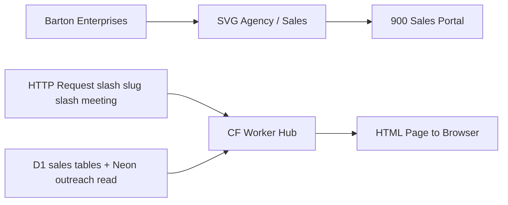
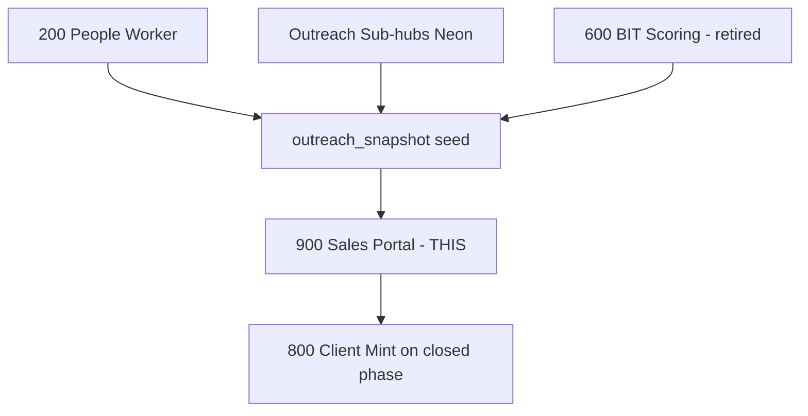

# Sales Portal
## Prospect-facing sales cycle portal — 4 meetings from Fact Finder through Financials, driven by outreach intelligence. Terminal node of the SVG Agency revenue engine.
### Status: BUILD
### Medium: process
### Business: svg-agency

## UT Checklist (Pre-Flight - per law/UT_CHECKLIST.md v1.2.0)

| # | Check | Status | Location |
|---|-------|--------|----------|
| 1 | PRD - what / why / who / scope / out-of-scope / success metric | [x] | §2 |
| 2 | OSAM - READ / WRITE / Process Composition / Join Chain / Forbidden Paths / Query Routing filled | [x] | §5 |
| 3 | Component Status - every dep has green / yellow / red with 1-line state | [x] | §3 |
| 4 | Owner - human who fixes this at 2 AM | [x] | §1 |
| 5 | Live Dashboard - URL or explicit "N/A" | [x] | §3 |
| 6 | Kill Switch - exact command to stop the process | [x] | §8 |
| 7 | Logbook - last audit verdict + date (after certification only) | [ ] | §12 |
| 8 | FCEs Attached - which FCE runs structurally back this doc | [x] | §3c |
| 9 | BARs Referenced - every BAR this doc touches, with status | [x] | §3d |
| 10 | LBB Subjects Fed - which LBB subject(s) this doc's session logs go to | [x] | §3e |
| 11 | Geometry - CTB position + Hub-Spoke role + Altitude | [x] | §1b |
| 12 | Live Verification - every numeric count, cron, URL, command, BAR status grounded against the live system | [x] | §9b |
| 13 | ctb_node - declared path on the Barton Enterprises CTB trunk | [x] | §1 Identity |

## §1 IDENTITY {#sec-1-identity}

| Field | Value |
|-------|-------|
| ID | PROC-900 |
| Name | Sales Portal |
| Medium | process |
| Business Silo | svg-agency |
| CTB Position | factory/sales/900-sales-portal |
| ORBT | BUILD |
| Strikes | 0 |
| Authority | inherited — imo-creator-v2 sovereign + Barton-Processes parent |
| Last Modified | 2026-05-10 |
| BAR Reference | BAR-39, BAR-133, BAR-179 |
| Owner | Dave Barton |
| ctb_node | barton-enterprises/svg-agency/sales/900-sales-portal |

### 1b. Geometry {#sec-1b-geometry}

**CTB Position:** barton-enterprises → svg-agency → sales → 900-sales-portal (leaf)

**Hub-Spoke Role:** Hub — this process is the middle layer that ingests outreach intelligence (spokes) and emits branded HTML meeting pages (rim). It owns all rendering logic for the 4-meeting sales cycle. Spokes are the D1 query layer and Neon read. Rim = browser-rendered HTML.

**Altitude:** 5k execution — single worker, per-request rendering, no orchestration above this level in the sales path.



### HEIR (8 fields - Aviation Model, Bedrock §8)

| Field | Value |
|-------|-------|
| sovereign_ref | imo-creator-v2 |
| hub_id | sales-portal-900 |
| ctb_placement | leaf |
| imo_topology | egress |
| cc_layer | CC-04 |
| services | CF Worker (HTTP), D1 (sales working tables + outreach read) |
| secrets_provider | doppler |
| acceptance_criteria | Meeting 1 pre-populates from outreach 5 sub-hubs via sovereign_id; Meeting 1 form writes to sales_factfinder; Meetings 2-4 are read-only; Meeting 2 renders Monte Carlo results when built; Meeting 4 shows quoted costs by insurance line; all pages branded per prospect |

## §2 PRD {#sec-2-purpose}

### WHAT
Process 900 is a Cloudflare Worker that serves a 4-meeting prospect-facing sales portal at `app.svgagency.com/sales/:slug/:meeting`. Each prospect gets a unique slug. Meeting 1 (Fact Finder) is a read-write form pre-populated from outreach intelligence. Meetings 2-4 are read-only presentation pages. All HTML is server-side rendered with no SPA.

### WHY
Without the Sales Portal, the entire outreach pipeline (processes 010-800) has no conversion surface. All the intelligence — DOL filings, contact slots, BIT scores, blog signals — generates no revenue unless it routes into a structured, prospect-specific sales cycle. This process is the terminal output of the outreach engine.

### WHO
Dave Barton (operator — runs the meetings, owns the portal), SVG Agency prospects (consumers — view their branded pages), Claude Code agents (build and maintain the worker code and schema).

### SCOPE (in)
- Render 4 meeting pages per prospect (Fact Finder, Insurance Education, Systems Education, Financials)
- Pre-populate Meeting 1 form from `outreach_snapshot` (seeded from 5 outreach sub-hubs)
- Accept and persist Meeting 1 form submissions to `sales_factfinder`
- Track sales phase progression in `sales_state.current_phase`
- Render Monte Carlo results on Meeting 2 when simulation engine is built
- Display quotes by benefit_type and carrier on Meeting 4

### OUT-OF-SCOPE
- Snapshot seeding mechanism (copying outreach Neon data to D1 `outreach_snapshot`) — separate pending process
- Monte Carlo simulation engine — separate future process feeding `sales_insurance`
- Authentication / access control — not yet implemented; separate BAR required
- Client lifecycle post-close — owned by Process 800 (client mint) triggered by `closed` phase transition

### SUCCESS METRIC
All 4 meeting pages return 200 for a valid slug, Meeting 1 form submission writes to `sales_factfinder` and advances `current_phase`, and the portal correctly gates phase access.

## §3 RESOURCES {#sec-3-resources}

Required doctrine references for every process UT:

- `law/UNIFIED_TEMPLATE.md`
- `law/UT_CHECKLIST.md`
- `law/doctrine/PROCESS_FILL_INSTRUCTIONS.md`
- `law/doctrine/HOW_TO_BUILD_ANYTHING.md` (repair manual)
- `law/doctrine/BARTON_ENTERPRISES_WORLD_ATLAS.md` (Atlas System bundle)
- `law/doctrine/KEY.md`

### Component Status Grid

| Component | HEIR (`hub_id · ctb · cc_layer`) | ORBT | Light | State |
|-----------|----------------------------------|------|-------|-------|
| D1 sales-portal-900 | sales-portal-900 · leaf · CC-04 | BUILD | red | Database not yet created — `wrangler d1 create` not yet run; `database_id` blank in wrangler.toml |
| CF Worker sales-portal-900 | sales-portal-900 · leaf · CC-04 | BUILD | red | Worker code exists; not deployed; no `wrangler deploy` run |
| Neon outreach vault | TBV · leaf · CC-03 | OPERATE | yellow | Data exists in Neon; read access via NEON_URL secret; snapshot seeding mechanism not yet built |
| Process 200 People Worker | TBV · leaf · CC-04 | TBV | yellow | Upstream — provides CEO/CFO/HR contact data; assumed operational |
| Process 600 BIT Scoring | TBV · leaf · CC-04 | TBV | red | Retired 2026-03-25; bit_score columns orphaned; no BIT data will populate |
| Process 800 Client Mint | TBV · leaf · CC-04 | BUILD | yellow | Downstream gate — triggered by `closed` phase; not yet deployed |

### Live Dashboard

| Resource | URL | What it shows |
|----------|-----|---------------|
| Worker health | https://sales-portal-900.svg-outreach.workers.dev/health | Worker status (not yet deployed — TBV) |
| D1 dashboard | Cloudflare dashboard → Workers & Pages → D1 → sales-portal-900 | Table row counts, schema state |

### Dependencies

| Dependency | Type | What It Provides | Status |
|-----------|------|-----------------|--------|
| D1 database (sales-portal-900) | database | All sales working tables | PENDING — not created |
| Neon outreach vault | database | Company profile, DOL, people, blog, BIT data for snapshot seeding | DONE (data exists; seeding mechanism pending) |
| Process 200 People Worker | process | CEO/CFO/HR contact slots | DONE |
| Snapshot seeding mechanism | process | Copies 5 sub-hub data into `outreach_snapshot` by sovereign_id | PENDING — not built |
| Monte Carlo simulation engine | process | Gate 2 projections for `sales_insurance` | PENDING — not built |
| Auth / access control | external | Restricts portal access to authorized users | PENDING — no auth implemented |

### Downstream Consumers

| Consumer | What It Needs |
|----------|--------------|
| Process 800 Client Mint | `sales_state.current_phase = closed` transition → triggers client sovereign_id mint |
| Dave Barton (sales op) | HTML portal pages rendered with correct prospect data at each meeting |

### Tools & Integrations

| Item | Type | Cost Tier | Credentials | What It Does |
|------|------|-----------|-------------|-------------|
| Cloudflare D1 | database | Free | D1 binding (wrangler.toml) | All sales working tables: state, snapshots, factfinder, insurance, systems, quotes + error tables |
| Cloudflare Workers | compute | Free | CF account | Server-side HTML rendering, slug-based routing |
| Neon PostgreSQL | database | Cheap | NEON_URL (Doppler) | Read-only outreach vault for snapshot seeding |
| Hono (SSR pattern) | library | Free | none | Request routing and HTML rendering pattern |

### Secrets

| Secret | Doppler Project | Config | Used By |
|--------|----------------|--------|---------|
| NEON_URL | sales-portal-900 | production | Outreach snapshot seeding reads from Neon (future — snapshot seeding not yet built) |

### 3c. FCEs Attached

| FCE Name | HEIR (`hub_id · ctb · cc_layer`) | ORBT | Run Directory | Latest P=1 | Rows | Status |
|----------|----------------------------------|------|--------------|------------|------|--------|
| None yet | — | — | — | pending | — | red — no FCE runs; process in BUILD |

### 3d. BARs Referenced

| BAR | Title | HEIR (`bar-id · ctb · cc_layer`) | ORBT | Status | Relation |
|-----|-------|----------------------------------|------|--------|----------|
| BAR-39 | TBV | TBV | TBV | TBV | implements |
| BAR-133 | TBV | TBV | TBV | TBV | implements |
| BAR-179 | TBV | TBV | TBV | TBV | implements |

### 3e. LBB Subjects Fed

| LBB Subject | HEIR (`subject-id · ctb · cc_layer`) | ORBT | What This Doc Writes | Frequency |
|-------------|--------------------------------------|------|---------------------|-----------|
| svg-sales | svg-sales · branch · CC-02 | OPERATE | Session summaries, retrofit events, audit findings | per-session |
| svg-sales-proc | svg-sales-proc · leaf · CC-03 | OPERATE | Per-process learnings: schema gaps, deploy blockers, phase gate behavior | on-change |

## §4 MIDDLE {#sec-4-imo}

### Two-Question Intake (Bedrock §3)
1. What triggers this? — A user (Dave or prospect) navigates to `app.svgagency.com/sales/:slug/:meeting` via HTTP GET, or Dave submits the Meeting 1 form via HTTP POST.
2. How do we get it? — CF Worker intercepts the request; slug resolves to `sales_id` via D1 `sales_state.slug` index; meeting segment selects the page renderer; D1 data populates the template.

### Input
HTTP request: `GET /sales/:slug/:meeting` (page render) or `POST /sales/:slug/meeting1/save` (form submission). Slug resolves to `sales_id` via `sales_state.slug`. Meeting 1 pre-populates from `outreach_snapshot` (seeded from 5 outreach sub-hubs via `sovereign_id`). Meetings 2-4 read from their respective D1 tables.

### Middle

| Step | Input | What Happens | Output | Tool Used |
|------|-------|-------------|--------|-----------|
| 1 | HTTP request with `:slug` and `:meeting` | Parse path segments, validate meeting name | Slug + meeting identifier | CF Worker router |
| 2 | Slug | Query `sales_state` by slug index | SalesContext (sales_id, sovereign_id, current_phase, legal_name, agent_name) | D1 query |
| 3a (Meeting 1 GET) | sales_id | Query `outreach_snapshot` + `sales_factfinder` | Pre-populated form HTML (read-write) | D1 query |
| 3b (Meeting 1 POST) | sales_id + form body | Validate fields, upsert `sales_factfinder`, advance phase to 'insurance' if complete | Success/error JSON | D1 write |
| 3c (Meeting 2 GET) | sales_id | Query `sales_insurance` (Monte Carlo results — future) | Read-only presentation HTML | D1 query |
| 3d (Meeting 3 GET) | sales_id | Query `sales_systems` | Read-only presentation HTML | D1 query |
| 3e (Meeting 4 GET) | sales_id | Query `sales_quotes` grouped by benefit_type + carrier | Read-only financials HTML | D1 query |
| 4 | Body HTML from step 3 | Wrap in branded layout template via `renderPage()` | Full HTML page with prospect branding | renderPage() |

### Output
HTML pages served to browser — no downstream process consumes rendered HTML. Meeting 1 form data persisted to `sales_factfinder` in D1. Phase progression tracked in `sales_state.current_phase`: `factfinder → insurance → systems → financials → closed`. When `closed` phase is reached, Process 800 (Client Mint) is triggered.

### Circle (Bedrock §5)
Meeting 1 form submission writes to `sales_factfinder` which seeds Meeting 2 insurance education with validated company data. Phase progression in `sales_state` gates which meetings are accessible (D-900-04). Error tables capture validation failures per meeting and feed back into ORBT state assessment. Terminal process: the circle closes at revenue conversion when `sales_state.current_phase = closed` triggers Process 800.

## §5 OSAM {#sec-5-data-schema}

### READ Access

| Source | What It Provides | Join Key |
|--------|-----------------|----------|
| `sales_state` | Spine: sales_id, sovereign_id, slug, current_phase, legal_name, agent_name | `sales_state.slug` (resolve), `sales_state.sales_id` (join) |
| `outreach_snapshot` | Meeting 1 pre-population: company profile, DOL, contacts, blog, BIT | `outreach_snapshot.sales_id` |
| `sales_factfinder` | Meeting 1 saved form data; Meeting 2 input for math | `sales_factfinder.sales_id` |
| `sales_insurance` | Meeting 2 Monte Carlo results + presentation metadata | `sales_insurance.sales_id` |
| `sales_systems` | Meeting 3 systems education presentation metadata | `sales_systems.sales_id` |
| `sales_quotes` | Meeting 4 quotes by benefit_type + carrier with rates | `sales_quotes.sales_id` |

### WRITE Access

| Target | What It Writes | When |
|--------|---------------|------|
| `sales_factfinder` | Validated form data from Meeting 1 | POST /sales/:slug/meeting1/save |
| `sales_state` | Phase progression (`current_phase` update) | After Meeting 1 completion |
| `sales_factfinder_errors` | Validation failures from Meeting 1 form | POST with invalid data |
| `sales_insurance_errors` | Meeting 2 rendering errors | GET meeting2 failures |
| `sales_systems_errors` | Meeting 3 rendering errors | GET meeting3 failures |
| `sales_quotes_errors` | Meeting 4 rendering errors | GET meeting4 failures |

### Process Composition



| Process ID | Name | Role in Composition | Status |
|-----------|------|---------------------|--------|
| PROC-200 | People Worker | upstream feeder — CEO/CFO/HR contact data | green |
| PROC-600 | BIT Scoring | upstream feeder — BIT score (retired 2026-03-25) | red |
| PROC-900 | Sales Portal | this process | BUILD |
| PROC-800 | Client Mint | downstream consumer — triggered on closed phase | yellow |

### Join Chain

```text
sales_state.sales_id (SPINE)
  -> outreach_snapshot.sales_id (1:1, seeded from outreach 5 sub-hubs)
    -> sales_factfinder.sales_id (1:1, Meeting 1 form data)
      -> sales_insurance.sales_id (1:1, Meeting 2 Monte Carlo)
        -> sales_systems.sales_id (1:1, Meeting 3 systems)
          -> sales_quotes.sales_id (1:N, Meeting 4 quotes by benefit_type)
sales_state.sovereign_id -> outreach.company_target.company_unique_id (Neon, cross-silo)
```

### Forbidden Paths

| Action | Why |
|--------|-----|
| Write to `outreach_snapshot` after initial seed | Read-only after seed — outreach data is a frozen point-in-time snapshot (D-900-07) |
| Direct write to Neon from this worker | Neon is vault only; D1 is the working layer; SEED→WORK→PUSH lifecycle enforced (D-900-08) |
| Skip phase progression (jump from meeting1 to meeting4) | Phase gates enforce sales cycle sequence; future meetings require prior completion (D-900-04) |
| Modify outreach sub-hub data via this process | Consumer only — sovereign silo boundary between sales and outreach |

### Query Routing

| Question | Table | Column |
|----------|-------|--------|
| What phase is this prospect in? | sales_state | current_phase |
| What is the prospect's company profile? | outreach_snapshot | company_name, industry, employees, state |
| What did the Fact Finder capture? | sales_factfinder | all columns |
| What are the Monte Carlo projections? | sales_insurance | projected_claims, confidence_low, confidence_high |
| What quotes exist for this prospect? | sales_quotes | benefit_type, carrier, rate_ee/es/ec/fam, annual_cost |
| What is the prospect's renewal month? | outreach_snapshot | renewal_month |
| Who are the decision makers? | outreach_snapshot | ceo_name, cfr_name, hr_name |

## §6 OUTPUT {#sec-6-dmj}

### 6a. DEFINE (Build the Key)

| Element | ID | Format | Description | C or V |
|---------|-----|--------|-------------|--------|
| sales_id | E-900-01 | TEXT (UUID) | Spine identifier for one prospect sales record | C |
| sovereign_id | E-900-02 | TEXT | Links sales record to outreach silo company identity | C |
| slug | E-900-03 | TEXT (URL-safe) | Human-readable URL identifier resolving to sales_id | C |
| current_phase | E-900-04 | TEXT ENUM | Phase gate: factfinder→insurance→systems→financials→closed | C |
| meeting | E-900-05 | TEXT ENUM (meeting1-4) | Which of the 4 meeting pages is requested | C |
| outreach_snapshot | E-900-06 | D1 table (1:1 with sales_id) | Frozen point-in-time copy of 5 outreach sub-hubs for this prospect | C |
| sales_factfinder | E-900-07 | D1 table (1:1 with sales_id) | Meeting 1 form data — company info, current benefits, discovery notes | C |
| meeting_renderer | E-900-08 | TypeScript function | renderMeeting1-4 function that takes sales_id and returns HTML | C |
| prospect data values | E-900-09 | runtime fill | The actual company name, contacts, quotes, etc. per prospect | V |
| form submission body | E-900-10 | JSON object | Values entered by Dave in Meeting 1 form | V |
| phase progression event | E-900-11 | D1 write | Current_phase update triggered by meeting completion | V |

### 6b. MAP (Connect Key to Structure)

| Source | Target | Transform |
|--------|--------|-----------|
| URL `:slug` segment | `sales_state.slug` | direct lookup by index |
| `sales_state.sales_id` | All meeting sub-hub tables | direct join key |
| `sales_state.sovereign_id` | `outreach_snapshot` seed from Neon | cross-silo join via sovereign_id |
| `outreach_snapshot` columns | Meeting 1 form defaults | direct map: company profile, DOL, contacts, blog, BIT |
| Meeting 1 POST body | `sales_factfinder` columns | validate → upsert |
| `sales_insurance` | Meeting 2 HTML | query → template render |
| `sales_systems` | Meeting 3 HTML | query → template render |
| `sales_quotes` (grouped by benefit_type) | Meeting 4 HTML | query → template render |

### 6c. JOIN (Path to Spine)

| Join Path | Type | Description |
|-----------|------|-------------|
| slug → sales_state.sales_id | direct | URL slug index lookup; primary resolution path |
| sales_state.sovereign_id → outreach Neon | indirect | Cross-silo join; required for snapshot seeding |
| sales_state.sales_id → all meeting tables | direct | 1:1 joins for all 4 meeting data tables |
| sales_quotes grouped by benefit_type | direct | 1:N join for Meeting 4 quote rendering |

## §7 GOVERNANCE {#sec-7-constants-variables}

### Constants (structure - never changes)

- **4-meeting sequence fixed** (D-900-01): Fact Finder → Insurance Education → Systems Education → Financials — order is invariant
- **Meeting 1 read-write; Meetings 2-4 read-only** (D-900-02): only Meeting 1 accepts form input; all other meetings are presentation-only
- **Phase sequence enforced** (D-900-04): `factfinder → insurance → systems → financials → closed` — no skipping, no reordering
- **`sales_id` is the spine join key** (D-900-05): all meeting sub-hub tables join on `sales_id`
- **`sovereign_id` bridges outreach silo** (D-900-06): links this process to outreach intelligence via the sovereign identity
- **`outreach_snapshot` is frozen after seed** (D-900-07): point-in-time copy from outreach — never updated from outreach after seed
- **CQRS pattern** (D-900-09): 1 canonical + 1 error table per meeting sub-hub — no exceptions
- **URL structure constant** (D-900-10): `/sales/:slug/:meeting` — slug resolves to sales_id, meeting selects renderer
- **D1 is working layer; Neon is vault** (D-900-08): no direct Neon writes from this worker
- **Process 900 close triggers Process 800** (D-900-11): `sales_state.current_phase = closed` is the downstream gate for client mint
- **Monte Carlo renders on Meeting 2** (D-900-03): Meeting 2 is the Insurance Education page; Monte Carlo results display here when simulation engine delivers data

### Variables (fill - changes every run/cycle)

- Which prospect (`slug`) is being viewed — variable per request
- Which meeting page is requested — variable per request
- What data populates `outreach_snapshot` for this prospect — variable per prospect
- What form values Dave enters in Meeting 1 — variable per meeting
- What Monte Carlo simulation results appear in Meeting 2 — variable per run (future)
- What quotes by benefit_type + carrier appear in Meeting 4 — variable per prospect
- Current phase of the sales cycle for this prospect — variable as deal progresses

## §8 KILL SWITCH {#sec-8-stop-conditions}

| Condition | Action |
|-----------|--------|
| Can't answer two-question intake | HALT — process is not defined |
| Slug does not resolve to a `sales_id` | Return 404 Prospect not found — violates D-900-05 |
| `sales_state.current_phase` doesn't match requested meeting | Gate check — deny access to future meetings — enforces D-900-04 |
| `outreach_snapshot` is empty for Meeting 1 | HALT — snapshot seeding not implemented; cannot pre-populate |
| Meeting 1 POST fails validation | Write to `sales_factfinder_errors`, return 400 — error table drain per D-900-09 |
| D1 query returns unexpected error | Log to meeting error table, return 500 |
| Monte Carlo engine not available (Meeting 2) | Show placeholder — future dependency not yet built |
| D1 database not created | HALT — `wrangler d1 create sales-portal-900` must run before first deployment |
| Strike 3 on same failure | Troubleshoot/Train → produce Airworthiness Directive |

### Kill Switch

```text
wrangler delete --name sales-portal-900
```

(Or: disable via Cloudflare dashboard → Workers & Pages → sales-portal-900 → Disable)

## §9 OBSERVABILITY {#sec-9-verification}

```text
1. GET /health -> expected: {"process":"PROC-SALES-PORTAL","number":900,"status":"ok"}
2. GET / -> expected: 200 with route documentation text listing all 4 meeting routes
3. GET /sales/nonexistent/meeting1 -> expected: 404 "Prospect not found"
4. GET /sales/valid-slug/meeting1 -> expected: 200 HTML with pre-populated Fact Finder form
5. POST /sales/valid-slug/meeting1/save with valid JSON -> expected: {"success":true}
6. POST /sales/valid-slug/meeting1/save with invalid body -> expected: 400 with error detail
7. GET /sales/valid-slug/meeting2 -> expected: 200 HTML Insurance Education page
8. GET /sales/valid-slug/meeting3 -> expected: 200 HTML Systems Education page
9. GET /sales/valid-slug/meeting4 -> expected: 200 HTML Financials with quotes
10. D1 query: SELECT current_phase FROM sales_state WHERE slug = 'valid-slug' -> expected: phase value
```

### Three Primitives Check (Bedrock §1)
1. Thing — D1 database exists? All 6 canonical + 4 error tables exist? Worker deployed at correct URL?
2. Flow — Slug resolves to sales_id? `outreach_snapshot` seeded? Meeting 1 form data writes to `sales_factfinder`?
3. Change — Phase advances correctly after Meeting 1 save? Form validation catches bad data? HTML renders with correct prospect data?

## 9b. Live Verification Log {#sec-9b-live-verification}

| Claim | Section | Source of Truth | Verification Command | [ ] | Last Check | Value |
|-------|---------|-----------------|----------------------|-----|-----------|-------|
| Worker health endpoint responds | §9 | CF Worker health route | `curl https://sales-portal-900.svg-outreach.workers.dev/health` | [ ] | TBV — not yet deployed | TBV |
| D1 database exists | §3 | Cloudflare dashboard / wrangler | `wrangler d1 info sales-portal-900` | [ ] | TBV — not yet created | TBV |
| `sales_state` table row count | §5 | D1 | `wrangler d1 execute sales-portal-900 --remote --command "SELECT COUNT(*) FROM sales_state"` | [ ] | TBV | TBV |
| `sales_factfinder` table exists with correct schema | §5 | D1 | `wrangler d1 execute sales-portal-900 --remote --command "SELECT name FROM sqlite_master WHERE type='table'"` | [ ] | TBV | TBV |
| Slug resolution returns 404 for unknown slug | §9 | Worker response | `curl https://sales-portal-900.svg-outreach.workers.dev/sales/nonexistent/meeting1` | [ ] | TBV | TBV |
| Meeting 1 GET renders 200 for valid slug | §9 | Worker response | `curl https://sales-portal-900.svg-outreach.workers.dev/sales/test-slug/meeting1` | [ ] | TBV | TBV |
| TABLES-AUDIT gaps captured in §13 | §13 | TABLES-AUDIT.md archived | See §13 FLEET FAILURE REGISTRY | [x] | 2026-04-29 | 8 gaps logged |

NOT YET DEPLOYED — gauge spec defined; all live values pending first production run. Queries and tolerance thresholds locked above; populate at OPERATE promotion.

## §10 Operations / Schedule {#sec-10-operations}

**Cron classification:** EVENT-DRIVEN
**Decision date:** 2026-05-08
**Decision authority:** Sovereign (Dave Barton, BAR-MONDAY-16-FLEET-GREEN)

**Schedule:** N/A — event-driven
**Implementation:** HTTP-triggered
**Trigger source (if event-driven):** Sales rep request / meeting page navigation (on-demand render)

---

## §10 LBB SUBJECTS {#sec-10-analytics}

### 10a. Metrics

| Metric | Unit | Baseline | Target | Tolerance |
|--------|------|----------|--------|-----------|
| Meeting pages rendered | count/day | BASELINE | TBV | TBV |
| Meeting 1 Fact Finder saves | count | BASELINE | TBV | >0 per active prospect |
| Phase progressions | count | BASELINE | TBV | TBV |
| Snapshot seeds executed | count | BASELINE | TBV | 1 per prospect |
| Slug resolution time | ms | BASELINE | <50ms | <200ms |
| Worker error rate | % | BASELINE | 0% | <1% |

### 10b. Sigma Tracking

| Metric | Run 1 | Run 2 | Run 3 | Trend | Action |
|--------|-------|-------|-------|-------|--------|
| All metrics | BASELINE | — | — | flat — no runs yet | Deploy and run smoke tests before sigma can track |

### 10c. ORBT Gate Rules

| From | To | Gate |
|------|-----|------|
| BUILD | OPERATE | all metrics within tolerance for 3 runs + auditor sign-off |
| OPERATE | REPAIR | any metric outside tolerance |
| REPAIR | OPERATE | fix + metric back + auditor verification |
| Any (Strike 3) | TROUBLESHOOT_TRAIN | fleet-wide fix → AD |

## §11 OPEN BLOCKERS {#sec-11-execution-trace}

| Field | Format | Required |
|-------|--------|----------|
| trace_id | UUID | Yes |
| run_id | UUID | Yes |
| step | action name | Yes |
| target | measurable | Yes |
| actual | measurable | Yes |
| delta | the gap | Yes |
| status | done / failed / skipped | Yes |
| error_code | text or null | If failed |
| error_message | text or null | If failed |
| tools_used | JSON array | Yes |
| duration_ms | integer | Yes |
| cost_cents | integer | Yes |
| timestamp | ISO-8601 | Yes |
| signed_by | agent or manual | Yes |

### Build Inputs Used

| Source | File | What Was Used |
|--------|------|--------------|
| CLAUDE.md | _archived-fragments/CLAUDE.md | Process identity, known issues, worker config, outreach snapshot sub-hubs |
| PROCESS.md | _archived-fragments/PROCESS.md | IMO, OSAM, C&V, constants, stop conditions, smoke test, dependencies |
| TABLES-AUDIT.md | _archived-fragments/TABLES-AUDIT.md | Schema gap analysis (8 gaps), §13 failure registry entries |
| heir.yaml | heir.yaml (root) | HEIR 8-field coordinates, acceptance criteria, pages, data sources |
| wrangler.toml | wrangler.toml (root) | Worker name, D1 binding, compatibility date |
| src/index.ts | src/index.ts (root) | Route handlers, ENV interface, meeting dispatch |
| src/migrations/001_d1_sales_tables.sql | src/migrations/ | Full D1 schema: 6 canonical tables + 4 error tables |

### Back-Propagation Check

| Parent Constant | Conflict Check | Result |
|-----------------|----------------|--------|
| CQRS (1 canonical + 1 error per sub-hub) | sales_state has no error table (TABLES-AUDIT Gap 1) | conflict — captured in §13 FP-900-01 |
| Phase sequence is enforced | current_phase gate logic in index.ts | clean |
| D1 is working layer; Neon is vault | No Neon writes in worker code | clean |
| outreach_snapshot frozen after seed | No write routes to outreach_snapshot | clean |

## §12 STRIKE LADDER {#sec-12-logbook}

No logbook during BUILD.

### Birth Certificate

| Field | Value |
|-------|-------|
| heir_ref | TBV — awaiting certification |
| orbt_entered | BUILD |
| orbt_exited | TBV |
| action | TBV — pending auditor sign-off |
| gates_passed | TBV |
| signed_by | TBV |
| signed_at | TBV |

### Logbook (append-only)

| Date | Actor | Action | What Was Done | Evidence | LBB Record |
|------|-------|--------|---------------|----------|------------|
| 2026-03-29 | claude-code | BUILD | PROCESS.md created — full IMO, OSAM, C&V, dependencies, smoke test | PROCESS.md v1.1.0 | none |
| 2026-04-16 | claude-code | AUDIT | TABLES-AUDIT.md created — live D1 query against svg-d1-sales; 8 gaps identified | TABLES-AUDIT.md | none |
| 2026-04-29 | claude-code | BUILD | UT consolidation — PROCESS-UT.md + DOCTRINE.md written; fragments archived | wave-1-runner packet-16 | pending |

## §13 BARS {#sec-13-fleet-failure-registry}

Gaps from TABLES-AUDIT.md (2026-04-16) captured here before archiving per runner instructions:

| Pattern ID | Location | Error Code | First Seen | Occurrences | Strike Count | Status |
|-----------|----------|-----------|-----------|-------------|-------------|--------|
| FP-900-01 | sales_state | CQRS-MISSING-ERROR-TABLE | 2026-04-16 | 1 | 0 | OPEN — `sales_state_errors` table missing; CQRS violation; add in next_migration.sql |
| FP-900-02 | schema | MISSING-TABLE-sales_videos | 2026-04-16 | 1 | 0 | OPEN — no video tracking table; 4 gate videos (C-01 through C-04) untracked |
| FP-900-03 | schema | MISSING-TABLE-sales_monte_carlo | 2026-04-16 | 1 | 0 | OPEN — Gate 2 simulation output needs own table; `sales_insurance.strategy_selected` insufficient |
| FP-900-04 | sales_factfinder | COLUMN-GAPS-GATE1 | 2026-04-16 | 1 | 0 | OPEN — 18 columns missing: current_carrier, current_plan_type, current_monthly_premium, annual_premium, all tier counts and costs, employer_contribution_pct, renewal_date, sic_code, state, bill_document_url, notes |
| FP-900-05 | sales_insurance | COLUMN-GAPS-GATE2 | 2026-04-16 | 1 | 0 | OPEN — 8 columns missing: hospital_waterfall_applicable, drug_waterfall_applicable, stop_loss_tier, tpa_candidates, pbm_candidates, gate2_meeting_date, strategy_rationale, notes |
| FP-900-06 | sales_systems | COLUMN-GAPS-GATE3 | 2026-04-16 | 1 | 0 | OPEN — 13 columns missing: tpa_selected, pbm_selected, ppo_network_selected, um_precert_vendor, specialty_drug_flag_vendor, stop_loss_carrier, hr_platform, benefit_admin_platform, year1/2_implementation_start, enrollment_method, dashboards_shown, gate3_meeting_date, notes |
| FP-900-07 | sales_quotes | COLUMN-GAPS-GATE4 | 2026-04-16 | 1 | 0 | OPEN — 10 columns missing: stop_loss_quote_json, ancillary_quote_json, fixed_side_pepm_total, variable_side_monthly_estimate, projected_annual_savings, projected_year1_cost, competitive_notes, commission_equivalent_saved, quote_presented_at, decision_deadline, loss_reason, gate4_meeting_date, notes |
| FP-900-08 | sales_state | COLUMN-GAPS-SPINE | 2026-04-16 | 1 | 0 | OPEN — 7 columns missing: current_carrier, dol_employee_count, gate1_completed_at through gate4_completed_at, closed_at |
| FP-900-09 | wrangler.toml | MISSING-DATABASE-ID | 2026-03-29 | 1 | 0 | OPEN — `database_id` is blank; `wrangler d1 create sales-portal-900` not yet run |
| FP-900-10 | Process 600 | RETIRED-DEPENDENCY | 2026-03-25 | 1 | 0 | OPEN — BIT scoring retired; bit_score/bit_tier columns in outreach_snapshot will not be populated |
| FP-900-11 | outreach_snapshot | SEEDING-NOT-BUILT | 2026-03-29 | 1 | 0 | OPEN — no mechanism to copy 5 outreach sub-hubs into D1 outreach_snapshot by sovereign_id |
| FP-900-12 | worker | NO-AUTH | 2026-03-29 | 1 | 0 | OPEN — no authentication on endpoints; prospect URLs are public; CF Access or bearer token required before OPERATE |

## §14 LOGBOOK {#sec-14-session-log}

| Date | Version | Author | Action | Scope |
|------|---------|--------|--------|-------|
| 2026-03-29 | v1.1.0 | claude-code | `CREATE` | PROCESS.md created v1.1.0 — full IMO, OSAM, C&V, dependencies, smoke test, schema |
| 2026-04-16 | v1.1.0 | claude-code | `CREATE` | TABLES-AUDIT.md created — live D1 audit against svg-d1-sales; 8 schema gaps found; next_migration.sql written |
| 2026-04-29 | v2.0.0 | claude-code (Wave-1 UT Consolidation) | `CREATE` | Wave-1 UT consolidation — PROCESS-UT.md + DOCTRINE.md written; CLAUDE.md, PROCESS.md, TABLES-AUDIT.md archived |
| 2026-05-08 | v2.0.1 | Sonnet Mechanic (BAR-MONDAY-16-FLEET-GREEN) | `MIGRATE` | §14 column format migrated to 5-column canonical (UT v2.8.0 / Atlas v2.3.0); verbatim footnotes preserved |
| 2026-05-08 | v2.0.2 | Sonnet Mechanic (BAR-MONDAY-16-FLEET-GREEN) | `STAMP` | §10 Operations/Schedule stamped: EVENT-DRIVEN — HTTP-triggered on sales rep portal page request. Frontmatter version corrected from 1.0.1 to match §1/DocCtrl, then bumped to 2.0.2. Version bumped in 2 locations (frontmatter + DocCtrl). |
| 2026-05-08 | v2.0.3 | Sonnet Mechanic (BAR-MONDAY-16-FLEET-GREEN) | `AMEND` | G06: §9b NOT YET DEPLOYED stamp added — 6 of 7 gauge rows remain TBV pending first production run; 1 real value row (TABLES-AUDIT gaps, 2026-04-29) already present. Gauge spec and queries locked. Version bumped in 2 locations (frontmatter + DocCtrl). |
| 2026-05-10 | `v2.0.4` | BAR-FLEET-OVERNIGHT WO-2 | Sonnet Mechanic | `AUDIT_LOGBOOK` — overnight 16-process readiness sweep audit (a57f0f541e0d0b5cd, READ-ONLY). Finding: Empty `database_id = ""` in wrangler. UNKNOWN #4. Version bump (3 locations) per memory feedback_pair_version_with_last_modified. | §14 + Document Control |

^[ROW-2026-03-29]: 2026-03-29 | PROCESS.md created v1.1.0 — full IMO, OSAM, C&V, dependencies, smoke test, schema | none
^[ROW-2026-04-16]: 2026-04-16 | TABLES-AUDIT.md created — live D1 audit against svg-d1-sales; 8 schema gaps found; next_migration.sql written | none
^[ROW-2026-04-29]: 2026-04-29 | Wave-1 UT consolidation — PROCESS-UT.md + DOCTRINE.md written; CLAUDE.md, PROCESS.md, TABLES-AUDIT.md archived | pending

## Document Control

| Field | Value |
|-------|-------|
| Created | 2026-03-29 |
| Last Modified | 2026-05-10 |
| Version | v2.0.4 |
| Template Version | 2.7.0 |
| Medium | process |
| US Validated | pending |
| Governing Engine | law/doctrine/FOUNDATIONAL_BEDROCK.md + law/doctrine/DMJ.md |
