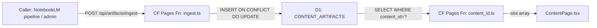

# Content Artifacts — NotebookLM Artifact Registry for Content Pages
## BAR-194 UT Manual — artifact ingest + slot serving for insuranceinformatics.com
### Status: OPERATE
### Medium: CF Pages Function + D1
### Business: sales (content delivery)

## UT Checklist (Pre-Flight — per law/UT_CHECKLIST.md v1.2.0)

| # | Check | Status | Location |
|---|-------|--------|----------|
| 1 | PRD — what / why / who / scope / out-of-scope / success metric | [x] | §2 |
| 2 | OSAM — READ / WRITE / Join Chain / Forbidden Paths / Query Routing filled | [x] | §5, §6, §9 |
| 3 | Component Status — every dependency has light with 1-line state | [x] | §3 |
| 4 | Owner — human who fixes this at 2 AM | [x] | §1 |
| 5 | Live Dashboard — URL or explicit "N/A" | [x] | §3 |
| 6 | Kill Switch — exact command to stop the process | [x] | §8 |
| 7 | Logbook — last audit verdict + date (after certification only) | [ ] | §12 — N/A backfill |
| 8 | FCEs Attached — which FCE runs structurally back this doc | [x] | §3c |
| 9 | BARs Referenced — every BAR this doc touches, with status | [x] | §3d |
| 10 | LBB Subjects Fed — which LBB subject(s) this doc's session logs go to | [x] | §3e |
| 11 | Geometry — CTB position + Hub-Spoke role + Altitude | [x] | §1b |
| 12 | Live Verification — every numeric count, cron, URL, command, BAR status grounded | [ ] | §9 — pending live check |
| 13 | ctb_node — declared path on Barton Enterprises CTB trunk | [x] | §1 |

---

# IDENTITY

## 1. IDENTITY

| Field | Value |
|-------|-------|
| ID | CONTENT-ARTIFACTS-910 |
| Name | Content Artifacts — NotebookLM Artifact Registry |
| Medium | CF Pages Function + D1 |
| Business Silo | sales (insuranceinformatics.com content delivery) |
| CTB Position | barton-enterprises/insurance-informatics/svg-agency/hub:sales/910-content-artifacts |
| ORBT | OPERATE |
| Strikes | 0 |
| Authority | CC-03 — operational leaf |
| Version | 1.0.0 |
| Last Modified | 2026-04-30 |
| BAR Reference | BAR-194 |
| Owner | Dave Barton |
| ctb_node | barton-enterprises/insurance-informatics/svg-agency/hub:sales/910-content-artifacts |

### 1b. Geometry

**CTB Position:** Barton Enterprises → Insurance Informatics → SVG Agency → Hub: Sales → 910-content-artifacts (leaf)

**Hub-Spoke Role:** leaf (this process writes to D1 via spoke; CF Pages function IS the middle)

**Altitude:** 5k execution (one leaf — content artifact CRUD for a specific CF Pages site)



### HEIR (8 fields)

| Field | Value |
|-------|-------|
| sovereign_ref | imo-creator |
| hub_id | CONTENT-ARTIFACTS-910 |
| ctb_placement | leaf |
| imo_topology | middle |
| cc_layer | CC-03 |
| services | CF Pages Function (insuranceinformatics.com), CF D1: CONTENT_ARTIFACTS |
| secrets_provider | Doppler → imo-creator → dev → ARTIFACT_INGEST_TOKEN |
| acceptance_criteria | Ingest endpoint validates slot_type enum and auth token; idempotent upsert; GET returns active slots; ContentPage renders correctly |

---

# CONTRACT

## 2. PURPOSE

### WHAT
Registry that maps content page slugs (content_id) to their artifact slots (slot_type + payload). Enables dynamic artifact serving for insuranceinformatics.com content pages — audio files, slides, infographics, video, and 5 more slot types — without hardcoding URLs in source.

### WHY
NotebookLM artifacts live in R2/public storage. Without a registry, every URL change requires a code deploy. With the D1 registry, an admin POSTs new URLs and the page updates immediately. Also enables future versioning, A/B testing of slot payloads, and status management (active/archived) without touching frontend code.

### WHO
- Admin (Dave or designated operator) — POSTs artifacts via ingest endpoint
- ContentPage.tsx — reads slots via GET endpoint to render the page
- Future: automated pipeline that POSTs after NotebookLM generation

### SCOPE (in)
- D1 content_artifacts table schema and migrations (0001_content_artifacts.sql)
- POST /api/artifacts/ingest — authenticated write path (CF Pages Function)
- GET /api/artifacts/[content_id] — read path serving ContentPage
- Slot type enum validation
- Idempotent upsert logic

### OUT-OF-SCOPE
- R2 file storage and upload (separate process)
- ContentPage.tsx UI rendering logic (separate component)
- CF Stream video configuration (payload field, caller-owned)
- NotebookLM generation pipeline (upstream, external)

### SUCCESS METRIC
ContentPage.tsx renders correct artifacts for every content_id with zero hardcoded URLs in source. New content pages can be activated by a single ingest POST.

---

## 3. RESOURCES

### Component Status Grid

| Component | HEIR | ORBT | Light | State |
|-----------|------|------|-------|-------|
| CF Pages Function: ingest.ts | CONTENT-ARTIFACTS-910 · leaf · CC-03 | OPERATE | green | Live — BAR-194 shipped |
| CF Pages Function: [content_id].ts | CONTENT-ARTIFACTS-910 · leaf · CC-03 | OPERATE | green | Live — serves slots to ContentPage |
| D1: CONTENT_ARTIFACTS | CONTENT-ARTIFACTS-910 · leaf · CC-03 | OPERATE | green | Migration 0001 deployed |
| ContentPage.tsx | separate · leaf · CC-03 | OPERATE | green | React component consuming this endpoint |

### Live Dashboard

| Resource | URL | What it shows |
|----------|-----|---------------|
| Ingest endpoint | https://insuranceinformatics.com/api/artifacts/ingest | POST only — 401 without token |
| Read endpoint | https://insuranceinformatics.com/api/artifacts/5500 | Returns slot array for content_id "5500" |
| Live Dashboard | N/A — no dedicated dashboard; verify via D1 wrangler query | — |

### 3c. FCEs Attached

| FCE Name | HEIR | ORBT | Status |
|----------|------|------|--------|
| K=C (Key = Constant lock) | law/doctrine/KEY.md · trunk · CC-01 | OPERATE | green |
| IMO (Input→Middle→Output) | law/doctrine/FOUNDATIONAL_BEDROCK.md §3 | OPERATE | green |

### 3d. BARs Referenced

| BAR | Title | ORBT | Status | Relation |
|-----|-------|------|--------|----------|
| BAR-194 | Content Pages Artifact Registry | OPERATE | Closed | This doc is the UT backfill for BAR-194 |

### 3e. LBB Subjects Fed

| LBB Subject | ORBT | What This Doc Writes | Frequency |
|-------------|------|---------------------|-----------|
| svg-sales | OPERATE | Artifact registry decisions, slot schema changes | on-change |
| system | OPERATE | Infrastructure notes (D1 binding, Pages function pattern) | on-change |

---

## 4. IMO

### Two-Question Intake
1. **"What triggers this?"** — A content page needs to serve NotebookLM artifacts, or a new artifact file is uploaded to R2/public
2. **"How do we get it?"** — Admin POSTs to /api/artifacts/ingest with content_id + slot array; ContentPage GETs from /api/artifacts/[content_id]

### Input
POST body: `{ content_id: string, slots: [{ slot_type: enum, payload: object }] }` with Bearer token.

### Middle
CF Pages Function validates auth, validates slot_type enum, upserts rows into content_artifacts D1 table. GET function queries D1 WHERE content_id = ? AND status = 'active'.

### Output
Write: `{ ok: true, upserted: N }` or error JSON.
Read: `{ content_id, slots: [{ slot_type, payload, status }] }` consumed by ContentPage.tsx.

### Circle
New artifacts → POST ingest → D1 updated → ContentPage GET returns new slots → rendered to visitor. On payload update, idempotent POST overwrites existing row. On retire, admin PATCH status='archived' → slot disappears from GET response.

---

## 5. CONTRACT — Schema

### content_artifacts Table (0001_content_artifacts.sql)

| Column | Type | Constraints | Notes |
|--------|------|-------------|-------|
| id | TEXT | PRIMARY KEY | UUID via crypto.randomUUID() |
| content_id | TEXT | NOT NULL | Route slug, e.g. "5500" |
| slot_type | TEXT | NOT NULL | Enum: video/audio/slides/infographic/report/quiz/flashcards/mindmap/datatable |
| payload | TEXT | NOT NULL | JSON blob — slot-specific config |
| status | TEXT | NOT NULL DEFAULT 'active' | active / archived |
| created_at | TEXT | NOT NULL | ISO-8601 UTC |
| updated_at | TEXT | NOT NULL | ISO-8601 UTC |
| — | UNIQUE(content_id, slot_type) | — | One slot per type per content page |

### Slot Type Enum

| slot_type | Expected payload shape (caller-owned) |
|-----------|--------------------------------------|
| audio | `{ src: string, title: string }` |
| slides | `{ src: string, title: string }` |
| infographic | `{ src: string, title: string }` |
| video | `{ streamId: string, title: string }` |
| report | `{ src: string, title: string }` |
| quiz | `{ src: string, title: string }` |
| flashcards | `{ src: string, title: string }` |
| mindmap | `{ src: string, title: string }` |
| datatable | `{ src: string, title: string }` |

---

## 6. JOIN CONTRACT

### Read Chain

```
GET /api/artifacts/[content_id]
  → D1: SELECT * FROM content_artifacts WHERE content_id = ? AND status = 'active'
  → ContentPage.tsx renders slots
```

### Forbidden Paths

| Action | Why |
|--------|-----|
| Hardcode artifact URLs in ContentPage.tsx source | Defeats the registry; requires redeploy on URL change |
| Read D1 directly from browser (no CF function) | No auth, no D1 binding in browser |
| Use R2 public URL as content_id | content_id is the route slug, not a storage path |
| Write status='archived' via ingest endpoint | Kill switch requires admin D1 operation, not ingest POST |

### Query Routing

| Business Question | Table | Column |
|------------------|-------|--------|
| What slots exist for content page X? | content_artifacts | content_id |
| Is a specific slot active? | content_artifacts | status |
| When was an artifact last updated? | content_artifacts | updated_at |

---

## 7. INTEGRATION

| Consumer | How It Reads | Column Used |
|----------|-------------|-------------|
| ContentPage.tsx | GET /api/artifacts/[content_id] | content_id, slot_type, payload, status |
| Admin operator | POST /api/artifacts/ingest | content_id, slot_type, payload |
| Future pipeline | POST /api/artifacts/ingest | same as admin |

---

## 8. INGEST CHECKLIST

### Step 1 — Ingest artifacts for a content page
```bash
curl -X POST https://insuranceinformatics.com/api/artifacts/ingest \
  -H "Authorization: Bearer $ARTIFACT_INGEST_TOKEN" \
  -H "Content-Type: application/json" \
  -d '{
    "content_id": "5500",
    "slots": [
      { "slot_type": "audio", "payload": { "src": "https://...m4a", "title": "Episode Audio" } },
      { "slot_type": "slides", "payload": { "src": "https://...pdf", "title": "Slides" } }
    ]
  }'
```

### Step 2 — Verify ingest
```bash
curl https://insuranceinformatics.com/api/artifacts/5500
# Expected: { content_id: "5500", slots: [...] }
```

### Stop Conditions

| Condition | Action |
|-----------|--------|
| slot_type not in enum | HTTP 400 returned; no row written |
| Missing Bearer token | HTTP 401 returned; HALT |
| D1 batch error | HTTP 500 returned; check D1 binding |
| content_id empty string | HTTP 400 returned |

### Kill Switch
To retire all slots for a content page:
```bash
# Direct D1 admin via wrangler (no ingest endpoint kill path)
npx wrangler d1 execute CONTENT_ARTIFACTS --remote \
  --command "UPDATE content_artifacts SET status='archived', updated_at=datetime('now') WHERE content_id='CONTENT_ID'"
```

---

# GOVERNANCE

## 9. PERMISSIONS

| Actor | Table | Read | Write | Authority |
|-------|-------|------|-------|-----------|
| CF Pages Function (ingest.ts) | content_artifacts | NO | YES (upsert) | Bearer token — ARTIFACT_INGEST_TOKEN |
| CF Pages Function ([content_id].ts) | content_artifacts | YES | NO | No auth required (public read) |
| Admin operator (wrangler) | content_artifacts | YES | YES | Direct D1 admin |
| Browser / ContentPage.tsx | — | via CF function only | never | No direct D1 access |

### Live Verification Log

| Claim | Section | Verification Command | Verified? |
|-------|---------|---------------------|-----------|
| content_artifacts table exists | §5 | `npx wrangler d1 execute CONTENT_ARTIFACTS --remote --command "SELECT name FROM sqlite_master WHERE name='content_artifacts'"` | [ ] |
| UNIQUE constraint on (content_id, slot_type) | §5 | `SELECT sql FROM sqlite_master WHERE name='content_artifacts'` | [ ] |
| Ingest endpoint live | §3 | `curl -I https://insuranceinformatics.com/api/artifacts/ingest` | [ ] |

**Three Primitives Check:**
1. **Thing:** Does content_artifacts D1 table exist? Does CONTENT_ARTIFACTS binding exist on the Pages project?
2. **Flow:** Does POST /api/artifacts/ingest reach the D1 table? Does GET /api/artifacts/[content_id] return slots to ContentPage?
3. **Change:** Does an ON CONFLICT update overwrite payload and reset updated_at correctly?

---

## 10. ANALYTICS

### 10a. Metrics

| Metric | Unit | Target | Tolerance |
|--------|------|--------|-----------|
| Ingest success rate | % | 100% | 0 unexpected 500s |
| Content pages with at least 1 active slot | count | all live pages | 0 unregistered pages |
| Slot type coverage per content_id | count | 1+ per page | 0 empty pages |

### 10b. ORBT Gate Rules

| From | To | Gate |
|------|-----|------|
| OPERATE | REPAIR | Any ingest endpoint returning unexpected 500 or slot not rendering in ContentPage |

---

## 11. EXECUTION TRACE

| trace_id | step | target | actual | status | timestamp | signed_by |
|----------|------|--------|--------|--------|-----------|-----------|
| TRACE-910-001 | UT backfill — BAR-194 | 4-file UT manual for content artifacts process | DOCTRINE.md + heir.yaml + orbt.yaml + PROCESS-UT.md created | done | 2026-04-30 | claude-sonnet-4-6 |

---

## 12. LOGBOOK (After Certification Only)

_No logbook during backfill. Created when auditor certifies._

---

## 13. FLEET FAILURE REGISTRY

| Pattern ID | Location | Error Code | First Seen | Occurrences | Strike Count | Status |
|-----------|----------|-----------|-----------|-------------|-------------|--------|
| — | — | — | — | — | — | No failures recorded |

**Strike 1:** Repair. **Strike 2:** Scrutiny. **Strike 3:** Troubleshoot/Train → Airworthiness Directive.

---

## 14. MAINTENANCE LOGBOOK

| Date (ISO) | Actor | Action | What Was Done | Evidence |
|-----------|-------|--------|---------------|----------|
| 2026-04-30 | claude-sonnet-4-6 | MIGRATE | UT backfill for BAR-194 — 4-file pattern created in factory/sales/910-content-artifacts/ | TRACE-910-001 |

---

## Document Control

| Field | Value |
|-------|-------|
| Created | 2026-04-30 |
| Last Modified | 2026-04-30 |
| Version | 1.0.0 |
| Template Version | 2.7.0 |
| Medium | CF Pages Function + D1 |
| BAR | BAR-194 |
| Governing Engine | law/doctrine/FOUNDATIONAL_BEDROCK.md + law/doctrine/DMJ.md |
