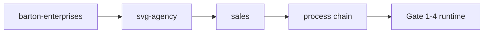
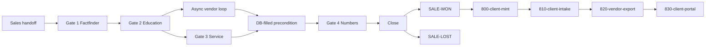

# Sales Process UT Process Chain
## Executable four-meeting sales cycle manual for the sales portal runtime and its client handoff.
### Status: BUILD
### Medium: process
### Business: svg-agency

> Legacy references: [CONSTITUTION.md](../../../Sales Process/CONSTITUTION.md), [docs/PRD.md](../../../Sales Process/docs/PRD.md), [docs/OSAM.md](../../../Sales Process/docs/OSAM.md), and [factory/sales/900-sales-portal/PROCESS.md](./900-sales-portal/PROCESS.md) are retained for history and process continuity. This UT manual is the coordinator above them.

---

## UT Checklist (Pre-Flight - per law/UT_CHECKLIST.md v1.2.0)

| # | Check | Status | Location |
|---|-------|--------|----------|
| 1 | PRD - what / why / who / scope / out-of-scope / success metric | [ ] | §2 |
| 2 | OSAM - READ / WRITE / Process Composition / Join Chain / Forbidden Paths / Query Routing filled | [ ] | §5 |
| 3 | Component Status - every dep green / amber / red with 1-line state | [ ] | §3 |
| 4 | Owner - human who fixes this at 2 AM | [ ] | §1 |
| 5 | Live Dashboard - URL or explicit "N/A" | [ ] | §3 |
| 6 | Kill Switch - exact command to stop the process | [ ] | §8 |
| 7 | Logbook - last audit verdict + date (after certification only) | [ ] | §12 |
| 8 | FCEs Attached - which FCE runs structurally back this doc | [ ] | §3c |
| 9 | BARs Referenced - every BAR this doc touches, with status | [ ] | §3d |
| 10 | LBB Subjects Fed - which LBB subject(s) this doc's session logs go to | [ ] | §3e |
| 11 | Geometry - CTB position + Hub-Spoke role + Altitude | [ ] | §1b |
| 12 | Live Verification - every numeric count, cron, URL, command, BAR status grounded against the actual system | [ ] | §9b |
| 13 | ctb_node - declared path on the Barton Enterprises CTB trunk | [ ] | §1 Identity |

---

# IDENTITY (Thing - what this IS)

## 1. IDENTITY

| Field | Value |
|-------|-------|
| ID | PROC-SALES-CHAIN |
| Name | Sales Process UT Process Chain |
| Medium | process |
| Business Silo | svg-agency |
| CTB Position | barton-enterprises/svg-agency/sales/process-chain |
| ORBT | BUILD |
| Strikes | 0 |
| Authority | inherited - CONSTITUTION.md, PRD.md, OSAM.md, and PROC-900 |
| Last Modified | 2026-04-22 |
| BAR Reference | BAR-NEW (pending) |
| Owner | Dave Barton |
| ctb_node | barton-enterprises/svg-agency/sales/process-chain |

### 1b. Geometry (Checklist item 11)

**CTB Position:** `barton-enterprises/svg-agency/sales/process-chain` - the 10k operational chain above the gate pages

**Hub-Spoke Role:** hub - the Middle where booking, transcript, checklist, vendor loop, and close logic live

**Altitude:** 10k operational



### HEIR (8 fields - Aviation Model)

| Field | Value |
|-------|-------|
| sovereign_ref | SOV-SVG-AGENCY |
| hub_id | PROC-SALES-CHAIN |
| ctb_placement | branch |
| imo_topology | middle |
| cc_layer | CC-04 |
| services | Cloudflare Workers, Cloudflare D1, Neon PostgreSQL, Doppler, Cloudflare Pages, SendGrid-style sequencer |
| secrets_provider | doppler |
| acceptance_criteria | Four meetings executable in order, portal contract matches gate state, vendor loop is async and row-based, client handoff is clean on `SALE-WON` |

### Fill Rule

The process chain must declare the runtime identity, the operational altitude, the owner, and the HEIR values that make the chain traceable.

---

## 2. PURPOSE (PRD)

### WHAT
This process chain executes the four-meeting sales cycle as one deterministic runtime. It is the muscle that turns the blueprint into live gate progression, transcript capture, and client handoff.

### WHY
Without the process chain, the hub-level blueprint is only a contract on paper. The sales portal would not mint a prospect instance, queue the gate videos, collect meeting memory, or close into the client chain.

### WHO
The sales portal runtime, Dave Barton, the sales rep, the vendor loop, and the downstream client mint/intake/export/portal chain.

### SCOPE (in)
- Execute Gate 1 through Gate 4 in order
- Queue the pre-meeting video and SendGrid-style sequence for every gate
- Capture meeting transcripts and extracted points as first-class data
- Run the async vendor pricing loop and the DB-filled precondition
- Promote `SALE-WON` into the client handoff path

### OUT-OF-SCOPE
- CRM source data mutation
- Contract generation
- Payment processing
- Legal compliance

### SUCCESS METRIC
Percent of prospects that complete all four gates with transcript memory, checklist state, and a valid close outcome.

### Fill Rule

The purpose block must state what the runtime does, what breaks without it, who depends on it, what is in scope, what is not in scope, and the single success metric.

---

## 3. RESOURCES

### Component Status Grid

| Component | HEIR (`hub_id · ctb_placement · cc_layer`) | ORBT | Light | State |
|-----------|-------------------------------------------|------|-------|-------|
| [Barton-Processes/factory/sales/900-sales-portal/PROCESS.md](./900-sales-portal/PROCESS.md) | PROC-900 · leaf · CC-04 | BUILD | green | Primary runtime executor for the sales portal |
| [Barton-Processes/factory/client/800-client-mint/PROCESS.md](../client/800-client-mint/PROCESS.md) | PROC-800 · leaf · CC-04 | BUILD | amber | Downstream mint after `SALE-WON` |
| [Barton-Processes/factory/client/810-client-intake/PROCESS.md](../client/810-client-intake/PROCESS.md) | PROC-810 · leaf · CC-04 | BUILD | amber | Downstream intake and routing after mint |
| [Barton-Processes/factory/client/820-vendor-export/PROCESS.md](../client/820-vendor-export/PROCESS.md) | PROC-820 · leaf · CC-04 | BUILD | amber | Downstream export of the client/vendor files |
| [Barton-Processes/factory/client/830-client-portal/PROCESS.md](../client/830-client-portal/PROCESS.md) | PROC-830 · leaf · CC-04 | BUILD | amber | Downstream client-facing surface |
| sales_state | SALES-SPINE · branch · CC-04 | BUILD | green | Spine table and phase router |
| meeting_checklist | SALES-CHECKLIST · branch · CC-04 | BUILD | green | One row per meeting lifecycle state |
| meeting_transcript | SALES-TRANSCRIPT · branch · CC-04 | BUILD | green | First-class meeting memory |
| meeting_points | SALES-POINTS · branch · CC-04 | BUILD | green | Meeting atoms by category |
| vendor_pricing_requests | SALES-VENDOR-REQ · branch · CC-04 | BUILD | amber | Async quote request queue |
| vendor_quote_response | SALES-VENDOR-RSP · branch · CC-04 | BUILD | amber | Parsed vendor replies |
| monte_carlo_output | SALES-MC-OUT · branch · CC-04 | BUILD | amber | Proposal output for Gate 4 |

### Live Dashboard

| Resource | URL | What it shows |
|----------|-----|---------------|
| Sales portal runtime | `app.svgagency.com/sales/:slug/:meeting` | Gate-by-gate runtime experience for the prospect |

### Dependencies

| Dependency | Type | What It Provides | Status |
|-----------|------|------------------|--------|
| `sales_state` | D1 table | Spine and phase routing | DONE |
| `meeting_checklist` | D1 table | SendGrid-style state table | DONE |
| `meeting_transcript` / `meeting_points` | D1 tables | Meeting memory and extracted points | PLANNED |
| `vendor_pricing_requests` / `vendor_quote_response` | D1 tables | Async vendor loop | PLANNED |
| `monte_carlo_input` / `monte_carlo_output` | D1 tables | Deterministic proposal numbers | PLANNED |
| `NEON_URL` | Doppler secret | Outreach snapshot seed source | DONE |
| `Cloudflare Workers` | runtime | Server-side execution | DONE |
| `Cloudflare Pages` | runtime | Prospect-facing rendering | DONE |

### Downstream Consumers

| Consumer | What It Needs |
|----------|---------------|
| 800-client-mint | `SALE-WON` handoff and the `sales_id` spine |
| 810-client-intake | Client payload, plan data, and identity rows |
| 820-vendor-export | Vendor-ready enrollments and plan outputs |
| 830-client-portal | Client-facing portal and service data |

### Tools & Integrations

| Item | Type | Cost Tier | Credentials | What It Does |
|------|------|-----------|-------------|-------------|
| Cloudflare D1 | database | Cheap | wrangler binding | Working sales data and state transitions |
| Neon PostgreSQL | vault database | Cheap | Doppler connection string | Upstream outreach snapshot reads |
| SendGrid-style sequence | messaging | Cheap | Doppler-managed sender config | Pre-meeting video queue and follow-up |
| Cloudflare Workers | runtime | Free | none | Route and execute the sales pages |
| Cloudflare Pages | surface | Free | none | Render the prospect portal |

### Secrets

| Secret | Doppler Project | Config | Used By |
|--------|----------------|--------|---------|
| `NEON_URL` | sales-navigator | dev | Outreach snapshot seeding |
| `SALES_DATABASE_URL` | imo-creator | dev | Schema references and runtime docs |

### Fill Rule

The resources section must name the runtime dependencies, the portal surface, the downstream client chain, and the secrets that make the process executable.

---

## 4. IMO - Input, Middle, Output

### Two-Question Intake
1. What triggers this? The sales handoff button or a manual request to open the portal.
2. How do we get it? Pull the `sovereign_id` from the CL pipeline or accept hand entry, then mint or resolve the `sales_id`.

### Input
- Sales handoff payload
- `sovereign_id`
- Prospect and plan data
- Meeting checklist seed
- Transcript capture stream

### Middle

| Step | Input | What Happens | Output | Tool Used |
|------|-------|-------------|--------|-----------|
| 1 | Sales handoff payload | Transpose sales data into the runtime shape | client-ready prospect instance | D1 write |
| 2 | `sovereign_id` | Mint or resolve `sales_id` | sales spine row | D1 query/write |
| 3 | Gate 1 input | Queue video 1 and the SendGrid-style sequence | factfinder runtime | portal + sequence |
| 4 | Gate 1 save | Write the checklist row, the transcript, and the meeting points | Gate 2 ready state | D1 write |
| 5 | Gate 2 fork | Run the async vendor request loop from the yes/no outcome | vendor rows | cron + D1 |
| 6 | Gate 3 input | Queue video 3 and keep the service contract locked | service runtime | portal + sequence |
| 7 | Gate 3 save | Update service state and wait for the DB-filled precondition | Gate 4 ready state | D1 write |
| 8 | Gate 4 presentation | Render Monte Carlo output and proposal numbers | `SALE-WON` / `SALE-LOST` | portal + MC output |
| 9 | `SALE-WON` | Hand off to the client mint chain | client process launch | downstream process |

### Output
- A fully executed four-meeting sales cycle
- A portal page that mirrors gate state and memory
- A clean handoff into the client chain when the sale closes

### Circle
The meeting transcript, points, checklist state, vendor responses, and portal render all feed the next gate and the next run.

### Gate Table

| Gate | Pre-meeting Artifacts | In-meeting Agenda | Post-meeting State Changes | Exit Trigger |
|------|-----------------------|------------------|----------------------------|--------------|
| Gate 1 Factfinder | Video 1 + SendGrid sequence 1 | Company facts, 4-tier data, renewal month, carrier, transcript capture | checklist row flips, factfinder rows persist, transcript points extracted | Meeting 2 booked |
| Gate 2 Education | Video 2 + sequence 2 | Twos, 90/10, sample plans, Monte Carlo demo, `quote it?` yes/no fork | vendor request rows created, education state persists | Meeting 3 booked and vendor loop started |
| Gate 3 Service | Video 3 + sequence 3 | Service model, ticketing, orchestrator, support path | service state persists, points extracted | Meeting 4 booked plus DB-filled precondition |
| Gate 4 Numbers | Video 4 + sequence 4 | Proposal presentation, deterministic numbers, close decision | `SALE-WON` or `SALE-LOST`, handoff event written if won | Close |

### Fill Rule

The IMO section must show the trigger, the source, the ordered runtime steps, the output, the feedback loop, and the gate-specific pre-meeting / in-meeting / post-meeting / exit contract.

---

## 5. DATA SCHEMA / OSAM

### READ Access

| Source | What It Provides | Join Key |
|--------|------------------|----------|
| `sales_state` | Spine, phase router, and close state | `sales_id` |
| `meeting_checklist` | Which gate is scheduled, done, or next | `sales_id` |
| `meeting_transcript` | Full meeting transcript text | `sales_id` |
| `meeting_points` | Structured meeting atoms | `sales_id` |
| `vendor_pricing_requests` | Async vendor queue rows | `sales_id` + `vendor_id` |
| `vendor_quote_response` | Parsed vendor replies | `sales_id` + `vendor_id` |
| `monte_carlo_input` | Exact proposal cells | `sales_id` |
| `monte_carlo_output` | Deterministic proposal output | `sales_id` |
| `sales_factfinder` | Gate 1 captured data | `sales_id` |
| `sales_insurance` | Gate 2 presentation data | `sales_id` |
| `sales_systems` | Gate 3 presentation data | `sales_id` |
| `sales_quotes` | Gate 4 numbers and close state | `sales_id` |

### WRITE Access

| Target | What It Writes | When |
|--------|---------------|------|
| `sales_state` | current phase, stall flags, close state | every gate transition |
| `meeting_checklist` | scheduled, video_sent, watched, done, next_booked, followup_sent | every gate event |
| `meeting_transcript` | raw transcript with timestamps | every recorded meeting |
| `meeting_points` | extracted points by category | after each meeting |
| `vendor_pricing_requests` | quote request rows | after Gate 2 yes |
| `vendor_quote_response` | parsed vendor responses | cron-driven vendor loop |
| `monte_carlo_input` | proposal cells | before Gate 4 |
| `monte_carlo_output` | proposal numbers and deltas | before Gate 4 presentation |
| `sales_factfinder` | Gate 1 capture | Gate 1 save |
| `sales_quotes` | Gate 4 close data | Gate 4 save |

### Process Composition



| Process ID | Name | Role in Composition | Status |
|-----------|------|---------------------|--------|
| PROC-900 | Sales Portal | this repo's runtime executor | BUILD |
| PROC-800 | Client Mint | downstream handoff after close | BUILD |
| PROC-810 | Client Intake | downstream routing after mint | BUILD |
| PROC-820 | Vendor Export | downstream file export after intake | BUILD |
| PROC-830 | Client Portal | downstream client-facing surface | BUILD |

### Join Chain

```text
sales handoff
  -> sales_state.sales_id
    -> meeting_checklist.sales_id
      -> sales_factfinder.sales_id
        -> sales_insurance.sales_id
          -> sales_systems.sales_id
            -> sales_quotes.sales_id
              -> monte_carlo_input.sales_id
                -> monte_carlo_output.sales_id
                  -> client_handoff.sales_id
```

### Forbidden Paths

| Action | Why |
|--------|-----|
| Cross-sub-hub direct joins | The spine is the only legal route |
| Gate 4 before the DB-filled precondition | Numbers must be settled before the proposal |
| Vendor export without parsed quote rows | The async loop must complete first |
| Portal render without transcript and checklist state | The runtime must show what actually happened |
| Mutating CRM source data | This process consumes the handoff, it does not own CRM |

### Query Routing

| Question | Table | Column |
|----------|-------|--------|
| What gate is next? | `meeting_checklist` | `next_booked` |
| What was said in the meeting? | `meeting_transcript` | `text` |
| What did the meeting extract? | `meeting_points` | `category`, `text` |
| Which vendor replies are ready? | `vendor_quote_response` | `status` |
| Are the numbers ready? | `monte_carlo_input` | completeness flags |
| What does the prospect see at Gate 4? | `monte_carlo_output` | proposal summary |
| What phase is the sale in? | `sales_state` | `current_phase` |

### Portal Render Contract

| Gate | What HR Sees |
|------|--------------|
| Gate 1 | DOL prefill, company facts, checklist state, next booking cue |
| Gate 2 | Education materials, `quote it?` yes/no fork, vendor request state |
| Gate 3 | Service map, ticketing path, transcript points, next booking cue |
| Gate 4 | Proposal numbers, Monte Carlo output, close action, sale outcome |

### Fill Rule

The data schema section must declare the runtime read surfaces, write surfaces, join spine, forbidden paths, and the exact portal routing contract for each gate.

---

## 6. DMJ - Define, Map, Join

### 6a. DEFINE

| Element | ID | Format | Description | C or V |
|---------|----|--------|-------------|--------|
| sales spine | sales_id | text spine | The join key for the whole chain | C |
| checklist row | meeting_checklist | table | One row per gate and meeting number | C |
| transcript store | meeting_transcript | table | Meeting memory with timestamps | C |
| points store | meeting_points | table | Extracted meeting atoms | C |
| vendor request | vendor_pricing_requests | table | Async request row | C |
| vendor response | vendor_quote_response | table | Async vendor reply | C |
| MC input | monte_carlo_input | table | Exact cells required for the proposal | C |
| MC output | monte_carlo_output | table | Deterministic proposal result | C |
| client_id | minted client identity | derived value | The post-close client spine | V |
| gate content | portal render state | page data | What the prospect sees | V |

### 6b. MAP

| Source | Target | Transform |
|--------|--------|-----------|
| sales handoff | `sales_id` | mint or resolve |
| Gate 1 save | checklist + transcript + points | persist |
| Gate 2 yes | vendor request rows | enqueue |
| vendor replies | quote response rows | parse |
| quote completion | Monte Carlo input | consolidate |
| MC engine | Monte Carlo output | compute |
| Gate 4 result | `sales_state` | close or stall |
| `SALE-WON` | client mint chain | handoff |

### 6c. JOIN

| Join Path | Type | Description |
|-----------|------|-------------|
| sales handoff -> sales_state -> gate tables | direct | Spine-first runtime |
| transcript -> points -> checklist | direct | Meeting memory feeds the next gate |
| vendor rows -> MC input -> output | direct | Async loop closes the numbers |
| close -> 800-client-mint -> 810-client-intake | direct | Handoff after `SALE-WON` |

### Fill Rule

Define every runtime element, map it to the right target, and join it back to the spine and the client handoff path without ad-hoc shortcuts.

---

## 7. CONSTANTS & VARIABLES

### Constants
1. Trigger ladder - meeting progression is calendar-booked by default, except vendor-dependent and precondition gates.
2. The spine - `sovereign_id` carries the company lifecycle and `sales_id` is the runtime instance.
3. Benefit class rule - the four tiers are always Employee, Employee + Spouse, Employee + Child(ren), Family.
4. C&V on factfinder - fields, formats, required flags, source priority, and verification metadata are fixed.
5. Sales = database fill - the runtime fills the cells Monte Carlo needs.
6. Monte Carlo is deterministic - it computes output from filled data.
7. Pattern of twos - 90% Plan and 10% Plan are always the framing answers.
8. Meeting pattern - four videos, four meetings, four gates.
9. The four sales gates - Factfinder, Education, Service, Numbers.
10. Vendor pricing loop - async, cron-driven, row-based, invoice-backed only.
11. Meeting checklist table - one row per `sales_id x meeting_number`.
12. Per-prospect portal page - one URL, always pushed to, past gates open, future gates locked.
13. HR-format presentation invariant - no field IDs, no JSON, no raw tables, no audit metadata.
14. Meeting minutes as first-class data - transcript and points are rendered as "What we discussed."

### Variables
- Prospect values and contact fill
- Renewal month and benefit mix
- Vendor replies and quote timing
- Transcript content and extracted points
- Current phase and stall status
- Portal content by gate state
- Proposal numbers and close outcome

### Fill Rule

Separate the fixed runtime structure from the per-prospect values that change on each execution.

---

## 8. STOP CONDITIONS

| Condition | Action |
|-----------|--------|
| Trigger cannot be stated | HALT |
| `sales_id` cannot be resolved | HALT |
| Gate order is skipped or reordered | HALT |
| Gate 4 is requested before the DB-filled precondition is met | HALT |
| Transcript or checklist state is missing | HALT |
| Vendor loop has no invoice-backed lines | HALT |
| Same stall pattern appears three times | SALE-STALLED -> Troubleshoot/Train |

### Kill Switch

```sql
UPDATE sales_state SET orbt = 'REPAIR' WHERE sales_id = ?;
```

### Fill Rule

The stop conditions section must include intake failure, routing failure, precondition failure, stall escalation, and the exact command used to freeze the hub in REPAIR.

---

## 9. VERIFICATION

1. Resolve a booking to `sales_id` and confirm the checklist row is created.
2. Save Gate 1, then confirm Gate 2 queues the next video and the vendor loop begins.
3. Confirm the portal reflects the current gate state and the meeting transcript is stored.
4. Confirm Gate 4 is blocked until the DB-filled precondition is satisfied.
5. Confirm `SALE-WON` hands off to the client mint chain and `SALE-LOST` does not.

**Three Primitives Check**
1. Thing: Do the tables and the portal surface exist?
2. Flow: Does the booking move through the four gates and the vendor loop?
3. Change: Do the phase transitions, checklist flips, and close outcomes happen correctly?

### Fill Rule

Verification must be runnable against the route, the data tables, the portal contract, and the close/handoff boundary.

---

## 10. ANALYTICS

### Metrics

| Metric | Unit | Baseline | Target | Tolerance |
|--------|------|----------|--------|-----------|
| Gate 1 to Gate 4 completion rate | % | pending | pending | set after first run |
| Vendor quote coverage | % | pending | pending | all invoice-backed lines |
| Checklist completeness | % | 0 | 100 | no missing rows |
| Transcript coverage | % | 0 | 100 | every meeting recorded |
| Stall rate | count | 0 | low and shrinking | trend only |

### Sigma Tracking

| Metric | Run 1 | Run 2 | Run 3 | Trend | Action |
|--------|-------|-------|-------|-------|--------|
| gate completion | pending | pending | pending | tighten | keep or repair |
| quote coverage | pending | pending | pending | tighten | keep or repair |
| stall rate | pending | pending | pending | tighten | keep or repair |

### ORBT Gate Rules

| From | To | Gate |
|------|-----|------|
| BUILD | OPERATE | all gates routable, checklist complete, transcripts stored, auditor sign-off |
| OPERATE | REPAIR | any gate or vendor loop breaks |
| REPAIR | OPERATE | fix verified and retransitions are clean |
| Any (Strike 3) | TROUBLESHOOT/TRAIN | repeat failure pattern -> AD |

### Fill Rule

Define the metrics first, track sigma across repeated runs, and only promote when the runtime remains stable.

---

## 11. EXECUTION TRACE

Intentionally empty during BUILD. Populated only after certification.

---

## 12. LOGBOOK (After Certification Only)

Intentionally empty during BUILD. The auditor fills the birth certificate after certification.

### Birth Certificate

| Field | Value |
|-------|-------|
| heir_ref | pending certification |
| orbt_entered | BUILD |
| orbt_exited | pending |
| action | pending auditor certification |
| gates_passed | pending |
| signed_by | pending |
| signed_at | pending |

---

## 13. FLEET FAILURE REGISTRY

| Pattern ID | Location | Error Code | First Seen | Occurrences | Strike Count | Status |
|-----------|----------|-----------|-----------|-------------|-------------|--------|
| (none) | -- | -- | -- | -- | -- | -- |

---

## 14. SESSION LOG

| Date | What Was Done | LBB Record |
|------|---------------|------------|
| 2026-04-22 | Built the sales process chain manual, wired the four gates to the client handoff chain, and declared the portal runtime contract. | pending |

---

## Document Control

| Field | Value |
|-------|-------|
| Created | 2026-04-22 |
| Last Modified | 2026-04-22 |
| Version | 1.0.0 |
| Template Version | 2.7.0 |
| Medium | process |
| US Validated | pending |
| Governing Engine | `law/doctrine/FOUNDATIONAL_BEDROCK.md` + `law/doctrine/DMJ.md` + `law/doctrine/PROCESS_FILL_INSTRUCTIONS.md` |
| Parent | `law/UNIFIED_TEMPLATE.md` |

